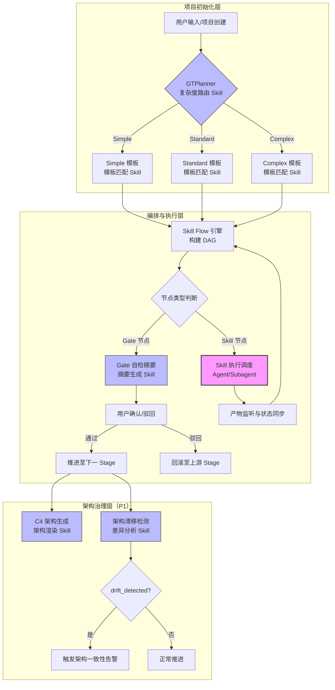
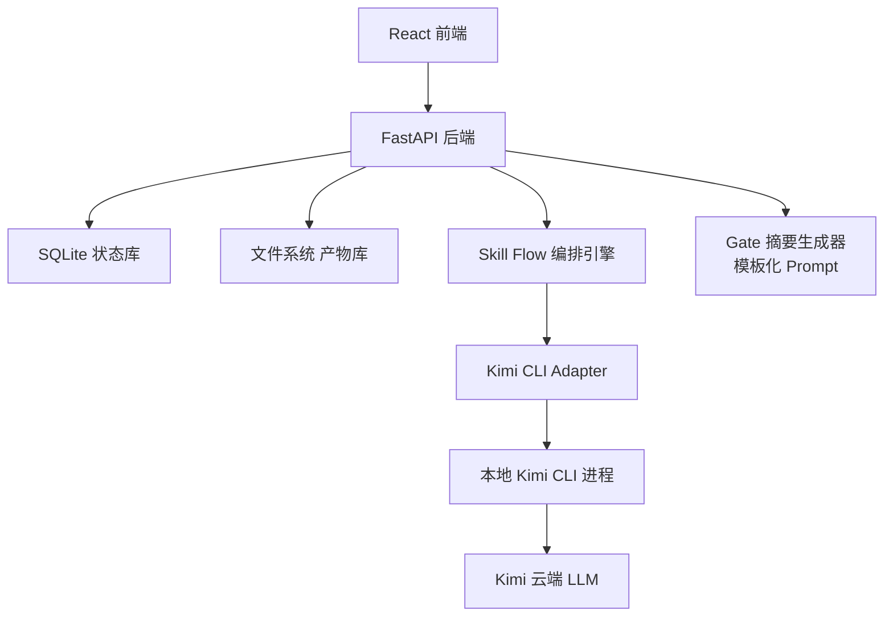
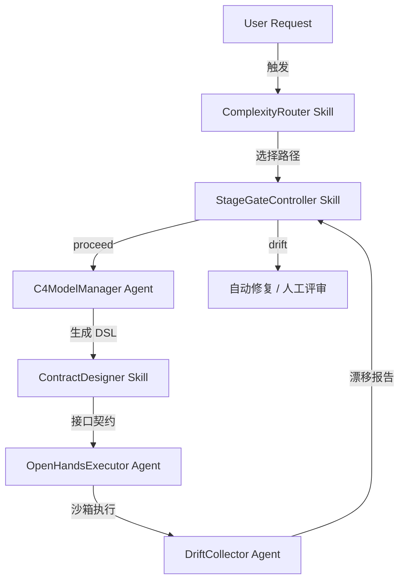

# AI Architecture Decision - sdlc-visualizer

> 版本：v1.0
> 日期：2026-06-01
> 关联文档：requirement-draft.md、openspec/config.yaml
> 适用范围：本变更涉及大模型调用、多 Skill 编排、Agent 协作与 AI 流水线，需执行 AI 原语选型分析。

---

## 1. 模块级原语映射

对每个涉及 AI 的功能模块，使用七维度评分（复杂度/复用性/上下文/安全/性能/维护/上市时间），按加权平均计算总分：

**默认权重**：复杂度 25%、复用性 20%、上下文 15%、安全 15%、性能 10%、维护 10%、上市时间 5%。

| 模块 | 复杂度 | 复用性 | 上下文 | 安全 | 性能 | 维护 | 上市时间 | **加权总分** | **原语选型** | 理由 |
|------|--------|--------|--------|------|------|------|----------|-------------|-------------|------|
| Skill 执行与状态同步（Kimi CLI Adapter） | 9 | 8 | 9 | 8 | 6 | 6 | 7 | **7.95** | Agent / Subagent | 长时间运行任务，需上下文隔离，进程管理与产物捕获复杂度高 |
| Gate 自检摘要生成 | 6 | 9 | 6 | 5 | 8 | 4 | 8 | **6.55** | Skill | 可复用领域知识库，跨 Gate 通用，输入输出明确 |
| GTPlanner 复杂度路由判定 | 6 | 5 | 7 | 3 | 7 | 6 | 7 | **5.65** | Skill | 基于规则引擎的文件数/实体数分析，流程标准化，可复用 |
| C4 架构图生成与穿透浏览 | 7 | 4 | 8 | 2 | 5 | 6 | 4 | **5.35** | Skill | DSL 解析与图渲染为标准化文档生成任务，输入（设计文档）输出（C4 图）明确 |
| 架构漂移检测 | 8 | 3 | 8 | 2 | 4 | 8 | 3 | **5.45** | Skill | 后台异步分析任务，对比历史与当前架构快照，流程可标准化 |
| 模板匹配与推荐 | 4 | 7 | 4 | 2 | 8 | 4 | 8 | **4.90** | Skill | 基于复杂度路由结果的简单匹配逻辑，规则明确 |

> **评分说明**：
> - 1-3 分 → 直接提示词（简单、一次性任务）
> - 4-6 分 → Skill（可复用领域知识库，跨项目共享）
> - 7-9 分 → Agent / Subagent（复杂自主任务，需上下文隔离）
> - 10 分 → SDK 原语（独特工作流，需细粒度控制）

### 1.1 关键结论

- **仅 1 个模块选用 Agent/Subagent**：Skill 执行与状态同步（Kimi CLI Adapter）。原因：进程级 CLI 调用涉及长时间运行、异步状态捕获、错误重试、产物监听，属于复杂自主任务，必须使用 Subagent 隔离上下文，防止主会话被阻塞或污染。
- **5 个模块选用 Skill**：Gate 摘要、复杂度路由、C4 生成、漂移检测、模板匹配。这些模块具有明确的输入输出契约、可复用的领域知识（如摘要模板、C4 DSL 规范、阈值规则），适合封装为标准化 Skill。
- **无模块需要 SDK 原语**：当前阶段无需要细粒度 LLM 控制的独特工作流。若未来需要自定义 Token 分配策略或模型路由，再评估 SDK 原语。

---

## 2. 架构模式选择

基于模块间关系，选择 **混合架构（Skill 优先 + Agent 流水线）**：

- **Skill 优先架构**：Gate 自检摘要、C4 架构生成、复杂度路由、漂移检测等模块封装为标准化 Skill，跨项目共享领域知识（如摘要模板、C4 DSL 规范）。
- **Agent 流水线架构**：Skill 执行调度使用 Agent/Subagent 模式，复杂自主任务（CLI 调用、长时间运行、状态同步）通过上下文隔离的 Subagent 完成，主会话保持轻量。
- **混合架构**：各任务使用合适工具，推荐用于本项目。

---

## 3. 上下文管理策略

### 3.1 三级上下文模型

| 层级 | 范围 | 生命周期 | 包含内容 | 管理策略 |
|------|------|----------|----------|----------|
| 项目级上下文 | 整个项目 | 项目创建至归档 | 项目配置、模板选择、历史决策、key_metrics、假设登记册 | 持久化至 SQLite，全链路只读引用 |
| 阶段级上下文 | 单个 Stage | Stage 启动至完成 | 当前激活的 Skill、输入产物清单、中间状态、Gate 决策 | 内存缓存 + SQLite 状态表，Stage 完成后压缩为摘要 |
| 任务级上下文 | 单个 Skill 执行 | CLI 调用至产物生成 | 对话历史、工具调用记录、stdout/stderr 片段、产物增量 | Subagent 隔离，执行完成后仅保留结构化结果和日志摘要 |

### 3.2 渐进式披露方案

- **Gate 自检摘要**：仅接收当前阶段产物（如 `high-level-design/` 目录下的设计文档），不接收历史阶段完整内容。摘要长度控制在 300 字以内，确保 30 秒内可阅读完毕。
- **复杂度路由**：接收 PRD/需求文档，先由规则引擎提取关键指标（文件数、实体数、跨服务标记），再将指标向量送入决策逻辑。原始文档全文不进入决策上下文，降低 Token 消耗。
- **C4 架构生成**：接收概要设计文档，由前置解析器提取模块边界、服务依赖、数据流方向，形成结构化输入后送入 C4 DSL 生成 Skill。原始设计文档仅在解析异常时人工介入查阅。

### 3.3 上下文压缩与重置规则

- **Stage 间压缩**：每个 Skill 执行完成后，生成结构化摘要（如 `stage-summary.yaml`）替代完整产物，作为下游 Skill 的输入引用。摘要包含：关键决策、风险点、待确认项、产物路径清单。
- **Agent 隔离**：长时间运行的 Skill 执行（如 `executing-plans` 批量编码）启动独立 Subagent，Subagent 上下文上限为 128K Token，超出时自动压缩历史对话（保留系统提示和最近 3 轮）。
- **项目切换重置**：用户切换项目时，主会话上下文完全重置，仅保留全局配置（如 Kimi CLI 路径、用户偏好设置），防止跨项目信息泄露。
- **Gate 决策缓存**：用户通过的 Gate 决策（含评语）缓存至项目级上下文，未来同类 Gate 可引用历史决策作为参考，但不得自动沿用（每次 Gate 必须独立确认）。

---

## 4. 安全边界

### 4.1 工具权限白名单

| 组件 | 允许操作 | 禁止操作 | 说明 |
|------|----------|----------|------|
| Kimi CLI Adapter | 执行 `kimi` 命令及白名单参数；读取指定产物目录 | 任意 Shell 命令（`rm`, `curl`, `wget`, `sudo` 等）；网络请求；文件系统写操作（除指定产物目录外） | Adapter 层通过 `subprocess` 严格限制命令解析，非白名单命令直接拒绝 |
| 产物服务 | 读写 `openspec/changes/{change}/` 目录；生成产物文件 | 删除非本项目目录；修改 `.git` 目录；写入系统路径 | 通过路径前缀校验实现沙箱 |
| Gate 服务 | 读取产物内容；生成摘要；写入决策记录 | 修改产物内容；执行外部命令 | 纯只读分析 + 决策记录写入 |

### 4.2 敏感操作确认机制

以下操作必须触发用户显式确认（二次弹窗或输入框）：

- **产物写回**：平台内编辑产物后点击保存，且检测到外部文件已被修改（文件系统优先策略下，提示"外部已变更，确认覆盖？"）。
- **Gate 确认通过**：用户点击"确认通过"时，若 AI 摘要标记了高风险项，需额外勾选"我已知晓风险并确认继续"。
- **模板变更**：已创建项目的模板被管理员修改后，用户选择是否升级到新模板（保留旧模板快照或迁移）。
- **项目删除**：删除项目及其所有产物，需输入项目名称二次确认。
- **Skill 强制终止**：用户手动终止正在执行的 Skill，需确认终止原因（用于后续统计）。

### 4.3 数据安全

- **本地优先**：所有产物、项目数据、执行日志存储于用户本地文件系统/SQLite，不上传至任何云端服务。
- **API Key 隔离**：平台本身不存储 LLM API Key，Kimi CLI 的认证由 CLI 自身管理（读取用户主目录下的 `.kimi/config`）。
- **产物隔离**：不同项目的工作目录物理隔离（`openspec/changes/{project-id}/`），禁止跨项目文件引用（除非显式导入共享产物）。

---

## 5. 与 rollback-plan.md 的衔接

### 5.1 AI 模型错误触发回滚的条件

| 错误场景 | 检测方式 | 回滚目标 | 回滚粒度 |
|----------|----------|----------|----------|
| Gate 摘要误判风险等级（如将高风险设计缺陷标记为低风险） | 用户人工发现或下游 Skill 执行异常 | 回滚至当前 Gate 前驱 Stage | Stage 级 |
| 复杂度路由误判（如 Simple 项目被路由到 Complex 模板） | 用户手动覆盖模板选择，或执行过程中发现阶段过多 | 回滚至项目初始化/模板选择节点 | 项目配置级 |
| Skill 执行失败（如 PRD 生成产物不符合 schema 或产物为空） | 产物校验规则 + Skill 退出码非零 | 回滚至上游 Stage（如 brainstorming）或重试当前 Stage | Stage 级 |
| C4 架构生成与概要设计文档严重不符（如遗漏核心服务） | 架构一致性校验规则（服务清单比对） | 回滚至 high-level-design 或 detailed-design | Stage 级 |
| 架构漂移检测发现未登记的重大变更 | 漂移检测 Skill 输出 `drift_level: critical` | 触发告警，建议回滚至上次架构基线 | 架构快照级 |
| AI 生成产物包含硬编码密钥或敏感信息 | self-check Skill 的密钥扫描规则 | 阻断当前 Stage，要求重新执行 | Stage 级 |

### 5.2 回滚实现机制

- **阶段级回滚**：Skill Flow 引擎支持 `rollbackTo: stage-id` 语义，回滚时清理当前 Stage 及下游所有 Stage 的产物和状态，恢复上游 Stage 的 Waiting 或 Completed 状态。
- **产物版本快照**：每次 Stage 完成时，产物目录自动创建基于 Git 的轻量级快照（或本地备份副本），回滚时快速恢复。
- **状态机保护**：回滚操作必须经过 Gate 确认（即使是自动触发的回滚，也需用户确认"是否接受回滚建议"），防止 AI 误判导致无意义的回滚。

### 5.3 AI 回滚与人工回滚的协作

- **AI 建议回滚**：当检测到上述错误场景时，平台生成回滚建议书（含错误原因、回滚目标、影响范围），推送至 Gate Center 等待用户确认。
- **人工强制回滚**：用户可在画布上右键任意已完成节点，选择"回滚至此节点"，平台自动计算影响范围并二次确认。
- **回滚审计**：所有回滚操作（含 AI 建议和人工触发）记录至 `human-decisions.md`，标注触发原因、回滚目标、恢复耗时。

---

## 6. 下游衔接

本文档自动作为 `prd-generation` 的输入之一，影响 `05-non-functional.md` 中的 AI 架构需求章节：

- **模型延迟**：Gate 摘要生成需在 5 秒内完成（轮询模式），要求 Kimi CLI 或未来 Adapter 支持快速响应。
- **Token 成本**：复杂度路由采用规则引擎而非 LLM 深度分析，降低 Token 消耗；C4 架构生成采用结构化输入而非全文设计文档，减少上下文长度。
- **并发限制**：Agent/Subagent 级别的 Skill 执行需限制并行度（默认 4），防止本地资源耗尽。
- **上下文窗口**：Subagent 上下文上限 128K Token，超出时自动压缩，需在 NFR 中明确性能指标。

---

## 附录：历史补充内容（来自 docs/ 目录）

> 以下内容来自 docs/ 目录下的历史版本，包含主文档中未覆盖的视角或早期草稿。

> 生成时间：2026-05-31 14:54
> 基于：requirement-draft.md 模块初分
> 适用性声明：本项目为 AI 编排平台（非 AI 原生应用），AI 组件主要承担"辅助总结"和"外部 Skill 调用代理"角色。传统软件模块占主体。

## 模块级原语映射

对每个涉及 AI 的模块，使用七维度评分（复杂度/复用性/上下文/安全/性能/维护/上市时间），按加权平均计算总分：

| 模块 | 复杂度 25% | 复用性 20% | 上下文 15% | 安全 15% | 性能 10% | 维护 10% | 上市时间 5% | 总分 | 原语选型 | 说明 |
|------|-----------|-----------|-----------|---------|---------|---------|------------|------|----------|------|
| Skill 执行调度（Kimi CLI 调用） | 3 | 2 | 2 | 3 | 2 | 2 | 2 | 2.40 | 直接提示词/脚本 | 直接调用本地 CLI，无复杂 Prompt 工程 |
| Gate 自检摘要生成 | 2 | 3 | 2 | 2 | 2 | 2 | 3 | 2.25 | Skill（模板化 Prompt） | 基于产物规则生成结构化摘要，Prompt 可复用 |
| 失败模式自动分类 | 3 | 3 | 3 | 2 | 2 | 3 | 3 | 2.75 | Skill | 对 Skill 失败日志做模式匹配+轻量 AI 分类 |
| 产物质量预检（代码/文档） | 2 | 2 | 2 | 2 | 2 | 2 | 2 | 2.00 | 直接提示词/规则引擎 | 以规则校验为主，AI 为辅 |

**原语选型结论**：
- 1-3 分：直接提示词 / 规则引擎 / 脚本（简单、一次性任务）
- 4-6 分：Skill（可复用领域知识库）
- 7-9 分：Agent / Subagent（复杂自主任务）
- 10 分：SDK 原语（独特工作流）

本平台所有 AI 相关模块评分均 <= 3，属于轻量级 AI 增强，**不引入 Agent/Subagent 架构**。平台主体为传统 Web 应用。

## 架构模式选择

**推荐模式：传统应用 + 外部 AI 工具代理**

- **不采用 Agent 流水线架构**：平台本身不做自主决策，所有 AI 执行由用户触发（通过点击画布节点或流水线自动调度），状态流转由确定性状态机控制。
- **不采用 Skill 优先架构**：平台不是 AI 对话应用，无需复用对话式 Prompt 模板。仅有的 2 个 Prompt 场景（Gate 摘要、失败分类）直接以内置模板形式管理。

## 上下文管理策略

本平台不涉及长对话上下文管理，但涉及以下上下文隔离：

1. **Skill 执行上下文隔离**：每个 Skill 执行实例拥有独立的工作目录（`{basePath}/.tmp/{execution-id}/`），输入产物挂载为只读，输出产物写入独立目录，防止并行 Skill 间文件污染。
2. **Gate 摘要上下文**：摘要生成器仅接收当前阶段产物的前 5000 字 + 关键元数据（状态/耗时/失败原因），不加载历史全量对话，控制 Token 消耗。
3. **流水线全局上下文**：`skill-flow.yaml` 中定义的 `env` 全局变量和 `metadata` 作为只读全局上下文，注入每个 Skill 执行环境。

## 安全边界

| 维度 | 策略 |
|------|------|
| 工具权限白名单 | Kimi CLI Adapter 仅允许执行白名单内的命令（`kimi skill run {name} --input {dir}`），禁止任意 shell 执行。 |
| 敏感操作确认 | Skill 执行涉及文件覆盖、删除操作前，必须在 UI 弹窗确认（尤其是 `executing-plans` 和 `finish` 阶段）。 |
| 密钥管理 | 平台本身不存储 LLM API Key。Kimi CLI 的认证由 CLI 自身管理（如 `~/.kimi/config`）。平台仅调用 CLI，不触碰密钥。 |
| 产物审查 | Gate 摘要生成器不得泄露其他项目的产物内容，摘要 Prompt 中必须限定"仅分析当前阶段产物"。 |

## 与 rollback-plan.md 的衔接

- **AI 模型错误触发回滚的条件**：当 Kimi CLI 执行 Skill 返回非零退出码且重试失败时，触发 `onError` 策略（默认 rollback 到上一非 Gate 阶段）。
- **AI 生成产物损坏的恢复**：每个 Skill 执行前自动快照上一阶段产物目录，rollback 时恢复快照。
- **Gate 摘要误导用户的缓解**：摘要生成器输出必须附带置信度标签（"高/中/低"），低置信度摘要时强制要求用户查看原始产物，不可一键通过。

## 下游衔接

本文档自动作为 `prd-generation` 的输入之一，影响 `05-non-functional.md` 中的 AI 架构需求章节：
- Kimi CLI 调用延迟：本地进程启动约 1-3s， Skill 执行耗时取决于具体任务（脑暴 5-10min，编码 30min+）。
- Token 成本：由 Kimi CLI / 用户账户承担，平台仅做统计展示，不产生额外成本。
- 并发限制：MVP 阶段单进程调度，全局并发度设为 2（避免本地机器资源耗尽）。

---

## 附录：adaptive-architecture-engine 补充内容

> 以下内容来自 adaptive-architecture-engine 变更目录的历史版本。

# AI Architecture Decision - adaptive-architecture-engine

## 原语选型总览

本项目涉及大量 AI 调用（LLM 需求解析、架构生成、代码生成、审查、验证），需为每个模块选择合适的 AI 原语。

### 1. ComplexityRouter（复杂度路由）

| 维度 | 评分 (1-10) | 权重 | 加权分 |
|------|-------------|------|--------|
| 复杂度 | 5 | 25% | 1.25 |
| 复用性 | 8 | 20% | 1.60 |
| 上下文 | 4 | 15% | 0.60 |
| 安全 | 3 | 15% | 0.45 |
| 性能 | 6 | 10% | 0.60 |
| 维护 | 7 | 10% | 0.70 |
| 上市时间 | 5 | 5% | 0.25 |
| **总分** | | | **5.45** |

**选型：Skill**

理由：复杂度路由是可复用的领域知识库，规则相对固定（信号权重、阈值表），适合封装为可共享的 Skill。上下文需求低，不需要 Agent 级别的自主决策。

### 2. C4ModelManager（C4 DSL 管理）

| 维度 | 评分 (1-10) | 权重 | 加权分 |
|------|-------------|------|--------|
| 复杂度 | 8 | 25% | 2.00 |
| 复用性 | 6 | 20% | 1.20 |
| 上下文 | 8 | 15% | 1.20 |
| 安全 | 5 | 15% | 0.75 |
| 性能 | 5 | 10% | 0.50 |
| 维护 | 6 | 10% | 0.60 |
| 上市时间 | 6 | 5% | 0.30 |
| **总分** | | | **6.55** |

**选型：Agent / Subagent**

理由：涉及架构生成、反向工程、影响分析等多步自主任务，需要上下文隔离。正向渲染和反向扫描可并行执行，适合 Subagent 模式。

### 3. DriftCollector（架构漂移检测）

| 维度 | 评分 (1-10) | 权重 | 加权分 |
|------|-------------|------|--------|
| 复杂度 | 8 | 25% | 2.00 |
| 复用性 | 5 | 20% | 1.00 |
| 上下文 | 7 | 15% | 1.05 |
| 安全 | 7 | 15% | 1.05 |
| 性能 | 6 | 10% | 0.60 |
| 维护 | 6 | 10% | 0.60 |
| 上市时间 | 5 | 5% | 0.25 |
| **总分** | | | **6.55** |

**选型：Agent / Subagent**

理由：需要对比设计架构与实际架构，生成差异报告，可能触发自动修复流程。涉及多轮 LLM 调用（解析 YAML、对比结构、生成报告）。

### 4. PrototypeVerifier（原型验证 + DSL 回写）

| 维度 | 评分 (1-10) | 权重 | 加权分 |
|------|-------------|------|--------|
| 复杂度 | 7 | 25% | 1.75 |
| 复用性 | 4 | 20% | 0.80 |
| 上下文 | 6 | 15% | 0.90 |
| 安全 | 6 | 15% | 0.90 |
| 性能 | 5 | 10% | 0.50 |
| 维护 | 5 | 10% | 0.50 |
| 上市时间 | 6 | 5% | 0.30 |
| **总分** | | | **5.65** |

**选型：Skill**

理由：原型验证流程标准化（检查接口覆盖度、对比 DSL、回写差异），规则明确。但涉及 OpenUI 调用，可能需要升级为 Agent。

### 5. OpenHandsExecutor（沙箱执行器封装）

| 维度 | 评分 (1-10) | 权重 | 加权分 |
|------|-------------|------|--------|
| 复杂度 | 6 | 25% | 1.50 |
| 复用性 | 7 | 20% | 1.40 |
| 上下文 | 5 | 15% | 0.75 |
| 安全 | 9 | 15% | 1.35 |
| 性能 | 5 | 10% | 0.50 |
| 维护 | 6 | 10% | 0.60 |
| 上市时间 | 5 | 5% | 0.25 |
| **总分** | | | **6.35** |

**选型：Agent / Subagent**

理由：涉及外部 Docker 服务调用、会话管理、轮询、结果提取，需要自主处理异常和超时。安全级别高，需要上下文隔离。

### 6. StageGateController（门控流转）

| 维度 | 评分 (1-10) | 权重 | 加权分 |
|------|-------------|------|--------|
| 复杂度 | 5 | 25% | 1.25 |
| 复用性 | 9 | 20% | 1.80 |
| 上下文 | 4 | 15% | 0.60 |
| 安全 | 8 | 15% | 1.20 |
| 性能 | 7 | 10% | 0.70 |
| 维护 | 7 | 10% | 0.70 |
| 上市时间 | 6 | 5% | 0.30 |
| **总分** | | | **6.55** |

**选型：Skill**

理由：门控规则是高度可复用的工程纪律，状态流转逻辑固定。安全要求高但规则明确，Skill 足以胜任。

**推荐模式：混合架构（Skill 优先 + Agent 流水线）**

### 渐进式披露方案

1. **Trivial 路径**：只暴露代码上下文（文件路径 + 变更 diff），不加载架构文档。
2. **Light 路径**：暴露 C4 Container 一层 + 相关接口契约。
3. **Standard 路径**：暴露完整 C4 模型 + 技术栈 + 接口契约 + 历史决策。
4. **Deep 路径**：暴露全量上下文 + 竞品分析 + 市场定位 + 多方案对比。

### 上下文压缩/重置规则

- **Token 上限**：单轮 LLM 调用不超过 120K tokens（Claude 3.5 Sonnet 上下文）。
- **压缩触发**：当上下文超过 80K tokens 时，自动触发摘要压缩，保留关键决策点和数据口径。
- **重置节点**：每次 Stage Gate 通过后，丢弃上游探索性上下文，只保留 Gate 签字文档和最终决策。

### 工具权限白名单

| 工具/服务 | Trivial | Light | Standard | Deep |
|-----------|---------|-------|----------|------|
| 本地文件读写 | 是 | 是 | 是 | 是 |
| Git commit/push | 否 | 否 | 需确认 | 需确认 |
| Docker API 调用 | 否 | 否 | 否 | 是（OpenHands） |
| 外部 HTTP API | 否 | 否 | 是（OpenUI） | 是（OpenHands + OpenUI） |
| C4 InterFlow CLI | 否 | 是 | 是 | 是 |

### 敏感操作确认机制

- **架构 DSL 修改**：任何对 `arsitect.aac.yml` 的写入操作需二次确认。
- **沙箱结果合并**：OpenHands 生成的代码必须通过 PR + 代码审查后方可合并。
- **Gate 跳过拦截**：`progress-tracker` 监控到跳过 Gate 时，强制阻断并告警。

## 回滚衔接

### AI 模型错误触发回滚的条件

1. **架构生成错误**：C4ModelManager 生成的 DSL 无法通过 C4 InterFlow CLI 验证（语法错误）。
2. **漂移检测误报**：连续 3 次架构漂移报告被人工判定为误报，自动降级 DriftCollector 的敏感度。
3. **沙箱执行失败**：OpenHands 连续 2 次无法完成 Context Package 任务（超时或崩溃），自动回退到 Claude Code 本地执行。
4. **路由误判**：ComplexityRouter 连续 5 次将 Deep 需求判定为 Light，自动回退到 Standard 默认路径。

### 回滚方案索引

- 架构 DSL 回滚：通过 Git 历史恢复 `arsitect.aac.yml`。
- 执行器回滚：切换 OpenHands -> Claude Code -> Aider 的降级链。
- 路由回滚：修改 `complexity_router.py` 阈值配置文件，无需重启。
