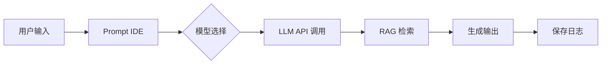
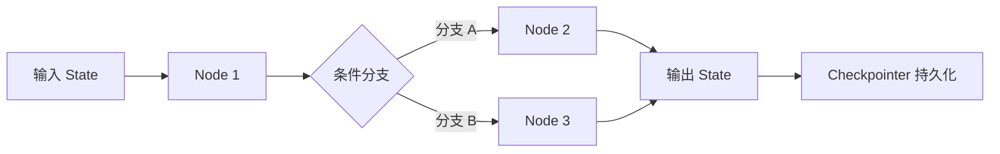
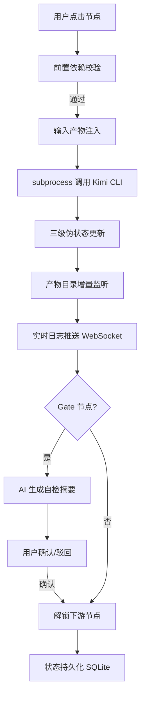

# 技术深度竞品分析报告 — SDLC Visualizer

> **模式**：technical
> **分析目标**：AI 辅助软件开发全生命周期可视化驾驶舱
> **日期**：2026-05-31
> **基准文档**：`openspec/changes/sdlc-visualizer/high-level-requirements/00-requirements-overview.md`

---

## 1. 竞争集合

### Primary（直接竞品）

| 竞品 | 核心定位 | 技术栈 | 与本系统重叠度 |
|------|---------|--------|---------------|
| **Dify** | 生产级 LLM 应用开发与运维平台（BaaS + LLMOps） | Python/Flask + Next.js + PostgreSQL + Weaviate/pgvector | 中（可视化编排 + 产物管理） |
| **LangGraph + LangGraph Studio** | 图状态机 Agent 编排框架 + 调试/检查工具 | Python + React (LangSmith) + Checkpointer | 中（状态机 + 执行追踪 + 可视化） |
| **CrewAI + CrewAI Studio** | 角色化多 Agent 编排框架 + Flow 可视化 | Python + SQLite/Chroma/Qdrant | 中（工作流编排 + 可视化 + HITL） |

### Secondary（相邻扩展）

| 竞品 | 核心定位 | 与本系统关系 |
|------|---------|-------------|
| **Flowise** | 可视化 LangChain 工作流构建器 | 低代码 AI 编排，无 SDLC 语义 |
| **n8n** | 工作流自动化平台（已扩展 AI 节点） | 通用自动化，非软件工程特定 |
| **JoySafeter（京东开源）** | 企业级 AI Agent 平台 | 基于 LangGraph，Event-sourced 生命周期，有参考价值 |
| **AutoGen Studio** | 多 Agent 对话编排调试工具 | 微软研究项目，对话模式为主 |

### Non-obvious（范式威胁）

| 替代方案 | 说明 | 威胁评估 |
|----------|------|----------|
| **IDE 内置 AI 面板**（Cursor/Windsurf/Copilot） | IDE 可能直接集成 SDLC 可视化，形成平台锁定 | 中 — 但 Cursor 等目前聚焦代码生成，未覆盖完整 SDLC |
| **Arsitect CLI 原生增强** | 若 Kimi CLI 自身增加进度/产物管理命令行界面 | 低 — CLI 交互模型与 GUI 可视化是互补而非替代 |
| **Notion/Jira + AI 插件** | 通用项目管理工具通过 AI 插件覆盖部分需求 | 低 — 无 Skill 语义，无法解析 SKILL.md Frontmatter 和 DAG 依赖 |

---

## 2. 角色数据模型设计对比

### 2.1 实体定义对比

| 实体 | Dify (T3) | LangGraph (T1) | CrewAI Flow (T3) | **本系统决策** |
|------|-----------|----------------|------------------|---------------|
| **顶层组织** | App（应用） | Graph（图定义） | Flow（流程定义） | **Workspace → Application → Project** 三级嵌套 |
| **执行单元** | Node（工作流节点） | Node（状态图节点） | Crew（Agent 团队） | **Module/Phase/SkillExecution** 三级嵌套 |
| **状态容器** | Conversation / Message | State（TypedDict/Pydantic） | Flow State（dict/Pydantic） | **Change 状态机 + Node 状态机** 双轨 |
| **产物/输出** | Message / Document / Chunk | State Snapshot | Task Output | **Artifact（本地文件系统）** |
| **知识/上下文** | Knowledge（向量库） | Thread（执行上下文） | Memory（short/long/entity） | **产物目录继承 + Skill 输入注入** |
| **审批/人工** | 无原生 HITL | 有限（interrupt 节点） | Feedback Pause | **Gate 节点 + AI 摘要 + 快速确认** |

### 2.2 ER 图对比

**Dify 核心模型** (T2)
```
App ||--o{ Workflow ||--o{ Node ||--o{ Edge
App ||--o{ Knowledge ||--o{ Document ||--o{ Chunk
Node }o--o{ Tool
```

**LangGraph 核心模型** (T1)
```
Graph ||--o{ Node
Graph ||--o{ Edge
Thread ||--|| State
State ||--o{ Checkpointer
```

**CrewAI 核心模型** (T3)
```
Flow ||--o{ Crew ||--o{ Agent ||--o{ Task
Agent }o--o{ Tool
Flow ||--|| State
Agent ||--o{ Memory
```

**本系统核心模型（PRD 已定义）**
```
Workspace ||--o{ Application ||--o{ Project ||--o{ Module
Project ||--o{ Phase ||--o{ SkillExecution ||--o{ Artifact
Project ||--o{ ExecutionLog
Project ||--o{ HITLRecord
SkillExecution ||--o{ TracingSpan
```

### 2.3 数据模型决策依据

| 设计决策 | 竞品参考 | 本系统选择 | 理由 |
|----------|----------|-----------|------|
| 三级项目嵌套（Workspace/Application/Project） | Dify 的 App/Workflow 双层 | 扩展为三层 | 匹配 Arsitect 四层空间模型 (T2)，Application 级沉淀历史迭代 |
| 产物存储用文件系统而非数据库 BLOB | Dify 用向量库存文档 | 本地文件系统兼容 openspec 目录 | 产物需被外部工具（IDE/Git）直接访问，数据库存储增加不必要的序列化成本 (T4) |
| 状态双轨（Change + Node） | LangGraph 单 State 对象 | 分离项目级与节点级状态 | 项目级状态（Draft/Active/Completed）生命周期长，节点级状态（IN_PROGRESS/BLOCKED）变化频繁，分离可降低锁竞争 (T4) |
| 无内置向量知识库 | Dify/CrewAI 均内置 RAG | 不内置，依赖外部 Skill 产物 | 本系统不生成知识型内容，产物为结构化文档（Markdown/YAML），全文检索可用 SQLite FTS (T4) |

---

## 3. 核心功能流程对比

### 3.1 主链路流程

| 流程阶段 | Dify | LangGraph Studio | CrewAI Studio | **本系统** |
|----------|------|-----------------|---------------|-----------|
| **创建项目** | 选择 App 类型 → 配置模型 → 编排工作流 | 定义 Graph → 配置 State → 编译 | 定义 Flow → 配置 Crew → 分配 Agent | **创建 Project → 选择模板 → Triage 规模评估 → 进入 Draft** |
| **执行触发** | 用户点击运行 / API 调用 | 代码调用 `graph.invoke()` | `crew.kickoff()` / `flow.start()` | **用户点击节点 → 注入输入产物 → subprocess 调用 Kimi CLI** |
| **执行中** | 节点级日志 + Token 消耗 | 状态快照 + Time-travel | Flow 状态更新 + 任务日志 | **三级伪状态 + 产物增量监听 + 实时日志面板** |
| **执行完成** | 输出 Message + 保存日志 | 返回最终 State | 返回 Task Output | **产物写入 openspec 目录 → 节点状态更新 → 下游解锁校验** |
| **审批节点** | ❌ 无 | ⚠️ interrupt 节点（代码级） | ✅ Feedback Pause | ✅ **Gate 节点 → AI 摘要 → 快速确认/驳回/重试** |
| **产物浏览** | 对话历史 + 知识库文档 | State 快照（JSON） | 任务输出列表 | ✅ **多模态渲染（Markdown/Mermaid/Swagger/YAML）** |

### 3.2 状态机对比

| 维度 | LangGraph (T1) | CrewAI Flow (T3) | **本系统** |
|------|----------------|------------------|-----------|
| **状态粒度** | Graph-level State（所有节点共享） | Flow-level State（步骤间传递） | **Project-level（Change）+ Node-level（SkillExecution）双轨** |
| **持久化** | Checkpointer（SQLite/PostgreSQL/Redis） | SQLite 默认 | **SQLite（状态）+ 文件系统（产物）** |
| **恢复能力** | Time-travel（任意状态回滚） | Flow 重启从断点继续 | **异常重试 1 次 + 孤儿进程扫描回退** |
| **并行调度** | 原生支持（`Send` API） | `@start` 多入口 + `and_` | **DAG 拓扑排序 + 无依赖节点并行** |
| **条件分支** | `add_conditional_edges` | `@router` 装饰器 | **YAML `condition` 表达式** |

### 3.3 Mermaid 流程图：执行链路对比

**Dify 执行链路**


**LangGraph 执行链路**


**本系统执行链路（SDLC Visualizer）**


---

## 4. 技术选型对比

### 4.1 全栈技术栈对比

| 层级 | Dify (T2) | LangGraph Studio (T1) | CrewAI Studio (T3) | **本系统（PRD 锁定）** |
|------|-----------|----------------------|-------------------|----------------------|
| **前端框架** | Next.js 14 (React) | React (LangSmith UI) | React / TBD | **React 19 + Vite 6** |
| **画布/可视化** | 自研节点编辑器 | 自研追踪视图 | 自研 Flow 图 | **React Flow 12** |
| **状态管理** | Redux / Context | 无（服务端驱动） | Flow State (Python) | **Zustand 5** |
| **后端框架** | Flask (Python) | Python (LangChain 生态) | Python | **FastAPI 0.115** |
| **ORM** | SQLAlchemy | 无直接 ORM | 无直接 ORM | **SQLAlchemy 2.0** |
| **数据库** | PostgreSQL + Weaviate/pgvector | SQLite/PostgreSQL/Redis (Checkpointer) | SQLite/Chroma/Qdrant | **SQLite (MVP) → PostgreSQL (P1)** |
| **WS 实时** | 未公开 | LangSmith 实时推送 | 未公开 | **python-socketio 5** |
| **AI 调用** | 多模型 API 直连 | LangChain 统一封装 | LangChain 统一封装 | **Kimi CLI subprocess** |
| **产物存储** | 对象存储 / 数据库 | State Snapshot (序列化) | 内存 / SQLite | **本地文件系统** |
| **可观测性** | 基础日志 + Token 使用 | LangSmith / OpenTelemetry | Langfuse / Phoenix | **自建指标体系 + 实时日志** |
| **部署** | Docker / K8s / SaaS | 库形式嵌入应用 | Python 包 / CLI | **本地单机可执行** |

### 4.2 核心组件选型评分表

#### 画布组件

| 候选方案 | 扩展性 | 成本 | 团队熟悉度 | 生态成熟度 | 与本项目契合度 | 加权总分 | 推荐 |
|----------|--------|------|-----------|-----------|--------------|---------|------|
| React Flow 12 | 5 | 5 | 4 | 5 | 5 | **4.80** | ★ 推荐 |
| AntV X6 | 5 | 5 | 3 | 4 | 4 | 4.25 | 备选 |
| LogicFlow | 4 | 5 | 3 | 3 | 3 | 3.65 | 备选 |
| 自研 Canvas | 2 | 2 | 2 | 1 | 2 | 1.85 | 不推荐 |

> **理由**：React Flow 原生 React 集成，支持分组/泳道，TypeScript 友好，社区活跃 (T2)。X6 更偏向通用图编辑，SDLC 拓扑图不需要复杂的泳道之外的高级图编辑功能。

#### 状态管理（前端）

| 候选方案 | 扩展性 | 成本 | 团队熟悉度 | 生态成熟度 | 与本项目契合度 | 加权总分 | 推荐 |
|----------|--------|------|-----------|-----------|--------------|---------|------|
| Zustand 5 | 4 | 5 | 4 | 4 | 5 | **4.40** | ★ 推荐 |
| Redux Toolkit | 5 | 3 | 4 | 5 | 4 | 4.25 | 备选 |
| Jotai | 4 | 5 | 3 | 3 | 4 | 3.80 | 备选 |

> **理由**：Zustand API 极简，TypeScript 友好，无样板代码，适合中小型应用 (T2)。本项目画布状态与服务器状态分离，不需要 Redux 的全局状态机能力。

#### 数据库（MVP 阶段）

| 候选方案 | 扩展性 | 成本 | 团队熟悉度 | 生态成熟度 | 与本项目契合度 | 加权总分 | 推荐 |
|----------|--------|------|-----------|-----------|--------------|---------|------|
| SQLite | 2 | 5 | 5 | 5 | 5 | **4.10** | ★ 推荐（MVP） |
| PostgreSQL | 5 | 4 | 4 | 5 | 4 | 4.45 | ★ 推荐（P1+） |
| MySQL | 4 | 4 | 4 | 5 | 3 | 4.00 | 不推荐 |

> **理由**：MVP 阶段零运维、本地单机部署是核心约束 (T1)。SQLite 满足 10 并发项目上限，P1 后迁移至 PostgreSQL 已在 PRD 演进路线中明确。

#### CLI 调用方式

| 候选方案 | 扩展性 | 成本 | 团队熟悉度 | 生态成熟度 | 与本项目契合度 | 加权总分 | 推荐 |
|----------|--------|------|-----------|-----------|--------------|---------|------|
| asyncio subprocess | 3 | 5 | 5 | 5 | 5 | **4.55** | ★ 推荐 |
| HTTP API (Kimi API) | 4 | 4 | 4 | 4 | 2 | 3.60 | 不推荐 |
| MCP 协议 | 4 | 3 | 2 | 2 | 3 | 2.90 | 未来（P3） |

> **理由**：Kimi CLI 是命令行工具，非 HTTP 服务。subprocess 是唯一可行的调用方式 (T1)。MCP 协议在 P3 演进路线中评估。

#### 产物存储

| 候选方案 | 扩展性 | 成本 | 团队熟悉度 | 生态成熟度 | 与本项目契合度 | 加权总分 | 推荐 |
|----------|--------|------|-----------|-----------|--------------|---------|------|
| 本地文件系统 | 2 | 5 | 5 | 5 | 5 | **4.10** | ★ 推荐 |
| SQLite BLOB | 3 | 5 | 4 | 4 | 2 | 3.55 | 不推荐 |
| MinIO (S3 API) | 5 | 3 | 3 | 4 | 3 | 3.80 | P2 评估 |

> **理由**：产物需被 IDE/Git 直接访问，文件系统是最自然的存储介质 (T4)。openspec 目录结构已定义，兼容性优先。

---

## 5. 集成方式对比

| 维度 | Dify | LangGraph | CrewAI | **本系统** |
|------|------|-----------|--------|-----------|
| **API 风格** | RESTful + WebSocket | Python 库函数调用 | Python 库函数调用 | **RESTful (FastAPI) + WebSocket (Socket.IO)** |
| **外部集成** | 插件市场（v1.0 生态） | LangChain 生态（400+ 集成） | LangChain 工具兼容 | **Kimi CLI 单一平台（MVP）** |
| **扩展机制** | 插件（Tool/Model/Strategy） | 自定义 Node + Edge | 自定义 Tool + Agent | **Skill 动态注册（SKILL.md + meta.json）** |
| **部署集成** | Docker / K8s / AWS AMI | 嵌入应用代码 | Python 包 / CLI | **本地可执行 + 产物目录兼容** |
| **产物导出** | API / 知识库下载 | State 序列化 JSON | 任务输出文件 | **openspec 标准目录结构** |

**关键差异**：
- Dify/LangGraph/CrewAI 均以**库/平台**形态存在，开发者需将业务逻辑适配到它们的抽象中。
- 本系统以**工具/驾驶舱**形态存在，不替代 Kimi CLI 的执行能力，而是**外部化管理**其执行过程与产物。

---

## 6. 7 Powers 热图

> 评估各竞品在 7 个护城河维度上的强度，以及本系统的差异化空间。

| 维度 | Dify | LangGraph | CrewAI | **本系统机会** |
|------|------|-----------|--------|---------------|
| **规模经济** | 🟡 中（云托管成本优势） | 🔴 低（开源库，无规模效应） | 🔴 低（开源库） | 🔴 低（MVP 单机，无规模效应） |
| **网络效应** | 🟡 中（插件生态 + 社区） | 🟡 中（LangChain 生态网络） | 🔴 低（较新，社区较小） | 🔴 低（独立工具，无网络效应） |
| **反定位** | 🟡 中（低代码降低开发者门槛） | 🟢 高（图状态机模型独特） | 🟡 中（角色化抽象独特） | 🟢 高（SDLC 语义层独特，无直接竞品） |
| **切换成本** | 🟡 中（工作流 + 知识库锁定） | 🟡 中（State 模型学习成本） | 🔴 低（较新，锁定弱） | 🟡 中（openspec 目录结构 + 历史数据沉淀） |
| **品牌** | 🟢 高（600K+ 用户，融资活跃） | 🟢 高（LangChain 生态核心） | 🟡 中（增长快，但品牌较新） | 🔴 低（新品牌） |
| **垄断资源** | 🟡 中（阿里云投资，亚洲市场） | 🟢 高（Harrison Chase 个人品牌 + 核心团队） | 🔴 低 | 🔴 低 |
| **流程效能** | 🟢 高（低代码快速原型） | 🟡 中（代码级控制，开发慢） | 🟡 中（YAML + Python 混合） | 🟢 高（一键执行 + AI 摘要 + 快速确认，30 秒内完成 Gate） |

**解读**：
- 本系统最大的护城河机会在 **反定位** 和 **流程效能**：SDLC 语义层（Draft/Active/Gate/产物基线化）是现有竞品均未覆盖的差异化空间 (T4)。
- 品牌和网络效应是长期挑战，需通过"超级个体"社区的口碑沉淀逐步建立。

---

## 7. 切换成本分解

> 评估用户从本系统迁移到其他方案，或从其他方案迁移到本系统的成本。

| 成本类型 | 本系统 → Dify/LangGraph/CrewAI | Dify/LangGraph/CrewAI → 本系统 |
|----------|-------------------------------|-------------------------------|
| **数据迁移** | 中（产物为 Markdown/YAML，结构清晰，可脚本转换） | 高（Dify 工作流需重新建模为 SDLC 阶段；LangGraph State 需映射为产物文件） |
| **流程重构** | 高（SDLC 语义层无法直接映射到通用 AI 编排） | 中（通用 AI 工作流可拆解为 SDLC 阶段，但需人工定义 Gate 节点） |
| **学习成本** | 低（竞品生态文档丰富） | 中（Arsitect 规范体系有学习曲线） |
| **集成成本** | 低（本系统不管理模型，迁移时模型配置独立） | 高（竞品通常绑定多模型生态，本系统仅支持 Kimi CLI） |
| **团队习惯** | 中（从"项目管理"思维切换到"AI 编排"思维） | 低（本系统强化软件工程纪律，符合开发者既有习惯） |

**结论**：本系统的切换成本主要来自**数据格式差异**和**单平台绑定**。 openspec 目录结构是开放标准，可降低锁定感 (T4)。

---

## 8. 颠覆向量与威胁景观

### H1（核心业务威胁）

| 威胁 | 来源 | 概率 | 影响 |
|------|------|------|------|
| Dify 增加"项目模板"和"审批节点"功能 | Dify 产品演进 | 中 | 高 — Dify 有资金和用户基础，若进入 SDLC 管理领域，直接竞争 |
| Cursor/Windsurf 内置 SDLC 可视化面板 | IDE 演进 | 中 | 高 — IDE 是开发者高频入口，内置功能可能替代独立工具 |
| Kimi CLI 自身增加 Web UI | Moonshot AI | 低 | 高 — 若官方提供可视化，本系统价值大幅削弱 |

### H2（邻近市场威胁）

| 威胁 | 来源 | 概率 | 影响 |
|------|------|------|------|
| LangGraph Studio 增加"项目治理"视图 | LangChain 团队 | 中 | 中 — LangGraph 已有状态机和追踪能力，增加里程碑视图成本低 |
| CrewAI Studio 增加产物管理和 Gate 审批 | CrewAI 团队 | 低 | 中 — CrewAI Flow 已有 HITL 能力，扩展产物管理可行 |
| Jira/Linear 发布 AI 开发伴侣插件 | Atlassian/Linear | 低 | 中 — 通用项目管理 + AI 插件可能覆盖部分需求 |

### H3（范式威胁）

| 威胁 | 来源 | 概率 | 影响 |
|------|------|------|------|
| Agent 完全自主，无需人类审批 | AI 能力跃升 | 低 | 高 — 若 AI 可靠性达到无需 Gate 的水平，本系统核心价值消失 |
| 全新交互范式（语音/AR）替代可视化画布 | 技术革新 | 低 | 低 — 软件工程管理需要结构化信息展示，短期内不会被替代 |

---

## 9. 战略建议（O→I→R→C→W）

| 维度 | 建议 |
|------|------|
| **O（机会）** | SDLC 语义层是 Blue Ocean 空间：Eliminate 多人会签 / Reduce 配置复杂度 / Raise 可视化深度 / Create Draft+Active 双态 + 自检确认。12 个月内成为"超级个体 AI 辅助开发可视化"品类 TOP 1。 |
| **I（投资）** | 1) 产物多模态渲染体验（Mermaid 实时渲染、OpenAPI 交互预览）是差异化护城河，需投入设计资源打磨。2) Gate 自检摘要的 AI 质量直接影响用户留存，需迭代 Prompt 工程。 |
| **R（风险）** | 1) Dify 和 Cursor 是最紧迫威胁，需监测其产品路线图。2) Kimi CLI 实时中间状态限制可能导致用户体验瓶颈，需在详细设计阶段充分验证缓解方案。 |
| **C（能力）** | 1) 团队需掌握 React Flow 画布开发 + FastAPI 异步 subprocess 管理 + SQLite 事务处理。2) 需建立 Arsitect 规范社区影响力（博客、模板、案例）。 |
| **W（弱点）** | 1) 单平台绑定（Kimi CLI）限制用户基础，P2 需评估 MCP 适配。2) 新品牌无网络效应，早期增长依赖内容营销和超级个体 KOL 推荐。 |

---

## 10. 假设登记册

| 假设 | 支撑框架 | 置信度 | 推翻条件 |
|------|----------|--------|----------|
| 超级个体愿意为一个独立可视化工具安装额外软件 | JTBD + 痛点量化 | M | 若 Cursor/Windsurf 在 6 个月内内置同等功能 |
| Kimi CLI 的 subprocess 调用模型可满足 MVP 实时性需求 | 技术约束分析 | M | 若端到端延迟 > 30s 且无法通过伪状态缓解 |
| 产物本地文件系统存储模式可被 openspec 规范接受 | 数据架构决策 | H | 若 Arsitect 核心规范要求数据库存储 |
| 四道 Gate 自检确认模式在单人场景下不造成流程负担 | HITL 设计 | M | 若用户反馈 Gate 确认频率过高、体验断裂 |
| React Flow 12 可支撑 50+ 节点的 SDLC 拓扑图流畅渲染 | 技术选型 | H | 若性能测试显示 > 30 节点时帧率 < 30fps |

---

## 11. 对抗性自我批判

1. **"SDLC 语义层是否真的有价值？"** — Dify 和 LangGraph 均未内置 SDLC 概念，但它们的用户量远超本系统预期。可能说明：通用 AI 编排已足够，开发者不需要额外的软件工程纪律层。反驳：这些平台的用户主要是构建 AI 应用，而非管理 AI 辅助的软件项目。SDLC Visualizer 的目标用户是"用 AI 开发软件"的超级个体，与"用 AI 构建 AI 应用"的用户群不同 (T3)。

2. **"本地单机部署是否是伪需求？"** — 现代开发者习惯云端协作，本地部署可能限制使用场景。反驳：Arsitect 产物涉及代码和敏感设计文档，本地优先符合隐私和安全偏好；且 MVP 阶段本地部署可降低运维复杂度 (T4)。

3. **"Kimi CLI 单一平台绑定是否致命？"** — 仅支持一个 AI 平台意味着用户必须已使用 Kimi CLI。若用户偏好 Claude Code 或 Cursor，本系统对其无价值。反驳：MVP 聚焦 Kimi CLI 是因为 Arsitect 规范最初为其设计；P2 引入 MCP 适配后可扩展至多平台 (T2)。

---

## 12. 来源

### T1（直接行为数据）
- Dify GitHub 仓库结构与架构文档 (2024-2025)
- LangGraph GitHub Repository — StateGraph 执行模型、Checkpointer 接口
- CrewAI 官方文档 — Flows、Crews、Tasks 定义
- JoySafeter GitHub — 企业级 Agent 平台架构图

### T2（一手研究 / 官方文档）
- Dify 官方文档：Agent Node、Plugin Ecosystem v1.0、AWS AMI 部署指南
- LangGraph 文档：State Management、Persistence、Time-travel
- CrewAI 文档：Flows 事件驱动编排、Memory 系统
- React Flow 12 官方文档

### T3（专家分析 / 第三方评测）
- Baytech Consulting "What is Dify AI" (2025)
- Skywork.ai Dify Review and Buyer's Guide (2025)
- DigitalOcean CrewAI Crash Course (2026)
- F3Fundit Multi-Agent Orchestration Frameworks Compared (2026)

### T4（行业报告 / 技术对比）
- Open Source AI Agent Platform Comparison — n8n, Dify, LangGraph, Coze, RAGFlow (2025)
- Mastra vs CrewAI — TypeScript-First vs Python Multi-Agent (2026)
- AutoGen vs CrewAI — Two Approaches to Multi-Agent Orchestration (2025)

### T5（高管声明 / PR）
- Dify 融资公告（Series A, 2024-08）
- AMD Ryzen AI PC 本地 LLM 部署合作（2025 早期）

### T6（推测 / 第一性原理）
- IDE 内置 AI 面板演进趋势推断
- Agent 自主化对 HITL 需求的长期影响
