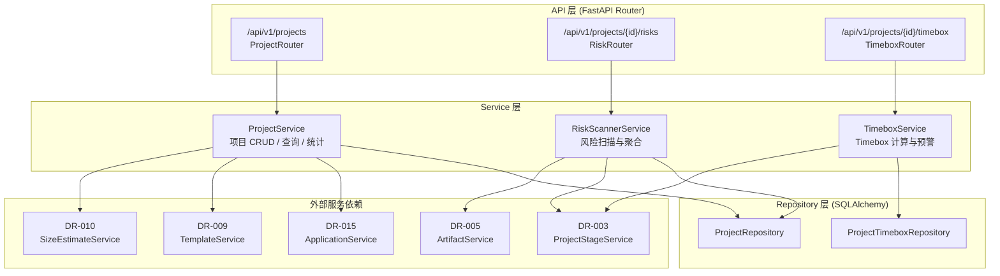
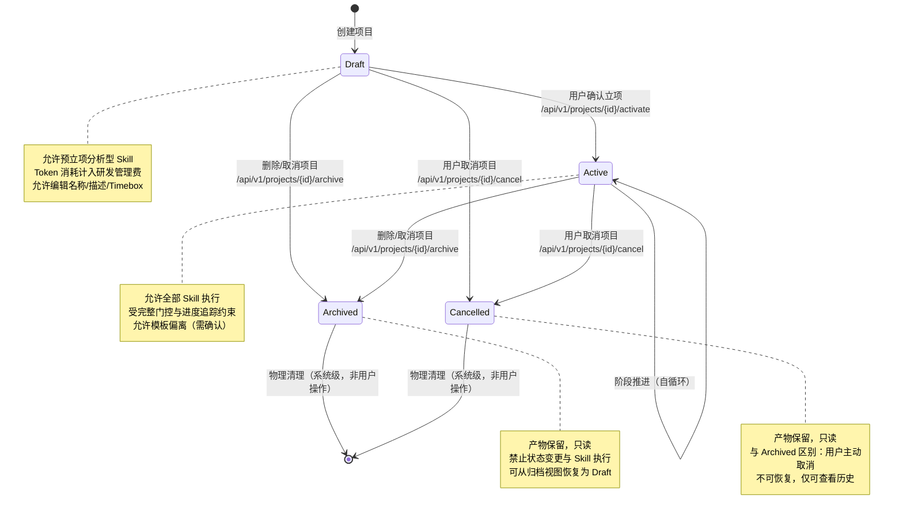
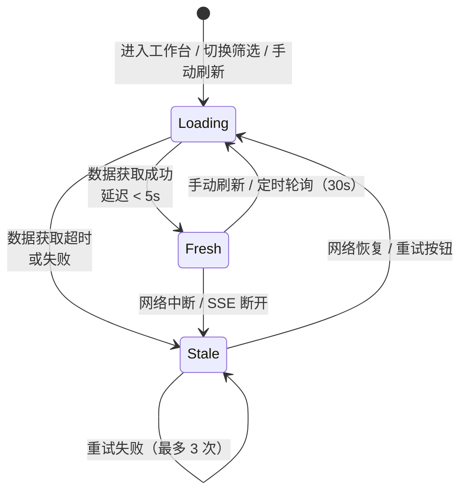
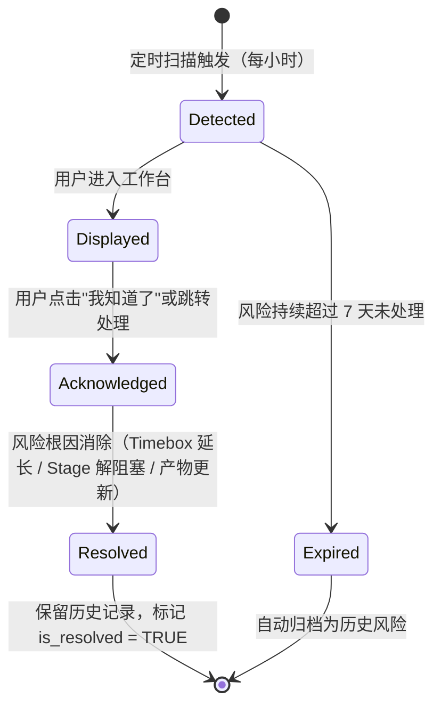

# DR-001 项目工作台 — 模块详细设计

> **模块编号**：DR-001  
> **模块名称**：项目工作台（Project Dashboard）  
> **版本**：v1.0  
> **状态**：FROZEN  
> **设计日期**：2026-06-02  
> **上游基线**：PRD-000 v2.0-patch2（Gate 1）/ HLD-001~003（Gate 2）/ DR-001 详细需求（Gate 2.5）

---

## 1. 模块架构与组件设计

### 1.1 模块定位

项目工作台是用户进入 SDLC Visualizer 后的首要交互界面，承担以下核心职责：
- **项目生命周期管理**：创建、读取、更新、归档（软删除）项目
- **健康度可视化**：以卡片/列表形式展示项目进度、当前阶段、风险等级
- **风险预警聚合**：基于 Timebox、Stage 阻塞、产物异常生成预警面板
- **规模评估入口**：调用 DR-010 复杂度路由面板，展示评估结果
- **模板选择与预览**：在项目创建流程中集成 DR-009 模板引擎

### 1.2 内部分层架构



### 1.3 核心类设计

#### `ProjectService`

```python
class ProjectService:
    """项目核心业务服务，处理项目 CRUD 与查询聚合。"""

    def __init__(
        self,
        project_repo: ProjectRepository,
        app_service: ApplicationService,
        template_service: TemplateService,
    ) -> None: ...

    async def create_project(
        self,
        dto: ProjectCreateDTO,
    ) -> ProjectResponseDTO:
        """创建项目，执行重名校验、Git 初始化、模板绑定。
        
        MVP 补充：若 dto.project_id 为空字符串或 None，
        自动生成为 uuid.uuid4()，避免写入空主键导致后续操作异常。
        """

    async def list_projects(
        self,
        app_id: str,
        filters: ProjectFilterDTO,
        pagination: PaginationDTO,
    ) -> PaginatedProjectListDTO:
        """分页查询项目列表，支持搜索、状态筛选、排序。"""

    async def get_project_detail(
        self,
        project_id: str,
    ) -> ProjectDetailDTO:
        """获取项目详情，聚合阶段进度、产物统计、操作日志。"""

    async def archive_project(
        self,
        project_id: str,
        confirm_name: str,
    ) -> None:
        """归档项目（软删除），校验确认名称，冻结状态。"""

    async def update_project_info(
        self,
        project_id: str,
        dto: ProjectUpdateDTO,
    ) -> ProjectResponseDTO:
        """更新项目基本信息（名称、描述）。"""
```

#### `RiskScannerService`

```python
class RiskScannerService:
    """风险扫描服务，定时或按需扫描项目风险。

    MVP 实现：基于 Project / Timebox / Stage / Artifact 状态实时计算风险，
    不持久化 risk_alerts 表；P1 如需历史预警再引入 RiskAlertRepository。
    """

    def __init__(
        self,
        stage_service: ProjectStageService,
        artifact_service: ArtifactService,
    ) -> None: ...

    async def scan_application_risks(
        self,
        app_id: str,
    ) -> list[RiskAlertDTO]:
        """扫描指定 Application 下所有项目的风险，返回聚合预警列表。"""

    async def scan_project_risks(
        self,
        project_id: str,
    ) -> list[RiskAlertDTO]:
        """扫描单个项目的风险（Timebox / Stage 阻塞 / 产物异常）。"""
```

#### `TimeboxService`

```python
class TimeboxService:
    """Timebox 计算与预警服务。"""

    def __init__(
        self,
        timebox_repo: ProjectTimeboxRepository,
        stage_service: ProjectStageService,
    ) -> None: ...

    async def configure_timebox(
        self,
        project_id: str,
        timeboxes: list[StageTimeboxDTO],
    ) -> None:
        """配置各阶段 Timebox，校验最小粒度 0.5 天。"""

    async def check_timebox_alerts(
        self,
        project_id: str,
    ) -> list[TimeboxAlertDTO]:
        """检查 Timebox 到期预警（剩余 20%/10%/0% 节点）。"""
```

### 1.4 模块依赖清单

| 依赖模块 | 依赖类型 | 调用方式 | 用途 |
|----------|----------|----------|------|
| DR-015 Application 治理 | 强依赖 | Service 注入 | 校验 Application 存在性、获取 App 列表 |
| DR-009 模板引擎 | 强依赖 | Service 注入 | 获取模板定义、绑定模板阶段-Skill |
| DR-010 复杂度路由 | 弱依赖 | Service 注入 | 规模评估入口调用、结果展示 |
| DR-003 阶段详情面板 | 弱依赖 | Service 注入 | 获取阶段进度、状态、阻塞信息 |
| DR-005 产物浏览器 | 弱依赖 | Service 注入 | 获取产物统计、STALE/CONFLICT 状态 |

---

## 2. 接口定义

### 2.1 RESTful 端点清单

| 方法 | 路径 | 操作 | 说明 |
|:----:|:-----|:-----|:-----|
| GET | `/api/v1/applications/{app_id}/projects` | 查询项目列表 | 支持搜索、筛选、排序、分页 |
| POST | `/api/v1/applications/{app_id}/projects` | 创建项目 | 四步向导的最终提交接口 |
| GET | `/api/v1/projects/{project_id}` | 获取项目详情 | 聚合健康度、阶段、产物、日志 |
| PATCH | `/api/v1/projects/{project_id}` | 更新项目信息 | 仅支持名称、描述更新 |
| POST | `/api/v1/projects/{project_id}/activate` | 激活项目 | Draft → Active 状态转换（立项） |
| POST | `/api/v1/projects/{project_id}/archive` | 归档项目 | 软删除，状态变更为 Archived |
| POST | `/api/v1/projects/{project_id}/cancel` | 取消项目 | 状态变更为 Cancelled，有进度时先归档 |
| GET | `/api/v1/applications/{app_id}/risk-alerts` | 获取风险预警 | 聚合当前 App 下所有项目风险 |
| GET | `/api/v1/projects/{project_id}/risk-alerts` | 获取项目风险 | 单项目风险详情 |
| GET | `/api/v1/projects/{project_id}/timebox` | 获取 Timebox 配置 | 各阶段时间预期与剩余时间 |
| PUT | `/api/v1/projects/{project_id}/timebox` | 更新 Timebox 配置 | 逐阶段调整时间预期 |

### 2.2 请求 / 响应 DTO

#### `ProjectCreateDTO`

```yaml
ProjectCreateDTO:
  type: object
  required: [project_name, application_id, template_level]
  properties:
    project_name:
      type: string
      minLength: 1
      maxLength: 64
      description: 项目名称，Application 内 Active/Draft/Cancelled 状态唯一（大小写不敏感）
    project_description:
      type: string
      maxLength: 256
      nullable: true
    application_id:
      type: string
      description: 关联 Application ID
    template_level:
      type: string
      enum: [Trivial, Light, Standard, Deep]
    size_estimate:
      type: object
      nullable: true
      properties:
        module_count: {type: integer, minimum: 1, maximum: 50}
        interface_count: {type: integer, minimum: 0, maximum: 100}
        page_count: {type: integer, minimum: 0, maximum: 50}
        tech_complexity: {type: string, enum: [Low, Medium, High]}
        risk_level: {type: string, enum: [Low, Medium, High]}
```

#### `ProjectResponseDTO`

```yaml
ProjectResponseDTO:
  type: object
  properties:
    project_id: {type: string, format: uuid}
    project_name: {type: string}
    project_description: {type: string, nullable: true}
    project_status: {type: string, enum: [Draft, Active, Archived, Cancelled]}
    application_id: {type: string}
    template_level: {type: string, enum: [Trivial, Light, Standard, Deep]}
    progress_percent: {type: integer, minimum: 0, maximum: 100}
    current_stage: {type: string, nullable: true}
    risk_level: {type: string, enum: [None, Low, Medium, High]}
    last_activity_at: {type: string, format: date-time, nullable: true}
    last_activity_type: {type: string, nullable: true}
    artifact_count: {type: integer}
    created_at: {type: string, format: date-time}
    updated_at: {type: string, format: date-time}
```

#### `PaginatedProjectListDTO`

```yaml
PaginatedProjectListDTO:
  type: object
  properties:
    items: {type: array, items: {$ref: '#/components/schemas/ProjectResponseDTO'}}
    total_count: {type: integer}
    page: {type: integer}
    page_size: {type: integer}
```

#### `ProjectFilterDTO`

```yaml
ProjectFilterDTO:
  type: object
  properties:
    search_keyword: {type: string, maxLength: 64}
    status_filter: {type: array, items: {type: string, enum: [Draft, Active, Archived, Cancelled]}}
    sort_by: {type: string, enum: [updated_at, created_at, name, risk_level], default: updated_at}
    sort_order: {type: string, enum: [asc, desc], default: desc}
```

#### `RiskAlertDTO`

```yaml
RiskAlertDTO:
  type: object
  properties:
    alert_id: {type: string, format: uuid}
    project_id: {type: string}
    project_name: {type: string}
    risk_type: {type: string, enum: [TimeboxExpiring, TimeboxExpired, StageBlocked, ArtifactStale, ArtifactConflict]}
    severity: {type: string, enum: [Low, Medium, High]}
    message: {type: string}
    created_at: {type: string, format: date-time}
```

### 2.3 错误码定义

| HTTP 状态码 | 业务错误码 | 错误消息模板 | 触发场景 |
|:-----------:|:-----------|:-------------|:---------|
| 400 | `PROJECT_NAME_INVALID` | "项目名称长度必须在 1-64 字符之间，且不能仅包含特殊字符" | 名称校验失败 |
| 409 | `PROJECT_NAME_DUPLICATE` | "Application '{app_name}' 下已存在同名项目 '{project_name}'" | 重名校验失败 |
| 404 | `APPLICATION_NOT_FOUND` | "Application '{app_id}' 不存在" | 关联 Application 不存在 |
| 404 | `PROJECT_NOT_FOUND` | "项目 '{project_id}' 不存在或已归档" | 查询/更新/归档时项目不存在 |
| 409 | `PROJECT_CONFIRM_NAME_MISMATCH` | "确认名称与项目名称不一致" | 归档时确认名称不匹配 |
| 409 | `PROJECT_ALREADY_ARCHIVED` | "项目已处于归档状态" | 重复归档 |
| 422 | `TIMEBOX_INVALID` | "阶段时间不可为 0，建议至少 0.5 天" | Timebox 配置校验失败 |
| 422 | `TEMPLATE_LEVEL_INVALID` | "模板级别必须是 Trivial/Light/Standard/Deep 之一" | 模板级别非法 |
| 500 | `RISK_SCAN_FAILED` | "风险扫描失败，请稍后重试" | 风险扫描内部异常 |

---

## 3. 数据表结构

### 3.1 本模块独占表

> **公共表**：权威 DDL 定义见 `shared/db-schema.md#projects`。以下为设计上下文补充。
>
> 写方：DR-001 | 读方：DR-003/004/005/007/009/012/013/014/015

#### `projects` — 项目主表

```sql
CREATE TABLE projects (
    project_id          VARCHAR(36) PRIMARY KEY,        -- UUID v4
    project_name        VARCHAR(64) NOT NULL,
    project_description VARCHAR(256),
    project_status      VARCHAR(16) NOT NULL DEFAULT 'Draft'
                        CHECK (project_status IN ('Draft', 'Active', 'Archived', 'Cancelled')),
    application_id      VARCHAR(36) NOT NULL,
    template_level      VARCHAR(16) NOT NULL
                        CHECK (template_level IN ('Trivial', 'Light', 'Standard', 'Deep')),
    progress_percent    INTEGER NOT NULL DEFAULT 0
                        CHECK (progress_percent BETWEEN 0 AND 100),
    current_stage       VARCHAR(32),                     -- 当前阶段名称，如 "high-level-design"
    risk_level          VARCHAR(16) DEFAULT 'None'
                        CHECK (risk_level IN ('None', 'Low', 'Medium', 'High')),
    last_activity_at    TIMESTAMP,
    last_activity_type  VARCHAR(32),
    size_estimate_id    VARCHAR(36),                     -- 关联 size_estimates 表（可为空）
    created_at          TIMESTAMP NOT NULL DEFAULT CURRENT_TIMESTAMP,
    updated_at          TIMESTAMP NOT NULL DEFAULT CURRENT_TIMESTAMP,

    -- 约束
    CONSTRAINT uq_project_name_per_app UNIQUE (application_id, project_name, project_status)
        -- 注：SQLite 不支持条件唯一索引，需在应用层校验 Active/Draft/Cancelled 状态下的重名
);

CREATE INDEX idx_projects_app_id ON projects(application_id);
CREATE INDEX idx_projects_status ON projects(project_status);
CREATE INDEX idx_projects_risk ON projects(risk_level) WHERE risk_level != 'None';
CREATE INDEX idx_projects_updated ON projects(updated_at DESC);
```

> **设计说明**：
> - SQLite 不支持部分索引（`WHERE` 子句），`idx_projects_risk` 在 SQLite 中为普通索引，PostgreSQL 迁移后可改为部分索引。
> - 重名校验在应用层实现：同一 `application_id` 下，`project_status` 为 `Active`/`Draft`/`Cancelled` 时，`project_name` 大小写不敏感唯一。

#### `project_timeboxes` — 项目阶段 Timebox 配置表

```sql
CREATE TABLE project_timeboxes (
    timebox_id          VARCHAR(36) PRIMARY KEY,
    project_id          VARCHAR(36) NOT NULL,
    stage_name          VARCHAR(32) NOT NULL,
    planned_days        DECIMAL(3,1) NOT NULL CHECK (planned_days >= 0.5),
    actual_days         DECIMAL(3,1) DEFAULT 0,
    timebox_start_at    TIMESTAMP,
    timebox_end_at      TIMESTAMP,
    alert_20_sent       BOOLEAN DEFAULT FALSE,          -- 剩余 20% 预警已发送
    alert_10_sent       BOOLEAN DEFAULT FALSE,          -- 剩余 10% 预警已发送
    alert_expired_sent  BOOLEAN DEFAULT FALSE,          -- 超时预警已发送
    created_at          TIMESTAMP NOT NULL DEFAULT CURRENT_TIMESTAMP,
    updated_at          TIMESTAMP NOT NULL DEFAULT CURRENT_TIMESTAMP,

    CONSTRAINT fk_timebox_project FOREIGN KEY (project_id) REFERENCES projects(project_id) ON DELETE CASCADE,
    CONSTRAINT uq_timebox_project_stage UNIQUE (project_id, stage_name)
);

CREATE INDEX idx_timebox_project ON project_timeboxes(project_id);
CREATE INDEX idx_timebox_end ON project_timeboxes(timebox_end_at);
```

#### `risk_alerts` — 风险预警记录表

```sql
CREATE TABLE risk_alerts (
    alert_id            VARCHAR(36) PRIMARY KEY,
    project_id          VARCHAR(36) NOT NULL,
    risk_type           VARCHAR(32) NOT NULL
                        CHECK (risk_type IN ('TimeboxExpiring', 'TimeboxExpired', 'StageBlocked', 'ArtifactStale', 'ArtifactConflict')),
    severity            VARCHAR(16) NOT NULL
                        CHECK (severity IN ('Low', 'Medium', 'High')),
    message             VARCHAR(256) NOT NULL,
    is_resolved         BOOLEAN DEFAULT FALSE,
    resolved_at         TIMESTAMP,
    created_at          TIMESTAMP NOT NULL DEFAULT CURRENT_TIMESTAMP,

    CONSTRAINT fk_alert_project FOREIGN KEY (project_id) REFERENCES projects(project_id) ON DELETE CASCADE
);

CREATE INDEX idx_alerts_project ON risk_alerts(project_id);
CREATE INDEX idx_alerts_unresolved ON risk_alerts(project_id, is_resolved) WHERE is_resolved = FALSE;
-- SQLite 注释：不支持 WHERE 条件索引，迁移 PostgreSQL 后启用
```

### 3.2 依赖公共表（引用说明）

| 表名 | 引用路径 | 使用方式 | 本模块关联字段 |
|------|----------|----------|---------------|
| `applications` | `shared/db-schema.md#applications` | 读取 | `projects.application_id` → `applications.application_id` |
| `templates` | `shared/db-schema.md#templates` | 读取 | `projects.template_level` → `templates.level` |
| `size_estimates` | `shared/db-schema.md#size_estimates` | 读写 | `projects.size_estimate_id` → `size_estimates.estimate_id` |
| `project_stages` | `shared/db-schema.md#project_stages` | 读取 | 用于计算 `progress_percent`、`current_stage` |
| `artifacts` | `shared/db-schema.md#artifacts` | 读取 | 用于统计 `artifact_count`、检测 STALE/CONFLICT |

### 3.3 缓存策略

| 缓存对象 | 策略 | TTL | 说明 |
|----------|------|-----|------|
| 项目列表查询 | 无缓存 | — | 数据实时性要求高，直接查库 |
| 风险预警聚合 | 内存缓存（单进程） | 5 分钟 | `RiskScannerService` 内部缓存，避免频繁扫描 |
| Timebox 配置 | 无缓存 | — | 配置数据量小，直接查库 |

---

## 4. 模块状态机

### 4.1 项目生命周期状态机



**状态转换校验规则**：

| 转换 | 触发条件 | 校验规则 | 异常分支 |
|------|----------|----------|----------|
| Draft → Active | 用户点击"确认立项" | 项目名有效、模板已绑定、至少一个 Stage 配置完成 | 若存在未处理 High 风险，弹出二次确认 |
| Draft → Archived | 用户提交归档请求 + 确认名称匹配 | 项目处于 Draft 态、确认名称与 project_name 完全一致 | 名称不匹配 → 拒绝，提示重新输入 |
| Draft → Cancelled | 用户点击"取消项目" | 项目处于 Draft 态、无正在执行的 Skill | 有执行中 Skill → 提示等待完成或强制终止 |
| Active → Archived | 同 Draft → Archived | 项目处于 Active 态、无执行中 Skill（或强制终止） | 有执行中 Skill → 提示风险 |
| Active → Cancelled | 用户点击"取消项目" | 项目处于 Active 态、需二次确认（影响更大） | 直接阻断，提示先归档而非取消 |
| Archived → Draft | 用户从归档视图点击"恢复" | 项目处于 Archived 态 | Cancelled 不支持恢复 |

### 4.2 健康度卡片数据状态机



### 4.3 风险预警生命周期



---

## 5. 边界条件与异常处理

### 5.1 单元测试用例

| 用例 ID | 追溯 AC | Given / When / Then | Mock 策略 |
|---------|:-------:|:--------------------|:----------|
| UT-001 | AC-02 | Given 有效创建参数，When `create_project()`，Then 返回项目 DTO 且状态为 Draft | Mock `ApplicationService.validate()`、`TemplateService.bind()` |
| UT-002 | AC-11 | Given 同一 App 下已存在 Active 项目 "Foo"，When 创建同名项目，Then 抛出 `PROJECT_NAME_DUPLICATE` | Mock `ProjectRepository.find_by_name()` 返回已存在记录 |
| UT-003 | AC-14 | Given 用户快速提交 3 次创建请求，When 第一次请求处理中，Then 后续请求被防抖忽略 | 使用 `asyncio.Lock` 或内存去重键验证 |
| UT-004 | AC-07 | Given 项目状态为 Draft，When 归档且确认名称匹配，Then 状态变更为 Archived 且冻结 Skill 执行 | Mock `ProjectRepository.update_status()` |
| UT-005 | AC-20 | Given Timebox 剩余 20%，When `check_timebox_alerts()`，Then 返回 severity=Low 的 TimeboxExpiring 预警 | Mock `system_time` 和 `timebox_end_at` |
| UT-006 | AC-21 | Given Timebox 已超时，When `check_timebox_alerts()`，Then 返回 severity=High 的 TimeboxExpired 预警 | 同上 |
| UT-007 | — | Given 项目数量为 0，When `list_projects()`，Then 返回空数组且 total_count=0 | 直接查询空表 |
| UT-008 | AC-05 | Given 50 个项目，When `list_projects()` 默认分页，Then 返回首页数据且响应时间 < 200ms | 使用 SQLite 内存数据库 + 50 条测试数据 |

### 5.2 集成测试场景

| 场景 ID | 涉及模块 | 场景描述 | 验证点 |
|---------|----------|----------|--------|
| IT-001 | DR-001 + DR-015 | 创建项目时选择不存在的 Application | 返回 404 `APPLICATION_NOT_FOUND`，无项目记录落库 |
| IT-002 | DR-001 + DR-009 | 创建项目后查询模板预览 | 模板阶段-Skill 绑定数据与项目关联正确 |
| IT-003 | DR-001 + DR-010 | 创建项目时附带规模评估参数 | DR-010 计算结果被正确保存，`size_estimate_id` 非空 |
| IT-004 | DR-001 + DR-003 | Active 项目阶段推进后，工作台健康度刷新 | `progress_percent` 和 `current_stage` 自动更新 |
| IT-005 | DR-001 + DR-005 | 产物标记为 STALE 后，风险预警面板展示 | `risk_alerts` 表插入记录，接口返回 severity=Medium |

### 5.3 边界条件覆盖

| 边界 | 测试方法 |
|------|----------|
| 项目名称 64 字符边界 | 输入 64 字符通过，65 字符拒绝 |
| Application 下 200 个项目列表 | 验证分页正确性、虚拟滚动（前端）、接口响应 < 1s |
| Timebox 0.5 天最小粒度 | 输入 0.4 天拒绝，0.5 天通过 |
| 并发创建同名项目 | 数据库唯一约束 + 应用层锁双重校验 |
| 网络中断后恢复 | 验证列表从 Stale → Loading → Fresh 的状态流转 |

---

## 附录：与概要设计的追溯关系

| 概要设计决策 | 本模块落地位置 | 一致性 |
|-------------|---------------|:------:|
| HLD-001 Container 图：Pg_API → Pg_SQLite | API Layer → Repository Layer | ✅ |
| HLD-002 `projects` 表职责：项目主数据，含状态/复杂度路径 | `projects` 表 DDL + `project_status` 含 4 态 | ✅ |
| HLD-002 存储策略：元数据存 SQLite | 全部表使用 SQLite 语法 | ✅ |
| HLD-003 算法 A：复杂度路由规则引擎 | `ProjectService.create_project()` 调用 DR-010 | ✅ |
| HLD-003 业务错误：违反前置依赖执行 Skill | `project_status` 校验阻止 Archived/Cancelled 项目执行 | ✅ |
| ADR-003：OpenUI 可选，WireframeEngine 兜底 | 本模块不涉及原型渲染，无偏离 | ✅ |
| MVP 补充：project_id 为空时自动生成 UUID | `ProjectService.create_project()` 内增加 `effective_id = project_id or uuid.uuid4()` | ✅ |
| MVP 补充：SQLite 目录自动创建 | `init_db()` 解析 DATABASE_URL 并自动 `mkdir(parents=True, exist_ok=True)` | ✅ |
| MVP 补充：项目卡片"进入画布"入口 | `ProjectCard` 新增 `onEnter` prop，Active/Archived 项目展示"进入画布"按钮 | ✅ |
