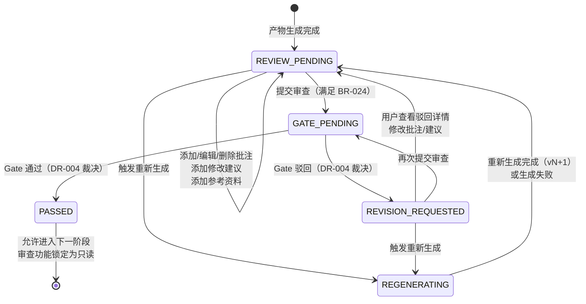
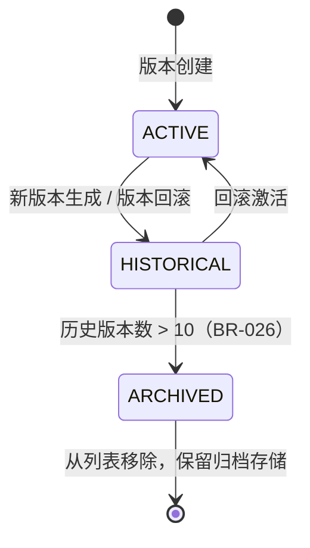
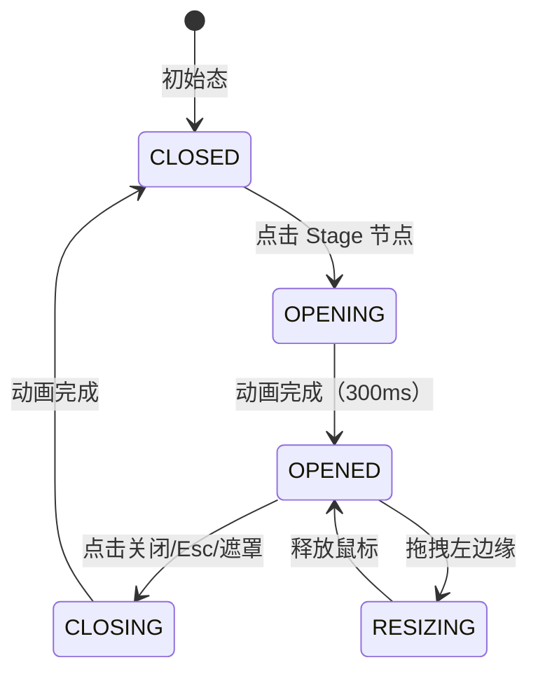

# DR-003：阶段详情面板（Stage Detail Panel）模块详细设计

> **模块编号**：DR-003  
> **模块名称**：阶段详情面板（Stage Detail Panel）  
> **版本**：v1.0  
> **设计状态**：FROZEN  
> **上游追溯**：DR-003 详细需求（REQ-P0-025, REQ-P0-034~038）  
> **下游消费**：DR-004（Gate 审批中心）、DR-005（产物浏览器）、DR-008（Skill 调度服务）  
> **变更**：sdlc-visualizer

---

## 1. 架构组件与职责

### 1.1 组件总览

```
┌─────────────────────────────────────────────────────────────┐
│                    StageDetailPanel                         │
│  ┌─────────┐  ┌─────────┐  ┌─────────┐  ┌─────────┐       │
│  │DrawerShell│  │TabController│ │ContentRouter│ │StateManager│
│  └────┬────┘  └────┬────┘  └────┬────┘  └────┬────┘       │
│       │            │            │            │             │
│  ┌────┴────┐  ┌────┴────┐  ┌────┴────┐  ┌────┴────┐       │
│  │ResizeHandle│ │TabBar   │  │TabPanels... │ │ZustandStore│
│  │MaskLayer  │  │BadgeMgr │  │            │ │            │
│  └─────────┘  └─────────┘  └─────────┘  └─────────┘       │
└─────────────────────────────────────────────────────────────┘
```

| 组件 | 类型 | 职责 |
|------|------|------|
| `StageDetailPanel` | 页面级容器 | 抽屉面板整体生命周期管理、打开/关闭动画、宽度持久化 |
| `DrawerShell` | 布局容器 | 右侧滑出抽屉骨架、遮罩层、Esc/遮罩点击关闭、拖拽调整宽度 |
| `ResizeHandle` | 交互组件 | 左边缘拖拽手柄，最小 480px / 最大 900px，释放后持久化到 localStorage |
| `MaskLayer` | 覆盖层 | 半透明黑色遮罩（`rgba(0,0,0,0.4)`），点击关闭面板 |
| `TabController` | 逻辑组件 | 6 个 Tab 的激活状态管理、懒加载策略、红点提示逻辑 |
| `TabBar` | UI 组件 | Tab 导航栏渲染、Badge 计数、滚动位置记忆 |
| `BadgeManager` | 逻辑组件 | 审查 Tab 红点条件判断：REVIEW_PENDING 且未浏览过 |
| `ContentRouter` | 路由组件 | 根据 activeTab 渲染对应内容区，保留各 Tab 独立滚动位置 |
| `StateManager` | Zustand Store | 面板级状态：打开/关闭、当前 Stage、Tab 状态、审查状态机 |

### 1.2 六个 Tab 子组件

| Tab | 组件名 | 核心职责 | 懒加载 |
|-----|--------|---------|--------|
| Skill 指令快照 | `SkillSnapshotTab` | 渲染 Skill 元数据、折叠面板展示指令摘要、meta.json 关联信息 | 否（默认激活） |
| PocketFlow 三阶段 | `PocketFlowStatusTab` | 三阶段步骤条渲染、子步骤进度列表、实时状态同步 | 是 |
| 输入/输出产物 | `ArtifactCardsTab` | 产物卡片网格渲染、点击展开预览、下载全部 | 是 |
| 执行日志 | `ExecutionLogsTab` | 按 Skill 分组的可折叠列表、关键词搜索、日志级别过滤、实时流追加 | 是 |
| 质量门禁 | `QualityGateTab` | 门禁结果图标化展示、失败项展开详情、重新检查触发 | 是 |
| 审查 | `ReviewTab` | 产物预览+行内批注、全局修改建议、参考资料、版本历史、重新生成、提交审查 | 是 |

### 1.3 审查 Tab 子组件

```
ReviewTab
├── ArtifactPreviewPane      # 产物预览区（Markdown 渲染 + 批注高亮层）
│   ├── MarkdownRenderer     # Markdown → HTML 渲染（react-markdown + remark-gfm）
│   ├── AnnotationLayer      # 批注高亮覆盖层（绝对定位气泡）
│   └── TextSelectionHandler # 文本选中检测与批注触发按钮定位
├── AnnotationPopover        # 批注浮层（创建/编辑/删除批注）
├── GlobalSuggestionsPanel   # 全局修改建议输入区（P0/P1/P2 分级）
├── ReferencesPanel          # 参考资料拖拽/粘贴区与列表
├── VersionHistorySidebar    # 版本历史侧滑面板（列表 + diff + 回滚）
├── ReviewSubmitConfirmation # 审查提交确认页（Pg_006 内嵌视图）
└── OnboardingMask           # 首次使用功能引导遮罩
```

### 1.4 跨模块依赖

| 依赖方 | 被依赖模块 | 依赖内容 | 接口类型 |
|--------|-----------|----------|----------|
| DR-003 | DR-008 | 执行日志实时流（WebSocket）、PocketFlow 阶段状态 | WebSocket / REST |
| DR-003 | DR-005 | 产物预览渲染、版本历史、diff 对比、回滚 | REST / 组件复用 |
| DR-003 | DR-004 | Gate 审批结果（PASSED / REVISION_REQUESTED）、驳回理由 | REST / 事件 |
| DR-003 | DR-016 | PocketFlow 三阶段详细状态（prep/exec/post 子步骤） | REST |
| DR-003 | DR-006 | Skill 元数据（名称、版本、触发条件、产出物规格） | REST |

---

## 2. 接口定义

### 2.1 模块对外提供接口

#### `GET /api/v1/stages/{stage_id}/detail`

获取 Stage 详情面板初始化数据（Skill 快照 + 产物清单 + 审查状态）。

**Response**: `StageDetailDTO`

```typescript
interface StageDetailDTO {
  stage_id: string;                    // UUID
  stage_name: string;
  stage_type: SDLCStageType;           // 枚举：12 阶段之一
  primary_skill: SkillSnapshotDTO;
  pocketflow_summary: PocketFlowSummaryDTO;
  artifacts: ArtifactCardDTO[];        // 输入 + 输出产物卡片
  review_status: ReviewStatus;         // REVIEW_PENDING / GATE_PENDING / PASSED / REVISION_REQUESTED / REGENERATING
  gate_results: GateResultSummaryDTO | null;
  current_version: number;             // 当前产物版本号
}

interface SkillSnapshotDTO {
  skill_id: string;
  skill_name: string;
  version: string;
  trigger_condition: string;           // 触发条件摘要
  core_steps: string[];                // 核心步骤列表
  output_specs: string[];              // 产出物规格列表
  stop_conditions: string[];           // STOP 条件列表
  meta: {
    pattern: string;
    platforms: string[];
  };
}

interface ArtifactCardDTO {
  artifact_id: string;
  file_name: string;
  file_path: string;
  file_type: ArtifactFileType;         // md / yaml / json / mermaid / openapi
  direction: "input" | "output";
  stage_id: string;
  skill_id: string;
  size_bytes: number;
  last_modified: string;               // ISO 8601
}
```

#### `GET /api/v1/stages/{stage_id}/annotations`

获取当前 Stage 产物上的全部批注列表。

**Response**: `AnnotationDTO[]`

```typescript
interface AnnotationDTO {
  annotation_id: string;               // UUID
  artifact_id: string;
  anchor_text: string;                 // 被高亮的原文文本（前 50 字）
  anchor_start_offset: number;         // 在产物全文中的起始字符偏移
  anchor_end_offset: number;           // 结束字符偏移
  content: string;                     // 评论内容，1-500 字符
  annotation_type: "question" | "suggestion" | "reference";
  created_by: string;
  created_at: string;
  resolved: boolean;
}
```

#### `POST /api/v1/stages/{stage_id}/annotations`

创建新批注。

**Request**: `CreateAnnotationRequestDTO`

```typescript
interface CreateAnnotationRequestDTO {
  artifact_id: string;
  anchor_start_offset: number;
  anchor_end_offset: number;
  content: string;                     // 1-500 字符，非空
  annotation_type: "question" | "suggestion" | "reference";
}
```

**Response**: `{ annotation_id: string; created_at: string; }`

#### `PUT /api/v1/stages/{stage_id}/annotations/{annotation_id}`

编辑批注内容。

**Request**: `{ content: string; annotation_type: "question" | "suggestion" | "reference"; }`

#### `DELETE /api/v1/stages/{stage_id}/annotations/{annotation_id}`

删除批注。

#### `POST /api/v1/stages/{stage_id}/review/submit`

提交审查结果。

**Request**: `ReviewSubmitRequestDTO`

```typescript
interface ReviewSubmitRequestDTO {
  annotations: string[];               // 关联的 annotation_id 列表
  suggestions: SuggestionDTO[];
  references: ReferenceDTO[];
  browse_duration_sec: number;         // 前端计时器累计值，服务端二次校验 ≥30
  browsed_artifact_ids: string[];      // 浏览过的产物 ID 列表，至少 1 个
}

interface SuggestionDTO {
  content: string;                     // 10-2000 字符
  level: "P0" | "P1" | "P2";
}

interface ReferenceDTO {
  file_name: string;
  file_size_bytes: number;
  file_type: string;                   // .md / .txt / .pdf / .png / .jpg
  description?: string;
  content_base64?: string;             // 小文件内联存储，大文件存路径
}
```

**Error Codes**:
- `BROWSE_TIME_INSUFFICIENT` — 浏览时长 < 30 秒
- `NO_ARTIFACT_BROWSED` — 未浏览任何产物
- `REVIEW_NOT_PENDING` — 当前状态不是 REVIEW_PENDING

#### `POST /api/v1/stages/{stage_id}/regenerate`

触发重新生成。

**Request**: `{ include_annotations: string[]; include_references: boolean; context_summary?: string; }`

**Response**: `{ batch_id: string; status: "queued"; }`

#### `GET /api/v1/stages/{stage_id}/versions`

获取产物版本历史列表（最多 10 条）。

**Response**: `VersionHistoryItemDTO[]`

```typescript
interface VersionHistoryItemDTO {
  version_number: number;              // v1, v2, ...
  created_at: string;
  operation_type: "auto_snapshot" | "manual_save" | "rollback" | "regeneration";
  summary: string;                     // 前 30 字符或系统生成说明
  is_current: boolean;
  created_by: string;
}
```

#### `POST /api/v1/stages/{stage_id}/versions/{version_number}/rollback`

回滚到指定版本。

**Response**: `{ new_version_number: number; rollback_record_id: string; }`

#### `GET /api/v1/stages/{stage_id}/versions/diff`

**Query Params**: `from_version`, `to_version`

**Response**: `DiffResultDTO`

```typescript
interface DiffResultDTO {
  from_version: number;
  to_version: number;
  added_lines: DiffLineDTO[];          // 绿色，前缀 "+"
  removed_lines: DiffLineDTO[];        // 红色，前缀 "-"
  modified_lines: DiffLineDTO[];       // 黄色，前缀 "~"
}

interface DiffLineDTO {
  line_number: number;
  content: string;
}
```

### 2.2 模块消费的外部接口

| 接口 | 提供方 | 用途 | 调用时机 |
|------|--------|------|----------|
| `GET /api/v1/skills/{skill_id}` | DR-006 | Skill 元数据与指令快照 | 面板打开时 |
| `GET /api/v1/executions/{execution_id}/logs` | DR-008 | 分页查询执行日志 | 日志 Tab 激活时 |
| `WS /ws/executions/{execution_id}/logs` | DR-008 | 实时日志流推送 | 日志 Tab 激活且执行中 |
| `GET /api/v1/pocketflow/{execution_id}/status` | DR-016 | PocketFlow 三阶段详细状态 | PocketFlow Tab 激活时 |
| `GET /api/v1/artifacts/{artifact_id}/content` | DR-005 | 产物文件内容加载 | 点击产物卡片 / 审查 Tab |
| `POST /api/v1/gates/{gate_id}/summary` | DR-004 | 质量门禁结果摘要 | 门禁 Tab 激活时 |
| `POST /api/v1/gates/{gate_id}/review` | DR-004 | 提交 Gate 审批（审查提交后流转） | 用户确认提交审查后 |

---

## 3. 数据表结构

### 3.1 模块独占表

#### `stage_annotations` — 行内批注表

| 字段 | 类型 | 约束 | 说明 |
|------|------|------|------|
| `annotation_id` | TEXT | PK | UUID v4 |
| `stage_id` | TEXT | FK → `project_stages.stage_id`, NOT NULL | 关联 Stage |
| `artifact_id` | TEXT | NOT NULL | 关联产物（逻辑关联，非 FK） |
| `anchor_start_offset` | INTEGER | NOT NULL, CHECK ≥ 0 | 高亮起始字符偏移 |
| `anchor_end_offset` | INTEGER | NOT NULL, CHECK > anchor_start_offset | 高亮结束字符偏移 |
| `anchor_text` | TEXT | NOT NULL | 被高亮原文前 50 字（冗余，防漂移） |
| `content` | TEXT | NOT NULL, CHECK LENGTH 1-500 | 批注评论内容 |
| `annotation_type` | TEXT | NOT NULL | `question` / `suggestion` / `reference` |
| `created_by` | TEXT | NOT NULL | 用户标识（MVP 为本地用户名） |
| `created_at` | DATETIME | NOT NULL, DEFAULT CURRENT_TIMESTAMP | 创建时间 |
| `updated_at` | DATETIME | NOT NULL, DEFAULT CURRENT_TIMESTAMP | 更新时间 |
| `resolved` | BOOLEAN | NOT NULL, DEFAULT FALSE | 是否已解决 |

**索引**: `IDX_ANN_STAGE_ID` (`stage_id`), `IDX_ANN_ARTIFACT` (`artifact_id`)

#### `review_submissions` — 审查提交记录表

| 字段 | 类型 | 约束 | 说明 |
|------|------|------|------|
| `submission_id` | TEXT | PK | UUID v4 |
| `stage_id` | TEXT | FK → `project_stages.stage_id`, NOT NULL | 关联 Stage |
| `submitted_by` | TEXT | NOT NULL | 提交人 |
| `submitted_at` | DATETIME | NOT NULL | 提交时间 |
| `browse_duration_sec` | INTEGER | NOT NULL, CHECK ≥ 30 | 浏览时长（秒） |
| `browsed_artifact_count` | INTEGER | NOT NULL, CHECK ≥ 1 | 浏览产物数量 |
| `annotation_count` | INTEGER | NOT NULL, DEFAULT 0 | 关联批注数 |
| `suggestion_p0_count` | INTEGER | NOT NULL, DEFAULT 0 | P0 建议数 |
| `suggestion_p1_count` | INTEGER | NOT NULL, DEFAULT 0 | P1 建议数 |
| `suggestion_p2_count` | INTEGER | NOT NULL, DEFAULT 0 | P2 建议数 |
| `reference_count` | INTEGER | NOT NULL, DEFAULT 0 | 参考资料数 |
| `result_status` | TEXT | NOT NULL | `gate_pending` → 等待 Gate 裁决 |

**索引**: `IDX_RS_STAGE_ID` (`stage_id`)

#### `review_suggestions` — 全局修改建议明细表

| 字段 | 类型 | 约束 | 说明 |
|------|------|------|------|
| `suggestion_id` | TEXT | PK | UUID v4 |
| `submission_id` | TEXT | FK → `review_submissions.submission_id`, NOT NULL | 关联提交 |
| `content` | TEXT | NOT NULL, CHECK LENGTH 10-2000 | 建议内容 |
| `level` | TEXT | NOT NULL | `P0` / `P1` / `P2` |
| `created_at` | DATETIME | NOT NULL | 创建时间 |

#### `review_references` — 参考资料表

| 字段 | 类型 | 约束 | 说明 |
|------|------|------|------|
| `reference_id` | TEXT | PK | UUID v4 |
| `submission_id` | TEXT | FK → `review_submissions.submission_id`, NOT NULL | 关联提交 |
| `file_name` | TEXT | NOT NULL | 原始文件名 |
| `file_size_bytes` | INTEGER | NOT NULL, CHECK ≤ 10*1024*1024 | 文件大小（≤10MB） |
| `file_type` | TEXT | NOT NULL | `md` / `txt` / `pdf` / `png` / `jpg` |
| `storage_path` | TEXT | | 文件存储路径（大文件） |
| `content_base64` | TEXT | | 小文件内联（≤100KB） |
| `description` | TEXT | | 用户描述（≤200 字） |
| `created_at` | DATETIME | NOT NULL | 创建时间 |

> **公共表**：权威 DDL 定义见 `shared/db-schema.md#stage_review_status`。以下为设计上下文补充。
>
> 写方：DR-003, DR-004 | 读方：DR-003, DR-004, DR-007

#### `stage_review_status` — Stage 审查状态表

| 字段 | 类型 | 约束 | 说明 |
|------|------|------|------|
| `stage_id` | TEXT | PK, FK → `project_stages.stage_id` | 关联 Stage |
| `current_status` | TEXT | NOT NULL | `REVIEW_PENDING` / `GATE_PENDING` / `PASSED` / `REVISION_REQUESTED` / `REGENERATING` |
| `previous_status` | TEXT | | 用于重新生成失败时回退 |
| `current_version` | INTEGER | NOT NULL, DEFAULT 1 | 当前产物版本号 |
| `regeneration_batch_id` | TEXT | | 重新生成任务 ID |
| `last_submission_id` | TEXT | FK → `review_submissions.submission_id` | 最近一次提交 |
| `gate_decision_id` | TEXT | | Gate 裁决记录 ID |
| `updated_at` | DATETIME | NOT NULL | 状态更新时间 |

### 3.2 表写权限声明

| 表名 | 写模块 | 读模块 | 说明 |
|------|--------|--------|------|
| `stage_annotations` | DR-003 | DR-003, DR-004 | 批注增删改查 |
| `review_submissions` | DR-003 | DR-003, DR-004 | 审查提交记录 |
| `review_suggestions` | DR-003 | DR-003 | 建议明细 |
| `review_references` | DR-003 | DR-003 | 参考资料 |
| `stage_review_status` | DR-003 | DR-003, DR-004, DR-007 | 审查状态（DR-004 更新 Gate 裁决结果时写入 `gate_decision_id` 和 `current_status`） |

> **注意**：DR-004 在 Gate 裁决通过后更新 `stage_review_status.current_status` 为 `PASSED` 或 `REVISION_REQUESTED`，这是跨模块写操作，需在 interface-first-dev 阶段明确约定。

---

## 4. 状态机

### 4.1 审查状态机（核心）



**状态说明与前端表现**：

| 状态 | 前端标签 | 颜色 | 批注 | 提交按钮 | 重新生成 |
|------|---------|------|------|----------|----------|
| REVIEW_PENDING | "等待审查" | 黄色 | 可编辑 | 可用（满足 BR-024 后） | 可用 |
| GATE_PENDING | "等待 Gate 裁决" | 蓝色 | 只读 | 禁用 | 禁用 |
| PASSED | "已通过" | 绿色 | 只读 | 禁用 | 禁用 |
| REVISION_REQUESTED | "需修改" | 红色 | 可编辑 | 可用 | 可用 |
| REGENERATING | "重新生成中" | 紫色（旋转） | 只读 | 禁用 | 禁用 |

### 4.2 产物版本状态机



### 4.3 面板 UI 状态机



**面板状态规则**：
- 同一时间仅允许打开一个 Stage 详情面板
- 切换 Stage 时，当前面板先关闭（150ms）再重新打开（300ms），或原地刷新内容
- 面板宽度持久化到 `localStorage`（key: `stage-detail-width`）
- 各 Tab 的滚动位置独立记忆，切换 Tab 时恢复

---

## 5. 边界条件与异常处理

### 5.1 单元测试（Jest + React Testing Library）

| 测试目标 | 测试内容 | 预期覆盖率 |
|----------|----------|:----------:|
| `DrawerShell` | 打开/关闭动画、Esc 关闭、遮罩点击、宽度拖拽 | ≥ 80% |
| `TabController` | Tab 切换、懒加载、Badge 红点条件 | ≥ 80% |
| `TextSelectionHandler` | 文本选中检测、批注按钮定位、偏移量计算 | ≥ 80% |
| `AnnotationLayer` | 高亮渲染、气泡定位、点击展开 | ≥ 75% |
| `ReviewStatusMachine` | 状态流转、非法操作拦截、重新生成回退 | ≥ 85% |
| `BrowseTimer` | 累计计时、focus/blur 暂停、30 秒阈值 | ≥ 80% |
| `VersionHistorySidebar` | 列表渲染、复选框限制（最多 2 个）、diff/回滚按钮可用性 | ≥ 75% |

### 5.2 集成测试（Playwright）

| 测试场景 | 验证点 |
|----------|--------|
| 面板打开全流程 | 点击 Stage → 300ms 内滑出 → 默认 Skill 快照 Tab → 元数据正确加载 |
| Tab 切换与状态保持 | 切换 6 个 Tab → 各 Tab 滚动位置独立 → 审查 Tab 红点条件 |
| 批注全流程 | 选中文本 → 浮层打开 → 输入评论 → 保存 → 高亮显示 → 气泡点击 → 编辑/删除 |
| 审查提交门控 | 未浏览 30 秒点击提交 → 提示不足；满足后提交 → GATE_PENDING |
| 重新生成 | 点击重新生成 → 确认对话框 → REGENERATING → 日志接收 → REVIEW_PENDING |
| 版本回滚 | 查看版本历史 → 选择版本 → 回滚确认 → 内容更新 → Toast 提示 |
| 大文件降级 | 打开 > 1MB 产物 → 分页加载 → 加载更多 → 性能 < 2s |

### 5.3 性能测试

| 指标 | 目标值 | 测试方法 |
|------|--------|----------|
| 面板滑出动画 | ≤ 300ms, 60fps | Chrome DevTools Performance Panel |
| 产物预览渲染 | ≤ 500ms（≤ 1MB 文本） | Lighthouse |
| 日志流延迟 | 后端推送到展示 < 1s | 手动计时 + WebSocket 时间戳对比 |
| Diff 计算与渲染 | ≤ 800ms（≤ 1MB） | 自动化脚本测量 |
| 批注气泡定位同步 | 肉眼无明显错位 | 滚动测试 + 截图对比 |

### 5.4 异常测试

| 异常场景 | 测试方法 | 预期表现 |
|----------|----------|----------|
| 产物加载失败 | Mock 500 响应 | 错误占位图 + 重试按钮 |
| 批注保存失败 | Mock 500 响应 | 浮层保留输入 + 红色提示条 + 重试 |
| WebSocket 断开 | 断开网络 | "日志流已断开，正在重连…" → 恢复提示 |
| 低帧率降级 | CPU 降速 4x | 动画取消，直接展示面板 |
| 浏览时长绕过 | 直接调用 API | 服务端拒绝，返回 `BROWSE_TIME_INSUFFICIENT` |
