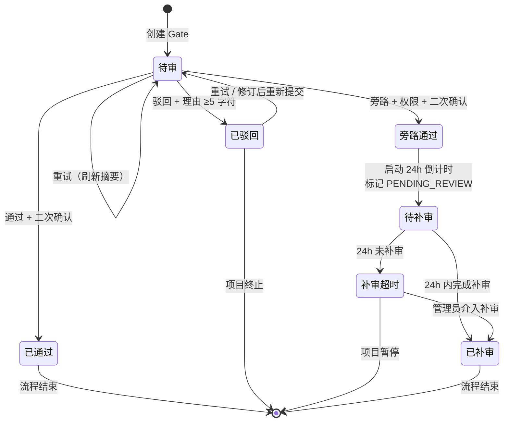
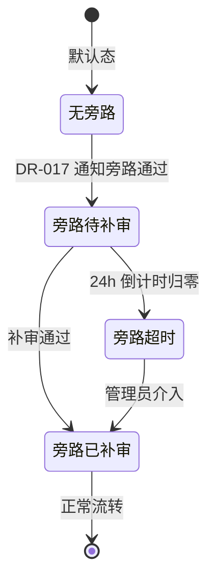

# DR-004：审批中心（Gate Center）模块详细设计

> **模块编号**：DR-004  
> **模块名称**：审批中心（Gate Center）  
> **版本**：v1.0  
> **设计状态**：FROZEN  
> **上游追溯**：DR-004 详细需求（REQ-P0-008/009/026, BR-002/009/014/017/027）  
> **下游消费**：DR-003（Stage 审查状态同步）、DR-007（下游 Stage 解锁）、DR-017（旁路审批服务）  
> **变更**：sdlc-visualizer

---

## 1. 架构组件与职责

### 1.1 组件总览

```
┌─────────────────────────────────────────────────────────────┐
│                      GateCenterModule                        │
│  ┌─────────────┐  ┌─────────────┐  ┌─────────────┐         │
│  │ GateListPage │  │GateDetailPage│  │GateHistoryPage│       │
│  └──────┬──────┘  └──────┬──────┘  └──────┬──────┘         │
│         │                │                │                │
│  ┌──────┴──────┐  ┌──────┴──────┐  ┌──────┴──────┐         │
│  │StatCards    │  │SelfCheckPanel│  │FilterBar    │         │
│  │GateCardList │  │DecisionPanel │  │HistoryTable │         │
│  │FilterBar    │  │ProductTable  │  │ExportCSV    │         │
│  └─────────────┘  │BypassTrigger │  └─────────────┘         │
│                   └─────────────┘                            │
│  ┌────────────────────────────────────────────────────────┐ │
│  │              GateStateManager (Zustand Store)           │ │
│  │  - currentGate / gateList / historyList / bypassState   │ │
│  └────────────────────────────────────────────────────────┘ │
└─────────────────────────────────────────────────────────────┘
```

| 组件 | 类型 | 职责 |
|------|------|------|
| `GateListPage` | 页面 | Gate 列表页（Pg_GateList）：统计卡片 + Gate 卡片列表 + 筛选栏 |
| `StatCards` | UI 组件 | 三卡片：待审 Gate 数 / 已通过数 / 已驳回数（立项 Gate 单独标记，BR-017） |
| `GateCardList` | UI 组件 | Gate 卡片网格渲染，含状态、置信度、阻塞下游信息 |
| `GateDetailPage` | 页面 | Gate 审批详情页（Pg_GateDetail）：自检摘要 + 决策操作区 + 关联产物 + 决策历史 |
| `SelfCheckPanel` | UI 组件 | 自检摘要卡片：置信度标签 + 产物完整性 + 质量门禁结果 + 风险点列表 |
| `DecisionPanel` | UI 组件 | 决策按钮组：通过 / 驳回 / 重试 + 上次决策信息 + 紧急旁路入口（权限控制） |
| `ProductTable` | UI 组件 | 关联产物表格：名称、类型、状态、批注数 |
| `BypassTrigger` | UI 组件 | 旁路审批弹层触发按钮，权限校验后展示 |
| `GateHistoryPage` | 页面 | Gate 历史追溯页（Pg_GateHistory）：筛选栏 + 历史记录列表 + 导出 |
| `HistoryTable` | UI 组件 | 决策记录表格：项目、Gate 类型、结论、决策人、时间、耗时 |
| `FilterBar` | UI 组件 | 组合筛选：项目 / Gate 类型 / 结论 / 时间范围 |
| `GateStateManager` | Zustand Store | Gate 列表状态、当前 Gate 详情、决策操作加载态、实时同步 |

### 1.2 自检摘要生成流程

```
用户进入 Gate 详情页
    │
    ▼
[前端请求自检摘要 API]
    │
    ▼
[后端 GateSummaryService 组装数据]
    ├──→ 调用质量门禁模块：产物完整性结果（SI_004）
    ├──→ 调用质量门禁模块：质量门禁结果（SI_005）
    ├──→ 调用 AI 服务：风险点列表（SI_006）+ 置信度（SI_007）
    └──→ 调用阶段编排模块：下游 Stage 列表（SI_008）
    │
    ▼
[后端计算置信度并返回结构化摘要]
    │
    ▼
[前端渲染 SelfCheckPanel]
```

**置信度计算规则**（后端实现）：
- **高**：产物完整性全部通过 + 质量门禁全部通过 + 风险点 = 0
- **中**：产物完整性通过但存在警告 或 质量门禁部分通过 或 风险点 ≤ 2
- **低**：产物完整性存在失败 或 质量门禁存在失败 或 风险点 > 2

### 1.3 跨模块依赖

| 依赖方 | 被依赖模块 | 依赖内容 | 接口类型 |
|--------|-----------|----------|----------|
| DR-004 | DR-003 | 产物批注数据（驳回时关联批注）、审查状态 | REST / 状态更新 |
| DR-004 | DR-007 | 下游 Stage 解锁、Stage 状态变更 | REST |
| DR-004 | DR-017 | 旁路审批记录创建、倒计时状态、补审结果 | REST |
| DR-004 | 质量门禁模块 | 产物完整性校验结果、质量门禁检查项结果 | REST |
| DR-004 | AI 服务 | 风险点列表、摘要置信度评估 | REST |

---

## 2. 接口定义

### 2.1 模块对外提供接口

#### `GET /api/v1/gates`

查询当前项目 Gate 列表。

**Query Params**:
- `project_id`: string（必填）
- `gate_type`: `1` | `2` | `2.5` | `3` | `initiation`（可选，多选用逗号分隔）
- `status`: `pending` | `passed` | `rejected` | `bypassed`（可选，多选）
- `sort_by`: `created_at` | `status`（默认 `created_at`）
- `sort_order`: `asc` | `desc`（默认 `desc`）

**Response**: `GateListResponseDTO`

```typescript
interface GateListResponseDTO {
  stats: {
    pending_count: number;           // 待审（不含立项）
    passed_count: number;
    rejected_count: number;
    initiation_count: number;        // 立项 Gate 单独计数（BR-017）
  };
  gates: GateCardDTO[];
}

interface GateCardDTO {
  gate_id: string;
  gate_type: "1" | "2" | "2.5" | "3" | "initiation";
  gate_name: string;
  status: GateStatus;                // pending / passed / rejected / bypassed
  confidence: "high" | "medium" | "low" | null;
  product_integrity_summary: {
    total: number;
    passed: number;
    warning: number;
    failed: number;
  };
  quality_gate_summary: {
    total: number;
    passed: number;
    failed: number;
  };
  risk_count: number;
  blocked_stages: string[];          // 下游被阻塞的 Stage 名称列表
  created_at: string;
  decision_at: string | null;
  decision_by: string | null;
  decision_duration_sec: number | null;
}
```

#### `GET /api/v1/gates/{gate_id}`

获取 Gate 审批详情。

**Response**: `GateDetailDTO`

```typescript
interface GateDetailDTO {
  gate_id: string;
  gate_type: string;
  gate_name: string;
  status: GateStatus;
  project_id: string;
  project_name: string;

  self_check_summary: SelfCheckSummaryDTO;
  decision_buttons: DecisionButtonsStateDTO;
  related_products: RelatedProductDTO[];
  decision_history: DecisionHistoryDTO[];
  bypass_info: BypassInfoDTO | null;
}

interface SelfCheckSummaryDTO {
  confidence: "high" | "medium" | "low";
  product_integrity: {
    items: IntegrityItemDTO[];       // 各产物校验状态列表
  };
  quality_gate: {
    items: QualityGateItemDTO[];     // 门禁检查项列表
  };
  risk_points: RiskPointDTO[];
  generated_at: string;
  generation_duration_ms: number;
}

interface IntegrityItemDTO {
  product_name: string;
  status: "passed" | "warning" | "failed";
  detail?: string;
}

interface QualityGateItemDTO {
  check_name: string;
  status: "passed" | "failed";
  detail?: string;
}

interface RiskPointDTO {
  description: string;
  severity: "high" | "medium" | "low";
}

interface DecisionButtonsStateDTO {
  approve_enabled: boolean;          // false if confidence === "low" (BR-009)
  reject_enabled: boolean;
  retry_enabled: boolean;
  bypass_visible: boolean;           // 仅当有"紧急旁路"权限时 (BR-014)
  bypass_enabled: boolean;
}

interface RelatedProductDTO {
  product_id: string;
  product_name: string;
  product_type: string;
  status: "confirmed" | "pending" | "warning";
  annotation_count: number;
}

interface DecisionHistoryDTO {
  decision_id: string;
  decision_type: "approve" | "reject" | "retry" | "bypass";
  decision_by: string;
  decision_at: string;
  duration_sec: number;
  reason?: string;                    // 驳回理由
  bypass_reason?: string;             // 旁路原因
}

interface BypassInfoDTO {
  bypass_record_id: string;
  bypass_status: "pending_review" | "reviewed" | "timeout";
  authorized_by: string;
  authorized_at: string;
  countdown_remaining_sec: number | null;
}
```

#### `POST /api/v1/gates/{gate_id}/approve`

Gate 通过审批。

**Request**: `{ confirmed: boolean; }`（二次确认标志）

**Response**: `{ gate_id: string; status: "passed"; unlocked_stages: string[]; }`

**Error Codes**:
- `GATE_ALREADY_DECIDED` — Gate 已被审批
- `CONFIDENCE_TOO_LOW` — 置信度为低，禁止通过（BR-009）
- `INSUFFICIENT_PERMISSION` — 无审批权限

#### `POST /api/v1/gates/{gate_id}/reject`

Gate 驳回审批。

**Request**: `{ reason: string; }`（必填，5-500 字符）

**Response**: `{ gate_id: string; status: "rejected"; associated_annotations: string[]; }`

**副作用**：
1. 将驳回理由作为批注关联到该 Gate 下所有状态为 `pending` 或 `warning` 的关联产物（BR-027）
2. 调用 DR-003 接口写入批注：`POST /api/v1/stages/{stage_id}/annotations`

#### `POST /api/v1/gates/{gate_id}/retry`

重试生成自检摘要。

**Response**: `{ gate_id: string; status: "pending"; summary_cleared: boolean; }`

**副作用**：清除上次摘要缓存，重新请求质量门禁和 AI 服务。

#### `GET /api/v1/gates/history`

查询 Gate 决策历史。

**Query Params**:
- `project_id`: string（可选）
- `gate_type`: string（可选，多选）
- `decision_type`: string（可选，多选：approve/reject/bypass）
- `start_date`: string（ISO 日期，可选）
- `end_date`: string（ISO 日期，可选）
- `page`: number（默认 1）
- `page_size`: number（默认 20，最大 100）

**Response**: `{ total: number; records: GateHistoryRecordDTO[]; }`

```typescript
interface GateHistoryRecordDTO {
  record_id: string;
  project_id: string;
  project_name: string;
  gate_type: string;
  gate_name: string;
  decision_type: "approve" | "reject" | "retry" | "bypass";
  decision_by: string;
  decision_at: string;
  duration_sec: number;
  confidence: string | null;
  reason?: string;
  bypass_authorized_by?: string;
}
```

#### `GET /api/v1/gates/history/export`

导出历史记录为 CSV。

**Query Params**: 同 `/history`

**Response**: `text/csv` 文件下载

### 2.2 模块消费的外部接口

| 接口 | 提供方 | 用途 | 调用时机 |
|------|--------|------|----------|
| `GET /api/v1/quality-gate/results` | 质量门禁模块 | 产物完整性、门禁检查结果 | 摘要生成时 |
| `POST /api/v1/ai/summary` | AI 服务 | 风险点评估、置信度计算 | 摘要生成时 |
| `GET /api/v1/stages/{stage_id}/downstream` | DR-007 | 获取下游 Stage 列表 | 摘要渲染时 |
| `PUT /api/v1/stages/{stage_id}/unlock` | DR-007 | Gate 通过后解锁下游 Stage | 审批通过时 |
| `POST /api/v1/stages/{stage_id}/annotations` | DR-003 | 驳回理由关联为批注（BR-027） | 驳回审批时 |
| `PUT /api/v1/stages/{stage_id}/review-status` | DR-003 | 更新审查状态为 PASSED/REVISION_REQUESTED | 审批通过/驳回时 |
| `POST /api/v1/bypass` | DR-017 | 创建旁路审批记录 | 发起旁路时 |

---

## 3. 数据表结构

### 3.1 模块独占表

> **公共表**：权威 DDL 定义见 `shared/db-schema.md#gate_decisions`。以下为设计上下文补充。
>
> 写方：DR-004 | 读方：DR-003, DR-004

#### `gate_decisions` — Gate 决策记录表

| 字段 | 类型 | 约束 | 说明 |
|------|------|------|------|
| `decision_id` | TEXT | PK | UUID v4 |
| `gate_id` | TEXT | NOT NULL, UNIQUE（每 Gate 仅一条最终决策） | Gate 标识 |
| `project_id` | TEXT | FK → `projects.project_id`, NOT NULL | 关联项目 |
| `gate_type` | TEXT | NOT NULL | `1` / `2` / `2.5` / `3` / `initiation` |
| `status` | TEXT | NOT NULL | `pending` / `passed` / `rejected` / `bypassed` |
| `confidence` | TEXT | | `high` / `medium` / `low` |
| `decision_type` | TEXT | | `approve` / `reject` / `retry` / `bypass` |
| `decision_by` | TEXT | | 决策人 |
| `decision_at` | DATETIME | | 决策时间 |
| `duration_sec` | INTEGER | CHECK ≥ 0 | 审批耗时（秒） |
| `reason` | TEXT | | 驳回理由（5-500 字符） |
| `self_check_summary` | TEXT | | JSON 字符串：完整性/门禁/风险点快照 |
| `unlocked_stages` | TEXT | | JSON 数组：已解锁的下游 Stage ID |
| `created_at` | DATETIME | NOT NULL, DEFAULT CURRENT_TIMESTAMP | 创建时间 |
| `updated_at` | DATETIME | NOT NULL, DEFAULT CURRENT_TIMESTAMP | 更新时间 |

**索引**: `IDX_GD_PROJECT` (`project_id`), `IDX_GD_STATUS` (`status`), `IDX_GD_DECISION_AT` (`decision_at`)

> **公共表**：权威 DDL 定义见 `shared/db-schema.md#gate_decision_history`。以下为设计上下文补充。
>
> 写方：DR-004 | 读方：DR-004

#### `gate_decision_history` — Gate 决策历史明细表

| 字段 | 类型 | 约束 | 说明 |
|------|------|------|------|
| `history_id` | TEXT | PK | UUID v4 |
| `gate_id` | TEXT | FK → `gate_decisions.gate_id`, NOT NULL | 关联 Gate |
| `decision_type` | TEXT | NOT NULL | `approve` / `reject` / `retry` / `bypass` |
| `decision_by` | TEXT | NOT NULL | 操作人 |
| `decision_at` | DATETIME | NOT NULL | 操作时间 |
| `duration_sec` | INTEGER | | 耗时 |
| `reason` | TEXT | | 理由 |
| `metadata` | TEXT | | JSON：附加信息 |

**索引**: `IDX_GDH_GATE_ID` (`gate_id`, `decision_at DESC`)

#### `gate_related_products` — Gate 关联产物表

| 字段 | 类型 | 约束 | 说明 |
|------|------|------|------|
| `relation_id` | TEXT | PK | UUID v4 |
| `gate_id` | TEXT | NOT NULL | 关联 Gate |
| `product_id` | TEXT | NOT NULL | 产物标识 |
| `product_name` | TEXT | NOT NULL | 产物名称 |
| `product_type` | TEXT | NOT NULL | 产物类型 |
| `status` | TEXT | NOT NULL, DEFAULT `pending` | `confirmed` / `pending` / `warning` |
| `annotation_count` | INTEGER | NOT NULL, DEFAULT 0 | 批注数量 |

**索引**: `IDX_GRP_GATE` (`gate_id`)

### 3.2 表写权限声明

| 表名 | 写模块 | 读模块 | 说明 |
|------|--------|--------|------|
| `gate_decisions` | DR-004 | DR-004, DR-003 | Gate 最终决策状态 |
| `gate_decision_history` | DR-004 | DR-004 | 决策历史追溯 |
| `gate_related_products` | DR-004 | DR-004, DR-003 | 关联产物状态 |

> **跨模块写声明**：DR-004 在审批通过后更新 `stage_review_status.current_status`（DR-003 表），在驳回后写入 `stage_annotations`（DR-003 表），在通过后调用 DR-007 解锁下游 Stage。这些跨模块写操作通过 REST 接口完成，不直接操作对方数据库表。

---

## 4. 状态机

### 4.1 Gate 决策状态机



**状态说明**：

| 状态 | 英文标识 | 下游阻塞 | 自检摘要 | 决策操作 | 旁路入口 |
|------|---------|:--------:|:--------:|:--------:|:--------:|
| 待审 | `PENDING` | ✅ 阻塞 | ✅ 展示 | ✅ 可用 | ✅ 权限控制 |
| 已通过 | `PASSED` | ❌ 解锁 | ❌ 隐藏 | ❌ 禁用 | ❌ 隐藏 |
| 已驳回 | `REJECTED` | ✅ 阻塞 | ✅ 展示 | ✅ 可用（重试） | ❌ 隐藏 |
| 旁路通过 | `BYPASS_PASSED` | ❌ 解锁 | ⚠️ 弱化展示 | ❌ 禁用 | ❌ 隐藏 |
| 待补审 | `PENDING_REVIEW` | ⚠️ 旁路解锁但需补审 | ❌ 隐藏 | ❌ 禁用 | ❌ 隐藏 |
| 补审超时 | `REVIEW_TIMEOUT` | ✅ 重新阻塞 | ❌ 隐藏 | ❌ 禁用 | ❌ 隐藏 |
| 已补审 | `REVIEWED` | ❌ 解锁 | ❌ 隐藏 | ❌ 禁用 | ❌ 隐藏 |

### 4.2 决策按钮状态矩阵

| Gate 状态 | 通过按钮 | 驳回按钮 | 重试按钮 | 旁路按钮 | 说明 |
|:---------:|:--------:|:--------:|:--------:|:--------:|:----:|
| 待审 | 置信度≠低时可用 | 可用 | 可用 | 有权限时可见 | 标准审批态 |
| 已通过 | 禁用 | 禁用 | 禁用 | 隐藏 | 决策不可逆（AC-N-001） |
| 已驳回 | 禁用 | 禁用 | 可用 | 隐藏 | 重试后回退到待审 |
| 旁路通过 | 禁用 | 禁用 | 禁用 | 隐藏 | 等待补审 |

### 4.3 旁路审批子状态机

旁路审批的完整生命周期由 DR-017 管理，DR-004 仅消费其状态：



---

## 5. 边界条件与异常处理

### 5.1 单元测试（Jest + React Testing Library）

| 测试目标 | 测试内容 | 预期覆盖率 |
|----------|----------|:----------:|
| `SelfCheckPanel` | 置信度标签渲染、颜色编码、展开/折叠 | ≥ 80% |
| `DecisionPanel` | 按钮可用性矩阵、低置信度禁用、加载态 | ≥ 85% |
| `GateCardList` | 筛选响应、排序、立项 Gate 单独计数 | ≥ 80% |
| `GateStateManager` | 状态流转、实时同步、乐观更新 | ≥ 85% |
| `ConfidenceCalculator` | 高/中/低边界条件、全部通过/部分失败 | ≥ 90% |

### 5.2 集成测试（Playwright）

| 测试场景 | 验证点 |
|----------|--------|
| Gate 标准通过 | 高置信度 → 点击通过 → 二次确认 → 下游解锁 → 列表状态同步 |
| Gate 低置信度拦截 | 低置信度 → 通过按钮禁用 → hover 提示 → 只能驳回/重试 |
| Gate 驳回关联批注 | 填写理由 → 确认驳回 → 关联产物显示批注角标 → DR-003 批注列表可查 |
| 旁路审批全流程 | 有权限 → 点击紧急旁路 → 填写原因 → 确认 → 状态变为旁路通过 → 倒计时展示 |
| 历史查询与导出 | 多条件筛选 → 1s 内刷新 → 导出 CSV → 字段完整 |
| 下游阻塞校验 | Gate 未通过时 → 尝试访问下游 Stage → 被拦截 → 提示锁定 |

### 5.3 性能测试

| 指标 | 目标值 | 测试方法 |
|------|--------|----------|
| 自检摘要生成 | ≤ 500ms（SQLite 本地） | 自动化 API 测试 |
| 审批操作反馈 | ≤ 30s（端到端） | Playwright 计时 |
| 历史查询 | ≤ 1s（100 条记录） | API 基准测试 |
| 状态同步 | ≤ 1s（GateDetail → GateList） | 前端状态广播验证 |

### 5.4 安全与异常测试

| 场景 | 测试方法 | 预期表现 |
|------|----------|----------|
| 低置信度绕过前端 | 直接调用 approve API | 服务端拒绝 `CONFIDENCE_TOO_LOW` |
| 无权限旁路 | 无权限用户调用 bypass API | 服务端拒绝 `INSUFFICIENT_PERMISSION` |
| 并发审批冲突 | 双用户同时提交 | 乐观锁/后提交者收到状态变更提示 |
| 驳回理由过短 | 提交 3 字符理由 | 服务端校验失败，返回 `REASON_TOO_SHORT` |
| 决策后回退 | 已通过 Gate 调用 reject | 服务端拒绝 `GATE_ALREADY_DECIDED` |
