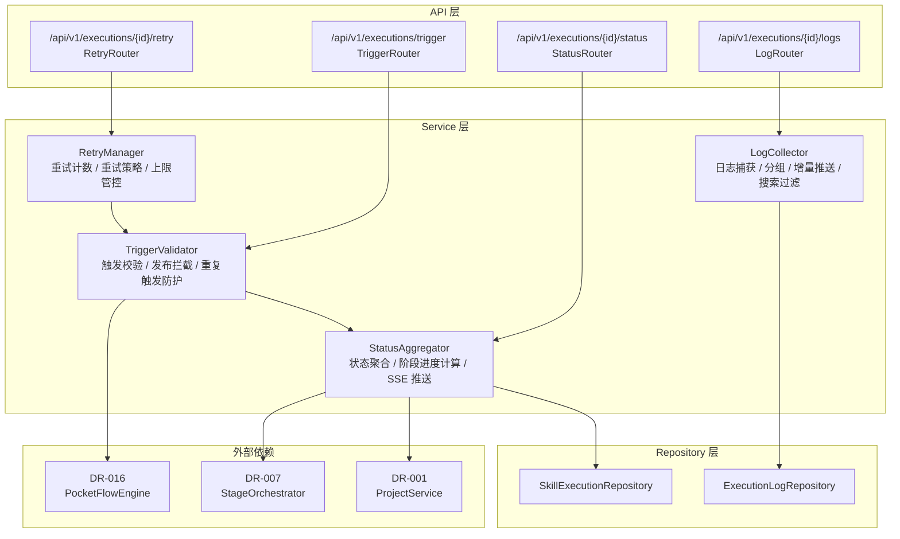
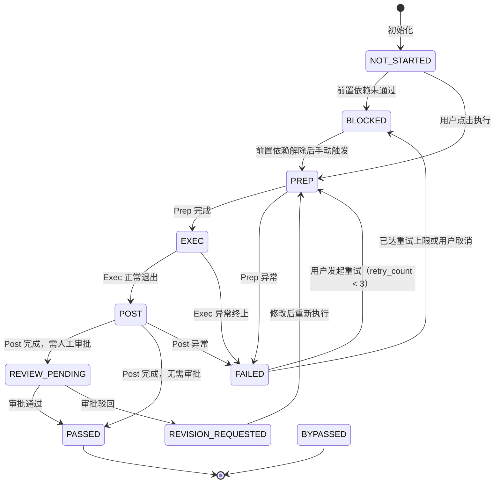

# DR-008 Skill 调度服务 — 模块详细设计

> **模块编号**：DR-008  
> **模块名称**：Skill 调度服务（Skill Executor Service）  
> **版本**：v1.0  
> **状态**：FROZEN  
> **设计日期**：2026-06-02  
> **上游基线**：PRD-000 v2.0-patch2 / HLD-001~003 / DR-008 详细需求

---

## 1. 模块架构与组件设计

### 1.1 模块定位

调度服务是 Skill 执行的**入口网关与状态管家**，负责：
- **执行触发管理**：Stage 节点按钮触发、批量执行、重试发起
- **生命周期监控**：跟踪 Skill 从 Prep 到 Exec 到 Post 的完整状态流转
- **状态实时同步**：通过 SSE/轮询向前端推送执行状态与进度
- **日志收集与展示**：按 Skill 实例分组捕获日志，支持搜索、过滤、下载
- **重试与拦截**：失败重试（最多 3 次）、发布类 Skill 人工确认拦截

> **边界说明**：本模块不负责 PocketFlow 三阶段的具体实现（由 DR-016 负责），而是作为**调度编排层**调用 DR-016 执行单个 Skill，并聚合其返回的状态、日志和产物信息。

### 1.2 内部分层架构



### 1.3 核心类设计

#### `TriggerValidator`

```python
class TriggerValidator:
    """执行触发校验器，负责权限检查、发布拦截、重复触发防护。"""

    async def validate_trigger(
        self,
        dto: ExecutionTriggerDTO,
    ) -> TriggerValidationResultDTO:
        """校验触发条件：前置依赖、环境就绪、非执行中、发布类 Skill 人工确认。"""

    def _is_release_skill(self, skill_name: str) -> bool:
        """判定 Skill 是否为发布相关类型（release-management / finish / git-automation）。"""
```

#### `StatusAggregator`

```python
class StatusAggregator:
    """状态聚合器，负责实时状态同步与 SSE 推送。"""

    async def poll_execution_status(
        self,
        execution_id: str,
        last_anchor: str | None,
    ) -> ExecutionStatusDeltaDTO:
        """轮询执行状态，返回自上次 anchor 以来的增量变更。"""

    async def subscribe_sse(
        self,
        execution_id: str,
    ) -> AsyncIterable[SSEEventDTO]:
        """建立 SSE 连接，实时推送状态变更。"""

    async def calculate_stage_progress(
        self,
        execution_id: str,
    ) -> StageProgressDTO:
        """计算 Stage 进度百分比（基于 Prep/Exec/Post 耗时估算）。"""
```

#### `LogCollector`

```python
class LogCollector:
    """日志收集器，负责 stdout/stderr 捕获与前端展示。"""

    async def capture_logs(
        self,
        execution_id: str,
        log_stream: AsyncIterable[str],
    ) -> None:
        """实时捕获日志流，按行解析级别（INFO/WARN/ERROR/DEBUG），写入存储。"""

    async def query_logs(
        self,
        execution_id: str,
        filters: LogFilterDTO,
        anchor: str | None,
    ) -> LogQueryResultDTO:
        """查询日志，支持关键字搜索、级别过滤、增量拉取。"""
```

#### `RetryManager`

```python
class RetryManager:
    """重试管理器，负责失败重试策略与上限管控。"""

    async def attempt_retry(
        self,
        execution_id: str,
    ) -> RetryResultDTO:
        """发起重试，校验重试次数 < 3，关联前次执行记录。"""
```

### 1.4 模块依赖清单

| 依赖模块 | 依赖类型 | 调用方式 | 用途 |
|----------|----------|----------|------|
| DR-016 PocketFlow 引擎 | 强依赖 | Service 注入 | 调用 Prep/Exec/Post 三阶段执行 |
| DR-007 编排引擎 | 强依赖 | Service 注入 | 获取执行计划、Stage 就绪状态 |
| DR-001 项目工作台 | 弱依赖 | Service 注入 | 获取项目路径、状态 |
| DR-004 审批中心 | 弱依赖 | Service 注入 | Gate 状态查询（通过 DR-007） |

---

## 2. 接口定义

### 2.1 RESTful 端点清单

| 方法 | 路径 | 操作 | 说明 |
|:----:|:-----|:-----|:-----|
| POST | `/api/v1/executions/trigger` | 触发执行 | 单 Skill 或批量执行 |
| GET | `/api/v1/executions/{execution_id}/status` | 查询状态 | 含阶段、进度、整体状态 |
| GET | `/api/v1/executions/{execution_id}/logs` | 查询日志 | 支持搜索、过滤、增量 |
| POST | `/api/v1/executions/{execution_id}/retry` | 重试执行 | 失败后可重试，最多 3 次 |
| POST | `/api/v1/executions/{execution_id}/confirm-release` | 发布确认 | 发布类 Skill 的人工确认 |
| GET | `/api/v1/executions/{execution_id}/sse` | SSE 状态流 | 实时推送状态变更 |

### 2.2 请求 / 响应 DTO

#### `ExecutionTriggerDTO`

```yaml
ExecutionTriggerDTO:
  type: object
  required: [trigger_action, target_stage_id]
  properties:
    trigger_action: {type: string, enum: [SINGLE_EXECUTE, BATCH_EXECUTE, RETRY]}
    target_stage_id: {type: string}
    target_skill_name: {type: string, nullable: true, description: "SINGLE_EXECUTE 时必填"}
    confirm_release: {type: boolean, nullable: true, description: "发布类 Skill 必须 true"}
    previous_execution_id: {type: string, nullable: true, description: "RETRY 时必填"}
```

#### `ExecutionStatusDTO`

```yaml
ExecutionStatusDTO:
  type: object
  properties:
    execution_id: {type: string}
    current_phase: {type: string, enum: [PREP, EXEC, POST, NONE]}
    phase_status: {type: string, enum: [RUNNING, COMPLETED, FAILED]}
    overall_status: {type: string, enum: [NOT_STARTED, RUNNING, SUCCESS, FAILED, UNKNOWN]}
    stage_progress_percent: {type: integer, minimum: 0, maximum: 100}
    status_timestamp: {type: string, format: date-time}
    artifact_paths: {type: array, items: {type: string}}
    error_summary: {type: string, nullable: true}
```

#### `LogFilterDTO`

```yaml
LogFilterDTO:
  type: object
  properties:
    keyword: {type: string, maxLength: 100}
    level: {type: string, enum: [ALL, INFO, WARN, ERROR, DEBUG], default: ALL}
    anchor: {type: string, nullable: true, description: "上次拉取的日志游标"}
```

#### `LogQueryResultDTO`

```yaml
LogQueryResultDTO:
  type: object
  properties:
    log_entries:
      type: array
      items:
        type: object
        properties:
          timestamp: {type: string, format: date-time}
          level: {type: string, enum: [INFO, WARN, ERROR, DEBUG]}
          content: {type: string}
    total_count: {type: integer}
    next_anchor: {type: string}
```

### 2.3 错误码定义

| HTTP 状态码 | 业务错误码 | 错误消息模板 | 触发场景 |
|:-----------:|:-----------|:-------------|:---------|
| 400 | `EXECUTION_ALREADY_IN_PROGRESS` | "该 Skill 正在执行中，请勿重复触发" | 重复触发 |
| 400 | `RELEASE_CONFIRMATION_REQUIRED` | "发布类 Skill 需人工确认后方可执行" | 未确认发布类 Skill |
| 400 | `RETRY_LIMIT_EXCEEDED` | "该 Skill 已失败 3 次，请联系支持" | 重试次数 ≥ 3 |
| 400 | `RETRY_NOT_AVAILABLE` | "当前状态不可重试（非 FAILED 或已达上限）" | 非失败状态发起重试 |
| 409 | `STAGE_BLOCKED` | "前置依赖未满足，Stage 被阻断" | 触发时前置 Stage 未完成 |
| 500 | `STATUS_SYNC_FAILED` | "状态同步失败，请手动刷新" | 轮询/SSE 异常 |

---

## 3. 数据表结构

### 3.1 本模块独占表

#### `skill_executions` — Skill 执行记录表

```sql
CREATE TABLE skill_executions (
    execution_id        VARCHAR(36) PRIMARY KEY,
    project_id          VARCHAR(36) NOT NULL,
    stage_id            VARCHAR(36) NOT NULL,
    skill_id            VARCHAR(36) NOT NULL,
    skill_name          VARCHAR(128) NOT NULL,
    trigger_action      VARCHAR(16) NOT NULL
                        CHECK (trigger_action IN ('SINGLE_EXECUTE', 'BATCH_EXECUTE', 'RETRY')),
    current_phase       VARCHAR(16) NOT NULL DEFAULT 'NONE'
                        CHECK (current_phase IN ('PREP', 'EXEC', 'POST', 'NONE')),
    phase_status        VARCHAR(16) NOT NULL DEFAULT 'RUNNING'
                        CHECK (phase_status IN ('RUNNING', 'COMPLETED', 'FAILED')),
    overall_status      VARCHAR(16) NOT NULL DEFAULT 'NOT_STARTED'
                        CHECK (overall_status IN ('NOT_STARTED', 'RUNNING', 'SUCCESS', 'FAILED', 'UNKNOWN')),
    retry_count         INTEGER NOT NULL DEFAULT 0
                        CHECK (retry_count BETWEEN 0 AND 3),
    previous_execution_id VARCHAR(36),                   -- 重试时关联前次执行
    is_release_skill    BOOLEAN NOT NULL DEFAULT FALSE,
    release_confirmed   BOOLEAN NOT NULL DEFAULT FALSE,
    started_at          TIMESTAMP,
    completed_at        TIMESTAMP,
    created_at          TIMESTAMP NOT NULL DEFAULT CURRENT_TIMESTAMP,

    CONSTRAINT fk_exec_project FOREIGN KEY (project_id) REFERENCES projects(project_id) ON DELETE CASCADE,
    CONSTRAINT fk_exec_prev FOREIGN KEY (previous_execution_id) REFERENCES skill_executions(execution_id) ON DELETE SET NULL
);

CREATE INDEX idx_exec_project ON skill_executions(project_id);
CREATE INDEX idx_exec_stage ON skill_executions(stage_id);
CREATE INDEX idx_exec_skill ON skill_executions(skill_id);
CREATE INDEX idx_exec_status ON skill_executions(overall_status);
```

> **设计说明**：
> - `overall_status` 为聚合状态，反映 Skill 执行的最终结果；DR-016 的 `final_status`（PASSED/FAILED）映射到本表的 SUCCESS/FAILED。
> - `previous_execution_id` 自引用，支持重试链路追溯。

#### `execution_logs` — 执行日志表

```sql
CREATE TABLE execution_logs (
    log_id              VARCHAR(36) PRIMARY KEY,
    execution_id        VARCHAR(36) NOT NULL,
    log_anchor          VARCHAR(32) NOT NULL,            -- 游标标识，用于增量拉取
    timestamp           TIMESTAMP NOT NULL DEFAULT CURRENT_TIMESTAMP,
    level               VARCHAR(8) NOT NULL
                        CHECK (level IN ('INFO', 'WARN', 'ERROR', 'DEBUG')),
    content             TEXT NOT NULL,

    CONSTRAINT fk_log_exec FOREIGN KEY (execution_id) REFERENCES skill_executions(execution_id) ON DELETE CASCADE
);

CREATE INDEX idx_logs_exec ON execution_logs(execution_id, log_anchor);
CREATE INDEX idx_logs_level ON execution_logs(execution_id, level);
```

> **设计说明**：
> - `log_anchor` 为单调递增的游标（如时间戳哈希或自增序号），前端通过 `anchor` 参数增量拉取新日志。
> - 日志内容按 Skill 实例隔离，禁止跨实例混写。

### 3.2 依赖公共表

| 表名 | 引用路径 | 使用方式 | 本模块关联字段 |
|------|----------|----------|---------------|
| `projects` | `shared/db-schema.md#projects` | 读取 | `skill_executions.project_id` |
| `project_stages` | `shared/db-schema.md#project_stages` | 读取 | Stage 状态查询 |

---

## 4. 模块状态机

### 4.1 Skill 级状态机（调度视角）



**状态映射到 DR-016**：

| DR-008 状态 | DR-016 对应状态 | 说明 |
|-------------|-----------------|------|
| PREP / EXEC / POST (RUNNING) | PREP / EXEC / POST | 执行中，状态实时同步 |
| PASSED | PASSED | 执行成功，无需审批 |
| FAILED | FAILED (PREP_FAILED / EXEC_FAILED / POST_FAILED) | 执行失败 |
| REVIEW_PENDING | — | Post 完成后的审批等待态，由 DR-004 驱动流转 |
| REVISION_REQUESTED | — | 审批驳回，等待修改后重新触发 |

---

## 5. 边界条件与异常处理

### 5.1 单元测试用例

| 用例 ID | 追溯 AC | Given / When / Then |
|---------|:-------:|:--------------------|
| UT-001 | AC-F-001 | Given 用户点击执行按钮，When `validate_trigger()`，Then 3s 内触发 DR-016 Prep |
| UT-002 | AC-F-004 | Given 失败 Skill，When 第 3 次重试仍失败，Then 重试按钮禁用，提示联系支持 |
| UT-003 | AC-F-005 | Given 发布类 Skill，When 未勾选确认，Then 拒绝执行并提示人工确认 |
| UT-004 | AC-F-006 | Given 主 Skill 失败，When 状态聚合，Then Stage 标记 FAILED，下游阻断 |
| UT-005 | AC-NF-003 | Given 实时日志流，When 新日志产生，Then 100% 捕获，无丢失或乱序 |
| UT-006 | AC-EC-002 | Given 执行中 Skill，When 用户重复触发，Then 拒绝并提示"执行中" |

### 5.2 集成测试场景

| 场景 ID | 涉及模块 | 场景描述 |
|---------|----------|----------|
| IT-001 | DR-008 + DR-016 | 触发执行 → DR-016 三阶段完成 → DR-008 状态变为 PASSED → 前端 SSE 收到通知 |
| IT-002 | DR-008 + DR-007 | 批量执行 Module 内 3 个无依赖 Skills → DR-007 并行组调度 → DR-008 同时触发 3 个 PocketFlow |
| IT-003 | DR-008 + DR-004 | Skill 执行完成进入 REVIEW_PENDING → Gate 审批通过 → DR-008 状态变为 PASSED |

---

## 附录：与概要设计的追溯关系

| 概要设计决策 | 本模块落地位置 | 一致性 |
|-------------|---------------|:------:|
| HLD-002 `skill_executions` 表：Skill 执行记录 | `skill_executions` 表结构 | ✅ |
| HLD-002 `execution_logs` 表：执行日志 | `execution_logs` 表结构 | ✅ |
| HLD-003 BR-005：失败重试最多 3 次 | `RetryManager` + `retry_count` 校验 | ✅ |
| HLD-003 BR-010：发布类 Skill 人工拦截 | `TriggerValidator._is_release_skill()` | ✅ |
| HLD-003 BR-020：主 Skill 失败即 Stage 失败 | `StatusAggregator` 向下游传播 BLOCKED | ✅ |
| HLD-003 实时状态同步：SSE + 轮询兜底 | `StatusAggregator.subscribe_sse()` + `poll_execution_status()` | ✅ |
