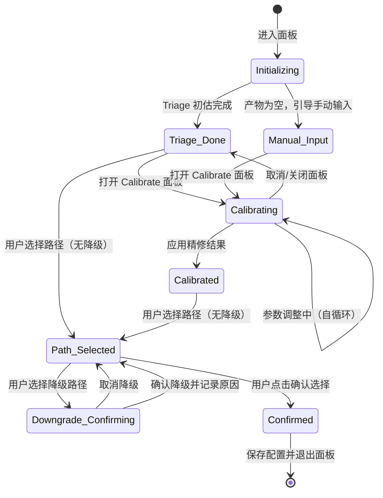
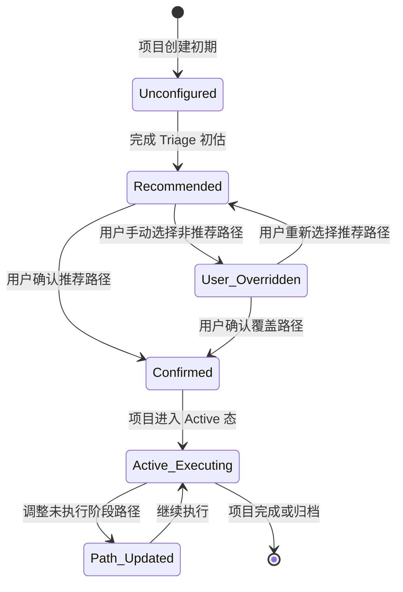

# DR-010：复杂度路由面板（Complexity Router Panel）模块详细设计

> **模块编号**：DR-010  
> **模块名称**：复杂度路由面板（Complexity Router Panel）  
> **版本**：v1.0  
> **设计状态**：FROZEN  
> **上游追溯**：DR-010 详细需求（REQ-P0-016/018/027, BR-011/028/004/001）  
> **下游消费**：DR-009（模板引擎路径配置）、DR-002（SDLC 画布 Stage 渲染）  
> **变更**：sdlc-visualizer

---

## 1. 架构组件与职责

### 1.1 组件总览

```
┌─────────────────────────────────────────────────────────────┐
│                 ComplexityRouterModule                       │
│  ┌─────────────────┐  ┌─────────────────┐  ┌─────────────┐ │
│  │  RouterMainPage │  │ CalibratePanel  │  │DecisionLog  │ │
│  │  (Pg_Complexity)│  │ (Pg_Calibrate)  │  │Drawer       │ │
│  └───────┬─────────┘  └─────────────────┘  └─────────────┘ │
│          │                                                  │
│  ┌───────┴──────────────────────────────────────────┐      │
│  │ TriageResultCard │ PathCardsRow │ PathDetailExpander│   │
│  │ DowngradeConfirmDialog │ MismatchWarningBar         │   │
│  └────────────────────────────────────────────────────┘      │
│  ┌────────────────────────────────────────────────────────┐ │
│  │           ComplexityStateManager (Zustand Store)        │ │
│  │  - triageResult / calibrateResult / selectedPath        │ │
│  │  - decisionHistory / projectStatus / activeStages       │ │
│  └────────────────────────────────────────────────────────┘ │
└─────────────────────────────────────────────────────────────┘
```

| 组件 | 类型 | 职责 |
|------|------|------|
| `RouterMainPage` | 页面 | 复杂度路由面板主页面：Triage 结果 + 四级路径对比 + 操作栏 |
| `TriageResultCard` | UI 组件 | 初估结果展示：等级徽章 + 三档得分（乐观/预期/保守）+ 置信度标签 |
| `PathCardsRow` | UI 组件 | 四级路径卡片横向排列：Trivial / Light / Standard / Deep |
| `PathDetailExpander` | UI 组件 | 路径详情展开区：阶段列表、Skill 数、预估耗时、被跳过的阶段 |
| `MismatchWarningBar` | UI 组件 | 规模不匹配警告条（黄色）：当前路径与评估结果不匹配时持续展示 |
| `CalibratePanel` | 滑出面板 | 五维度参数精修：模块数/接口数/页面数滑块 + 技术复杂度/风险等级单选 |
| `DowngradeConfirmDialog` | 模态对话框 | 降级路径二次确认：对比摘要 + 被跳过阶段列表 + 降级原因输入（≥10 字符） |
| `DecisionLogDrawer` | 侧滑面板 | 路径决策日志：时间倒序列表，含决策类型/路径变更/原因摘要 |
| `ComplexityStateManager` | Zustand Store | 面板状态：Triage 结果、Calibrate 参数、选中路径、决策日志 |

### 1.2 五维度评估引擎

```
FiveDimensionEngine
├── ModuleCounter        # 扫描需求产物，统计模块/实体数量
├── InterfaceScanner     # 扫描接口定义文件，统计接口数量
├── PageDetector         # 扫描页面描述，统计页面数量
├── ComplexityScorer     # 技术复杂度评分（基于技术栈关键词）
├── RiskAssessor         # 风险等级评估（基于风险标记关键词）
└── ScoreCalculator      # 三档得分计算：乐观/预期/保守
```

**评分规则（MVP 固定权重）**：
- 模块数权重：30%（1-50 范围，线性映射到 0-100 分）
- 接口数权重：25%（0-100 范围，线性映射到 0-100 分）
- 页面数权重：20%（0-50 范围，线性映射到 0-100 分）
- 技术复杂度权重：15%（Low=20, Medium=50, High=100）
- 风险等级权重：10%（Low=20, Medium=50, High=100）

**等级阈值**：
- Trivial：得分 ≤ 25
- Light：25 < 得分 ≤ 50
- Standard：50 < 得分 ≤ 75
- Deep：得分 > 75

**三档得分**：乐观（各维度取最小值计算）、预期（正常计算）、保守（各维度取最大值计算）

### 1.3 跨模块依赖

| 依赖方 | 被依赖模块 | 依赖内容 | 接口类型 |
|--------|-----------|----------|----------|
| DR-010 | DR-009 | 四级模板定义（阶段-Skill 绑定、预估耗时） | REST |
| DR-010 | DR-001 | 项目状态（Draft/Active/Archived）、已执行阶段列表 | REST |
| DR-010 | DR-005 | 需求产物文件扫描（模块数/接口数/页面数提取） | REST |
| DR-010 | DR-002 | 路径确认后 Stage 画布渲染更新 | 事件 |

---

## 2. 接口定义

### 2.1 模块对外提供接口

#### `POST /api/v1/complexity/triage`

执行 Triage 初估。

**Request**: `{ project_id: string; artifact_paths?: string[]; }`

**Response**: `TriageResultDTO`

```typescript
interface TriageResultDTO {
  project_id: string;
  grade: "Trivial" | "Light" | "Standard" | "Deep";
  scores: {
    optimistic: number;    // 0-100
    expected: number;
    conservative: number;
  };
  confidence: "High" | "Medium" | "Low";
  dimensions: {
    module_count: number;
    interface_count: number;
    page_count: number;
    tech_complexity: "Low" | "Medium" | "High";
    risk_level: "Low" | "Medium" | "High";
  };
  reasoning_summary: string;  // 简要的判定依据说明
  generated_at: string;
}
```

#### `POST /api/v1/complexity/calculate`

Calibrate 实时计算。

**Request**: `CalibrateRequestDTO`

```typescript
interface CalibrateRequestDTO {
  project_id: string;
  module_count: number;      // 1-50
  interface_count: number;   // 0-100
  page_count: number;        // 0-50
  tech_complexity: "Low" | "Medium" | "High";
  risk_level: "Low" | "Medium" | "High";
}
```

**Response**: `TriageResultDTO`（同 Triage 响应结构）

**性能要求**：响应时间 < 500ms（P95）

#### `GET /api/v1/complexity/paths`

获取四级路径对比数据。

**Query Params**: `project_id`

**Response**: `PathComparisonDTO[]`

```typescript
interface PathComparisonDTO {
  level: "Trivial" | "Light" | "Standard" | "Deep";
  stage_count: number;
  skill_count: number;
  estimated_hours: number;
  description: string;       // 适用场景一句话描述
  stages: PathStageDTO[];
  skipped_stages: string[];  // 相对于 Standard 路径被跳过的阶段
  is_recommended: boolean;
}

interface PathStageDTO {
  stage_id: string;
  stage_name: string;
  stage_type: string;
  skills: string[];
  estimated_hours: number;
}
```

#### `POST /api/v1/complexity/select-path`

确认路径选择。

**Request**: `PathSelectionRequestDTO`

```typescript
interface PathSelectionRequestDTO {
  project_id: string;
  selected_path: "Trivial" | "Light" | "Standard" | "Deep";
  previous_path?: string;
  is_downgrade: boolean;
  downgrade_reason?: string;  // is_downgrade=true 时必填，≥10 字符
}
```

**Error Codes**:
- `DOWNGRADE_REASON_REQUIRED` — 降级操作未提供原因
- `ACTIVE_STAGE_CONFLICT` — Active 态下已执行阶段与所选路径冲突

#### `GET /api/v1/complexity/decisions`

获取路径决策日志。

**Query Params**: `project_id`, `page`, `page_size`

**Response**: `{ total: number; entries: DecisionLogEntryDTO[]; }`

```typescript
interface DecisionLogEntryDTO {
  decision_id: string;
  decision_type: "accept_recommended" | "manual_upgrade" | "manual_downgrade" | "recalibrate";
  from_path?: string;
  to_path: string;
  reason_summary?: string;
  operator: string;
  created_at: string;
}
```

### 2.2 模块消费的外部接口

| 接口 | 提供方 | 用途 | 调用时机 |
|------|--------|------|----------|
| `GET /api/v1/templates/definitions` | DR-009 | 四级模板定义数据 | 路径对比渲染时 |
| `GET /api/v1/projects/{project_id}` | DR-001 | 项目状态、已执行阶段 | 面板初始化时 |
| `GET /api/v1/artifacts/scan` | DR-005 | 需求产物扫描结果 | Triage 初估时 |

---

## 3. 数据表结构

### 3.1 模块独占表

#### `complexity_estimates` — 复杂度评估记录表

| 字段 | 类型 | 约束 | 说明 |
|------|------|------|------|
| `estimate_id` | TEXT | PK | UUID v4 |
| `project_id` | TEXT | FK → `projects.project_id`, NOT NULL | 关联项目 |
| `estimate_type` | TEXT | NOT NULL | `triage` / `calibrate` |
| `grade` | TEXT | NOT NULL | `Trivial` / `Light` / `Standard` / `Deep` |
| `score_optimistic` | INTEGER | NOT NULL, CHECK 0-100 | 乐观得分 |
| `score_expected` | INTEGER | NOT NULL, CHECK 0-100 | 预期得分 |
| `score_conservative` | INTEGER | NOT NULL, CHECK 0-100 | 保守得分 |
| `module_count` | INTEGER | NOT NULL, CHECK 1-50 | 模块数 |
| `interface_count` | INTEGER | NOT NULL, CHECK 0-100 | 接口数 |
| `page_count` | INTEGER | NOT NULL, CHECK 0-50 | 页面数 |
| `tech_complexity` | TEXT | NOT NULL | `Low` / `Medium` / `High` |
| `risk_level` | TEXT | NOT NULL | `Low` / `Medium` / `High` |
| `created_at` | DATETIME | NOT NULL | 创建时间 |

**索引**: `IDX_CE_PROJECT` (`project_id`, `created_at DESC`)

#### `path_decisions` — 路径决策记录表

| 字段 | 类型 | 约束 | 说明 |
|------|------|------|------|
| `decision_id` | TEXT | PK | UUID v4 |
| `project_id` | TEXT | FK → `projects.project_id`, NOT NULL | 关联项目 |
| `decision_type` | TEXT | NOT NULL | `accept_recommended` / `manual_upgrade` / `manual_downgrade` / `recalibrate` |
| `from_path` | TEXT | | 原路径 |
| `to_path` | TEXT | NOT NULL | 新路径 |
| `downgrade_reason` | TEXT | | 降级原因（≥10 字符） |
| `operator` | TEXT | NOT NULL | 操作人 |
| `created_at` | DATETIME | NOT NULL | 创建时间 |

#### `project_path_config` — 项目路径配置表

| 字段 | 类型 | 约束 | 说明 |
|------|------|------|------|
| `project_id` | TEXT | PK, FK → `projects.project_id` | 关联项目 |
| `selected_path` | TEXT | NOT NULL | `Trivial` / `Light` / `Standard` / `Deep` |
| `mismatch_warning` | BOOLEAN | NOT NULL, DEFAULT FALSE | 规模不匹配警告 |
| `updated_at` | DATETIME | NOT NULL | 更新时间 |

### 3.2 表写权限声明

| 表名 | 写模块 | 读模块 | 说明 |
|------|--------|--------|------|
| `complexity_estimates` | DR-010 | DR-010, DR-001 | 评估记录 |
| `path_decisions` | DR-010 | DR-010, DR-001 | 决策日志 |
| `project_path_config` | DR-010 | DR-010, DR-002, DR-009 | 项目路径配置 |

---

## 4. 状态机

### 4.1 路由面板会话状态机



### 4.2 项目路径配置状态机



---

## 5. 边界条件与异常处理

### 5.1 单元测试

| 测试目标 | 测试内容 | 预期覆盖率 |
|----------|----------|:----------:|
| `ScoreCalculator` | 五维度权重计算、三档得分、等级阈值边界 | ≥ 90% |
| `FiveDimensionEngine` | 产物扫描解析、维度值提取 | ≥ 80% |
| `PathCardsRow` | 推荐标记、差异高亮、展开/折叠 | ≥ 75% |
| `DowngradeConfirmDialog` | 原因长度校验（≥10 字符）、按钮可用性 | ≥ 80% |
| `CalibratePanel` | 滑块联动、实时计算延迟 < 500ms | ≥ 80% |

### 5.2 集成测试

| 测试场景 | 验证点 |
|----------|--------|
| Triage 初估全流程 | 进入面板 → 自动扫描 → 3s 内展示结果 → 推荐路径高亮 |
| Calibrate 实时计算 | 调整滑块 → 500ms 内更新得分 → 等级徽章变化 |
| 降级路径确认 | 选择 Light（推荐 Standard）→ 弹出确认 → 填写原因 → 日志记录 |
| Active 态路径调整 | 已执行阶段置灰 → 仅未执行阶段可变更 → 提示不受影响 |
| 规模不匹配警告 | 选择非推荐路径 → 顶部警告条持续展示 → 重新评估入口可用 |

### 5.3 性能测试

| 指标 | 目标值 | 测试方法 |
|------|--------|----------|
| Triage 初估 | < 3s（P95） | 自动化 API 测试 |
| Calibrate 计算 | < 500ms（P95） | 前端性能测试 |
| 路径对比渲染 | < 1s（P95） | Lighthouse |
