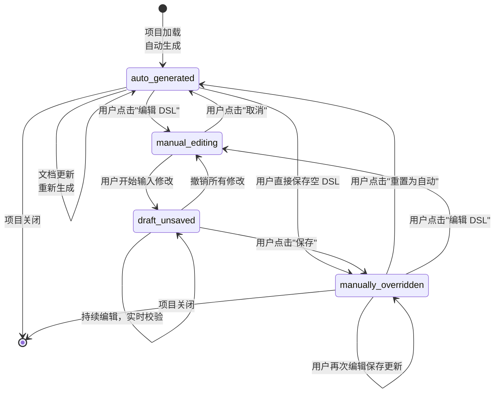
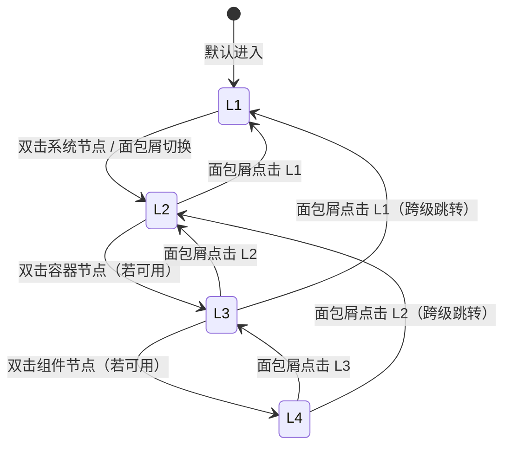

# DR-011：C4 架构浏览器（C4 Architecture Navigator）模块详细设计

> **模块编号**：DR-011  
> **模块名称**：C4 架构浏览器（C4 Architecture Navigator）  
> **版本**：v1.0  
> **设计状态**：FROZEN  
> **上游追溯**：DR-011 详细需求（REQ-P0-019/020/021/033, BR-008/009/010/011/012）  
> **下游消费**：DR-018（OpenUI 原型服务 Container 输入）、DR-019（WireframeEngine C4 DSL 输入）、DR-020（接口覆盖度检测 C4 DSL 输入）  
> **变更**：sdlc-visualizer

---

## 1. 架构组件与职责

### 1.1 组件总览

```
┌─────────────────────────────────────────────────────────────┐
│                   C4NavigatorModule                          │
│  ┌─────────────┐  ┌─────────────┐  ┌─────────────────────┐ │
│  │  C4MainPage │  │ DSLEditor   │  │ NodeDetailSidePanel │ │
│  │  (Pg_C4Main)│  │ (Pg_DSLEdit)│  │ (Pg_NodeDetail)     │ │
│  └──────┬──────┘  └─────────────┘  └─────────────────────┘ │
│         │                                                   │
│  ┌──────┴──────────────────────────────────────────────┐   │
│  │ LevelSwitcher │ DiagramCanvas │ BreadcrumbNav         │   │
│  │ ExportPanel   │ LegendPanel   │ StatusBar             │   │
│  └──────────────────────────────────────────────────────┘   │
│  ┌────────────────────────────────────────────────────────┐ │
│  │              C4StateManager (Zustand Store)             │ │
│  │  - currentLevel / dslStore / overrideFlags / nodeMappings│ │
│  └────────────────────────────────────────────────────────┘ │
└─────────────────────────────────────────────────────────────┘
```

| 组件 | 类型 | 职责 |
|------|------|------|
| `C4MainPage` | 页面 | C4 架构浏览器主页面：画布 + 左侧工具面板 + 面包屑 + 状态栏 |
| `LevelSwitcher` | UI 组件 | 四级层级切换按钮（L1/L2/L3/L4），不可用层级置灰 |
| `DiagramCanvas` | 渲染组件 | 主画布：架构图渲染、拖拽平移、滚轮缩放、框选多节点 |
| `BreadcrumbNav` | UI 组件 | 面包屑导航：L1 → 系统A → L2 → ...，支持下拉快捷跳转 |
| `LegendPanel` | UI 组件 | 图例面板：系统/容器/组件/代码的颜色与形状说明 |
| `StatusBar` | UI 组件 | 底部状态栏：当前层级、节点数、生成方式（auto/manual） |
| `DSLEditor` | 页面 | DSL 编辑器：左栏文本编辑 + 右栏实时预览，500ms 防抖同步 |
| `NodeDetailSidePanel` | 侧滑面板 | 节点详情：元数据、描述、关联文件路径、"在编辑器中打开"按钮 |
| `ExportPanel` | 弹层 | 导出设置：PNG/SVG 格式、尺寸、背景色选择 |
| `C4StateManager` | Zustand Store | C4 状态：当前层级、DSL 存储、手动覆盖标记、节点-文件映射 |

### 1.2 自动生成引擎

```
C4AutoGenerator
├── HLDocsParser           # 解析 high-level-design/*.md 文件
├── ContextExtractor       # 提取 L1 Context 信息（系统边界、外部依赖）
├── ContainerExtractor     # 提取 L2 Container 信息（应用/服务边界）
├── ComponentInferencer    # 推断 L3 Component 信息（内部模块划分）
├── CodeInferencer         # 推断 L4 Code 信息（类/函数级）
├── ConfidenceCalculator   # 计算各层级生成置信度
└── DSLAssembler           # 组装为 Mermaid C4 DSL 格式
```

**置信度降级策略**（BR-009）：
- L3 置信度 < 60% → 层级上限设为 L2，提示用户手动补充 L3/L4
- L4 置信度 < 60% → 层级上限设为 L3

### 1.3 跨模块依赖

| 依赖方 | 被依赖模块 | 依赖内容 | 接口类型 |
|--------|-----------|----------|----------|
| DR-011 | DR-005 | 读取 `high-level-design/*.md` 概要设计文档 | 文件系统 |
| DR-011 | DR-018 | 提供 C4 Container DSL 作为 OpenUI 提示词输入 | 数据传递 |
| DR-011 | DR-019 | 提供 C4 DSL 解析结果作为 WireframeEngine 输入 | 数据传递 |
| DR-011 | DR-020 | 提供 C4 DSL 接口定义作为覆盖度检测基线 | 数据传递 |

---

## 2. 接口定义

### 2.1 模块对外提供接口

#### `POST /api/v1/c4/generate`

基于概要设计文档自动生成 C4 DSL。

**Request**: `{ project_id: string; }`

**Response**: `C4GenerationResultDTO`

```typescript
interface C4GenerationResultDTO {
  project_id: string;
  generated_at: string;
  generation_duration_ms: number;
  dsl: {
    l1: string;              // Mermaid C4Context DSL
    l2: string;              // Mermaid C4Container DSL
    l3?: string;             // Mermaid C4Component DSL（置信度≥60%时）
    l4?: string;             // Mermaid C4Code DSL（置信度≥60%时）
  };
  confidence: {
    l1: number;              // 0-1
    l2: number;
    l3: number;
    l4: number;
  };
  level_cap: "L1" | "L2" | "L3" | "L4";  // 可达层级上限
}
```

#### `GET /api/v1/c4/dsl/{project_id}`

获取当前项目 C4 DSL（自动/手动版本根据覆盖标记返回）。

**Query Params**: `level`（L1/L2/L3/L4，可选，默认全部）

**Response**: `{ l1: string; l2: string; l3?: string; l4?: string; generation_mode: "auto" | "manual"; }`

#### `PUT /api/v1/c4/dsl/{project_id}/{level}`

保存手动编辑的 DSL。

**Request**: `{ dsl_text: string; }`

**Response**: `{ saved: boolean; syntax_valid: boolean; errors?: SyntaxErrorDTO[]; }`

```typescript
interface SyntaxErrorDTO {
  line_number: number;
  column?: number;
  message: string;
  severity: "error" | "warning";
}
```

#### `POST /api/v1/c4/export`

导出架构图为 PNG/SVG。

**Request**: `ExportRequestDTO`

```typescript
interface ExportRequestDTO {
  project_id: string;
  level: "L1" | "L2" | "L3" | "L4";
  format: "PNG" | "SVG";
  width?: number;           // 100-10000
  height?: number;
  auto_size?: boolean;
  background: "transparent" | "white" | "dark";
}
```

**Response**: `{ download_url: string; expires_at: string; }`

#### `PUT /api/v1/c4/nodes/{node_id}/file-mapping`

设置节点到本地文件的映射（反向代码定位）。

**Request**: `{ file_path: string; }`

**Response**: `{ node_id: string; file_path: string; file_exists: boolean; }`

### 2.2 模块消费的外部接口

| 接口 | 提供方 | 用途 | 调用时机 |
|------|--------|------|----------|
| `GET /api/v1/artifacts/content` | DR-005 | 读取 `high-level-design/*.md` | 自动生成时 |
| `POST /api/v1/fs/open` | 文件系统服务 | 调用操作系统协议打开文件 | 反向定位时 |

---

## 3. 数据表结构

### 3.1 模块独占表

> **公共表**：权威 DDL 定义见 `shared/db-schema.md#c4_dsl_store`。以下为设计上下文补充。
>
> 写方：DR-011 | 读方：DR-012, DR-018, DR-019, DR-020

#### `c4_dsl_store` — C4 DSL 存储表

| 字段 | 类型 | 约束 | 说明 |
|------|------|------|------|
| `store_id` | TEXT | PK | UUID v4 |
| `project_id` | TEXT | FK → `projects.project_id`, NOT NULL | 关联项目 |
| `level` | TEXT | NOT NULL | `L1` / `L2` / `L3` / `L4` |
| `dsl_text` | TEXT | NOT NULL | Mermaid DSL 文本 |
| `generation_mode` | TEXT | NOT NULL, DEFAULT `auto` | `auto` / `manual` |
| `confidence` | REAL | | 生成置信度（0-1） |
| `created_at` | DATETIME | NOT NULL | 创建时间 |
| `updated_at` | DATETIME | NOT NULL | 更新时间 |

**索引**: `IDX_C4DS_PROJECT_LEVEL` (`project_id`, `level`), `IDX_C4DS_MODE` (`project_id`, `generation_mode`)

**约束**: 每项目每层级最多两条记录（auto + manual 各一）

#### `c4_node_file_mappings` — 节点文件映射表

| 字段 | 类型 | 约束 | 说明 |
|------|------|------|------|
| `mapping_id` | TEXT | PK | UUID v4 |
| `project_id` | TEXT | NOT NULL | 关联项目 |
| `node_id` | TEXT | NOT NULL | C4 节点标识 |
| `level` | TEXT | NOT NULL | `L3` / `L4` |
| `file_path` | TEXT | NOT NULL | 本地文件绝对路径 |
| `created_at` | DATETIME | NOT NULL | 创建时间 |

**索引**: `IDX_C4NFM_NODE` (`project_id`, `node_id`)

### 3.2 表写权限声明

| 表名 | 写模块 | 读模块 | 说明 |
|------|--------|--------|------|
| `c4_dsl_store` | DR-011 | DR-011, DR-018, DR-019, DR-020 | C4 DSL 存储 |
| `c4_node_file_mappings` | DR-011 | DR-011 | 节点文件映射 |

---

## 4. 状态机

### 4.1 DSL 层级状态机



### 4.2 层级导航状态机



---

## 5. 边界条件与异常处理

### 5.1 单元测试

| 测试目标 | 测试内容 | 预期覆盖率 |
|----------|----------|:----------:|
| `HLDocsParser` | Markdown 解析、C4 相关章节提取 | ≥ 80% |
| `ConfidenceCalculator` | 置信度边界（60% 降级阈值） | ≥ 85% |
| `DSLEditor` | 500ms 防抖、语法校验、错误高亮 | ≥ 80% |
| `DiagramCanvas` | 缩放/平移/框选、节点点击事件 | ≥ 75% |
| `ExportEngine` | PNG/SVG 生成、尺寸/背景配置 | ≥ 75% |

### 5.2 集成测试

| 测试场景 | 验证点 |
|----------|--------|
| 自动生成 L1-L4 | 5s 内完成 → 置信度展示 → 低置信度层级隐藏 |
| 层级下钻 | 双击节点 → 1s 内切换层级 → 面包屑同步更新 |
| DSL 手动编辑 | 修改文本 → 500ms 预览更新 → 语法错误阻止保存 |
| 手动覆盖优先 | 保存手动 DSL → 重新自动生成 → 手动版本不被覆盖 |
| 反向代码定位 | L3 节点点击 → 侧板展示路径 → 点击打开文件 |
| 导出 PNG/SVG | 选择格式 → 生成文件 → 浏览器下载触发 |

### 5.3 性能测试

| 指标 | 目标值 | 测试方法 |
|------|--------|----------|
| L1 自动生成 | < 5s（P95） | 自动化测试 |
| 层级下钻 | < 1s（P95） | Playwright 计时 |
| DSL 预览渲染 | < 500ms（P95） | 前端性能测试 |
| 单项目节点总数 | ≤ 500 个 | 压力测试 |
