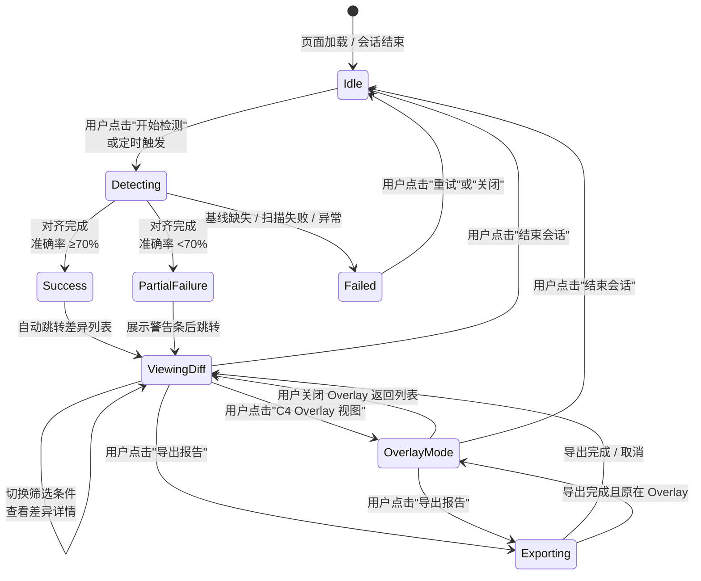
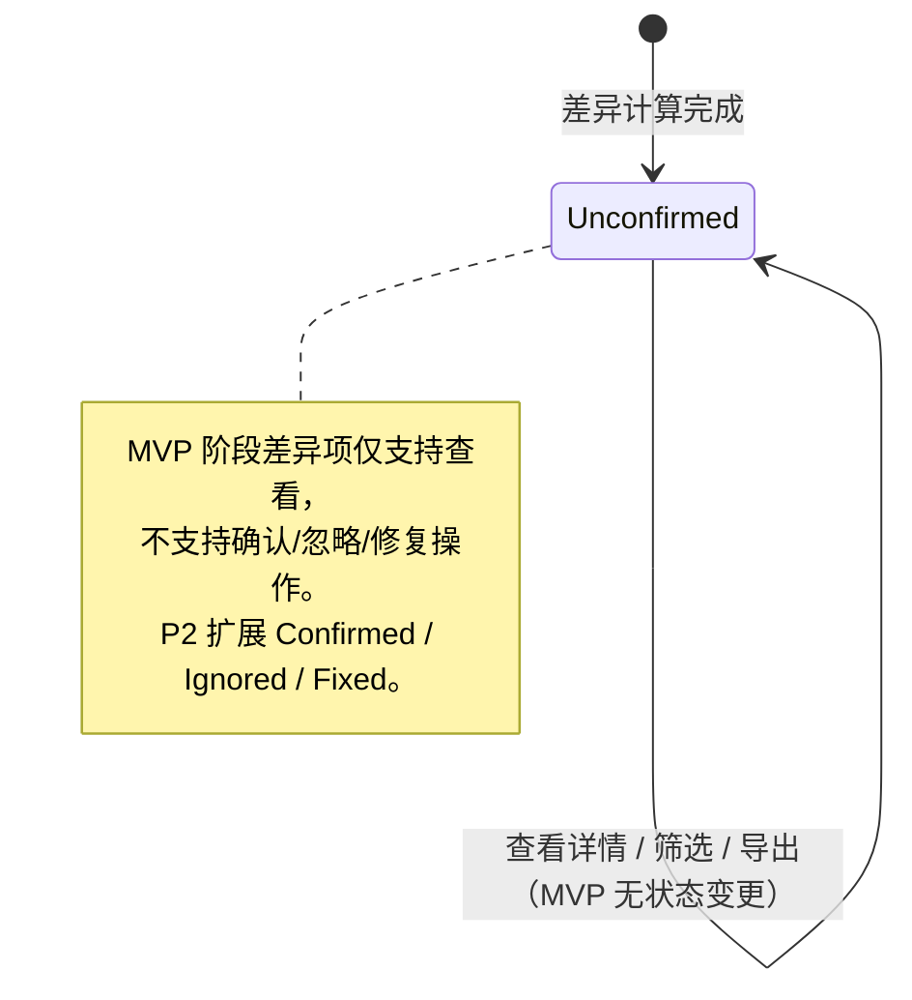

# DR-012：架构验证中心（Architecture Validation Center）模块详细设计

> **模块编号**：DR-012  
> **模块名称**：架构验证中心（Architecture Validation Center）  
> **版本**：v1.0  
> **设计状态**：FROZEN  
> **上游追溯**：DR-011 C4 架构浏览器（REQ-P0-019/020/021/033）、  
> REQ-P1-005（架构漂移检测）、REQ-P1-006（漂移 diff 可视化）  
> **下游消费**：DR-011 C4 架构浏览器（差异 Overlay 渲染输入）  
> **变更**：sdlc-visualizer

---

## 1. 架构组件与职责

### 1.1 组件总览

```
┌─────────────────────────────────────────────────────────────────────────┐
│                    ArchValidationModule                                  │
│  ┌──────────────────┐  ┌─────────────┐  ┌─────────────────────────────┐ │
│  │ Pg_ArchValMain   │  │ Pg_DiffOverlay│ │ Pg_DiffDetail              │ │
│  │ (差异列表/筛选)  │  │ (C4 Overlay) │  │ (480px 右侧双栏对比侧板)    │ │
│  └────────┬─────────┘  └──────┬──────┘  └─────────────────────────────┘ │
│           │                   │                                         │
│  ┌────────┴───────────────────┴─────────────────────────────────────┐  │
│  │ FilterBar │ DiffList │ ScanHistoryPanel │ ScanConfigModal        │  │
│  │ ExportModal │ AccuracyWarningBar │ BaselineInfoCard             │  │
│  └──────────────────────────────────────────────────────────────────┘  │
│  ┌──────────────────────────────────────────────────────────────────┐  │
│  │           ArchValidationStore (Zustand Store)                     │  │
│  │  - sessionState / diffList / filters / scanHistory / config      │  │
│  └──────────────────────────────────────────────────────────────────┘  │
└─────────────────────────────────────────────────────────────────────────┘
```

| 组件 | 类型 | 职责 |
|------|------|------|
| `Pg_ArchValMain` | 页面 | 架构验证中心主页面：差异列表、筛选器、扫描历史入口、基线信息卡片 |
| `FilterBar` | UI 组件 | 层级筛选（L1-L4 多选）+ 差异类型筛选（added/removed/modified 多选） |
| `DiffList` | UI 组件 | 结构化差异列表：类型角标、层级标签、所属组件名，>500 条截断提示 |
| `Pg_DiffOverlay` | 渲染组件 | C4 浏览器内差异 Overlay：节点高亮（绿/红/黄）、角标、差异连线 |
| `Pg_DiffDetail` | 侧滑面板 | 480px 右侧滑出，双栏对比（基线 vs 当前），差异字段高亮 |
| `ScanHistoryPanel` | 侧滑面板 | 360px 扫描历史侧滑：时间倒序卡片、点击查看快照、导出 |
| `ScanConfigModal` | 弹层 | 扫描频率设置：关闭/每日/每周，MVP 仅本地定时触发 |
| `ExportModal` | 弹层 | 导出设置：格式（markdown/html）、范围（filtered/all） |
| `AccuracyWarningBar` | UI 组件 | 准确率 <70% 时顶部展示黄色警告条（BR-018） |
| `BaselineInfoCard` | UI 组件 | 展示当前比对所用 C4 DSL 基线快照版本信息 |
| `ArchValidationStore` | Zustand Store | 检测会话状态、差异列表、筛选条件、扫描历史、配置缓存 |

### 1.2 差异计算核心引擎

```
DiffEngine
├── BaselineLoader          # 加载 C4 DSL 基线快照（源自 DR-011 c4_dsl_store）
├── ScanResultLoader        # 加载代码扫描服务返回的当前结构化扫描结果
├── EntityAligner           # 实体对齐：基于名称+层级+类型进行 fuzzy match
├── DiffCalculator          # 计算差异：新增/删除/修改分类
├── AccuracyEstimator       # 估算检测准确率：匹配覆盖率 × 置信度权重
└── ResultAssembler         # 组装结果：截断 500 条、生成摘要统计
```

**实体对齐策略**：
- 主键：C4 实体全名（`层级:类型:名称`，如 `L2:Container:OrderService`）
- 模糊匹配：名称相似度 ≥85%（Levenshtein 归一化距离）视为同一实体
- 未匹配基线实体 → `removed`
- 未匹配扫描实体 → `added`
- 已匹配但属性变化 → `modified`

**准确率估算公式**：
```
accuracy = (aligned_count / max(baseline_total, scan_total)) × confidence_weight
```
- `confidence_weight`：由 fuzzy match 平均相似度决定（完全匹配 1.0，模糊匹配 0.85）
- BR-018：accuracy < 0.7 时强制展示警告条

### 1.3 跨模块依赖

| 依赖方 | 被依赖模块 | 依赖内容 | 接口类型 |
|--------|-----------|----------|----------|
| DR-012 | DR-011 | 读取 `c4_dsl_store` 获取 C4 DSL 基线快照 | SQLite 表 |
| DR-012 | DR-011 | 消费 C4 渲染状态（节点坐标、连线关系）用于 Overlay | 前端状态传递 |
| DR-012 | 代码扫描服务 | 获取当前项目结构化扫描结果（JSON） | 外部接口/本地文件 |
| DR-011 | DR-012 | 接收差异数据渲染 Overlay 高亮与角标 | 前端事件总线 |

---

## 2. 接口定义

### 2.1 模块对外提供接口

#### `POST /api/v1/arch-validation/{project_id}/detect`

手动触发漂移检测。前置检查：项目必须存在 C4 DSL 基线（BR-016），否则返回 409。

**Request**: `{ force?: boolean; }`（`force=true` 跳过基线新鲜度警告）

**Response**: `DetectSessionDTO`

```typescript
interface DetectSessionDTO {
  session_id: string;              // UUID v4
  project_id: string;
  status: "Detecting" | "Success" | "PartialFailure" | "Failed";
  started_at: string;              // ISO 8601
  completed_at?: string;
  accuracy: number;                // 0-1，BR-018 门控值
  summary: {
    total_baseline: number;        // 基线实体总数
    total_scan: number;            // 扫描实体总数
    added_count: number;
    removed_count: number;
    modified_count: number;
    truncated: boolean;            // 是否触发 500 条截断（BR-021）
  };
  baseline_version: BaselineInfoDTO;
}

interface BaselineInfoDTO {
  baseline_id: string;             // c4_dsl_store.store_id
  level: "L1" | "L2" | "L3" | "L4";
  generation_mode: "auto" | "manual";
  updated_at: string;
  dsl_hash: string;                // SHA-256 前 8 位
}
```

**性能要求**：P95 < 10s（含基线加载、扫描加载、对齐计算）。

---

#### `GET /api/v1/arch-validation/{project_id}/status`

获取当前检测会话状态（轮询用）。

**Response**: `DetectSessionDTO | null`

---

#### `GET /api/v1/arch-validation/{project_id}/diffs`

获取差异列表，支持筛选。

**Query Params**:
- `session_id`（string，必填）
- `level_filter`（string[]，可选，如 `L1,L2`）
- `type_filter`（string[]，可选，如 `added,modified`）
- `page`（number，默认 1）
- `page_size`（number，默认 50，最大 100）

**Response**: `DiffListDTO`

```typescript
interface DiffListDTO {
  session_id: string;
  total: number;                   // 实际总条数（含截断外）
  returned: number;                // 本次返回条数
  truncated: boolean;              // BR-021
  items: DiffItemDTO[];
}

interface DiffItemDTO {
  diff_id: string;                 // UUID v4
  diff_type: "added" | "removed" | "modified";
  level: "L1" | "L2" | "L3" | "L4";
  entity_name: string;             // 实体显示名称
  entity_key: string;              // 全名（层级:类型:名称）
  category: "System" | "Container" | "Component" | "Code" | "Relationship";
  status: "Unconfirmed";           // MVP 固定值，预留确认态
  baseline_snapshot?: string;      // 基线 JSON 片段（modified/removed 有值）
  current_snapshot?: string;       // 当前 JSON 片段（added/modified 有值）
  changed_fields?: string[];       // 修改字段名列表（modified 有值）
  match_score?: number;            // 模糊匹配得分（0-1）
}
```

**性能要求**：P95 < 200ms（DB 查询+序列化），前端首屏 100 条 P95 < 3s。

---

#### `GET /api/v1/arch-validation/{project_id}/diffs/{diff_id}`

获取单条差异详情（双栏对比用）。

**Response**: `DiffItemDTO`

---

#### `GET /api/v1/arch-validation/{project_id}/scans`

扫描历史记录（时间倒序）。

**Query Params**:
- `page`（number，默认 1）
- `page_size`（number，默认 20）

**Response**: `ScanHistoryListDTO`

```typescript
interface ScanHistoryListDTO {
  total: number;
  items: ScanHistoryDTO[];
}

interface ScanHistoryDTO {
  scan_id: string;                 // 同 session_id
  project_id: string;
  started_at: string;
  completed_at: string;
  status: "Success" | "PartialFailure" | "Failed";
  accuracy: number;
  added_count: number;
  removed_count: number;
  modified_count: number;
  truncated: boolean;
  export_available: boolean;       // 是否可导出报告
}
```

---

#### `POST /api/v1/arch-validation/{project_id}/export`

导出差异报告。

**Request**: `ExportReportRequestDTO`

```typescript
interface ExportReportRequestDTO {
  session_id: string;
  format: "markdown" | "html";
  scope: "filtered" | "all";       // filtered=仅当前筛选结果
  level_filter?: string[];
  type_filter?: string[];
}
```

**Response**: `{ download_url: string; filename: string; expires_at: string; }`

---

#### `GET /api/v1/arch-validation/{project_id}/config`

获取扫描配置。

**Response**: `ScanConfigDTO`

```typescript
interface ScanConfigDTO {
  project_id: string;
  scan_frequency: "off" | "daily" | "weekly";
  next_scheduled_at?: string;      // 仅 daily/weekly 有值
  updated_at: string;
}
```

---

#### `PUT /api/v1/arch-validation/{project_id}/config`

更新扫描配置。

**Request**: `ScanConfigDTO`（仅 `scan_frequency` 可写）

**Response**: `ScanConfigDTO`

> MVP 阶段 `next_scheduled_at` 仅做本地定时器计算，不启动后台守护进程。

---

#### `GET /api/v1/arch-validation/{project_id}/baseline`

获取当前比对所使用的基线版本信息。

**Response**: `BaselineInfoDTO`

---

### 2.2 模块消费的外部接口

| 接口 | 提供方 | 用途 | 调用时机 |
|------|--------|------|----------|
| `GET /api/v1/c4/dsl/{project_id}` | DR-011 | 读取 C4 DSL 基线文本 | detect 启动时 |
| 代码扫描服务 | 外部/本地 | 读取当前项目结构化扫描结果 | detect 启动时 |
| `GET /api/v1/c4/render-state` | DR-011 | 获取 C4 节点坐标与连线 | Overlay 渲染时 |

---

## 3. 数据表结构

### 3.1 模块独占表

#### `arch_validation_sessions` — 检测会话表

```sql
CREATE TABLE arch_validation_sessions (
    session_id          VARCHAR(36) PRIMARY KEY,
    project_id          VARCHAR(36) NOT NULL,
    status              VARCHAR(16) NOT NULL
                        CHECK (status IN ('Detecting','Success','PartialFailure','Failed')),
    started_at          TIMESTAMP NOT NULL DEFAULT CURRENT_TIMESTAMP,
    completed_at        TIMESTAMP,
    accuracy            REAL CHECK (accuracy BETWEEN 0 AND 1),
    total_baseline      INTEGER NOT NULL DEFAULT 0,
    total_scan          INTEGER NOT NULL DEFAULT 0,
    added_count         INTEGER NOT NULL DEFAULT 0,
    removed_count       INTEGER NOT NULL DEFAULT 0,
    modified_count      INTEGER NOT NULL DEFAULT 0,
    truncated           BOOLEAN NOT NULL DEFAULT FALSE,
    baseline_id         VARCHAR(36),               -- 关联 c4_dsl_store.store_id
    baseline_level      VARCHAR(2),                -- L1/L2/L3/L4
    baseline_mode       VARCHAR(8),                -- auto/manual
    baseline_dsl_hash   VARCHAR(8),                -- SHA-256 前 8 位
    error_message       TEXT,                      -- Failed 时记录错误

    CONSTRAINT fk_avs_project FOREIGN KEY (project_id)
        REFERENCES projects(project_id) ON DELETE CASCADE,
    CONSTRAINT fk_avs_baseline FOREIGN KEY (baseline_id)
        REFERENCES c4_dsl_store(store_id) ON DELETE SET NULL
);

CREATE INDEX idx_avs_project_time ON arch_validation_sessions(project_id, started_at DESC);
CREATE INDEX idx_avs_status ON arch_validation_sessions(status);
```

> **设计说明**：
> - BR-020：扫描结果不自动覆盖，每次 detect 产生新 session，历史保留。
> - `baseline_*` 字段为快照冗余，避免基线后续被编辑导致历史记录失真。
> - `truncated` 标识是否触发 500 条截断（BR-021）。

---

#### `arch_validation_diffs` — 差异项表

```sql
CREATE TABLE arch_validation_diffs (
    diff_id             VARCHAR(36) PRIMARY KEY,
    session_id          VARCHAR(36) NOT NULL,
    diff_type           VARCHAR(8) NOT NULL
                        CHECK (diff_type IN ('added','removed','modified')),
    level               VARCHAR(2) NOT NULL
                        CHECK (level IN ('L1','L2','L3','L4')),
    entity_name         VARCHAR(256) NOT NULL,
    entity_key          VARCHAR(512) NOT NULL,     -- 层级:类型:名称
    category            VARCHAR(16) NOT NULL
                        CHECK (category IN (
                            'System','Container','Component','Code','Relationship'
                        )),
    status              VARCHAR(16) NOT NULL DEFAULT 'Unconfirmed'
                        CHECK (status IN ('Unconfirmed')),
    baseline_snapshot   TEXT,                      -- JSON 片段
    current_snapshot    TEXT,                      -- JSON 片段
    changed_fields      TEXT,                      -- JSON 数组字符串
    match_score         REAL CHECK (match_score BETWEEN 0 AND 1),
    created_at          TIMESTAMP NOT NULL DEFAULT CURRENT_TIMESTAMP,

    CONSTRAINT fk_avd_session FOREIGN KEY (session_id)
        REFERENCES arch_validation_sessions(session_id) ON DELETE CASCADE
);

CREATE INDEX idx_avd_session ON arch_validation_diffs(session_id);
CREATE INDEX idx_avd_type_level ON arch_validation_diffs(session_id, diff_type, level);
CREATE INDEX idx_avd_entity ON arch_validation_diffs(entity_key);
```

> **设计说明**：
> - MVP 阶段 `status` 仅支持 `Unconfirmed`，P2 扩展 `Confirmed` / `Ignored` / `Fixed`。
> - `changed_fields` 和 `baseline_snapshot` / `current_snapshot` 以 JSON 文本存储，
>   因 SQLite 无原生 JSON 类型，使用 TEXT 存储，应用层解析。
> - BR-021：单 session 写入上限 500 条，超出部分不写入本表，但 `sessions.truncated`
>   标记为 TRUE，并在 summary 中展示实际总数。

---

#### `arch_scan_configs` — 扫描配置表

```sql
CREATE TABLE arch_scan_configs (
    config_id           VARCHAR(36) PRIMARY KEY,
    project_id          VARCHAR(36) NOT NULL UNIQUE,
    scan_frequency      VARCHAR(8) NOT NULL DEFAULT 'off'
                        CHECK (scan_frequency IN ('off','daily','weekly')),
    next_scheduled_at   TIMESTAMP,
    updated_at          TIMESTAMP NOT NULL DEFAULT CURRENT_TIMESTAMP,

    CONSTRAINT fk_asc_project FOREIGN KEY (project_id)
        REFERENCES projects(project_id) ON DELETE CASCADE
);

CREATE INDEX idx_asc_project ON arch_scan_configs(project_id);
```

> **设计说明**：
> - MVP 阶段 `next_scheduled_at` 由前端/本地定时器维护，不启动后台任务。
> - P1 阶段可扩展为后台调度进程消费该字段。

### 3.2 公共表引用

| 表名 | 来源 | 引用方式 | 说明 |
|------|------|----------|------|
| `projects` | `shared/db-schema.md` | 外键 | 项目主表，MVP 阶段定义见 DR-001 |
| `c4_dsl_store` | DR-011 | 外键 | C4 DSL 基线存储，本模块读取基线内容 |

### 3.3 表写权限声明

| 表名 | 写模块 | 读模块 | 说明 |
|------|--------|--------|------|
| `arch_validation_sessions` | DR-012 | DR-012 | 检测会话记录 |
| `arch_validation_diffs` | DR-012 | DR-012 | 差异项明细 |
| `arch_scan_configs` | DR-012 | DR-012 | 扫描配置 |
| `c4_dsl_store` | DR-011 | DR-012 | 基线读取（只读） |

---

## 4. 状态机

### 4.1 检测会话状态机



### 4.2 差异项状态机



---

## 5. 边界条件与异常处理

### 5.1 单元测试

| 测试目标 | 测试内容 | 预期覆盖率 |
|----------|----------|:----------:|
| `EntityAligner` | 完全匹配、模糊匹配（85% 阈值）、边界相似度、空集合 | ≥ 85% |
| `DiffCalculator` | added/removed/modified 分类、重复实体去重、属性diff | ≥ 85% |
| `AccuracyEstimator` | 准确率 0/0.5/0.7/1.0 边界、confidence_weight 计算 | ≥ 85% |
| `BaselineLoader` | 基线缺失抛错（BR-016）、多级 DSL 加载、hash 校验 | ≥ 80% |
| `ResultAssembler` | 500 条截断（BR-021）、摘要统计正确性、排序稳定 | ≥ 80% |
| `ExportEngine` | Markdown/HTML 组装、filtered/all 范围、特殊字符转义 | ≥ 75% |
| `FilterBar` | 多选状态管理、全选/清空、URL 参数同步 | ≥ 75% |
| `Pg_DiffDetail` | 双栏渲染、差异高亮、空状态处理 | ≥ 75% |
| `Pg_DiffOverlay` | 节点坐标映射、颜色渲染（BR-017）、角标位置计算 | ≥ 75% |
| `ArchValidationStore` | 状态流转（Idle→Detecting→Success→ViewingDiff→Idle） | ≥ 80% |

### 5.2 集成测试

| 测试场景 | 验证点 |
|----------|--------|
| 端到端漂移检测 | 基线加载 → 扫描加载 → 对齐计算 → 保存 session → 准确率展示 < 10s（P95） |
| 基线缺失门控 | 无基线时触发 detect → 返回 409 → 前端禁止按钮（BR-016） |
| 准确率警告条 | accuracy=0.65 → 检测完成 → 警告条展示 → 不影响查看（BR-018） |
| 500 条截断 | 模拟 600 条差异 → 仅写入 500 条 → truncated=true → 前端提示（BR-021） |
| 差异列表筛选 | 同时勾选 L1+L2 和 added+modified → 列表实时刷新 → URL 参数同步 |
| Overlay 与列表联动 | 列表点击差异项 → Overlay 高亮对应节点；Overlay 点击节点 → 列表滚动定位（BR-019） |
| 双栏对比详情 | 点击 modified 项 → 侧板滑出 → 基线/当前双栏展示 → 差异字段高亮 |
| 扫描历史查看 | 多次 detect → 历史倒序 → 点击旧记录 → 加载该 session 差异快照 |
| 报告导出 | 选择 markdown + filtered → 生成文件 → 触发下载 → 内容包含筛选后列表 |
| 定时配置持久化 | 修改 scan_frequency=daily → 刷新页面 → 配置恢复 → next_scheduled_at 计算正确 |
| C4 Overlay 渲染性能 | 200 节点场景 → Overlay 高亮渲染 < 3s（P95） |

### 5.3 性能与验收测试

| 指标 | 目标值 | 测试方法 |
|------|--------|----------|
| 检测流程耗时 | < 10s（P95） | pytest-benchmark / 自动化测试 |
| 差异列表首屏渲染 | < 3s（P95，100 条） | Playwright 前端性能计时 |
| C4 Overlay 渲染延迟 | < 3s（P95，200 节点） | Playwright + React Profiler |
| 检测准确率 | ≥ 70% | 标准测试集（含 50 组已知差异基线）比对 |
| 差异查询接口 | < 200ms（P95） | pytest 接口性能测试 |
| 导出报告生成 | < 5s（P95，500 条） | 接口性能测试 |
