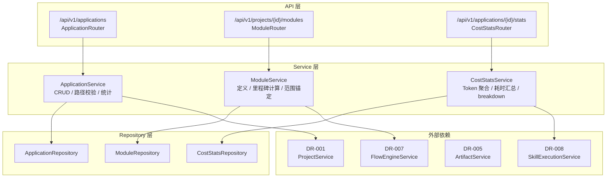
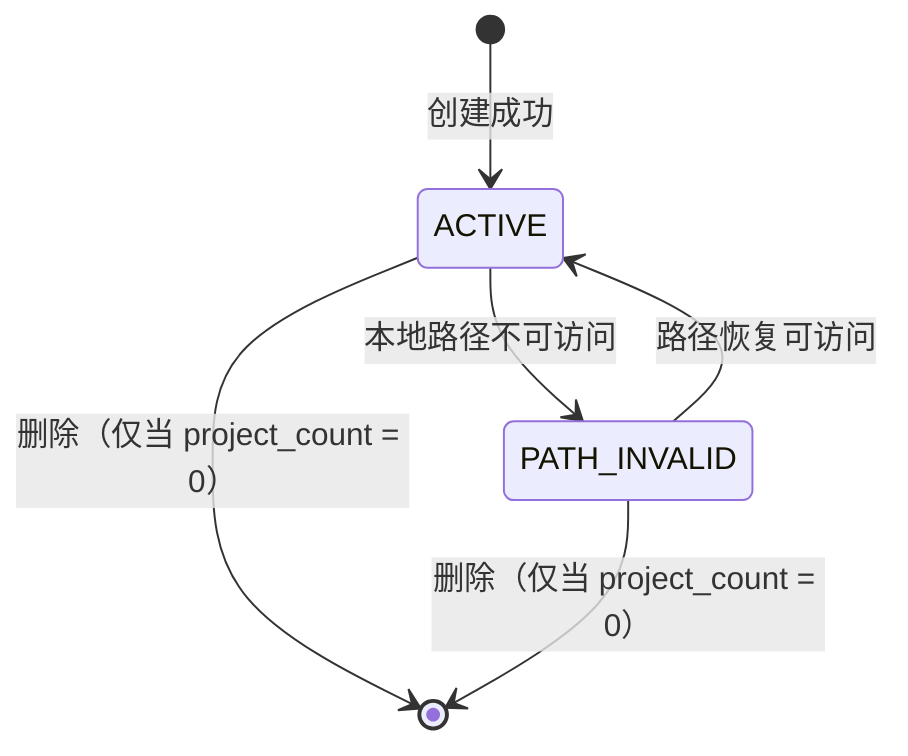
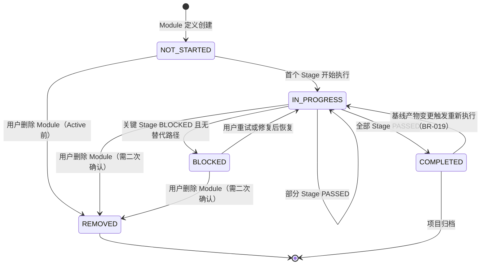
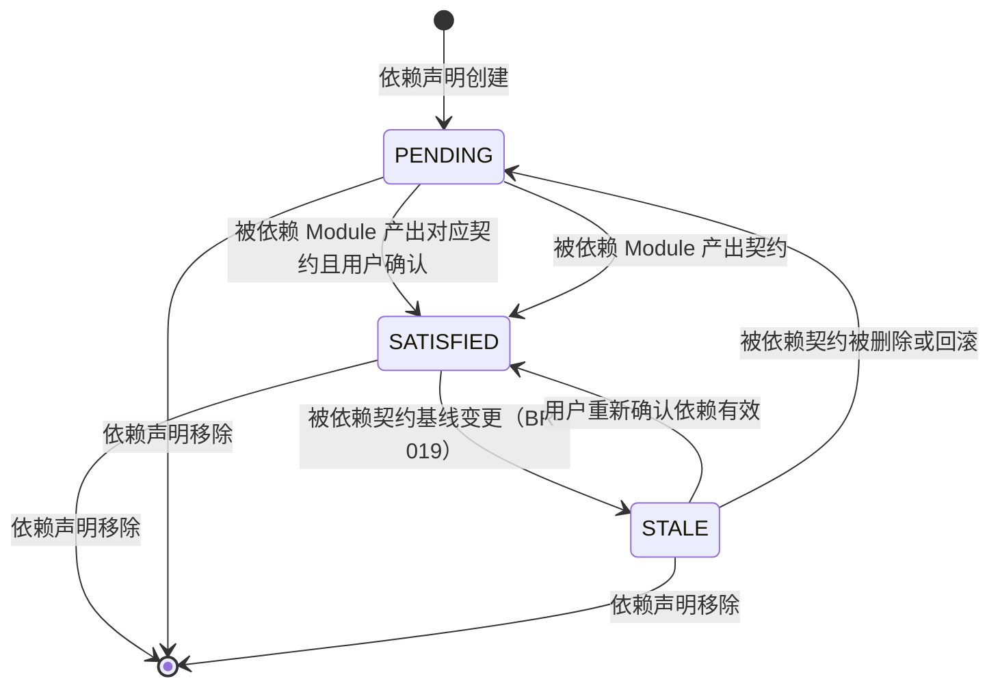

# DR-015 Application 与模块治理 — 模块详细设计

> **模块编号**：DR-015  
> **模块名称**：Application 与模块治理（Application & Module Governance）  
> **版本**：v1.0  
> **状态**：FROZEN  
> **设计日期**：2026-06-02  
> **上游基线**：PRD-000 v2.0-patch2 / HLD-001~003 / DR-015 详细需求

---

## 1. 模块架构与组件设计

### 1.1 模块定位

本模块是 SDLC Visualizer 的**组织边界与治理中心**，负责：
- **Application 生命周期管理**：创建、读取、更新、删除 Application（P0）
- **项目归属管理**：Application 作为项目的容器，维护一对多关系
- **研发管理费统计**：聚合 Application 下 Draft 态项目的 Token 消耗与执行耗时（P1）
- **Module 定义与里程碑**：在 Project 内定义功能子域，独立追踪 Stage 完成状态（P1）
- **跨模块契约依赖**：检测 Module 间接口契约的产出状态，标记依赖满足度（P1）
- **范围锚定与变更影响**：项目 Active 时锁定 Module 清单，变更时强制影响分析（P1）

### 1.2 内部分层架构



### 1.3 核心类设计

#### `ApplicationService`

```python
class ApplicationService:
    """Application 核心业务服务。"""

    def __init__(
        self,
        app_repo: ApplicationRepository,
        project_service: ProjectService,
        fs_adapter: FileSystemAdapter,
    ) -> None: ...

    async def create_application(
        self,
        dto: ApplicationCreateDTO,
    ) -> ApplicationResponseDTO:
        """创建 Application，校验名称唯一性和路径合法性。"""

    async def list_applications(
        self,
        workspace_id: str,
        pagination: PaginationDTO,
    ) -> PaginatedApplicationListDTO:
        """查询 Application 列表，支持搜索和排序。"""

    async def get_application_detail(
        self,
        app_id: str,
    ) -> ApplicationDetailDTO:
        """获取 Application 详情，含关联项目列表和统计摘要。"""

    async def update_application(
        self,
        app_id: str,
        dto: ApplicationUpdateDTO,
    ) -> ApplicationResponseDTO:
        """更新 Application 元信息，路径变更不迁移产物。"""

    async def delete_application(
        self,
        app_id: str,
    ) -> None:
        """删除 Application，仅允许无关联项目时执行。"""

    async def check_path_accessibility(
        self,
        app_id: str,
    ) -> PathAccessibilityDTO:
        """检测 Application 本地路径可访问性，返回状态。"""
```

#### `ModuleService`（P1）

```python
class ModuleService:
    """Module 定义与里程碑服务。"""

    def __init__(
        self,
        module_repo: ModuleRepository,
        flow_service: FlowEngineService,
    ) -> None: ...

    async def create_module(
        self,
        project_id: str,
        dto: ModuleCreateDTO,
    ) -> ModuleResponseDTO:
        """在项目中创建 Module，校验名称唯一性。"""

    async def list_modules(
        self,
        project_id: str,
    ) -> list[ModuleResponseDTO]:
        """获取项目内全部 Module 列表及里程碑状态。"""

    async def update_module_milestone(
        self,
        module_id: str,
    ) -> ModuleMilestoneDTO:
        """重新计算 Module 里程碑进度与状态。"""

    async def anchor_scope(
        self,
        project_id: str,
    ) -> ScopeAnchorDTO:
        """项目 Draft → Active 时锁定 Module 清单为基线。"""

    async def analyze_change_impact(
        self,
        project_id: str,
        change_type: str,
        target_module_id: str,
    ) -> ChangeImpactDTO:
        """分析新增/删除 Module 对项目的影响范围。"""
```

#### `CostStatsService`（P1）

```python
class CostStatsService:
    """研发管理费统计聚合服务。"""

    def __init__(
        self,
        stats_repo: CostStatsRepository,
        skill_exec_service: SkillExecutionService,
    ) -> None: ...

    async def aggregate_application_stats(
        self,
        app_id: str,
        time_range: str,
    ) -> ApplicationCostStatsDTO:
        """按时间范围聚合 Application 下 Draft 项目的 Token 与耗时。"""

    async def report_execution(
        self,
        project_id: str,
        execution_id: str,
        token_count: int,
        duration_ms: int,
    ) -> None:
        """接收 Skill 执行上报，累加统计（仅 Draft 态项目）。"""
```

### 1.4 模块依赖清单

| 依赖模块 | 依赖类型 | 调用方式 | 用途 |
|----------|----------|----------|------|
| DR-001 项目工作台 | 强依赖 | Service 注入 | 查询关联项目、校验项目状态 |
| DR-008 Skill 调度 | 弱依赖 | 事件消费 / 轮询 | 接收执行上报，统计 Token/耗时 |
| DR-005 产物浏览器 | 弱依赖 | Service 注入 | 检测契约产物是否存在（P1） |
| DR-007 Flow 编排 | 弱依赖 | Service 注入 | Module 内 DAG 调度与里程碑计算（P1） |
| 本地文件系统 | 强依赖 | `pathlib` / `os.access` | 校验 Application 路径可访问性 |

---

## 2. 接口定义

### 2.1 RESTful 端点清单

| 方法 | 路径 | 操作 | 优先级 | 说明 |
|:----:|:-----|:-----|:------:|:-----|
| POST | `/api/v1/applications` | 创建 Application | P0 | |
| GET | `/api/v1/applications` | 查询 Application 列表 | P0 | 支持搜索、排序 |
| GET | `/api/v1/applications/{app_id}` | 获取 Application 详情 | P0 | 含项目列表、统计摘要 |
| PATCH | `/api/v1/applications/{app_id}` | 更新 Application | P0 | 名称、描述、路径 |
| DELETE | `/api/v1/applications/{app_id}` | 删除 Application | P0 | 仅允许无关联项目 |
| GET | `/api/v1/applications/{app_id}/path-check` | 路径可访问性检测 | P0 | 返回 ACTIVE / PATH_INVALID |
| GET | `/api/v1/applications/{app_id}/stats` | 研发管理费统计 | P1 | 时间范围筛选 |
| POST | `/api/v1/applications/{app_id}/stats/report` | 执行数据上报 | P1 | 由 DR-008 调用 |
| POST | `/api/v1/projects/{project_id}/modules` | 创建 Module | P1 | |
| GET | `/api/v1/projects/{project_id}/modules` | 查询 Module 列表 | P1 | 含里程碑状态 |
| PATCH | `/api/v1/modules/{module_id}` | 更新 Module | P1 | 名称、描述、依赖 |
| DELETE | `/api/v1/modules/{module_id}` | 删除 Module | P1 | 保留产物，标记 REMOVED |
| POST | `/api/v1/projects/{project_id}/modules/anchor` | 范围锚定 | P1 | Draft → Active 时锁定 |
| GET | `/api/v1/projects/{project_id}/module-dependencies` | 查询依赖关系 | P1 | |
| POST | `/api/v1/projects/{project_id}/module-dependencies` | 声明依赖 | P1 | 消费方 → 提供方 + 契约 |

### 2.2 请求 / 响应 DTO

#### `ApplicationCreateDTO`

```yaml
ApplicationCreateDTO:
  type: object
  required: [application_name, local_path]
  properties:
    application_name:
      type: string
      minLength: 1
      maxLength: 100
      description: Workspace 内唯一（大小写不敏感）
    description:
      type: string
      maxLength: 500
      nullable: true
    local_path:
      type: string
      maxLength: 4096
      description: 本地绝对路径，必须已存在且可读写
```

#### `ApplicationResponseDTO`

```yaml
ApplicationResponseDTO:
  type: object
  properties:
    application_id: {type: string, format: uuid}
    application_name: {type: string}
    description: {type: string, nullable: true}
    local_path: {type: string}
    project_count: {type: integer}
    path_accessible: {type: boolean}
    last_active_at: {type: string, format: date-time, nullable: true}
    created_at: {type: string, format: date-time}
    updated_at: {type: string, format: date-time}
```

#### `ApplicationDetailDTO`

```yaml
ApplicationDetailDTO:
  type: object
  allOf:
    - {$ref: '#/components/schemas/ApplicationResponseDTO'}
  properties:
    projects: {type: array, items: {$ref: '#/components/schemas/ProjectSummaryDTO'}}
    stats_summary: {type: object, nullable: true, properties: {total_token: {type: integer}, total_duration_ms: {type: integer}}}
```

#### `ModuleCreateDTO`（P1）

```yaml
ModuleCreateDTO:
  type: object
  required: [module_name]
  properties:
    module_name:
      type: string
      minLength: 1
      maxLength: 100
      description: 项目内唯一
    module_description: {type: string, maxLength: 500, nullable: true}
    scope_boundary: {type: string, nullable: true}
    dependency_modules: {type: array, items: {type: string, format: uuid}, description: "同项目内其他 Module ID 列表"}
```

#### `ModuleResponseDTO`（P1）

```yaml
ModuleResponseDTO:
  type: object
  properties:
    module_id: {type: string, format: uuid}
    module_name: {type: string}
    module_description: {type: string, nullable: true}
    scope_boundary: {type: string, nullable: true}
    parent_project_id: {type: string}
    dependency_modules: {type: array, items: {type: string}}
    milestone_progress: {type: integer, minimum: 0, maximum: 100}
    milestone_status: {type: string, enum: [NOT_STARTED, IN_PROGRESS, COMPLETED, BLOCKED, REMOVED]}
```

#### `ApplicationCostStatsDTO`（P1）

```yaml
ApplicationCostStatsDTO:
  type: object
  properties:
    application_id: {type: string}
    time_range: {type: string, enum: [7d, 30d, all]}
    total_token_consumption: {type: integer}
    total_execution_duration_ms: {type: integer}
    project_breakdown:
      type: array
      items:
        type: object
        properties:
          project_id: {type: string}
          project_name: {type: string}
          token_consumption: {type: integer}
          execution_duration_ms: {type: integer}
```

### 2.3 错误码定义

| HTTP 状态码 | 业务错误码 | 错误消息模板 | 触发场景 |
|:-----------:|:-----------|:-------------|:---------|
| 400 | `APP_NAME_INVALID` | "Application 名称长度必须在 1-100 字符之间" | 名称校验失败 |
| 409 | `APP_NAME_DUPLICATE` | "Workspace 下已存在同名 Application '{name}'" | 重名校验失败 |
| 400 | `APP_PATH_INVALID` | "路径不存在或不可读写：{path}" | 路径校验失败 |
| 400 | `APP_PATH_TOO_LONG` | "路径长度超过系统限制" | 路径超长 |
| 409 | `APP_HAS_PROJECTS` | "该 Application 下存在 {count} 个项目，无法删除" | 删除时存在关联项目 |
| 404 | `APP_NOT_FOUND` | "Application '{app_id}' 不存在" | 查询/更新/删除不存在 |
| 400 | `MODULE_NAME_DUPLICATE` | "同一项目内已存在同名 Module '{name}'" | Module 重名（P1） |
| 400 | `MODULE_CIRCULAR_DEPENDENCY` | "检测到 Module 循环依赖" | 依赖声明成环（P1） |
| 409 | `MODULE_SCOPE_LOCKED` | "项目已 Active，Module 清单已锁定，变更需走影响分析" | Active 后未经分析修改 Module（P1） |
| 404 | `MODULE_NOT_FOUND` | "Module '{module_id}' 不存在" | 查询/更新不存在（P1） |

---

## 3. 数据表结构

### 3.1 本模块独占表

> **公共表**：权威 DDL 定义见 `shared/db-schema.md#applications`。以下为设计上下文补充。
>
> 写方：DR-015 | 读方：DR-001, DR-013

#### `applications` — Application 主表

```sql
CREATE TABLE applications (
    application_id      VARCHAR(36) PRIMARY KEY,
    application_name    VARCHAR(100) NOT NULL,
    description         VARCHAR(500),
    local_path          VARCHAR(4096) NOT NULL,
    workspace_id        VARCHAR(36) NOT NULL DEFAULT 'default',
    path_accessible     BOOLEAN NOT NULL DEFAULT TRUE,
    last_active_at      TIMESTAMP,
    created_at          TIMESTAMP NOT NULL DEFAULT CURRENT_TIMESTAMP,
    updated_at          TIMESTAMP NOT NULL DEFAULT CURRENT_TIMESTAMP,

    CONSTRAINT uq_app_name_per_ws UNIQUE (workspace_id, application_name)
);

CREATE INDEX idx_applications_ws ON applications(workspace_id);
CREATE INDEX idx_applications_name ON applications(application_name);
```

> **设计说明**：
> - `workspace_id` MVP 阶段固定为 'default'，P1 后支持多 Workspace。
> - `path_accessible` 为运行时检测状态，非用户直接操作字段。系统定期（每 5 分钟）或按需检测路径可访问性。
> - 删除 Application 时**不级联删除**本地目录及文件，仅删除元数据记录。

#### `modules` — Module 定义表（P1）

```sql
CREATE TABLE modules (
    module_id           VARCHAR(36) PRIMARY KEY,
    module_name         VARCHAR(100) NOT NULL,
    module_description  VARCHAR(500),
    scope_boundary      VARCHAR(500),
    parent_project_id   VARCHAR(36) NOT NULL,
    dependency_modules  TEXT,                            -- JSON 数组：同项目内 module_id 列表
    milestone_progress  INTEGER NOT NULL DEFAULT 0
                        CHECK (milestone_progress BETWEEN 0 AND 100),
    milestone_status    VARCHAR(16) NOT NULL DEFAULT 'NOT_STARTED'
                        CHECK (milestone_status IN ('NOT_STARTED', 'IN_PROGRESS', 'COMPLETED', 'BLOCKED', 'REMOVED')),
    is_anchored         BOOLEAN NOT NULL DEFAULT FALSE, -- 项目 Active 后锁定
    created_at          TIMESTAMP NOT NULL DEFAULT CURRENT_TIMESTAMP,
    updated_at          TIMESTAMP NOT NULL DEFAULT CURRENT_TIMESTAMP,

    CONSTRAINT fk_module_project FOREIGN KEY (parent_project_id) REFERENCES projects(project_id) ON DELETE CASCADE,
    CONSTRAINT uq_module_name_per_project UNIQUE (parent_project_id, module_name)
);

CREATE INDEX idx_modules_project ON modules(parent_project_id);
CREATE INDEX idx_modules_status ON modules(milestone_status);
```

> **设计说明**：
> - `is_anchored` 标记 Module 是否已被范围锚定。项目 Draft → Active 时，将所有 Module 的 `is_anchored` 置为 TRUE。
> - 删除 Module 时（用户操作）不物理删除记录，而是将 `milestone_status` 更新为 'REMOVED'，保留历史。
> - `dependency_modules` 存储 JSON 数组，SQLite 无原生数组类型；PostgreSQL 迁移后可改为 `UUID[]`。

#### `module_dependencies` — 跨模块契约依赖表（P1）

```sql
CREATE TABLE module_dependencies (
    dependency_id       VARCHAR(36) PRIMARY KEY,
    consumer_module_id  VARCHAR(36) NOT NULL,
    provider_module_id  VARCHAR(36) NOT NULL,
    required_contract   VARCHAR(128) NOT NULL,
    dependency_state    VARCHAR(16) NOT NULL DEFAULT 'PENDING'
                        CHECK (dependency_state IN ('PENDING', 'SATISFIED', 'STALE')),
    confirmed_by_user   BOOLEAN NOT NULL DEFAULT FALSE,
    created_at          TIMESTAMP NOT NULL DEFAULT CURRENT_TIMESTAMP,
    updated_at          TIMESTAMP NOT NULL DEFAULT CURRENT_TIMESTAMP,

    CONSTRAINT fk_dep_consumer FOREIGN KEY (consumer_module_id) REFERENCES modules(module_id) ON DELETE CASCADE,
    CONSTRAINT fk_dep_provider FOREIGN KEY (provider_module_id) REFERENCES modules(module_id) ON DELETE CASCADE,
    CONSTRAINT uq_dep_pair UNIQUE (consumer_module_id, provider_module_id, required_contract)
);

CREATE INDEX idx_dep_consumer ON module_dependencies(consumer_module_id);
CREATE INDEX idx_dep_provider ON module_dependencies(provider_module_id);
CREATE INDEX idx_dep_state ON module_dependencies(dependency_state);
```

> **设计说明**：
> - 三方唯一约束确保同一消费方-提供方-契约组合不重复声明。
> - `dependency_state` 由系统根据产物检测自动更新，用户仅可对 STALE 状态进行确认。

#### `application_cost_stats` — 研发管理费统计表（P1）

```sql
CREATE TABLE application_cost_stats (
    stat_id             VARCHAR(36) PRIMARY KEY,
    application_id      VARCHAR(36) NOT NULL,
    project_id          VARCHAR(36) NOT NULL,
    skill_execution_id  VARCHAR(36) NOT NULL,
    token_consumption   INTEGER NOT NULL DEFAULT 0
                        CHECK (token_consumption >= 0),
    execution_duration_ms INTEGER NOT NULL DEFAULT 0
                        CHECK (execution_duration_ms >= 0),
    recorded_at         TIMESTAMP NOT NULL DEFAULT CURRENT_TIMESTAMP,

    CONSTRAINT fk_stat_app FOREIGN KEY (application_id) REFERENCES applications(application_id) ON DELETE CASCADE,
    CONSTRAINT fk_stat_project FOREIGN KEY (project_id) REFERENCES projects(project_id) ON DELETE CASCADE
);

CREATE INDEX idx_stats_app ON application_cost_stats(application_id);
CREATE INDEX idx_stats_project ON application_cost_stats(project_id);
CREATE INDEX idx_stats_recorded ON application_cost_stats(recorded_at);
```

> **设计说明**：
> - 按单次 Skill 执行记录明细，支持按项目 breakdown 和时间范围聚合。
> - 仅记录 Draft 态项目的执行数据；Active 态项目数据由 DR-014 监控看板单独统计。
> - 为防止数据膨胀，P1 后可考虑按天汇总归档策略。

### 3.2 依赖公共表

| 表名 | 引用路径 | 使用方式 | 本模块关联字段 |
|------|----------|----------|---------------|
| `projects` | `shared/db-schema.md#projects` | 读取/更新 | `modules.parent_project_id`、`application_cost_stats.project_id` |
| `workspaces` | `shared/db-schema.md#workspaces` | 读取 | `applications.workspace_id` |

### 3.3 缓存策略

| 缓存对象 | 策略 | TTL | 说明 |
|----------|------|-----|------|
| Application 列表 | 无缓存 | — | 数据量小（< 10 条），直接查库 |
| 路径可访问性 | 内存缓存 | 5 分钟 | 避免频繁 IO 检测 |
| Module 里程碑 | 无缓存 | — | 运行时状态，直接查库 |
| 研发管理费统计 | 无缓存 | — | 按时间范围实时聚合 |

---

## 4. 模块状态机

### 4.1 Application 状态机



**状态转换与校验规则**：

| 转换 | 触发条件 | 校验规则 | 用户感知 |
|------|----------|----------|----------|
| ACTIVE → PATH_INVALID | 定时检测（5min）或用户访问时检测 | `os.path.exists()` 返回 False 或 `os.access()` 无读写权限 | Application 卡片显示警告徽章，详情页提示"路径不可访问" |
| PATH_INVALID → ACTIVE | 定时检测或用户手动刷新 | 路径恢复可访问 | 警告自动消失 |
| ACTIVE → *（删除） | 用户发起删除 | `project_count = 0` | 若存在项目，弹窗提示禁止删除 |

### 4.2 Module 里程碑状态机（P1）



**里程碑进度计算规则**：

```python
def calculate_milestone_progress(module_id: str) -> int:
    stages = get_module_stages(module_id)
    total = len(stages)
    if total == 0:
        return 0
    passed = sum(1 for s in stages if s.status in ['PASSED', 'GATE_PENDING'])
    return int(passed / total * 100)
```

**状态判定规则**：

| 状态 | 判定条件 |
|------|----------|
| NOT_STARTED | 全部 Stage 为 NOT_STARTED |
| IN_PROGRESS | 至少一个 Stage 非 NOT_STARTED，且未全部 PASSED |
| COMPLETED | 全部 Stage 为 PASSED / GATE_PENDING |
| BLOCKED | 存在 BLOCKED 状态的 Stage，且该 Stage 为关键路径（Module 内 DAG 分析） |
| REMOVED | 用户手动删除，记录保留但不再参与调度 |

### 4.3 跨模块契约依赖状态机（P1）



**依赖状态检测触发时机**：

| 触发事件 | 检测行为 |
|----------|----------|
| 被依赖 Module 产出契约产物 | 扫描 `interface-contracts/` 目录，匹配 `required_contract` 名称 |
| 契约产物发生 Git 变更 | 标记依赖状态为 STALE，通知消费方 Module |
| 消费方 Stage 即将执行 | 实时检测依赖状态，PENDING/STALE 时阻塞执行 |
| 用户手动刷新依赖面板 | 全量重新检测所有依赖状态 |

---

## 5. 边界条件与异常处理

### 5.1 单元测试用例

| 用例 ID | 追溯 AC | Given / When / Then | Mock 策略 |
|---------|:-------:|:--------------------|:----------|
| UT-001 | AC-1 | Given 有效参数，When `create_application()`，Then 500ms 内返回新 Application | Mock `FileSystemAdapter.exists()` 返回 True |
| UT-002 | AC-2 | Given 路径不存在，When `create_application()`，Then 抛出 `APP_PATH_INVALID` | Mock `FileSystemAdapter.exists()` 返回 False |
| UT-003 | AC-3 | Given Application 下 3 个项目，When `delete_application()`，Then 抛出 `APP_HAS_PROJECTS` | Mock `ProjectRepository.count_by_app()` 返回 3 |
| UT-004 | AC-5 | Given 名称 "Foo" 已存在，When 创建同名 Application，Then 抛出 `APP_NAME_DUPLICATE` | Mock `ApplicationRepository.find_by_name()` 返回记录 |
| UT-005 | AC-8 | Given 超长路径（> 4096 字符），When `create_application()`，Then 抛出 `APP_PATH_TOO_LONG` | 构造超长字符串输入 |
| UT-006 | — | Given PATH_INVALID 状态，When 定时检测发现路径恢复，Then 状态自动转为 ACTIVE | Mock `os.access()` 先后返回 False/True |
| UT-007 | AC-13 (P1) | Given 3 个 Module 全部 Stage PASSED，When `update_module_milestone()`，Then milestone_status = COMPLETED | 内存中构造 Stage 状态返回全部 PASSED |
| UT-008 | AC-14 (P1) | Given Module B 未产出契约，When Module A 的 Stage 执行前检测，Then 阻塞执行并返回 PENDING | Mock `ArtifactService` 返回契约不存在 |

### 5.2 集成测试场景

| 场景 ID | 涉及模块 | 场景描述 | 验证点 |
|---------|----------|----------|--------|
| IT-001 | DR-015 + DR-001 | 创建 Application → 在该 Application 下创建项目 → 查询 Application 详情 | `project_count` 自动更新为 1 |
| IT-002 | DR-015 + DR-008 (P1) | Skill 执行完成后上报统计 → 查询 Application 研发管理费 | 统计数据正确累加，仅 Draft 态项目计入 |
| IT-003 | DR-015 + DR-007 (P1) | 项目 Active 后执行 Module 内 Stage → 观察里程碑进度 | `milestone_progress` 按 Stage 完成比例计算 |
| IT-004 | DR-015 + DR-005 (P1) | 被依赖 Module 产出契约 → 消费方依赖状态自动变为 SATISFIED | `dependency_state` 自动更新，Stage 可执行 |

### 5.3 边界条件覆盖

| 边界 | 测试方法 |
|------|----------|
| Application 名称 100 字符 | 验证通过，101 字符拒绝 |
| Workspace 内 100 个 Application 列表 | 验证分页和搜索性能 < 200ms |
| 路径含 Unicode 字符 | 验证正常创建和检测 |
| Module 循环依赖 A→B→C→A | 验证 `MODULE_CIRCULAR_DEPENDENCY` 错误 |
| 项目下 20 个 Module（上限） | 验证列表渲染和里程碑计算性能 |
| Active 后未经分析新增 Module | 验证 `MODULE_SCOPE_LOCKED` 错误 |

---

## 附录：与概要设计的追溯关系

| 概要设计决策 | 本模块落地位置 | 一致性 |
|-------------|---------------|:------:|
| HLD-002 `applications` 表职责：长期应用定义 | `applications` 表结构 + 路径可访问性检测 | ✅ |
| HLD-002 `modules` / `module_instances` 表 | `modules` 表（P1 完整设计）+ `module_dependencies` 表 | ✅ |
| HLD-002 存储策略：元数据存 SQLite | 全部表使用 SQLite 语法 | ✅ |
| HLD-003 业务规则 BR-015：Draft 态 Token 计入 App 级统计 | `application_cost_stats` 表 + `CostStatsService` | ✅ |
| HLD-003 业务规则 BR-018：Module 内串并行 | `ModuleService` 里程碑计算 + `module_dependencies` 调度参考 | ✅ |
| HLD-003 业务规则 BR-019：Stale 传播 | `module_dependencies.dependency_state` STALE 流转 | ✅ |
| 用户确认：第一批输出完整表结构（P0+P1） | `modules`、`module_dependencies`、`application_cost_stats` 均已设计 | ✅ |
