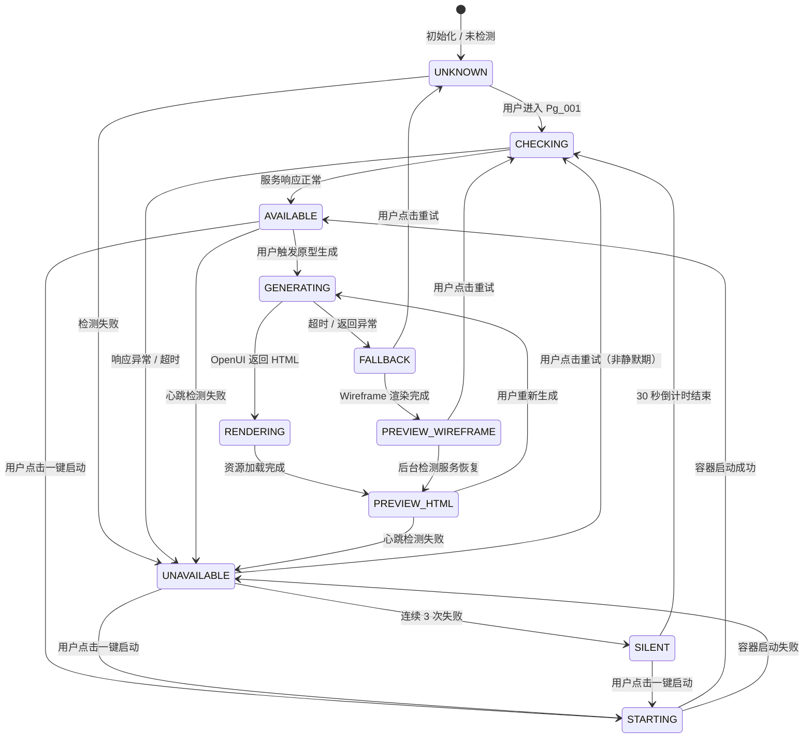

# DR-018：OpenUI 原型服务（OpenUI Prototype Service）模块详细设计

> **模块编号**：DR-018  
> **模块名称**：OpenUI 原型服务（OpenUI Prototype Service）  
> **版本**：v1.0  
> **设计状态**：FROZEN  
> **上游追溯**：DR-018 详细需求（REQ-P0-028/029, NFR-P0-003/004/005）  
> **下游消费**：DR-020（接口覆盖度检测的 HTML 接口触点来源）  
> **变更**：sdlc-visualizer

---

## 1. 架构组件与职责

### 1.1 组件总览

```
┌─────────────────────────────────────────────────────────────┐
│                  OpenUIPrototypeModule                       │
│  ┌────────────────────────────────────────────────────────┐ │
│  │              PrototypeWorkbench (Pg_001)               │ │
│  │  ┌──────────────┐  ┌────────────────────────────────┐  │ │
│  │  │ControlPanel  │  │        PreviewArea             │  │ │
│  │  │(280px fixed) │  │    ┌──────────────────────┐   │  │ │
│  │  │              │  │    │ Toolbar              │   │  │ │
│  │  │- StatusCard  │  │    │ (viewport/page切换)  │   │  │ │
│  │  │- GenControl  │  │    ├──────────────────────┤   │  │ │
│  │  │- HistoryList │  │    │ iframe / Wireframe   │   │  │ │
│  │  └──────────────┘  │    │ Container            │   │  │ │
│  │                    │    ├──────────────────────┤   │  │ │
│  │                    │    │ InfoBar              │   │  │ │
│  │                    │    └──────────────────────┘   │  │ │
│  │                    └────────────────────────────────┘  │ │
│  └────────────────────────────────────────────────────────┘ │
│  ┌─────────────────┐  ┌─────────────────┐  ┌─────────────┐ │
│  │ ServiceLauncher │  │ PromptAssembler │  │ FallbackMgr │ │
│  │ (Pg_005弹层)    │  │ (提示词组装)     │  │ (降级管理)   │ │
│  └─────────────────┘  └─────────────────┘  └─────────────┘ │
└─────────────────────────────────────────────────────────────┘
```

| 组件 | 类型 | 职责 |
|------|------|------|
| `PrototypeWorkbench` | 页面 | 原型工作台主页面：控制面板 + 预览区域 |
| `ControlPanel` | 布局面板 | 左侧控制面板：服务状态卡片、生成控制区、生成历史列表 |
| `StatusCard` | UI 组件 | 服务状态展示：指示灯（绿/黄/红/灰）+ 状态标签 + 一键启动按钮 |
| `GenControl` | UI 组件 | 生成控制：生成范围选择（全部/选中 Container）、生成/取消按钮 |
| `HistoryList` | UI 组件 | 生成历史：最近 5 次记录，含时间戳/页面数/状态/快速加载入口 |
| `PreviewArea` | 布局面板 | 右侧预览区域：工具栏 + iframe 容器 + 底部信息栏 |
| `Toolbar` | UI 组件 | 预览工具栏：设备尺寸切换（桌面/平板/手机）、页面切换下拉框、刷新、全屏 |
| `IframeContainer` | 渲染容器 | iframe 加载 HTML 原型，或展示 Wireframe 降级 SVG |
| `InfoBar` | UI 组件 | 底部信息栏：当前页面名称、渲染耗时、资源加载状态 |
| `ServiceLauncher` | 弹层 | 一键启动 OpenUI 本地服务引导：Docker 检测 → 镜像拉取 → 容器启动 |
| `PromptAssembler` | 逻辑组件 | 基于 C4 Container DSL + 接口契约组装结构化提示词 |
| `FallbackManager` | 逻辑组件 | 降级管理：OpenUI 不可用时切换至 Wireframe 预览 |
| `OpenUIStateManager` | Zustand Store | 服务状态、生成进度、预览状态、历史记录、降级标记 |

### 1.2 提示词组装引擎

```
PromptAssembler
├── ScopeResolver        # 根据 generate_scope 确定目标 Container 集合
├── DSLExtractor         # 从 c4_container_dsl 提取 Container 名称/职责/依赖
├── ContractGrouper      # 将 interface_contract 端点按 Container 分组
├── PromptTemplate       # 提示词模板：角色定义 + 背景 + 逐 Container 描述 + 交互要求
└── PromptCache          # 以输入参数哈希为键缓存提示词
```

**提示词结构模板**：
1. 系统角色：UI 生成助手
2. 应用背景：从 C4 System 名称与目标推导
3. 逐 Container 描述：名称 + 职责 + 技术标签 + 关联端点列表及语义说明
4. 交互要求：导航结构反映 Container 边界、统一风格、响应式布局
5. 输出格式：完整可运行的单 HTML 文件（多页面使用内部路由或锚点）

### 1.3 跨模块依赖

| 依赖方 | 被依赖模块 | 依赖内容 | 接口类型 |
|--------|-----------|----------|----------|
| DR-018 | DR-011 | C4 Container DSL（节点、边、职责描述） | REST |
| DR-018 | 接口契约模块 | 已冻结的 OpenAPI 规范子集 | REST |
| DR-018 | DR-019 | Wireframe 降级预览（服务不可用时） | 组件复用 / REST |
| DR-018 | DR-020 | 提供 HTML 原型接口触点用于覆盖度检测 | 数据传递 |

---

## 2. 接口定义

### 2.1 模块对外提供接口

#### `GET /api/v1/openui/status`

查询 OpenUI 服务状态。

**Response**: `OpenUIServiceStatusDTO`

```typescript
interface OpenUIServiceStatusDTO {
  status: "AVAILABLE" | "STARTING" | "UNAVAILABLE" | "UNKNOWN";
  docker_status: "INSTALLED" | "NOT_INSTALLED" | "INSTALLING";
  last_checked_at: string;
  health_check_duration_ms: number;
}
```

#### `POST /api/v1/openui/generate`

触发原型生成。

**Request**: `PrototypeGenerateRequestDTO`

```typescript
interface PrototypeGenerateRequestDTO {
  project_id: string;
  generate_scope: "ALL" | "SELECTED";
  selected_container_ids?: string[];
  device_viewport: "DESKTOP" | "TABLET" | "MOBILE";
}
```

**Response**: `PrototypeGenerateResponseDTO`

```typescript
interface PrototypeGenerateResponseDTO {
  generation_id: string;
  status: "success" | "timeout" | "error";
  pages: PrototypePageDTO[];
  total_pages: number;
  generation_duration_ms: number;
  content_hash: string;
}

interface PrototypePageDTO {
  page_index: number;
  page_title: string;
  html_content: string;
  container_id: string;
}
```

**Error Codes**:
- `PREREQUISITE_MISSING` — C4 Container 图为空或接口契约未冻结
- `SERVICE_UNAVAILABLE` — OpenUI 服务不可用，已触发降级
- `GENERATION_TIMEOUT` — 生成超时（>10s）

#### `POST /api/v1/openui/launch`

一键启动 OpenUI 本地服务。

**Response**: `LaunchStatusDTO`

```typescript
interface LaunchStatusDTO {
  step: "docker_check" | "image_pull" | "container_start";
  step_status: "pending" | "running" | "success" | "failed";
  overall_progress: number;  // 0-100
  error_message?: string;
}
```

#### `GET /api/v1/openui/history`

获取生成历史列表。

**Query Params**: `project_id`, `limit`（默认 5）

**Response**: `GenerationHistoryDTO[]`

```typescript
interface GenerationHistoryDTO {
  generation_id: string;
  generated_at: string;
  total_pages: number;
  status: "success" | "fallback" | "failed";
  content_hash: string;
}
```

### 2.2 模块消费的外部接口

| 接口 | 提供方 | 用途 | 调用时机 |
|------|--------|------|----------|
| `GET /api/v1/c4/dsl/{project_id}` | DR-011 | 获取 C4 Container DSL | 提示词组装时 |
| `GET /api/v1/contracts/{project_id}` | 接口契约模块 | 获取已冻结的 OpenAPI 规范 | 提示词组装时 |
| `POST /api/v1/openui-service/generate` | OpenUI 本地服务 | 提交提示词生成 HTML | 生成触发时 |
| `GET /api/v1/docker/status` | 环境检测服务 | 检测 Docker 安装状态 | 服务状态检查时 |

---

## 3. 数据表结构

### 3.1 模块独占表

#### `openui_generations` — OpenUI 生成记录表

| 字段 | 类型 | 约束 | 说明 |
|------|------|------|------|
| `generation_id` | TEXT | PK | UUID v4 |
| `project_id` | TEXT | FK → `projects.project_id`, NOT NULL | 关联项目 |
| `status` | TEXT | NOT NULL | `success` / `fallback` / `failed` |
| `total_pages` | INTEGER | NOT NULL, DEFAULT 0 | 页面总数 |
| `content_hash` | TEXT | | HTML 内容哈希 |
| `storage_path` | TEXT | | 临时存储路径 |
| `generation_duration_ms` | INTEGER | | 生成耗时 |
| `device_viewport` | TEXT | | `DESKTOP` / `TABLET` / `MOBILE` |
| `created_at` | DATETIME | NOT NULL | 创建时间 |

**索引**: `IDX_OG_PROJECT` (`project_id`, `created_at DESC`)

#### `openui_generation_pages` — 生成页面明细表

| 字段 | 类型 | 约束 | 说明 |
|------|------|------|------|
| `page_id` | TEXT | PK | UUID v4 |
| `generation_id` | TEXT | FK → `openui_generations.generation_id`, NOT NULL | 关联生成记录 |
| `page_index` | INTEGER | NOT NULL | 页面序号 |
| `page_title` | TEXT | NOT NULL | 页面标题 |
| `container_id` | TEXT | | 关联 Container |
| `html_content` | TEXT | NOT NULL | HTML 片段 |
| `created_at` | DATETIME | NOT NULL | 创建时间 |

### 3.2 表写权限声明

| 表名 | 写模块 | 读模块 | 说明 |
|------|--------|--------|------|
| `openui_generations` | DR-018 | DR-018, DR-020 | 生成记录 |
| `openui_generation_pages` | DR-018 | DR-018, DR-020 | 页面明细 |

---

## 4. 状态机

### 4.1 服务状态机



### 4.2 降级触发条件

| 触发条件 | 降级目标 | 用户感知 |
|----------|----------|----------|
| 进入 Pg_001 时服务 UNAVAILABLE | Wireframe 预览 | 黄色横幅 + "重试"按钮 |
| 生成请求超时（>10s） | Wireframe 预览 | 自动切换 + 横幅提示 |
| 连续 3 次服务调用失败 | Wireframe 预览 + SILENT 状态 | 重试按钮置灰 + 30s 倒计时 |
| 用户手动点击"切换到 Wireframe" | Wireframe 预览 | 立即切换 |

---

## 5. 边界条件与异常处理

### 5.1 单元测试

| 测试目标 | 测试内容 | 预期覆盖率 |
|----------|----------|:----------:|
| `PromptAssembler` | 提示词模板组装、缓存复用、Container 分组 | ≥ 85% |
| `FallbackManager` | 降级触发条件、Wireframe 内容准备、横幅展示 | ≥ 80% |
| `ServiceLauncher` | Docker 检测、镜像拉取、容器启动步骤流转 | ≥ 75% |
| `OpenUIStateManager` | 状态流转、历史记录管理、设备尺寸持久化 | ≥ 80% |

### 5.2 集成测试

| 测试场景 | 验证点 |
|----------|--------|
| 标准原型生成 | C4 Container + 契约 → 提示词组装 → 10s 内生成 → iframe 预览 |
| 服务不可用降级 | 进入工作台 → 红灯 → 自动切换 Wireframe → 横幅提示 |
| 一键启动服务 | 点击启动 → 步骤展示 → 成功 → 状态灯变绿 |
| 生成超时降级 | 触发生成 → 等待 10s → 自动切换 Wireframe |
| 连续失败静默 | 3 次失败 → 重试按钮置灰 → 30s 倒计时 → 恢复后可重试 |
| 多页面切换 | 生成多页面 → 下拉框切换 → iframe 内容更新 |

### 5.3 性能测试

| 指标 | 目标值 | 测试方法 |
|------|--------|----------|
| 原型生成 | < 10s（P95） | 自动化 API 测试 |
| 预览首屏加载 | < 3s（P95） | Playwright 计时 |
| 降级切换 | < 1s（P95） | 前端性能测试 |
| 服务状态检测 | < 1s | API 测试 |
