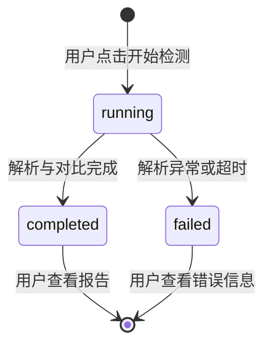
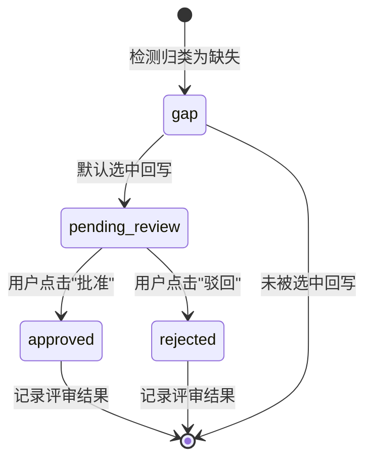
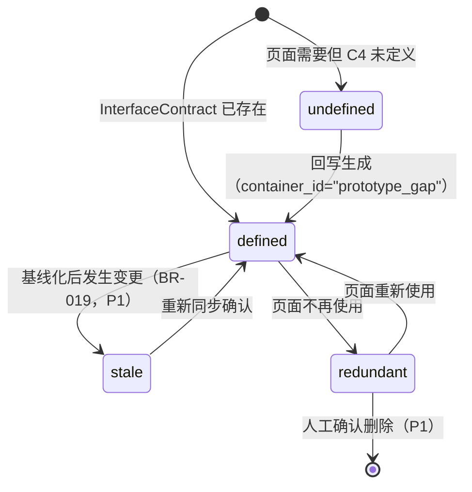

# DR-020：原型-架构双向绑定（Prototype-Architecture Bidirectional Binding）模块详细设计

> **模块编号**：DR-020  
> **模块名称**：原型-架构双向绑定  
> **版本**：v1.0  
> **设计状态**：IMPLEMENTED（v1.1）  
> **上游追溯**：DR-020 详细需求（PRD-FR-051~054, BR-019/020-1~5）  
> **下游消费**：DR-011（C4 DSL 基线更新）、DR-004（Gate 评审）  
> **变更**：sdlc-visualizer

---

## 1. 架构组件与职责

### 1.1 组件总览

```
┌─────────────────────────────────────────────────────────────┐
│              ProtoArchBindingModule (DR-020)                 │
│  ┌────────────────────────────────────────────────────────┐ │
│  │              BindingPanel (Pg_BindingPanel)            │ │
│  │  覆盖度仪表盘 | 检测报告(Tab) | 回写操作 | 行级评审    │ │
│  └────────────────────────────────────────────────────────┘ │
│           │                   │                  │          │
│  ┌────────┴───────────────────┴──────────────────┴────────┐ │
│  │              BindingEngine (核心引擎)                   │ │
│  │  ┌───────────┐ ┌───────────┐ ┌───────────┐           │ │
│  │  │  Analyzer │ │  ScanSvc  │ │ Writeback │ │  Reviewer │ │
│  │  │(锚点提取) │ │(扫描调度) │ │(契约回写) │ │(行级评审) │ │
│  │  └───────────┘ └───────────┘ └───────────┘           │ │
│  └────────────────────────────────────────────────────────┘ │
└─────────────────────────────────────────────────────────────┘
```

| 组件 | 类型 | 职责 |
|------|------|------|
| `BindingPanel` | 页面 | 原型-架构双向绑定面板：项目选择器 + 扫描历史 + 统计卡片 + 四分类 Tab（gap/redundant/matched/diff）+ 回写操作 + 行级评审 |
| `BindingAnalyzer` | 核心引擎 | 提取 WireframePage `layout_json` / OpenUIPage HTML 中的接口锚点，与 `interface_contracts` 对比，输出 gap/redundant/matched/diff |
| `CoverageScanService` | 核心引擎 | 扫描调度：聚合数据 → 调用 Analyzer → 持久化 scan + items → 汇总指标 |
| `WritebackService` | 核心引擎 | 将选中的 gap 项写入 `interface_contracts` 表（`container_id="prototype_gap"`） |
| `ReviewService` | 核心引擎 | 更新 `coverage_scan_items.review_status`（approved / rejected） |
| `BindingStateManager` | React useState | 项目 ID、扫描列表、活跃 scan、Tab 状态、加载状态 |

### 1.2 检测引擎详解

```
BindingAnalyzer
├── WireframeAnchorExtractor   # 解析 WireframePage.layout_json 中的 action/href 锚点
│   └── 遍历 layout_json[].elements[]，提取 action / method / label / fields
├── OpenUIAnchorExtractor      # 解析 OpenUIPage.html_content 中的接口触点
│   ├── ApiCommentParser       # 匹配 <!--api:Name|METHOD|PATH-->
│   ├── FormActionParser       # 匹配 <form action="..." method="...">
│   └── FetchPathHeuristic     # 正则匹配 /api/... / /vN/... 路径，结合上下文推断 METHOD
├── ContractLoader             # 读取 InterfaceContract 表作为基线
├── NameMatcher                # KEY 匹配：(METHOD + PATH).lower() 精确匹配
├── FuzzyPathMatcher           # 路径相同但方法不同时做 fuzzy match，标记为 diff
├── SignatureMatcher           # 比较 anchor.params vs contract.request_schema，输出 param_diff
└── Classifier                 # 归类：gap(无契约) / redundant(无锚点) / matched / diff
```

**检测规则**：
- **缺失(gap)**：锚点存在但 InterfaceContract 中无匹配 KEY(`METHOD PATH`)
- **冗余(redundant)**：InterfaceContract 中存在但所有锚点中均无对应路径
- **匹配(matched)**：KEY 精确匹配，且参数签名一致
- **参数差异(diff)**：路径相同（fuzzy）但方法不同，或参数签名不一致（BR-020-3）

**MVP 简化**：当前不直接解析 C4 DSL 文本文件，而是以 `interface_contracts` 表作为基线。P1 阶段将扩展为同时支持 C4 DSL YAML 解析。

### 1.3 跨模块依赖

| 依赖方 | 被依赖模块 | 依赖内容 | 接口类型 |
|--------|-----------|----------|----------|
| DR-020 | DR-019 | Wireframe 页面接口锚点 | REST |
| DR-020 | DR-018 | OpenUI HTML 接口触点 | REST |
| DR-020 | DR-011 | C4 DSL 接口定义基线 | REST / 文件系统 |
| DR-020 | DR-004 | Gate 评审流程（pending_review → approved/rejected） | REST |
| DR-020 | DR-005 | C4 DSL 文件写回、版本控制 | 文件系统 |

---

## 2. 接口定义

### 2.1 模块对外提供接口

#### `POST /api/v1/projects/{project_id}/coverage-scans`

执行接口覆盖度检测。

**Request**: 路径参数 `project_id`

**Response**: `CoverageScanSummaryDTO`（201 Created）

```typescript
interface CoverageScanSummaryDTO {
  scan_id: string;
  project_id: string;
  status: "running" | "completed" | "failed";
  coverage_percent: number | null;
  gap_count: number | null;
  redundant_count: number | null;
  diff_count: number | null;
  wireframe_page_count: number | null;
  openui_page_count: number | null;
  c4_interface_count: number | null;
  summary_json: string | null;   // {"matched":N,"gaps":N,"redundant":N,"diffs":N,"total":N}
  created_at: string | null;
  updated_at: string | null;
}
```

**Error Codes**:
- `400` — 项目不存在或参数校验失败
- `500` — 解析异常或数据库错误

#### `GET /api/v1/projects/{project_id}/coverage-scans`

获取项目的扫描历史列表。

**Response**: `CoverageScanSummaryDTO[]`

#### `GET /api/v1/coverage-scans/{scan_id}`

获取扫描报告详情（含 items）。支持 `?result_type=gap|redundant|matched|diff` 过滤。

**Response**: `CoverageScanDetailDTO`

```typescript
interface CoverageScanDetailDTO {
  scan: CoverageScanSummaryDTO;
  items: CoverageScanItemDTO[];
}

interface CoverageScanItemDTO {
  item_id: string;
  scan_id: string;
  project_id: string;
  interface_name: string;
  endpoint_path: string | null;
  method_type: string | null;
  source_location: string | null;
  source_type: "wireframe" | "openui";
  result_type: "gap" | "redundant" | "matched" | "diff";
  expected_params: string | null;   // JSON: 锚点中的参数签名
  actual_params: string | null;     // JSON: 参数差异详情
  is_selected_for_writeback: boolean;
  review_status: "pending_review" | "approved" | "rejected" | null;
  created_at: string | null;
}
```

#### `GET /api/v1/coverage-scans/{scan_id}/writeback-preview`

预览当前选中用于回写的 gap 项。

**Response**: `WritebackPreviewDTO`

```typescript
interface WritebackPreviewDTO {
  scan_id: string;
  selected_gaps: CoverageScanItemDTO[];
}
```

#### `PATCH /api/v1/coverage-scan-items/{item_id}/writeback`

切换单条 gap 项的回写选中状态。

**Request**: `{ selected: boolean }`

**Response**: `CoverageScanItemDTO`

**Error Codes**:
- `400` — 仅 gap 项可切换回写状态
- `404` — item 不存在

#### `POST /api/v1/coverage-scans/{scan_id}/writeback`

执行回写：将选中的 gap 项创建为 `InterfaceContract` 记录。

**Response**: `WritebackResultDTO`

```typescript
interface WritebackResultDTO {
  scan_id: string;
  created_count: number;
  contracts: Array<{
    contract_id: string;
    path: string;
    method: string;
  }>;
}
```

**副作用**：
1. 为每个选中的 gap 在 `interface_contracts` 表插入记录
2. `container_id` 固定为 `"prototype_gap"`
3. `method_type`、`endpoint_path` 取自 gap 项
4. `request_schema` / `response_schema` 初始化为 `'{}'`

#### `POST /api/v1/coverage-scan-items/{item_id}/review`

提交单条 gap 项的评审结论。

**Request**: `{ status: "approved" | "rejected" }`

**Response**: `CoverageScanItemDTO`

**Error Codes**:
- `400` — status 必须为 approved 或 rejected
- `404` — item 不存在

### 2.2 模块消费的外部接口

| 接口 | 提供方 | 用途 | 调用时机 |
|------|--------|------|----------|
| `GET /api/v1/wireframe/pages` | DR-019 | 获取 Wireframe 页面接口锚点 | 检测时 |
| `GET /api/v1/openui/generations` | DR-018 | 获取 OpenUI HTML 接口触点 | 检测时 |
| `GET /api/v1/c4/dsl/{project_id}` | DR-011 | 获取 C4 DSL 基线 | 检测时 |
| `PUT /api/v1/c4/dsl/{project_id}` | DR-011 | 回写 C4 DSL 暂存区 | 回写时 |
| `POST /api/v1/gates/review` | DR-004 | Gate 评审流程触发 | 回写后 |

---

## 3. 数据表结构

### 3.1 模块独占表

#### `coverage_scans` — 接口覆盖度扫描会话表

| 字段 | 类型 | 约束 | 说明 |
|------|------|------|------|
| `scan_id` | VARCHAR(36) | PK, DEFAULT UUID | 扫描唯一标识 |
| `project_id` | VARCHAR(36) | NOT NULL, FK → projects | 关联项目 |
| `status` | VARCHAR(16) | NOT NULL, DEFAULT 'running' | `running` / `completed` / `failed` |
| `coverage_percent` | INTEGER | | 覆盖率 0-100 |
| `gap_count` | INTEGER | | 缺失接口数 |
| `redundant_count` | INTEGER | | 冗余接口数 |
| `diff_count` | INTEGER | | 参数差异数 |
| `wireframe_page_count` | INTEGER | | 参与检测的 Wireframe 页数 |
| `openui_page_count` | INTEGER | | 参与检测的 OpenUI 页数 |
| `c4_interface_count` | INTEGER | | 基线 InterfaceContract 数量 |
| `summary_json` | TEXT | | 扫描摘要 JSON |
| `created_at` | TIMESTAMP | NOT NULL | 创建时间 |
| `updated_at` | TIMESTAMP | NOT NULL | 更新时间 |

**索引**: `IDX_CS_PROJECT` (`project_id`, `created_at DESC`)

#### `coverage_scan_items` — 扫描单项结果表

| 字段 | 类型 | 约束 | 说明 |
|------|------|------|------|
| `item_id` | VARCHAR(36) | PK, DEFAULT UUID | 单项唯一标识 |
| `scan_id` | VARCHAR(36) | NOT NULL, FK → coverage_scans | 关联扫描 |
| `project_id` | VARCHAR(36) | NOT NULL, FK → projects | 关联项目 |
| `interface_name` | VARCHAR(256) | NOT NULL | 接口名称或锚点名称 |
| `endpoint_path` | VARCHAR(256) | | 接口路径 |
| `method_type` | VARCHAR(8) | | HTTP 方法 |
| `source_location` | VARCHAR(128) | | 来源页面标识 |
| `source_type` | VARCHAR(16) | NOT NULL | `wireframe` / `openui` |
| `result_type` | VARCHAR(16) | NOT NULL | `gap` / `redundant` / `matched` / `diff` |
| `expected_params` | TEXT | | 锚点中的参数签名 JSON |
| `actual_params` | TEXT | | 参数差异详情 JSON |
| `is_selected_for_writeback` | BOOLEAN | NOT NULL, DEFAULT FALSE | 是否选中回写 |
| `review_status` | VARCHAR(16) | | `pending_review` / `approved` / `rejected` |
| `created_at` | TIMESTAMP | NOT NULL | 创建时间 |

**索引**: `IDX_CSI_SCAN` (`scan_id`, `result_type`)

### 3.2 表写权限声明

| 表名 | 写模块 | 读模块 | 说明 |
|------|--------|--------|------|
| `coverage_scans` | DR-020 | DR-020 | 扫描会话记录 |
| `coverage_scan_items` | DR-020 | DR-020 | 扫描单项结果 |

> **MVP 说明**：`architecture_changes` 独立表未实现，评审状态以 `coverage_scan_items.review_status` 承载。P1 阶段将扩展为独立的架构变更记录表。

---

## 4. 状态机

### 4.1 检测报告生命周期



### 4.2 扫描单项生命周期（MVP 简化版）



> **MVP 说明**：独立的 architecture_change 生命周期（draft → pending_review → approved → merged）未实现。P1 阶段将扩展为完整的架构变更记录表。

### 4.3 接口定义状态（InterfaceContract 视角）



---

## 5. 边界条件与异常处理

### 5.1 单元测试

| 测试目标 | 测试内容 | 实际覆盖率 | 测试文件 |
|----------|----------|:----------:|----------|
| `BindingAnalyzer` | Wireframe layout_json 解析、OpenUI HTML 解析（api 注释/form/fetch）、名称匹配、参数签名匹配 | 75% | `tests/unit/services/test_coverage_scan_service.py` |
| `CoverageScanService` | 空项目扫描、含 gap 扫描、toggle writeback、apply writeback、review item | 35%（集成测试补充覆盖） | `tests/unit/services/test_coverage_scan_service.py` |

### 5.2 集成测试

| 测试场景 | 验证点 | 测试文件 |
|----------|--------|----------|
| 首次检测全流程 | 开始检测 → 展示报告 → 缺失/冗余/匹配/差异分类正确 → gap 默认选中回写 | `tests/integration/test_sync8_binding.py::test_binding_full_scan_flow` |
| 回写与评审 | 取消回写 → 空回写 → 重新选中 → 执行回写 → 评审 approve / reject | `tests/integration/test_sync8_binding.py::test_binding_full_scan_flow` |
| 空项目检测 | 无数据项目 → 100% 覆盖率 → 0 gap / 0 redundant | `tests/integration/test_sync8_binding.py::test_binding_scan_empty_project` |
| 404 / 边界校验 | 查询不存在 scan → 404；对非 gap 项 toggle → 400；非法评审状态 → 422 | `tests/integration/test_sync8_binding.py` |

### 5.3 性能测试（MVP 未执行，P1 补充）

| 指标 | 目标值 | 测试方法 |
|------|--------|----------|
| 接口检测全流程 | < 3s（P95） | 自动化测试 |
| 回写操作响应 | < 1s（P95） | API 基准测试 |
| 评审页面加载 | < 2s | Playwright 计时 |


---

## 附录：变更日志

| 版本 | 日期 | 修改人 | 修改内容 |
|------|------|--------|----------|
| v1.0 | 2026-06-01 | AI Architect | 初始版本，基于 PRD 关键信息生成 DR-020 模块级详细设计 |
| v1.1 | 2026-06-05 | AI Code Agent | 设计实现同步：前端 4 页面合并为 BindingPanel 单页；API 路径与实际路由对齐；数据表从 `binding_scans`+`architecture_changes` 调整为 `coverage_scans`+`coverage_scan_items`；检测引擎与实际 `BindingAnalyzer` 实现对齐；补充单元测试与集成测试覆盖信息；标注 MVP 简化项与 P1 扩展计划 |
