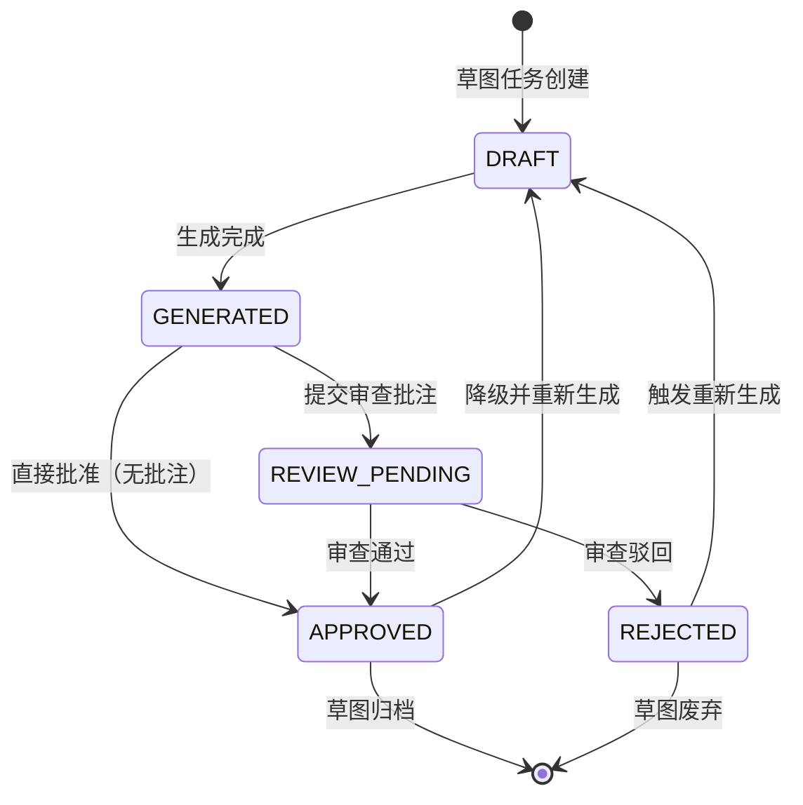

# DR-021：需求草图服务（PageSpec Sketch Service）模块详细设计

> **模块编号**：DR-021  
> **模块名称**：需求草图服务（PageSpec Sketch Service）  
> **版本**：v1.0  
> **设计状态**：FROZEN  
> **上游追溯**：DR-021 详细需求（REQ-P0-040, BR-021-01~08）  
> **下游消费**：DR-003（审查面板草图展示与偏差标记）  
> **变更**：sdlc-visualizer

---

## 1. 架构组件与职责

### 1.1 组件总览

```
┌─────────────────────────────────────────────────────────────┐
│                PageSpecSketchModule (DR-021)                 │
│  ┌─────────────┐ ┌─────────────┐ ┌────────────────────────┐ │
│  │ SketchEntry │ │SketchCanvas │ │   SketchReviewPanel    │ │
│  │  (Pg_001)   │ │  (Pg_003)   │ │    (Pg_004)            │ │
│  └──────┬──────┘ └──────┬──────┘ └───────────┬────────────┘ │
│         │               │                    │              │
│  ┌──────┴───────────────┴────────────────────┴──────────┐   │
│  │              SketchEngine (核心引擎)                  │   │
│  │  ┌─────────┐ ┌─────────┐ ┌─────────┐ ┌───────────┐  │   │
│  │  │StoryExtractor│ │PageSpec │ │Layout   │ │Review     │  │   │
│  │  │             │ │Parser   │ │Generator│ │Processor  │  │   │
│  │  └─────────┘ └─────────┘ └─────────┘ └───────────┘  │   │
│  └───────────────────────────────────────────────────────┘   │
│  ┌────────────────────────────────────────────────────────┐ │
│  │           SketchStateManager (Zustand Store)            │ │
│  │  - stories / sketches / annotations / sketchStatus      │ │
│  └────────────────────────────────────────────────────────┘ │
└─────────────────────────────────────────────────────────────┘
```

| 组件 | 类型 | 职责 |
|------|------|------|
| `SketchEntry` | 页面 | 草图生成入口（Pg_001）：用户故事列表、筛选、生成触发 |
| `SketchLoading` | 页面 | 草图生成中（Pg_002）：进度环、实时日志、预计剩余时间 |
| `SketchCanvas` | 页面 | 草图浏览画布（Pg_003）：画布渲染、缩放平移、审查模式开关 |
| `SketchReviewPanel` | 弹窗 | 草图审查面板（Pg_004）：偏差类型、位置、描述、期望结果输入 |
| `MissingFieldDialog` | 弹窗 | 缺失字段提示（Pg_005）：缺失字段列表、补充/继续生成选择 |
| `SketchStatusManager` | 页面 | 草图状态管理（Pg_006）：状态筛选列表、操作入口 |
| `StoryExtractor` | 核心引擎 | 用户故事页面描述提取（关键词匹配） |
| `PageSpecParser` | 核心引擎 | PageSpec 规则解析：页面类型识别、字段提取、操作提取、跳转提取 |
| `LayoutGenerator` | 核心引擎 | 草图布局生成：相对坐标计算、视觉规范应用、SVG/Canvas 渲染数据输出 |
| `ReviewProcessor` | 核心引擎 | 审查批注处理：偏差关联、故事段落定位、状态更新 |
| `SketchStateManager` | Zustand Store | 故事列表、草图数据、审查批注、生成进度、草图生命周期状态 |

### 1.2 PageSpec 解析引擎

```
PageSpecParser
├── PageTypeClassifier     # 基于关键词与规则模式识别页面类型（7种）
├── FieldExtractor         # 提取字段列表（识别"输入/填写/选择"后的名词短语）
├── ActionExtractor        # 提取按钮/操作（识别"点击/提交/保存/删除"及对象）
├── JumpTargetExtractor    # 提取跳转目标（识别"跳转到/进入/返回"后的页面名称）
└── StructureMapper        # 映射到标准页面结构模板
```

**页面类型识别关键词**：
- **表单**："填写"、"输入"、"提交"、"注册"、"登录"
- **列表**："列表"、"查看全部"、"分页"、"筛选"
- **详情**："详情"、"查看"、"展示"、"概述"
- **弹窗**："弹窗"、"对话框"、"确认"、"提示"
- **仪表盘**："统计"、"图表"、"指标"、"概览"
- **搜索**："搜索"、"查询"、"筛选条件"、"结果"
- **空白页/错误页**：兜底类型

### 1.3 跨模块依赖

| 依赖方 | 被依赖模块 | 依赖内容 | 接口类型 |
|--------|-----------|----------|----------|
| DR-021 | 需求管理模块 | 用户故事文本内容 | REST |
| DR-021 | DR-003 | 草图在审查 Tab 展示、偏差批注关联 | 组件复用 / REST |

---

## 2. 接口定义

### 2.1 模块对外提供接口

#### `POST /api/v1/sketches/generate`

触发草图生成。

**Request**: `SketchGenerateRequestDTO`

```typescript
interface SketchGenerateRequestDTO {
  project_id: string;
  story_ids: string[];       // 至少 3 个含页面描述的故事
  continue_with_missing?: boolean; // 存在缺失字段时是否继续
}
```

**Response**: `SketchGenerateResponseDTO`

```typescript
interface SketchGenerateResponseDTO {
  generation_id: string;
  status: "generating" | "completed" | "failed";
  sketches: SketchDTO[];
  missing_fields?: MissingFieldDTO[];
}

interface SketchDTO {
  sketch_id: string;
  sketch_index: number;
  page_type: PageType;
  story_ids: string[];
  render_data: SketchRenderDataDTO;
  status: SketchStatus;
}

interface SketchRenderDataDTO {
  elements: SketchElementDTO[];
  connections: SketchConnectionDTO[];
  canvas_width: number;
  canvas_height: number;
}

interface SketchElementDTO {
  element_id: string;
  element_type: "page_boundary" | "field" | "button" | "label" | "icon";
  x: number;
  y: number;
  width: number;
  height: number;
  label: string;
}

interface SketchConnectionDTO {
  source_element_id: string;
  target_element_id: string;
  connection_type: "jump" | "flow";
  label?: string;
}

type PageType = "form" | "list" | "detail" | "modal" | "dashboard" | "search" | "generic";
type SketchStatus = "DRAFT" | "GENERATED" | "REVIEW_PENDING" | "APPROVED" | "REJECTED";

interface MissingFieldDTO {
  story_id: string;
  story_title: string;
  missing_content: string;   // 缺失内容描述
}
```

#### `POST /api/v1/sketches/{sketch_id}/review`

提交草图审查批注。

**Request**: `SketchReviewRequestDTO`

```typescript
interface SketchReviewRequestDTO {
  sketch_id: string;
  annotations: SketchAnnotationDTO[];
  reviewer: string;
}

interface SketchAnnotationDTO {
  annotation_id: string;
  deviation_type: "missing_field" | "extra_field" | "flow_error" | "other";
  element_id: string;
  description: string;       // 10-500 字符
  expected_result?: string;  // 0-500 字符
}
```

**Response**: `{ sketch_id: string; status: "REVIEW_PENDING"; annotation_count: number; }`

#### `POST /api/v1/sketches/{sketch_id}/approve`

批准草图。

**Response**: `{ sketch_id: string; status: "APPROVED"; }`

#### `POST /api/v1/sketches/{sketch_id}/reject`

驳回草图。

**Response**: `{ sketch_id: string; status: "REJECTED"; }`

#### `POST /api/v1/sketches/{sketch_id}/regenerate`

重新生成草图。

**Request**: `{ story_ids?: string[]; }`（可选，不传则使用原关联故事）

**Response**: `SketchGenerateResponseDTO`

#### `GET /api/v1/sketches`

查询草图列表。

**Query Params**: `project_id`, `status`, `page`, `page_size`

**Response**: `{ total: number; sketches: SketchSummaryDTO[]; }`

```typescript
interface SketchSummaryDTO {
  sketch_id: string;
  sketch_index: number;
  page_type: PageType;
  story_ids: string[];
  status: SketchStatus;
  annotation_count: number;
  created_at: string;
  updated_at: string;
}
```

### 2.2 模块消费的外部接口

| 接口 | 提供方 | 用途 | 调用时机 |
|------|--------|------|----------|
| `GET /api/v1/stories` | 需求管理模块 | 获取用户故事列表 | 草图生成入口加载时 |
| `GET /api/v1/stories/{story_id}` | 需求管理模块 | 获取用户故事详情文本 | 草图生成时 |
| `POST /api/v1/stages/{stage_id}/annotations` | DR-003 | 将审查批注关联至用户故事 | 批注提交时 |

---

## 3. 数据表结构

### 3.1 模块独占表

#### `sketches` — 草图表

| 字段 | 类型 | 约束 | 说明 |
|------|------|------|------|
| `sketch_id` | TEXT | PK | UUID v4 |
| `project_id` | TEXT | FK → `projects.project_id`, NOT NULL | 关联项目 |
| `sketch_index` | INTEGER | NOT NULL | 草图序号 |
| `page_type` | TEXT | NOT NULL | `form` / `list` / `detail` / `modal` / `dashboard` / `search` / `generic` |
| `story_ids` | TEXT | NOT NULL | JSON 数组：关联故事 ID 列表 |
| `render_data` | TEXT | NOT NULL | JSON：渲染数据结构 |
| `status` | TEXT | NOT NULL, DEFAULT `DRAFT` | `DRAFT` / `GENERATED` / `REVIEW_PENDING` / `APPROVED` / `REJECTED` |
| `annotation_count` | INTEGER | NOT NULL, DEFAULT 0 | 批注数量 |
| `created_at` | DATETIME | NOT NULL | 创建时间 |
| `updated_at` | DATETIME | NOT NULL | 更新时间 |

**索引**: `IDX_SK_PROJECT` (`project_id`, `status`), `IDX_SK_STORIES` (`story_ids`)

#### `sketch_annotations` — 草图审查批注表

| 字段 | 类型 | 约束 | 说明 |
|------|------|------|------|
| `annotation_id` | TEXT | PK | UUID v4 |
| `sketch_id` | TEXT | FK → `sketches.sketch_id`, NOT NULL | 关联草图 |
| `deviation_type` | TEXT | NOT NULL | `missing_field` / `extra_field` / `flow_error` / `other` |
| `element_id` | TEXT | NOT NULL | 关联草图元素 |
| `description` | TEXT | NOT NULL, CHECK LENGTH 10-500 | 偏差描述 |
| `expected_result` | TEXT | | 期望结果 |
| `reviewer` | TEXT | NOT NULL | 审查人 |
| `story_paragraph_index` | INTEGER | | 关联故事段落索引 |
| `created_at` | DATETIME | NOT NULL | 创建时间 |

**索引**: `IDX_SA_SKETCH` (`sketch_id`, `created_at DESC`)

### 3.2 表写权限声明

| 表名 | 写模块 | 读模块 | 说明 |
|------|--------|--------|------|
| `sketches` | DR-021 | DR-021, DR-003 | 草图数据 |
| `sketch_annotations` | DR-021 | DR-021, DR-003 | 审查批注 |

---

## 4. 状态机

### 4.1 草图生命周期状态机



**状态说明**：

| 状态 | 含义 | 可执行操作 |
|------|------|------------|
| DRAFT | 草稿态，尚未生成或已重置 | 触发生成、删除 |
| GENERATED | 已生成，待审查或待批准 | 查看、进入审查模式、直接批准 |
| REVIEW_PENDING | 已提交审查批注，等待处理 | 查看、追加批注、批准、驳回 |
| APPROVED | 审查通过，可作为设计基线 | 查看、降级为草稿 |
| REJECTED | 审查驳回，需重新生成 | 查看、触发重新生成、废弃 |

---

## 5. 边界条件与异常处理

### 5.1 单元测试

| 测试目标 | 测试内容 | 预期覆盖率 |
|----------|----------|:----------:|
| `StoryExtractor` | 页面描述段落识别、无描述故事过滤 | ≥ 85% |
| `PageSpecParser` | 页面类型识别、字段提取、操作提取、跳转提取 | ≥ 85% |
| `LayoutGenerator` | 画布分组、相对坐标计算、视觉规范应用 | ≥ 80% |
| `ReviewProcessor` | 批注关联、故事段落定位、状态流转 | ≥ 80% |

### 5.2 集成测试

| 测试场景 | 验证点 |
|----------|--------|
| 草图生成主流程 | 勾选 ≥3 故事 → 缺失字段检测 → 生成 → Pg_003 画布渲染 |
| 缺失字段处理 | 检测到缺失 → 弹出 Pg_005 → 选择继续/取消 → 相应流程 |
| 草图审查 | 开启审查模式 → 点击元素 → Pg_004 弹出 → 填写偏差 → 提交批注 |
| 重新生成 | REJECTED 草图 → 点击重新生成 → 读取最新故事文本 → 重新生成 |
| 状态流转 | GENERATED → REVIEW_PENDING → APPROVED / REJECTED → DRAFT |

### 5.3 性能测试

| 指标 | 目标值 | 测试方法 |
|------|--------|----------|
| 端到端生成 | < 3s（P95，单组 3 故事） | 自动化测试 |
| 画布渲染帧率 | ≥ 30fps | 前端性能测试 |
| 批量生成（50 故事） | < 10s | API 基准测试 |
