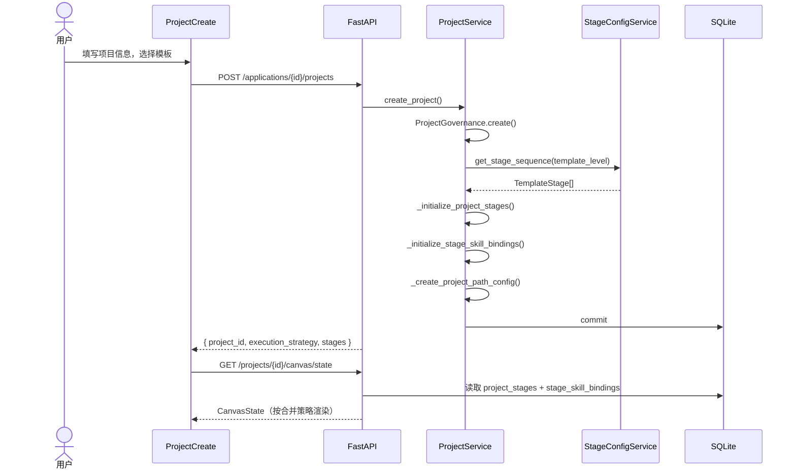
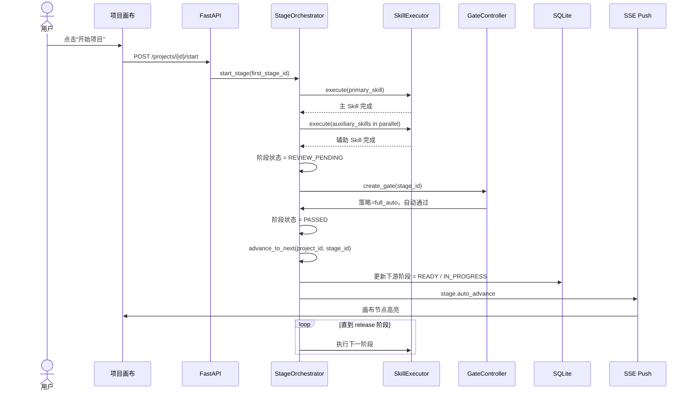
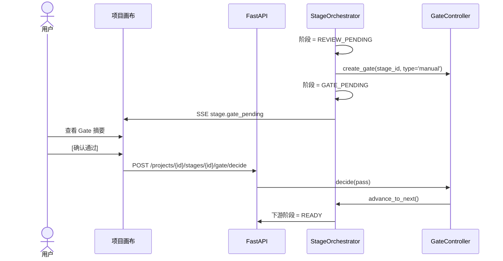
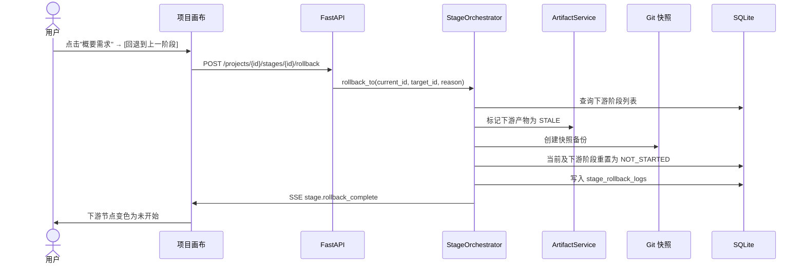

# 详细设计文档：阶段推进与 Skill 绑定机制重构

> **文档编号**: DDS-001 v1.1（基于现场方案修订）  
> **状态**: 设计基线  
> **日期**: 2026-06-15  
> **依据**: PRD-000 v2.0-patch2 / HLD-000 v1.0 / 用户现场截图 / 当前代码基线审计  
> **关联设计**: [Batch-03 编排调度 + HITL + 实时推送](../batch-03-orchestration-hitl-push/module-design.md)

---

## 1. 文档说明

### 1.1 目的

本文档基于用户提供的《阶段推进与 Skill 绑定机制重构》方案（DDS-001 v1.0），结合当前 `feature/llm-config-dynamic` 分支代码基线的实际实现，输出：

1. **现状与 Gap 分析**：当前代码已有什么、缺什么、与方案的距离。
2. **详细设计方案**：数据模型、后端服务、API 契约、前端页面/组件的完整调整方案。
3. **重构实施计划**：按 Batch 拆分的落地步骤、文件清单、验收标准。

### 1.2 范围

- **前端页面**：项目工作台、项目画布、阶段详情面板、模板配置、阶段调整面板、复杂度路由面板。
- **后端模块**：模板引擎、Stage 编排器、执行计划生成器、项目服务、Gate 控制器、画布状态、复杂度路由、SSE 推送。
- **数据模型**：`templates`、`template_stages`、`project_stages`、`execution_plans`、`plan_nodes`、`projects`、`stage_skill_bindings`（新增）、`project_path_config`（新增）等。

### 1.3 假设与约束

- 保留现有四级复杂度路径（Trivial / Light / Standard / Deep）。
- 保留现有 React Flow 画布框架（`SDLCCanvas` / `FlowCanvas`）。
- 不引入全新的工作流引擎，先在现有 `StageOrchestrator` + `ExecutionPlanGenerator` 基础上重构。
- Skill 真实执行接入以 [Batch-02 PocketFlowEngine](../batch-02-validation-prototype-engine/module-design.md) 为前提，本设计先做编排层准备。

---

## 2. 现状诊断与 Gap 分析

### 2.1 当前实现已具备的基础

| 能力域 | 当前状态 | 关键文件 |
|--------|----------|----------|
| 项目 & Stage 数据模型 | 表已存在，但字段未覆盖运行时状态 | `models/project.py`, `models/project_stage.py`, `models/template_stage.py` |
| 模板 & Stage 种子 | 已支持 Trivial/Light/Standard/Deep 四级模板及 Stage 复制 | `core/seed.py`, `governance/template_engine.py` |
| 画布渲染 | 能根据 `template_stages` 自动生成默认 React Flow 节点 | `api/v1/canvas_state.py`, `components/SDLCCanvas/index.tsx` |
| 执行计划骨架 | 有 `ExecutionPlanGenerator`、`StageOrchestrator`、`PlanNode` 模型 | `services/execution_plan_generator.py`, `services/stage_orchestrator.py` |
| Gate 决策模型 | `gate_decisions` 表存在 | `models/gate_decision.py` |
| 复杂度路由 UI | 五维评估、四级路径对比面板已有 | `pages/ComplexityRouter/index.tsx` |
| 模板配置 UI | Stage-Skill 绑定、合并/拆分/重排序已有入口 | `pages/TemplateStageConfig/index.tsx`, `api/v1/templates.py` |

### 2.2 关键 Gap（按阻塞程度排序）

| # | Gap 项 | 当前现状 | 影响 | 优先级 |
|---|--------|----------|------|--------|
| 1 | **9 业务阶段未落地** | `template_engine.py` 中阶段名为 `setup/analysis/design/develop/verify/deploy`，与方案要求的中文业务阶段不一致 | 画布展示的技术阶段无法理解，合并策略无法表达 | P0 |
| 2 | **执行计划为空节点** | `Canvas/index.tsx:147` 创建执行计划时传入 `skill_nodes: []` | 执行视图无节点可执行 | P0 |
| 3 | **Stage 推进无状态机** | `project_stages.status` 仅 7 个静态枚举，无 `GATE_PENDING/REVIEW_PENDING/READY` 等运行时态；`projects.current_stage` 无任何服务写入 | 无法知道"当前阶段"，无法推进 | P0 |
| 4 | **无自动串联执行** | `StageOrchestrator.schedule_stage_execution()` 直接改状态为 COMPLETED，未真实调度；`execute` API 只启动首个 Stage | 无法满足"无人工决策时自动执行" | P0 |
| 5 | **阶段合并语义不完整** | 画布层 merge 只改 JSON；模板层 merge 只标记 `REMOVED` + `merge_group_id`，未共享 Gate/产物/执行策略 | Light/Trivial 路径的合并执行无法实现 | P0 |
| 6 | **执行策略未持久化** | `projects` 表无 `execution_strategy` 字段；复杂度路由决策仅存内存 | 无法区分全自动/半自动/全人工 | P0 |
| 7 | **主/辅 Skill 运行时丢失** | `project_stages` 只有 `primary_skill_id`，无 `auxiliary_skill_ids`；模板修改不会同步到已创建项目 | 阶段详情面板无法展示辅助 Skill | P1 |
| 8 | **回退机制缺失** | 无 Stage 回退 API、无产物 Stale 标记、无 Git 快照备份触发 | 无法满足"可迭代增加需求/调整设计" | P1 |
| 9 | **复杂度评分恒为 0** | `ComplexityService` 三档得分硬编码为 0 | 路由面板推荐无参考价值 | P1 |
| 10 | **实时状态同步缺失** | 无 SSE 推送；画布状态与 `project_stages`/`skill_executions` 未联动 | 用户看不到执行进度 | P1 |

---

## 3. 总体设计原则

1. **阶段即里程碑**：每个 `project_stage` 是一个有入口 Gate 和出口 Gate 的可交付里程碑。
2. **Skill 是阶段的生产力**：阶段不直接产出，由绑定的 Skill 执行；1 个主 Skill + N 个辅助 Skill。
3. **推进是可逆的**：支持"回退到上一阶段重新调整"，回退时下游产物标记为 `STALE`。
4. **执行策略可配置**：项目级 `execution_strategy`（`full_auto` / `semi_auto` / `full_manual`）驱动 Gate 行为。
5. **最小改动原则**：保留四级路径与画布框架，通过新增字段/表和补齐服务逻辑实现重构，不推翻现有表结构。

---

## 4. 数据模型调整

### 4.1 新增/修改字段总览

#### 4.1.1 `templates` 表（扩展）

```sql
ALTER TABLE templates ADD COLUMN default_execution_strategy TEXT NOT NULL DEFAULT 'semi_auto'
    CHECK(default_execution_strategy IN ('full_auto', 'semi_auto', 'full_manual'));
ALTER TABLE templates ADD COLUMN merge_policy_json TEXT; -- 合并策略 JSON，见 4.2
```

#### 4.1.2 `template_stages` 表（扩展）

```sql
ALTER TABLE template_stages ADD COLUMN business_stage_key TEXT NOT NULL DEFAULT '';
ALTER TABLE template_stages ADD COLUMN is_gate_required BOOLEAN NOT NULL DEFAULT 1;
ALTER TABLE template_stages ADD COLUMN auto_advance BOOLEAN NOT NULL DEFAULT 0;
ALTER TABLE template_stages ADD COLUMN auxiliary_skill_ids TEXT; -- 已存在，改为非空 JSON 数组
```

#### 4.1.3 `project_stages` 表（扩展）

```sql
ALTER TABLE project_stages ADD COLUMN auxiliary_skill_ids TEXT; -- JSON 数组，复制模板配置
ALTER TABLE project_stages ADD COLUMN runtime_status TEXT NOT NULL DEFAULT 'not_started'
    CHECK(runtime_status IN (
        'not_started', 'ready', 'in_progress', 'review_pending',
        'gate_pending', 'passed', 'blocked', 'skipped'
    ));
ALTER TABLE project_stages ADD COLUMN started_at TIMESTAMP;
ALTER TABLE project_stages ADD COLUMN completed_at TIMESTAMP;
ALTER TABLE project_stages ADD COLUMN execution_strategy TEXT; -- 项目级策略快照
```

#### 4.1.4 `projects` 表（扩展）

```sql
ALTER TABLE projects ADD COLUMN execution_strategy TEXT NOT NULL DEFAULT 'semi_auto'
    CHECK(execution_strategy IN ('full_auto', 'semi_auto', 'full_manual'));
ALTER TABLE projects ADD COLUMN current_stage_id TEXT; -- FK → project_stages.project_stage_id
ALTER TABLE projects ADD COLUMN merge_policy_json TEXT; -- 项目级合并策略快照
```

#### 4.1.5 `execution_plans` 表（扩展）

```sql
ALTER TABLE execution_plans ADD COLUMN execution_strategy TEXT NOT NULL DEFAULT 'semi_auto';
ALTER TABLE execution_plans ADD COLUMN dependency_matrix TEXT; -- JSON，node_id → [node_id]
```

### 4.2 新增表

#### 4.2.1 `stage_skill_bindings`（Skill 绑定快照）

```sql
CREATE TABLE stage_skill_bindings (
    binding_id VARCHAR(36) PRIMARY KEY,
    project_stage_id VARCHAR(36) NOT NULL,
    skill_id VARCHAR(36) NOT NULL,
    role TEXT NOT NULL CHECK(role IN ('primary', 'auxiliary')), -- 主/辅
    execution_order INTEGER NOT NULL DEFAULT 0,
    is_optional BOOLEAN NOT NULL DEFAULT 0,
    config_snapshot TEXT, -- Skill 执行参数快照（JSON）
    created_at TIMESTAMP DEFAULT CURRENT_TIMESTAMP,
    FOREIGN KEY (project_stage_id) REFERENCES project_stages(project_stage_id) ON DELETE CASCADE
);
CREATE INDEX ix_stage_skill_bindings_stage ON stage_skill_bindings(project_stage_id);
CREATE INDEX ix_stage_skill_bindings_skill ON stage_skill_bindings(skill_id);
```

#### 4.2.2 `project_path_config`（复杂度路径决策持久化）

```sql
CREATE TABLE project_path_config (
    config_id VARCHAR(36) PRIMARY KEY,
    project_id VARCHAR(36) NOT NULL UNIQUE,
    template_level TEXT NOT NULL,
    execution_strategy TEXT NOT NULL,
    merge_policy_json TEXT NOT NULL,
    selected_at TIMESTAMP DEFAULT CURRENT_TIMESTAMP,
    selected_by VARCHAR(64),
    reason TEXT,
    FOREIGN KEY (project_id) REFERENCES projects(project_id) ON DELETE CASCADE
);
```

#### 4.2.3 `stage_rollback_logs`（回退审计）

```sql
CREATE TABLE stage_rollback_logs (
    log_id VARCHAR(36) PRIMARY KEY,
    project_id VARCHAR(36) NOT NULL,
    from_stage_id VARCHAR(36) NOT NULL,
    to_stage_id VARCHAR(36) NOT NULL,
    reason TEXT,
    stale_artifact_ids TEXT, -- JSON 数组
    git_snapshot_ref VARCHAR(128),
    operator_id VARCHAR(64),
    created_at TIMESTAMP DEFAULT CURRENT_TIMESTAMP
);
```

### 4.3 标准 9 业务阶段定义

`template_engine.py` 与 `template_stages` 种子数据统一调整为以下 9 个业务阶段：

| 业务阶段 | `business_stage_key` | 说明 | 默认主 Skill | 默认辅助 Skill |
|----------|----------------------|------|--------------|----------------|
| 头脑风暴 | `brainstorm` | 预立项分析，仅 Draft 态可执行 | `brainstorming` | `competitive-analysis` |
| 项目立项 | `charter` | Draft→Active 转换、规模精修 | `requirement-analysis` | `project-size-estimate` |
| 概要需求 | `clarify` | 范围确认、用户故事、验收标准 | `requirement-analysis` | `progress-tracker` |
| 详细需求 | `align` | PRD、Feature Spec、接口契约初稿 | `prd-generation` | `self-check` |
| 概要设计 | `contract-hld` | HLD、C4 L1/L2、技术选型 | `high-level-design` | `functional-architecture-generator` |
| 详细设计 | `contract-dd` | DD、DB 设计、OpenAPI、安全设计 | `detailed-design` | `interface-first-dev` |
| 编码实现 | `build` | 代码、单元测试、部署配置 | `executing-plans` | `unit-test-generator` |
| 测试验证 | `verify` | 测试报告、性能基准、安全扫描 | `integration-test` | `uat-verification` |
| 发布上线 | `release` | 上线 Checklist、监控配置、回滚方案 | `release-management` | `monitoring-setup` |

### 4.4 阶段合并策略（按复杂度路径）

合并策略以 `merge_policy_json` 形式存储在 `templates` 和 `project_path_config` 中：

```json
{
  "groups": [
    {
      "group_id": "g1",
      "label": "需求对齐",
      "business_stage_keys": ["clarify", "align"],
      "gate_at_end": true,
      "auto_advance": true
    },
    {
      "group_id": "g2",
      "label": "设计契约",
      "business_stage_keys": ["contract-hld", "contract-dd"],
      "gate_at_end": true,
      "auto_advance": true
    }
  ]
}
```

四级路径映射：

| 复杂度路径 | 合并后阶段数 | 合并策略 | 默认执行策略 |
|------------|--------------|----------|--------------|
| Trivial | 3 | 头脑风暴+立项；需求对齐；设计契约+编码+测试+发布 | `full_auto` |
| Light | 5 | 头脑风暴；立项；需求对齐；设计契约；编码+测试+发布 | `full_auto` |
| Standard | 9 | 不合并 | `semi_auto` |
| Deep | 10 | 不合并 + 增加架构漂移检测阶段 | `full_manual` |

---

## 5. 后端服务层重构

### 5.1 模板引擎重构（`governance/template_engine.py`）

**目标**：
- 将技术阶段名替换为 9 个业务阶段。
- 每个 Stage 绑定 1 主 Skill + N 辅助 Skill。
- 暴露合并策略查询接口。

**调整内容**：

1. `StageTemplate` 增加字段：
   - `business_stage_key: str`
   - `primary_skill_id: str`
   - `auxiliary_skill_ids: list[str]`
   - `is_gate_required: bool`
   - `auto_advance: bool`

2. `ProjectTemplate` 增加字段：
   - `execution_strategy: str`
   - `merge_groups: list[MergeGroup]`

3. 新增 `TemplateEngine.get_merge_policy(route: str) -> dict`：返回四级路径对应的合并策略 JSON。

### 5.2 Stage 编排器重构（`services/stage_orchestrator.py`）

**目标**：实现阶段状态机、自动串联、Gate 阻塞、回退。

**核心方法**：

```python
class StageOrchestrator:
    async def start_stage(self, project_stage_id: str) -> ProjectStage:
        """启动阶段：先执行主 Skill，成功后并行执行辅助 Skill。"""

    async def on_skill_completed(self, execution_id: str) -> None:
        """Skill 执行完成回调：更新阶段状态，决定是否推进。"""

    async def advance_to_next(self, project_id: str, current_stage_id: str) -> ProjectStage | None:
        """根据执行策略自动/手动推进到下一阶段。"""

    async def rollback_to(self, project_stage_id: str, target_stage_id: str, reason: str) -> None:
        """回退到目标阶段，标记下游产物 Stale。"""

    async def resolve_gate(self, project_stage_id: str, decision: str, operator_id: str) -> None:
        """处理 Gate 决策，通过则推进，驳回则回退/阻塞。"""
```

**状态机规则**：

```
NOT_STARTED → READY: 项目启动或前置阶段 PASSED
READY → IN_PROGRESS: 用户/系统自动触发 start_stage
IN_PROGRESS → REVIEW_PENDING: 主 Skill + 辅助 Skill 全部成功
REVIEW_PENDING → GATE_PENDING: 自动自检通过（或半自动跳过 Review）
GATE_PENDING → PASSED: 用户确认 / 全自动模式下自动通过
GATE_PENDING → BLOCKED: 用户驳回
BLOCKED → IN_PROGRESS: 用户重试
PASSED → NOT_STARTED: 用户回退到本阶段（下游重置）
```

### 5.3 执行计划生成器重构（`services/execution_plan_generator.py`）

**目标**：从模板 + 项目 Stage 实例自动生成 Skill 节点，不再依赖前端传入空 `skill_nodes`。

**调整**：

1. `generate_plan(project_id, template_level, execution_strategy, merge_policy)` 新增参数。
2. 根据 `project_stages` 及其 `stage_skill_bindings` 构建 `PlanNode` 列表。
3. 合并组内的子阶段 Skill 串行，组间 Skill 按 Stage 顺序串行；同 Stage 内辅助 Skill 与主 Skill 并行（辅助在主成功后并行）。
4. 生成的 `dependency_matrix` 持久化到 `execution_plans.dependency_matrix`。

### 5.4 项目服务重构（`services/project_service.py`）

**调整**：

1. `create_project` 完成后：
   - 根据 `template_level` 生成 `project_stages`。
   - 为每个 `project_stage` 生成 `stage_skill_bindings` 快照。
   - 创建 `project_path_config` 记录，记录模板级别、执行策略、合并策略。
   - 设置 `projects.execution_strategy` 和 `projects.merge_policy_json`。

2. 新增 `activate_project` 后行为：
   - 将第一个非跳过阶段置为 `READY`。
   - 若策略为 `full_auto`，自动调用 `StageOrchestrator.start_stage()` 启动首个阶段。

3. 新增 `get_stage_progress(project_id)`：聚合 `project_stages` 计算进度。

### 5.5 Gate 控制器增强（`services/gate_controller.py` 或新增）

**目标**：统一 Gate 创建、审批、解锁下游逻辑。

**核心方法**：

```python
class GateController:
    async def create_gate(self, project_stage_id: str, gate_type: str, summary: dict) -> GateDecision:
        """阶段完成时创建 Gate。"""

    async def decide(self, decision_id: str, decision: str, operator_id: str, reason: str) -> None:
        """用户审批 Gate，通过后调用 StageOrchestrator.advance_to_next。"""

    async def auto_pass(self, project_stage_id: str) -> None:
        """全自动模式下 Gate 自动通过。"""
```

### 5.6 画布状态同步（`api/v1/canvas_state.py`）

**目标**：画布节点状态从 `project_stages` + `stage_skill_bindings` + `skill_executions` 动态生成，不再仅依赖静态模板。

**调整**：

1. `_build_default_canvas_state` 改为 `_build_canvas_state_from_runtime(project_id)`：
   - 读取 `project_stages` 运行时状态。
   - 合并组内的子阶段渲染为一个合并节点（对 Light/Trivial）。
   - Skill 节点状态从 `skill_executions.overall_status` 读取。
   - 节点颜色/标签根据 `runtime_status` 确定。

2. 新增 `CanvasStateSyncService`：监听 Stage 状态变更事件，自动更新 `canvas_states.nodes/edges`。

### 5.7 复杂度路由服务重构（`services/complexity_service.py`）

**调整**：

1. 实现真实评分算法：基于 `module_count/interface_count/page_count/tech_complexity/risk_level` 计算三档得分。
2. 推荐结果写入 `project_path_config`。
3. 路由决策持久化到 `path_decisions` 表（替代内存数组）。

---

## 6. API 接口调整

### 6.1 新增 API

| 方法 | 路径 | 说明 | 请求体 | 响应 |
|------|------|------|--------|------|
| POST | `/api/v1/projects/{id}/start` | 启动项目阶段流水线 | - | `{ project_id, current_stage_id, status }` |
| POST | `/api/v1/projects/{id}/stages/{stage_id}/execute` | 手动触发阶段执行 | `{ force: bool }` | `{ project_stage_id, execution_ids, status }` |
| POST | `/api/v1/projects/{id}/stages/{stage_id}/rollback` | 回退到指定阶段 | `{ target_stage_id, reason }` | `{ message, reset_stage_ids, stale_artifact_ids }` |
| POST | `/api/v1/projects/{id}/stages/{stage_id}/advance` | 手动推进到下一阶段 | - | `{ next_stage_id, status }` |
| POST | `/api/v1/projects/{id}/stages/{stage_id}/gate/decide` | Gate 决策 | `{ decision: pass/reject, reason }` | `{ project_stage_id, status }` |
| GET | `/api/v1/projects/{id}/stage-progress` | 获取阶段进度与状态 | - | `{ stages: [...], progress_percent, current_stage_id }` |
| PUT | `/api/v1/templates/{level}/execution-strategy` | 修改模板默认执行策略 | `{ execution_strategy }` | `{ template_id, execution_strategy }` |
| PUT | `/api/v1/projects/{id}/execution-strategy` | 修改项目执行策略 | `{ execution_strategy, reason }` | `{ project_id, execution_strategy }` |
| GET | `/api/v1/projects/{id}/sse` | SSE 实时状态推送 | - | `text/event-stream` |

### 6.2 修改现有 API

| 方法 | 路径 | 修改内容 |
|------|------|----------|
| POST | `/api/v1/projects` | 创建项目时根据模板级别写入 `execution_strategy`、`merge_policy_json`、`project_path_config` |
| POST | `/api/v1/projects/{id}/activate` | 激活后自动设置首个阶段为 READY；`full_auto` 策略下自动启动 |
| POST | `/api/v1/projects/{id}/execution-plans` | 自动生成 `skill_nodes`，不再接受空数组 |
| POST | `/api/v1/execution-plans/{plan_id}/execute` | 支持按依赖矩阵层调度，自动推进下游 |
| PUT | `/api/v1/templates/{level}/stages/{stage_id}` | 更新 Skill 绑定后，同步更新该模板下所有 Draft 项目的 `stage_skill_bindings` 快照 |
| POST | `/api/v1/templates/projects/{id}/stages/merge` | 同时更新 `project_stages.merge_group_id`、生成合并 Gate、更新画布状态 |
| POST | `/api/v1/templates/projects/{id}/stages/split` | 拆分后恢复原始 Stage 顺序与 Skill 绑定 |

### 6.3 SSE 事件定义

| 事件名 | 触发时机 | payload |
|--------|----------|---------|
| `stage.status_changed` | 阶段状态变更 | `{ project_id, stage_id, old_status, new_status, business_stage_key }` |
| `stage.gate_pending` | 阶段进入 GATE_PENDING | `{ project_id, stage_id, gate_type, summary }` |
| `stage.auto_advance` | 全自动模式下阶段自动流转 | `{ project_id, from_stage_id, to_stage_id }` |
| `stage.rollback_complete` | 回退完成 | `{ project_id, target_stage_id, reset_stage_ids }` |
| `project.strategy_changed` | 执行策略变更 | `{ project_id, execution_strategy }` |
| `skill.execution_updated` | Skill 执行状态更新 | `{ project_id, stage_id, execution_id, status, progress }` |

---

## 7. 前端页面调整

### 7.1 项目工作台（`pages/ProjectDashboard`）

**调整点**：

1. **项目卡片增强**：
   - 显示当前阶段中文名：`current_stage_business_key` → 中文映射。
   - 进度条基于 `progress_percent`（后端计算）。
   - 增加 [进入画布] / [调整阶段] 按钮。

2. **新增 StageAdjustmentModal**：
   - 仅在项目非 Archived/Cancelled 时显示 [调整阶段]。
   - 可选项：增加新需求、修改设计、回退到上一阶段、调整执行策略。

### 7.2 项目画布（`pages/Canvas`）

#### 7.2.1 阶段视图（Stage View）重构

**当前问题**：阶段节点为 `setup/analysis/design/develop/verify/deploy`，点击无推进动作。

**调整方案**：

1. **节点语义**：
   - 节点 ID 仍为 `stage-{order_index}`。
   - 节点显示标签从 `business_stage_key` 映射为中文（通过常量表）。
   - 合并组在 Light/Trivial 下渲染为单个合并节点，标签为合并组名称（如"需求对齐"）。

2. **节点状态可视化**：

| 状态 | 颜色 | 图标 | 可交互 |
|------|------|------|--------|
| NOT_STARTED | 灰色 | ○ | 前置完成时显示 [开始] |
| READY | 浅蓝 | ○ | 显示 [开始] |
| IN_PROGRESS | 蓝色 | ▶ | 显示进度条 |
| REVIEW_PENDING | 黄色 | 👁 | 显示 [查看摘要] |
| GATE_PENDING | 橙色 | ⏸ | 显示 [确认通过] / [返回修改] |
| PASSED | 绿色 | ✓ | 显示 [查看产物] / [重新执行] |
| BLOCKED | 红色 | ✕ | 显示 [重试] / [跳过] / [回退] |
| SKIPPED | 浅灰虚线 | ⊘ | 不可交互 |

3. **节点交互**：
   - 点击任意节点：右侧滑出 `StageDetailPanel`。
   - 右键菜单：执行 / 详情 / 回退到本阶段 / 查看产物 / 查看日志。
   - 双击 PASSED 节点：展开产物浏览器。

#### 7.2.2 执行视图（Execution View）增强

1. 子任务节点左上角增加阶段标签：`【概要需求】`。
2. 节点颜色跟随阶段状态。
3. 增加"自动执行中"横幅，显示当前执行阶段和预计剩余时间。

#### 7.2.3 泳道视图（Lane View）新增

1. 按阶段分横向泳道。
2. 每泳道内纵向排列该阶段 Skill 节点。
3. 用虚线框标识合并组。

### 7.3 阶段详情面板（`components/StageDetailPanel`）

**当前状态**：Store 只有开关/宽度/Tab 控制，内容为空壳。

**调整方案**：

```
┌────────────────────────────────────────┐
│  阶段详情 — 概要需求                    │
│  [×]                                   │
├────────────────────────────────────────┤
│  状态: ▶ 进行中                         │
│  执行策略: 半自动（当前阶段需人工确认）    │
├────────────────────────────────────────┤
│  [Skill 列表]                           │
│  ┌──────────────────────────────────┐ │
│  │ 🎯 主 Skill: requirement-analysis│ │
│  │    状态: 执行中 │ 进度: 65%       │ │
│  │    [查看日志] [产物预览] [强制停止] │ │
│  └──────────────────────────────────┘ │
│  ┌──────────────────────────────────┐ │
│  │ 🔧 辅助 Skill: progress-tracker  │ │
│  │    状态: 已完成 │ 产物: 进度报告   │ │
│  └──────────────────────────────────┘ │
├────────────────────────────────────────┤
│  [产物列表]                             │
│  ├── user-stories.md                   │
│  ├── acceptance-criteria.md            │
│  └── interface-draft.yaml              │
├────────────────────────────────────────┤
│  [阶段操作]                             │
│  若状态=进行中: [暂停] [查看日志]       │
│  若状态=等待确认: [确认通过] [返回修改]   │
│  若状态=已完成: [重新执行] [查看产物]   │
│  若状态=已阻塞: [重试] [跳过] [回退]    │
└────────────────────────────────────────┘
```

**数据来源**：
- 阶段状态：`GET /api/v1/projects/{id}/stage-progress`
- Skill 执行：`GET /api/v1/stages/{stage_id}/executions`
- 产物：`GET /api/v1/stages/{stage_id}/artifacts`
- 操作提交：`POST /api/v1/projects/{id}/stages/{stage_id}/execute|advance|rollback|gate/decide`

### 7.4 模板配置（`pages/TemplateStageConfig`）

**调整点**：

1. **阶段名称替换**：列表显示中文业务阶段名（从 `business_stage_key` 映射）。
2. **主 Skill 强制选择**：
   - 每行增加"主 Skill"下拉框（必填）。
   - 未选择时保存按钮禁用，提示"每个阶段必须绑定 1 个主 Skill"。
3. **辅助 Skill 多选**：从 Skill 注册表中多选，存储为 `auxiliary_skill_ids`。
4. **合并标识**：合并组阶段显示 `(合并: X+Y)` 标签。
5. **执行策略设置**：模板底部增加全局执行策略单选框。

### 7.5 复杂度路由面板（`pages/ComplexityRouter`）

**调整点**：

1. 四级路径卡片增加"执行策略"和"阶段合并策略"说明。
2. 选择路径时自动推荐执行策略，允许用户手动覆盖。
3. 选择后写入 `project_path_config`。
4. 修复三档得分显示（依赖后端 `ComplexityService` 真实算法）。

### 7.6 新增/修改组件清单

| 组件/页面 | 动作 | 说明 |
|-----------|------|------|
| `pages/ProjectDashboard/components/ProjectCard.tsx` | 修改 | 显示当前阶段中文名、进度、新增按钮 |
| `pages/ProjectDashboard/components/StageAdjustmentModal.tsx` | 新增 | 阶段调整面板 |
| `pages/Canvas/index.tsx` | 修改 | 阶段视图状态渲染、合并节点、事件监听 |
| `components/SDLCCanvas/index.tsx` | 修改 | 根据运行时状态渲染节点颜色/图标 |
| `components/SDLCCanvas/components/StageNode.tsx` | 修改 | 状态样式、操作按钮 |
| `pages/Canvas/components/LaneView.tsx` | 新增 | 泳道视图 |
| `components/StageDetailPanel/index.tsx` | 重写 | Skill 列表、产物列表、阶段操作 |
| `pages/TemplateStageConfig/index.tsx` | 修改 | 中文阶段名、主 Skill 必填、执行策略 |
| `pages/ComplexityRouter/index.tsx` | 修改 | 策略推荐、持久化 |
| `services/stage.ts` | 新增/修改 | 阶段推进相关 API 封装 |
| `services/sse.ts` | 新增 | SSE 连接与事件分发 |
| `stores/projectStageStore.ts` | 新增 | 阶段状态共享 Store |

---

## 8. 核心交互流程

### 8.1 项目创建 → 初始化 Stage 实例 → 进入画布



### 8.2 全自动串联执行流程



### 8.3 半自动模式 Gate 流程



### 8.4 回退到上一阶段流程



---

## 9. 实施批次计划

### 9.1 批次划分原则

- **Batch 1（模型与种子）**：先落地数据模型和 9 阶段种子，确保后续批次有数据基础。
- **Batch 2（阶段推进核心）**：实现状态机和推进 API，让画布能"动起来"。
- **Batch 3（策略与 Gate）**：接入执行策略和 Gate 决策。
- **Batch 4（自动串联与回退）**：实现自动推进、回退、产物 Stale 传播。
- **Batch 5（合并与视图）**：实现阶段合并策略和泳道视图。

### 9.2 Batch 1：模型与种子数据（P0，3 天）

**目标**：补齐数据模型和 9 阶段种子。

| 任务 | 文件 | 验收标准 |
|------|------|----------|
| 新增/修改模型字段 | `models/template.py`, `models/template_stage.py`, `models/project_stage.py`, `models/project.py`, `models/execution_plan.py` | Alembic 迁移可执行，字段约束正确 |
| 新增 `stage_skill_bindings` 表 | `models/stage_skill_binding.py` | 表可创建，索引正确 |
| 新增 `project_path_config` 表 | `models/project_path_config.py` | 表可创建，与 project 一对一 |
| 新增 `stage_rollback_logs` 表 | `models/stage_rollback_log.py` | 表可创建 |
| 重构 `TemplateEngine` 为 9 业务阶段 | `governance/template_engine.py` | 四级模板阶段数正确，字段包含主/辅 Skill |
| 更新 seed 数据 | `core/seed.py` | 启动后 `template_stages` 有 9/5/3/10 条记录 |
| Schema/DTO 更新 | `schemas/template.py`, `schemas/project.py` | API 响应包含新增字段 |

### 9.3 Batch 2：阶段状态机与推进 API（P0，4 天）

| 任务 | 文件 | 验收标准 |
|------|------|----------|
| 扩展 `ProjectStage` 运行时状态枚举 | `models/project_stage.py` | 状态机可表示 NOT_STARTED/READY/IN_PROGRESS/REVIEW_PENDING/GATE_PENDING/PASSED/BLOCKED/SKIPPED |
| 实现 `StageOrchestrator` 核心方法 | `services/stage_orchestrator.py` | 可启动阶段、完成回调、推进下游 |
| 项目启动时初始化首阶段 | `services/project_service.py` | `activate_project` 后首个阶段为 READY；full_auto 自动启动 |
| 新增推进相关 API | `api/v1/projects.py`, `api/v1/stages.py` | `/start`, `/execute`, `/advance`, `/stage-progress` 可用 |
| 前端画布状态渲染 | `pages/Canvas/index.tsx`, `components/SDLCCanvas/*` | 阶段节点显示正确状态色和中文名 |
| 阶段详情面板基础版 | `components/StageDetailPanel/index.tsx` | 可展示阶段状态、Skill 列表、操作按钮 |

### 9.4 Batch 3：执行策略与 Gate（P0，3 天）

| 任务 | 文件 | 验收标准 |
|------|------|----------|
| 实现 `GateController` | `services/gate_controller.py` | 可创建 Gate、审批、自动通过 |
| 项目/模板执行策略持久化 | `api/v1/projects.py`, `api/v1/templates.py` | 可 PUT 策略，项目创建时继承模板默认策略 |
| `StageOrchestrator` 策略联动 | `services/stage_orchestrator.py` | full_auto 自动通过 Gate；semi_auto 需求/设计阶段需 Gate；full_manual 每阶段需 Gate |
| Gate 决策 API | `api/v1/projects.py` | `/gate/decide` 可用 |
| 前端 Gate 卡片 | `components/StageDetailPanel/index.tsx` | GATE_PENDING 时显示确认/驳回按钮 |
| 模板配置执行策略 | `pages/TemplateStageConfig/index.tsx` | 可设置模板默认执行策略 |

### 9.5 Batch 4：自动串联、回退、SSE（P1，5 天）

| 任务 | 文件 | 验收标准 |
|------|------|----------|
| 执行计划真实节点生成 | `services/execution_plan_generator.py`, `pages/Canvas/index.tsx` | 不再传空 `skill_nodes`，计划包含 Stage 下所有 Skill |
| 自动推进下游阶段 | `services/stage_orchestrator.py` | 阶段 PASSED 后自动启动下游 READY 阶段 |
| SSE 实时推送 | `api/v1/sse.py`, `main.py`, `services/event_publisher.py` | 前端可收到 `stage.status_changed` 等事件 |
| 回退 API 与产物 Stale 标记 | `services/stage_orchestrator.py`, `services/artifact_service.py` | 回退后下游产物标记 STALE，Git 快照备份 |
| 阶段调整面板 | `pages/ProjectDashboard/components/StageAdjustmentModal.tsx` | 可触发回退、策略变更 |
| 前端实时更新 | `services/sse.ts`, `stores/projectStageStore.ts` | 收到 SSE 后自动更新画布和详情面板 |

### 9.6 Batch 5：阶段合并与泳道视图（P1，4 天）

| 任务 | 文件 | 验收标准 |
|------|------|----------|
| 合并策略模型落地 | `models/template.py`, `governance/template_engine.py` | `merge_policy_json` 包含合并组定义 |
| 画布合并节点渲染 | `api/v1/canvas_state.py`, `components/SDLCCanvas/*` | Light/Trivial 按合并组渲染单个节点 |
| 合并组执行规则 | `services/stage_orchestrator.py` | 合并组内子阶段串行自动执行，共享 Gate |
| 模板配置合并标识 | `pages/TemplateStageConfig/index.tsx` | 显示 (合并: X+Y) 标签 |
| 泳道视图 | `pages/Canvas/components/LaneView.tsx` | 新增泳道视图切换 |
| 复杂度路由增强 | `pages/ComplexityRouter/index.tsx`, `services/complexity_service.py` | 显示执行策略推荐、三档得分真实 |

---

## 10. 风险与缓解

| 风险 | 影响 | 缓解措施 |
|------|------|----------|
| 老项目数据不兼容 | 中 | 提供 Alembic 迁移脚本；为老项目补 `project_path_config` 和默认 `execution_strategy` |
| 状态机转换复杂导致 Bug | 高 | 所有转换通过 `StateMachineManager` 统一校验；增加单元测试覆盖非法转换 |
| Skill 真实执行未接入导致编排测试困难 | 高 | 在 `StageOrchestrator` 中封装 SkillExecutor 接口，MVP 可用 mock 实现，后续替换为 PocketFlow |
| 自动串联执行时产物质量不可控 | 中 | 全自动模式下保留辅助 Skill（如 `self-check`），质量门禁未通过自动阻断 |
| 回退操作误触导致产物丢失 | 高 | 回退前强制 Git 快照备份；二次确认弹窗；仅允许回退到当前阶段及之前阶段 |
| SSE 连接管理复杂 | 中 | 使用 EventBus + 单项目 SSE 连接；前端断线自动重连 |
| 阶段合并后产物过多 | 低 | 合并 Stage 的产物按子阶段分组展示；详情面板增加子阶段 Tab |

---

## 11. 验收标准

### 11.1 功能验收

1. 创建 Standard 项目后，画布显示 9 个中文业务阶段节点。
2. 点击"开始项目"，首个阶段进入 IN_PROGRESS，主 Skill 开始执行。
3. 主 Skill 成功后，辅助 Skill 并行执行；全部完成后阶段进入 REVIEW_PENDING。
4. `semi_auto` 模式下，需求/设计阶段完成后进入 GATE_PENDING，用户确认后进入 PASSED 并自动推进。
5. `full_auto` 模式下，非 release 阶段完成后自动推进，无需人工点击。
6. 点击"回退到上一阶段"后，当前及下游阶段重置为 NOT_STARTED，下游产物标记为 STALE。
7. Light 项目画布显示 5 个合并阶段节点，合并组内子阶段串行自动执行。

### 11.2 接口验收

1. `GET /api/v1/projects/{id}/stage-progress` 返回所有阶段状态、进度百分比、当前阶段 ID。
2. `POST /api/v1/projects/{id}/stages/{id}/execute` 正确启动阶段。
3. `POST /api/v1/projects/{id}/stages/{id}/rollback` 正确回退并返回被重置阶段列表。
4. SSE `/api/v1/projects/{id}/sse` 可接收 `stage.status_changed` 事件。

### 11.3 前端验收

1. 项目工作台卡片显示当前阶段中文名和进度。
2. 阶段详情面板展示主/辅 Skill、产物列表、阶段操作按钮。
3. 模板配置页面中文阶段名正确，主 Skill 未选择时保存按钮禁用。
4. 复杂度路由面板显示真实三档得分和执行策略推荐。

---

## 12. 附录

### 12.1 中文业务阶段映射表

| `business_stage_key` | 中文名 | 默认主 Skill | 默认执行策略标记 |
|----------------------|--------|--------------|------------------|
| `brainstorm` | 头脑风暴 | `brainstorming` | setup |
| `charter` | 项目立项 | `requirement-analysis` | setup |
| `clarify` | 概要需求 | `requirement-analysis` | analysis |
| `align` | 详细需求 | `prd-generation` | analysis |
| `contract-hld` | 概要设计 | `high-level-design` | design |
| `contract-dd` | 详细设计 | `detailed-design` | design |
| `build` | 编码实现 | `executing-plans` | develop |
| `verify` | 测试验证 | `integration-test` | verify |
| `release` | 发布上线 | `release-management` | deploy |

### 12.2 相关文档索引

- [Batch-03 编排调度 + HITL + 实时推送](../batch-03-orchestration-hitl-push/module-design.md)
- [Feature-09 模板引擎](../feature-09-template-engine/module-design.md)
- [Feature-07 Flow 编排引擎](../feature-07-flow-engine/module-design.md)
- [Feature-08 Skill 执行器](../feature-08-skill-executor/module-design.md)
- [Feature-10 复杂度路由](../feature-10-complexity-router/module-design.md)
- [Feature-03 阶段详情](../feature-03-stage-detail/module-design.md)
- [Shared DB Schema](../shared/db-schema.md)

### 12.3 待决策事项

1. **Skill 真实执行接入**：是否等待 Batch-02 PocketFlowEngine 完成后替换 `StageOrchestrator` 中的 mock 执行？
2. **产物 Stale 标记方式**：是在 `artifacts` 表增加 `status` 字段，还是新增 `artifact_stale_flags` 表？
3. **Git 快照备份**：是否复用现有 `ArtifactVersionManager`，还是新增 Git 快照服务？
4. **复杂度评分算法**：是否沿用 Batch-10 设计中的加权公式，还是重新制定？
