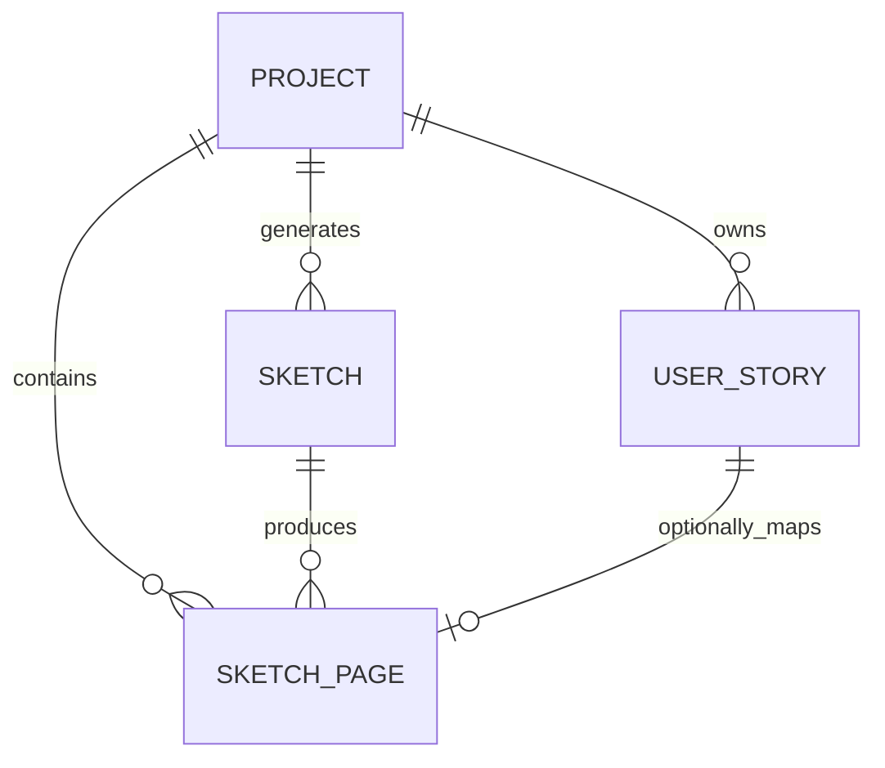
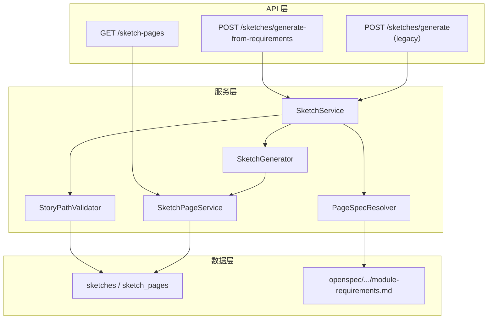

# Sketch 草图模块设计文档

> **文档编号**：DESIGN-SKETCH-001  
> **版本**：v1.0  
> **状态**：Draft  
> **作者**：AI Dev  
> **日期**：2026-06-09  
> **关联需求**：DR-019（PageSpec 草图服务）、DR-021（需求草图可视化）

---

## 1. 引言

### 1.1 目的

本文档定义 Sketch（需求草图）模块的详细设计，包括数据模型、服务分层、API 契约、与详细需求文档的关联机制，以及需求变更时的同步策略。本文档面向后端开发者、前端开发者与需求分析师，作为编码实现与接口联调的基准。

### 1.2 范围

**In-Scope**：
- 从 `module-requirements.md` 解析页面规格并生成 SVG 草图的完整链路
- Sketch 会话与 SketchPage 的生命周期管理
- 用户故事路径与详细需求导航图的断层验证
- 草图与需求文档的版本追踪与同步检测

**Out-of-Scope**：
- WireframeEngine（线框图引擎）的内部设计（见独立文档）
- 高保真原型生成（HTML/Tailwind）
- 手绘风格草图（hand-drawn SVG）

### 1.3 术语

| 术语 | 定义 |
|------|------|
| **PageSpec** | 从 `module-requirements.md` 解析出的结构化页面规格 |
| **ModuleSpec** | 单个 `module-requirements.md` 文件的完整解析结果 |
| **NavGraph** | 由 Mermaid flowchart 解析出的全局页面导航图 |
| **Sketch Session** | 一次草图生成会话，对应 `sketches` 表的一条记录 |
| **Sketch Page** | 单个页面的草图实例，对应 `sketch_pages` 表的一条记录 |
| **Path Gap** | 用户故事暗示的页面跳转路径在详细需求导航图中未定义 |
| **Orphan Page** | 详细需求中定义了但未被任何用户故事覆盖的页面 |

---

## 2. 架构定位

### 2.1 系统分层中的位置

```
┌─────────────────────────────────────────────┐
│  前端应用层                                   │
│  ├── SketchGallery（草图管理）               │
│  └── WireframeCanvas（线框图）               │
├─────────────────────────────────────────────┤
│  API 路由层                                   │
│  ├── /projects/{id}/sketches/*               │
│  └── /projects/{id}/sketch-pages/*           │
├─────────────────────────────────────────────┤
│  服务层                                       │
│  ├── SketchService（CRUD + 生成编排）         │
│  ├── SketchPageService（页面 CRUD）           │
│  ├── PageSpecResolver（需求解析）             │
│  ├── SketchGenerator（SVG 渲染）              │
│  └── StoryPathValidator（路径验证）           │
├─────────────────────────────────────────────┤
│  数据层                                       │
│  ├── sketches / sketch_pages（SQLite）        │
│  └── openspec/changes/*/detailed-requirements/│
│      └── feature-*/module-requirements.md     │
└─────────────────────────────────────────────┘
```

### 2.2 与相邻模块的关系

| 相邻模块 | 关系 | 数据流向 |
|----------|------|----------|
| **详细需求（DR-019/DR-021）** | 上游数据源 | `module-requirements.md` → PageSpecResolver → SketchGenerator |
| **用户故事（US-016）** | 验证层（可选） | `user_stories.page_desc` → StoryPathValidator → 断层报告 |
| **WireframeEngine** | 并行独立模块 | 不直接交互；未来可能共用 PageSpecResolver |
| **产物浏览器（ArtifactViewer）** | 下游消费方 | Sketch 产物可作为 Artifact 被浏览（未来扩展） |

---

## 3. 数据模型

### 3.1 ER 关系



### 3.2 实体定义

#### `sketches` — 草图会话

| 字段 | 类型 | 约束 | 说明 |
|------|------|------|------|
| sketch_id | VARCHAR(36) | PK | 唯一标识 `sketch-{uuid}` |
| project_id | VARCHAR(36) | FK → projects | 所属项目 |
| name | VARCHAR(128) | NOT NULL | 会话名称（自动生成） |
| source_story_ids | TEXT | nullable | 关联用户故事 ID JSON 数组 |
| page_count | INTEGER | nullable | 页面数量（缓存） |
| coverage_percent | INTEGER | nullable | 路径覆盖率（0-100） |
| validation_report | TEXT | nullable | StoryPathValidator 报告 JSON |
| status | VARCHAR(16) | CHECK | `DRAFT\|GENERATING\|GENERATED\|REVIEW_PENDING\|APPROVED\|REJECTED\|ARCHIVED` |
| created_at | DATETIME | DEFAULT CURRENT_TIMESTAMP | |
| updated_at | DATETIME | DEFAULT CURRENT_TIMESTAMP | |

#### `sketch_pages` — 草图页面

| 字段 | 类型 | 约束 | 说明 |
|------|------|------|------|
| page_id | VARCHAR(36) | PK | 唯一标识 `spage-{uuid}` |
| project_id | VARCHAR(36) | FK → projects | 所属项目 |
| story_id | VARCHAR(36) | FK → user_stories, nullable | 关联用户故事（遗留，新数据多为 NULL） |
| page_name | VARCHAR(128) | NOT NULL | 页面名称 |
| page_type | VARCHAR(16) | CHECK | `LIST\|DETAIL\|DASHBOARD\|FORM\|MODAL\|SEARCH\|WIZARD\|UNKNOWN` |
| svg_content | TEXT | nullable | SVG 草图内容 |
| fields_json | TEXT | nullable | 字段定义 JSON 数组 |
| buttons_json | TEXT | nullable | 按钮定义 JSON 数组 |
| nav_targets_json | TEXT | nullable | 跳转目标页面列表 JSON |
| source_module_id | VARCHAR(50) | nullable | 来源模块编号（如 `DR-001`） |
| source_md_path | TEXT | nullable | 来源文件路径 |
| source_file_hash | VARCHAR(64) | nullable | **待实现**：来源文件内容哈希 |
| sync_status | VARCHAR(16) | nullable | **待实现**：`SYNCED\|STALE\|DIRTY` |
| status | VARCHAR(16) | NOT NULL | `DRAFT\|GENERATED\|REVIEW_PENDING\|APPROVED\|REJECTED` |
| sort_order | INTEGER | NOT NULL DEFAULT 0 | 排序 |
| created_at | DATETIME | DEFAULT CURRENT_TIMESTAMP | |
| updated_at | DATETIME | DEFAULT CURRENT_TIMESTAMP | |

### 3.3 数据模型演进说明

**V1（当前已实现）**：
- `source_module_id`、`source_md_path` 已添加
- 草图生成主路径已切换为 `generate_from_requirements()`

**V2（待实现）**：
- 增加 `source_file_hash`、`sync_status` 字段
- 实现需求变更检测与增量同步

---

## 4. 核心服务设计

### 4.1 服务分层



### 4.2 PageSpecResolver

> **实现说明**：PageSpecResolver 以模块级函数实现（见 `backend/app/services/page_spec_resolver.py`），不强制封装为类；因此不作为独立 C4 组件节点出现。

**职责**：将半结构化的 `module-requirements.md` 解析为结构化 `ModuleSpec`。

**输入**：Markdown 文本（文件系统读取）
**输出**：`ModuleSpec`（含 `PageSpec[]` + `NavEdge[]`）

**解析范围**：

| 章节 | 解析内容 | 输出字段 |
|------|----------|----------|
| `### 2.1 页面清单` | 页面名称、URL、职责 | `PageSpec.page_name`, `.url_route`, `.description` |
| `### 3.1 用户输入字段表` | 字段名、类型、必填、校验 | `PageSpec.fields[]` |
| `### 5.1 按钮级交互状态机` | 按钮标签、触发方式、成功结果 | `PageSpec.buttons[]`, `.nav_targets[]` |
| `### 2.4 / 5.2 Mermaid flowchart` | 页面节点、跳转边 | `ModuleSpec.nav_edges[]` |

**关键算法**：
- 页面类型推断：标题关键词加权匹配（标题权重 5×，描述权重 1×）
- 字段归属：按 `所属页面/步骤` 列模糊匹配到最近页面
- Mermaid 解析：支持 `flowchart LR`，节点 ID 前缀 `Pg_`，边标签提取

### 4.3 SketchGenerator

**职责**：将 `PageSpec` 渲染为 SVG 草图。

**渲染策略**：按 `page_type` 分发到专用渲染器

| 页面类型 | 渲染特征 |
|----------|----------|
| `FORM` | 字段标签 + 输入框占位（虚线框）+ 类型标签 + 校验提示 + 按钮 |
| `LIST` | 搜索栏 + 表头 + 数据行占位 + 分页器 |
| `DASHBOARD` | 2×2 指标卡片 + 迷你图表占位 |
| `DETAIL` | 标签-值对布局 |
| `MODAL` | 遮罩层 + 弹窗框 + 字段 + 确认/取消按钮 |
| `WIZARD` | 步骤指示器 + 当前步骤表单 |
| `SEARCH` | 搜索框 + 筛选条件占位 |

**V2 演进方向**：
- 支持 HTML/Tailwind 原型输出（替代 SVG）
- 字段类型决定占位符样式（滑块、单选组、下拉框等）

### 4.4 StoryPathValidator

**职责**：验证用户故事路径与详细需求导航图的一致性。

**验证维度**：

| 检查项 | 算法 | 输出 |
|--------|------|------|
| **缺失边** | 从 `page_desc` 提取相邻页面提及，检查是否在 `NavGraph` 中存在对应边 | `missing_edges[]` |
| **孤立页面** | 统计 `NavGraph` 中所有节点 vs 用户故事提及的页面 | `orphan_pages[]` |
| **覆盖率** | `covered_pages / total_pages × 100%` | `coverage_percent` |

**注意**：缺失页面的检查已降级（仅检查显式引号/书名号包裹的页面名），避免自然语言误报。

---

## 5. API 设计

### 5.1 端点清单

| 方法 | 路径 | 说明 | 状态 |
|------|------|------|------|
| `POST` | `/projects/{id}/sketches/generate-from-requirements` | **主路径**：从详细需求生成草图 | ✅ 已实现 |
| `POST` | `/projects/{id}/sketches/generate` | 兼容路径：从用户故事生成 | ✅ 已实现 |
| `GET` | `/projects/{id}/sketches` | 列出草图会话 | ✅ 已实现 |
| `GET` | `/sketches/{sketch_id}` | 获取单个草图 | ✅ 已实现 |
| `PATCH` | `/sketches/{sketch_id}` | 更新草图 | ✅ 已实现 |
| `DELETE` | `/sketches/{sketch_id}` | 删除草图及页面 | ✅ 已实现 |
| `GET` | `/projects/{id}/sketch-pages` | 列出草图页面 | ✅ 已实现 |
| `GET` | `/sketch-pages/{page_id}` | 获取单个页面 | ✅ 已实现 |
| `PATCH` | `/sketch-pages/{page_id}` | 更新页面 | ✅ 已实现 |
| `DELETE` | `/sketch-pages/{page_id}` | 删除页面 | ✅ 已实现 |
| `GET` | `/projects/{id}/sketch-sync-status` | **待实现**：检查需求-草图同步状态 | ⏳ V2 |
| `POST` | `/projects/{id}/sketches/regenerate` | **待实现**：增量重新生成 | ⏳ V2 |

### 5.2 核心 DTO

```typescript
// SketchResponseDTO（后端返回）
interface Sketch {
  sketch_id: string
  project_id: string
  name: string
  source_story_ids: string | null
  page_count: number | null
  coverage_percent: number | null
  validation_report: string | null  // JSON 字符串
  status: 'DRAFT' | 'GENERATING' | 'GENERATED' | 'REVIEW_PENDING' | 'APPROVED' | 'REJECTED' | 'ARCHIVED'
  created_at: string | null
  updated_at: string | null
}

// SketchPageResponseDTO
interface SketchPage {
  page_id: string
  project_id: string
  story_id: string | null
  page_name: string
  page_type: string
  svg_content: string | null
  fields_json: string | null
  buttons_json: string | null
  nav_targets_json: string | null
  source_module_id: string | null   // DR-001
  source_md_path: string | null
  status: string
  sort_order: number
  created_at: string | null
  updated_at: string | null
}

// 生成请求（新主路径）
interface SketchGenerateFromRequirementsPayload {
  story_ids?: string[] | null   // 可选：用于路径验证
}
```

---

## 6. 与需求文档的关联机制

### 6.1 当前机制（V1）

```
module-requirements.md
    ├── Frontmatter: 模块编号 DR-001
    ├── §2.1 页面清单 → sketch_pages.page_name
    ├── §3.1 字段表 → sketch_pages.fields_json
    ├── §5.1 交互规格 → sketch_pages.buttons_json
    └── §2.4/5.2 Mermaid → sketch_pages.nav_targets_json
         ↓
    sketch_pages.source_module_id = "DR-001"
    sketch_pages.source_md_path = "openspec/.../module-requirements.md"
```

**追溯能力**：
- 页面级：知道每个草图页面来自哪个模块、哪个文件
- 模块级：知道每个模块关联哪些用户故事（`ModuleSpec.related_stories`）

### 6.2 待实现机制（V2）

**需求变更检测**：

```
1. 读取 module-requirements.md → 计算 SHA-256
2. 对比 sketch_pages.source_file_hash
3. 若不一致 → 标记 sync_status = "STALE"
4. 前端调用 GET /sketch-sync-status 获取变更摘要
```

**增量重新生成**：

```
1. 重新解析所有 module-requirements.md → 新 PageSpec 列表
2. 按 (page_name + source_module_id) 与旧页面匹配
3. 分类：
   - CREATE：新页面 → 插入
   - UPDATE：定义变更 → 更新 SVG + 字段 + 按钮
   - KEEP：无变化 → 保留审查状态（APPROVED/REJECTED）
   - DELETE：需求中移除 → 软删除或标记 ARCHIVED
```

---

## 7. 与 Wireframe 模块的关系

### 7.1 核心区别

| 维度 | Sketch | Wireframe |
|------|--------|-----------|
| **定位** | 需求确认工具（给 PM/BA） | 架构设计工具（给架构师） |
| **数据源** | `module-requirements.md`（页面规格） | C4 Mermaid / 领域实体映射 |
| **渲染精度** | 低保真 SVG（占位符级别） | 结构化线框 + 导航关系图 |
| **关注点** | "有哪些页面、什么字段、怎么跳转" | "实体如何映射到页面、导航强度" |

### 7.2 未来整合方向（P2）

```
module-requirements.md
    ├──→ PageSpecResolver ──→ SketchGenerator ──→ 低保真草图（快速确认）
    │                              │
    │                              └── 未来可作为 Wireframe DomainMapper 的输入
    │
    └──→ Wireframe DomainMapper ──→ LayoutPlanner ──→ 精细线框图
```

**短期决策**：保持独立，不合并。Sketch 服务于需求阶段，Wireframe 服务于设计阶段。

---

## 8. 前端设计

### 8.1 页面结构（SketchGallery）

```
┌─────────────────────────────────────────────────────────────┐
│ 需求草图服务    [用户故事] [生成草图] [草图画布] [审查]        │
├─────────────────────────────────────────────────────────────┤
│                                                             │
│  生成草图                                                    │
│  ┌─────────────────────────────────────────────────────┐   │
│  │ [基于用户故事] [基于详细需求] ← 模式切换              │   │
│  │                                                      │   │
│  │ 基于详细需求模式：                                    │   │
│  │ ┌─────────────────────────────────────────────────┐ │   │
│  │ │ 直接从详细需求生成                                │ │   │
│  │ │ 系统扫描 module-requirements.md                  │ │   │
│  │ └─────────────────────────────────────────────────┘ │   │
│  │                                                      │   │
│  │ 可选：勾选用户故事用于路径验证                        │   │
│  │ ☑ US-001 查看列表                                  │   │
│  │ ☐ US-002 创建项目                                  │   │
│  │                                                      │   │
│  │ [从详细需求生成]                                    │   │
│  └─────────────────────────────────────────────────────┘   │
│                                                             │
├─────────────────────────────────────────────────────────────┤
│  草图画布                                                    │
│  ┌────────────┬──────────────────────────────────────────┐ │
│  │ 草图页面(6) │ 项目工作台主页                           │ │
│  │            │ DASHBOARD                                │ │
│  │ ▢ 主页      ├──────────────────────────────────────────┤ │
│  │ ▢ 列表页    │ [SVG 渲染区]                             │ │
│  │ ▢ 详情页    ├──────────────────────────────────────────┤ │
│  │            │ 字段: 3 · 按钮: 2 · 跳转: 列表页, 搜索页  │ │
│  │            │ 来源: DR-001                             │ │
│  ├────────────┴──────────────────────────────────────────┤ │
│  │ 生成会话                                               │ │
│  │ 草图-6个页面（来自详细需求）                           │ │
│  ├────────────────────────────────────────────────────────┤ │
│  │ 路径验证报告                                           │ │
│  │ 覆盖率: 100%                                           │ │
│  │ ✓ 路径完整，无断层                                     │ │
│  └────────────────────────────────────────────────────────┘ │
└─────────────────────────────────────────────────────────────┘
```

### 8.2 状态管理

- `generateMode: 'from-stories' | 'from-requirements'` — 生成模式
- `selectedStoryIds: Set<string>` — 选中的用户故事（两种模式下共用）
- `lastValidationReport: object | null` — 上次生成的验证报告

---

## 9. 质量属性

### 9.1 可测试性

| 测试层 | 覆盖内容 | 文件 |
|--------|----------|------|
| 单元测试 | PageSpecResolver 解析逻辑 | `test_page_spec_resolver.py` |
| 单元测试 | SketchGenerator 渲染输出 | `test_sketch_generator_v2.py` |
| 单元测试 | StoryPathValidator 验证逻辑 | `test_story_path_validator.py` |
| 单元测试 | SketchService CRUD | `test_sketch_service.py` |
| API 测试 | 路由端点 | `test_sketch.py` |
| 集成测试 | 端到端生成流程 | `test_sync7_sketch.py` |

### 9.2 可扩展性

- 新增页面类型：在 `_PAGE_TYPE_KEYWORDS` 和 `_RENDERERS` 中注册即可
- 新增渲染格式：在 `SketchGenerator` 中增加 HTML/Tailwind 渲染器，通过参数切换
- 支持其他需求格式：扩展 `PageSpecResolver` 的解析器即可

### 9.3 可维护性

- **最小变更原则**：`module-requirements.md` 格式变更时，只需调整正则表达式
- **向后兼容**：旧 API `generate_from_stories()` 保留，不破坏现有调用方

---

## 10. 待办事项（Roadmap）

### V1.1（当前已完成）
- [x] 从 `module-requirements.md` 解析页面规格生成草图
- [x] 用户故事路径验证（缺失边、孤立页面检测）
- [x] 前端支持两种生成模式
- [x] 页面级来源追溯（`source_module_id` / `source_md_path`）

### V2（需求变更同步）
- [ ] 数据库增加 `source_file_hash`、`sync_status` 字段
- [ ] 实现 `SketchSyncService.check_sync_status()`
- [ ] 新增 API `GET /sketch-sync-status`
- [ ] 新增 API `POST /sketches/regenerate`（增量更新）
- [ ] 前端页面列表显示同步状态徽章

### V3（渲染升级）
- [ ] 支持 HTML/Tailwind 原型输出
- [ ] 字段类型精确渲染（滑块、单选组、日期选择器等）
- [ ] 交互式预览（点击按钮高亮跳转目标）

### V4（与 Wireframe 整合评估）
- [ ] 评估 PageSpecResolver 作为 Wireframe DomainMapper 输入的可行性
- [ ] 统一页面类型枚举与字段定义 schema

---

## 11. 附录

### 11.1 关键文件路径

| 文件 | 路径 |
|------|------|
| PageSpecResolver | `backend/app/services/page_spec_resolver.py` |
| SketchGenerator | `backend/app/services/sketch_generator.py` |
| StoryPathValidator | `backend/app/services/story_path_validator.py` |
| SketchService | `backend/app/services/sketch_service.py` |
| Sketch API Router | `backend/app/api/v1/sketch.py` |
| SketchGallery 页面 | `frontend/src/pages/SketchGallery/index.tsx` |

### 11.2 参考文档

| 文档 | 路径 |
|------|------|
| 详细需求 DR-019 | `openspec/changes/sdlc-visualizer/detailed-requirements/feature-19-wireframe/module-requirements.md` |
| 详细需求 DR-021 | `openspec/changes/sdlc-visualizer/detailed-requirements/feature-21-pagespec/module-requirements.md` |
| OpenSpec 配置 | `openspec/config.yaml` |
