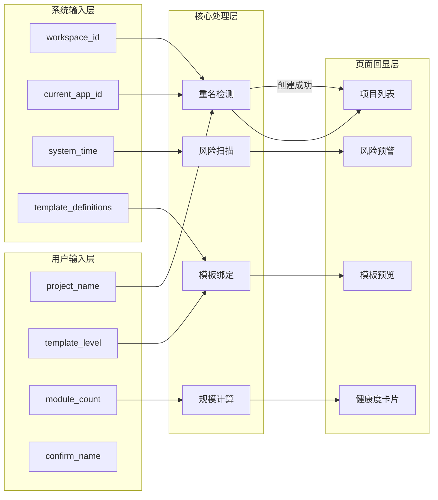
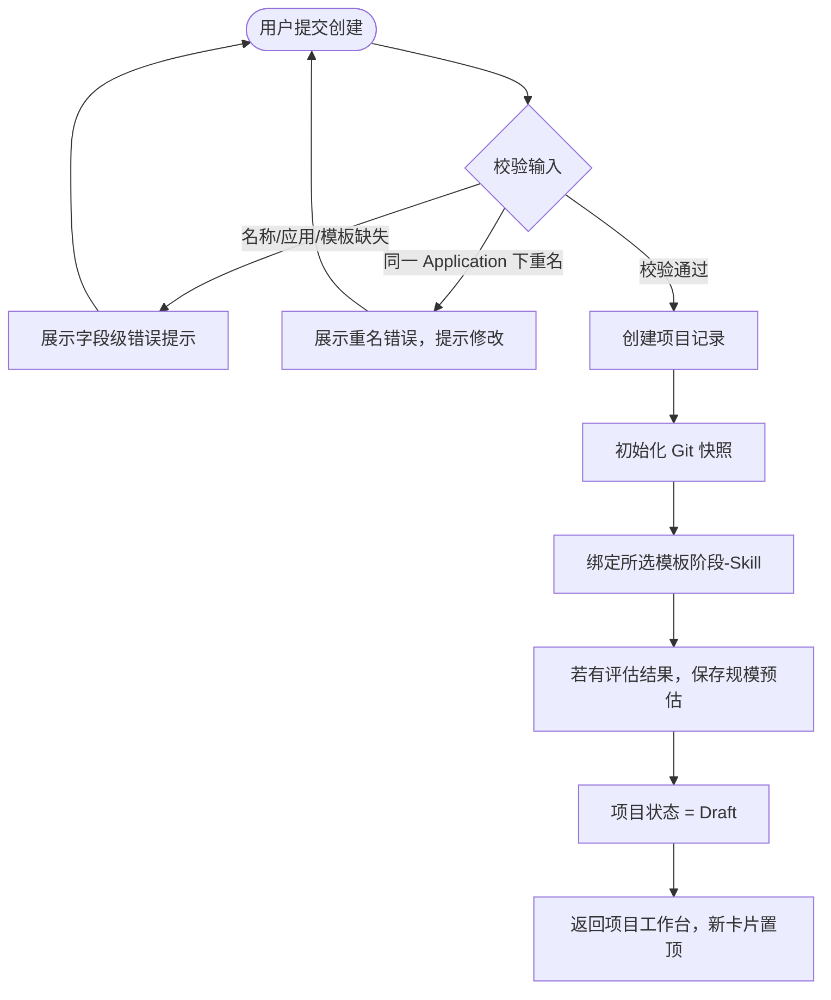
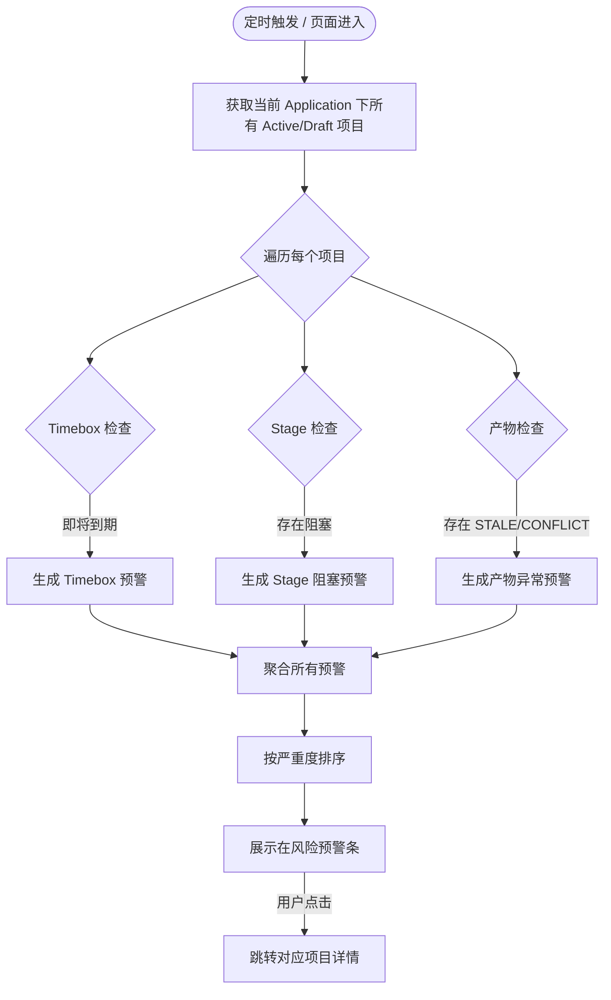
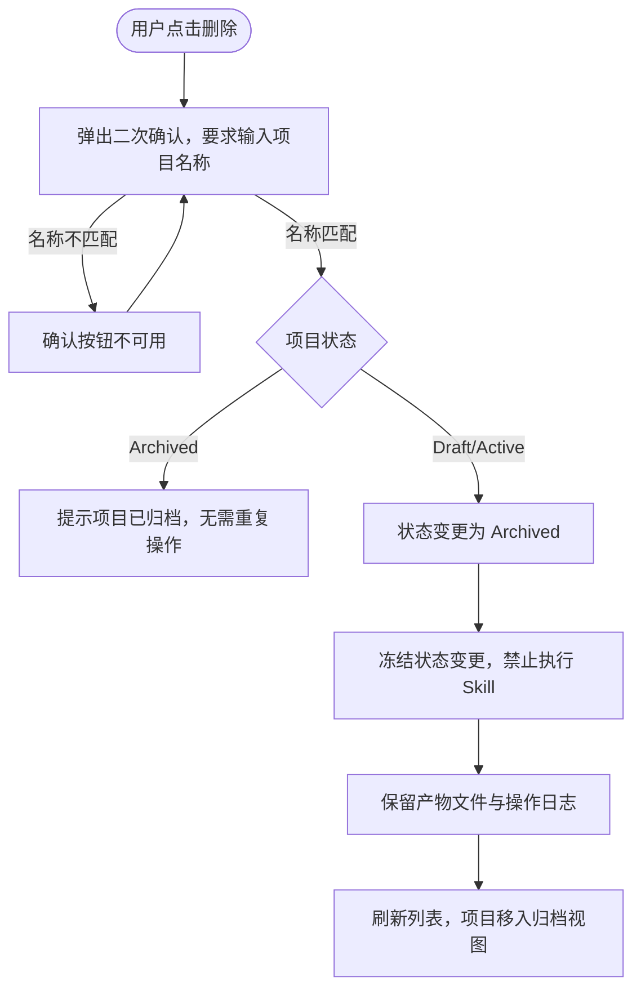
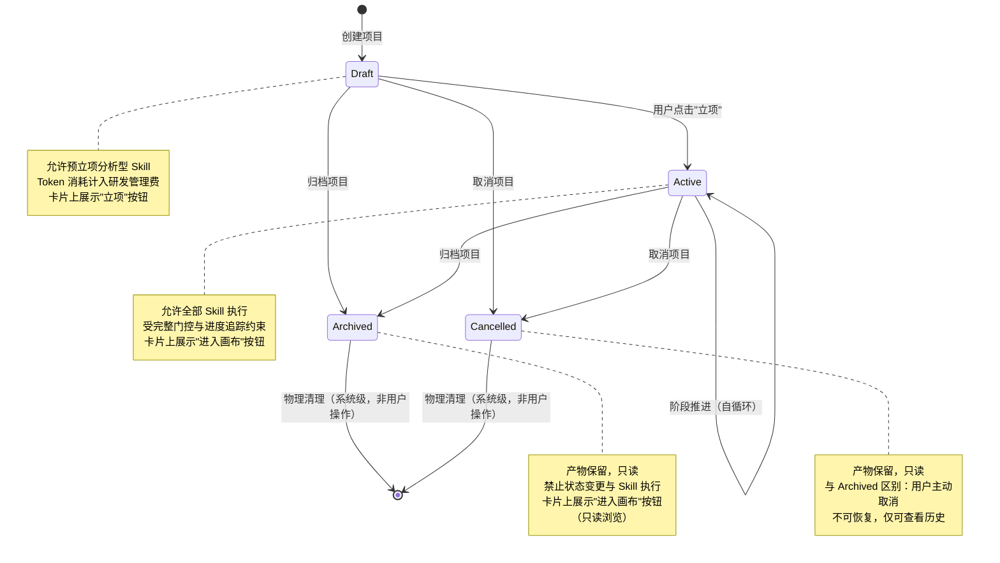
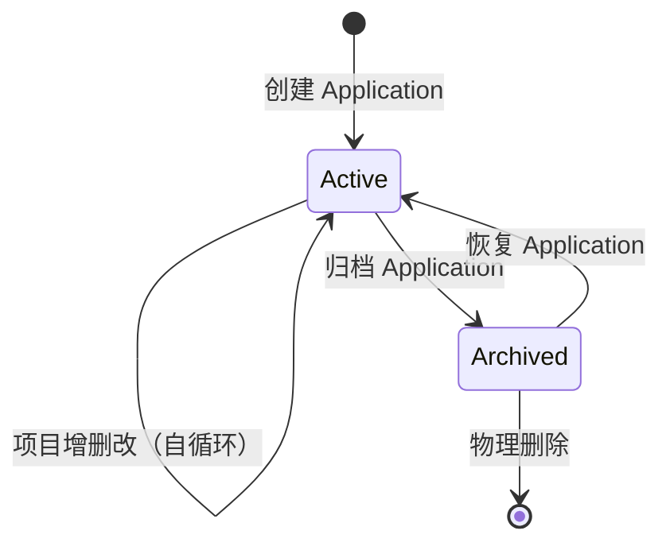
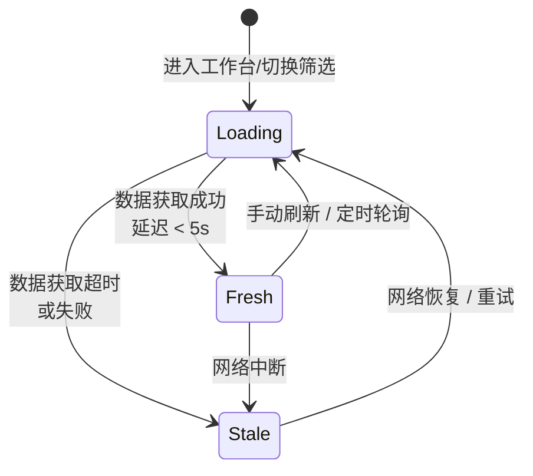
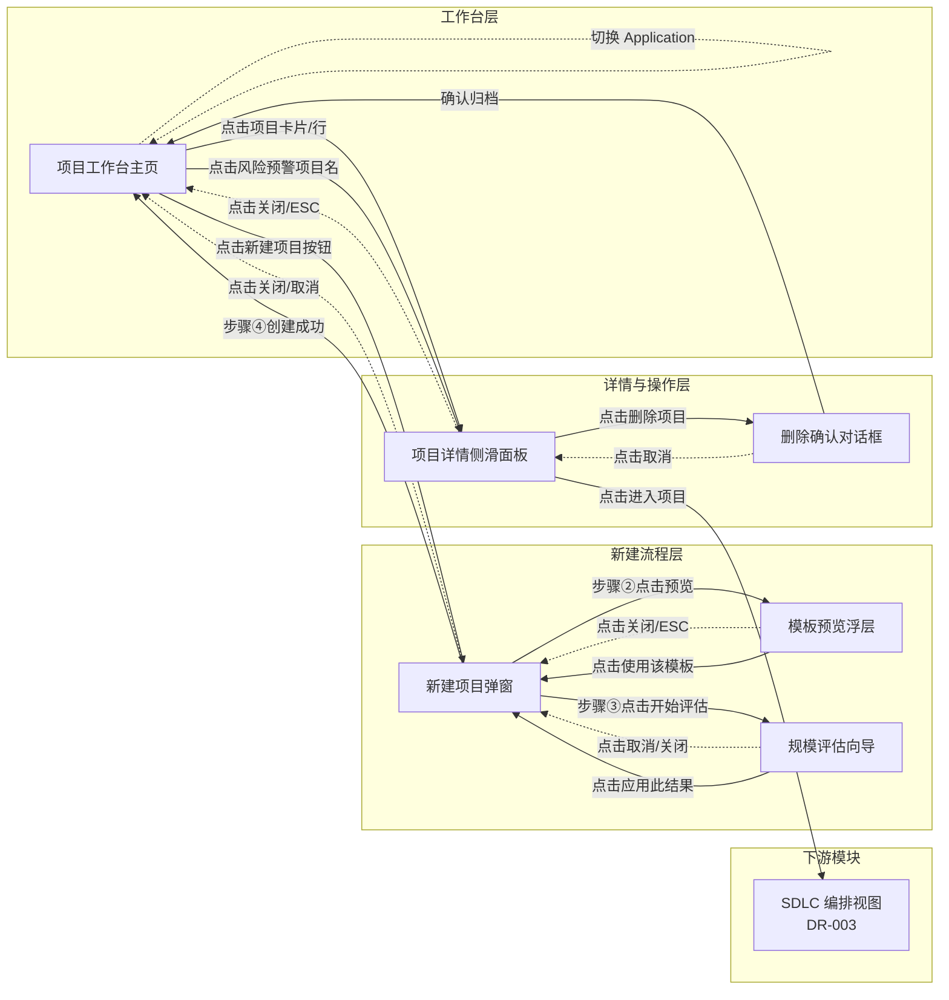

# DR-001：项目工作台（Project Dashboard）模块详细需求

> **模块编号**：DR-001  
> **模块名称**：项目工作台（Project Dashboard）  
> **关联需求**：REQ-P0-001、REQ-P0-002、REQ-P0-022、REQ-P0-023、REQ-P0-016  
> **关联用户故事**：US-001（创建与管理项目）  
> **版本**：v1.0  
> **状态**：Draft

---

## 1. 需求追溯与验收标准

### 1.1 需求追溯表

| 上游需求 ID | 需求简述 | 本模块功能点 | 覆盖优先级 |
|:-----------:|----------|--------------|:----------:|
| REQ-P0-001 | 项目 CRUD | 项目列表展示、新建项目、编辑项目信息、删除项目（软删除） | Must |
| REQ-P0-002 | 模板选择 | 新建项目时的四级模板选择器、模板预览浮层、实时切换预览 | Must |
| REQ-P0-022 | 健康度卡片 | 工作台项目卡片展示进度百分比、当前阶段、风险等级、最近活动 | Must |
| REQ-P0-023 | 风险预警 | Timebox 到期预警提示、Stage 阻塞检测提示、产物异常（STALE/CONFLICT）标记 | Must |
| REQ-P0-016 | 规模评估 | 项目规模评估向导入口、五维度评分展示、三档得分输出 | Should |
| REQ-P0-017 | Timebox 配置 | 各阶段时间预期设置、到期前预警（剩余 20%/10%/0% 节点）、超时后裁剪建议 | Must |

### 1.2 功能范围 IN/OUT 清单

**IN（范围内）**

| # | 功能点 | 说明 |
|:-:|:-------|:-----|
| IN-1 | 项目列表视图 | 网格/列表双模式切换，支持搜索、排序、状态筛选 |
| IN-2 | 新建项目向导 | 分步表单：基本信息 → 模板选择 → 规模评估（可选）→ 确认创建 |
| IN-3 | 项目健康度卡片 | 每个项目以卡片/行形式展示健康度指标 |
| IN-4 | 风险预警面板 | 工作台顶部聚合显示当前 Application 下所有项目的风险预警 |
| IN-5 | 项目详情侧滑 | 展示项目基本信息、阶段进度、关联产物、操作日志 |
| IN-6 | 模板预览 | 在新建流程中可视化展示所选模板的阶段-Skill 绑定关系 |
| IN-7 | 项目软删除 | 删除后项目进入 Archived 态，保留产物，冻结状态变更 |
| IN-8 | 规模评估初估入口 | 在新建流程或项目详情中启动 Triage 评估 |

**OUT（范围外）**

| # | 功能点 | 说明 | 归属模块 |
|:-:|:-------|:-----|:--------:|
| OUT-1 | Skill 执行与编排 | 项目的具体 Skill 执行由执行引擎负责 | DR-003（执行引擎） |
| OUT-2 | Git 快照管理 | Git 快照的 diff、回滚、分支操作 | DR-005（版本管理） |
| OUT-3 | Application 管理 | Application 的创建、删除、配置 | DR-002（应用管理） |
| OUT-4 | Workspace 设置 | 全局工作区配置、主题、快捷键 | DR-007（系统设置） |
| OUT-5 | 通知中心 | 消息推送、邮件/IM 集成 | DR-006（通知中心） |
| OUT-6 | 多用户协作 | 权限、角色、协作编辑 | 二期规划 |

### 1.3 验收标准（AC Taxonomy）

| # | 类型 | 验收标准描述 | 质量分 |
|:--|:----:|:-------------|:------:|
| AC-01 | Behavioral | Given 用户在项目工作台页面 When 点击"新建项目"按钮 Then 弹出新建项目向导弹窗，默认展示第一步"基本信息" | 3 |
| AC-02 | Behavioral | Given 用户填写项目名称、选择 Application 和模板 When 点击"创建项目" Then 系统在 500ms 内完成创建并跳转至新项目的工作台视图，项目状态为 Draft | 3 |
| AC-03 | Behavioral | Given 项目工作台存在多个项目 When 用户在搜索框输入关键词 Then 列表实时过滤并仅展示名称或描述匹配的项目，过滤响应延迟 < 200ms | 3 |
| AC-04 | Behavioral | Given 用户点击某个项目的健康度卡片 When 卡片展开或侧滑面板打开 Then 展示该项目的进度百分比、当前阶段、风险等级和最近活动记录 | 3 |
| AC-05 | Behavioral | Given 用户选择某个四级模板（Trivial/Light/Standard/Deep）When 切换模板选项 Then 模板预览区域实时更新，展示该模板对应的阶段-Skill 绑定可视化图 | 3 |
| AC-06 | Behavioral | Given 项目存在风险（Timebox 即将到期 / Stage 阻塞 / 产物异常）When 用户进入项目工作台 Then 风险预警面板以对应颜色标识（黄/橙/红）展示风险项，并提供跳转入口 | 3 |
| AC-07 | Behavioral | Given 用户点击删除项目按钮 When 确认删除 Then 项目状态变更为 Archived，项目从 Active 列表移除，但保留在"已归档"筛选视图，产物文件不可变更 | 3 |
| AC-08 | Non-behavioral | 项目列表在展示 50 个项目时，首次渲染完成时间 < 1s | 3 |
| AC-09 | Non-behavioral | 健康度卡片数据从状态变更到界面刷新延迟 < 5s | 3 |
| AC-10 | Non-behavioral | 新建项目表单提交后，系统处理完成时间 < 500ms（P95） | 3 |
| AC-11 | Negative | 系统明确不支持在同一个 Application 下创建同名（大小写不敏感）的 Active/Draft 项目，重名时阻止创建并提示 | 3 |
| AC-12 | Negative | 已归档（Archived）的项目不支持执行任何 Skill，界面上不展示"执行"或"启动"类操作入口 | 3 |
| AC-13 | Edge case | Given 用户在新建项目过程中网络中断 When 点击"创建" Then 系统展示网络异常提示，保留已填写的表单数据，提供"重试"按钮，不丢失用户输入 | 3 |
| AC-14 | Edge case | Given 用户连续快速点击"创建项目"按钮 3 次 When 系统正在处理第一次请求 Then 后续点击被防抖忽略，界面上按钮保持 loading 态，不会创建重复项目 | 3 |
| AC-15 | Edge case | Given 项目数量为 0（空状态）When 用户进入工作台 Then 展示空状态插画与"创建你的第一个项目"引导按钮，搜索与筛选控件自动隐藏 | 2 |
| AC-16 | Dependency | Application 服务必须可用，能够返回当前 Workspace 下的 Application 列表供选择 | 3 |
| AC-17 | Dependency | 模板服务必须可用，能够返回四级模板（Trivial/Light/Standard/Deep）的定义数据 | 3 |
| AC-18 | Dependency | 规模评估服务（project-size-estimate）必须可用，才能在新建流程中调用五维度评估 | 2 |
| AC-19 | Behavioral | Given 项目处于 Active 态，When 用户进入项目设置 → Timebox 配置页，Then 系统展示基于规模评估生成的各阶段时间预期初稿，用户可逐阶段调整（最小粒度 0.5 天） | 3 |
| AC-20 | Behavioral | Given 项目已设置 Timebox 且剩余时间 ≤ 20%（如 14 天中剩余 2.8 天），When 系统定时扫描（每小时），Then 在项目工作台风险预警面板展示黄色预警卡片，提示"Timebox 即将到期"，并提供"查看详情"跳转入口 | 3 |
| AC-21 | Behavioral | Given 项目 Timebox 已超时，When 系统扫描发现超时，Then 风险预警面板升级为红色预警，提示"Timebox 已超时"，并提供"裁剪需求"或"延长时间"两个操作入口 | 3 |
| AC-22 | Edge case | Given 用户调整 Timebox 后某阶段时间为 0 天，When 用户尝试保存，Then 系统提示"该阶段时间不可为 0，建议至少 0.5 天或跳过该阶段"，阻止保存 | 2 |

### 1.4 假设注册表

| # | 假设描述 | 影响范围 | 验证方式 |
|:-:|:---------|:---------|:---------|
| ASM-01 | 用户在单个 Application 下的项目数量不超过 200 个 | 列表性能、分页策略 | 上线后埋点统计 |
| ASM-02 | 用户在同一时间仅操作一个 Workspace | 数据隔离、状态管理 | 产品决策确认 |
| ASM-03 | 模板定义由系统管理员/框架层维护，用户不可自定义模板 | 模板选择器设计 | PRD 确认 |
| ASM-04 | 风险预警规则在系统级预置，MVP 阶段用户不可自定义阈值 | 预警面板交互 | PRD 确认 |
| ASM-05 | 规模评估的 Triage 结果不要求用户必须确认，可作为系统建议 | 新建流程步骤设计 | 用户访谈 |

---

## 2. 原型与页面结构

### 2.1 页面清单

| 页面名称 | URL/入口 | 职责 |
|:---------|:---------|:-----|
| 项目工作台主页 | `/projects` | 项目列表、健康度卡片、风险预警、全局操作入口；项目卡片上 Draft 状态展示"立项"按钮，Active/Archived 状态展示"进入画布"按钮（导航至 `/canvas/{projectId}`） |
| 新建项目弹窗 | 工作台主页 → 点击"+ 新建项目" | 分步向导：基本信息 → 模板选择 → 规模评估（可选）→ 确认；未填写 project_id 时后端自动生成 UUID |
| 项目详情侧滑面板 | 工作台主页 → 点击项目卡片/行 | 展示项目元数据、阶段进度、产物列表、操作日志 |
| 模板预览浮层 | 新建项目弹窗 → 选择模板后 | 展示所选模板的阶段-Skill 绑定可视化 |
| 规模评估向导 | 新建项目弹窗 → 点击"评估规模" | 五维度评分输入与三档结果展示 |
| 删除确认对话框 | 项目详情侧滑 → 点击"删除" | 二次确认，说明软删除后果 |

### 2.2 页面布局结构

#### 页面 A：项目工作台主页（Pg_Dashboard）

**顶部全局栏**
- 左侧：当前 Application 名称与下拉切换器
- 中间：页面标题"项目工作台"
- 右侧：全局搜索框（按项目名称/描述搜索）、视图切换按钮（网格/列表）、"新建项目"主按钮

**风险预警条（可折叠）**
- 位于顶部全局栏下方，当有未处理风险时自动展开
- 左侧：风险统计徽章（警告数/严重数）
- 中间：横向滚动或堆叠展示前 3 条风险摘要（项目名 + 风险类型 + 简短描述）
- 右侧："查看全部"按钮
- 背景色根据最高风险等级动态变化（黄/橙/红）

**筛选与排序栏**
- 左侧：状态筛选标签组（全部 / Draft / Active / Archived），支持多选
- 中间：排序下拉框（最近更新 / 创建时间 / 名称 A-Z / 风险等级）
- 右侧：项目数量统计（共 N 个项目）

**项目内容区**

**网格模式（默认）**：
- 响应式网格布局，每行 3-4 张卡片
- 每张卡片包含：
  - 卡片头部：项目名称（单行截断）、状态标签（Draft/Active/Archived）、更多操作下拉菜单（编辑 / 删除 / 查看详情）
  - 卡片中部：项目描述（最多两行截断）、所属 Application 标签
  - 健康度区：环形/条形进度指示器、当前阶段名称
  - 风险区：若有风险，展示对应图标与简要文案
  - 卡片底部：最近活动时间戳、关联产物数量

**列表模式**：
- 表头：项目名称、状态、阶段、进度、风险、最近活动、操作
- 每行展示一个项目，操作列含"查看"和"更多"按钮

**空状态**：
- 居中展示插画、标题"还没有项目"、副标题"创建项目以开始管理你的软件生命周期"、"新建项目"引导按钮

#### 页面 B：新建项目弹窗（Pg_NewProjectModal）

**弹窗头部**
- 标题："新建项目"
- 关闭按钮（右上角）
- 步骤指示器：① 基本信息 → ② 模板选择 → ③ 规模评估（可选）→ ④ 确认创建

**步骤 ①：基本信息**
- 项目名称输入框（带字符计数器，最大 64 字符）
- 项目描述文本域（可选，最大 256 字符）
- Application 选择器（下拉框，默认当前 Application，可切换）
- "下一步"按钮

**步骤 ②：模板选择**
- 四级模板卡片组横向排列（Trivial / Light / Standard / Deep）
- 每个模板卡片展示：模板名称、一句话描述、预估阶段数、预估 Skill 数
- 选中模板后高亮，下方展开"模板预览"区域
- "上一步"和"下一步"按钮（下一步在选中模板后方可点击）

**步骤 ③：规模评估（可选步骤）**
- 说明文案："为获得更精准的项目规划建议，可进行一次快速规模评估"
- "开始评估"按钮（点击后跳转至规模评估向导子页面）
- "跳过"链接（直接进入步骤 ④）

**步骤 ④：确认创建**
- 信息汇总卡片：项目名称、Application、所选模板、规模评估结果（若执行）
- "确认创建"主按钮和"返回修改"链接

#### 页面 C：项目详情侧滑面板（Pg_ProjectDetailDrawer）

**面板头部**
- 项目名称与状态标签
- 关闭按钮

**标签页导航**
- 概览 / 阶段进度 / 产物 / 操作日志

**概览标签**
- 基本信息区：描述、创建时间、最近更新时间、模板名称
- 健康度区：大字号进度百分比、当前阶段、风险等级徽章
- 快速操作区："进入项目"按钮、"编辑信息"按钮、"删除项目"按钮（Draft/Active 态）/ "恢复"按钮（Archived 态）

**阶段进度标签**
- 垂直时间线展示 SDLC 各阶段状态（未开始 / 进行中 / 已完成 / 阻塞）
- 每个阶段展示阶段名、计划时间、实际时间、产物数量

**产物标签**
- 按阶段分组展示产物文件列表
- 每个产物展示：文件名、类型、最后修改时间、状态（正常 / STALE / CONFLICT）

**操作日志标签**
- 时间倒序展示项目级操作记录：时间、操作类型、操作人（系统/用户）、结果

#### 页面 D：模板预览浮层（Pg_TemplatePreviewModal）

**浮层头部**
- 模板名称与级别标签
- 关闭按钮

**预览主体**
- 纵向流程图展示 SDLC 阶段（需求探索 → 概要需求 → 详细需求 → 概要设计 → ...）
- 每个阶段节点展开后展示绑定的 Skill 列表（Skill 名称、触发关键词简述）
- 阶段节点颜色区分：通用阶段（蓝）、可裁剪阶段（灰，仅 Light/Trivial 不展示）

**浮层底部**
- "使用该模板"按钮（若从新建流程进入则展示，否则隐藏）

#### 页面 E：规模评估向导（Pg_SizeEstimateWizard）

**向导头部**
- 标题："项目规模评估"
- 子标题："基于五个维度估算项目复杂度"

**评估表单**
- 模块数：滑块（1-20+）
- 接口数：滑块（0-50+）
- 页面数：滑块（0-30+）
- 技术复杂度：单选组（低 / 中 / 高）
- 风险等级：单选组（低 / 中 / 高）

**结果展示区**
- "计算结果"按钮点击后展示：
- 三档得分：乐观（绿色）、预期（蓝色）、保守（橙色）
- 等级判定徽章（S / M / L / XL）
- 建议裁剪或追加的 Skill 提示

**向导底部**
- "应用此结果"和"重新评估"按钮

#### 页面 F：删除确认对话框（Pg_DeleteConfirmDialog）

**对话框主体**
- 警示图标
- 标题："确认删除项目？"
- 说明文案："项目将被归档，产物保留但不可修改。此操作可在已归档列表中恢复。"
- 项目名称二次确认输入框（输入完整项目名称后确认按钮才可用）

**对话框底部**
- "取消"按钮和"确认归档"危险按钮

### 2.3 关键交互流程描述

**流程 1：新建完整项目**
1. 用户在项目工作台点击"新建项目"按钮
2. 弹出新建向导，默认停留在步骤 ①
3. 用户填写名称、描述，选择 Application
4. 点击"下一步"进入步骤 ②，选择四级模板之一
5. 模板选择后，用户可点击"预览模板"查看完整阶段-Skill 绑定（打开模板预览浮层）
6. 用户点击"下一步"进入步骤 ③，可选择进行规模评估或跳过
7. 若选择评估，跳转至规模评估向导，完成评分后返回步骤 ③ 并带入结果
8. 用户点击"下一步"进入步骤 ④，确认信息无误后点击"确认创建"
9. 系统创建项目，弹窗关闭，新项目卡片出现在列表首位，状态为 Draft

**流程 2：查看项目详情与处理风险**
1. 用户在项目列表点击某项目卡片
2. 右侧滑出项目详情面板，默认展示"概览"标签
3. 用户可切换至"阶段进度"查看各阶段状态
4. 若项目存在风险，概览标签的风险等级徽章为红色/橙色，点击可展开风险详情
5. 用户点击"进入项目"可跳转至该项目的 SDLC 编排视图（DR-003 模块）

**流程 3：归档项目**
1. 用户在项目详情面板或卡片更多菜单中选择"删除项目"
2. 弹出删除确认对话框，要求输入项目名称
3. 用户输入正确名称后，"确认归档"按钮可用
4. 点击确认后，项目状态变更为 Archived
5. 列表自动刷新，该项目从默认视图中移除
6. 用户可通过筛选"Archived"状态找回该项目

### 2.4 页面跳转图

```mermaid
flowchart LR
    subgraph SDLC_Visualizer["项目工作台域"]
        Pg_Dashboard["项目工作台主页<br>/app/{appId}/dashboard"]
        Pg_NewProjectModal["新建项目弹窗"]
        Pg_ProjectDetailDrawer["项目详情侧滑面板"]
        Pg_TemplatePreviewModal["模板预览浮层"]
        Pg_SizeEstimateWizard["规模评估向导"]
        Pg_DeleteConfirmDialog["删除确认对话框"]
    end

    Pg_Dashboard -->|点击"新建项目"| Pg_NewProjectModal
    Pg_Dashboard -->|点击项目卡片| Pg_ProjectDetailDrawer
    Pg_Dashboard -->|点击风险预警项| Pg_ProjectDetailDrawer

    Pg_NewProjectModal -->|步骤②点击"预览模板"| Pg_TemplatePreviewModal
    Pg_TemplatePreviewModal -->|点击"使用该模板"| Pg_NewProjectModal
    Pg_TemplatePreviewModal -.->|点击关闭| Pg_NewProjectModal
    Pg_NewProjectModal -->|步骤③点击"开始评估"| Pg_SizeEstimateWizard
    Pg_SizeEstimateWizard -->|点击"应用此结果"| Pg_NewProjectModal
    Pg_SizeEstimateWizard -.->|点击"取消"| Pg_NewProjectModal
    Pg_NewProjectModal -.->|点击关闭/取消| Pg_Dashboard
    Pg_NewProjectModal -->|创建成功| Pg_Dashboard

    Pg_ProjectDetailDrawer -->|点击"删除项目"| Pg_DeleteConfirmDialog
    Pg_DeleteConfirmDialog -.->|点击"取消"| Pg_ProjectDetailDrawer
    Pg_DeleteConfirmDialog -->|确认归档| Pg_Dashboard
    Pg_ProjectDetailDrawer -.->|点击关闭| Pg_Dashboard
    Pg_ProjectDetailDrawer -->|点击"进入项目"| Pg_SDCLCanvas["SDLC 编排视图<br>DR-003"]

    Pg_Dashboard -.->|切换 Application| Pg_Dashboard
```

---

## 3. 输入输出字段

### 3.1 用户输入字段表

| 字段名 | 所属页面/步骤 | 类型 | 必填 | 校验规则 | 示例值 |
|:-------|:-------------|:----:|:----:|:---------|:-------|
| project_name | 新建项目-步骤① | 文本 | 是 | 1-64 字符；同一 Application 下 Active/Draft 状态项目名称不可重复（大小写不敏感）；首尾空格自动去除；禁止纯特殊字符 | "电商订单系统重构" |
| project_description | 新建项目-步骤① | 多行文本 | 否 | 0-256 字符 | "基于 React 19 的前端重构项目" |
| application_id | 新建项目-步骤① | 单选 | 是 | 必须从当前 Workspace 下存在的 Application 中选择 | "app-2024-a1b2" |
| template_level | 新建项目-步骤② | 单选 | 是 | 枚举：Trivial / Light / Standard / Deep | "Standard" |
| module_count | 规模评估向导 | 整数 | 是 | 范围 1-50 | 8 |
| interface_count | 规模评估向导 | 整数 | 是 | 范围 0-100 | 24 |
| page_count | 规模评估向导 | 整数 | 是 | 范围 0-50 | 12 |
| tech_complexity | 规模评估向导 | 单选 | 是 | 枚举：Low / Medium / High | "Medium" |
| risk_level | 规模评估向导 | 单选 | 是 | 枚举：Low / Medium / High | "Low" |
| confirm_name | 删除确认对话框 | 文本 | 是 | 必须与待删除项目名称完全一致（大小写敏感） | "电商订单系统重构" |
| search_keyword | 工作台主页 | 文本 | 否 | 0-64 字符；实时防抖搜索 | "订单" |
| status_filter | 工作台主页 | 多选 | 否 | 枚举：Draft / Active / Archived；可多选，默认全选 | ["Draft", "Active"] |
| sort_by | 工作台主页 | 单选 | 否 | 枚举：updated_at / created_at / name / risk_level；默认 updated_at desc | "updated_at" |
| view_mode | 工作台主页 | 单选 | 否 | 枚举：grid / list；默认 grid | "grid" |

### 3.2 系统输入字段表

| 字段名 | 来源 | 类型 | 说明 |
|:-------|:-----|:----:|:-----|
| workspace_id | 全局状态 | 文本 | 当前激活的 Workspace 标识，决定数据隔离边界 |
| current_app_id | 全局状态 | 文本 | 当前选中的 Application 标识，项目列表默认过滤条件 |
| user_session | 全局状态 | 对象 | 当前用户会话标识（MVP 为单机本地会话） |
| system_time | 系统时钟 | 时间 | 用于计算 Timebox 到期预警、最近活动相对时间 |
| template_definitions | 模板服务 | 数组 | 四级模板的完整定义数据，驱动模板选择器与预览 |
| risk_rules | 规则引擎 | 数组 | 风险检测规则配置，驱动预警面板与异常标记 |

### 3.3 页面回显字段表

| 字段名 | 所属页面 | 类型 | 说明 |
|:-------|:---------|:----:|:-----|
| project_id | 项目列表/卡片/详情 | 文本 | 项目唯一标识 |
| project_name | 项目列表/卡片/详情 | 文本 | 项目名称 |
| project_description | 项目列表/卡片/详情 | 文本 | 项目描述 |
| project_status | 项目列表/卡片/详情 | 枚举 | Draft / Active / Archived |
| current_stage | 健康度卡片/详情 | 文本 | 当前所处 SDLC 阶段名称 |
| progress_percent | 健康度卡片/详情 | 整数 | 0-100 的进度百分比 |
| risk_level | 健康度卡片/详情 | 枚举 | None / Low / Medium / High |
| last_activity_at | 健康度卡片/详情 | 时间 | 最近活动时间戳，界面展示相对时间（如"2 小时前"） |
| last_activity_type | 健康度卡片/详情 | 文本 | 最近活动类型（如"阶段完成"、"产物更新"） |
| artifact_count | 健康度卡片 | 整数 | 项目关联产物总数 |
| template_name | 项目详情 | 文本 | 所选模板名称 |
| created_at | 项目详情 | 时间 | 项目创建时间 |
| updated_at | 项目详情 | 时间 | 项目最近更新时间 |
| timebox_end_at | 风险预警 | 时间 | Timebox 结束时间 |
| blocked_stage_name | 风险预警 | 文本 | 被阻塞的阶段名称 |
| artifact_status_summary | 风险预警/产物 | 对象 | 各状态产物数量统计（正常 / STALE / CONFLICT） |
| size_estimate_result | 项目详情 | 对象 | 规模评估三档得分与等级判定结果 |

### 3.4 接口响应字段表（页面消费视角）

> 注：以下为页面消费的数据视角，非 API 端点规格。

| 字段名 | 消费页面 | 类型 | 说明 |
|:-------|:---------|:----:|:-----|
| projects | 项目工作台主页 | 数组 | 项目列表数据，每项包含 project_id / name / status / progress_percent / risk_level / last_activity_at / artifact_count |
| total_count | 项目工作台主页 | 整数 | 符合筛选条件的项目总数 |
| application_list | 新建项目-步骤① | 数组 | 可选 Application 列表，每项含 app_id / name |
| template_detail | 模板预览浮层 | 对象 | 选中模板的完整阶段-Skill 绑定数据 |
| project_detail | 项目详情侧滑 | 对象 | 单个项目的完整元数据、阶段进度、产物列表、操作日志 |
| risk_alerts | 风险预警条 | 数组 | 当前 Application 下所有活跃风险项，每项含 project_id / project_name / risk_type / severity / message |
| estimate_result | 规模评估向导 | 对象 | 乐观得分 / 预期得分 / 保守得分 / 等级判定 / 建议 |

### 3.5 关键数据流转图



---

## 4. 业务逻辑与状态机

### 4.1 核心业务流程

#### 流程 1：创建项目



#### 流程 2：风险扫描与预警



#### 流程 3：软删除与归档



### 4.2 业务规则映射

| 规则 ID | 规则描述 | 在本模块中的映射位置 | 违反表现 |
|:--------|:---------|:---------------------|:---------|
| BR-001 | 只有 Draft/Active 状态项目可执行 Skill | 项目详情侧滑面板：Archived 项目不展示"进入项目"或"执行 Skill"按钮；项目卡片上 Archived 状态无快速操作入口 | 用户无法对 Archived 项目发起任何 Skill 执行动作 |
| BR-003 | Draft 态仅允许预立项分析型 Skill | 项目详情侧滑面板：Draft 项目的"阶段进度"中，仅"需求探索"、"概要需求"阶段展示"启动"按钮，后续阶段按钮置灰并提示"项目未激活" | 用户无法在 Draft 项目下启动设计或编码类 Skill |
| BR-013 | 项目取消后保留产物，冻结状态变更 | 软删除流程：Archived 项目的产物标签仍可查看所有产物，但显示"已归档，不可编辑"水印；状态字段不可再变更 | 产物可浏览但不可修改，状态锁死为 Archived |
| BR-015 | Draft 态 Token 消耗计入 Application 级研发管理费 | 项目详情侧滑的操作日志标签：Draft 项目执行预立项分析型 Skill 的操作记录，标注"计入研发管理费"标识 | 用户在操作日志中可见 Token 消耗归属 |

### 4.3 状态机

#### 项目生命周期状态机



#### Application 状态（与本模块关联视角）



#### 健康度卡片数据状态



### 4.4 异常处理策略

| 异常场景 | 触发时机 | 用户感知 | 系统行为 | 恢复策略 |
|:---------|:---------|:---------|:---------|:---------|
| 创建项目重名 | 提交创建表单时 | 表单项目名称字段下方红色错误提示："该 Application 下已存在同名项目，请更换名称" | 终止创建，不生成任何数据 | 用户修改名称后重新提交 |
| 网络中断（创建中） | 点击"确认创建"后 | 弹窗顶部全局错误条："网络异常，请检查连接后重试"；按钮恢复可点击 | 保留表单状态，请求失败不进入重试队列 | 用户点击"重试"重新提交 |
| 模板服务不可用 | 打开新建向导步骤②时 | 模板选择区域展示骨架屏 3s 后转为错误状态："模板加载失败"+"重试"按钮 | 记录错误日志，等待服务恢复 | 用户点击"重试"或返回后重新进入 |
| 规模评估服务不可用 | 点击"开始评估"时 | 评估页面展示"评估服务暂时不可用，可跳过此步骤" | 提供跳过选项，不影响项目创建主流程 | 用户跳过或稍后重试 |
| 项目列表加载失败 | 进入工作台时 | 全局错误占位页："项目列表加载失败"+"刷新"按钮；保留顶部导航可用 | 缓存上一次成功数据（如有），标记为 Stale | 用户点击"刷新"重新加载 |
| 健康度数据超时 | 卡片数据轮询时 | 卡片右上角展示"数据更新延迟"警告图标，hover 显示"数据可能不是最新" | 后台继续尝试获取，最多重试 3 次 | 自动恢复或用户手动刷新 |
| 删除确认名称不匹配 | 输入项目名称时 | 输入框实时校验，不一致时确认按钮置灰，下方提示"请输入正确的项目名称以确认" | 禁止提交删除请求 | 用户修正输入 |
| 快速重复点击创建 | 连续点击确认按钮 | 按钮立即进入 loading 态并禁用，后续点击无响应 | 防抖处理，仅处理第一次有效请求 | 等待首次请求完成 |

---

## 5. 交互规格

### 5.1 按钮级交互状态机

#### 页面：项目工作台主页（Pg_Dashboard）

##### 元素：新建项目按钮（#btn-new-project）

| 属性 | 说明 |
|:-----|:-----|
| 触发方式 | click |
| 前置条件 | 当前 Application 处于 Active 状态；用户具有项目创建权限（MVP 默认有） |
| 立即反馈 | 按钮短暂缩放动效（100ms），随后弹出新建项目弹窗，弹窗背景遮罩渐显 |
| 成功结果 | 新建项目弹窗（Pg_NewProjectModal）正常加载，步骤指示器定位到步骤① |
| 失败结果 | 若弹窗加载异常（如模态框组件错误），按钮恢复可点击，页面顶部展示 toast："操作失败，请刷新页面重试" |
| 异常分支 | ① 弹窗打开时按 ESC → 弹窗关闭；② 点击遮罩层 → 弹窗关闭，已填写的表单数据不保留（MVP 简化处理） |
| 埋点事件 | `project_new_click`，携带参数：`{source: 'dashboard', app_id: string, timestamp: ISO8601}` |

##### 元素：视图切换按钮组（#btn-view-grid / #btn-view-list）

| 属性 | 说明 |
|:-----|:-----|
| 触发方式 | click |
| 前置条件 | 项目列表非空 |
| 立即反馈 | 被点击的按钮高亮（主色调背景），另一个按钮置灰；内容区以淡入淡出动画切换布局 |
| 成功结果 | 列表以新视图模式展示，用户偏好保存至本地存储，下次进入默认使用上次选择 |
| 失败结果 | 无（纯前端状态切换） |
| 异常分支 | 列表为空时两个按钮均禁用，hover 提示"无项目可展示" |
| 埋点事件 | `project_view_switch`，携带参数：`{view_mode: 'grid' | 'list', app_id: string}` |

##### 元素：搜索框（#input-project-search）

| 属性 | 说明 |
|:-----|:-----|
| 触发方式 | input（实时）+ Enter（强制） |
| 前置条件 | 项目列表非空 |
| 立即反馈 | 输入时显示清除按钮（当内容非空）；输入停止 300ms 后触发搜索，列表区域展示骨架屏 |
| 成功结果 | 列表过滤展示匹配项目；无匹配时展示空搜索结果状态"未找到匹配项目" |
| 失败结果 | 搜索请求异常时，列表保持上一次成功结果，顶部展示 toast："搜索失败，请重试" |
| 异常分支 | ① 输入超过 64 字符禁止继续输入；② 特殊字符仅允许常规中英文、数字、空格、横线、下划线 |
| 埋点事件 | `project_search`，携带参数：`{keyword_length: number, result_count: number, app_id: string}`（仅在 Enter 或防抖触发后上报） |

##### 元素：项目卡片-更多操作下拉菜单（#btn-more-{projectId}）

| 属性 | 说明 |
|:-----|:-----|
| 触发方式 | click |
| 前置条件 | 卡片对应项目存在且可见 |
| 立即反馈 | 下拉菜单展开，菜单项：查看详情 / 编辑信息 / 删除项目（Archived 项目仅展示"查看详情"和"恢复"） |
| 成功结果 | 选择对应菜单项后执行相应操作 |
| 失败结果 | 菜单展开失败时，按钮恢复，无额外反馈 |
| 异常分支 | ① 点击菜单外部区域 → 菜单收起；② 项目状态在菜单展开期间变化 → 菜单自动刷新选项 |
| 埋点事件 | `project_more_menu_open`，携带参数：`{project_id: string, project_status: string}`；菜单项点击单独上报：`project_action_select`，携带参数：`{action: 'view' | 'edit' | 'delete' | 'restore', project_id: string}` |

##### 元素：风险预警条-查看全部按钮（#btn-risk-view-all）

| 属性 | 说明 |
|:-----|:-----|
| 触发方式 | click |
| 前置条件 | 风险预警条存在至少 1 条风险 |
| 立即反馈 | 按钮点击动效 |
| 成功结果 | 项目列表自动切换筛选条件：仅展示存在风险的项目，并按风险严重度降序排列 |
| 失败结果 | 无 |
| 异常分支 | 点击后风险列表为空（风险刚被清除）→ 展示"暂无风险项目"提示，提供"返回全部"按钮 |
| 埋点事件 | `risk_view_all_click`，携带参数：`{risk_count: number, app_id: string}` |

---

#### 页面：新建项目弹窗（Pg_NewProjectModal）

##### 元素：步骤①-下一步按钮（#btn-step1-next）

| 属性 | 说明 |
|:-----|:-----|
| 触发方式 | click |
| 前置条件 | project_name 非空且通过校验；application_id 已选择 |
| 立即反馈 | 按钮进入 loading 态（若执行异步校验如重名检测），步骤指示器步骤②高亮，内容区横向滑动切换至步骤② |
| 成功结果 | 进入步骤②模板选择；若重名检测通过则正常推进，不通过则当前步骤①展示错误提示 |
| 失败结果 | 异步校验失败时按钮恢复，项目名称字段下方展示"该名称已被占用" |
| 异常分支 | 网络中断导致重名检测失败 → 提示"网络异常，无法验证名称可用性"，允许用户"重试"或"继续"（后续服务端再校验） |
| 埋点事件 | `project_create_step1_next`，携带参数：`{app_id: string, has_description: boolean}` |

##### 元素：步骤②-模板卡片（#card-template-{level}）

| 属性 | 说明 |
|:-----|:-----|
| 触发方式 | click |
| 前置条件 | 模板数据已加载成功 |
| 立即反馈 | 卡片边框高亮（主色调），其他卡片去高亮；卡片下方展开模板预览摘要（阶段数、Skill 数） |
| 成功结果 | "下一步"按钮从禁用变为可用；模板预览区域展示该模板的阶段-Skill 绑定缩略图 |
| 失败结果 | 无 |
| 异常分支 | 连续快速切换不同模板 → 每次点击正常响应，预览区域内容替换 |
| 埋点事件 | `project_template_select`，携带参数：`{template_level: string, source: 'create_wizard', app_id: string}` |

##### 元素：步骤②-预览模板按钮（#btn-preview-template）

| 属性 | 说明 |
|:-----|:-----|
| 触发方式 | click |
| 前置条件 | 已选择某个模板 |
| 立即反馈 | 按钮进入 loading 态，打开模板预览浮层（Pg_TemplatePreviewModal） |
| 成功结果 | 浮层正常加载，展示完整阶段-Skill 绑定可视化图 |
| 失败结果 | 模板详情加载失败 → 浮层内展示错误状态"模板详情加载失败"+"重试"按钮 |
| 异常分支 | 浮层打开后按 ESC 或点击遮罩 → 浮层关闭，返回步骤②，已选择的模板保持不变 |
| 埋点事件 | `project_template_preview_open`，携带参数：`{template_level: string, app_id: string}` |

##### 元素：步骤③-开始评估按钮（#btn-start-estimate）

| 属性 | 说明 |
|:-----|:-----|
| 触发方式 | click |
| 前置条件 | 规模评估服务可用 |
| 立即反馈 | 按钮 loading 态，打开规模评估向导（Pg_SizeEstimateWizard） |
| 成功结果 | 向导正常加载，展示五维度评分表单 |
| 失败结果 | 服务不可用 → 按钮恢复，提示"评估服务暂时不可用"，展示"跳过"链接 |
| 异常分支 | 用户中途关闭向导 → 返回步骤③，评估状态为"未评估" |
| 埋点事件 | `project_estimate_start`，携带参数：`{template_level: string, app_id: string}` |

##### 元素：步骤④-确认创建按钮（#btn-confirm-create）

| 属性 | 说明 |
|:-----|:-----|
| 触发方式 | click |
| 前置条件 | 步骤①②信息完整且通过校验 |
| 立即反馈 | 按钮置灰禁用，展示 loading spinner，文案变为"创建中..." |
| 成功结果 | 弹窗关闭，工作台列表首位新增项目卡片（Draft 态），展示成功 toast"项目创建成功"，自动滚动到新卡片位置 |
| 失败结果 | 创建接口异常 → 按钮恢复可点击，弹窗内展示错误文案："创建失败：{具体原因}"，保留已填写的所有信息 |
| 异常分支 | ① 网络中断 → "网络异常，请检查网络后重试"+重试按钮；② 请求超时（>10s）→ 同网络中断处理；③ 服务端返回重名 → 自动回到步骤①并标注错误 |
| 埋点事件 | `project_create_submit`，携带参数：`{app_id: string, template_level: string, has_estimate: boolean, timestamp: ISO8601}`；创建成功后补报 `project_create_success`，携带参数：`{project_id: string, duration_ms: number}` |

---

#### 页面：项目详情侧滑面板（Pg_ProjectDetailDrawer）

##### 元素：进入项目按钮（#btn-enter-project）

| 属性 | 说明 |
|:-----|:-----|
| 触发方式 | click |
| 前置条件 | 项目状态为 Draft 或 Active（BR-001） |
| 立即反馈 | 按钮缩放动效，侧滑面板关闭，页面跳转至 SDLC 编排视图加载态 |
| 成功结果 | 成功进入 DR-003 SDLC 编排视图 |
| 失败结果 | 跳转失败 → 按钮恢复，toast 提示"页面跳转失败，请重试" |
| 异常分支 | 项目状态在面板打开期间变为 Archived → 按钮自动置灰并提示"项目已归档，不可进入" |
| 埋点事件 | `project_enter_click`，携带参数：`{project_id: string, project_status: string, source: 'detail_drawer'}` |

##### 元素：删除项目按钮（#btn-delete-project）

| 属性 | 说明 |
|:-----|:-----|
| 触发方式 | click |
| 前置条件 | 项目状态为 Draft 或 Active |
| 立即反馈 | 打开删除确认对话框（Pg_DeleteConfirmDialog） |
| 成功结果 | 用户确认后，项目状态变更为 Archived，侧滑面板自动关闭，工作台列表刷新，toast 提示"项目已归档" |
| 失败结果 | 归档操作失败 → 对话框关闭，侧滑面板内展示错误提示"归档失败：{原因}" |
| 异常分支 | ① 项目名称输入不匹配 → 确认按钮保持禁用；② 操作中途项目已被系统归档 → 提示"该项目已被归档，无需重复操作" |
| 埋点事件 | `project_delete_click`，携带参数：`{project_id: string, project_status: string}`；确认归档后补报 `project_archive_confirm`，携带参数：`{project_id: string, input_match_duration_ms: number}` |

##### 元素：标签页切换（#tab-overview / #tab-stages / #tab-artifacts / #tab-logs）

| 属性 | 说明 |
|:-----|:-----|
| 触发方式 | click |
| 前置条件 | 面板已打开 |
| 立即反馈 | 被点击标签下划线高亮，内容区以淡入动画切换 |
| 成功结果 | 展示对应标签内容；首次切换时异步加载数据，展示骨架屏 |
| 失败结果 | 数据加载失败 → 内容区展示错误占位"加载失败"+"重试"按钮 |
| 异常分支 | 快速切换标签 → 取消未完成请求，仅展示最后点击标签的数据 |
| 埋点事件 | `project_detail_tab_switch`，携带参数：`{project_id: string, tab: 'overview' | 'stages' | 'artifacts' | 'logs'}` |

---

#### 页面：模板预览浮层（Pg_TemplatePreviewModal）

##### 元素：使用该模板按钮（#btn-use-this-template）

| 属性 | 说明 |
|:-----|:-----|
| 触发方式 | click |
| 前置条件 | 浮层从新建项目弹窗打开；已展示某个模板的预览 |
| 立即反馈 | 浮层关闭，返回新建项目弹窗步骤②，该模板自动设为已选中状态 |
| 成功结果 | 步骤②中对应模板卡片高亮，"下一步"按钮可用 |
| 失败结果 | 无 |
| 异常分支 | 浮层关闭后用户在步骤②手动选择其他模板 → 以用户最新选择为准 |
| 埋点事件 | `project_template_use_from_preview`，携带参数：`{template_level: string, app_id: string}` |

---

#### 页面：规模评估向导（Pg_SizeEstimateWizard）

##### 元素：计算结果按钮（#btn-calculate-result）

| 属性 | 说明 |
|:-----|:-----|
| 触发方式 | click |
| 前置条件 | 五维度输入全部完成且通过范围校验 |
| 立即反馈 | 按钮 loading 态，结果区展示计算中动画 |
| 成功结果 | 展示三档得分（乐观/预期/保守）与等级判定徽章，底部出现"应用此结果"按钮 |
| 失败结果 | 计算服务异常 → 按钮恢复，结果区展示"计算失败，请重试" |
| 异常分支 | 输入值在边界外（如模块数 > 50）→ 前端拦截，输入框标红提示"请输入范围内的数值" |
| 埋点事件 | `project_estimate_calculate`，携带参数：`{app_id: string, module_count: number, interface_count: number, page_count: number, tech_complexity: string, risk_level: string}`；成功后补报 `project_estimate_result`，携带参数：`{optimistic_score: number, expected_score: number, conservative_score: number, grade: string}` |

##### 元素：应用此结果按钮（#btn-apply-estimate）

| 属性 | 说明 |
|:-----|:-----|
| 触发方式 | click |
| 前置条件 | 计算结果已成功展示 |
| 立即反馈 | 向导关闭，返回新建项目弹窗步骤③，展示"评估已完成"提示及等级徽章 |
| 成功结果 | 步骤③变为已完成态，用户可继续进入步骤④ |
| 失败结果 | 无 |
| 异常分支 | 用户在步骤④返回修改时，评估结果保留，重新进入步骤③可"重新评估" |
| 埋点事件 | `project_estimate_apply`，携带参数：`{app_id: string, grade: string}` |

---

### 5.2 页面间跳转关系图



---

## 附录：变更记录

| 版本 | 日期 | 修改人 | 修改内容 |
|:----:|:----:|:-------|:---------|
| v1.0 | 2026-06-01 | AI PM | 初始版本，包含 5 个标准章节 |
| v1.1 | 2026-06-04 | AI Dev | MVP 调整：① URL 改为 `/projects`；② 项目卡片新增"立项"/"进入画布"/"归档"/"取消"操作按钮；③ 补充 Cancelled 状态与状态机；④ 创建项目时 project_id 为空则后端自动生成 UUID |
