# DR-003：阶段详情面板（Stage Detail Panel）

> **模块编号**：DR-003  
> **模块名称**：阶段详情面板（Stage Detail Panel）  
> **所属变更**：SDLC Visualizer（Arsitect 可视化驾驶舱）  
> **版本**：1.0.0  
> **状态**：Draft → Active（待 Gate 2.5 人工确认）  
> **编写日期**：2026-06-01

---

## 1. 需求追溯与验收标准

### 1.1 需求追溯表

| 需求编号 | 需求标题 | 优先级 | 模块内实现点 | 验证方式 |
|---------|---------|--------|-------------|---------|
| REQ-P0-025 | 执行日志可视化 | P0 | 执行日志 Tab：按 Skill 分组、搜索、实时流 | 功能演示 |
| REQ-P0-034 | 产物行内批注 | P0 | 审查 Tab：高亮文本添加评论气泡 | 端到端测试 |
| REQ-P0-035 | 审查面板结构化输入 | P0 | 审查 Tab：全局修改建议（P0/P1/P2 分级） | 功能演示 |
| REQ-P0-036 | 参考资料注入 | P0 | 审查 Tab：拖拽/粘贴区、参考资料列表 | 功能演示 |
| REQ-P0-037 | 产物版本历史 | P0 | 审查 Tab：版本列表、diff 对比、回滚 | 端到端测试 |
| REQ-P0-038 | 重新生成触发 | P0 | 审查 Tab：重新生成按钮、上下文携带 | 端到端测试 |
| REQ-P1-004 | 多人协作批注 | P1 | 审查 Tab：多人实时同步批注、评论线程、标记已解决（P1 扩展） | 功能演示 |
| US-002 | 查看 Stage 详情 | P0 | 面板整体结构、Tab 切换、信息展示 | UAT |
| US-009 | 审查 AI 产物 | P0 | 审查全流程：批注 → 提交 → 状态流转 | UAT |

### 1.2 IN / OUT 清单

#### IN（范围内）
- 右侧滑出抽屉式面板的整体结构与交互
- 六个信息 Tab 的展示与切换：Skill 指令快照、PocketFlow 三阶段、输入/输出产物、执行日志、质量门禁、审查
- 审查子功能：行内批注、结构化修改建议、参考资料注入、重新生成触发、版本历史与 diff 对比
- 产物预览（文本类产物）与下载
- 执行日志的实时流展示、搜索过滤、按 Skill 分组
- 质量门禁结果的图标化展示与详情展开
- 版本管理：列表查看、diff 对比、回滚到历史版本
- 审查状态机的前端状态展示与流转控制

#### OUT（范围外）
- 产物实际内容的生成逻辑（由主 Skill 负责）
- 执行日志的采集与存储（由后端日志服务负责）
- 质量门禁的校验算法（由 doc-quality-gate Skill 负责）
- 重新生成的后端调度执行（由 workflow-automation-agent 负责）
- 视频/音频/图片类产物的预览（MVP 阶段仅支持文本类产物）
- 多用户实时协同批注（V2.1 仅支持单用户本地操作）
- 面板以外的页面布局调整（由 layout 模块负责）

### 1.3 AC Taxonomy（验收标准分类）

#### AC-F：功能验收标准

| 编号 | 类型 | 验收标准 | 质量分 |
|------|------|---------|--------|
| AC-F-001 | Functional | Given 用户已登录且处于 SDLC 可视化项目画布页面，When 用户点击任意 Stage 节点，Then 系统应在 300ms 内从右侧滑出阶段详情面板，并默认展示 Skill 指令快照 Tab 的内容 | 4 |
| AC-F-002 | Functional | Given 用户已打开阶段详情面板，When 用户在六个 Tab 之间进行切换，Then 系统应展示对应 Tab 的内容，并保留每个 Tab 的滚动位置与展开状态 | 3 |
| AC-F-003 | Functional | Given 用户处于执行日志 Tab，When 系统加载日志数据，Then 应按 Skill 分组展示日志条目，并支持关键词搜索和日志级别过滤功能 | 3 |
| AC-F-004 | Functional | Given 用户处于审查 Tab 且正在浏览产物文本，When 用户用鼠标选中至少一个字符的文本，Then 系统应在选区附近展示批注触发按钮，用户点击后可唤起批注浮层并输入评论内容 | 4 |
| AC-F-005 | Functional | Given 用户已在产物文本上添加了批注，When 批注保存成功，Then 系统应以气泡形式将批注悬浮展示于被高亮文本旁，且用户点击气泡后可查看、编辑或删除该评论 | 3 |
| AC-F-006 | Functional | Given 用户处于审查 Tab，When 用户在结构化输入区填写修改建议并选择级别，Then 系统应支持提交 P0 阻塞、P1 建议、P2 优化三个级别的修改建议 | 4 |
| AC-F-007 | Functional | Given 用户处于审查 Tab 的参考资料区，When 用户将本地文件拖拽至参考资料区或使用剪贴板粘贴内容，Then 系统应校验文件并展示参考资料列表 | 3 |
| AC-F-008 | Functional | Given 用户处于审查 Tab 且已存在批注或修改建议，When 用户点击重新生成按钮，Then 系统应弹出二次确认对话框展示将携带的上下文摘要，用户确认后触发重新生成并展示进度指示器 | 4 |
| AC-F-009 | Functional | Given 用户处于审查 Tab 且已存在产物版本历史，When 用户查看版本历史列表，Then 系统应展示最近最多 10 个版本，每个版本包含版本号、生成时间和变更摘要 | 3 |
| AC-F-010 | Functional | Given 用户在版本历史列表中，When 用户任选两个不同版本并发起对比，Then 系统应展示 diff 对比结果，新增、删除和修改内容分别以不同颜色高亮 | 3 |
| AC-F-011 | Functional | Given 用户在版本历史列表中，When 用户选择某一历史版本并点击回滚，Then 系统应弹出二次确认对话框，用户确认后将当前产物回滚至该历史版本；回滚完成后停留在当前审查 Tab，刷新产物内容，Toast 提示"已回滚至 vX" | 4 |
| AC-F-012 | Functional | Given 用户处于质量门禁 Tab，When 系统加载门禁结果，Then 应展示所有检查项的通过或失败状态，且失败项支持展开查看详细错误信息 | 3 |
| NC-F-001 | Functional | Given 用户未点击 Stage 节点，When 用户在画布其他区域进行操作，Then 阶段详情面板不应自动滑出或弹出 | 3 |
| DC-F-001 | Functional | Given 系统请求 Stage 元数据，When 后端 Stage 配置服务或产物存储服务不可用，Then 面板应展示错误占位状态并阻止用户继续操作 | 3 |

#### AC-P：性能验收标准

| 编号 | 类型 | 验收标准 | 质量分 |
|------|------|---------|--------|
| AC-P-001 | Performance | Given 用户点击 Stage 节点触发面板滑出，When 系统执行滑出动画，Then 动画应在 300ms 内完成，且全程保持 60fps 流畅度 | 4 |
| AC-P-002 | Performance | Given 用户在产物 Tab 点击文本类产物卡片，When 系统渲染产物预览内容，Then 单文件不超过 1MB 的文本产物应在 500ms 内完成渲染 | 3 |
| AC-P-003 | Performance | Given 系统后端通过 WebSocket 推送执行日志，When 前端接收日志数据，Then 从后端推送到前端展示的延迟应小于 1 秒 | 4 |
| AC-P-004 | Performance | Given 用户在版本历史中任选两个相邻版本进行 diff 对比，When 系统计算并渲染差异结果，Then 单文件不超过 1MB 的 diff 计算与渲染应在 800ms 内完成 | 3 |
| AC-P-005 | Performance | Given 用户在产物文本区滚动浏览，When 页面内容发生滚动，Then 批注气泡的定位应实时同步更新，肉眼不可见明显错位延迟 | 3 |
| NC-P-001 | Performance | Given 用户设备性能较低或主线程阻塞，When 面板滑出动画帧率低于 30fps 超过 100ms，Then 系统应自动取消动画并直接展示面板，而非持续卡顿 | 3 |
| DC-P-001 | Performance | Given 系统执行 diff 对比计算，When 对比文件大小超过 1MB 或差异算法超时，Then 系统应自动降级为简化 diff 模式，仅展示变更行号 | 3 |

#### AC-C：兼容性验收标准

| 编号 | 类型 | 验收标准 | 质量分 |
|------|------|---------|--------|
| AC-C-001 | Compatibility | Given 用户在不同窗口尺寸下使用系统，When 窗口宽度大于等于 1280px 或小于 1280px，Then 面板在 ≥1280px 时正常展示，在 <1280px 时提供横向滚动或折叠适配方案 | 3 |
| AC-C-002 | Compatibility | Given 用户在参考资料区执行拖拽上传操作，When 用户拖拽文件至上传区，Then 系统应支持 .md、.txt、.pdf、.png、.jpg 等常见文件类型的上传 | 3 |
| AC-C-003 | Compatibility | Given 系统展示文本类产物预览，When 产物内容为 Markdown 格式，Then 系统应正确渲染 Markdown 语法，包括代码块高亮 | 3 |
| NC-C-001 | Compatibility | Given 用户上传不支持的文件类型（如 .exe、.zip），When 文件类型校验失败，Then 系统应拒绝上传并提示不支持的类型，而非静默忽略或崩溃 | 3 |
| DC-C-001 | Compatibility | Given 系统渲染 Markdown 产物，When 产物包含复杂表格、嵌套结构或非标准扩展语法，Then 基础 Markdown 语法渲染应正常，复杂扩展语法不在 MVP 阶段支持范围内 | 2 |

#### AC-S：安全验收标准

| 编号 | 类型 | 验收标准 | 质量分 |
|------|------|---------|--------|
| AC-S-001 | Security | Given 用户尝试提交审查结果，When 用户点击提交审查按钮，Then 系统应校验用户是否满足 BR-024 规定的最小浏览时长（≥30 秒）和至少浏览 1 份产物的要求 | 4 |
| AC-S-002 | Security | Given 用户上传参考资料文件，When 文件被提交至系统，Then 系统应校验文件类型合法性，且单文件大小不超过 10MB，总数量不超过 20 个 | 4 |
| AC-S-003 | Security | Given 用户执行版本回滚操作，When 用户选择目标版本并触发回滚，Then 系统应在执行回滚前弹出二次确认对话框，防止误操作导致产物丢失 | 3 |
| NC-S-001 | Security | Given 用户通过 API 直接调用审查提交接口绕过前端校验，When 请求中未携带有效的浏览时长凭证或不满足 BR-024 条件，Then 系统应在服务端拒绝提交并返回 BROWSE_TIME_INSUFFICIENT 错误码 | 4 |
| DC-S-001 | Security | Given 系统执行文件大小和数量校验，When 用户尝试上传第 21 个参考资料或单个文件超过 10MB，Then 系统应拒绝上传并提示具体限制原因 | 3 |

#### AC-U：易用性验收标准

| 编号 | 类型 | 验收标准 | 质量分 |
|------|------|---------|--------|
| AC-U-001 | Usability | Given 用户首次打开审查 Tab，When 审查 Tab 完成加载，Then 系统应展示功能引导遮罩，分步引导批注、提交审查和重新生成三个核心功能 | 3 |
| AC-U-002 | Usability | Given 用户切换到某一 Tab 且该 Tab 暂无数据，When Tab 内容区为空，Then 系统应展示友好的空状态插图与提示文案 | 2 |
| AC-U-003 | Usability | Given 用户处于审查 Tab 且尚未满足 BR-024 条件，When 系统实时校验浏览时长和产物浏览状态，Then 提交审查按钮应置灰并提示剩余要求（如"还需 18 秒"） | 3 |
| NC-U-001 | Usability | Given 用户非首次打开审查 Tab，When 用户再次进入审查 Tab，Then 系统不应重复展示功能引导遮罩，避免干扰用户正常操作 | 2 |
| DC-U-001 | Usability | Given 系统展示空状态插图，When 网络连接异常导致插图资源加载失败，Then 系统应降级展示纯文本提示，确保用户仍能理解空状态含义 | 2 |

### 1.4 假设注册表

| 编号 | 假设内容 | 影响范围 | 验证方式 | 若不成立的处理 |
|-----|---------|---------|---------|-------------|
| ASM-001 | 主 Skill 产物均为文本类型（Markdown/YAML/JSON），MVP 暂不支持二进制产物预览 | 产物预览、diff 对比 | 技术预研 | 增加产物类型识别，非文本产物仅提供下载 |
| ASM-002 | 重新生成的后端接口支持携带前序批注和参考资料作为上下文参数 | 重新生成功能 | 接口对齐会议 | 调整为仅携带批注文本摘要 |
| ASM-003 | 用户在同一时刻仅审查一个 Stage 的产物，不存在多 Stage 并行审查场景 | 状态机设计、浏览器存储 | 用户访谈 | 增加多 Stage 审查状态隔离机制 |
| ASM-004 | 产物单文件大小 ≤ 1MB，超出视为异常产物需拆分 | 性能指标 AC-P-002 | 压力测试 | 增加大文件分页加载或截断展示 |
| ASM-005 | 审查操作由单人在本地完成，无需考虑多用户冲突（MVP）；P1 阶段扩展为多人协作批注，需预留并发冲突处理机制 | 批注编辑、版本回滚 | 产品决策 | MVP 增加乐观锁或操作队列；P1 扩展实时同步与冲突合并 |

---

## 2. 原型与页面结构

### 2.1 页面清单

| 页面编号 | 页面名称 | 类型 | 说明 |
|---------|---------|------|------|
| Pg_001 | 阶段详情面板 | 抽屉面板 | 右侧滑出，承载全部 Stage 信息 |
| Pg_002 | 批注浮层 | 浮层 | 文本选中后唤起的批注输入/编辑浮层 |
| Pg_003 | 重新生成确认对话框 | 模态对话框 | 二次确认重新生成操作及上下文预览 |
| Pg_004 | 版本 Diff 对比页 | 抽屉内嵌全屏 | 两个版本的并排或行内 diff 视图 |
| Pg_005 | 版本回滚确认对话框 | 模态对话框 | 回滚目标版本信息确认 |
| Pg_006 | 审查提交确认页 | 抽屉内嵌视图 | 汇总批注和修改建议的提交前检查 |
| Pg_007 | 功能引导遮罩 | 遮罩层 | 首次使用审查 Tab 时的分步引导 |

### 2.2 文字化布局结构

#### Pg_001：阶段详情面板（右侧滑出抽屉）

```
┌────────────────────────────────────────────────────┐
│ [×]  Stage 名称标题                          […]  │  ← 顶部栏：关闭按钮、Stage 名称、更多操作
├────────────────────────────────────────────────────┤
│ [Skill快照] [PocketFlow] [产物] [日志] [门禁] [审查] │  ← Tab 栏：6 个 Tab，审查 Tab 带红点提示
├────────────────────────────────────────────────────┤
│                                                    │
│                  Tab 内容区                         │
│                  （动态切换）                        │
│                                                    │
└────────────────────────────────────────────────────┘
```

**面板整体规格：**
- 宽度：默认 640px，支持拖拽左边缘调整宽度（最小 480px，最大 900px）
- 滑出动画：从右侧 translateX(100%) → translateX(0)，缓动 ease-out，目标 300ms
- 遮罩层：面板滑出时主内容区覆盖半透明黑色遮罩，点击遮罩可关闭面板
- 关闭方式：点击 × 按钮 / 点击遮罩 / 按 Esc 键

---

**Tab 1：Skill 指令快照**
```
┌────────────────────────────────────────────────────┐
│ Skill 名称：high-level-design                        │
│ 版本：v2.1.0                                        │
│ 触发条件：当用户要求'概要设计'...时触发               │
├────────────────────────────────────────────────────┤
│ 指令摘要（折叠面板）：                               │
│   ▼ 核心步骤                                        │
│     1. 分析 PRD 冻结基线                             │
│     2. 生成分层架构决策                               │
│     3. 输出六主题文件                                │
│   ▶ 产出物规格                                      │
│   ▶ STOP 条件                                       │
├────────────────────────────────────────────────────┤
│ 关联 meta.json：pattern=generator, platforms=[...]   │
└────────────────────────────────────────────────────┘
```

---

**Tab 2：PocketFlow 三阶段状态**
```
┌────────────────────────────────────────────────────┐
│  [ prep ] ──→ [ exec ] ──→ [ post ]                │
│    ✓           ▶ 进行中        ○ 未开始             │
├────────────────────────────────────────────────────┤
│ prep 阶段详情：                                     │
│   ✓ 环境检查                                       │
│   ✓ 依赖解析                                       │
│   ✓ 输入产物就位                                    │
│                                                    │
│ exec 阶段详情（当前）：                              │
│   ✓ 步骤 1/5：架构决策                              │
│   ✓ 步骤 2/5：数据流设计                             │
│   ▶ 步骤 3/5：运行时行为（进行中）                    │
│   ○ 步骤 4/5：质量属性                              │
│   ○ 步骤 5/5：运维治理                              │
└────────────────────────────────────────────────────┘
```

---

**Tab 3：输入/输出产物**
```
┌────────────────────────────────────────────────────┐
│ 输入产物（2）：                                     │
│   ┌────┐ ┌────┐                                    │
│   │PRD │ │规约 │                                    │
│   └────┘ └────┘                                    │
├────────────────────────────────────────────────────┤
│ 输出产物（6）：                                     │
│   ┌────┐ ┌────┐ ┌────┐ ┌────┐ ┌────┐ ┌────┐       │
│   │00设│ │01架│ │02数│ │03运│ │04质│ │05运│       │
│   │计概│ │构核│ │据流│ │行时│ │量属│ │维治│       │
│   └────┘ └────┘ └────┘ └────┘ └────┘ └────┘       │
│   [下载全部]                                        │
├────────────────────────────────────────────────────┤
│ 产物预览区（点击上方产物卡片后展开）：                 │
│   ┌────────────────────────────────────────────┐   │
│   │  产物标题：01-architecture-core.md          │   │
│   │  [预览] [下载] [在新窗口打开]               │   │
│   │                                             │   │
│   │  # 架构核心设计                               │   │
│   │  ## 1. 分层架构...                           │   │
│   │  （Markdown 渲染，支持行内批注高亮）          │   │
│   └────────────────────────────────────────────┘   │
└────────────────────────────────────────────────────┘
```

---

**Tab 4：执行日志**
```
┌────────────────────────────────────────────────────┐
│ [🔍 搜索日志…]        [全部 ▼] [🔴 错误 ▼]          │
├────────────────────────────────────────────────────┤
│ ▼ high-level-design Skill                          │
│   14:32:01  [INFO]  开始执行步骤 1...               │
│   14:32:15  [INFO]  架构决策完成                    │
│   14:32:16  [WARN]  检测到未明确 NFR 项              │
│   14:33:02  [INFO]  步骤 2 完成                     │
│                                                    │
│ ▶ self-check Skill（可展开）                       │
│                                                    │
│ ▶ progress-tracker Skill（可展开）                 │
├────────────────────────────────────────────────────┤
│ 实时流指示器：● 正在接收（最后更新：14:33:05）       │
└────────────────────────────────────────────────────┘
```

---

**Tab 5：质量门禁结果**
```
┌────────────────────────────────────────────────────┐
│ 门禁状态：[⛔ 未通过]  通过 2/5 项                   │
├────────────────────────────────────────────────────┤
│ ✓ 一致性检查：通过                                  │
│ ✓ 完整性检查：通过                                  │
│ ✗ 交叉引用有效性：失败                              │
│   └─ 详情：01-architecture-core.md 引用 00-design- │
│       overview.md#section-3 不存在                 │
│ ✗ 内部矛盾检查：失败                                │
│   └─ 详情：NFR 响应时间 < 200ms 与 04-quality-      │
│       attributes.md 中 < 500ms 矛盾                │
│ ✗ UAT 质量检查：未执行                              │
├────────────────────────────────────────────────────┤
│ [查看完整报告] [触发重新检查]                        │
└────────────────────────────────────────────────────┘
```

---

**Tab 6：审查（V2.1 核心功能）**
```
┌────────────────────────────────────────────────────┐
│ 审查状态：🟡 REVIEW_PENDING（等待审查）              │
│                                                    │
│ ┌────────────────────────────────────────────────┐ │
│ │ 产物预览区（支持行内批注）                        │ │
│ │                                                 │ │
│ │  # 架构核心设计                                  │ │
│ │  ## 1. 分层架构  ←── 批注气泡 💬 (2)             │ │
│ │  本系统采用三层架构：                            │ │
│ │  - 表现层  ←── 高亮批注区域                       │ │
│ │  - 业务层                                        │ │
│ │  - 数据层                                        │ │
│ │                                                 │ │
│ │ [选中文字以添加批注]                              │ │
│ └────────────────────────────────────────────────┘ │
├────────────────────────────────────────────────────┤
│ 全局修改建议：                                      │
│   P0 阻塞（0）：─────────────────                  │
│   P1 建议（1）：────────────●────                  │
│   P2 优化（0）：─────────────────                  │
│   [+ 添加修改建议]                                  │
├────────────────────────────────────────────────────┤
│ 参考资料（2）：                                     │
│   ┌────┐ ┌────┐ [+ 拖拽/粘贴]                      │
│   │ref1│ │ref2│                                    │
│   └────┘ └────┘                                    │
├────────────────────────────────────────────────────┤
│ [查看版本历史]  [重新生成]        [提交审查]        │
└────────────────────────────────────────────────────┘
```

**审查 Tab 子页面 — Pg_004：版本 Diff 对比页（全屏内嵌）**
```
┌────────────────────────────────────────────────────┐
│ [← 返回审查]  版本对比：v3 ←→ v4                    │
├──────────────────────┬─────────────────────────────┤
│ 版本 v3（左侧）       │ 版本 v4（右侧）              │
│ 2026-05-28 14:30     │ 2026-05-29 09:15            │
├──────────────────────┼─────────────────────────────┤
│  # 架构核心设计       │  # 架构核心设计              │
│  ## 1. 分层架构       │  ## 1. 分层架构              │
│  本系统采用三层架构： │  本系统采用~~三层~~四层架构：│ ← 删除/新增高亮
│  - 表现层             │  + 接入层                    │
│  - 业务层             │  - 表现层                    │
│  - 数据层             │  - 业务层                    │
│                      │  - 数据层                    │
├──────────────────────┴─────────────────────────────┤
│ [回滚到 v3]  [下载 v3]  [下载 v4]                   │
└────────────────────────────────────────────────────┘
```

---

### 2.3 关键交互流程

**流程 A：打开 Stage 详情面板**
1. 用户在 SDLC 可视化主视图中点击某个 Stage 节点
2. 系统校验用户权限（本地单机，默认通过）
3. 右侧滑出抽屉面板，默认展示 "Skill 指令快照" Tab
4. 系统异步加载 Stage 元数据、Skill 快照、PocketFlow 状态
5. Tab 栏中的 "审查" Tab 红点提示条件：若该 Stage 产物处于 REVIEW_PENDING 状态且用户未浏览过

**流程 B：添加行内批注**
1. 用户切换到 "审查" Tab，浏览产物文本
2. 用户用鼠标选中一段文本（≥ 1 个字符）
3. 选区附近浮现批注触发按钮（💬 图标）
4. 用户点击批注按钮，唤起 Pg_002 批注浮层
5. 用户在浮层内输入评论内容（必填，≤ 500 字）
6. 用户选择批注类型：疑问 / 修改建议 / 参考资料关联（默认：修改建议）
7. 用户点击 "保存"，浮层关闭，选区被高亮并附加批注气泡
8. 批注气泡显示评论者（本地用户）、时间戳、评论摘要（前 20 字）

**流程 C：提交审查结果**
1. 用户在审查 Tab 完成批注和/或全局修改建议填写
2. 系统实时校验 BR-024（用户是否至少浏览 1 份产物并停留 ≥ 30 秒）
3. 若未满足 BR-024，提交按钮置灰并展示提示："需浏览至少 1 份产物并停留 30 秒（当前停留 12 秒）"
4. 若已满足，提交按钮可点击
5. 用户点击提交，进入 Pg_006 审查提交确认页
6. 确认页汇总展示：批注数量、修改建议分级统计、参考资料数量
7. 用户确认无误后点击 "确认提交"
8. 系统状态流转为 GATE_PENDING（等待人工闸门裁决）

**流程 D：触发重新生成**
1. 用户处于审查 Tab，已存在批注或修改建议
2. 用户点击 "重新生成" 按钮
3. 唤起 Pg_003 重新生成确认对话框
4. 对话框展示：将携带的上下文摘要（前序批注数量、参考资料数量、修改建议要点）
5. 用户可勾选/取消勾选要携带的具体批注项
6. 用户确认后，系统状态流转为 REGENERATING
7. 产物预览区展示进度指示器，执行日志 Tab 实时接收生成日志
8. 生成完成后，新版本产物自动展示，旧版本进入版本历史
9. 审查状态重置为 REVIEW_PENDING，保留历史批注关联

**流程 E：版本回滚**
1. 用户在审查 Tab 点击 "查看版本历史"
2. 展开版本列表侧边栏，展示最近最多 10 个版本
3. 用户选择某一历史版本，点击 "回滚至此版本"
4. 唤起 Pg_005 版本回滚确认对话框
5. 对话框展示目标版本信息、当前版本信息、回滚影响提示
6. 用户二次确认后执行回滚
7. 当前产物替换为目标版本内容，版本列表中当前版本标记更新
8. 回滚操作记录至操作日志
9. 停留在当前审查 Tab，产物预览区刷新为回滚后内容，Toast 提示"已回滚至 vK"

---

### 2.4 Mermaid 页面跳转图

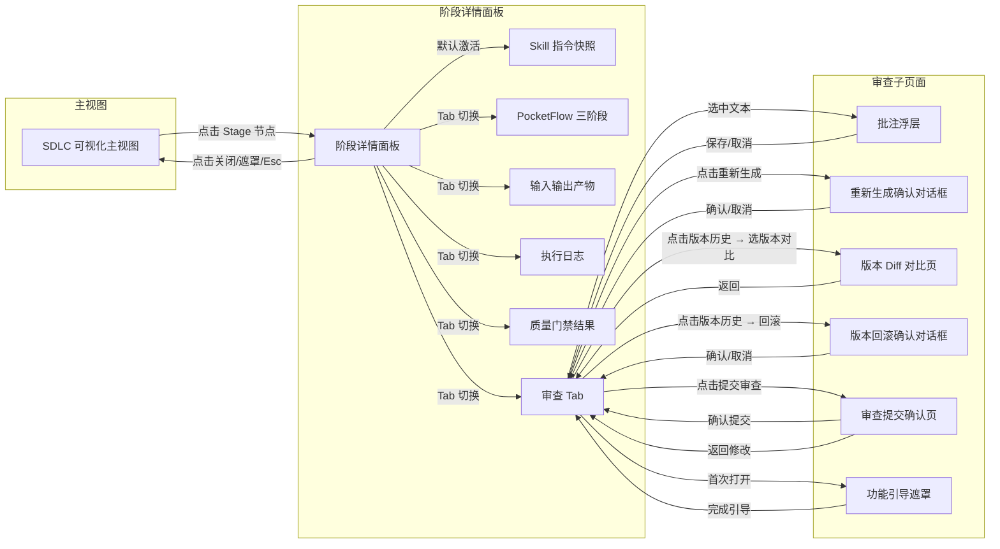

---

## 3. 输入输出字段

### 3.1 用户输入字段表

| 字段名称 | 字段标识 | 输入方式 | 数据类型 | 必填 | 约束规则 | 所在页面 |
|---------|---------|---------|---------|------|---------|---------|
| 批注评论内容 | annotation_content | 文本输入框 | 字符串 | 是 | 1-500 字符，不允许全空白 | Pg_002 |
| 批注类型 | annotation_type | 单选按钮组 | 枚举 | 是 | 疑问 / 修改建议 / 参考资料关联 | Pg_002 |
| 全局修改建议内容 | suggestion_content | 文本域 | 字符串 | 是 | 10-2000 字符 | Pg_001_T6 |
| 全局修改建议级别 | suggestion_level | 单选按钮组 | 枚举 | 是 | P0 阻塞 / P1 建议 / P2 优化 | Pg_001_T6 |
| 参考资料文件 | reference_file | 拖拽/粘贴/文件选择 | 文件对象 | 否 | 类型限制：.md/.txt/.pdf/.png/.jpg，单文件 ≤ 10MB | Pg_001_T6 |
| 参考资料描述 | reference_desc | 文本输入框 | 字符串 | 否 | 0-200 字符 | Pg_001_T6 |
| 日志搜索关键词 | log_keyword | 搜索输入框 | 字符串 | 否 | 0-100 字符，支持正则 | Pg_001_T4 |
| 日志级别过滤 | log_level | 多选下拉 | 枚举数组 | 否 | DEBUG / INFO / WARN / ERROR | Pg_001_T4 |
| 重新生成携带批注勾选 | regenerate_include_annotations | 多选复选框 | 布尔数组 | 否 | 默认全选当前批注 | Pg_003 |
| 版本对比选择 | diff_version_select | 双选列表 | 枚举对 | 是 | 左侧版本号 ≠ 右侧版本号 | Pg_004 |
| 回滚目标版本 | rollback_target_version | 单选列表 | 枚举 | 是 | 不能是当前版本 | Pg_005 |

### 3.2 系统输入字段表

| 字段名称 | 字段标识 | 来源 | 数据类型 | 说明 |
|---------|---------|------|---------|------|
| Stage 唯一标识 | stage_id | 用户点击 Stage 节点 | 字符串 | UUID 格式 |
| Stage 类型 | stage_type | Stage 元数据 | 枚举 | 对应 SDLC 12 阶段之一 |
| 主 Skill 标识 | primary_skill_id | Stage 元数据 | 字符串 | 关联的 Skill 名称 |
| 当前产物版本号 | current_version | 版本管理服务 | 整数 | 从 1 开始递增 |
| 审查状态 | review_status | 状态管理服务 | 枚举 | REVIEW_PENDING / GATE_PENDING / PASSED / REVISION_REQUESTED |
| 产物内容 | artifact_content | 产物存储 | 字符串（Markdown） | 当前版本产物全文 |
| 执行日志流 | log_stream | 日志服务（WebSocket） | 结构化日志对象数组 | 含时间戳、Skill 来源、级别、消息 |
| 门禁结果 | gate_results | 门禁服务 | 结构化对象 | 检查项列表及通过/失败状态 |
| 浏览计时器 | browse_timer | 前端计时器 | 整数（秒） | 记录用户在产物区的累计停留时间 |

### 3.3 页面回显字段表

| 字段名称 | 字段标识 | 回显位置 | 回显形式 | 刷新时机 |
|---------|---------|---------|---------|---------|
| Stage 名称 | stage_name | Pg_001 顶部栏 | 文本 | 面板打开时 |
| Skill 名称 | skill_name | Pg_001_T1 | 文本 | 面板打开时 |
| Skill 版本 | skill_version | Pg_001_T1 | 文本 | 面板打开时 |
| PocketFlow 阶段状态 | pocketflow_status | Pg_001_T2 | 步骤条+状态图标 | 实时（WebSocket） |
| 产物卡片列表 | artifact_cards | Pg_001_T3 | 卡片网格 | 版本变更时 |
| 产物预览内容 | artifact_preview | Pg_001_T3 / Pg_001_T6 | Markdown 渲染 | 点击产物卡片 / 版本切换时 |
| 批注高亮区域 | annotation_highlights | Pg_001_T6 | 文本高亮+气泡 | 批注增删改时 |
| 日志分组列表 | log_groups | Pg_001_T4 | 可折叠分组列表 | 实时追加 |
| 门禁结果摘要 | gate_summary | Pg_001_T5 | 统计数字+状态标签 | 门禁服务推送时 |
| 审查状态标签 | review_status_label | Pg_001_T6 顶部 | 带颜色状态标签 | 状态变更时 |
| 版本历史列表 | version_history | Pg_001_T6 侧边栏 | 时间倒序列表 | 新版本生成 / 回滚时 |
| 全局修改建议计数 | suggestion_counts | Pg_001_T6 | P0/P1/P2 数字标签 | 建议增删改时 |

### 3.4 接口响应字段表（仅字段语义，无 API 规格）

| 字段名称 | 字段标识 | 响应场景 | 数据类型 | 说明 |
|---------|---------|---------|---------|------|
| 操作成功标记 | success | 所有写操作响应 | 布尔 | true / false |
| 错误码 | error_code | 操作失败时 | 字符串 | 业务错误码，如 BROWSE_TIME_INSUFFICIENT |
| 错误消息 | error_message | 操作失败时 | 字符串 | 用户可读的错误描述 |
| 新批次 ID | batch_id | 重新生成提交后 | 字符串 | 用于追踪重新生成任务 |
| 新版本号 | new_version | 重新生成完成后 | 整数 | 生成的新产物版本号 |
| 批注唯一标识 | annotation_id | 批注创建后 | 字符串 | 用于后续编辑/删除 |
| 审查结果 | review_result | 审查提交后 | 枚举 | GATE_PENDING（等待人工闸门裁决） |

### 3.5 数据流转 Mermaid 图

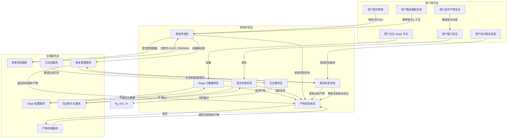

---

## 4. 业务逻辑与状态机

### 4.1 核心业务流程

#### 流程 4.1.1：审查全流程（从产物生成到审查闭环）

```
[产物生成完成]
    │
    ▼
[状态自动设为 REVIEW_PENDING]
    │
    ▼
[用户打开审查 Tab]
    │
    ├──→ [首次打开] → 展示功能引导遮罩（Pg_007）
    │
    ▼
[用户浏览产物文本]
    │
    ├──→ [系统启动浏览计时器，记录停留时长]
    │
    ▼
[用户选中文本添加批注] ──→ [保存批注，文本高亮+气泡展示]
    │                                          │
    │◄─────────────────────────────────────────┘（可循环多次）
    │
    ▼
[用户填写全局修改建议] ──→ [P0/P1/P2 分级输入]
    │
    │◄─────────────────────────────────────────┐
    ▼                                          │
[用户拖拽/粘贴参考资料] ──→ [文件校验→展示列表] │
    │                                          │
    │◄─────────────────────────────────────────┘（可循环多次）
    │
    ▼
[用户点击"提交审查"]
    │
    ├──→ [系统校验 BR-024] ──→ [未通过：提示浏览时长不足，流程终止]
    │
    ├──→ [系统校验 BR-023] ──→ [未通过：提示产物未进入审查状态，流程终止]
    │
    ▼
[展示审查提交确认页（Pg_006）]
    │
    ▼
[用户确认提交]
    │
    ├──→ [将所有批注、修改建议、参考资料打包]
    │
    ├──→ [状态流转为 GATE_PENDING]
    │
    ├──→ [通知人工闸门模块等待裁决]
    │
    ▼
[人工闸门裁决]
    │
    ├──→ [Gate 通过] ──→ [状态流转为 PASSED] ──→ [允许进入下一阶段]
    │
    ├──→ [Gate 驳回] ──→ [状态流转为 REVISION_REQUESTED]
    │                        │
    │                        ├──→ [保留驳回理由并关联批注（BR-027）]
    │                        │
    │                        ├──→ [通知用户查看驳回详情]
    │                        │
    │                        ▼
    │                    [用户查看驳回理由]
    │                        │
    │                        ▼
    │                    [用户修改批注/建议或补充资料]
    │                        │
    │                        ▼
    │                    [再次提交审查] ──→ [回到"提交审查"步骤]
    │
    ▼
[流程结束]
```

#### 流程 4.1.2：版本管理流程（重新生成与回滚）

```
[当前版本 vN 处于 REVIEW_PENDING]
    │
    ├──→ [触发条件 A：用户点击"重新生成"]
    │        │
    │        ├──→ [弹出确认对话框，展示携带上下文]
    │        │
    │        ├──→ [用户确认]
    │        │
    │        ├──→ [状态设为 REGENERATING（临时状态）]
    │        │
    │        ├──→ [触发后端重新生成任务，携带全部批注（BR-025）]
    │        │
    │        ├──→ [实时接收生成日志，展示于日志 Tab]
    │        │
    │        ├──→ [生成完成]
    │        │
    │        ├──→ [创建新版本 vN+1]
    │        │
    │        ├──→ [vN 进入版本历史列表]
    │        │
    │        ├──→ [当前产物更新为 vN+1 内容]
    │        │
    │        ├──→ [审查状态重置为 REVIEW_PENDING]
    │        │
    │        ├──→ [保留历史批注记录（仅查看，不绑定新版本）]
    │        │
    │        ▼
    │    [用户可对比 vN 与 vN+1 的 diff]
    │
    ├──→ [触发条件 B：用户选择版本回滚]
    │        │
    │        ├──→ [用户点击"查看版本历史"]
    │        │
    │        ├──→ [展开版本列表，展示最近最多 10 个版本（BR-026）]
    │        │
    │        ├──→ [用户选择目标版本 vK]
    │        │
    │        ├──→ [点击"回滚至此版本"]
    │        │
    │        ├──→ [弹出回滚确认对话框（Pg_005）]
    │        │
    │        ├──→ [用户二次确认]
    │        │
    │        ├──→ [当前产物替换为 vK 的内容]
    │        │
    │        ├──→ [当前版本号更新为 vK]
    │        │
    │        ├──→ [回滚操作记录到操作日志]
    │        │
    │        ├──→ [审查状态根据 vK 的历史状态恢复]
    │        │
    │        ▼
    │    [版本回滚完成，用户可继续审查]
    │
    ▼
[版本历史维护]
    │
    ├──→ [总版本数 > 10 时，按时间倒序保留最近 10 个（BR-026）]
    │
    ├──→ [超出限制的版本标记为"已归档"，从列表移除但保留于归档存储]
    │
    ▼
[流程结束]
```

### 4.2 业务规则映射

| 规则编号 | 规则名称 | 规则内容 | 约束对象 | 违反后果 | 前端校验方式 |
|---------|---------|---------|---------|---------|------------|
| BR-023 | 主 Skill 产物必须进入 REVIEW_PENDING | 主 Skill 产生的产物在生成完成后，审查状态必须自动设为 REVIEW_PENDING，禁止直接流转到 PASSED 或后续阶段 | 系统状态机 | 产物未经审查即进入下一阶段 | 状态标签强制展示，禁止绕过审查的快捷操作 |
| BR-024 | 最小浏览要求 | 人工必须至少浏览 1 份产物并停留 ≥ 30 秒才可提交审查 | 用户行为 | 提交按钮置灰，提示浏览时长不足 | 前端计时器追踪产物区 focus 时间，累计 ≥ 30 秒启用提交 |
| BR-025 | 重新生成携带批注 | 重新生成操作必须携带前序版本的全部批注作为上下文 | 重新生成功能 | 重新生成缺失审查上下文，导致问题未修复 | 确认对话框默认全选批注，禁止空上下文提交 |
| BR-026 | 版本保留上限 | 版本历史保留最近 10 个版本，超出部分归档 | 版本管理 | 列表展示过多版本导致性能下降 | 列表最多渲染 10 项，超出标记"已归档" |
| BR-027 | Gate 驳回保留理由 | Gate 驳回后必须保留驳回理由文本，并支持关联到具体批注或产物段落 | 审查流程 | 驳回原因丢失，用户无法定位修改点 | 驳回理由强制文本域（必填，10-1000 字符），支持 @引用批注 |

### 4.3 状态机

#### 4.3.1 审查状态机

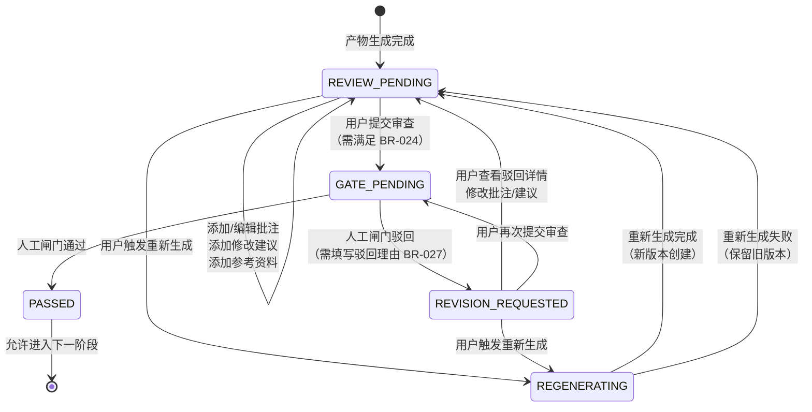

**状态说明：**
- **REVIEW_PENDING**：产物已生成，等待用户审查。可添加批注、修改建议、参考资料，可触发重新生成。
- **GATE_PENDING**：用户已提交审查，等待人工闸门（Gate）裁决。此状态下产物和批注只读。
- **PASSED**：人工闸门通过，产物获得放行。进入此状态后审查功能锁定为只读。
- **REVISION_REQUESTED**：人工闸门驳回，需修改后重新提交。系统展示驳回理由并关联相关批注。
- **REGENERATING**：临时状态，表示重新生成任务正在执行中。产物区展示进度指示器。

#### 4.3.2 版本状态机

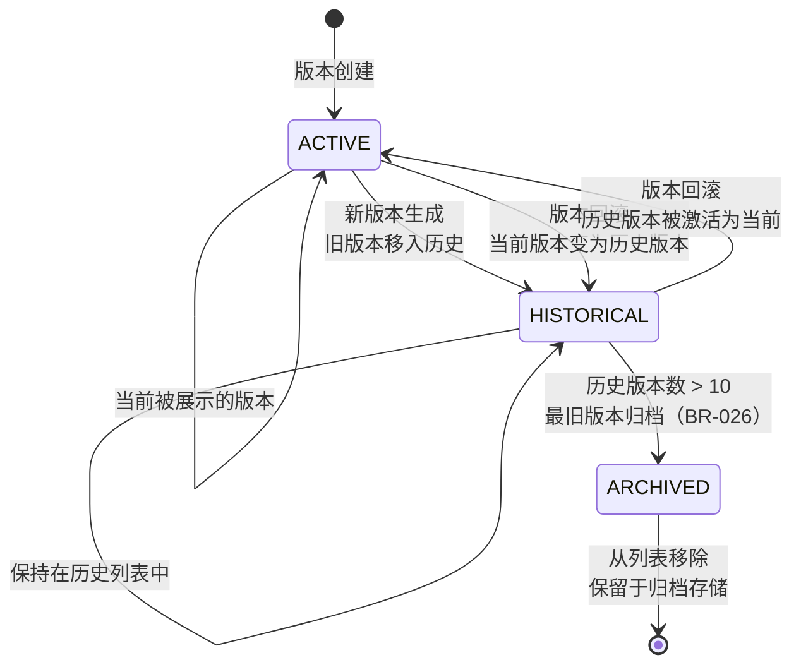

**状态说明：**
- **ACTIVE**：当前正在展示和审查的版本。有且仅有一个 ACTIVE 版本。
- **HISTORICAL**：非当前版本但仍在最近 10 个版本列表中展示。可查看、可 diff 对比、可回滚。
- **ARCHIVED**：超出 10 个版本保留上限的旧版本。从列表移除，但保留于归档存储中，需特殊操作恢复。

### 4.4 异常处理

| 异常编号 | 异常场景 | 触发条件 | 用户可见行为 | 恢复方式 |
|---------|---------|---------|------------|---------|
| EX-001 | 产物加载失败 | 网络中断 / 产物文件损坏 | 产物预览区展示错误占位图+"产物加载失败，请重试" | 点击"重试"按钮重新请求 |
| EX-002 | 批注保存失败 | 批注服务不可用 / 数据校验失败 | 浮层顶部展示红色提示条，保留用户输入不丢失 | 点击"重试"重新提交 |
| EX-003 | 重新生成任务失败 | 后端服务异常 / 上下文超限 | 状态从 REGENERATING 恢复为 REVIEW_PENDING，展示错误通知 | 查看错误详情后重新触发 |
| EX-004 | 日志流中断 | WebSocket 断开 / 日志服务重启 | 日志区底部展示"日志流已断开，正在重连…" | 自动重连，恢复后展示"已恢复"提示 |
| EX-005 | 版本回滚失败 | 目标版本产物损坏 / 并发冲突 | 回滚确认对话框展示错误信息，不关闭对话框 | 选择其他版本重试或取消操作 |
| EX-006 | 参考资料上传失败 | 文件类型不合法 / 文件过大 / 数量超限 | 拖拽区抖动+红色提示"文件不符合要求：{具体原因}" | 更换合法文件后重新上传 |
| EX-007 | 浏览时长校验失败 | 用户试图在停留 < 30 秒时提交审查 | 提交按钮点击后展示 Toast："需浏览产物至少 30 秒（当前 X 秒）" | 继续浏览产物直至满足条件 |
| EX-008 | 版本历史加载超时 | 版本数量过多 / 存储服务延迟 | 版本列表区展示骨架屏 3 秒后转为"加载超时"+"重试"按钮 | 点击"重试"重新加载 |
| EX-009 | Diff 对比计算超时 | 文件过大 / 差异算法耗时过长 | Diff 视图展示"对比计算中…"进度条，超时后提示"文件较大，对比简化中" | 自动降级为简化 diff（仅展示变更行号） |
| EX-010 | 面板打开动画卡顿 | 主线程阻塞 / 产物内容过大 | 若动画帧率 < 30fps 超过 100ms，自动取消动画直接展示 | 无用户操作，自动降级 |

---

## 5. 交互规格

### 5.1 按钮级交互状态机

#### 5.1.1 批注高亮交互状态机

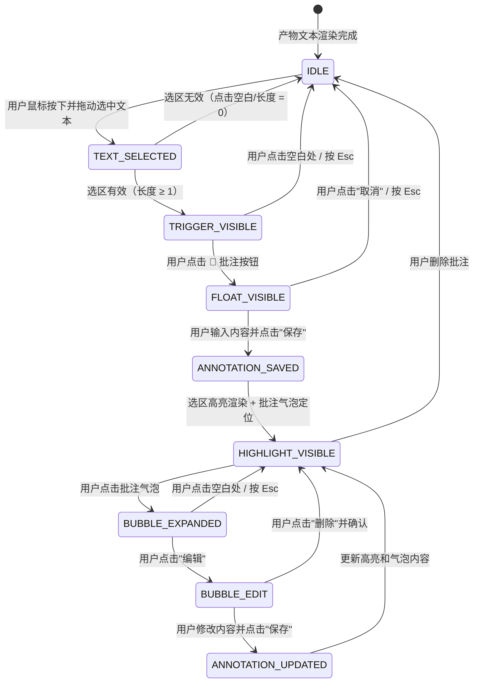

**交互细节：**
- **TEXT_SELECTED → TRIGGER_VISIBLE**：选中文本后，💬 按钮在选区右上角 8px 处浮现，延迟 200ms（防误触），带 scale(0.8)→scale(1) 弹性动画。
- **TRIGGER_VISIBLE → IDLE**：点击空白处或按 Esc 时，💬 按钮以 opacity 1→0 淡出，时长 150ms。
- **FLOAT_VISIBLE → ANNOTATION_SAVED**：批注浮层内评论内容必填，未输入时"保存"按钮置灰。保存成功后浮层以 scale(1)→scale(0.95) 收缩消失，时长 150ms。
- **ANNOTATION_SAVED → HIGHLIGHT_VISIBLE**：选区文本背景色过渡为批注高亮色（默认黄色 #FFF3CD），过渡时长 200ms。批注气泡定位在选区首行左侧，带小三角指向选区。
- **HIGHLIGHT_VISIBLE → BUBBLE_EXPANDED**：点击气泡后气泡展开为卡片，展示完整评论、评论者、时间戳、操作按钮（编辑/删除）。展开动画为 height 0→auto + opacity 0→1，时长 200ms。
- **滚动同步**：用户在产物区滚动时，批注气泡通过 requestAnimationFrame 实时计算定位，确保气泡始终对准高亮文本，错位容差 < 2px。

#### 5.1.2 评论气泡交互状态机

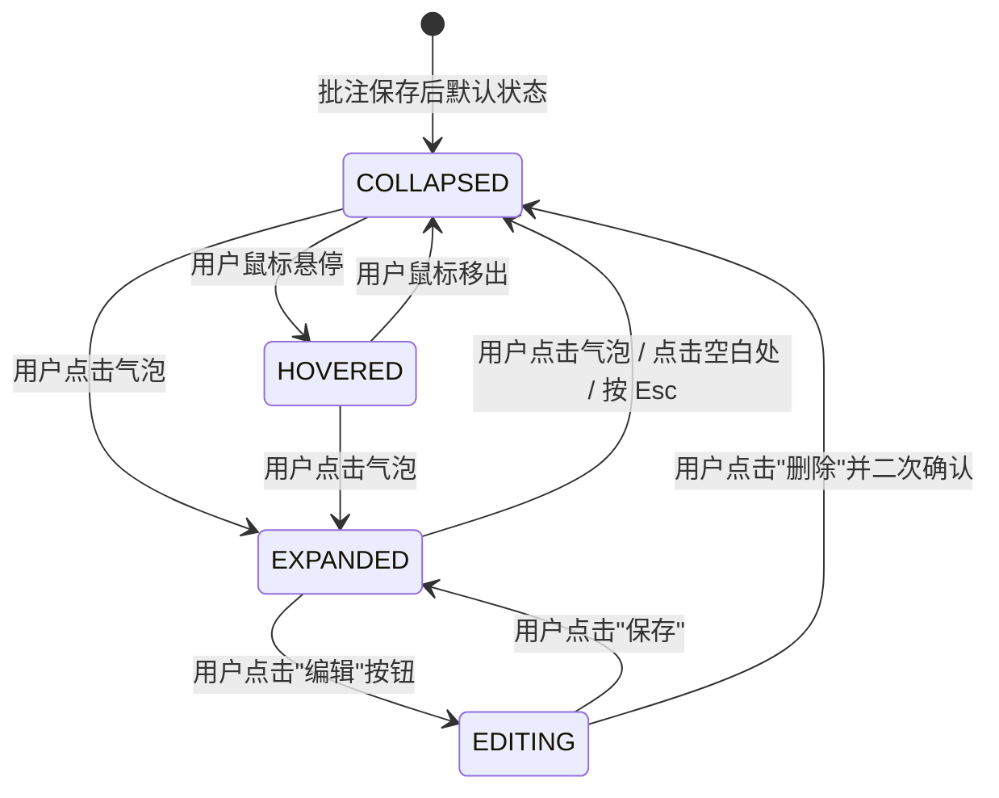

**交互细节：**
- **COLLAPSED 状态**：气泡展示评论摘要（前 20 字符 + "…"）、评论者首字母头像、批注类型图标（疑问=❓/修改建议=✏️/参考资料关联=📎）。
- **HOVERED 状态**：悬停时气泡背景色加深，展示 Tooltip "点击查看详情"。
- **EXPANDED 状态**：气泡展开为 280px 宽卡片，内部元素自上而下：评论者信息行（头像+名称+时间）、评论内容文本（自动换行，最大高度 200px，超出滚动）、操作按钮行（编辑/删除）。
- **EDITING 状态**：评论内容变为文本输入框（auto-focus，保留原内容），操作按钮变为"保存"/"取消"。
- **删除确认**：点击删除后弹出二次确认 Tooltip "确定删除此批注？"，含"删除"/"取消"两个按钮，3 秒内无操作自动消失。

#### 5.1.3 提交审查按钮交互状态机

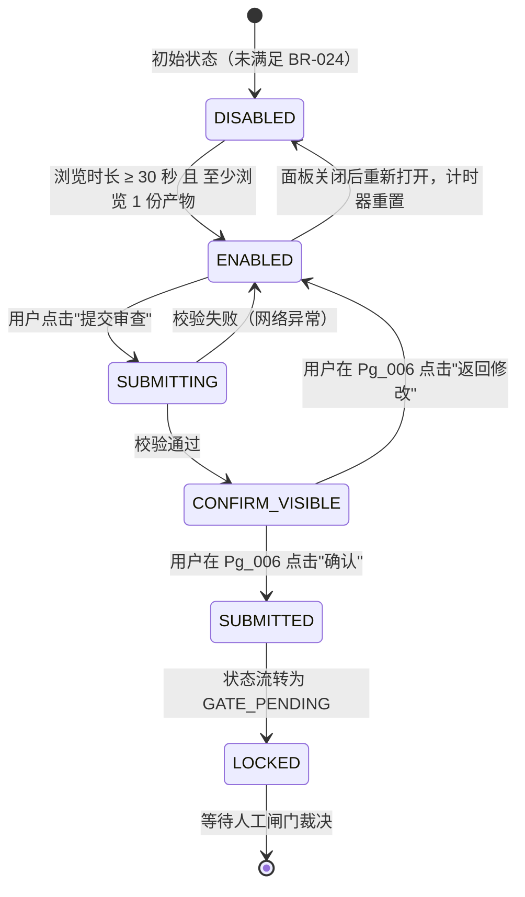

**交互细节：**
- **DISABLED 状态**：按钮背景色灰色（#E5E7EB），文字"提交审查"，右侧展示时钟图标 + 倒计时"还需 18 秒"。鼠标悬停时展示 Tooltip "需浏览产物至少 30 秒并查看至少 1 份产物"。
- **ENABLED → DISABLED 切换**：当用户首次满足条件后，若关闭面板再打开，计时器重置为 0，按钮恢复 DISABLED。同一 Stage 的审查会话内，切换 Tab 不重置计时器。
- **SUBMITTING 状态**：按钮展示加载旋转器，文字变为"提交中…"，禁止重复点击。
- **CONFIRM_VISIBLE 状态**：Pg_006 从底部滑出，汇总展示：批注数量及类型分布、修改建议分级统计、参考资料数量、预估闸门处理时间。
- **SUBMITTED 状态**：Pg_006 关闭，审查 Tab 顶部状态标签从 🟡 REVIEW_PENDING 变为 🟠 GATE_PENDING，全部输入区置为只读，批注气泡可查看但不可编辑。

#### 5.1.4 重新生成按钮交互状态机

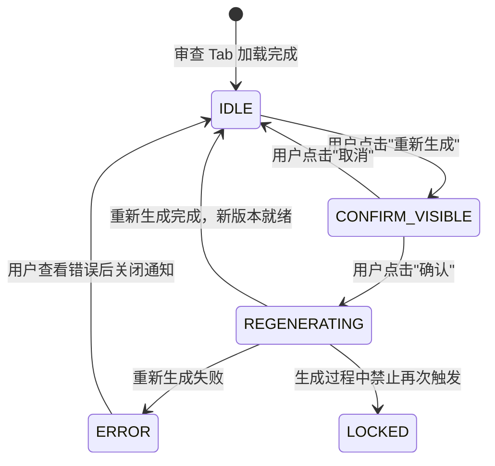

**交互细节：**
- **IDLE 状态**：按钮文字"重新生成"，图标 🔄。若当前无批注无建议无资料，按钮可点击但确认对话框展示警告"未携带任何上下文，确定重新生成？"。
- **CONFIRM_VISIBLE 状态**：Pg_003 模态对话框居中展示。内容区自上而下：对话框标题"确认重新生成"、上下文摘要卡片（批注 X 条 / 建议 Y 条 / 资料 Z 个）、可折叠的批注详情列表（默认折叠，用户可展开勾选/取消具体批注）、警告提示"此操作将创建新版本，当前审查进度将归档"。底部按钮"确认重新生成"（主按钮）+ "取消"。
- **REGENERATING 状态**：面板内产物区展示全屏遮罩 + 进度指示器（圆形进度条 + "正在重新生成…"文字 + 已执行步骤 / 总步骤）。底部展示"查看实时日志"链接，点击自动切换到日志 Tab。
- **进度更新**：通过 WebSocket 接收进度事件，进度条平滑过渡，步骤文字淡入切换。
- **完成动画**：重新生成完成后，遮罩以 opacity 1→0 淡出，新版本产物内容以淡入方式展示，顶部闪现"新版本 vN+1 已生成"Toast 通知（自动消失，3 秒）。
- **失败处理**：ERROR 状态下遮罩转为错误图标 + 错误摘要 + "查看详情"展开按钮 + "重试"/"取消"两个按钮。

#### 5.1.5 版本切换交互状态机

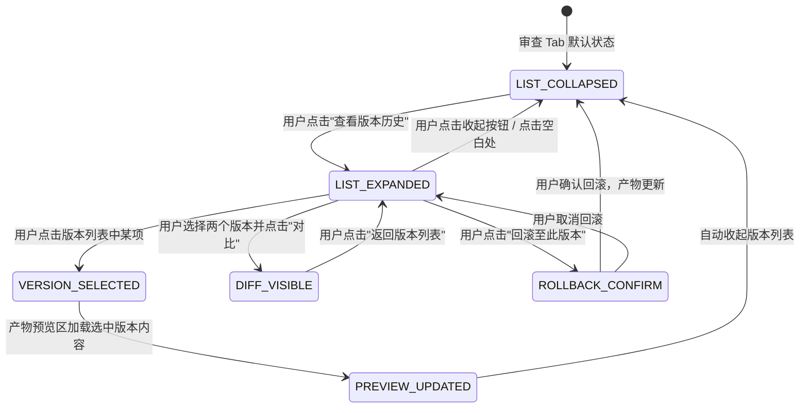

**交互细节：**
- **LIST_EXPANDED 状态**：版本列表从审查 Tab 右侧滑出，宽度 240px，覆盖产物预览区右侧 1/3 区域。列表项自上而下：当前版本（置顶，蓝色边框高亮）+ 历史版本（时间倒序）。每项展示：版本号（vN）、生成时间（相对时间，如"2 小时前"）、生成原因摘要（"用户触发重新生成" / "初始生成"）。
- **VERSION_SELECTED → PREVIEW_UPDATED**：点击版本项后，该项以蓝色背景高亮，产物预览区展示加载骨架屏（3 行文本脉冲动画），加载完成后展示目标版本内容，顶部展示版本标签"正在查看 vN（非当前版本）"+"恢复为当前版本"按钮。
- **DIFF_VISIBLE 状态**：产物预览区切换为 diff 视图。Diff 视图两种模式：行内 diff（默认，增绿删红改黄）/ 并排 diff（点击切换按钮）。差异行左侧展示行号，变更内容以色块背景区分。顶部展示对比的两个版本号及切换按钮。
- **ROLLBACK_CONFIRM 状态**：Pg_005 模态对话框展示。内容：目标版本信息、当前版本信息、警告提示"回滚后当前版本将移入历史列表"。底部按钮"确认回滚"（红色危险按钮）+ "取消"。
- **回滚成功**：对话框关闭，产物预览区展示回滚后版本内容，版本列表自动更新，当前版本标记移位，Toast 通知"已回滚至 vK"。用户仍停留在当前审查 Tab，不强制跳转至其他页面。

#### 5.1.6 参考资料拖拽交互状态机

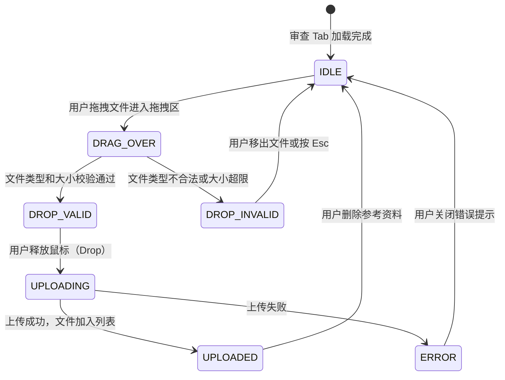

**交互细节：**
- **IDLE 状态**：拖拽区展示虚线边框占位，中央图标 📎 + 文字"拖拽文件到此处，或点击粘贴"。
- **DRAG_OVER 状态**：拖拽进入时边框变为实线 + 蓝色（#3B82F6），背景色淡蓝（#EFF6FF），文字变为"释放以上传文件"。
- **DROP_INVALID 状态**：若文件类型不合法（如 .exe），边框变为红色（#EF4444），背景色淡红（#FEF2F2），文字变为"不支持的文件类型：.exe"，拖拽区抖动动画（translateX ± 4px，3 次，共 300ms）。
- **UPLOADING 状态**：文件卡片以骨架屏形式加入列表，展示文件名 + 进度条（若可获取）+ "上传中…"。
- **UPLOADED 状态**：卡片展示文件图标（按类型区分）、文件名（截断，最大 20 字符）、文件大小、删除按钮（×）。图片类型支持悬停预览（Tooltip 展示缩略图）。
- **粘贴支持**：用户点击拖拽区后唤起系统文件选择器，或在页面任意位置 Ctrl+V 粘贴剪贴板内容（图片/文本），系统自动识别并路由到参考资料区。
- **数量限制**：当参考资料数量达到 20 个时，拖拽区变为禁用状态，展示"已达到参考资料上限（20）"，边框灰色。

### 5.2 页面间跳转关系 Mermaid 图

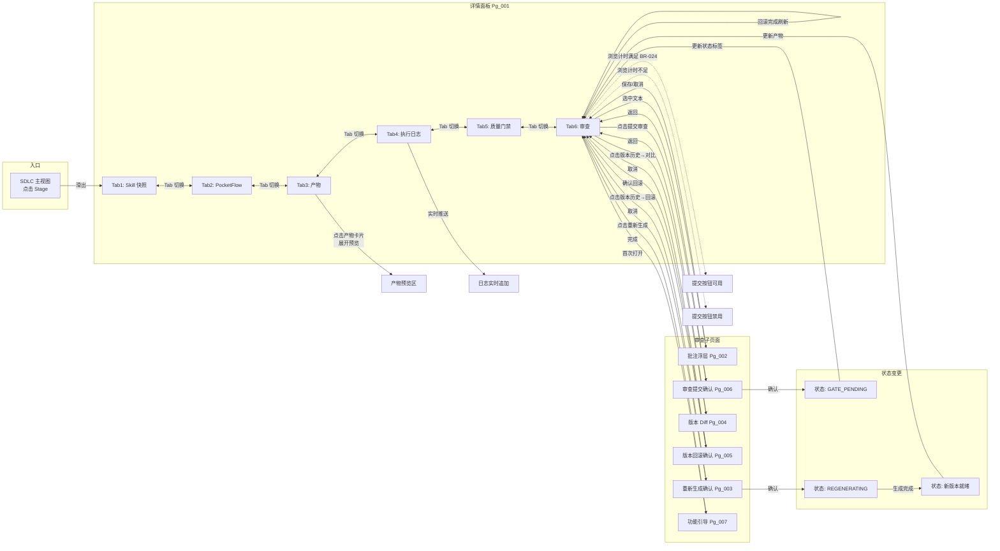

---

## 附录

### A. 术语表

| 术语 | 英文 | 定义 |
|-----|------|------|
| Stage | Stage | SDLC 12 阶段中的单个阶段节点，如"概要设计""详细需求"等 |
| Skill | Skill | Arsitect 框架中定义的标准化 AI 工作流单元，以 Markdown 形式描述 |
| PocketFlow | PocketFlow | Skill 执行的三阶段模型：prep（准备）/ exec（执行）/ post（收尾） |
| 产物 | 产物 | Stage 执行过程中产生或消费的文档/文件，如 Markdown、YAML、JSON 等 |
| 批注 | Annotation | 用户在产物文本上通过选区添加的评论性标记，关联文件、位置与版本 |
| 参考资料 | Reference | 用户为辅助 AI 重新生成而提供的附加材料，如文档、图片、链接等 |
| 人工闸门 | Gate | SDLC 流转中必须经人工确认的关键检查点，如 Gate 1 / Gate 2.5 等 |

### B. 参考文档

- PRD-000：SDLC Visualizer 概要需求文档
- REQ-P0-025：执行日志可视化需求
- REQ-P0-034~038：审查功能需求集
- US-002：查看 Stage 详情（用户故事）
- US-009：审查 AI 产物（用户故事）
- BR-023~027：阶段详情面板相关业务规则
- NFR-003：响应时间性能基线

---

> **文档签核**
> - 编写：AI 产品经理
> - 评审：待人工闸门 Gate 2.5 评审通过
> - 基线：v1.0.0
