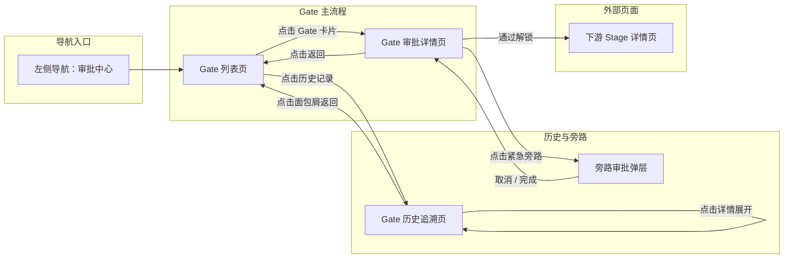
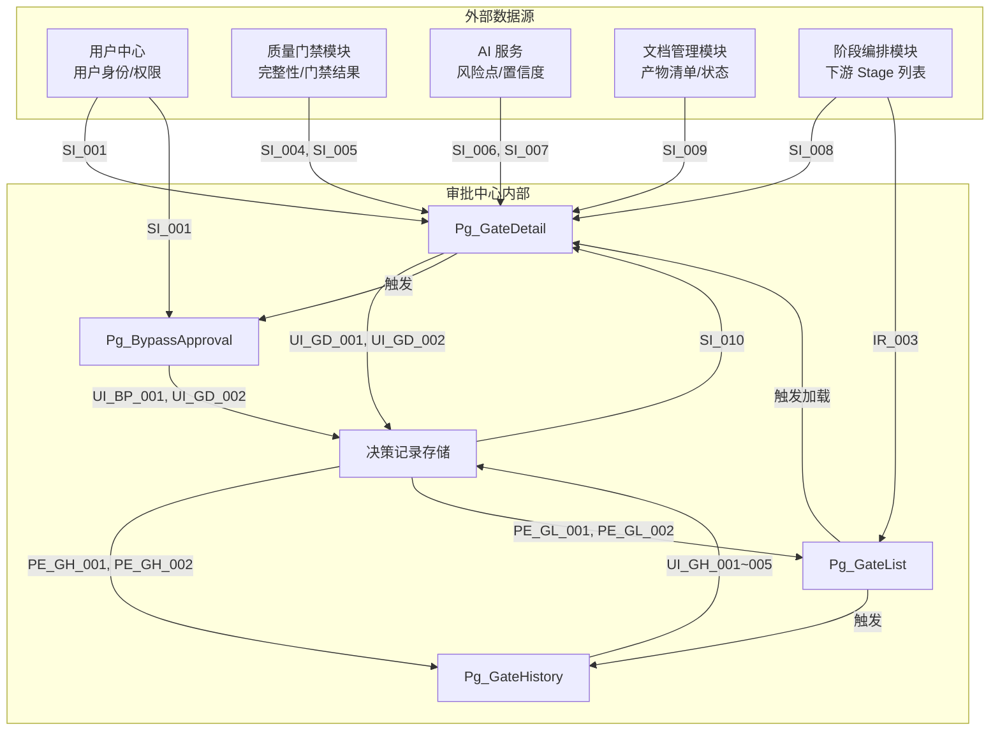
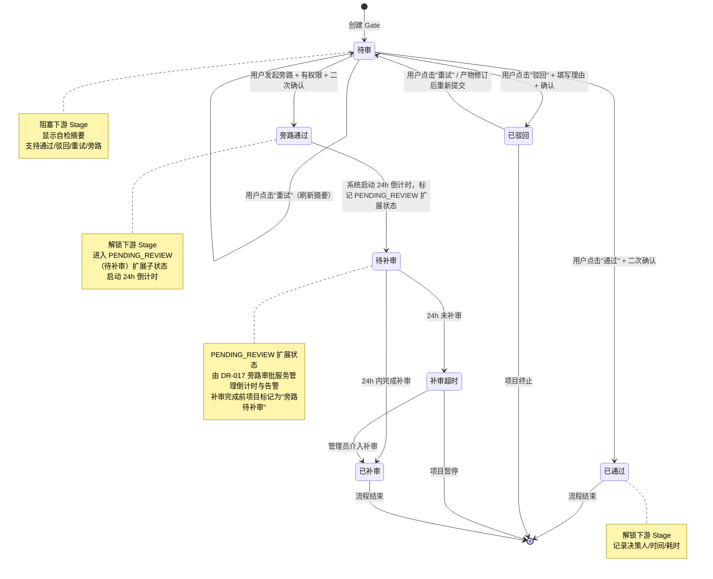

# DR-004 审批中心（Gate Center）——模块需求规格书

> **模块编号**：DR-004  
> **模块名称**：审批中心（Gate Center）  
> **版本**：v1.0  
> **状态**：Draft  
> **关联需求**：REQ-P0-008、REQ-P0-009、REQ-P0-026  
> **关联用户故事**：US-003（Gate 审批）  
> **编写日期**：2026-06-01  

---

## 1. 需求追溯与验收标准

### 1.1 需求追溯矩阵

| 需求 ID | 需求名称 | 优先级 | 关联用户故事 | 本章覆盖节 | 验收标准 ID |
|---------|----------|--------|------------|-----------|------------|
| REQ-P0-008 | Gate 自检摘要 | P0 | US-003 | 3.2, 4.1, 5.2 | AC-F-001 ~ AC-F-003, AC-P-001 |
| REQ-P0-009 | Gate 快速确认 | P0 | US-003 | 4.1, 5.2 | AC-F-004 ~ AC-F-009 |
| REQ-P0-026 | Gate 历史追溯 | P0 | US-003 | 2.1, 3.2, 5.1 | AC-F-010 ~ AC-F-014 |
| BR-002 | Gate 通过前下游不可执行 | P0 | US-003 | 4.1, 4.3 | AC-F-006, AC-C-001 |
| BR-009 | 低置信度禁止一键通过 | P0 | US-003 | 4.1, 4.3, 5.2 | AC-F-005, AC-C-002 |
| BR-014 | 旁路审批需授权+24h 补审 | P1 | US-003 | 4.2, 4.3 | AC-F-015 ~ AC-F-018 |
| BR-017 | 立项 Gate 不计入 Active Gate 总数 | P1 | US-003 | 4.3 | AC-F-019 |
| BR-027 | 驳回后保留理由并关联批注 | P0 | US-003 | 4.1, 5.2 | AC-F-007, AC-F-008 |

### 1.2 IN / OUT 清单

#### IN（模块范围内）

1. Gate 自检摘要的生成与展示（产物完整性、质量门禁结果、风险点、置信度）。
2. Gate 审批操作：通过、驳回、重试。
3. 驳回理由的录入与关联产物批注。
4. Gate 通过后下游 Stage 的解锁状态变更。
5. Gate 历史记录的存储、查询与筛选（按项目 / 阶段 / 时间范围）。
6. 旁路审批的发起、授权校验、24h 补审提醒与超时告警。
7. Gate 决策状态的实时同步与页面回显。

#### OUT（模块范围外，由其他模块处理）

1. 产物完整性校验的具体算法实现（由质量门禁模块提供结果）。
2. 风险点的 AI 评估模型训练与推理（由 AI 服务模块提供摘要数据）。
3. 下游 Stage 解锁后的具体任务执行与编排（由任务编排模块负责）。
4. 用户权限体系的完整管理（由用户中心模块提供角色与权限数据）。
5. 批注系统的富文本编辑与实时协作（由批注模块提供关联锚点能力）。
6. 通知推送的底层通道（邮件 / 站内信 / Webhook）（由通知中心模块负责投递）。

### 1.3 验收标准分类（AC Taxonomy）

#### AC-F：功能验收（Functional）

| AC ID | 验收标准 | 优先级 | 关联需求 |
|-------|----------|--------|----------|
| AC-F-001 | Given 用户已进入 Gate 审批详情页，When 页面加载完成，Then 系统应在 500ms 内自动生成并展示自检摘要 | P0 | REQ-P0-008 |
| AC-F-002 | Given 用户已进入 Gate 审批详情页，When 系统生成自检摘要后，Then 摘要内容应包含产物完整性状态、质量门禁结果摘要和风险点列表三项 | P0 | REQ-P0-008 |
| AC-F-003 | Given 用户已进入 Gate 审批详情页且自检摘要已展示，When 用户查看摘要顶部时，Then 应展示置信度标签（高/中/低），且低置信度时标签呈警示样式 | P0 | REQ-P0-008 |
| AC-F-004 | Given 用户处于 Gate 审批详情页且 Gate 状态为待审，When 用户查看决策操作区时，Then 页面应提供通过、驳回和重试三个主操作按钮 | P0 | REQ-P0-009 |
| AC-F-005 | Given Gate 摘要置信度为低，When 用户处于 Gate 审批详情页时，Then 通过按钮应置灰禁用，且 hover 时显示提示"置信度不足，请人工核查" | P0 | BR-009 |
| AC-F-006 | Given 当前 Gate 状态未通过，When 用户查看下游 Stage 入口时，Then 入口按钮应呈锁定态并展示"当前 Gate 未通过"的锁定提示 | P0 | BR-002 |
| AC-F-007 | Given 用户处于 Gate 审批详情页，When 用户点击驳回按钮时，Then 系统应弹出模态框要求填写驳回理由，且该理由为必填项最少 5 个字符 | P0 | BR-027 |
| AC-F-008 | Given 用户已填写驳回理由并提交，When 系统处理驳回请求时，Then 应自动将驳回理由作为批注关联到当前 Gate 的所有待审产物 | P0 | BR-027 |
| AC-F-009 | Given 用户处于 Gate 审批详情页且满足通过条件，When 用户点击通过按钮并确认后，Then 系统应解锁下游 Stage 并在页面上展示解锁成功的状态反馈 | P0 | REQ-P0-009 |
| AC-F-010 | Given 用户已进入 Gate 历史追溯页，When 页面加载完成后，Then 应展示完整的决策记录列表，且每条记录应包含决策人、决策结论、时间戳和耗时 | P0 | REQ-P0-026 |
| AC-F-011 | Given 用户处于 Gate 历史列表页面，When 用户查看筛选功能时，Then 列表应支持按项目名称、Gate 类型和时间范围（起始/结束日期）进行组合筛选 | P0 | REQ-P0-026 |
| AC-F-012 | Given 用户已变更历史列表的筛选条件，When 筛选条件变更后，Then 列表应在 1s 内刷新并展示结果 | P0 | REQ-P0-026 |
| AC-F-013 | Given 用户处于 Gate 历史列表页面，When 用户点击单条历史记录时，Then 应展开查看该次 Gate 的完整摘要与审批详情 | P1 | REQ-P0-026 |
| AC-F-014 | Given 用户处于 Gate 历史列表页面，When 用户执行导出操作时，Then 历史数据应支持导出为 CSV 格式的结构化报告 | P2 | REQ-P0-026 |
| AC-F-015 | Given 用户查看 Gate 审批详情页，When 页面渲染完成后，Then 旁路审批入口仅当用户拥有"紧急旁路"权限时才可见 | P1 | BR-014 |
| AC-F-016 | Given 用户拥有紧急旁路权限并发起旁路审批，When 用户填写原因并通过二次确认后，Then 系统应记录旁路授权人与授权时间 | P1 | BR-014 |
| AC-F-017 | Given 旁路审批已通过，When 系统处理旁路审批结果时，Then 应启动 24 小时倒计时并在审批记录中标注"待补审"状态 | P1 | BR-014 |
| AC-F-018 | Given 旁路审批已通过且 24 小时倒计时已启动，When 倒计时到达剩余 4 小时、1 小时和超时三个节点时，Then 系统应触发告警通知 | P1 | BR-014 |
| AC-F-019 | Given 项目存在立项 Gate，When 统计面板展示 Gate 数量时，Then 立项 Gate 应在统计面板上单独标记且不计入 Active Gate 总数 | P1 | BR-017 |

#### AC-P：性能验收（Performance）

| AC ID | 验收标准 | 优先级 | 关联需求 |
|-------|----------|--------|----------|
| AC-P-001 | Given 用户请求 Gate 自检摘要，When 在本地 SQLite 场景下，Then 从请求到首屏渲染完成应不超过 500ms | P0 | REQ-P0-008 |
| AC-P-002 | Given 用户执行 Gate 确认操作（通过、驳回或重试），When 从用户点击操作开始，Then 到反馈完成应不超过 30 秒 | P0 | NFR |
| AC-P-003 | Given 用户执行 Gate 历史查询（单项目近 100 条记录），When 从筛选条件提交开始，Then 到结果渲染完成应不超过 1 秒 | P0 | REQ-P0-026 |
| AC-P-004 | Given 旁路审批倒计时已启动，When 系统执行状态检查时，Then 应每 5 分钟轮询一次倒计时状态且轮询不阻塞主线程 | P1 | BR-014 |

#### AC-U：易用性验收（Usability）

| AC ID | 验收标准 | 优先级 | 关联需求 |
|-------|----------|--------|----------|
| AC-U-001 | Given Gate 摘要卡片已展示，When 用户查看卡片时，Then 应采用颜色编码，其中绿色表示通过项、黄色表示警告项、红色表示阻塞项 | P1 | REQ-P0-008 |
| AC-U-002 | Given 用户打开驳回理由输入模态框，When 查看输入框时，Then 应提供字符计数与最少字符提示 | P1 | BR-027 |
| AC-U-003 | Given 用户进入 Gate 历史列表页面，When 页面加载完成后，Then 列表默认应按时间倒序排列，且空状态时应展示引导文案 | P2 | REQ-P0-026 |

#### AC-S：安全验收（Security）

| AC ID | 验收标准 | 优先级 | 关联需求 |
|-------|----------|--------|----------|
| AC-S-001 | Given Gate 审批操作已完成，When 系统记录操作日志时，Then 所有审批操作记录应不可篡改，且每条记录应包含操作者身份指纹与时间戳 | P1 | REQ-P0-026 |
| AC-S-002 | Given 用户拥有常规审批角色，When 系统校验旁路审批权限时，Then 常规审批角色不应自动继承旁路审批权限，旁路审批权限需单独授权 | P1 | BR-014 |

#### AC-C：合规验收（Compliance）

| AC ID | 验收标准 | 优先级 | 关联需求 |
|-------|----------|--------|----------|
| AC-C-001 | Given 当前 Gate 尚未通过，When 有操作尝试变更下游 Stage 状态时，Then 系统必须阻止该状态变更操作 | P0 | BR-002 |
| AC-C-002 | Given Gate 摘要置信度为低，When 系统渲染通过按钮时，Then 必须在服务端物理禁用通过按钮，而非仅在前端隐藏 | P0 | BR-009 |

#### AC-N：否定验收（Negative）

| AC ID | 验收标准 | 优先级 | 关联需求 |
|-------|----------|--------|----------|
| AC-N-001 | Given Gate 状态为已通过或旁路通过，When 用户尝试直接回退 Gate 状态到待审时，Then 系统应拒绝该操作且不支持从已通过或旁路通过状态直接回退到待审 | P1 | NFR |

#### AC-D：依赖验收（Dependency）

| AC ID | 验收标准 | 优先级 | 关联需求 |
|-------|----------|--------|----------|
| AC-D-001 | Given 质量门禁模块已返回标准化的产物完整性校验结果且 AI 摘要服务可用，When 用户进入 Gate 审批详情页时，Then 系统应能正常生成并展示自检摘要 | P1 | ASM-001 |

### 1.4 假设注册表

| 编号 | 假设内容 | 影响范围 | 验证方式 |
|------|----------|----------|----------|
| ASM-001 | 质量门禁模块已提供产物完整性校验结果的标准化数据结构 | 摘要生成 | 概要设计阶段接口契约确认 |
| ASM-002 | 用户中心模块已提供"紧急旁路"独立权限标识 | 旁路审批 | 概要设计阶段权限矩阵确认 |
| ASM-003 | 单个项目生命周期内 Gate 总次数不超过 50 次 | 历史查询性能 | 规模评估文档确认 |
| ASM-004 | 审批操作在同一时刻仅由单一用户执行（无并发冲突） | 状态一致性 | MVP 阶段单用户单机场景天然满足 |
| ASM-005 | AI 摘要服务在本地单机环境下可在 300ms 内返回结果 | 摘要性能 | 技术预研测试确认 |


version: v1.0
---

## 2. 原型与页面结构

### 2.1 页面清单

| 页面编码 | 页面名称 | 入口方式 | 核心职责 |
|----------|----------|----------|----------|
| Pg_GateList | Gate 列表页 | 左侧导航"审批中心" | 展示当前项目全部 Gate 的概览卡片，显示状态、类型、阻塞关系 |
| Pg_GateDetail | Gate 审批详情页 | Pg_GateList 点击卡片 / 全局 Gate 待审通知 | 展示自检摘要、审批操作区、产物列表、决策历史 |
| Pg_GateHistory | Gate 历史追溯页 | Pg_GateList 顶部"历史记录"按钮 | 跨项目的 Gate 决策历史查询与筛选 |
| Pg_BypassApproval | 旁路审批弹层 | Pg_GateDetail 底部"紧急旁路"按钮（有权限时） | 填写旁路原因、二次确认、展示授权信息与倒计时 |

### 2.2 文字化布局结构

#### Pg_GateList — Gate 列表页

```
┌─────────────────────────────────────────────────────────────┐
│  [面包屑：项目名 > 审批中心]          [刷新按钮]             │
├─────────────────────────────────────────────────────────────┤
│  ┌─────────────┐  ┌─────────────┐  ┌─────────────┐         │
│  │ 统计卡片：   │  │ 统计卡片：   │  │ 统计卡片：   │         │
│  │ 待审 Gate   │  │ 已通过      │  │ 已驳回      │         │
│  │   3        │  │   12       │  │   2        │         │
│  └─────────────┘  └─────────────┘  └─────────────┘         │
├─────────────────────────────────────────────────────────────┤
│  [筛选栏：Gate 类型 ▼] [状态 ▼] [排序 ▼]   [历史记录 →]     │
├─────────────────────────────────────────────────────────────┤
│  ┌───────────────────────────────────────────────────────┐  │
│  │ Gate 1 · 概要需求冻结  ·  [待审]  ·  置信度：高       │  │
│  │ 产物完整性：✓ 通过    质量门禁：✓ 通过    风险：0    │  │
│  │ 阻塞下游：详细需求、概要设计                            │  │
│  │                                    [去审批 →]         │  │
│  └───────────────────────────────────────────────────────┘  │
│  ┌───────────────────────────────────────────────────────┐  │
│  │ Gate 2 · 概要设计评审  ·  [待审]  ·  置信度：中       │  │
│  │ 产物完整性：⚠ 警告    质量门禁：✓ 通过    风险：2    │  │
│  │ 阻塞下游：详细设计、接口契约                            │  │
│  │                                    [去审批 →]         │  │
│  └───────────────────────────────────────────────────────┘  │
│  ┌───────────────────────────────────────────────────────┐  │
│  │ Gate 2.5 · 详细需求评审 · [已通过] · 决策人：张三      │  │
│  │ 2026-05-28 14:32 · 耗时 18s                            │  │
│  │                                    [查看详情 →]       │  │
│  └───────────────────────────────────────────────────────┘  │
└─────────────────────────────────────────────────────────────┘
```

#### Pg_GateDetail — Gate 审批详情页

```
┌─────────────────────────────────────────────────────────────┐
│  [← 返回列表]  Gate 2 · 概要设计评审  ·  [待审]              │
├─────────────────────────────────────────────────────────────┤
│  ┌─────────────────────────┐  ┌───────────────────────────┐ │
│  │      自检摘要区          │  │       决策操作区           │ │
│  │  ┌───────────────────┐  │  │  ┌─────────────────────┐  │ │
│  │  │ 置信度：⚠ 中      │  │  │  │ [  ✓  通过  ]      │  │ │
│  │  └───────────────────┘  │  │  │ [  ✗  驳回  ]      │  │ │
│  │                         │  │  │ [  ↻  重试  ]      │  │ │
│  │  产物完整性             │  │  │                         │ │
│  │  ├─ PRD-000：✓ 通过    │  │  │  上次决策：无           │ │
│  │  ├─ 规模评估：✓ 通过   │  │  │                         │ │
│  │  └─ 原型图：⚠ 缺失     │  │  │  [紧急旁路]（权限控制） │ │
│  │                         │  │  └─────────────────────┘  │ │
│  │  质量门禁结果           │  │                           │ │
│  │  ├─ 一致性：✓ 通过     │  │                           │ │
│  │  └─ 完整性：⚠ 警告     │  │                           │ │
│  │                         │  │                           │ │
│  │  风险点（2）            │  │                           │ │
│  │  ├─ 1. 数据流图未覆盖  │  │                           │ │
│  │  │    异常分支          │  │                           │ │
│  │  └─ 2. 技术选型理由    │  │                           │ │
│  │       未在文档中体现   │  │                           │ │
│  └─────────────────────────┘  └───────────────────────────┘ │
├─────────────────────────────────────────────────────────────┤
│  关联产物列表                                                │
│  ┌─────────────┬─────────────┬─────────────┬──────────────┐ │
│  │ 产物名称     │ 类型        │ 状态        │ 批注数      │ │
│  ├─────────────┼─────────────┼─────────────┼──────────────┤ │
│  │ 01-架构核心  │ 设计文档    │ ✓ 已审      │ 0           │ │
│  │ 02-数据流    │ 设计文档    │ ⚠ 待确认    │ 2           │ │
│  └─────────────┴─────────────┴─────────────┴──────────────┘ │
├─────────────────────────────────────────────────────────────┤
│  本 Gate 决策历史                                            │
│  ┌─────────────┬─────────────┬─────────────┬──────────────┐ │
│  │ 时间        │ 操作人      │ 结论        │ 耗时        │ │
│  ├─────────────┼─────────────┼─────────────┼──────────────┤ │
│  │ --          │ --          │ --          │ --          │ │
│  └─────────────┴─────────────┴─────────────┴──────────────┘ │
└─────────────────────────────────────────────────────────────┘
```

#### Pg_GateHistory — Gate 历史追溯页

```
┌─────────────────────────────────────────────────────────────┐
│  [面包屑：审批中心 > 历史追溯]                                │
├─────────────────────────────────────────────────────────────┤
│  筛选条件栏                                                  │
│  [项目 ▼] [Gate 类型 ▼] [结论 ▼] [起始日期]~[结束日期] [导出]│
├─────────────────────────────────────────────────────────────┤
│  结果列表                                                    │
│  ┌───────────────────────────────────────────────────────┐  │
│  │ 项目 A · Gate 3 · UAT 验收 · [已通过] · 2026-05-30    │  │
│  │ 决策人：李四 · 耗时 12s · 旁路：否                     │  │
│  │ [查看详情 ↓]                                          │  │
│  └───────────────────────────────────────────────────────┘  │
│  ┌───────────────────────────────────────────────────────┐  │
│  │ 项目 B · Gate 1 · 概要需求冻结 · [已驳回] · 2026-05-29│  │
│  │ 决策人：王五 · 耗时 45s · 驳回理由：PRD 范围不清晰...  │  │
│  │ [查看详情 ↓]                                          │  │
│  └───────────────────────────────────────────────────────┘  │
└─────────────────────────────────────────────────────────────┘
```

#### Pg_BypassApproval — 旁路审批弹层

```
┌─────────────────────────────┐
│  紧急旁路审批                │
├─────────────────────────────┤
│  当前 Gate：Gate 2 · 概要设计│
│  授权人：admin（系统自动填充）│
│  授权时间：2026-06-01 11:30  │
├─────────────────────────────┤
│  旁路原因 *                  │
│  ┌─────────────────────────┐│
│  │ 请输入紧急旁路原因...   ││
│  │ （最少 10 个字符）      ││
│  └─────────────────────────┘│
├─────────────────────────────┤
│  ⚠ 旁路通过后需在 24h 内补审│
│  补审倒计时将在通过后启动    │
├─────────────────────────────┤
│  [取消]      [确认旁路通过]  │
└─────────────────────────────┘
```

### 2.3 关键交互流程

**流程 A：标准 Gate 审批（通过）**
1. 用户在 Pg_GateList 点击待审 Gate 卡片 → 进入 Pg_GateDetail。
2. 页面加载时自动请求自检摘要并在摘要区渲染。
3. 用户审阅摘要内容（产物完整性、质量门禁、风险点）。
4. 若置信度为"高"或"中"，"通过"按钮可用；若为"低"，按钮禁用。
5. 用户点击"通过" → 弹出二次确认模态框。
6. 确认后系统记录决策（决策人、时间戳、耗时），更新 Gate 状态为"已通过"。
7. 解锁下游 Stage，Pg_GateDetail 刷新显示解锁成功状态。
8. Pg_GateList 同步更新该卡片状态。

**流程 B：标准 Gate 审批（驳回）**
1. 用户进入 Pg_GateDetail 审阅摘要。
2. 点击"驳回" → 弹出驳回理由输入模态框。
3. 用户填写理由（最少 5 字符）→ 点击"确认驳回"。
4. 系统记录驳回决策，将理由作为批注关联到该 Gate 下所有状态为"待确认"或"警告"的关联产物。
5. Gate 状态更新为"已驳回"，下游 Stage 保持锁定。
6. 用户可点击"重试"重新触发摘要生成（清除上次缓存）。

**流程 C：旁路审批**
1. 拥有旁路权限的用户在 Pg_GateDetail 点击"紧急旁路"。
2. 弹出 Pg_BypassApproval 弹层，自动填充当前用户为授权人。
3. 用户填写旁路原因（最少 10 字符）→ 点击"确认旁路通过"。
4. 系统记录旁路审批决策，标记该记录为"旁路通过"状态。
5. 启动 24h 倒计时，在 Gate 记录中附加"待补审"标记。
6. 下游 Stage 立即解锁。
7. 系统在倒计时 4h、1h、超时三个节点向授权人推送告警通知。
8. 补审完成后，"待补审"标记清除，记录更新为"已补审"。

**流程 D：历史追溯查询**
1. 用户在 Pg_GateList 点击"历史记录" → 进入 Pg_GateHistory。
2. 页面默认展示当前项目近 30 天的全部 Gate 决策记录，按时间倒序排列。
3. 用户通过筛选栏选择项目、Gate 类型、结论、时间范围进行组合筛选。
4. 筛选结果实时刷新（≤1s）。
5. 点击单条记录展开详情，展示该次 Gate 的完整摘要、审批操作、耗时。
6. 点击"导出"生成 CSV 文件下载。

### 2.4 页面跳转图



---

## 3. 输入输出字段

### 3.1 字段总览表

#### 用户输入字段

| 字段编码 | 字段名称 | 数据类型 | 必填 | 输入约束 | 来源页面 | 业务说明 |
|----------|----------|----------|------|----------|----------|----------|
| UI_GD_001 | 驳回理由 | 文本 | 是 | 5~500 字符 | Pg_GateDetail | 驳回时必须填写，关联产物批注 |
| UI_GD_002 | 二次确认 | 布尔 | 是 | 单选确认 | Pg_GateDetail | 通过/驳回/旁路操作前的确认 |
| UI_GH_001 | 筛选项目 | 枚举 | 否 | 下拉单选 | Pg_GateHistory | 历史查询的项目维度筛选 |
| UI_GH_002 | 筛选 Gate 类型 | 枚举 | 否 | 多选：Gate 1/2/2.5/3 | Pg_GateHistory | 历史查询的类型维度筛选 |
| UI_GH_003 | 筛选结论 | 枚举 | 否 | 多选：通过/驳回/旁路 | Pg_GateHistory | 历史查询的结论维度筛选 |
| UI_GH_004 | 筛选起始日期 | 日期 | 否 | ≤ 结束日期 | Pg_GateHistory | 时间范围起始 |
| UI_GH_005 | 筛选结束日期 | 日期 | 否 | ≥ 起始日期 | Pg_GateHistory | 时间范围结束 |
| UI_BP_001 | 旁路原因 | 文本 | 是 | 10~1000 字符 | Pg_BypassApproval | 旁路审批必填理由 |

#### 系统输入字段

| 字段编码 | 字段名称 | 数据类型 | 来源 | 业务说明 |
|----------|----------|----------|------|----------|
| SI_001 | 当前用户身份 | 对象 | 用户中心 | 包含用户 ID、姓名、权限列表 |
| SI_002 | 当前项目上下文 | 对象 | 全局状态 | 包含项目 ID、项目名称、当前阶段 |
| SI_003 | Gate 类型 | 枚举 | 阶段定义 | Gate 1 / 2 / 2.5 / 3 / 立项 |
| SI_004 | 产物完整性结果 | 对象 | 质量门禁模块 | 各产物的校验状态列表 |
| SI_005 | 质量门禁结果 | 对象 | 质量门禁模块 | 门禁检查项及通过状态 |
| SI_006 | 风险点列表 | 数组 | AI 服务 | 风险描述及严重级别 |
| SI_007 | 摘要置信度 | 枚举 | AI 服务 | 高 / 中 / 低 |
| SI_008 | 下游 Stage 列表 | 数组 | 阶段编排模块 | 当前 Gate 阻塞的下游阶段 |
| SI_009 | 关联产物列表 | 数组 | 文档管理模块 | 当前 Gate 需审查的产物清单 |
| SI_010 | 历史决策记录 | 数组 | 审批中心存储 | 本 Gate 历次决策记录 |

#### 页面回显字段

| 字段编码 | 字段名称 | 数据类型 | 展示页面 | 业务说明 |
|----------|----------|----------|----------|----------|
| PE_GL_001 | Gate 统计卡片 | 对象数组 | Pg_GateList | 待审/已通过/已驳回数量 |
| PE_GL_002 | Gate 卡片列表 | 对象数组 | Pg_GateList | 类型、状态、置信度、阻塞信息 |
| PE_GD_001 | 自检摘要面板 | 对象 | Pg_GateDetail | 完整性/门禁/风险/置信度 |
| PE_GD_002 | 决策按钮状态 | 对象 | Pg_GateDetail | 各按钮的可用/禁用状态 |
| PE_GD_003 | 关联产物表格 | 对象数组 | Pg_GateDetail | 产物名称、类型、状态、批注数 |
| PE_GD_004 | 本 Gate 决策历史 | 对象数组 | Pg_GateDetail | 时间、操作人、结论、耗时 |
| PE_GH_001 | 历史记录列表 | 对象数组 | Pg_GateHistory | 项目、类型、结论、决策人、时间、耗时 |
| PE_GH_002 | 筛选结果计数 | 整数 | Pg_GateHistory | 当前筛选条件下的记录总数 |
| PE_BP_001 | 授权人信息 | 对象 | Pg_BypassApproval | 当前用户姓名、授权时间 |
| PE_BP_002 | 24h 倒计时 | 时间戳 | Pg_GateDetail | 旁路后的补审剩余时间 |

#### 接口响应字段（仅描述语义，无技术规格）

| 字段编码 | 字段名称 | 数据类型 | 响应场景 | 业务说明 |
|----------|----------|----------|----------|----------|
| IR_001 | 摘要生成结果 | 对象 | 进入 Gate 详情 | 包含完整性、门禁、风险、置信度 |
| IR_002 | 审批操作结果 | 对象 | 通过/驳回/重试 | 包含操作成功标识、更新后的 Gate 状态 |
| IR_003 | 解锁通知 | 对象 | 审批通过后 | 包含已解锁的下游 Stage ID 列表 |
| IR_004 | 历史查询结果 | 对象 | 历史筛选 | 包含记录列表、总数、分页信息 |
| IR_005 | 旁路审批结果 | 对象 | 旁路确认后 | 包含旁路记录 ID、倒计时启动时间 |
| IR_006 | 驳回批注关联结果 | 对象 | 驳回提交后 | 包含成功关联的产物批注 ID 列表 |

### 3.2 数据流转图



---

## 4. 业务逻辑与状态机

### 4.1 核心业务流程

#### 流程 1：标准 Gate 审批全流程

```
开始
  │
  ▼
[加载 Gate 详情页]
  │
  ▼
[请求自检摘要] ───────────────────────────┐
  │                                        │
  ▼                                        │
[展示摘要：产物完整性 / 质量门禁 / 风险 / 置信度]
  │                                        │
  ├────────────────────────────────────────┤
  │                                        │
  ▼                                        │
{置信度 = 低?} ──是──→ [禁用"通过"按钮]
  │否                     │
  ▼                      ▼
[按钮全部可用]          [用户可查看详情 / 重试]
  │                      │
  ▼                      │
{用户操作?} ◄─────────────┘
  │
  ├─通过────→ [弹出二次确认] ──确认──→ [记录决策：通过]
  │                                           │
  │                                           ▼
  │                                     [解锁下游 Stage]
  │                                           │
  │                                           ▼
  │                                     [更新 Gate 状态 = 已通过]
  │                                           │
  ├─驳回────→ [弹出驳回理由输入] ──确认──→ [记录决策：驳回]
  │                                           │
  │                                           ▼
  │                                     [将理由关联为产物批注]
  │                                           │
  │                                           ▼
  │                                     [更新 Gate 状态 = 已驳回]
  │                                           │
  └─重试────→ [清除摘要缓存] ────────────────┘
                                              │
                                              ▼
                                         [刷新页面]
                                              │
                                              ▼
                                         [结束]
```

#### 流程 2：旁路审批流程

```
开始
  │
  ▼
[用户点击"紧急旁路"]
  │
  ▼
{用户拥有旁路权限?} ──否──→ [隐藏入口，终止]
  │是
  ▼
[弹出旁路审批弹层]
  │
  ▼
[自动填充授权人 = 当前用户，授权时间 = 当前时间]
  │
  ▼
[用户填写旁路原因（≥10 字符）]
  │
  ▼
[点击"确认旁路通过"]
  │
  ▼
[弹出二次确认："确认紧急旁路？24h 内需补审"]
  │
  ▼
{确认?} ──否──→ [关闭弹层，终止]
  │是
  ▼
[记录旁路决策：授权人、授权时间、原因]
  │
  ▼
[更新 Gate 状态 = 旁路通过]
  │
  ▼
[解锁下游 Stage]
  │
  ▼
[启动 24h 倒计时，标记 = 待补审]
  │
  ▼
[注册告警：4h / 1h / 超时]
  │
  ▼
{24h 内完成补审?}
  │
  ├─是──→ [清除待补审标记] ──→ [记录补审完成]
  │                           │
  └─否──→ [触发超时告警] ────→ [ Gate 记录标记为"补审超时"]
  │                           │
  └───────────────────────────┘
                              ▼
                         [结束]
```

### 4.2 业务规则映射表

| 规则编码 | 规则描述 | 触发场景 | 执行动作 | 异常处理 |
|----------|----------|----------|----------|----------|
| BR-002 | Gate 通过前下游不可执行 | Gate 状态变更时 | 状态 ≠ 已通过 且 ≠ 旁路通过时，下游 Stage 操作入口置锁定态 | 若检测到下游已解锁但 Gate 未通过，触发一致性告警 |
| BR-009 | 低置信度禁止一键通过 | 摘要加载完成时 | 置信度 = 低 → "通过"按钮置灰禁用，hover 提示原因 | 用户仅可执行"驳回"或"重试" |
| BR-014 | 旁路审批需授权+24h 补审 | 用户发起旁路时 | 校验"紧急旁路"权限；通过后启动 24h 倒计时 | 无权限时入口不可见；超时后记录超时状态并通知管理员 |
| BR-017 | 立项 Gate 不计入 Active Gate 总数 | 统计计算时 | 类型 = 立项的 Gate 在统计卡片中单独计数，不加入待审/已通过/已驳回汇总 | -- |
| BR-027 | 驳回后保留理由并关联批注 | 用户提交驳回时 | 将驳回理由作为批注写入该 Gate 下所有待确认/警告状态的产物 | 若产物批注写入失败，记录错误日志并在页面提示"批注关联部分失败" |

### 4.3 状态机：Gate 决策状态机



### 4.4 异常处理清单

| 异常编码 | 异常场景 | 触发条件 | 系统响应 | 用户感知 |
|----------|----------|----------|----------|----------|
| EX-001 | 摘要生成超时 | 500ms 内未返回摘要 | 展示骨架屏，提示"摘要生成中"；后台继续轮询 | 页面不卡死，可等待或重试 |
| EX-002 | 摘要生成失败 | AI 服务返回错误 | 摘要区展示错误状态，"通过"按钮禁用，提示"请重试或人工审批" | 明确的错误提示 + 重试入口 |
| EX-003 | 审批操作冲突 | 用户 A 已审批，用户 B 同时提交 | 后提交者收到"Gate 状态已变更，请刷新" | 模态提示，页面自动刷新 |
| EX-004 | 驳回理由过短 | 用户输入 < 5 字符点击确认 | 阻止提交，输入框边框变红，提示"理由至少 5 个字符" | 即时表单校验反馈 |
| EX-005 | 旁路权限不足 | 无权限用户通过非常规方式触发旁路入口 | 服务端再次校验权限，返回"无权操作"，记录审计日志 | 操作被拒绝，提示联系管理员 |
| EX-006 | 批注关联失败 | 驳回提交后产物批注写入部分失败 | Gate 状态仍更新为"已驳回"，错误产物列表记录失败项 | 页面顶部弱提示"部分批注未关联，请联系管理员" |
| EX-007 | 历史查询超时 | 1s 内未返回筛选结果 | 展示骨架屏，提示"查询中"；超时后提示"请缩小时间范围重试" | 加载状态 + 降级提示 |
| EX-008 | 倒计时状态丢失 | 应用重启后旁路倒计时未恢复 | 启动时扫描全部"旁路通过"记录，重新计算并恢复倒计时 | 用户无感知，告警继续正常触发 |

---

## 5. 交互规格

### 5.1 按钮级交互状态机

#### BTN-001：通过按钮

| 维度 | 规格 |
|------|------|
| 触发方式 | 鼠标左键单击 |
| 前置条件 | ① 当前 Gate 状态 = 待审；② 摘要置信度 ≠ 低；③ 用户拥有审批权限 |
| 立即反馈 | 按钮变为加载态（旋转图标），显示"处理中" |
| 成功结果 | 弹出二次确认模态框："确认通过 Gate {类型}？下游 Stage 将解锁。" → 用户确认后，按钮恢复，展示成功 Toast"Gate 已通过，下游已解锁"，Gate 状态变更为"已通过"，下游入口解锁 |
| 失败结果 | 按钮恢复可用态，展示错误 Toast"操作失败：{错误原因}" |
| 异常分支 | EX-003（冲突）→ 提示状态已变更并刷新页面；EX-005（权限）→ 提示无权操作 |
| 埋点事件 | `gate_approve_click`、`gate_approve_confirm`、`gate_approve_success`、`gate_approve_fail` |

#### BTN-002：驳回按钮

| 维度 | 规格 |
|------|------|
| 触发方式 | 鼠标左键单击 |
| 前置条件 | ① 当前 Gate 状态 = 待审；② 用户拥有审批权限 |
| 立即反馈 | 弹出驳回理由输入模态框，输入框自动聚焦 |
| 成功结果 | 用户输入 ≥5 字符并确认 → 按钮恢复，展示成功 Toast"已驳回，理由已关联批注"，Gate 状态变更为"已驳回"，关联产物显示批注角标 |
| 失败结果 | 模态框保持打开，展示错误提示；若批注关联失败（EX-006），Gate 仍驳回成功但顶部弱提示批注部分失败 |
| 异常分支 | EX-004（理由过短）→ 输入框边框变红，底部提示最少字符数；EX-003（冲突）→ 模态框关闭，提示状态已变更 |
| 埋点事件 | `gate_reject_click`、`gate_reject_confirm`、`gate_reject_success`、`gate_reject_fail` |

#### BTN-003：重试按钮

| 维度 | 规格 |
|------|------|
| 触发方式 | 鼠标左键单击 |
| 前置条件 | 当前 Gate 状态 = 待审 或 已驳回 |
| 立即反馈 | 按钮变为加载态，摘要区展示骨架屏 |
| 成功结果 | 摘要区重新渲染最新结果，Toast 提示"摘要已刷新"；若上次为已驳回状态，Gate 状态回退为"待审" |
| 失败结果 | 摘要区展示错误状态，Toast 提示"刷新失败，请稍后重试" |
| 异常分支 | EX-002（生成失败）→ 摘要区错误态，按钮保持可用 |
| 埋点事件 | `gate_retry_click`、`gate_retry_success`、`gate_retry_fail` |

#### BTN-004：紧急旁路按钮

| 维度 | 规格 |
|------|------|
| 触发方式 | 鼠标左键单击 |
| 前置条件 | ① 当前 Gate 状态 = 待审；② 用户拥有"紧急旁路"权限 |
| 立即反馈 | 弹出 Pg_BypassApproval 弹层 |
| 成功结果 | 用户填写原因并二次确认 → 弹层关闭，展示成功 Toast"旁路已通过，24h 内需补审"，Gate 状态变更为"旁路通过"，显示倒计时，下游解锁 |
| 失败结果 | 弹层保持打开，展示错误提示；权限校验失败时弹层强制关闭并提示"无权操作" |
| 异常分支 | EX-005（权限不足）→ 强制关闭弹层；旁路原因 < 10 字符 → 输入框变红提示 |
| 埋点事件 | `gate_bypass_click`、`gate_bypass_confirm`、`gate_bypass_success`、`gate_bypass_fail` |

#### BTN-005：历史筛选按钮

| 维度 | 规格 |
|------|------|
| 触发方式 | 筛选条件变更自动触发 / 点击"查询"按钮 |
| 前置条件 | 处于 Pg_GateHistory 页面 |
| 立即反馈 | 列表区展示骨架屏，筛选按钮变为加载态 |
| 成功结果 | 列表在 1s 内刷新，展示筛选结果，顶部显示"共 N 条记录" |
| 失败结果 | 列表区展示空状态或错误提示"查询失败，请重试" |
| 异常分支 | EX-007（查询超时）→ 提示缩小范围重试 |
| 埋点事件 | `gate_history_filter`、`gate_history_export` |

### 5.2 页面间跳转关系图

```mermaid
flowchart LR
    subgraph 列表层
        Pg_GateList[Gate 列表页]
    end

    subgraph 详情层
        Pg_GateDetail[Gate 审批详情页]
        Pg_BypassApproval[旁路审批弹层]
        MODAL_APPROVE[通过确认模态]
        MODAL_REJECT[驳回理由模态]
    end

    subgraph 历史层
        Pg_GateHistory[历史追溯页]
        PANEL_DETAIL[历史详情展开面板]
    end

    subgraph 下游
        Pg_StageDetail[下游 Stage 详情页]
    end

    Pg_GateList -->|单击 Gate 卡片| Pg_GateDetail
    Pg_GateList -->|单击历史记录按钮| Pg_GateHistory
    Pg_GateList -->|单击刷新| Pg_GateList

    Pg_GateDetail -->|单击返回| Pg_GateList
    Pg_GateDetail -->|单击通过| MODAL_APPROVE
    Pg_GateDetail -->|单击驳回| MODAL_REJECT
    Pg_GateDetail -->|单击紧急旁路| Pg_BypassApproval
    Pg_GateDetail -->|单击关联产物| Pg_StageDetail
    Pg_GateDetail -->|Gate 通过后跳转| Pg_StageDetail

    MODAL_APPROVE -->|确认| Pg_GateDetail
    MODAL_APPROVE -->|取消| Pg_GateDetail
    MODAL_REJECT -->|确认| Pg_GateDetail
    MODAL_REJECT -->|取消| Pg_GateDetail
    Pg_BypassApproval -->|确认| Pg_GateDetail
    Pg_BypassApproval -->|取消| Pg_GateDetail

    Pg_GateHistory -->|面包屑返回| Pg_GateList
    Pg_GateHistory -->|单击展开| PANEL_DETAIL
    Pg_GateHistory -->|筛选条件变更| Pg_GateHistory
    Pg_GateHistory -->|单击导出| Pg_GateHistory
```



### 5.3 全局交互约束

1. **加载态隔离**：任何审批操作（通过 / 驳回 / 旁路）提交后，操作区进入全局遮罩加载态，禁止重复提交。
2. **状态实时同步**：Pg_GateDetail 的 Gate 状态变更后，需在 1s 内同步回 Pg_GateList 对应卡片状态（通过本地状态广播）。
3. **倒计时持久化**：旁路审批的 24h 倒计时需持久化存储，应用重启后自动恢复剩余时间并继续告警检查。
4. **权限动态校验**：所有敏感操作（通过 / 驳回 / 旁路）在客户端展示权限控制的同时，服务端必须二次校验，防止越权。
5. **决策不可逆**：Gate 状态一旦进入"已通过"或"旁路通过"，不允许直接回退到"待审"；如需重新审批，需通过变更管理流程发起新的变更。

---

## 附录：修订记录

| 版本 | 日期 | 修订人 | 修订内容 |
|------|------|--------|----------|
| v1.0 | 2026-06-01 | AI 产品经理 | 初始版本，覆盖 REQ-P0-008/009/026 及关联业务规则 |
