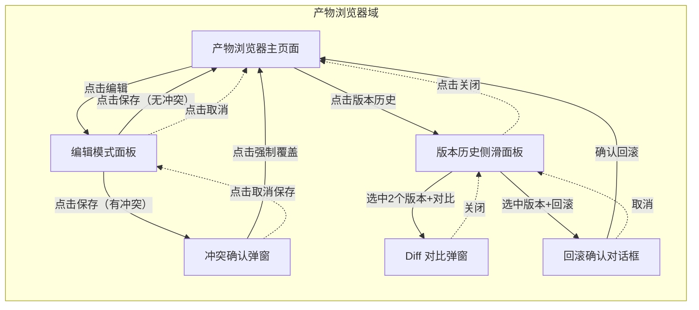
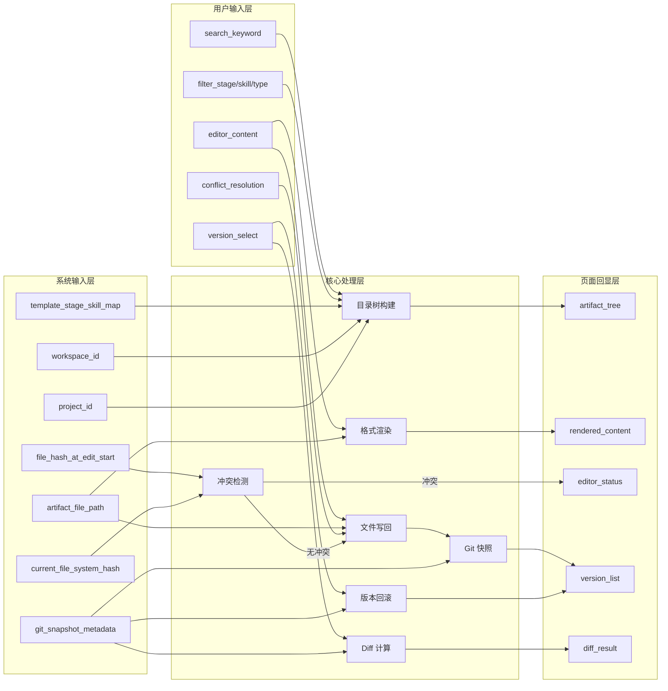
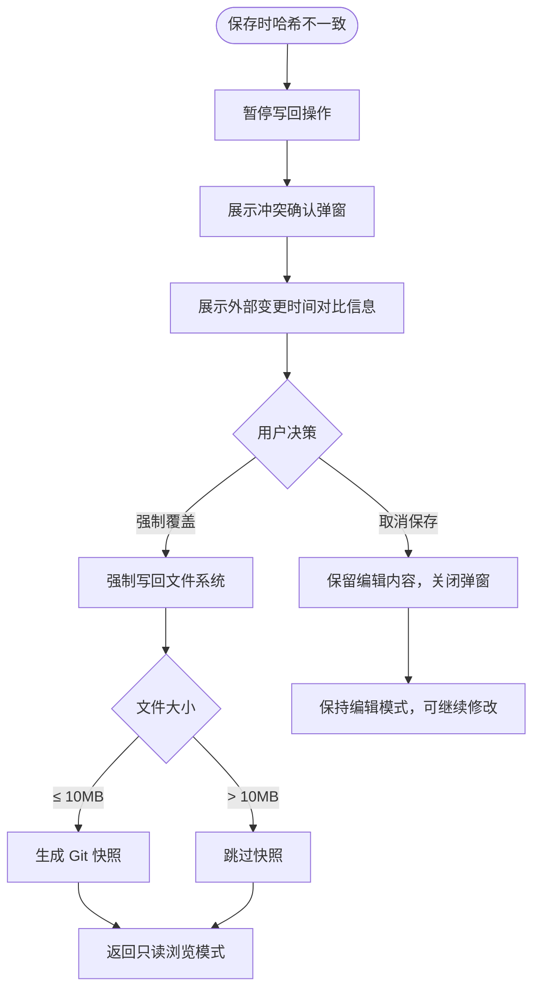
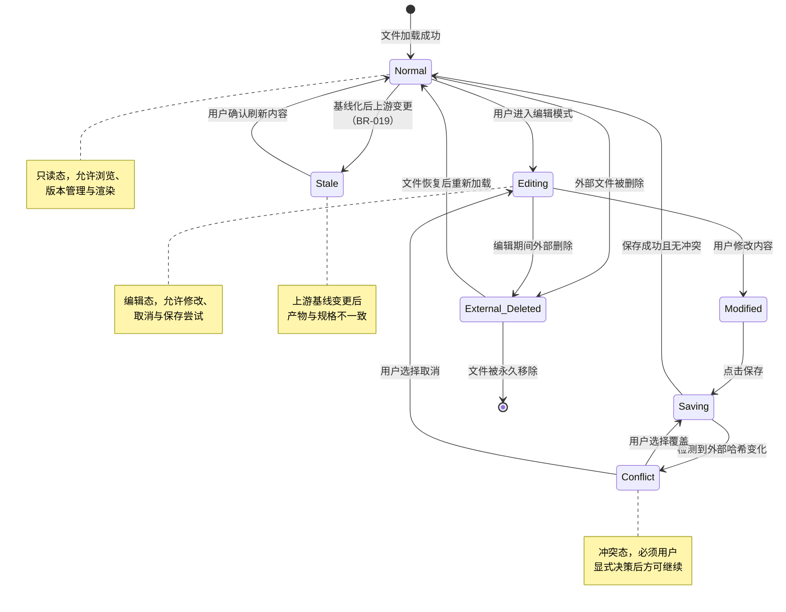
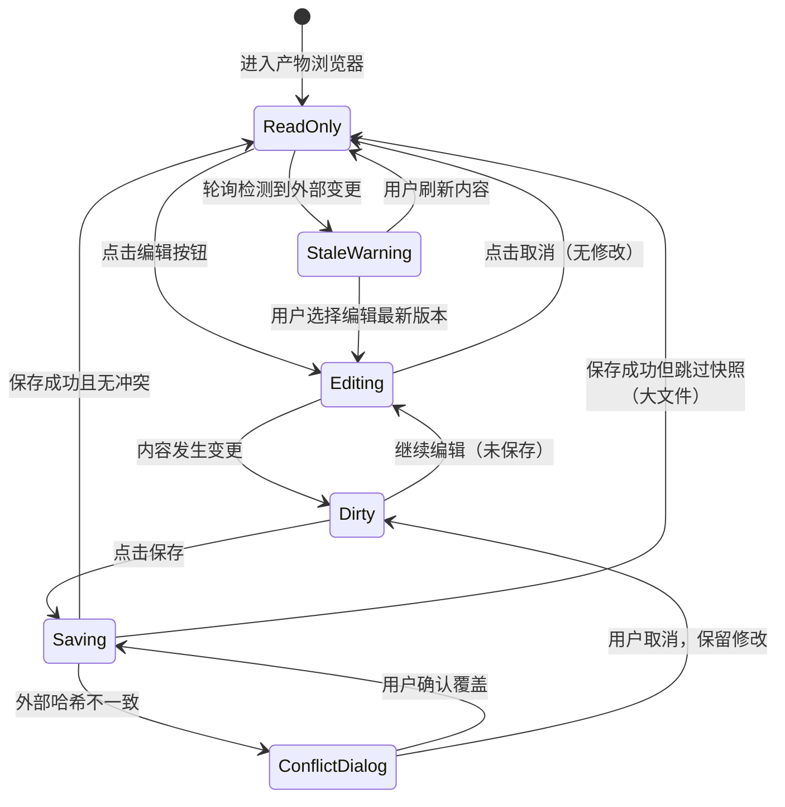
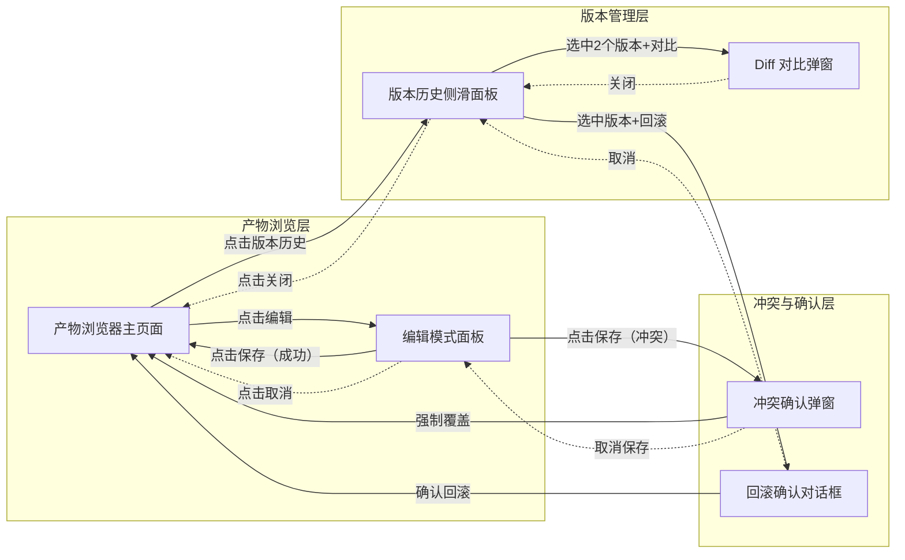

# DR-005：产物浏览器（产物 Viewer）模块详细需求

> **模块编号**：DR-005  
> **模块名称**：产物浏览器（产物 Viewer）  
> **关联需求**：REQ-P0-010（产物渲染）、REQ-P0-011（产物编辑）、REQ-P0-012（产物 Git 快照）、REQ-P0-024（产物目录树）  
> **关联用户故事**：US-004（浏览与编辑产物）、US-010（产物版本管理）  
> **版本**：v1.0  
> **状态**：Draft

---

## 1. 需求追溯与验收标准

### 1.1 需求追溯表

| 上游需求 ID | 需求简述 | 本模块功能点 | 覆盖优先级 |
|:-----------:|----------|--------------|:----------:|
| REQ-P0-010 | 产物渲染 | 多格式渲染引擎（Markdown、Mermaid、YAML、JSON、OpenAPI/Swagger）、大文件分页加载、外部删除检测 | Must |
| REQ-P0-011 | 产物编辑 | 平台内编辑、写回文件系统、保存时冲突检测与弹窗处理 | Must |
| REQ-P0-012 | 产物 Git 快照 | 自动 Git 快照、版本回滚、回滚操作作为独立版本记录 | Must |
| REQ-P0-024 | 产物目录树 | 按 Stage/Skill 组织的目录树、展开折叠、搜索、筛选、文件类型图标 | Must |

### 1.2 功能范围 IN/OUT 清单

**IN（范围内）**

| # | 功能点 | 说明 |
|:-:|:-------|:-----|
| IN-1 | 产物目录树浏览 | 按 Stage/Skill 层级组织的树形目录，支持展开/折叠、搜索、筛选、文件类型图标区分 |
| IN-2 | 多格式产物渲染 | 支持 Markdown、Mermaid、YAML、JSON、OpenAPI/Swagger 格式的格式化渲染 |
| IN-3 | 产物平台内编辑 | 在平台内进入编辑模式，修改产物内容并写回文件系统 |
| IN-4 | 保存冲突检测 | 保存前检测外部文件系统哈希变化，不一致时弹出确认弹窗 |
| IN-5 | 自动 Git 快照 | 保存成功后自动纳入 Git 快照（符合大小规则时） |
| IN-6 | 版本历史查看 | 查看产物最近版本列表，展示版本号、时间戳、操作类型、摘要 |
| IN-7 | 版本 Diff 对比 | 选择两个版本进行增删改高亮对比 |
| IN-8 | 版本回滚 | 将产物内容恢复至历史版本，并生成独立回滚记录 |
| IN-9 | 大文件分页加载 | 文件 > 10MB 时分页加载，首屏后支持手动加载更多 |
| IN-10 | 外部文件删除检测 | 通过哈希校验检测文件被外部删除或替换，给予用户明确提示 |
| IN-11 | 编辑实时预览 | 编辑模式下支持源码与渲染预览的双栏实时同步 |

**OUT（范围外）**

| # | 功能点 | 说明 | 归属模块 |
|:-:|:-------|:-----|:--------:|
| OUT-1 | Skill 执行与产物生成 | 具体 Skill 的执行编排与产物自动创建 | DR-003（阶段详情）、DR-008（Skill 执行器） |
| OUT-2 | 全局 Git 分支管理 | 跨文件版本对比、分支合并、全仓库回滚 | DR-013（历史） |
| OUT-3 | 产物创建/初始化 | 项目创建时产物目录的初始化与模板填充 | 各 Stage Skill 执行结果 |
| OUT-4 | 多用户实时协作编辑 | 多人同时编辑同一产物的冲突解决与实时同步 | 二期规划 |
| OUT-5 | 非文本产物渲染 | 图片、PDF、视频、二进制文件的预览与编辑 | MVP 不支持 |
| OUT-6 | 全量文件系统浏览器 | 超出 openspec/changes/{变更名} 范围的文件浏览 | 范围外 |

### 1.3 验收标准（AC Taxonomy）

| # | 类型 | 验收标准描述 | 质量分 |
|:--|:----:|:-------------|:------:|
| AC-01 | Behavioral | Given 用户在产物浏览器页面 When 点击目录树中某个 Markdown 文件 Then 系统在 500ms 内完成渲染并展示格式化内容 | 3 |
| AC-02 | Behavioral | Given 用户查看某个产物文件 When 点击"编辑"按钮 Then 界面切换为编辑模式，展示可编辑文本区与原格式预览双栏 | 3 |
| AC-03 | Behavioral | Given 用户在编辑模式下修改内容 When 点击"保存" Then 系统在 1s 内完成写回文件系统并自动生成 Git 快照，展示成功提示 | 3 |
| AC-04 | Behavioral | Given 用户查看产物目录树 When 输入搜索关键词 Then 目录树实时过滤，仅展示文件名或路径匹配的结果，响应延迟 < 200ms | 3 |
| AC-05 | Behavioral | Given 用户查看某个产物 When 点击"版本历史"按钮 Then 侧滑面板展示该产物的最近版本列表（最多 10 个），含版本号、时间、操作类型 | 3 |
| AC-06 | Behavioral | Given 用户在版本历史面板中选择两个版本 When 点击"对比" Then 弹窗展示 diff 视图，增行绿色高亮、删行红色高亮、改行黄色高亮 | 3 |
| AC-07 | Behavioral | Given 用户在版本历史中选择某个历史版本 When 点击"回滚"并确认 Then 系统在 1s 内将文件内容恢复至该版本，并生成一条独立的回滚版本记录 | 3 |
| AC-08 | Non-behavioral | 产物渲染完成时间 < 500ms（P95，文件大小 ≤ 10MB） | 3 |
| AC-09 | Non-behavioral | 编辑保存并写回文件系统 + Git 快照总耗时 < 1s（P95，常规大小文件） | 3 |
| AC-10 | Non-behavioral | 版本回滚操作完成时间 < 1s（P95） | 3 |
| AC-11 | Non-behavioral | 大文件（> 10MB）分页加载首屏 < 2s | 3 |
| AC-12 | Negative | 系统明确不支持非文本产物（如图片、PDF、视频、二进制文件）的渲染与编辑，遇到此类文件时展示"暂不支持该格式预览"占位 | 3 |
| AC-13 | Negative | 单文件 > 10MB 时系统不纳入自动 Git 快照，编辑保存时仅写回文件系统，版本历史中标记为"超大文件，无快照" | 3 |
| AC-14 | Edge case | Given 用户在编辑模式下保存时，外部文件系统已被其他程序修改 When 点击保存 Then 系统弹出冲突确认弹窗，提示"文件已被外部修改"，提供"覆盖"和"取消"选项，不自动覆盖 | 3 |
| AC-15 | Edge case | Given 用户正在浏览某个产物 When 该文件被外部删除 Then 系统检测到哈希不匹配/文件不存在，在目录树中该文件图标变为警告态，内容区展示"文件已被外部删除"提示 | 3 |
| AC-16 | Edge case | Given 用户连续快速点击保存按钮 3 次 When 系统正在处理第一次保存 Then 后续点击被防抖忽略，按钮保持 loading 态，不会生成重复快照 | 3 |
| AC-17 | Edge case | Given 产物文件数量为 0（空状态）When 用户进入产物浏览器 Then 展示空状态插画与"暂无产物"提示，目录树区域展示占位 | 2 |
| AC-18 | Dependency | 文件系统服务必须可用，能够读写 openspec/changes/ 目录下的产物文件 | 3 |
| AC-19 | Dependency | Git 快照服务必须可用，才能执行自动快照、版本列表查询与回滚操作 | 3 |

### 1.4 假设注册表

| # | 假设描述 | 影响范围 | 验证方式 |
|:-:|:---------|:---------|:---------|
| ASM-01 | 产物文件主要集中在 Markdown、YAML、JSON 格式，单个产物文件大小通常 < 1MB | 渲染性能、编辑体验、Git 快照策略 | 上线后埋点统计文件类型与大小分布 |
| ASM-02 | 用户在 MVP 阶段为单机使用，不存在多用户并发编辑同一文件的场景 | 冲突检测范围、编辑锁设计 | 产品决策确认 |
| ASM-03 | Git 快照仅保留最近 10 个版本，超出后自动清理最旧版本 | 版本列表展示、存储管理 | PRD 确认 |
| ASM-04 | 外部文件删除检测通过定时轮询（5s 间隔）或保存前校验触发，非实时文件系统监听 | 检测延迟、用户体验 | 技术方案评审 |
| ASM-05 | 产物目录树按 Stage/Skill 组织的元数据来自项目模板绑定关系，若模板未绑定则按物理文件夹结构展示 | 目录树构建逻辑 | PRD 确认 |

---

## 2. 原型与页面结构

### 2.1 页面清单

| 页面名称 | URL/入口 | 职责 |
|:---------|:---------|:-----|
| 产物浏览器主页面 | 嵌入 SDLC 编排视图或独立路由 `/app/{appId}/project/{projectId}/artifacts` | 目录树展示、产物渲染、编辑入口、版本管理入口 |
| 编辑模式面板 | 产物浏览器主页面 → 点击"编辑" | 双栏编辑（源码 + 实时预览），保存与取消操作 |
| 冲突确认弹窗 | 编辑模式下保存时检测到外部变更 | 提示用户选择强制覆盖或取消保存 |
| 版本历史侧滑面板 | 产物浏览器主页面 → 点击"版本历史" | 展示版本列表、diff 入口、回滚入口 |
| Diff 对比弹窗 | 版本历史侧滑面板 → 选中两个版本点击"对比" | 增删改高亮对比视图 |
| 回滚确认对话框 | 版本历史侧滑面板 → 选中版本点击"回滚" | 二次确认回滚操作后果 |

### 2.2 页面布局结构

#### 页面 A：产物浏览器主页面（Pg_ArtifactViewer）

**左侧：目录树面板**
- 顶部栏：
  - 搜索框（占位文案"搜索产物文件..."，带清除按钮）
  - 筛选下拉框：按 Stage / 按 Skill / 按文件类型（可多选）
- 主体区：
  - 树形层级结构：
    - 一级节点：Stage 名称（如"需求探索"、"概要设计"），可展开/折叠，带 Stage 状态图标
    - 二级节点：Skill 名称（如"high-level-design"），可展开/折叠
    - 三级节点：产物文件，带文件类型图标（Markdown、Mermaid、YAML、JSON、OpenAPI）
  - 当前选中文件高亮显示
  - 外部删除的文件图标变为警告态（红色感叹号）
- 空状态：树为空时展示"暂无产物"插画与提示文案

**右侧：内容渲染区**
- 顶部工具栏：
  - 左侧：文件路径面包屑（Stage > Skill > 文件名）
  - 中间：文件格式标签、文件大小、最后修改时间
  - 右侧：操作按钮组——"编辑"按钮（文本类产物可用）、"版本历史"按钮
- 主体内容区：
  - Markdown：富文本渲染，支持标题层级、代码块高亮、表格、列表
  - Mermaid：图表渲染（流程图、时序图、状态图等），渲染失败时展示"图表语法错误"占位
  - YAML/JSON：结构化树形展示，支持节点折叠/展开、键值高亮
  - OpenAPI/Swagger：API 文档格式化展示（路径、方法、参数、响应）
- 大文件警告条：文件 > 10MB 时顶部展示黄色警告"大文件，已启用分页加载"
- 分页加载区：大文件底部展示"已加载 X / Y 行"与"加载更多"按钮
- 空状态：未选择文件时展示"请从左侧目录树选择一个产物文件"

#### 页面 B：编辑模式面板（Pg_ArtifactEditor）

**顶部工具栏**
- 左侧：面包屑路径、文件格式标签
- 右侧："保存"主按钮（有修改时高亮，无修改时置灰）、"取消"按钮

**主体区（双栏布局）**
- 左栏：源码编辑区
  - 支持行号、语法高亮、自动缩进
  - YAML/JSON 格式在失去焦点时进行语法校验，非法时边框标红
- 右栏：实时预览区
  - 实时同步左栏内容的渲染效果
  - 预览区仅展示渲染结果，不可直接编辑

**底部状态栏**
- 左侧：字符数 / 行数统计
- 中间：当前光标位置（行:列）
- 右侧：最后保存时间戳

**外部变更警告条**
- 编辑期间若检测到外部文件变更，顶部展示黄色警告条"文件已被外部修改，保存时可能发生冲突"

#### 页面 C：冲突确认弹窗（Pg_ConflictConfirmDialog）

**弹窗主体**
- 警示图标（橙色三角形）
- 标题："检测到外部变更"
- 说明文案："该文件在编辑期间已被外部程序修改。直接覆盖将丢失外部修改，建议先取消并检查外部变更内容。"
- 辅助信息：展示"当前文件修改时间"与"编辑开始时的修改时间"对比

**弹窗底部**
- "取消保存"按钮（默认焦点）
- "强制覆盖"危险按钮（红色，需二次确认或明显视觉区分）

#### 页面 D：版本历史侧滑面板（Pg_VersionHistoryDrawer）

**面板头部**
- 产物文件名
- "关闭"按钮（右上角）
- 当前版本高亮标记说明

**版本列表区**
- 倒序排列，最多展示 10 条版本记录
- 每条记录包含：
  - 左侧复选框（用于选择对比版本）
  - 版本序号（如 v5、v4...）
  - 时间戳（相对时间，如"2 小时前"）
  - 操作类型标签：自动快照 / 手动保存 / 回滚记录
  - 提交摘要（保存时的前 30 字符摘要或系统生成的操作说明）
  - 当前版本徽章（最新版本高亮展示）
- 无历史记录时展示空状态"暂无版本记录"

**面板底部操作区**
- "对比选中版本"按钮（需恰好选中 2 个版本时可用，否则置灰）
- "回滚到选中版本"按钮（需单选 1 个非当前版本时可用）

#### 页面 E：Diff 对比弹窗（Pg_DiffViewerModal）

**弹窗头部**
- 标题："版本对比"
- 副标题：展示对比的两个版本号与对应时间戳
- "关闭"按钮

**主体区**
- 左右分栏或统一行内 diff 视图：
  - 增行：绿色背景，左侧带"+"标记
  - 删行：红色背景，左侧带"-"标记
  - 改行：黄色背景，左侧带"~"标记
  - 无变更行：默认背景，缩小字号或置灰以突出差异
- 支持行号展示
- 顶部提供图例说明三种高亮含义

**弹窗底部**
- "关闭"按钮

#### 页面 F：回滚确认对话框（Pg_RollbackConfirmDialog）

**对话框主体**
- 警示图标（红色）
- 标题："确认回滚版本？"
- 说明文案："回滚后当前内容将被替换为所选版本。当前内容将自动备份为一个新版本，以便需要时恢复。"
- 目标版本信息卡片：版本号、时间、操作类型

**对话框底部**
- "取消"按钮
- "确认回滚"危险按钮

### 2.3 关键交互流程描述

**流程 1：浏览产物**
1. 用户进入产物浏览器页面，左侧加载目录树
2. 用户点击目录树中某个产物文件节点
3. 右侧内容区展示骨架屏，系统在 500ms 内完成文件加载与格式渲染
4. 顶部工具栏更新文件元数据（路径、大小、修改时间）
5. 若文件 > 10MB，首屏仅加载前 N 行，底部展示分页控件
6. 后台启动 5s 间隔的外部变更轮询

**流程 2：编辑与保存产物**
1. 用户在产物浏览器点击"编辑"按钮，进入编辑模式面板
2. 左栏展示文件源码，右栏展示实时预览
3. 用户修改内容，底部状态栏实时更新字符数与光标位置
4. 用户点击"保存"，系统首先计算当前文件系统哈希
5. 若哈希与编辑开始时记录的一致，直接写回文件系统
6. 若文件 ≤ 10MB，自动生成 Git 快照，版本历史中新增记录
7. 保存成功，自动退出编辑模式，返回产物浏览器主页面，展示最新内容
8. 若哈希不一致，弹出冲突确认弹窗，等待用户决策

**流程 3：冲突处理**
1. 用户点击保存后，系统检测到外部文件哈希变化
2. 阻断写回操作，弹出冲突确认弹窗
3. 弹窗展示外部变更的时间对比信息
4. 用户选择"强制覆盖"：系统强制写回文件系统，生成快照（若符合规则），返回只读模式
5. 用户选择"取消保存"：关闭弹窗，返回编辑模式，保留所有编辑内容，用户可继续编辑或取消

**流程 4：版本管理与回滚**
1. 用户在产物浏览器点击"版本历史"按钮，右侧滑出版本历史面板
2. 面板展示最近最多 10 个版本记录
3. 用户勾选两个版本，点击"对比"，打开 Diff 对比弹窗查看差异
4. 用户单选一个历史版本，点击"回滚"，打开回滚确认对话框
5. 用户确认后，系统先将当前内容备份为新快照，再恢复所选版本内容到文件系统
6. 生成一条独立的"回滚记录"版本，版本列表刷新，当前内容更新

**流程 5：大文件分页加载**
1. 用户打开一个 > 10MB 的产物文件
2. 系统仅加载首屏内容（如前 500 行），顶部展示大文件警告条
3. 用户滚动至底部或点击"加载更多"，系统异步加载下一页
4. 加载过程中展示骨架屏，加载完成后追加到内容区

### 2.4 页面跳转图



---

## 3. 输入输出字段

### 3.1 用户输入字段表

| 字段名 | 所属页面/步骤 | 类型 | 必填 | 校验规则 | 示例值 |
|:-------|:-------------|:----:|:----:|:---------|:-------|
| search_keyword | 目录树搜索框 | 文本 | 否 | 0-64 字符；实时防抖（300ms）；首尾空格自动去除 | "design" |
| filter_stage | 目录树筛选 | 多选 | 否 | 枚举：项目模板中定义的 Stage 列表；可多选 | ["high-level-design"] |
| filter_skill | 目录树筛选 | 多选 | 否 | 枚举：项目模板中定义的 Skill 列表；可多选 | ["detailed-requirements"] |
| filter_file_type | 目录树筛选 | 多选 | 否 | 枚举：md / mermaid / yaml / json / openapi；可多选 | ["md", "yaml"] |
| editor_content | 编辑模式面板 | 多行文本 | 是（编辑时） | 无硬性长度限制（受内存约束）；YAML/JSON 需格式合法 | "# 概要设计<br>## 架构核心" |
| version_select_for_diff | 版本历史面板 | 多选 | 是（对比时） | 恰好选中 2 个不同版本 | ["v3", "v5"] |
| version_select_for_rollback | 版本历史面板 | 单选 | 是（回滚时） | 选中 1 个非当前版本 | "v2" |
| confirm_rollback | 回滚确认对话框 | 布尔 | 是 | 必须显式点击确认 | true |
| conflict_resolution | 冲突确认弹窗 | 枚举 | 是（冲突时） | overwrite / cancel | "overwrite" |

### 3.2 系统输入字段表

| 字段名 | 来源 | 类型 | 说明 |
|:-------|:-----|:----:|:-----|
| workspace_id | 全局状态 | 文本 | 当前激活的 Workspace 标识，决定数据隔离边界 |
| project_id | 全局状态 / URL 参数 | 文本 | 当前项目标识，产物文件路径的前缀组成部分 |
| artifact_file_path | 文件系统 | 文本 | 产物文件的绝对路径，基于 project_id 与目录树节点推导 |
| file_hash_at_edit_start | 编辑会话 | 文本 | 用户进入编辑模式时记录的文件内容哈希，用于保存时冲突检测 |
| current_file_system_hash | 文件系统 | 文本 | 保存前实时计算的文件系统哈希，与 file_hash_at_edit_start 对比 |
| git_snapshot_metadata | Git 快照服务 | 数组 | 该产物文件的快照元数据列表，驱动版本历史面板 |
| template_stage_skill_map | 项目模板 | 对象 | Stage-Skill 绑定关系，驱动目录树的层级组织结构 |
| file_size_bytes | 文件系统 | 整数 | 文件字节大小，用于大文件判断与 Git 快照规则（BR-007） |

### 3.3 页面回显字段表

| 字段名 | 所属页面 | 类型 | 说明 |
|:-------|:---------|:----:|:-----|
| artifact_tree | 产物浏览器主页面-左侧 | 树形结构 | 按 Stage/Skill/文件三级层级组织的目录树，含节点展开状态、选中状态、图标类型 |
| artifact_content_rendered | 产物浏览器主页面-右侧 | HTML / 对象 | 根据文件类型格式化后的渲染内容，Markdown 为富文本 HTML，YAML/JSON 为结构化树 |
| artifact_metadata | 产物浏览器主页面-顶部 | 对象 | 文件名、文件格式、文件大小（带单位转换）、最后修改时间（相对时间展示） |
| editor_status | 编辑模式面板 | 枚举 | ReadOnly / Editing / Dirty / Saving / Saved / Conflict |
| file_external_status | 产物浏览器主页面 / 目录树 | 枚举 | Normal / External_Modified / External_Deleted |
| version_list | 版本历史侧滑面板 | 数组 | 最多 10 条版本记录，每条含 version_id、timestamp、operation_type、summary、is_current |
| diff_result | Diff 对比弹窗 | 对象 | 增行数组（含行号、内容）、删行数组、改行数组，驱动高亮视图 |
| pagination_state | 产物浏览器主页面-右侧 | 对象 | 当前页码、总页数、已加载行数、总行数、是否有更多（大文件时展示） |

### 3.4 接口响应字段表（页面消费视角）

> 注：以下为页面消费的数据视角，非 API 端点规格。

| 字段名 | 消费页面 | 类型 | 说明 |
|:-------|:---------|:----:|:-----|
| artifact_tree_data | 产物浏览器主页面 | 树形数组 | 目录树完整数据，节点含 id、name、type、level、children、status、icon_type |
| rendered_content | 产物浏览器主页面 | 对象 / 文本 | 已渲染的 HTML 或结构化数据，消费端直接展示 |
| save_result | 编辑模式面板 | 对象 | success（布尔）、new_snapshot_id（文本或 null）、saved_at（时间戳）、write_back_duration_ms |
| conflict_detected | 编辑模式面板 | 布尔 | true 表示检测到外部哈希变化，需弹出冲突确认 |
| snapshot_list | 版本历史侧滑面板 | 数组 | 版本记录列表，每条含 snapshot_id、version_number、created_at、operation_type、summary |
| diff_data | Diff 对比弹窗 | 对象 | 对比结果，含 from_version、to_version、added_lines、removed_lines、modified_lines |
| rollback_result | 回滚确认对话框 | 对象 | success（布尔）、new_snapshot_id（回滚备份版本）、restored_version、rollback_duration_ms |

### 3.5 关键数据流转图



---

## 4. 业务逻辑与状态机

### 4.1 核心业务流程

#### 流程 1：浏览与渲染

```mermaid
flowchart TD
    START([用户点击目录树文件]) --> CHECK_EXIST{文件是否存在}
    CHECK_EXIST -->|不存在| DELETED[展示"文件已被外部删除"占位]
    CHECK_EXIST -->|存在| CHECK_SIZE{文件大小}
    CHECK_SIZE -->|> 10MB| PAGINATE[分页加载首屏内容]
    CHECK_SIZE -->|≤ 10MB| LOAD[全量加载文件内容]
    PAGINATE --> RENDER[根据文件格式渲染]
    LOAD --> RENDER
    RENDER --> DISPLAY[展示渲染内容]
    DISPLAY --> UPDATE_META[更新顶部工具栏元数据]
    UPDATE_META --> POLL[启动外部变更轮询定时器]
    DELETED --> MARK_TREE[目录树节点标记为警告态]
```

#### 流程 2：编辑与保存

```mermaid
flowchart TD
    START([用户点击编辑]) --> ENTER_EDIT[进入编辑模式，记录当前文件哈希]
    ENTER_EDIT --> MODIFY[用户修改内容，编辑器标记为 Dirty]
    MODIFY --> SAVE[用户点击保存]
    SAVE --> HASH_CHECK{当前文件系统哈希<br>与编辑开始时记录对比}
    HASH_CHECK -->|一致| VALIDATE{格式校验}
    HASH_CHECK -->|不一致| CONFLICT[弹出冲突确认弹窗]
    CONFLICT -->|用户选择覆盖| VALIDATE
    CONFLICT -->|用户选择取消| RETURN_EDIT[返回编辑模式，保留修改]
    VALIDATE -->|YAML/JSON 语法错误| SYNTAX_ERR[编辑器边框标红，提示语法错误]
    SYNTAX_ERR --> MODIFY
    VALIDATE -->|校验通过| WRITE[写回文件系统]
    WRITE --> SIZE_CHECK{文件大小}
    SIZE_CHECK -->|≤ 10MB| SNAPSHOT[生成 Git 快照]
    SIZE_CHECK -->|> 10MB| SKIP_SNAPSHOT[跳过快照，标记"无快照"]
    SNAPSHOT --> SUCCESS[退出编辑模式，返回只读浏览]
    SKIP_SNAPSHOT --> SUCCESS
    SUCCESS --> UPDATE_HISTORY[版本历史自动刷新]
    RETURN_EDIT --> MODIFY
```

#### 流程 3：冲突处理



#### 流程 4：版本回滚

```mermaid
flowchart TD
    START([用户选择版本并点击回滚]) --> CONFIRM[展示回滚确认对话框]
    CONFIRM -->|用户取消| ABORT[关闭对话框，保持当前内容]
    CONFIRM -->|用户确认| BACKUP[将当前内容备份为一个新快照]
    BACKUP --> RESTORE[从所选版本恢复内容到文件系统]
    RESTORE --> RECORD[生成"回滚记录"版本条目]
    RECORD --> REFRESH[刷新产物浏览器内容]
    REFRESH --> UPDATE_LIST[版本历史列表更新，回滚记录置顶]
```

### 4.2 业务规则映射

| 规则 ID | 规则描述 | 在本模块中的映射位置 | 违反表现 |
|:--------|:---------|:---------------------|:---------|
| BR-006 | 保存前检测外部文件系统哈希变化 | 编辑保存流程：保存前自动计算当前文件系统哈希，与编辑开始时记录的哈希对比；不一致时阻断写回，弹出冲突确认弹窗 | 用户未感知外部变更时直接覆盖，导致外部修改数据丢失 |
| BR-007 | 单文件 > 10MB 不纳入 Git 快照 | 保存流程中的 Git 快照节点：若文件大小 > 10MB，跳过快照生成步骤，在版本历史中该次保存标记为"超大文件，无快照" | 大文件导致 Git 仓库膨胀，快照与回滚操作耗时过长 |
| BR-019 | 基线化后变更触发 Stale 传播 | 产物写回成功后，若该产物关联的上游需求/设计文档已基线化，系统自动将该产物状态标记为 STALE，并向阶段详情模块（DR-003）传播刷新信号 | 基线化后产物与上游规格不一致，下游阶段基于过时产物继续推进 |
| BR-020 | 保留最近 10 个版本 | 版本历史面板：列表最多展示 10 条记录，新快照生成时若超出 10 条则自动清理最旧版本；回滚生成的备份与回滚记录均计入版本数 | 版本无限增长导致存储与查询性能下降 |

### 4.3 状态机

#### 产物文件状态机



#### 编辑会话状态机



### 4.4 异常处理策略

| 异常场景 | 触发时机 | 用户感知 | 系统行为 | 恢复策略 |
|:---------|:---------|:---------|:---------|:---------|
| 外部文件删除 | 轮询检测 / 保存前检测 / 点击文件时 | 目录树文件图标变警告态（红色感叹号），内容区展示"文件已被外部删除"占位，编辑按钮禁用 | 停止该文件的编辑与保存操作，保留最后一次成功渲染的缓存内容（仅展示用） | 用户在外部恢复文件后，点击刷新重新加载 |
| 保存冲突（外部变更） | 保存时哈希校验失败 | 弹出冲突确认弹窗，展示"文件已被外部修改"提示与时间对比 | 阻断写回操作，等待用户决策；编辑内容保留在内存中 | 用户选择覆盖或取消 |
| 大文件加载超时 | 打开 > 10MB 文件时 | 内容区展示骨架屏 2s，超时后提示"加载缓慢，已切换为分页模式" | 自动切换分页加载策略，仅加载首屏 | 用户点击"加载更多"逐页获取 |
| Git 快照失败 | 保存写回成功后 | toast 提示"文件已保存，但版本快照生成失败" | 文件系统写回已生效，Git 快照失败不影响文件内容；后台记录错误日志 | 后台异步重试或用户下次保存时触发重试 |
| 回滚目标版本损坏 | 回滚时读取历史版本 | 弹窗提示"该版本数据已损坏，无法回滚" | 终止回滚操作，保持当前文件内容不变 | 用户选择其他版本回滚或放弃回滚 |
| 连续快速保存 | 用户高频点击保存按钮 | 按钮保持 loading 禁用态，后续点击无响应 | 防抖处理，仅处理首次有效保存请求 | 等待首次请求完成 |
| 网络中断（保存时） | 点击保存后 | toast 提示"网络异常，请检查连接后重试"，保留编辑内容 | 请求失败不清理编辑状态，不生成快照 | 用户点击"重试"重新提交保存 |
| YAML/JSON 语法错误 | 编辑模式下失去焦点或保存时 | 编辑器边框标红，底部状态栏展示"格式错误：第 X 行" | 阻止保存操作，直至语法校验通过 | 用户修正语法错误后重新保存 |
| 版本列表加载失败 | 打开版本历史面板时 | 面板内展示错误占位"版本历史加载失败"+"重试"按钮 | 保留面板打开状态，等待用户重试 | 用户点击"重试"重新加载 |

---

## 5. 交互规格

### 5.1 按钮级交互状态机

#### 页面：产物浏览器主页面（Pg_ArtifactViewer）

##### 元素：目录树搜索框（#input-产物-search）

| 属性 | 说明 |
|:-----|:-----|
| 触发方式 | input（实时）+ Enter（强制） |
| 前置条件 | 目录树已加载且非空 |
| 立即反馈 | 输入停止 300ms 后触发搜索，匹配节点高亮，非匹配节点折叠或置灰；输入框右侧展示清除按钮（内容非空时） |
| 成功结果 | 目录树仅展示匹配节点及其父级路径，匹配文本高亮显示 |
| 失败结果 | 无匹配时目录树区域展示"未找到匹配产物"空状态提示 |
| 异常分支 | ① 输入超过 64 字符禁止继续输入；② 特殊字符允许常规中英文、数字、路径分隔符、横线、下划线、点号 |
| 埋点事件 | `artifact_search`，携带参数：`{keyword_length: number, result_count: number, project_id: string}`（仅在 Enter 或防抖触发后上报） |

##### 元素：目录树文件节点（#tree-node-{fileId}）

| 属性 | 说明 |
|:-----|:-----|
| 触发方式 | click |
| 前置条件 | 文件存在且未被外部删除；节点类型为文件（非 Stage/Skill 文件夹节点） |
| 立即反馈 | 节点高亮（主色调背景），其他节点去高亮；右侧内容区展示骨架屏 |
| 成功结果 | 内容区在 500ms 内完成渲染并展示文件内容；顶部工具栏更新文件元数据（路径、大小、修改时间） |
| 失败结果 | 文件加载失败 → 内容区展示错误占位"文件加载失败"+"重试"按钮 |
| 异常分支 | ① 文件被外部删除 → 节点图标变警告态，点击后内容区展示删除提示，编辑按钮禁用；② 大文件 → 首屏分页加载，底部出现"加载更多"按钮 |
| 埋点事件 | `artifact_open`，携带参数：`{file_id: string, file_type: string, file_size: number, project_id: string}` |

##### 元素：编辑按钮（#btn-edit-产物）

| 属性 | 说明 |
|:-----|:-----|
| 触发方式 | click |
| 前置条件 | 当前文件已加载成功；文件格式为可编辑文本类型（md / yaml / json / openapi / mermaid）；文件未被外部删除 |
| 立即反馈 | 按钮缩放动效（100ms），界面切换为编辑模式（Pg_ArtifactEditor），内容区替换为编辑器 |
| 成功结果 | 编辑模式正常加载，源码区展示当前文件内容，预览区展示实时渲染；底部状态栏展示字符数与光标位置 |
| 失败结果 | 编辑器加载异常 → 按钮恢复可点击，页面顶部展示 toast"编辑器加载失败，请刷新页面重试" |
| 异常分支 | ① 文件在点击编辑期间被外部删除 → 提示"文件已被删除，无法编辑"；② 产物状态为 STALE（BR-019）→ 顶部展示黄色警告条"该产物关联的规格已变更，编辑可能影响一致性" |
| 埋点事件 | `artifact_edit_click`，携带参数：`{file_id: string, file_type: string, project_id: string, is_stale: boolean}` |

##### 元素：版本历史按钮（#btn-version-history）

| 属性 | 说明 |
|:-----|:-----|
| 触发方式 | click |
| 前置条件 | 当前文件已加载成功 |
| 立即反馈 | 按钮进入 loading 态，右侧滑出版本历史面板（Pg_VersionHistoryDrawer） |
| 成功结果 | 面板展示该文件最近最多 10 个版本记录，当前版本高亮标记 |
| 失败结果 | 版本列表加载失败 → 面板内展示错误占位"加载失败"+"重试"按钮 |
| 异常分支 | ① 文件无快照历史（如始终 > 10MB）→ 面板展示"暂无版本记录"空状态；② 面板打开期间用户切换文件 → 面板自动刷新为当前文件的版本历史 |
| 埋点事件 | `artifact_version_history_open`，携带参数：`{file_id: string, project_id: string}` |

---

#### 页面：编辑模式面板（Pg_ArtifactEditor）

##### 元素：保存按钮（#btn-save-产物）

| 属性 | 说明 |
|:-----|:-----|
| 触发方式 | click |
| 前置条件 | 编辑内容相对原始内容有变更（Dirty 态）；编辑器无语法错误（YAML/JSON 需格式合法） |
| 立即反馈 | 按钮置灰禁用，文案变为"保存中..."，展示 loading spinner；底部状态栏展示"正在保存" |
| 成功结果 | 若无冲突，保存成功 → 自动退出编辑模式返回 Pg_ArtifactViewer，内容区展示最新内容，toast 提示"保存成功"；若文件 ≤ 10MB，版本历史中新增一条记录 |
| 失败结果 | 写回失败 → 按钮恢复可点击，编辑器内顶部展示红色错误条"保存失败：{具体原因}"，保留所有编辑内容 |
| 异常分支 | ① 检测到外部哈希变化 → 弹出冲突确认弹窗（Pg_ConflictConfirmDialog）；② 网络中断 → toast"网络异常，请检查连接后重试"+重试按钮；③ 文件在外部被删除 → 提示"文件已被删除，无法保存" |
| 埋点事件 | `artifact_save_click`，携带参数：`{file_id: string, project_id: string, content_length: number}`；保存成功后补报 `artifact_save_success`，携带参数：`{duration_ms: number, snapshot_id: string \| null}` |

##### 元素：取消按钮（#btn-cancel-edit）

| 属性 | 说明 |
|:-----|:-----|
| 触发方式 | click |
| 前置条件 | 当前处于编辑模式 |
| 立即反馈 | 若内容有修改（Dirty 态），弹出二次确认对话框"放弃未保存的修改？"；若无修改直接返回 |
| 成功结果 | 用户确认放弃 → 退出编辑模式返回 Pg_ArtifactViewer，内容区恢复为原始渲染内容 |
| 失败结果 | 无 |
| 异常分支 | 用户选择"继续编辑" → 关闭二次确认，留在编辑模式 |
| 埋点事件 | `artifact_edit_cancel`，携带参数：`{file_id: string, has_unsaved_changes: boolean, project_id: string}` |

---

#### 页面：冲突确认弹窗（Pg_ConflictConfirmDialog）

##### 元素：强制覆盖按钮（#btn-force-overwrite）

| 属性 | 说明 |
|:-----|:-----|
| 触发方式 | click |
| 前置条件 | 弹窗已展示，用户明确知晓外部变更风险 |
| 立即反馈 | 按钮置灰禁用，弹窗关闭，编辑模式展示"覆盖保存中..." |
| 成功结果 | 强制写回文件系统并生成快照（若文件 ≤ 10MB），返回 Pg_ArtifactViewer，toast 提示"已强制覆盖保存"，版本历史中新增记录 |
| 失败结果 | 写回失败 → 返回编辑模式，顶部展示错误提示"覆盖保存失败：{原因}" |
| 异常分支 | 网络中断 → 同保存按钮网络异常处理；文件被外部删除 → 提示"文件已被删除，无法覆盖" |
| 埋点事件 | `artifact_conflict_overwrite`，携带参数：`{file_id: string, project_id: string, external_change_detected: boolean}` |

##### 元素：取消保存按钮（#btn-cancel-save）

| 属性 | 说明 |
|:-----|:-----|
| 触发方式 | click |
| 前置条件 | 弹窗已展示 |
| 立即反馈 | 弹窗关闭，返回编辑模式，保留所有编辑内容 |
| 成功结果 | 用户可继续编辑或选择其他操作 |
| 失败结果 | 无 |
| 异常分支 | 无 |
| 埋点事件 | `artifact_conflict_cancel`，携带参数：`{file_id: string, project_id: string}` |

---

#### 页面：版本历史侧滑面板（Pg_VersionHistoryDrawer）

##### 元素：版本复选框（#checkbox-version-{versionId}）

| 属性 | 说明 |
|:-----|:-----|
| 触发方式 | click |
| 前置条件 | 版本列表已加载 |
| 立即反馈 | 复选框选中/取消选中，底部"对比"按钮状态动态更新（恰好选中 2 个时变为可用） |
| 成功结果 | 选中状态更新，若选中 2 个则"对比"按钮可用 |
| 失败结果 | 无 |
| 异常分支 | 选中超过 2 个 → 自动取消最早的一次选中，保持仅 2 个选中状态 |
| 埋点事件 | `artifact_version_select`，携带参数：`{file_id: string, version_id: string, selected_count: number}` |

##### 元素：对比按钮（#btn-compare-versions）

| 属性 | 说明 |
|:-----|:-----|
| 触发方式 | click |
| 前置条件 | 恰好选中 2 个版本 |
| 立即反馈 | 按钮进入 loading 态，打开 Diff 对比弹窗（Pg_DiffViewerModal） |
| 成功结果 | 弹窗展示两个版本的增删改高亮对比视图 |
| 失败结果 | diff 计算失败 → 弹窗内提示"对比失败，请重试" |
| 异常分支 | 选中版本之一数据损坏 → 提示"所选版本数据不完整，无法对比" |
| 埋点事件 | `artifact_version_compare`，携带参数：`{file_id: string, version_from: string, version_to: string}` |

##### 元素：回滚按钮（#btn-rollback-version）

| 属性 | 说明 |
|:-----|:-----|
| 触发方式 | click |
| 前置条件 | 单选某个版本，且该版本非当前最新版本 |
| 立即反馈 | 打开回滚确认对话框（Pg_RollbackConfirmDialog） |
| 成功结果 | 用户确认后 → 执行回滚，面板自动刷新版本列表，当前版本指向回滚后版本；产物浏览器内容区同步更新 |
| 失败结果 | 回滚失败 → 对话框关闭，面板内展示错误提示"回滚失败：{原因}" |
| 异常分支 | ① 选择当前版本 → 回滚按钮禁用，hover 提示"已为当前版本"；② 回滚目标版本数据损坏 → 提示"版本数据损坏，无法回滚" |
| 埋点事件 | `artifact_version_rollback_click`，携带参数：`{file_id: string, target_version: string}`；确认后补报 `artifact_version_rollback_confirm`，携带参数：`{duration_ms: number, new_version_id: string}` |

---

#### 页面：Diff 对比弹窗（Pg_DiffViewerModal）

##### 元素：关闭按钮（#btn-close-diff）

| 属性 | 说明 |
|:-----|:-----|
| 触发方式 | click |
| 前置条件 | 弹窗已打开 |
| 立即反馈 | 弹窗渐隐关闭，返回版本历史侧滑面板 |
| 成功结果 | 版本历史面板保持打开状态，选中状态保留 |
| 失败结果 | 无 |
| 异常分支 | 按 ESC 键 → 弹窗关闭 |
| 埋点事件 | `artifact_diff_close`，携带参数：`{file_id: string, from_version: string, to_version: string}` |

---

#### 页面：回滚确认对话框（Pg_RollbackConfirmDialog）

##### 元素：确认回滚按钮（#btn-confirm-rollback）

| 属性 | 说明 |
|:-----|:-----|
| 触发方式 | click |
| 前置条件 | 用户已明确了解回滚后果（对话框已展示目标版本信息） |
| 立即反馈 | 按钮置灰禁用，对话框关闭，内容区或面板展示"回滚中..." |
| 成功结果 | 回滚完成，自动关闭版本历史面板，返回 Pg_ArtifactViewer（当前页面），内容区更新为回滚后内容，Toast 提示"回滚成功，已生成回滚记录"；不跳转至其他模块页面 |
| 失败结果 | 回滚失败 → 返回版本历史面板，展示错误提示"回滚失败：{原因}" |
| 异常分支 | 网络中断 → 提示"网络异常，回滚失败"，保留当前文件内容不变；版本数据损坏 → 提示"版本数据损坏，回滚已取消" |
| 埋点事件 | `artifact_rollback_confirm`，携带参数：`{file_id: string, target_version: string}` |

---

### 5.2 页面间跳转关系图



---

## 附录：变更记录

| 版本 | 日期 | 修改人 | 修改内容 |
|:----:|:----:|:-------|:---------|
| v1.0 | 2026-06-01 | AI PM | 初始版本，包含 5 个标准章节（需求追溯与验收标准、原型与页面结构、输入输出字段、业务逻辑与状态机、交互规格） |
