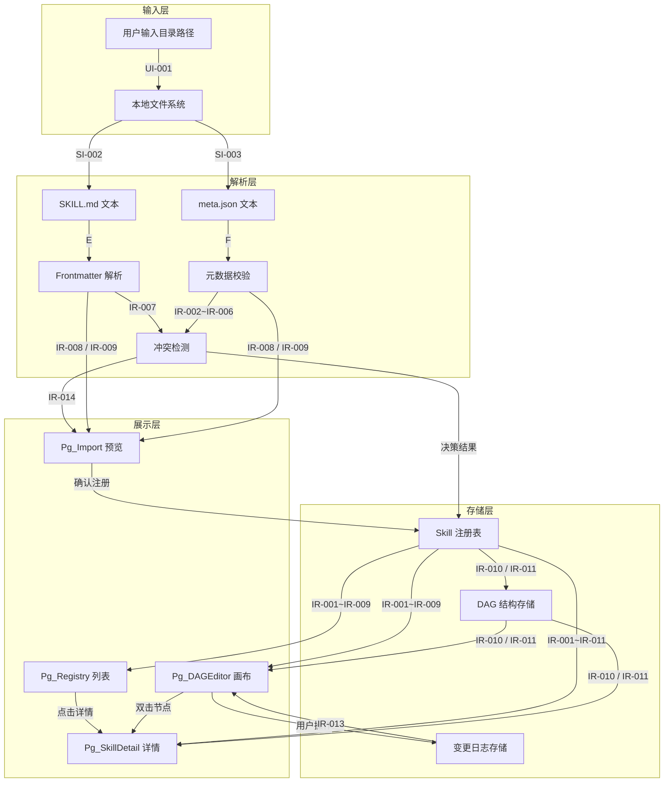
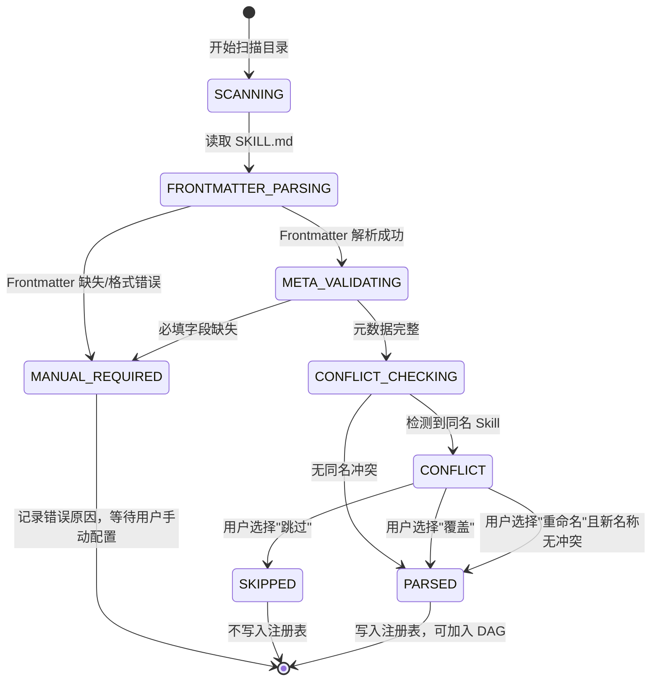
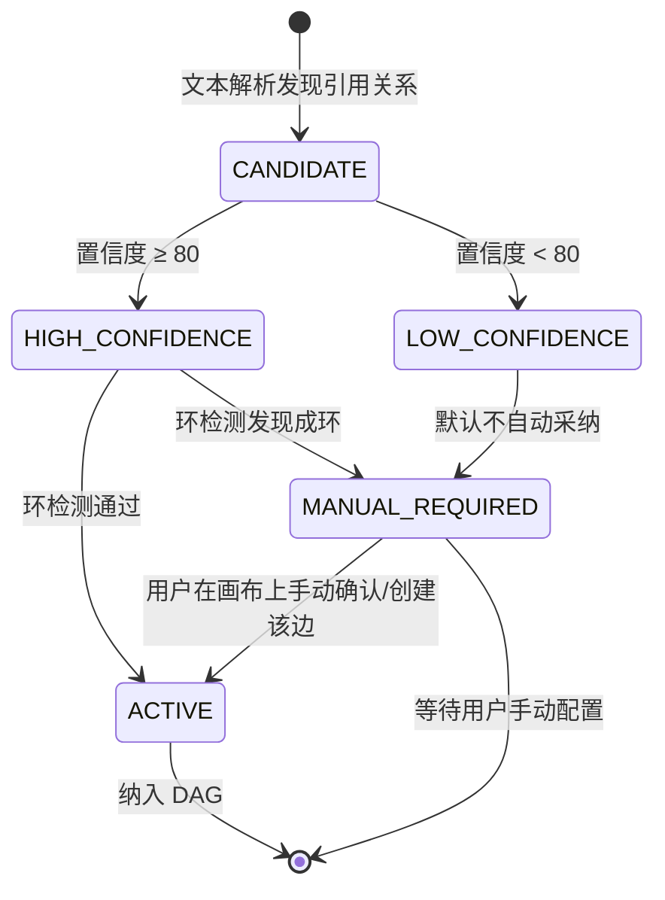
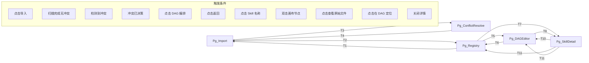

# DR-006 Skill 注册与 DAG 管理（Skill Registry & DAG Management）

> **模块编号**：DR-006  
> **模块名称**：Skill 注册与 DAG 管理  
> **关联需求**：REQ-P0-013（Skill 导入）、REQ-P0-014（DAG 自动解析）、REQ-P0-015（DAG 手动调整）  
> **关联用户故事**：US-005（导入与管理 Skill）  
> **版本**：v1.0  
> **状态**：Draft  
> **作者**：AI 产品经理  

---

## 1. 需求追溯与验收标准

### 1.1 需求追溯表

| 需求 ID | 需求名称 | 优先级 | 本模块覆盖范围 | 追溯依据 |
|---------|----------|--------|----------------|----------|
| REQ-P0-013 | Skill 导入 | P0 | 完整覆盖 | 用户指定本地目录，系统扫描并解析 SKILL.md + meta.json，输出解析结果与冲突处理 |
| REQ-P0-014 | DAG 自动解析 | P0 | 完整覆盖 | 基于 Frontmatter 引用关系构建 DAG，输出节点与边数据 |
| REQ-P0-015 | DAG 手动调整 | P0 | 完整覆盖 | 可视化画布编辑，支持节点与依赖边的增删改，记录变更日志 |

### 1.2 IN / OUT 清单

#### IN 范围（模块内必须实现）
- 本地文件系统目录路径的接收与合法性校验
- SKILL.md 的 YAML Frontmatter 解析（name、description）
- meta.json 的字段完整性校验（name, version, pattern, tags, platforms）
- 同名 Skill 的版本对比与冲突提示
- SKILL.md 中上下游 Skill 引用的文本解析
- DAG 有向无环图的构建与可视化渲染
- React Flow 画布上的节点拖拽、连线、删除操作
- 手动调整操作的变更日志记录
- 解析失败的 Skill 标记为"需手动配置"
- 画布节点库的自动更新

#### OUT 范围（模块内不实现，由其他模块处理）
- Skill 的具体执行与调用（由执行引擎模块负责）
- Skill 内容的在线编辑（由 Skill 编辑器模块负责）
- 远程 Skill 仓库的拉取与同步（由远程仓库模块负责）
- DAG 的执行调度与状态流转（由工作流引擎模块负责）
- 用户权限与团队协作管理（由用户管理模块负责）
- 系统级配置持久化与备份恢复（由系统管理模块负责）

### 1.3 验收标准分类（AC Taxonomy）

#### AC-F（功能性 Functional）

| AC ID | 验收标准 | 验收方法 | 优先级 |
|-------|----------|----------|--------|
| AC-F-001 | Given the user has provided a local directory path, When the system scans the directory, Then it shall complete scanning and parsing preview of all Skills under that directory within 2 seconds | 手动计时测试 | P0 |
| AC-F-002 | Given a directory contains both SKILL.md and meta.json files, When the system validates the directory, Then it shall recognize the directory as a valid Skill | 正例/反例测试 | P0 |
| AC-F-003 | Given a SKILL.md file is missing YAML Frontmatter, When the system parses the Skill, Then it shall mark the Skill as "MANUAL_REQUIRED" and display the error reason in the preview list | 边界测试 | P0 |
| AC-F-004 | Given meta.json is missing any required field (name, version, pattern, tags, or platforms), When the system validates the metadata, Then it shall mark the Skill as "MANUAL_REQUIRED" and indicate the specific missing field(s) | 边界测试 | P0 |
| AC-F-005 | Given a Skill with the same name as an already registered Skill is detected, When the system presents the conflict, Then it shall display the version comparison between the locally registered version and the newly imported version, and provide "Overwrite" and "Skip" options | 场景测试 | P0 |
| AC-F-006 | Given the system performs DAG auto-parsing, When the parsing is complete, Then the accuracy shall be no less than 80% and the system shall calculate and display the parsing confidence | 数据统计测试 | P0 |
| AC-F-007 | Given the DAG contains a Skill node that failed to parse, When the DAG is rendered, Then that node shall be visually distinguished (e.g., dashed border or warning color) without affecting the rendering or connections of other nodes | 视觉测试 | P0 |
| AC-F-008 | Given the user is on the DAG canvas, When the user performs drag-and-drop operations, Then the user shall be able to add new nodes from the palette, delete existing nodes, and create or delete dependency edges | 交互测试 | P0 |
| AC-F-009 | Given the user has manually adjusted the DAG, When any adjustment is made, Then the system shall automatically record a change log entry containing the operation type, target object, timestamp, pre-operation state, and post-operation state | 日志审计测试 | P0 |
| AC-F-010 | Given a new Skill has been successfully imported, When the import is confirmed, Then the canvas node library shall be automatically updated and the new Skill shall be searchable in the node library | 端到端测试 | P0 |

#### AC-P（性能 Performance）

| AC ID | 验收标准 | 验收方法 | 优先级 |
|-------|----------|----------|--------|
| AC-P-001 | Given 50 Skill directories on a standard SSD environment, When the system performs import and parsing, Then the total processing time shall be less than 2 seconds | 压力测试 | P0 |
| AC-P-002 | Given a DAG with 50 nodes and 80 edges, When the canvas is loaded for the first time, Then the initial render shall complete within 3 seconds | 性能测试 | P0 |
| AC-P-003 | Given a canvas with 50 nodes, When the user performs zoom or pan operations, Then the frame rate shall be no less than 30fps | 性能测试 | P1 |

#### AC-R（可靠性 Reliability）

| AC ID | 验收标准 | 验收方法 | 优先级 |
|-------|----------|----------|--------|
| AC-R-001 | Given a batch of Skills is being parsed, When a single Skill encounters an exception during parsing, Then the failure shall be isolated and shall not cause the entire batch to fail | 故障注入测试 | P0 |
| AC-R-002 | Given the user has performed a misoperation (e.g., deleting a critical dependency edge), When the user attempts to undo or redo, Then the system shall maintain undo/redo capability for at least 20 steps | 恢复测试 | P1 |
| AC-R-003 | Given the system has previously imported Skills and saved a DAG structure, When the system crashes or restarts, Then the imported Skill registry information and DAG structure shall be recoverable | 灾难恢复测试 | P1 |

#### AC-U（可用性 Usability）

| AC ID | 验收标准 | 验收方法 | 优先级 |
|-------|----------|----------|--------|
| AC-U-001 | Given a parsing error occurs, When the system presents the error message, Then the error message shall be in Chinese and clearly indicate the erroneous file path and specific reason | 走查 | P0 |
| AC-U-002 | Given the user is in the node library panel, When the user enters search keywords, Then the node library shall support filtering by name, pattern, and tags | 功能测试 | P1 |
| AC-U-003 | Given the user is interacting with the DAG canvas, When the user performs common operations, Then the interactions shall conform to common design tool conventions (scroll wheel to zoom, drag to pan, right-click context menu) | 可用性测试 | P1 |

#### AC-S（安全性 Security）

| AC ID | 验收标准 | 验收方法 | 优先级 |
|-------|----------|----------|--------|
| AC-S-001 | Given the user has specified a local directory, When the system accesses the file system, Then it shall only access the user-specified directory and shall not traverse parent directories or system-sensitive paths | 渗透测试 | P0 |
| AC-S-002 | Given a Skill file contains script code, When the system processes the file, Then the script code shall not be executed and shall only be statically parsed | 安全审计 | P0 |

#### AC-N（负向标准 Negative）

| AC ID | 验收标准 | 验收方法 | 优先级 |
|-------|----------|----------|--------|
| AC-N-001 | Given the user attempts to import Skills from a remote repository URL or network path, When the system validates the input, Then the system shall reject the operation and display a message indicating that remote Skill repository synchronization is not supported | 场景测试 | P1 |

### 1.4 假设注册表

| 假设 ID | 假设内容 | 影响范围 | 验证方式 | 风险等级 |
|---------|----------|----------|----------|----------|
| ASM-001 | 用户指定的本地目录具有读权限，且文件编码为 UTF-8 | 导入功能 | 导入前校验 | 中 |
| ASM-002 | SKILL.md 的 YAML Frontmatter 语法基本合规（存在 `---` 包裹） | Frontmatter 解析 | 解析异常时回退 | 中 |
| ASM-003 | meta.json 为有效 JSON 格式 | 元数据校验 | JSON 解析异常处理 | 低 |
| ASM-004 | 用户本地 Skill 数量在 MVP 阶段不超过 100 个 | 性能指标 | 压力测试验证 | 低 |
| ASM-005 | Skill 之间的上下游引用通过 Skill name 标识，而非文件路径 | DAG 解析 | PRD 基线确认 | 低 |
| ASM-006 | 用户具备基础的设计工具操作经验（拖拽、连线等） | 交互设计 | 可用性测试验证 | 低 |

---

## 2. 原型与页面结构

### 2.1 页面清单

| 页面 ID | 页面名称 | 入口条件 | 页面职责 |
|---------|----------|----------|----------|
| Pg_Import | Skill 导入页 | 用户点击"导入 Skill"按钮 | 接收目录路径输入，展示扫描预览与解析结果，处理冲突 |
| Pg_Registry | Skill 注册表页 | 默认入口 / 导入完成后跳转 | 展示已注册 Skill 列表，支持搜索、筛选、查看详情 |
| Pg_DAGEditor | DAG 编辑画布 | 用户点击"DAG 编排"或从注册表跳转 | 可视化 DAG 编辑，支持节点与边的增删改，展示变更日志 |
| Pg_SkillDetail | Skill 详情抽屉 / 弹窗 | 用户点击 Skill 名称或节点 | 展示单个 Skill 的元数据、Frontmatter 摘要、解析状态、关联上下游 |
| Pg_ConflictResolve | 冲突处理弹窗 | 导入检测到同名 Skill 时触发 | 展示版本对比，提供覆盖 / 跳过 / 重命名选项 |

### 2.2 文字化布局结构

#### Pg_Import（Skill 导入页）

```
┌─────────────────────────────────────────────────────────────┐
│  标题栏：Skill 导入                                    [?帮助] │
├─────────────────────────────────────────────────────────────┤
│  路径输入区                                                 │
│  ┌──────────────────────────────────────┐  [浏览...] [导入] │
│  │  /home/user/.agents/skills            │                  │
│  └──────────────────────────────────────┘                  │
├─────────────────────────────────────────────────────────────┤
│  解析预览区（导入后展开）                                    │
│  ┌─────────────────────────────────────────────────────────┐│
│  │  总计：12 个 Skill  │  成功：10  │  需手动配置：2        ││
│  ├─────────────────────────────────────────────────────────┤│
│  │  ✓ brainstorming      v1.0.0  generator  已就绪        ││
│  │  ✓ task-breakdown     v1.2.0  pipeline   已就绪        ││
│  │  ⚠ debug-assistant    v1.0.0  analyzer   缺少 platforms ││
│  │  ⚠ code-reviewer      —        —         缺少 SKILL.md  ││
│  │  ! code-review-skill  v1.1.0  reviewer   名称冲突       ││
│  └─────────────────────────────────────────────────────────┘│
├─────────────────────────────────────────────────────────────┤
│  操作栏：                              [取消]  [确认注册]    │
└─────────────────────────────────────────────────────────────┘
```

#### Pg_Registry（Skill 注册表页）

```
┌─────────────────────────────────────────────────────────────┐
│  标题栏：Skill 注册表              [+ 导入 Skill] [DAG 编排] │
├─────────────────────────────────────────────────────────────┤
│  筛选栏                                                     │
│  [搜索名称...]  [全部 pattern ▼]  [全部状态 ▼]  [全部平台 ▼] │
├─────────────────────────────────────────────────────────────┤
│  列表区                                                     │
│  ┌─────────────────────────────────────────────────────────┐│
│  │ 名称              │ 版本    │ Pattern   │ 状态    │ 操作 ││
│  ├─────────────────────────────────────────────────────────┤│
│  │ brainstorming     │ v1.0.0  │ generator │ 正常    │ 详情 ││
│  │ task-breakdown    │ v1.2.0  │ pipeline  │ 正常    │ 详情 ││
│  │ debug-assistant   │ v1.0.0  │ analyzer  │ 需配置  │ 配置 ││
│  └─────────────────────────────────────────────────────────┘│
└─────────────────────────────────────────────────────────────┘
```

#### Pg_DAGEditor（DAG 编辑画布）

```
┌─────────────────────────────────────────────────────────────┐
│  标题栏：DAG 编排                    [保存] [撤销] [重做]    │
├─────────────────────────────────────────────────────────────┤
│  ┌──────────┐  ┌─────────────────────────────────────────┐  │
│  │ 节点库    │  │                                         │  │
│  │          │  │           DAG 画布区                     │  │
│  │ 🔍 搜索...│  │                                         │  │
│  │          │  │    ┌─────────┐      ┌─────────┐         │  │
│  │ brainstorm│  │    │ 需求分析 │─────▶│ 概要设计 │         │  │
│  │ task-break│  │    └─────────┘      └─────────┘         │  │
│  │ code-revi │  │           │                  │          │  │
│  │ ...      │  │           ▼                  ▼          │  │
│  │          │  │    ┌─────────┐      ┌─────────┐         │  │
│  │ [拖拽添加]│  │    │ 详细需求 │      │ 接口定义 │         │  │
│  │          │  │    └─────────┘      └─────────┘         │  │
│  └──────────┘  │                                         │  │
│                │  [+] 放大  [-] 缩小  [⟲] 适应画布        │  │
│                └─────────────────────────────────────────┘  │
├─────────────────────────────────────────────────────────────┤
│  底部栏：变更日志（可折叠）                                   │
│  14:32  添加了节点 "detailed-design"                         │
│  14:30  删除了边 "brainstorming → high-level-design"         │
└─────────────────────────────────────────────────────────────┘
```

#### Pg_SkillDetail（Skill 详情抽屉）

```
┌────────────────────────────────────────┐
│  Skill 详情                    [× 关闭] │
├────────────────────────────────────────┤
│  名称：brainstorming                   │
│  版本：v1.0.0                          │
│  Pattern：generator                    │
│  标签：sdlc, requirement               │
│  平台：kimi, claude, cursor            │
│  状态：✓ 正常                          │
├────────────────────────────────────────┤
│  描述：                                │
│  当用户提到'新功能'、'变更需求'、'想法 │
│  探索'或任何模糊的产品/技术需求时触发。 │
├────────────────────────────────────────┤
│  上下游关系：                           │
│  上游：无                              │
│  下游：requirement-analysis, prd-gen   │
├────────────────────────────────────────┤
│  [在 DAG 中定位]  [查看 SKILL.md]      │
└────────────────────────────────────────┘
```

### 2.3 关键交互流程

#### 流程 A：Skill 导入完整流程

1. 用户在 Pg_Registry 点击"+ 导入 Skill"按钮
2. 系统打开 Pg_Import 弹窗 / 页面
3. 用户在路径输入框中填写或浏览选择本地目录路径
4. 用户点击"导入"按钮
5. 系统显示加载态，扫描目录
6. 系统完成扫描，在预览区展示解析结果列表（成功 / 需手动配置 / 冲突）
7. 若存在冲突，弹出 Pg_ConflictResolve，等待用户决策
8. 用户处理完所有冲突后，点击"确认注册"
9. 系统将成功解析的 Skill 写入注册表，更新节点库
10. 系统跳转至 Pg_Registry，展示更新后的 Skill 列表

#### 流程 B：DAG 手动调整流程

1. 用户在 Pg_Registry 点击"DAG 编排"按钮，进入 Pg_DAGEditor
2. 系统加载当前已注册 Skill 的 DAG，自动布局渲染
3. 用户从左侧节点库拖拽 Skill 到画布，添加新节点
4. 用户在节点连接桩之间拖拽连线，创建依赖边
5. 用户选中边后按 Delete 键，删除依赖关系
6. 每次操作后，底部变更日志自动追加记录
7. 用户点击"保存"按钮
8. 系统校验 DAG 无环性
9. 校验通过后，系统持久化 DAG 结构，清空变更日志
10. 系统展示保存成功提示

### 2.4 页面跳转图

```mermaid
flowchart LR
    subgraph 入口
        A[系统首页]
    end

    A -->|点击"Skill 管理"| Pg_Registry
    Pg_Registry -->|点击"+ 导入 Skill"| Pg_Import
    Pg_Import -->|点击"确认注册"| Pg_Registry
    Pg_Import -->|检测到同名冲突| Pg_ConflictResolve
    Pg_ConflictResolve -->|决策完成| Pg_Import
    Pg_Registry -->|点击"DAG 编排"| Pg_DAGEditor
    Pg_DAGEditor -->|点击"返回列表"| Pg_Registry
    Pg_Registry -->|点击 Skill 名称| Pg_SkillDetail
    Pg_DAGEditor -->|双击节点| Pg_SkillDetail
    Pg_SkillDetail -->|点击"在 DAG 中定位"| Pg_DAGEditor
    Pg_SkillDetail -->|点击关闭 / 遮罩层| Pg_Registry
    Pg_SkillDetail -->|点击关闭 / 遮罩层| Pg_DAGEditor
```

---

## 3. 输入输出字段

### 3.1 用户输入字段

| 字段 ID | 字段名称 | 字段类型 | 是否必填 | 输入约束 | 出现页面 |
|---------|----------|----------|----------|----------|----------|
| UI-001 | 本地目录路径 | 文本 | 是 | 非空字符串，最大长度 4096 字符，需为绝对路径格式 | Pg_Import |
| UI-002 | 冲突解决决策 | 单选 | 是（冲突时） | 枚举值：覆盖 / 跳过 / 重命名 | Pg_ConflictResolve |
| UI-003 | 重命名名称 | 文本 | 条件必填 | 当决策为"重命名"时必填，需符合 Skill 命名规范 | Pg_ConflictResolve |
| UI-004 | 节点库搜索关键字 | 文本 | 否 | 最大长度 100 字符，支持实时过滤 | Pg_DAGEditor |
| UI-005 | 注册表筛选条件 | 多选集合 | 否 | pattern / 状态 / 平台的组合筛选 | Pg_Registry |

### 3.2 系统输入字段

| 字段 ID | 字段名称 | 来源 | 数据说明 | 消费模块 |
|---------|----------|------|----------|----------|
| SI-001 | 本地文件系统句柄 | 操作系统 | 用户授权后的目录读取权限 | 本模块（导入扫描） |
| SI-002 | SKILL.md 原始文本 | 本地文件 | UTF-8 编码的 Markdown 文本 | 本模块（Frontmatter 解析） |
| SI-003 | meta.json 原始文本 | 本地文件 | UTF-8 编码的 JSON 文本 | 本模块（元数据校验） |
| SI-004 | 已注册 Skill 列表 | 注册表存储 | 当前系统中所有已注册 Skill 的元数据 | 本模块（冲突检测） |
| SI-005 | 当前 DAG 结构 | DAG 存储 | 节点列表与边列表 | 本模块（画布加载） |

### 3.3 页面回显字段

| 字段 ID | 字段名称 | 回显页面 | 数据来源 | 回显规则 |
|---------|----------|----------|----------|----------|
| PR-001 | Skill 扫描总数 | Pg_Import | 扫描结果统计 | 实时计算，导入完成后展示 |
| PR-002 | 解析成功数 | Pg_Import | 扫描结果统计 | 实时计算 |
| PR-003 | 需手动配置数 | Pg_Import | 扫描结果统计 | 实时计算，红色高亮 |
| PR-004 | 冲突数 | Pg_Import | 扫描结果统计 | 实时计算，橙色高亮 |
| PR-005 | Skill 解析状态图标 | Pg_Import / Pg_Registry | 解析结果 | ✓ 正常 / ⚠ 需配置 / ! 冲突 |
| PR-006 | 解析错误原因 | Pg_Import | 异常捕获信息 | 当状态为"需配置"时展示具体原因 |
| PR-007 | DAG 画布节点与边 | Pg_DAGEditor | DAG 存储 | 按自动布局算法渲染 |
| PR-008 | 节点库列表 | Pg_DAGEditor | 注册表存储 | 按注册时间倒序排列，支持搜索过滤 |
| PR-009 | 变更日志列表 | Pg_DAGEditor | 操作事件流 | 按时间倒序，最新操作置顶 |
| PR-010 | Skill 元数据详情 | Pg_SkillDetail | 注册表存储 | 展示 name / version / pattern / tags / platforms / description |
| PR-011 | 上下游 Skill 名称 | Pg_SkillDetail | DAG 存储 | 展示直接上游与直接下游 Skill 名称列表 |

### 3.4 接口响应字段（模块间数据契约）

| 字段 ID | 字段名称 | 数据类型 | 出现场景 | 说明 |
|---------|----------|----------|----------|------|
| IR-001 | Skill 唯一标识 | 字符串 | 全模块 | 由系统生成的内部唯一 ID |
| IR-002 | Skill 名称 | 字符串 | 全模块 | 取自 meta.json 的 name 字段 |
| IR-003 | Skill 版本 | 字符串 | 全模块 | 取自 meta.json 的 version 字段，语义化版本格式 |
| IR-004 | Skill Pattern | 枚举 | 全模块 | generator / pipeline / reviewer / analyzer / inversion / tool-wrapper |
| IR-005 | Skill 标签列表 | 字符串数组 | 全模块 | 取自 meta.json 的 tags 字段 |
| IR-006 | 支持平台列表 | 字符串数组 | 全模块 | 取自 meta.json 的 platforms 字段 |
| IR-007 | Frontmatter 描述 | 字符串 | 全模块 | 取自 SKILL.md Frontmatter 的 description 字段 |
| IR-008 | 解析状态 | 枚举 | 全模块 | PARSED / MANUAL_REQUIRED / CONFLICT / ERROR |
| IR-009 | 解析错误详情 | 字符串 | 解析失败时 | 人类可读的错误描述 |
| IR-010 | DAG 节点列表 | 对象数组 | DAG 交互 | 每个节点包含：节点 ID、Skill ID、位置坐标（x, y） |
| IR-011 | DAG 边列表 | 对象数组 | DAG 交互 | 每条边包含：边 ID、源节点 ID、目标节点 ID |
| IR-012 | 解析置信度 | 数值 | DAG 自动解析 | 0-100 的整数，表征自动解析的可信程度 |
| IR-013 | 变更日志条目 | 对象 | DAG 手动调整 | 包含：操作类型、操作对象 ID、操作前快照、操作后快照、时间戳 |
| IR-014 | 冲突信息 | 对象 | Skill 导入 | 包含：冲突 Skill 名称、已注册版本、新导入版本 |

### 3.5 数据流转图



---

## 4. 业务逻辑与状态机

### 4.1 核心业务流程

#### 流程 4.1.1：Skill 扫描与解析流程

1. **接收目录路径**：系统接收用户输入的本地目录路径
2. **目录合法性校验**：校验路径是否存在、是否为目录、是否具有读权限
3. **递归扫描**：遍历目录及子目录，识别包含 SKILL.md 和 meta.json 的文件夹
4. **逐 Skill 解析**：
   - 读取 SKILL.md，提取 YAML Frontmatter（name、description）
   - 读取 meta.json，校验必填字段（name, version, pattern, tags, platforms）
   - 若任一环节失败，标记该 Skill 为 MANUAL_REQUIRED，记录具体错误原因
5. **冲突检测**：将解析成功的 Skill 与已注册表比对，检测同名 Skill
6. **结果汇总**：生成扫描报告（总数 / 成功 / 需配置 / 冲突）
7. **用户确认**：用户查看预览，处理冲突，点击"确认注册"
8. **写入注册表**：将确认导入的 Skill 写入注册表，更新节点库

#### 流程 4.1.2：DAG 自动解析流程

1. **读取注册表**：获取所有解析状态为 PARSED 的 Skill 列表
2. **提取引用关系**：遍历每个 SKILL.md 的 Frontmatter 和正文，识别对其他 Skill name 的引用
3. **构建候选边**：将引用关系映射为候选依赖边（源 Skill → 目标 Skill）
4. **置信度计算**：基于引用位置（Frontmatter 显式声明权重高、正文提及权重低）计算每条候选边的置信度
5. **过滤低置信度边**：舍弃置信度低于阈值的候选边
6. **构建 DAG**：将节点（Skill）与过滤后的边组装为有向图
7. **环检测**：执行有向环检测，若发现环，将环内边标记为 MANUAL_REQUIRED
8. **输出结果**：生成 DAG 节点列表、边列表、各边置信度、需手动配置的节点/边清单

#### 流程 4.1.3：DAG 手动调整流程

1. **加载画布**：读取当前 DAG 结构，按自动布局算法渲染画布
2. **用户操作监听**：
   - 拖拽节点库 Skill 到画布 → 添加新节点
   - 在节点连接桩间拖拽 → 创建新边
   - 选中节点/边按 Delete → 删除节点/边
   - 拖拽节点位置 → 更新节点坐标
3. **操作校验**：
   - 创建边时校验：源节点与目标节点是否已存在、是否将形成环
   - 删除节点时校验：是否为孤立节点（无入边无出边可任意删除；有边连接需确认级联删除）
4. **变更记录**：每次操作生成变更日志条目（IR-013）
5. **保存操作**：
   - 用户点击"保存"
   - 系统执行全图环检测
   - 若存在环，阻止保存并提示用户
   - 若无环，持久化节点列表与边列表，清空待保存变更日志
6. **撤销/重做**：维护操作栈，支持用户撤销最近操作或重做已撤销操作

### 4.2 业务规则映射

| 规则 ID | 规则来源 | 规则内容 | 适用流程 | 违反后果 |
|---------|----------|----------|----------|----------|
| BR-012 | PRD 全局规则 | SKILL.md 解析失败时标记"需手动配置"，不阻塞其他 Skill 导入 | 扫描与解析 | 单点故障导致批量失败 |
| BR-013 | 本模块定义 | meta.json 缺失任一必填字段（name / version / pattern / tags / platforms）时，该 Skill 不得进入 PARSED 状态 | 元数据校验 | 不完整数据污染注册表 |
| BR-014 | 本模块定义 | 同名 Skill 导入时必须经过用户显式决策（覆盖 / 跳过 / 重命名），禁止静默覆盖 | 冲突处理 | 数据意外丢失 |
| BR-015 | 本模块定义 | DAG 必须保持有向无环，任何导致成环的操作在保存时被阻止 | 手动调整 | 循环依赖破坏执行语义 |
| BR-016 | 本模块定义 | 手动调整的变更日志在保存成功后归档，保存前保留在内存中 | 变更记录 | 无法审计用户操作 |
| BR-017 | 本模块定义 | 节点库仅展示解析状态为 PARSED 的 Skill，MANUAL_REQUIRED 状态的 Skill 需修复后才可加入 DAG | 画布编辑 | 未就绪节点被错误编排 |
| BR-018 | 本模块定义 | 删除画布节点时，级联删除其所有入边和出边 | 手动调整 | 遗留悬空边破坏图完整性 |

### 4.3 状态机

#### 4.3.1 Skill 解析状态机



#### 4.3.2 DAG 边置信度状态机



### 4.4 异常处理

| 异常 ID | 异常场景 | 触发条件 | 系统行为 | 用户感知 |
|---------|----------|----------|----------|----------|
| EX-001 | 目录不存在 | 用户输入的路径在文件系统上不存在 | 阻止导入，返回错误 | 路径输入框下方红色提示："指定目录不存在，请检查后重试" |
| EX-002 | 目录无读权限 | 操作系统拒绝目录读取 | 阻止导入，返回错误 | 提示："无法读取该目录，请检查文件权限" |
| EX-003 | SKILL.md 不存在 | 某子目录下缺少 SKILL.md | 标记该 Skill 为 MANUAL_REQUIRED | 预览列表中该 Skill 状态为 ⚠，原因："缺少 SKILL.md" |
| EX-004 | meta.json 不存在 | 某子目录下缺少 meta.json | 标记该 Skill 为 MANUAL_REQUIRED | 预览列表中该 Skill 状态为 ⚠，原因："缺少 meta.json" |
| EX-005 | Frontmatter 格式错误 | YAML 语法不合法或未包含 `---` 包裹 | 标记该 Skill 为 MANUAL_REQUIRED | 预览列表显示具体 YAML 解析错误信息 |
| EX-006 | meta.json 字段缺失 | 缺少 name / version / pattern / tags / platforms 任一 | 标记该 Skill 为 MANUAL_REQUIRED，提示缺失字段名 | 预览列表显示："meta.json 缺少必填字段：{字段名}" |
| EX-007 | 同名冲突 | 新导入 Skill 的 name 与已注册 Skill 相同 | 标记为 CONFLICT，弹出冲突处理弹窗 | Pg_ConflictResolve 展示版本对比 |
| EX-008 | DAG 成环 | 用户操作导致图中出现有向环 | 阻止当前操作或保存，提示成环路径 | 画布上方横幅提示："当前操作将形成循环依赖：A → B → C → A" |
| EX-009 | 节点库 Skill 重复拖拽 | 用户将同一 Skill 多次拖入画布 | 创建多个独立节点实例（允许同名不同实例） | 无异常，正常添加新节点 |
| EX-010 | 撤销栈耗尽 | 用户连续撤销超过栈容量 | 撤销按钮置灰不可用 | 无弹窗，按钮视觉提示不可操作 |

---

## 5. 交互规格

### 5.1 按钮级交互状态机

#### BTN-001：导入按钮（Pg_Import）

| 维度 | 规格 |
|------|------|
| **触发方式** | 鼠标左键单击 |
| **前置条件** | 路径输入框非空且已填写有效路径字符串 |
| **立即反馈** | 按钮进入加载态（显示旋转图标 + "扫描中..."），预览区清空旧数据 |
| **成功结果** | 预览区展开，展示扫描结果列表（成功 / 需配置 / 冲突的分组统计），按钮恢复为"重新导入" |
| **失败结果** | 按钮恢复可点击态，路径输入框下方展示具体错误（EX-001 / EX-002） |
| **异常分支** | 扫描过程中用户关闭页面：后台任务可继续执行，重新打开时展示进度 |
| **埋点事件** | `skill_import_scan_triggered`（携带路径长度、目录深度） |

#### BTN-002：确认注册按钮（Pg_Import）

| 维度 | 规格 |
|------|------|
| **触发方式** | 鼠标左键单击 |
| **前置条件** | 扫描已完成，且所有 CONFLICT 状态已解决（无未处理冲突） |
| **立即反馈** | 按钮置灰禁用，显示"注册中..." |
| **成功结果** | 关闭 Pg_Import，跳转至 Pg_Registry，顶部显示绿色 Toast："成功注册 X 个 Skill" |
| **失败结果** | 按钮恢复可点击态，展示错误详情（如存储写入失败） |
| **异常分支** | 注册过程中部分 Skill 写入失败：已成功的保留，失败的展示在错误报告中，用户可选择重试或忽略 |
| **埋点事件** | `skill_import_confirmed`（携带成功数、需配置数、跳过数） |

#### BTN-003：覆盖 / 跳过 / 重命名按钮（Pg_ConflictResolve）

| 维度 | 规格 |
|------|------|
| **触发方式** | 鼠标左键单击 |
| **前置条件** | 冲突弹窗已打开，展示完整版本对比信息 |
| **立即反馈** | 弹窗关闭，Pg_Import 预览列表中该 Skill 状态更新为对应结果 |
| **成功结果** | 覆盖：标记为待覆盖注册；跳过：标记为 SKIPPED；重命名：弹出输入框，校验新名称唯一性后标记为待注册 |
| **失败结果** | 重命名时新名称与现有 Skill 冲突：输入框下方红色提示"该名称已存在"，阻止弹窗关闭 |
| **异常分支** | 用户在冲突弹窗外点击遮罩关闭：视为"暂不处理"，该 Skill 保持 CONFLICT 状态，确认注册按钮保持禁用 |
| **埋点事件** | `skill_conflict_resolved`（携带决策类型：overwrite / skip / rename） |

#### BTN-004：DAG 编排按钮（Pg_Registry）

| 维度 | 规格 |
|------|------|
| **触发方式** | 鼠标左键单击 |
| **前置条件** | 注册表中至少存在 1 个 PARSED 状态的 Skill |
| **立即反馈** | 按钮进入加载态，页面切换动画 |
| **成功结果** | 进入 Pg_DAGEditor，画布渲染当前 DAG，左侧节点库加载所有 PARSED Skill |
| **失败结果** | 若 DAG 数据损坏无法加载，展示错误页："DAG 数据异常，请尝试重置" |
| **异常分支** | 无 PARSED Skill 时按钮置灰，hover 提示："请先导入至少一个 Skill" |
| **埋点事件** | `dag_editor_opened`（携带节点数、边数） |

#### BTN-005：保存按钮（Pg_DAGEditor）

| 维度 | 规格 |
|------|------|
| **触发方式** | 鼠标左键单击，快捷键 Ctrl+S |
| **前置条件** | 画布存在待保存的变更（变更日志非空） |
| **立即反馈** | 按钮置灰，显示"保存中..." |
| **成功结果** | 顶部显示绿色 Toast："DAG 保存成功"，变更日志清空，撤销栈重置 |
| **失败结果** | 环检测未通过：画布高亮成环节点与边，Toast 红色提示"存在循环依赖，请修正后保存" |
| **异常分支** | 保存过程中系统崩溃：重启后加载上一次成功保存的快照，未保存变更丢失 |
| **埋点事件** | `dag_saved`（携带节点数、边数、变更操作数） |

#### BTN-006：撤销 / 重做按钮（Pg_DAGEditor）

| 维度 | 规格 |
|------|------|
| **触发方式** | 鼠标左键单击，快捷键 Ctrl+Z（撤销）/ Ctrl+Y（重做） |
| **前置条件** | 撤销：操作栈非空；重做：撤销栈非空 |
| **立即反馈** | 画布即时回退/前进到上一/下一步状态，变更日志追加"撤销了 XXX"或"重做了 XXX" |
| **成功结果** | 画布状态同步更新，按钮状态根据栈深度自动切换可用/禁用 |
| **失败结果** | 无 |
| **异常分支** | 连续快速按键：防抖处理，仅响应最后一次有效操作 |
| **埋点事件** | `dag_undo_triggered` / `dag_redo_triggered` |

#### BTN-007：节点库 Skill 项（Pg_DAGEditor 左侧）

| 维度 | 规格 |
|------|------|
| **触发方式** | 鼠标拖拽（Drag）至画布释放（Drop） |
| **前置条件** | Skill 状态为 PARSED，未被画布禁用 |
| **立即反馈** | 拖拽过程中跟随鼠标显示 Skill 名称半透明浮层；进入画布有效区域时画布高亮 |
| **成功结果** | 画布新增该 Skill 对应的节点，位于释放坐标，自动吸附网格；变更日志追加记录 |
| **失败结果** | 释放位置不在画布区域内：浮层消失，无节点创建 |
| **异常分支** | 同一 Skill 重复拖拽：每次拖拽都创建独立的新节点实例，节点 ID 唯一 |
| **埋点事件** | `dag_node_added_from_palette`（携带 skill_name） |

#### BTN-008：删除键（Pg_DAGEditor 画布）

| 维度 | 规格 |
|------|------|
| **触发方式** | 键盘 Delete / Backspace 键 |
| **前置条件** | 画布上存在已选中的节点或边 |
| **立即反馈** | 选中项立即从画布移除（或显示删除确认弹窗，视配置而定） |
| **成功结果** | 节点删除：级联删除其所有关联边；边删除：仅移除该边；变更日志追加记录 |
| **失败结果** | 无 |
| **异常分支** | 选中的是唯一一个节点：正常删除，画布变为空图状态 |
| **埋点事件** | `dag_node_deleted` / `dag_edge_deleted` |

### 5.2 页面间跳转关系



### 5.3 全局快捷键规格

| 快捷键 | 作用页面 | 功能 | 冲突处理 |
|--------|----------|------|----------|
| Ctrl + S | Pg_DAGEditor | 保存当前 DAG | 浏览器默认保存页面行为被拦截 |
| Ctrl + Z | Pg_DAGEditor | 撤销上一步操作 | 浏览器默认撤销输入行为被拦截（当焦点不在输入框时） |
| Ctrl + Y | Pg_DAGEditor | 重做上一步操作 | 同上 |
| Delete | Pg_DAGEditor | 删除选中的节点或边 | 无冲突 |
| 滚轮上/下 | Pg_DAGEditor | 画布缩放 | 仅在画布区域生效，页面其他区域正常滚动 |
| 空格 + 拖拽 | Pg_DAGEditor | 画布平移 | 空格按下时画布区域切换为平移模式 |

---

## 附录 A：术语表

| 术语 | 定义 |
|------|------|
| Skill | Arsitect 框架中可编排的最小能力单元，由 SKILL.md 和 meta.json 定义 |
| Frontmatter | SKILL.md 文件头部由 `---` 包裹的 YAML 元数据区域 |
| DAG | 有向无环图（Directed Acyclic Graph），用于表达 Skill 之间的执行依赖关系 |
| 节点库 | DAG 编辑器左侧的 Skill 列表面板，用户可从中拖拽 Skill 到画布 |
| 解析置信度 | 系统自动识别 Skill 间依赖关系的可信程度评分（0-100） |
| 变更日志 | 记录用户在 DAG 画布上所有手动操作（增删改节点/边）的审计轨迹 |

## 附录 B：文档变更记录

| 版本 | 日期 | 变更内容 | 作者 |
|------|------|----------|------|
| v1.0 | 2026-06-01 | 初始版本，覆盖 REQ-P0-013/014/015 完整需求 | AI 产品经理 |
