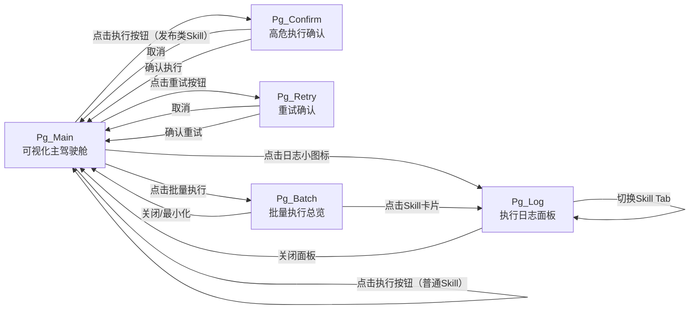
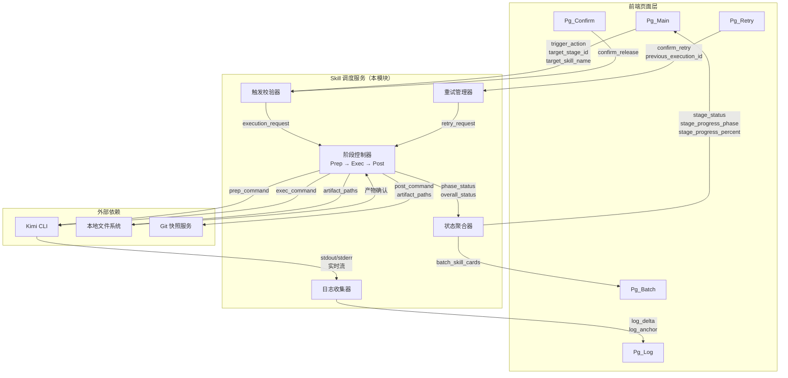
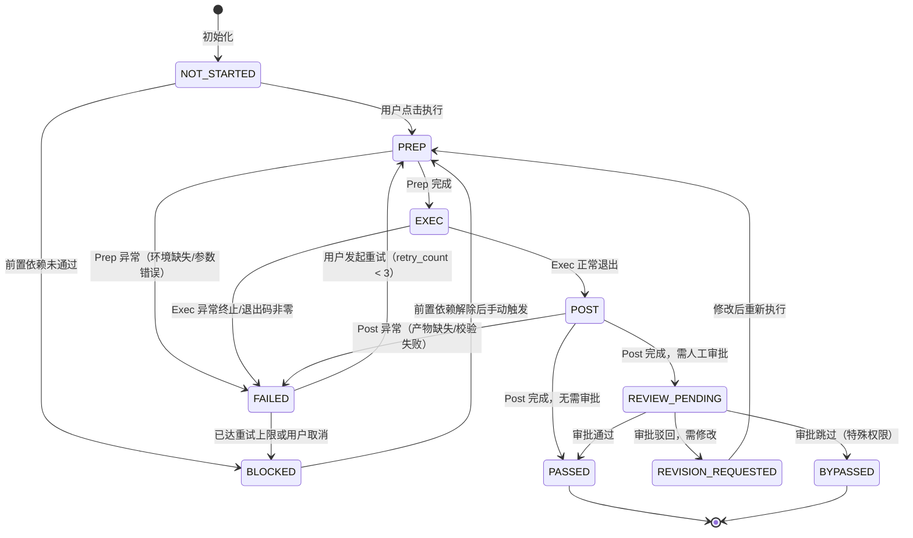
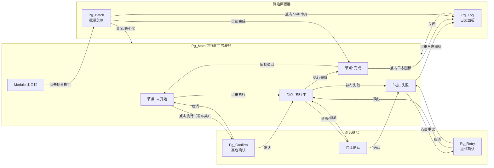

# 模块需求规格说明书：Skill 调度服务（Skill Executor Service）

| 属性 | 内容 |
|------|------|
| 模块编号 | DR-008 |
| 模块名称 | Skill 调度服务（Skill Executor Service） |
| 版本 | v1.0 |
| 关联需求 | REQ-P0-006、REQ-P0-007、REQ-P0-025 |
| 关联用户故事 | US-002（可视化执行 AI Skill） |
| 作者 | AI 产品经理 |
| 状态 | Draft |

---

## 1. 需求追溯与验收标准

### 1.1 需求追溯表

| 需求 ID | 需求名称 | 优先级 | 本模块覆盖范围 | 验收标准条目 |
|---------|----------|--------|----------------|--------------|
| REQ-P0-006 | Skill 执行触发 | P0 | 全部覆盖 | AC-F-001 ~ AC-F-006 |
| REQ-P0-007 | 实时状态同步 | P0 | 全部覆盖 | AC-NF-001 ~ AC-NF-003 |
| REQ-P0-025 | 执行日志 | P0 | 全部覆盖 | AC-F-007 ~ AC-F-010 |
| US-002 | 可视化执行 AI Skill | P0 | 全部覆盖 | AC-UX-001 ~ AC-UX-004 |

### 1.2 IN / OUT 清单

**IN 范围（本模块负责）**

- Stage 节点上的执行按钮点击触发 Skill 调度
- 单个 Skill 的执行生命周期管理（Prep → Exec → Post）
- 同一 Module 内无依赖 Skills 的批量并行执行调度
- Skill 执行状态的实时轮询与页面回显
- 执行日志的捕获、分组展示、搜索、过滤、下载
- 执行失败后的手动重试机制（最多 3 次）
- 发布相关 Skill 的人工确认拦截
- Stage 级成败判定（主 Skill 失败则 Stage 失败）

**OUT 范围（本模块不负责）**

- Kimi CLI 本身的安装、升级、环境配置
- AI 执行过程内部的推理逻辑与产物内容质量
- Git 快照的具体实现（仅触发 Git 快照请求）
- 审批流的人工审批界面（由 Gate 审批模块负责）
- 全局项目进度的汇总计算（由 Progress Tracker 模块负责）
- 日志的长期归档与冷存储

### 1.3 验收标准（AC Taxonomy）

#### Functional（功能类）

| ID | 验收标准 | 优先级 | 验证方式 |
|----|----------|--------|----------|
| AC-F-001 | Given the user is on the project canvas, When the user clicks the execute button on a Stage node, Then the system shall trigger the corresponding Skill within 3 seconds | P0 | 自动化测试 |
| AC-F-002 | Given multiple Skills within the same Module are marked as having no dependencies, When the batch execution is triggered, Then the system shall automatically execute those Skills in parallel | P0 | 自动化测试 |
| AC-F-003 | Given a Skill execution has completed, When the system persists the output artifacts, Then the artifact files shall be written to disk following the specified directory structure | P0 | 人工验收 |
| AC-F-004 | Given a Skill execution has failed, When the user initiates a manual retry from the current Stage node, Then the system shall allow the retry and enforce a maximum limit of 3 attempts | P0 | 自动化测试 |
| AC-F-005 | Given the target Skill is classified as a release-related Skill (e.g., release-management, finish, git-automation), When the user attempts to execute it, Then the system shall display a manual confirmation dialog and prohibit execution until the user explicitly confirms | P0 | 自动化测试 |
| AC-F-006 | Given the primary Skill of a Stage has failed, When the system evaluates the Stage status, Then the Stage shall be automatically marked as FAILED and subsequent downstream Skills shall be blocked from executing | P0 | 自动化测试 |
| AC-F-007 | Given execution logs are generated, When the user views the log panel, Then the logs shall be grouped by Skill instance and support keyword search and log-level filtering | P0 | 人工验收 |
| AC-F-008 | Given the user is viewing logs for a Skill instance, When the user triggers the download action, Then the system shall provide the entire log group as a `.log` text file | P1 | 人工验收 |
| AC-F-009 | Given a Skill is executing and producing real-time logs, When new log entries are generated, Then the system shall push them incrementally to the frontend so they are visible without page refresh | P0 | 人工验收 |
| AC-F-010 | Given multiple Skills are executing in a batch, When logs are generated by each instance, Then each Skill instance shall maintain an independent log group without cross-instance log mixing | P0 | 自动化测试 |

#### Non-Functional（非功能类）

| ID | 验收标准 | 优先级 | 验证方式 |
|----|----------|--------|----------|
| AC-NF-001 | Given a Skill execution is triggered, When the system processes the trigger request, Then the execution latency shall be ≤ 3 seconds at the 95th percentile | P0 | 性能测试 |
| AC-NF-002 | Given the system is synchronizing execution status in polling mode, When a status update occurs, Then the synchronization delay shall be ≤ 5 seconds at the 95th percentile | P0 | 性能测试 |
| AC-NF-003 | Given the system is capturing execution logs, When logs are produced by the CLI, Then the capture completeness shall be 100% with no lost lines, truncation, or out-of-order entries | P0 | 自动化测试 |
| AC-NF-004 | Given a single Skill is executing in a single-user scenario, When the frontend polls for status updates, Then the polling requests shall impose negligible system resource overhead | P1 | 性能测试 |

#### User Experience（体验类）

| ID | 验收标准 | 优先级 | 验证方式 |
|----|----------|--------|----------|
| AC-UX-001 | Given a Skill is executing, When the Stage node renders its status, Then it shall display a real-time progress animation clearly distinguishing the Prep, Exec, and Post phases | P0 | 人工验收 |
| AC-UX-002 | Given a Skill execution has completed, When the system updates the Stage node, Then the node color block and icon shall immediately reflect the result (success, failure, or pending approval) | P0 | 人工验收 |
| AC-UX-003 | Given the log panel is open, When new log output is produced, Then the panel shall auto-scroll to follow the latest output, and the user shall be able to manually pause auto-scrolling | P1 | 人工验收 |
| AC-UX-004 | Given a batch execution is in progress, When the user opens the batch overview, Then the user shall be able to view an independent progress card for each Skill in the overview area | P1 | 人工验收 |

#### Business Rule（业务规则类）

| ID | 验收标准 | 优先级 | 验证方式 |
|----|----------|--------|----------|
| AC-BR-001 | Given any Skill execution is initiated, When the system manages its lifecycle, Then it shall complete the full Prep → Exec → Post sequence without skipping any phase | P0 | 自动化测试 |
| AC-BR-002 | Given a Skill has been retried 3 times and still fails, When the system evaluates further actions, Then the retry button shall be disabled and the user shall be prompted to contact support | P0 | 自动化测试 |
| AC-BR-003 | Given a release-related Skill is about to be executed, When the confirmation dialog is displayed, Then it shall contain the Skill name, impact scope, and risk warning | P0 | 人工验收 |

#### Edge Case（边界与异常类）

| ID | 验收标准 | 优先级 | 验证方式 |
|----|----------|--------|----------|
| AC-EC-001 | Given the CLI process exits abnormally (e.g., terminated by the user), When the system detects the event, Then it shall mark the execution as FAILED within 5 seconds | P0 | 自动化测试 |
| AC-EC-002 | Given a previous execution of the same Skill is still in progress, When the user attempts to trigger it again, Then the system shall reject the duplicate trigger and prompt the user with an "execution in progress" message | P0 | 自动化测试 |
| AC-EC-003 | Given the system shuts down or crashes and then restarts, When the system recovers, Then any incomplete Skill executions shall be marked as UNKNOWN and the user shall be allowed to manually retry them | P1 | 自动化测试 |
| AC-EC-004 | Given the log output rate exceeds the frontend consumption capacity, When the frontend renders the log stream, Then it shall drop old frames to preserve the latest ones to avoid lag, and shall supplement key summaries after the rate recovers | P1 | 人工验收 |

#### Negative（否定类）

| ID | 验收标准 | 优先级 | 验证方式 |
|----|----------|--------|----------|
| AC-NG-001 | Given a Skill execution reaches REVIEW_PENDING or GATE_PENDING status, When the user attempts to perform the approval action within the Skill Executor module, Then the system shall not provide the approval interface and shall redirect the user to the Gate Approval module | P0 | 自动化测试 |
| AC-NG-002 | Given the user attempts to view aggregated global project progress within the Skill Executor module, When the request is made, Then the system shall not provide global progress aggregation and shall indicate that this function is handled by the Progress Tracker module | P1 | 自动化测试 |

### 1.4 假设注册表

| 编号 | 假设内容 | 影响范围 | 风险等级 |
|------|----------|----------|----------|
| ASM-001 | Kimi CLI 已正确安装且位于系统 PATH 中 | Skill 触发执行 | 高 |
| ASM-002 | 本地文件系统对产物目录具有读写权限 | 产物落盘 | 高 |
| ASM-003 | 用户单次只操作一个项目实例 | 状态轮询策略 | 中 |
| ASM-004 | 单用户场景下，并发执行的 Skill 数量不超过 5 个 | 批量调度策略 | 中 |
| ASM-005 | Skill 执行时长在常规范围内（单次 10 分钟以内） | 日志流与状态同步 | 低 |


version: v1.0
---

## 2. 原型与页面结构

### 2.1 页面清单

| 页面 ID | 页面名称 | 类型 | 说明 |
|---------|----------|------|------|
| Pg_Main | 可视化主驾驶舱 | 主页面 | SDLC 流程画布，Stage 节点嵌入执行入口 |
| Pg_Log | 执行日志面板 | 侧边抽屉 / 弹窗 | 按 Skill 分组的日志查看、搜索、过滤、下载 |
| Pg_Confirm | 高危执行确认对话框 | 模态对话框 | 发布类 Skill 执行前的人工确认 |
| Pg_Retry | 重试确认对话框 | 模态对话框 | 失败后的重试二次确认 |
| Pg_Batch | 批量执行总览浮层 | 浮层 / 侧边栏 | 批量执行时各 Skill 进度卡片聚合展示 |

### 2.2 文字化布局结构

#### Pg_Main · 可视化主驾驶舱

```
┌─────────────────────────────────────────────────────────────┐
│  顶部工具栏                                                  │
│  [项目选择器]  [保存]  [刷新]  [全局设置]                      │
├─────────────────────────────────────────────────────────────┤
│                                                             │
│                    SDLC 流程画布区域                          │
│                                                             │
│    ┌─────────┐         ┌─────────┐         ┌─────────┐     │
│    │ Stage 1 │ ──────▶ │ Stage 2 │ ──────▶ │ Stage 3 │     │
│    │ [▶执行] │         │ [▶执行] │         │ [▶执行] │     │
│    │ ●状态灯 │         │ ●状态灯 │         │ ●状态灯 │     │
│    └─────────┘         └─────────┘         └─────────┘     │
│                                                             │
│    Stage 节点内嵌：                                          │
│    - 阶段名称                                                │
│    - 状态色块（NOT_STARTED / PREP / EXEC / POST /            │
│      REVIEW_PENDING / PASSED / FAILED / BLOCKED）           │
│    - 执行按钮（悬停显示 Tooltip）                             │
│    - 进度环（执行中时旋转）                                   │
│    - 快捷日志入口（执行后显示小图标，点击展开 Pg_Log）         │
│                                                             │
│                    （画布支持拖拽、缩放）                      │
│                                                             │
├─────────────────────────────────────────────────────────────┤
│  底部状态栏                                                  │
│  [当前项目]  [最后同步: 2s前]  [运行中: 2个Skill]              │
└─────────────────────────────────────────────────────────────┘
```

#### Pg_Log · 执行日志面板

```
┌─────────────────────────────────────────────────────────────┐
│  日志面板                                              [×]  │
├─────────────────────────────────────────────────────────────┤
│  Skill 选择器（下拉 / Tab 切换）                              │
│  [Skill: requirement-analysis ▼]  [全部 | Prep | Exec | Post] │
├─────────────────────────────────────────────────────────────┤
│  工具栏                                                      │
│  [🔍 搜索日志...]  [级别: 全部 ▼]  [📥 下载]  [⏸ 暂停滚屏]   │
├─────────────────────────────────────────────────────────────┤
│  日志内容区（等宽字体，带行号，颜色区分级别）                  │
│  ─────────────────────────────────────────────────────────  │
│  [14:32:01] [INFO]  Prep 阶段开始：校验输入参数...            │
│  [14:32:02] [INFO]  环境准备完成，工作目录已切换              │
│  [14:32:03] [INFO]  Exec 阶段开始：调用 CLI...                │
│  [14:32:04] [INFO]  正在分析需求...                           │
│  ...                                                         │
│  ─────────────────────────────────────────────────────────  │
│  （新日志从底部追加，自动滚屏跟随）                            │
├─────────────────────────────────────────────────────────────┤
│  状态摘要                                                    │
│  总日志: 1,247 行 | 信息: 1,200 | 警告: 42 | 错误: 5         │
└─────────────────────────────────────────────────────────────┘
```

#### Pg_Confirm · 高危执行确认对话框

```
┌────────────────────────────────────────┐
│  ⚠️ 确认执行发布类 Skill          [×]  │
├────────────────────────────────────────┤
│                                        │
│  Skill 名称：release-management        │
│                                        │
│  影响范围：                             │
│  • 当前变更目录：openspec/changes/xxx  │
│  • 关联 Stage：发布上线                 │
│  • 潜在操作：归档、分支合并、CHANGELOG   │
│                                        │
│  风险提示：                             │
│  ⚠️ 此操作将修改项目文件并可能触发      │
│     Git 历史变更，执行后不可自动回退。   │
│                                        │
│  [取消]              [我已了解风险，确认执行] │
│                                        │
└─────────────────────────────────────────────────────────────┘
```

#### Pg_Batch · 批量执行总览浮层

```
┌─────────────────────────────────────────────────────────────┐
│  批量执行进度                                    [最小化] [×] │
├─────────────────────────────────────────────────────────────┤
│  ┌─────────────┐  ┌─────────────┐  ┌─────────────┐         │
│  │ requirement │  │   prd-gen   │  │ high-level  │         │
│  │ -analysis   │  │             │  │   -design   │         │
│  │ [████░░░░░░]│  │ [████████░░]│  │ [░░░░░░░░░░]│         │
│  │ PREP        │  │ POST        │  │ NOT_STARTED │         │
│  └─────────────┘  └─────────────┘  └─────────────┘         │
│  （每张卡片显示：Skill 名、迷你进度条、当前阶段、             │
│   点击卡片可跳转对应 Pg_Log）                                │
│                                                             │
└─────────────────────────────────────────────────────────────┘
```

### 2.3 关键交互流程

**流程 A：单次 Skill 执行（正常路径）**

1. 用户在 Pg_Main 点击目标 Stage 节点的"执行"按钮
2. 系统校验当前 Skill 是否处于可执行状态（NOT_STARTED 或 FAILED）
3. 系统检查是否为发布类 Skill，若是则弹出 Pg_Confirm 等待人工确认
4. 用户确认后，Stage 节点状态切换为 PREP，进度环进入 Prep 动画
5. Prep 完成后自动进入 EXEC，节点状态同步切换，日志实时流入 Pg_Log
6. Exec 完成后自动进入 POST，节点状态同步切换
7. Post 完成后状态变为 REVIEW_PENDING，节点色块更新为待审批色
8. 系统弹出 toast 通知："Skill 执行完成，等待审批"

**流程 B：批量 Skill 执行**

1. 用户在 Pg_Main 选中一个 Module（或系统自动识别 Module 边界）
2. 用户点击 Module 级"批量执行"按钮
3. 系统解析 Module 内 Skill 依赖图，识别无依赖节点集合
4. 弹出 Pg_Batch 浮层，展示所有待执行 Skill 卡片
5. 无依赖 Skills 同时进入 PREP，各卡片进度独立更新
6. 某 Skill 完成后，系统自动检查是否解锁下游 Skill，若解锁则自动启动
7. 全部 Skill 完成后，Pg_Batch 显示总览摘要，用户可关闭浮层

**流程 C：执行失败与重试**

1. Skill 在执行过程中异常终止，状态变为 FAILED
2. 节点色块变红，显示错误图标，快捷日志入口高亮
3. 用户点击节点上的"重试"按钮（原执行按钮变为重试按钮）
4. 弹出 Pg_Retry 二次确认："第 X 次重试（最多 3 次）"
5. 用户确认后，Skill 状态重置，重新走 Prep → Exec → Post
6. 若第 3 次重试仍失败，重试按钮禁用，提示"已达重试上限"

### 2.4 页面跳转图



---

## 3. 输入输出字段

### 3.1 字段总表

#### 用户输入字段

| 字段名 | 类型 | 必填 | 来源页面 | 说明 |
|--------|------|------|----------|------|
| trigger_action | 枚举 | 是 | Pg_Main | 用户触发动作：SINGLE_EXECUTE / BATCH_EXECUTE / RETRY |
| target_stage_id | 字符串 | 是 | Pg_Main | 目标 Stage 节点的唯一标识 |
| target_skill_name | 字符串 | 条件必填 | Pg_Main | 目标 Skill 名称，单次执行时必填 |
| confirm_release | 布尔 | 条件必填 | Pg_Confirm | 发布类 Skill 的人工确认勾选 |
| confirm_retry | 布尔 | 条件必填 | Pg_Retry | 重试确认，失败后才可触发 |
| log_search_keyword | 字符串 | 否 | Pg_Log | 日志搜索关键词 |
| log_level_filter | 枚举 | 否 | Pg_Log | 日志过滤级别：ALL / INFO / WARN / ERROR / DEBUG |
| auto_scroll | 布尔 | 否 | Pg_Log | 是否自动滚屏跟随，默认 true |
| selected_skill_for_log | 字符串 | 否 | Pg_Log | 当前查看日志的 Skill 实例标识 |

#### 系统输入字段

| 字段名 | 类型 | 来源 | 说明 |
|--------|------|------|------|
| project_root_path | 字符串 | 项目配置 | 当前打开项目的本地根目录绝对路径 |
| active_change_name | 字符串 | 项目配置 | 当前变更名称，如 "SDLC-visualizer" |
| skill_definition_path | 字符串 | 系统推导 | 目标 Skill 的 SKILL.md 文件绝对路径 |
| dependency_graph | 对象 | 系统解析 | 当前 Module 内 Skill 依赖关系图 |
| is_release_skill | 布尔 | 系统标记 | 目标 Skill 是否属于发布相关类型 |
| retry_count | 整数 | 系统记录 | 当前 Skill 已重试次数，0~3 |
| previous_execution_id | 字符串 | 系统记录 | 上一次执行实例标识，重试时关联 |

#### 页面回显字段

| 字段名 | 类型 | 展示页面 | 说明 |
|--------|------|----------|------|
| stage_status | 枚举 | Pg_Main | Stage 当前状态，驱动节点色块与图标 |
| stage_progress_phase | 枚举 | Pg_Main | 执行阶段：PREP / EXEC / POST / NONE |
| stage_progress_percent | 整数 | Pg_Main | 执行进度百分比估算（0~100） |
| execution_start_time | 日期时间 | Pg_Main / Pg_Log | 本次执行开始时间 |
| execution_elapsed_seconds | 整数 | Pg_Main / Pg_Batch | 已执行秒数 |
| log_entries | 数组 | Pg_Log | 日志条目列表，每条含时间戳、级别、内容 |
| log_total_count | 整数 | Pg_Log | 当前过滤条件下的日志总条数 |
| batch_skill_cards | 数组 | Pg_Batch | 批量执行时各 Skill 的状态卡片数据 |
| is_retry_available | 布尔 | Pg_Main | 当前是否允许重试（失败且 retry_count < 3） |
| is_execute_locked | 布尔 | Pg_Main | 当前是否禁止执行（执行中或已达重试上限） |

#### 接口响应字段（系统内部数据交互）

| 字段名 | 类型 | 说明 |
|--------|------|------|
| execution_id | 字符串 | 本次执行实例全局唯一标识 |
| current_phase | 枚举 | 当前 PocketFlow 阶段：PREP / EXEC / POST |
| phase_status | 枚举 | 阶段结果：RUNNING / COMPLETED / FAILED |
| overall_status | 枚举 | 整体执行状态：NOT_STARTED / RUNNING / SUCCESS / FAILED / UNKNOWN |
| status_timestamp | 日期时间 | 状态最后一次变更时间 |
| log_delta | 数组 | 增量日志条目，自上次轮询后的新增内容 |
| log_anchor | 字符串 | 日志游标标识，用于增量拉取定位 |
| artifact_paths | 数组 | 本次执行生成的产物文件路径列表 |
| error_summary | 字符串 | 失败时的简要错误描述，用于前端展示 |
| error_detail | 字符串 | 失败时的详细错误信息，可选 |

### 3.2 数据流转图



---

## 4. 业务逻辑与状态机

### 4.1 核心业务流程：PocketFlow 三阶段

**阶段一：Prep（准备阶段）**

1. 接收执行触发请求，生成全局唯一的 execution_id
2. 校验输入完整性：project_root_path、skill_definition_path、active_change_name 必须有效
3. 校验环境就绪：目标 SKILL.md 文件存在且可读，工作目录可写
4. 组装执行上下文：将项目路径、变更名、前置产物路径等封装为上下文对象
5. 检查前置依赖 Skill 是否已全部通过（PASSED 或 BYPASSED），未通过则标记 BLOCKED
6. Prep 阶段完成后，状态推进至 EXEC

**阶段二：Exec（执行阶段）**

1. 基于执行上下文构造 Kimi CLI 调用指令
2. 启动 CLI 子进程，建立 stdout / stderr 实时流捕获通道
3. 持续读取输出流，按行解析并写入日志缓冲区，同时标记时间戳与级别
4. 监控子进程生命周期，区分正常退出与异常终止
5. Exec 阶段完成后，若退出码正常则状态推进至 POST；若异常则状态变为 FAILED

**阶段三：Post（收尾阶段）**

1. 收集 Exec 阶段生成的产物文件，校验产物清单与预期一致性
2. 触发 Git 快照请求，记录执行前后的代码状态
3. 更新 Stage 节点状态为 REVIEW_PENDING（常规 Skill）或 GATE_PENDING（需审批 Skill）
4. 归档本次执行的完整日志与元数据
5. 释放执行占用的临时资源

### 4.2 业务规则映射

| 规则 ID | 规则名称 | 规则描述 | 在本模块中的体现位置 |
|---------|----------|----------|----------------------|
| BR-016 | PocketFlow 三阶段强制 | 所有 Skill 执行必须完整经历 Prep → Exec → Post，不允许跳过任一阶段 | PhaseController 的核心流程定义；阶段推进必须顺序执行，不允许从外部直接注入某个阶段状态 |
| BR-005 | 失败重试限制 | 节点执行失败后，用户可手动重试，最多 3 次 | RetryManager 维护 retry_count 计数器；Pg_Main 中重试按钮在第 3 次失败后禁用 |
| BR-010 | 发布类 Skill 人工拦截 | AI 禁止自动执行发布相关 Skill | TriggerValidator 识别 is_release_skill=true 时，强制弹出 Pg_Confirm，未收到 confirm_release=true 则拒绝执行 |
| BR-020 | 主 Skill 失败即 Stage 失败 | 主 Skill 失败则 Stage 失败，并阻断后续 | StatusAggregator 在 overall_status=FAILED 时，将对应 stage_status 置为 FAILED，并向下游依赖 Skill 传播 BLOCKED 状态 |

### 4.3 Skill 级状态机



**状态说明**

| 状态 | 含义 | 用户可见性 |
|------|------|------------|
| NOT_STARTED | 未开始，等待触发 | 是，灰色节点 |
| PREP | 准备阶段执行中 | 是，蓝色旋转进度 |
| EXEC | 执行阶段进行中 | 是，蓝色旋转进度 |
| POST | 收尾阶段进行中 | 是，蓝色旋转进度 |
| REVIEW_PENDING | 执行完成，等待人工审批 | 是，黄色节点 |
| PASSED | 执行与审批均通过 | 是，绿色节点 |
| FAILED | 执行失败 | 是，红色节点 |
| REVISION_REQUESTED | 审批驳回，需修改后重试 | 是，橙色节点 |
| BYPASSED | 被跳过（特殊场景） | 是，浅灰色节点 |
| BLOCKED | 因前置依赖失败而无法执行 | 是，深灰色节点带锁图标 |

### 4.4 异常处理

| 异常场景 | 检测时机 | 处理策略 | 用户反馈 |
|----------|----------|----------|----------|
| Kimi CLI 未安装或不在 PATH | Prep 阶段 | 标记 FAILED，记录错误摘要 | Pg_Main 节点变红，tooltip 提示"CLI 未配置" |
| SKILL.md 文件丢失或不可读 | Prep 阶段 | 标记 FAILED，阻断执行 | 提示"Skill 定义文件缺失" |
| 工作目录无写权限 | Prep 阶段 | 标记 FAILED | 提示"目录权限不足" |
| 前置依赖 Skill 未通过 | Prep 阶段 | 标记 BLOCKED | 提示"请先完成前置阶段" |
| CLI 子进程异常退出（被杀死/崩溃） | Exec 阶段 | 5 秒内捕获，标记 FAILED | 提示"执行被中断" |
| CLI 输出流解析失败 | Exec 阶段 | 继续捕获原始文本，标记 WARN | 日志区显示原始内容，提示"部分日志格式异常" |
| 产物文件未按预期生成 | Post 阶段 | 标记 FAILED | 提示"产物生成异常" |
| Git 快照请求失败 | Post 阶段 | 记录 WARN，不阻断主流程 | 提示"快照记录失败，但不影响执行结果" |
| 前端轮询超时 | 状态同步 | 标记 UNKNOWN，允许手动重试 | 提示"状态同步中断，请手动刷新" |
| 同一 Skill 重复触发 | 触发校验 | 拒绝请求 | 提示"执行中，请勿重复触发" |

---

## 5. 交互规格

### 5.1 按钮级交互状态机

#### BTN-001：执行按钮（Stage 节点内）

| 维度 | 规格 |
|------|------|
| 触发方式 | 鼠标左键单击 |
| 前置条件 | stage_status 为 NOT_STARTED 或 FAILED（且 retry_count < 3）；非执行中状态 |
| 立即反馈 | 按钮呈现按下态（150ms），节点边框高亮脉冲动画 |
| 成功结果 | 触发 Prep 阶段，按钮变更为"停止"图标，节点进入进度动画 |
| 失败结果 | 若校验不通过（如前置依赖未满足），弹出 toast 提示失败原因，按钮恢复原态 |
| 异常分支 | 网络中断或前端异常：按钮恢复可点击态，提示"触发失败，请重试" |
| 埋点事件 | `skill_execute_triggered` { skill_name, stage_id, trigger_mode: single } |

#### BTN-002：批量执行按钮（Module 工具栏）

| 维度 | 规格 |
|------|------|
| 触发方式 | 鼠标左键单击 |
| 前置条件 | Module 内至少存在一个 NOT_STARTED 状态的 Skill；无执行中 Skill（或用户显式确认） |
| 立即反馈 | 按钮 loading 态，弹出 Pg_Batch 浮层，展示待执行 Skill 卡片 |
| 成功结果 | 无依赖 Skills 并行进入 PREP，各卡片进度独立更新 |
| 失败结果 | 依赖解析失败时，toast 提示"依赖图解析异常"，Pg_Batch 关闭 |
| 异常分支 | 若 Module 内存在执行中 Skill，弹出二次确认："已有 Skill 执行中，是否强制启动新批次？" |
| 埋点事件 | `skill_batch_execute_triggered` { module_id, skill_count } |

#### BTN-003：重试按钮（失败态 Stage 节点）

| 维度 | 规格 |
|------|------|
| 触发方式 | 鼠标左键单击 |
| 前置条件 | stage_status 为 FAILED；retry_count < 3；非执行中 |
| 立即反馈 | 弹出 Pg_Retry 对话框，显示当前重试次数与上限 |
| 成功结果 | 用户确认后，Skill 状态重置，重新执行 Prep → Exec → Post |
| 失败结果 | 用户取消，对话框关闭，节点保持 FAILED 态 |
| 异常分支 | 若后端重试校验失败（如 execution_id 过期），提示"重试链接已失效，请手动刷新" |
| 埋点事件 | `skill_retry_triggered` { skill_name, stage_id, retry_count } |

#### BTN-004：日志查看按钮（Stage 节点内，执行后显示）

| 维度 | 规格 |
|------|------|
| 触发方式 | 鼠标左键单击小图标 |
| 前置条件 | 当前 Stage 至少完成过一次执行（存在日志记录） |
| 立即反馈 | 图标高亮，从右侧滑出 Pg_Log 面板，自动加载该 Skill 的最新日志 |
| 成功结果 | Pg_Log 展示完成，日志区自动滚屏至底部 |
| 失败结果 | 日志加载失败时，Pg_Log 显示"日志加载异常"占位图 |
| 异常分支 | 日志文件过大时，先加载最近 500 行，顶部显示"历史日志加载中"进度提示 |
| 埋点事件 | `log_panel_opened` { skill_name, execution_id, source: stage_node } |

#### BTN-005：日志下载按钮（Pg_Log 工具栏）

| 维度 | 规格 |
|------|------|
| 触发方式 | 鼠标左键单击 |
| 前置条件 | Pg_Log 已加载日志，log_total_count > 0 |
| 立即反馈 | 按钮进入 loading 态，触发浏览器文件下载行为 |
| 成功结果 | 下载完成，文件名格式：`{skill_name}_{execution_id}_{timestamp}.log` |
| 失败结果 | 下载失败时，按钮恢复，toast 提示"下载失败，请重试" |
| 异常分支 | 若日志文件超过 50MB，弹出确认："日志较大（XX MB），确认下载？" |
| 埋点事件 | `log_downloaded` { skill_name, execution_id, line_count, file_size } |

#### BTN-006：停止执行按钮（执行中态）

| 维度 | 规格 |
|------|------|
| 触发方式 | 鼠标左键单击 |
| 前置条件 | Stage 处于 PREP / EXEC / POST 任一执行中状态 |
| 立即反馈 | 弹出二次确认对话框："强制终止可能导致产物不完整，确认停止？" |
| 成功结果 | 用户确认后，向 CLI 进程发送终止信号，状态变为 FAILED，日志追加终止标记行 |
| 失败结果 | 用户取消，对话框关闭，执行继续 |
| 异常分支 | 若进程已自然结束但前端状态未同步，提示"执行已结束，状态同步中" |
| 埋点事件 | `skill_execution_aborted` { skill_name, stage_id, abort_phase } |

### 5.2 页面间跳转关系



---

## 附录：术语表

| 术语 | 解释 |
|------|------|
| Skill | Arsitect 框架中定义的 AI 工作流单元，以 Markdown 形式描述特定场景下的行动规范 |
| Stage | SDLC 流程画布中的节点，对应软件交付链路中的一个阶段（如需求分析、编码实现） |
| Module | 一个 Stage 内可包含多个 Skill，这些 Skill 构成一个 Module |
| PocketFlow | Skill 执行的三阶段生命周期模型：Prep（准备）→ Exec（执行）→ Post（收尾） |
| execution_id | 单次 Skill 执行实例的全局唯一标识 |
| 发布相关 Skill | 涉及生产环境变更或关键归档操作的 Skill，如 release-management、finish、git-automation |
| 主 Skill | 一个 Stage 中负责核心产出的关键 Skill，其失败直接导致 Stage 失败 |
