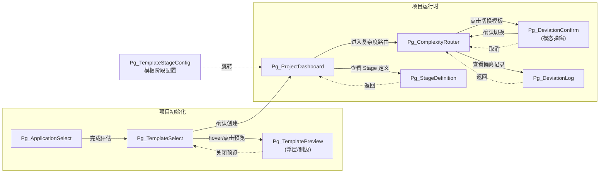
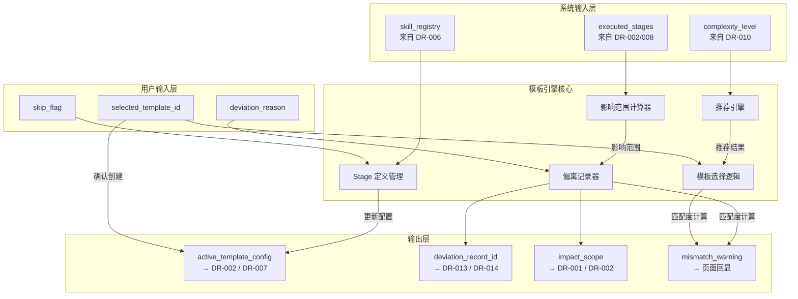
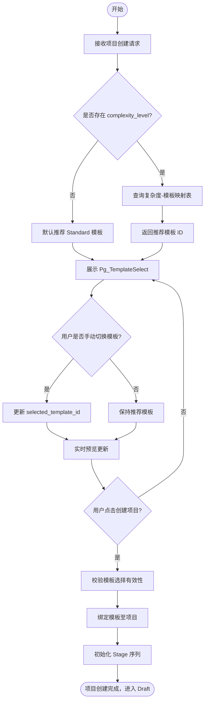
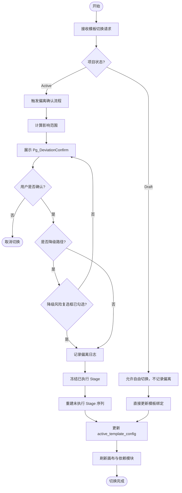
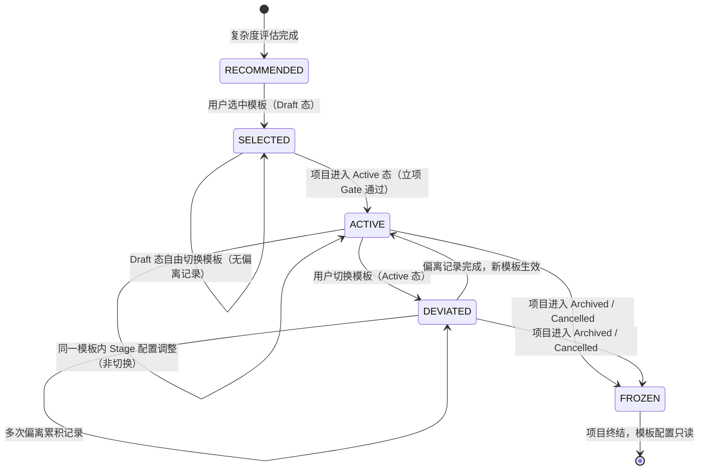
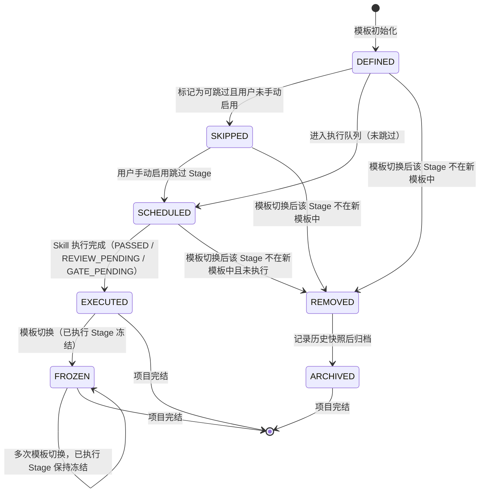
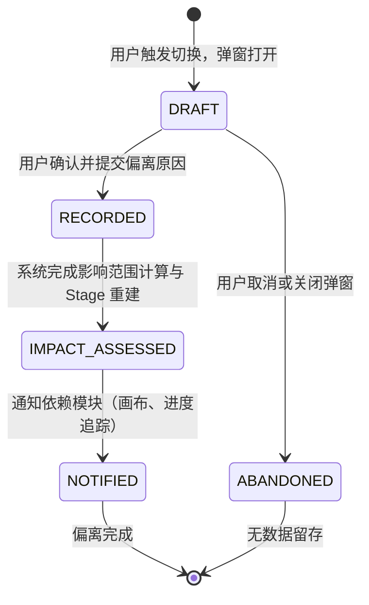
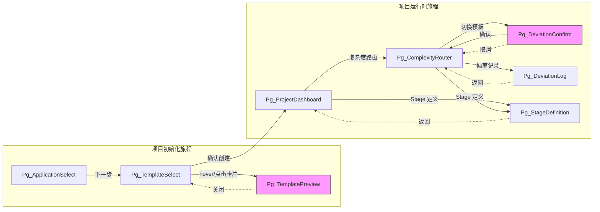

# DR-009 模块需求规格书 — 模板引擎（Template Engine）

> 模块编号：DR-009
> 模块名称：模板引擎
> 版本：v1.0
> 状态：Draft
> 优先级：P0
> 关联需求：REQ-P0-002、REQ-P0-018、REQ-P0-027
> 关联用户故事：US-001、US-011
> 基线：PRD-000 v2.0-patch2（Gate 1 已冻结）
> 生成日期：2026-06-01

---

## 1. 需求追溯与验收标准

### 1.1 需求追溯表

| 需求编号 | 需求名称 | 需求简述 | 关联用户故事 | 验收标准编号 |
|:--------:|:---------|:---------|:-----------:|:------------:|
| REQ-P0-002 | 模板选择 | 项目创建时展示模板选择面板，支持预览与实时切换 | US-001 | AC-01 ~ AC-03 |
| REQ-P0-018 | Stage 定义管理 | 模板内定义 Stage 序列、主/辅 Skill 绑定、可跳过标记、Stage 合并 | US-001 | AC-04 ~ AC-07 |
| REQ-P0-027 | 模板偏离记录 | 记录模板切换历史、偏离原因、影响范围；已执行 Stage 不受影响 | US-011 | AC-08 ~ AC-11 |

### 1.2 IN / OUT 清单

**IN（范围内）**

| 序号 | 功能点 |
|:----:|:-------|
| IN-01 | 四级模板体系（Trivial / Light / Standard / Deep）的展示与选择 |
| IN-02 | 每个模板内阶段序列的定义与展示 |
| IN-03 | Stage 与主 Skill、辅助 Skill 的绑定关系展示与配置 |
| IN-04 | Stage 的"可跳过"标记与渲染表现 |
| IN-05 | Stage 合并功能及合并后共享 Gate 的展示 |
| IN-06 | 项目创建时的模板预览（阶段-Skill 绑定可视化）与实时切换 |
| IN-07 | 基于复杂度路由结果推荐默认模板（含降级路径二次确认） |
| IN-08 | 模板与项目的弱关联：允许偏离推荐路径 |
| IN-09 | 模板偏离记录：切换历史、偏离原因、影响范围 |
| IN-10 | 模板切换后，已执行 Stage 保持不变，未执行 Stage 按新模板更新 |
| IN-11 | 复杂度与模板不匹配时的持续警告展示 |
| IN-12 | 立项 Gate（Draft → Active 转换时）的模板确认冻结 |

**OUT（范围外）**

| 序号 | 功能点 | 排除原因 |
|:----:|:-------|:---------|
| OUT-01 | 模板的增删改管理后台（管理员 CRUD 界面） | P1 扩展，MVP 通过配置文件预置 |
| OUT-02 | 模板版本管理与多版本并存 | P1 扩展 |
| OUT-03 | 跨项目模板继承与复用 | P1 扩展 |
| OUT-04 | 模板 Marketplace / 社区分享 | 超出 MVP 范围 |
| OUT-05 | 模板级权限控制（ACL） | MVP 仅支持超级个体单一角色 |
| OUT-06 | AI 自动分析并推荐模板调整（智能模板优化） | P1 扩展 |
| OUT-07 | 模板内 Skill 参数的深度配置（输入/输出字段级配置） | 归属 DR-006 Skill 注册管理 |
| OUT-08 | Gate 审批的具体业务逻辑 | 归属 DR-004 审批中心 |
| OUT-09 | 复杂度评估算法与五维度信号采集 | 归属 DR-010 复杂度路由面板 |

### 1.3 验收标准（AC Taxonomy）

> 核心 DoD AC 标记为 ★，质量分 = 3；其余质量分 ≥ 2。

| 编号 | 类型 | 验收标准描述 | 质量分 |
|:----:|:-----|:-------------|:------:|
| AC-01 | Behavioral ★ | Given 用户在项目创建流程中，When 进入模板选择步骤，Then 系统展示 Trivial / Light / Standard / Deep 四级模板卡片，每个卡片展示模板名称、适用场景简述、阶段数量 | 3 |
| AC-02 | Behavioral ★ | Given 用户 hover 或点击模板卡片，When 系统响应，Then 500ms 内渲染该模板的阶段-Skill 绑定预览（列表或可视化图） | 3 |
| AC-03 | Behavioral | Given 用户在模板选择面板，When 点击"切换模板"并选择另一模板，Then 预览区实时更新，已填写的项目基础信息保持不变 | 2 |
| AC-04 | Behavioral ★ | Given 管理员查看模板 Stage 定义，When 浏览任一 Stage，Then 系统展示该 Stage 的主 Skill、辅助 Skill 列表、可跳过标记、所属 Gate 信息 | 3 |
| AC-05 | Behavioral | Given 管理员编辑模板 Stage 定义，When 将两个相邻 Stage 标记为合并，Then 系统展示合并后的联合 Stage，并明确标注共享 Gate | 2 |
| AC-06 | Behavioral | Given 用户将 Stage 标记为"可跳过"，When 保存配置，Then 该 Stage 在画布中渲染为虚线边框或弱化样式，执行时默认跳过但允许手动启用 | 2 |
| AC-07 | Non-behavioral | 模板预览渲染时间 < 500ms（P95）；模板切换响应时间 < 1s（P95） | 3 |
| AC-08 | Behavioral ★ | Given 项目在 Active 态，When 用户在复杂度路由面板切换模板（从模板 A 到模板 B），Then 系统弹出偏离确认弹窗，要求输入偏离原因，记录偏离日志 | 3 |
| AC-09 | Behavioral | Given 模板切换已确认，When 系统执行切换，Then 已执行 Stage 保持原状态与产物不变，未执行 Stage 按新模板重新渲染序列与绑定 | 3 |
| AC-10 | Negative | 系统明确不支持模板切换后自动回滚已执行 Stage 的产物或状态 | 2 |
| AC-11 | Edge case | 当模板切换时，新模板包含的 Stage 与已执行 Stage 存在命名冲突，系统保留已执行 Stage 的原始定义，对新模板冲突 Stage 自动重命名并标注来源 | 2 |
| AC-12 | Dependency | 复杂度路由面板（DR-010）必须已完成五维度评估并输出复杂度等级，模板引擎方可调用推荐结果 | 3 |
| AC-13 | Edge case | 当项目处于 Draft 态超过 7 天未活动时，模板选择状态可保留，但项目自动归档为 Cancelled（遵循 BR-013） | 2 |

### 1.4 假设注册表

| 编号 | 假设内容 | 影响范围 | 验证方式 |
|:----:|:---------|:---------|:---------|
| HA-001 | 用户具备基础的 SDLC 阶段认知，能理解 Trivial/Light/Standard/Deep 四级差异 | 模板选择交互设计 | 用户测试（UT-001） |
| HA-002 | MVP 阶段四级预置模板足以覆盖 90% 独立开发者场景，无需用户自定义模板 | 模板管理功能范围 | 上线后模板选择分布统计 |
| HA-003 | 复杂度路由面板（DR-010）在模板选择前已完成五维度评估并输出复杂度等级 | 默认模板推荐逻辑 | DR-010 接口契约 |
| HA-004 | 同一时刻仅允许存在一个"生效中"的模板配置实例 per project | 偏离记录与切换逻辑 | 状态机约束 |
| HA-005 | Stage 的"已执行"判定标准为该 Stage 下至少有一个 Skill 进入 PASSED / REVIEW_PENDING / GATE_PENDING 状态 | 模板切换影响范围计算 | Skill 状态机定义（02-functional-requirements.md 6.2 节） |

---

## 2. 原型与页面结构

### 2.1 页面 / 入口清单

| 页面 ID | 页面名称 | 入口条件 | 所属用户旅程 |
|:-------:|:---------|:---------|:------------:|
| Pg_TemplateSelect | 模板选择面板 | 项目创建流程第二步（完成 Application 选择与规模评估后） | 准备 |
| Pg_TemplatePreview | 模板预览浮层 / 侧边面板 | 在 Pg_TemplateSelect 或 Pg_ComplexityRouter 中点击"预览模板" | 准备 / 验证 |
| Pg_ComplexityRouter | 复杂度路由面板 | Draft 态完成 Calibrate 精修后，或 Active 态通过菜单进入 | 准备 / 验证 |
| Pg_StageDefinition | Stage 定义管理面板 | 管理员视角：模板配置页；用户视角：项目级 Stage 详情页"定义"Tab | 准备 |
| Pg_DeviationLog | 偏离记录面板 | 项目详情页"历史"Tab 子页面，或复杂度路由面板"偏离记录"入口 | 验证 |
| Pg_DeviationConfirm | 偏离确认弹窗（模态） | 在 Pg_ComplexityRouter 中点击"切换模板"时触发 | 验证 |
| Pg_TemplateStageConfig | 模板阶段配置页 | 导航栏 → "模板配置"；展示四级模板的阶段列表，可编辑主 Skill 与辅助 Skills | 准备 |

### 2.2 文字化布局结构

#### 页面：Pg_TemplateSelect（模板选择面板）

- **顶部导航栏**：面包屑"新建项目 > 选择模板"；进度指示器（三步：基础信息 / 选择模板 / 确认创建）
- **左侧主区域（占比 60%）**：
  - 标题区："为项目选择开发模板" + 副标题"模板决定了 SDLC 阶段序列与 Skill 编排"
  - 模板卡片网格：2×2 网格展示四级模板卡片
    - 每张卡片：模板图标、模板名称（Trivial / Light / Standard / Deep）、一句话描述、阶段数量标签、复杂度区间标签
    - 推荐模板卡片带有"推荐"角标（基于复杂度路由结果）
    - 当前 hover / 选中卡片有蓝色边框高亮
  - 底部操作栏："返回上一步"按钮（左）、"创建项目"主按钮（右，禁用态至用户选中模板）
- **右侧辅助区域（占比 40%）**：
  - 模板详情面板：默认展示推荐模板的阶段-Skill 绑定预览
  - 阶段列表：按 Stage 顺序列出 Stage 名称、主 Skill 名称、辅助 Skill 数量、可跳过标识
  - 可视化预览区（可选折叠）：以垂直列表或简化流程图展示 Stage 序列
  - 底部提示文案："可随时在复杂度路由面板中切换模板（已执行阶段不受影响）"

#### 页面：Pg_ComplexityRouter（复杂度路由面板）

- **顶部区域**：
  - 面包屑"项目名 > 复杂度路由"
  - 当前复杂度等级展示（五维度雷达图，来自 DR-010）
  - 规模不匹配警告横幅（若当前模板与复杂度等级不匹配）：黄色背景，文案"当前模板 Light 与项目复杂度 Standard 不匹配，建议切换至 Standard 模板" + "查看详情"链接
- **中部左侧：路径对比区**
  - 当前生效模板卡片（高亮）
  - 推荐模板卡片（若有差异）
  - 差异对比列表：新增 Stage / 移除 Stage / Skill 绑定变化 / Gate 变化
- **中部右侧：模板切换操作区**
  - 下拉选择器："切换至其他模板"
  - 切换按钮（次按钮）：点击触发 Pg_DeviationConfirm
- **底部区域：偏离记录入口**
  - 链接文案"本项目已有 N 次模板偏离记录" → 跳转 Pg_DeviationLog

#### 页面：Pg_DeviationConfirm（偏离确认弹窗）

- **弹窗标题**："确认切换模板"
- **内容区**：
  - 信息提示："从 [当前模板名] 切换至 [目标模板名]。已执行阶段（N 个）不受影响，未执行阶段将按新模板更新。"
  - 影响范围预览：列表展示受影响 Stage（新增 / 移除 / Skill 绑定变化）
  - 偏离原因输入框：多行文本，必填，placeholder"请简述切换原因（如：项目规模扩大，需要更完整的测试阶段）"
  - 规模不匹配二次确认（若涉及降级路径，如 Deep → Light）：红色警告"降级路径可能导致阶段缺失，是否确认？" + 复选框"我了解降级风险"
- **底部操作**："取消"按钮（左）、"确认切换"主按钮（右，偏离原因非空且降级确认复选框已勾选时可用）

#### 页面：Pg_StageDefinition（Stage 定义管理面板）

- **顶部标签栏**："序列视图" / "列表视图" / "依赖视图"
- **序列视图（默认）**：
  - 垂直时间线式布局，每个 Stage 为一个节点卡片
  - 卡片内容：Stage 编号、Stage 名称、主 Skill 名称（带 Skill 图标）、辅助 Skill 折叠列表（N 个辅助 Skill）、可跳过开关、Gate 徽章（若 Stage 后存在 Gate）
  - 合并 Stage：两个 Stage 卡片合并为一个联合卡片，Gate 徽章标注"共享 Gate"
  - 节点间连线表示执行顺序，Gate 节点以菱形展示
- **列表视图**：
  - 表格形式，列：Stage 名称、主 Skill、辅助 Skill 数量、可跳过、Gate 关联、操作（编辑 / 合并 / 拆分）

#### 页面：Pg_DeviationLog（偏离记录面板）

- **顶部筛选栏**：时间范围选择器、模板类型筛选器
- **中部时间线**：
  - 每条记录为一个时间线节点
  - 节点内容：偏离时间、源模板 → 目标模板、偏离原因摘要、影响 Stage 数量、操作人
  - 点击展开：完整影响范围列表（新增 Stage / 移除 Stage / 绑定变化）
- **底部统计区**：总偏离次数、最常使用模板、平均偏离原因长度（可选）

#### 页面：Pg_TemplateStageConfig（模板阶段配置页）

- **顶部模板选择区**：四个卡片横向排列（Trivial / Light / Standard / Deep），点击切换当前编辑的模板
- **模板信息栏**：展示当前模板名称、复杂度、阶段数、预估 Skill 数
- **阶段列表表格**：
  - 列：序号、阶段名称、主 Skill（下拉选择）、辅助 Skills（文本输入，逗号分隔）、可跳过、操作
  - 主 Skill 下拉框从 Skill 注册中心读取全部可用 Skill
  - 每行独立"保存"按钮，调用后端接口即时保存该阶段的 Skill 绑定变更
- **空 Skill 提示**：若 Skill 注册中心无数据，展示黄色提示条引导用户先导入 Skill

### 2.3 关键交互流程

#### 流程 A：项目创建时模板选择（Happy Path）

1. 用户完成 Application 选择与五维度规模评估（前置步骤）
2. 系统进入 Pg_TemplateSelect，自动高亮推荐模板（基于复杂度路由结果）
3. 用户 hover 其他模板卡片，右侧预览面板实时更新（< 500ms）
4. 用户点击目标模板卡片，卡片边框变为选中态，"创建项目"按钮变为可用态
5. 用户点击"创建项目"，系统记录模板选择，初始化项目为 Draft 态
6. 项目创建成功，跳转项目工作台

#### 流程 B：复杂度路由面板中切换模板（偏离路径）

1. 用户进入 Pg_ComplexityRouter，查看当前模板与复杂度匹配度
2. 用户在下拉选择器中选择新模板，点击"切换"
3. 系统弹出 Pg_DeviationConfirm 弹窗，展示影响范围预览
4. 用户输入偏离原因，若涉及降级路径则勾选风险确认复选框
5. 用户点击"确认切换"
6. 系统执行模板切换：已执行 Stage 冻结，未执行 Stage 按新模板重建序列与绑定
7. 系统记录偏离日志，关闭弹窗，Pg_ComplexityRouter 刷新展示新模板配置
8. 若新模板与复杂度仍不匹配，规模不匹配警告横幅更新文案

#### 流程 C：Stage 定义查看与可跳过标记（管理路径）

1. 用户进入 Pg_StageDefinition（序列视图）
2. 用户浏览 Stage 卡片，查看主/辅 Skill 绑定、Gate 关联
3. 用户点击某 Stage 的"可跳过"开关，系统弹出确认提示"标记为可跳过后，该 Stage 默认不执行，可在画布中手动启用"
4. 用户确认，该 Stage 卡片样式变为虚线边框 / 弱化透明度
5. 用户点击保存，系统更新模板配置

#### 流程 D：模板阶段 Skill 绑定编辑（MVP 新增）

1. 用户点击导航栏"模板配置"进入 Pg_TemplateStageConfig
2. 系统默认选中 Light 模板，加载该模板下所有阶段列表
3. 用户在主 Skill 下拉框中为某阶段选择绑定的 Skill（下拉数据来自 `/api/v1/skills`）
4. 用户在辅助 Skills 文本框中输入逗号分隔的 Skill ID 列表
5. 用户点击该行的"保存"按钮
6. 系统调用 `PUT /api/v1/templates/{level}/stages/{stage_id}` 保存变更
7. 页面展示绿色 toast"已保存：{stage_name}"

### 2.4 页面跳转图



---

## 3. 输入输出字段

### 3.1 用户输入字段

| 字段名 | 字段说明 | 输入方式 | 是否必填 | 格式/约束 | 来源页面 |
|:-------|:---------|:---------|:--------:|:----------|:---------|
| selected_template_id | 选中的模板标识 | 卡片点击选择 | 是 | 枚举：Trivial / Light / Standard / Deep | Pg_TemplateSelect |
| deviation_reason | 偏离原因描述 | 多行文本输入 | 是（切换时） | 长度 10~500 字符，禁止全空白 | Pg_DeviationConfirm |
| downgrade_ack | 降级风险确认 | 复选框 | 条件必填 | 降级路径时必须勾选 | Pg_DeviationConfirm |
| skip_flag | Stage 可跳过标记 | 开关（toggle） | 否 | 布尔值，默认 false | Pg_StageDefinition |
| merge_target_stage_id | 合并目标 Stage 标识 | 下拉选择 / 拖拽 | 条件必填 | 仅允许相邻 Stage 合并 | Pg_StageDefinition |
| primary_skill_id | 主 Skill 标识 | 下拉选择 | 否 | 必须从 Skill 注册中心已导入的 Skill 中选择 | Pg_TemplateStageConfig |
| auxiliary_skill_ids | 辅助 Skill 标识列表 | 文本输入 | 否 | 逗号分隔的 Skill ID 列表，允许为空 | Pg_TemplateStageConfig |

### 3.2 系统输入字段

| 字段名 | 字段说明 | 数据类型 | 约束 | 来源模块 |
|:-------|:---------|:---------|:-----|:---------|
| project_status | 项目当前状态 | 枚举 | Draft / Active / Archived / Cancelled | 项目治理模块（DR-001） |
| complexity_level | 复杂度等级 | 枚举 | Trivial / Light / Standard / Deep | 复杂度路由面板（DR-010） |
| executed_stages | 已执行 Stage 列表 | 数组 | 元素为 Stage 标识，不可空（若存在） | SDLC 画布（DR-002） / Skill 调度（DR-008） |
| skill_registry | Skill 注册表快照 | 对象数组 | 至少包含 Skill ID、名称、类型（主/辅助） | Skill 注册管理（DR-006） |
| gate_definitions | Gate 定义集合 | 对象数组 | 包含 Gate ID、关联 Stage 列表、审批类型 | 审批中心（DR-004） |

### 3.3 页面回显字段

| 字段名 | 回显位置 | 说明 | 更新时机 |
|:-------|:---------|:-----|:---------|
| template_name | Pg_TemplateSelect 卡片、Pg_ComplexityRouter 当前模板区 | 模板显示名称 | 模板配置变更时 |
| template_description | Pg_TemplateSelect 卡片副标题 | 模板一句话描述 | 模板配置变更时 |
| stage_count | Pg_TemplateSelect 卡片标签 | 该模板包含的 Stage 数量 | 模板配置变更时 |
| stage_sequence | Pg_TemplatePreview、Pg_StageDefinition | 有序 Stage 列表，含主/辅 Skill 绑定 | 模板切换或 Stage 编辑后 |
| recommended_template_id | Pg_TemplateSelect 推荐角标 | 基于 complexity_level 的推荐结果 | 复杂度评估完成后 |
| mismatch_warning | Pg_ComplexityRouter 顶部横幅 | 当前模板与复杂度等级不匹配警告 | 模板切换或复杂度重评后 |
| deviation_count | Pg_ComplexityRouter"偏离记录"链接文案 | 当前项目累计偏离次数 | 每次偏离确认后 +1 |
| deviation_history | Pg_DeviationLog 时间线 | 按时间倒序的偏离记录列表 | 每次偏离确认后追加 |

### 3.4 接口响应字段（模块间契约，非 API 规格）

| 字段名 | 说明 | 消费者模块 |
|:-------|:-----|:-----------|
| active_template_config | 当前生效的完整模板配置（Stage 序列、Skill 绑定、可跳过标记、合并关系、Gate 映射） | SDLC 画布（DR-002）、Skill Flow 编排引擎（DR-007） |
| deviation_record_id | 新创建的偏离记录唯一标识 | 历史回溯（DR-013）、监控看板（DR-014） |
| impact_scope | 模板切换影响范围（新增 Stage 列表、移除 Stage 列表、绑定变更 Stage 列表、冻结 Stage 列表） | 项目治理（DR-001）、SDLC 画布（DR-002） |
| is_downgrade | 是否涉及降级路径（目标模板复杂度低于当前模板） | 复杂度路由面板（DR-010） |

### 3.5 数据流转图



---

## 4. 业务逻辑与状态机

### 4.1 核心业务流程

#### 流程 1：模板选择与初始化



#### 流程 2：模板偏离与切换



#### 流程 3：Stage 可跳过标记变更

```mermaid
flowchart TD
    Start([开始]) --> A[用户切换 Stage 的 skip_flag]
    A --> B{该 Stage 是否已执行?}
    B -->|是| C[拒绝变更，提示"已执行 Stage 不可修改跳过标记"]
    B -->|否| D{该 Stage 是否为合并 Stage 的一部分?}
    D -->|是| E[提示"跳过标记将应用于整个合并 Stage"]
    E --> F{用户是否确认?}
    F -->|否| G([取消])
    F -->|是| H[更新 skip_flag]
    D -->|否| H
    H --> I[重新渲染 Stage 序列视图]
    I --> J([完成])
    C --> J
```

### 4.2 业务规则映射

| 规则编号 | 规则描述 | 映射模块功能 | 校验时机 | 违反后果 |
|:--------:|:---------|:-------------|:---------|:---------|
| BR-004 | 模板与项目弱关联，允许偏离，记录偏离日志 | 模板偏离记录器、影响范围计算器 | Active 态模板切换时 | 若未记录偏离日志，禁止切换完成 |
| BR-017 | 立项 Gate 在 Draft 态完成，不计入 Active 态 Gate 总数 | Stage 定义中 Gate 计数逻辑 | Draft → Active 状态转换时 | Gate 计数错误导致进度追踪失真 |
| BR-028 | 复杂度路由推荐作为默认建议，用户可手动覆盖；降级路径需二次确认 | 推荐引擎、偏离确认弹窗降级逻辑 | 模板选择、模板切换时 | 降级未二次确认导致用户误操作 |
| BR-004-EXT | 已执行 Stage 不受模板切换影响 | 影响范围计算器的冻结逻辑 | 模板切换执行时 | 已执行 Stage 被覆盖将导致执行历史丢失 |
| BR-004-EXT2 | 未执行 Stage 按新模板更新，移除的 Stage 保留为历史快照但不参与后续编排 | 未执行 Stage 重建逻辑 | 模板切换执行时 | 移除 Stage 直接删除将导致历史不可追溯 |

### 4.3 状态机

#### 4.3.1 模板实例状态机（项目级）



**状态说明**：

- **RECOMMENDED**：系统基于复杂度路由推荐的默认模板，用户尚未确认选择。
- **SELECTED**：用户在 Draft 态已手动选择或确认推荐模板，尚未进入 Active 态。此状态下可自由切换模板，不产生偏离记录。
- **ACTIVE**：项目已立项（Active 态），当前模板为生效模板。模板选择已冻结，但允许偏离。
- **DEVIATED**：项目已发生过至少一次模板切换偏离。偏离日志非空，当前生效模板为最后一次切换的目标模板。
- **FROZEN**：项目已归档或取消，模板配置冻结为只读状态。

#### 4.3.2 Stage 生命周期状态机（在模板上下文内）



**状态说明**：

- **DEFINED**：Stage 在当前模板中已定义，尚未进入执行队列。
- **SKIPPED**：Stage 被标记为可跳过，且用户未手动启用，在画布中呈现弱化样式。
- **SCHEDULED**：Stage 已进入执行队列，等待用户触发或自动调度。
- **EXECUTED**：Stage 下至少有一个 Skill 已执行并进入非 NOT_STARTED 状态（参见 HA-005）。
- **REMOVED**：模板切换后，该 Stage 不在新模板序列中。若未执行则移至 REMOVED；若已执行则保持 EXECUTED/FROZEN。
- **FROZEN**：已执行 Stage 在模板切换后被冻结，保持原状态与产物不变，不参与新模板的 Stage 序列渲染。
- **ARCHIVED**：REMOVED 状态的 Stage 在历史快照中归档，可在偏离记录中追溯。

#### 4.3.3 偏离记录状态机



### 4.4 异常处理

| 异常场景 | 触发条件 | 系统响应 | 用户感知 | 恢复路径 |
|:---------|:---------|:---------|:---------|:---------|
| 模板配置缺失 | 请求模板 ID 在预置配置中不存在 | 降级至 Standard 模板，记录系统告警日志 | 顶部黄色横幅："模板配置异常，已启用默认模板" | 管理员修复配置后刷新 |
| 复杂度等级未就绪 | 模板选择时 DR-010 尚未返回 complexity_level | 不展示推荐角标，所有模板平铺展示 | 无推荐角标，需用户手动选择 | 完成复杂度评估后重新进入页面 |
| 切换时网络中断 | 用户点击"确认切换"后网络断开 | 保留弹窗状态，偏离记录写入本地事务队列 | 弹窗按钮恢复可点击，红色 toast："网络异常，请重试" | 用户点击重试，系统幂等处理 |
| 已执行 Stage 判定争议 | 某 Stage 下 Skill 处于 BLOCKED 状态（非明确 PASSED） | 保守策略：BLOCKED 视为未执行，允许随模板切换重建；但保留历史执行记录 | 该 Stage 在新模板中重新出现，历史失败记录可在详情中查看 | 用户手动重试或跳过 |
| 合并 Stage 冲突 | 新模板中某 Stage 与当前已合并 Stage 存在命名/ID 冲突 | 保留已执行合并 Stage 的冻结状态，新模板冲突 Stage 自动重命名为"{StageName}_new" | 画布中展示重命名后的 Stage，带"来自新模板"标签 | 用户手动调整 Stage 顺序或名称 |
| 降级路径未确认 | 用户选择降级路径但未勾选风险确认复选框 | 阻止表单提交，"确认切换"按钮保持禁用 | 复选框下方红色提示："请确认已了解降级风险" | 用户勾选复选框后继续 |
| 偏离原因为空 | 用户点击"确认切换"时偏离原因文本框为空或全空白 | 阻止表单提交，输入框边框变红 | 输入框下方红色提示："偏离原因为必填项" | 用户输入有效原因后继续 |
| 模板切换超时 | 影响范围计算或 Stage 重建超过 5s | 返回超时错误，事务回滚，模板配置保持原状态 | 弹窗关闭，红色 toast："模板切换超时，请稍后重试" | 用户重新发起切换请求 |

---

## 5. 交互规格

### 5.1 页面：Pg_TemplateSelect（模板选择面板）

#### 元素：模板卡片（#card-template-{id}）

| 属性 | 说明 |
|:-----|:-----|
| 触发方式 | click / hover |
| 前置条件 | 页面已加载模板配置列表，且列表非空 |
| 立即反馈 | hover：卡片轻微上浮（阴影加深）；click：卡片边框变为 2px 蓝色实线，其他卡片边框恢复默认 |
| 成功结果 | 右侧预览面板更新为该模板的 Stage 序列与 Skill 绑定；"创建项目"按钮变为可用态（蓝色填充） |
| 失败结果 | 若模板配置加载失败，卡片区域展示骨架屏，3s 后展示"配置加载失败"提示 + "重试"按钮 |
| 异常分支 | 网络中断 → 卡片展示缓存数据（若存在），右上角展示"离线模式"标签；数据为空 → 展示空状态插画 + "请联系管理员配置模板" |
| 埋点事件 | `template_card_click`，携带参数：`{template_id, source: 'template_select', timestamp}` |

#### 元素："创建项目"主按钮（#btn-create-project）

| 属性 | 说明 |
|:-----|:-----|
| 触发方式 | click |
| 前置条件 | 用户已选中一个模板（selected_template_id 非空） |
| 立即反馈 | 按钮置灰禁用，显示 loading spinner，文案变为"创建中..." |
| 成功结果 | 项目创建成功，页面跳转至 Pg_ProjectDashboard，toast 提示"项目创建成功" |
| 失败结果 | 按钮恢复可点击，红色 toast 提示失败原因（如"项目名称重复"） |
| 异常分支 | 网络中断 → 保留表单数据，toast"网络异常，请重试"；超时(10s) → 同网络中断处理 |
| 埋点事件 | `project_create_submit`，携带参数：`{template_id, is_recommended: true/false, timestamp}` |

### 5.2 页面：Pg_ComplexityRouter（复杂度路由面板）

#### 元素："切换至其他模板"下拉选择器（#select-template-switch）

| 属性 | 说明 |
|:-----|:-----|
| 触发方式 | click 展开 / click 选项选择 |
| 前置条件 | 项目处于 Draft 或 Active 态；模板配置列表已加载 |
| 立即反馈 | 展开下拉列表，展示可选模板（排除当前生效模板）；hover 选项时展示该模板简述 tooltip |
| 成功结果 | 选中选项后，下拉框收起，显示选中模板名称；"确认切换"按钮变为可用态 |
| 失败结果 | 模板列表加载失败 → 下拉框禁用，展示"配置加载失败" |
| 异常分支 | 项目处于 Archived / Cancelled → 下拉框禁用，tooltip"项目已冻结，不可切换模板" |
| 埋点事件 | `template_switch_select`，携带参数：`{target_template_id, current_template_id, timestamp}` |

#### 元素："确认切换"按钮（#btn-confirm-switch）

| 属性 | 说明 |
|:-----|:-----|
| 触发方式 | click |
| 前置条件 | 下拉选择器已选中非当前模板的目标模板；项目状态为 Draft 或 Active |
| 立即反馈 | 按钮置灰禁用，弹出 Pg_DeviationConfirm 模态弹窗（Draft 态下若系统配置为简化流程，可直接切换不弹窗） |
| 成功结果 | 弹窗内用户确认后，执行模板切换流程，面板刷新展示新模板配置与差异对比 |
| 失败结果 | 弹窗内用户取消 → 按钮恢复可点击，无数据变更 |
| 异常分支 | 网络中断 → 弹窗保留，toast"网络异常"；超时 → 同网络中断 |
| 埋点事件 | `template_switch_initiate`，携带参数：`{current_template_id, target_template_id, project_status, timestamp}` |

#### 元素：规模不匹配警告横幅（#banner-mismatch-warning）

| 属性 | 说明 |
|:-----|:-----|
| 触发方式 | 系统渲染（非用户触发） |
| 前置条件 | active_template_config 与 complexity_level 存在不匹配 |
| 立即反馈 | 页面顶部展示黄色背景横幅，含警告图标、文案、"查看详情"链接 |
| 成功结果 | 用户点击"查看详情" → 展开下拉面板，展示详细的不匹配维度说明（如"当前模板缺少测试阶段"） |
| 失败结果 | N/A（纯展示型元素） |
| 异常分支 | N/A |
| 埋点事件 | `mismatch_warning_show`，携带参数：`{current_template_id, complexity_level, mismatch_dimensions, timestamp}`；用户点击"查看详情"时追加 `mismatch_warning_expand` |

### 5.3 页面：Pg_DeviationConfirm（偏离确认弹窗）

#### 元素：偏离原因输入框（#input-deviation-reason）

| 属性 | 说明 |
|:-----|:-----|
| 触发方式 | focus / input / blur |
| 前置条件 | 弹窗已打开，项目处于 Active 态 |
| 立即反馈 | focus：输入框边框变蓝；input：实时字数统计（0/500）；blur：校验内容非空且非全空白 |
| 成功结果 | 内容合法时，下方无错误提示；"确认切换"按钮在降级风险已确认的前提下变为可用 |
| 失败结果 | 内容为空或全空白时，blur 后边框变红，下方红色提示"偏离原因为必填项"；"确认切换"保持禁用 |
| 异常分支 | 输入超过 500 字符 → 禁止继续输入，展示"已超出最大长度"提示 |
| 埋点事件 | `deviation_reason_input`，携带参数：`{char_count, timestamp}`（仅在 blur 时触发一次） |

#### 元素：降级风险确认复选框（#chk-downgrade-risk）

| 属性 | 说明 |
|:-----|:-----|
| 触发方式 | click |
| 前置条件 | 目标模板复杂度等级低于当前模板（is_downgrade = true） |
| 立即反馈 | 复选框状态切换，勾选时复选框变为蓝色填充 |
| 成功结果 | 勾选后，若偏离原因已填写，"确认切换"按钮变为可用 |
| 失败结果 | 未勾选时，"确认切换"按钮禁用，下方红色提示"请确认已了解降级风险" |
| 异常分支 | 非降级路径时，该复选框整行隐藏 |
| 埋点事件 | `downgrade_ack_toggle`，携带参数：`{checked: true/false, timestamp}` |

#### 元素："确认切换"按钮（弹窗内）（#btn-deviation-submit）

| 属性 | 说明 |
|:-----|:-----|
| 触发方式 | click |
| 前置条件 | 偏离原因已填写且合法；降级路径下复选框已勾选 |
| 立即反馈 | 按钮置灰禁用，显示 loading spinner；弹窗背景增加毛玻璃遮罩，禁止关闭 |
| 成功结果 | 模板切换完成，弹窗关闭，返回 Pg_ComplexityRouter，绿色 toast"模板切换成功，已记录偏离日志" |
| 失败结果 | 切换失败（如事务冲突），弹窗保持打开，按钮恢复可点击，红色提示具体失败原因 |
| 异常分支 | 网络中断 → 按钮恢复，toast"网络异常，请重试"；超时(5s) → 同网络中断 |
| 埋点事件 | `deviation_confirm_submit`，携带参数：`{source_template_id, target_template_id, reason_length, is_downgrade, timestamp}` |

### 5.4 页面：Pg_StageDefinition（Stage 定义管理面板）

#### 元素：可跳过开关（#toggle-skip-{stage_id}）

| 属性 | 说明 |
|:-----|:-----|
| 触发方式 | click |
| 前置条件 | Stage 处于 DEFINED 或 SKIPPED 状态（未执行）；用户具备编辑权限（MVP 下超级个体始终具备） |
| 立即反馈 | 开关滑动动画，目标状态即时预览（卡片边框虚线化 / 实线化） |
| 成功结果 | 若为合并 Stage，弹出确认 toast"跳过标记将应用于整个合并 Stage"；用户确认后状态更新；若为普通 Stage，直接更新 |
| 失败结果 | Stage 已执行 → 开关无法点击，tooltip"已执行 Stage 不可修改" |
| 异常分支 | 模板配置被并发修改 → 展示"配置已更新，请刷新后重试"，拒绝本次变更 |
| 埋点事件 | `stage_skip_toggle`，携带参数：`{stage_id, new_state: true/false, is_merged: true/false, timestamp}` |

#### 元素：Stage 合并按钮（#btn-merge-stage）

| 属性 | 说明 |
|:-----|:-----|
| 触发方式 | click（列表视图）/ 拖拽（序列视图） |
| 前置条件 | 选中两个相邻且均未执行的 Stage；非合并 Stage 成员 |
| 立即反馈 | 列表视图：弹出确认弹窗"确认合并 Stage A 与 Stage B？合并后将共享同一个 Gate"；序列视图：拖拽释放后高亮预览合并效果 |
| 成功结果 | 两个 Stage 卡片合并为一个联合卡片，Gate 徽章标注"共享 Gate"，原独立 Gate 自动合并 |
| 失败结果 | 选中 Stage 不相邻或已执行 → 红色 toast"仅允许合并相邻且未执行的 Stage" |
| 异常分支 | 合并后 Gate 冲突（两个 Stage 后均有不同类型 Gate） → 弹窗要求用户选择保留哪个 Gate，或取消合并 |
| 埋点事件 | `stage_merge_execute`，携带参数：`{source_stage_id, target_stage_id, retained_gate_id, timestamp}` |

### 5.5 页面：Pg_DeviationLog（偏离记录面板）

#### 元素：时间线节点展开（#timeline-item-{id}）

| 属性 | 说明 |
|:-----|:-----|
| 触发方式 | click |
| 前置条件 | 偏离记录列表已加载 |
| 立即反馈 | 节点下方展开详情面板，展示影响范围列表（新增 / 移除 / 绑定变化），带有淡入动画 |
| 成功结果 | 详情完整展示；若影响 Stage 数量 > 10，分页展示 |
| 失败结果 | 详情加载失败 → 展开区域展示"加载失败" + "重试"按钮 |
| 异常分支 | 记录数据损坏或缺失 → 展示"部分数据缺失"占位符 |
| 埋点事件 | `deviation_log_expand`，携带参数：`{deviation_record_id, timestamp}` |

### 5.6 页面间跳转关系图



---

## 附录：术语表

| 术语 | 定义 |
|:-----|:-----|
| 模板（Template） | 预定义的 SDLC 阶段序列与 Stage-Skill 绑定配置，四级体系：Trivial / Light / Standard / Deep |
| Stage | SDLC 中的一个阶段（如需求探索、概要设计、编码实现等），是 Skill 执行的容器 |
| 主 Skill | Stage 中必须执行的核心 Skill，产物需进入审查流程 |
| 辅助 Skill | Stage 中可选执行的辅助性 Skill，产物不强制审查 |
| Gate | 阶段间的人工审批节点，通过后解锁下游 Stage |
| 偏离（Deviation） | 项目在 Active 态下切换模板的行为，需记录原因与影响范围 |
| 复杂度路由 | 基于五维度评估结果推荐匹配模板的过程（DR-010） |
| 降级路径 | 从复杂度更高的模板切换至复杂度更低的模板（如 Deep → Light） |

---

> 本文档遵循 Arsitect 详细需求规范（detailed-requirements Skill v2.1）生成。
> 禁止在本文档中补充代码片段、伪代码、SQL、API 端点规格、数据库表结构、类图或技术栈决策。

---

## 附录：变更记录

| 版本 | 日期 | 修改人 | 修改内容 |
|:----:|:----:|:-------|:---------|
| v1.0 | 2026-06-01 | AI PM | 初始版本 |
| v1.1 | 2026-06-04 | AI Dev | MVP 新增：① Pg_TemplateStageConfig 模板阶段配置页面；② 阶段-Skill 绑定编辑流程；③ primary_skill_id / auxiliary_skill_ids 输入字段 |
