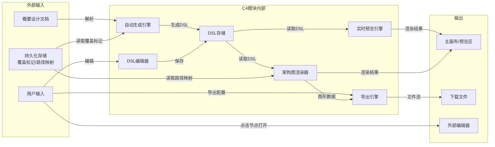
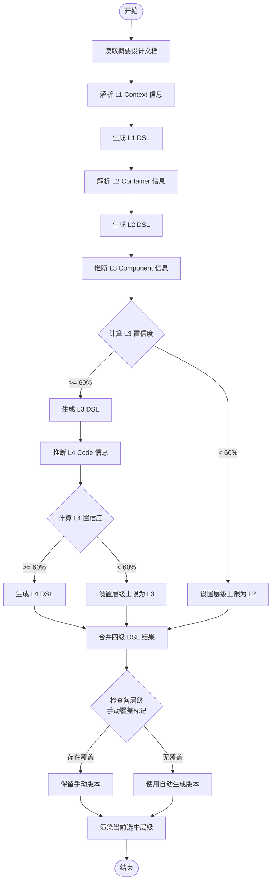
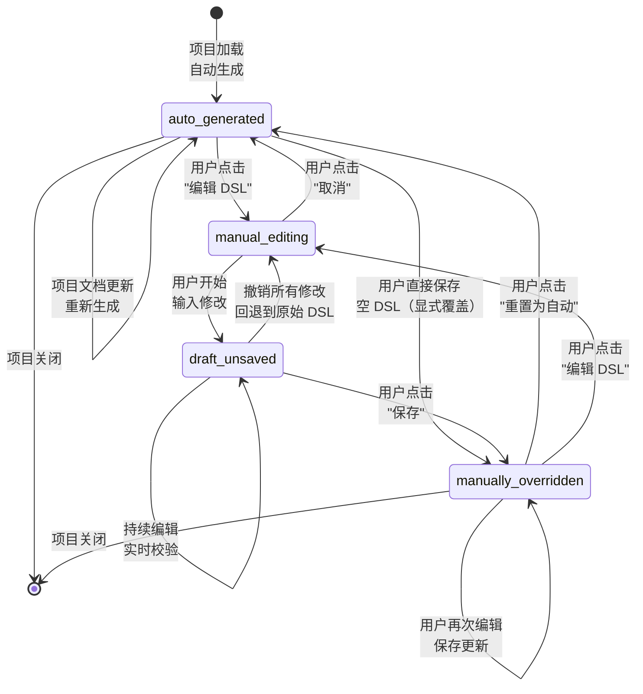
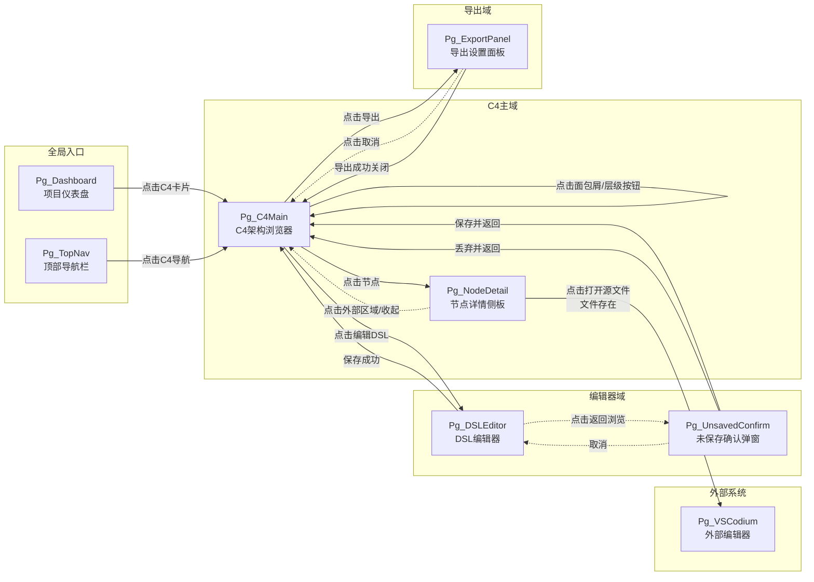

# DR-011 C4 架构浏览器（C4 Architecture Navigator）—— 模块级详细需求

> **模块编号**：DR-011
> **模块名称**：C4 架构浏览器
> **优先级**：P0
> **关联需求**：REQ-P0-019、REQ-P0-020、REQ-P0-021、REQ-P0-033
> **关联用户故事**：US-012
> **版本**：v1.0
> **状态**：Draft

---

## 1. 需求追溯与验收标准

### 1.1 需求追溯表

| 需求编号 | 需求名称 | 需求类型 | 关联用户故事 | 本模块覆盖方式 |
|---------|---------|---------|------------|--------------|
| REQ-P0-019 | C4 L1/L2/L3/L4 自动生成 | 功能需求 | US-012 | 核心业务流程：基于项目文档自动生成四级 C4 架构图 |
| REQ-P0-020 | 层级穿透导航 | 功能需求 | US-012 | 页面交互：支持 L1→L2→L3→L4 逐级下钻与直接跳转 |
| REQ-P0-021 | C4 DSL 手动编辑 | 功能需求 | US-012 | 核心功能：提供文本编辑器编辑 DSL，实时预览渲染 |
| REQ-P0-033 | 反向代码定位 | 功能需求 | US-012 | 扩展功能：L3/L4 节点关联本地文件路径，支持一键打开 |

### 1.2 IN / OUT 清单

**IN（范围内）**

- 基于项目概要设计文档自动生成 C4 Context（L1）图
- 基于概要设计文档展开生成 Container（L2）图
- 基于概要设计文档推断生成 Component（L3）图
- 基于概要设计文档推断生成 Code（L4）图
- 四级架构图的层级穿透导航（下钻/上钻/直接跳转）
- C4 DSL 的文本编辑器手动编辑与实时预览
- 手动覆盖标记与自动生成降级策略
- L3/L4 节点到本地源文件的反向定位
- 架构图导出为 PNG/SVG 格式
- 打印友好的布局适配

**OUT（范围外）**

- 基于代码级静态分析生成 L3/L4（本模块仅基于概要设计文档推断，非代码扫描）
- 多人实时协作编辑 DSL
- 版本对比与冲突解决
- C4 DSL 语法教学或智能补全
- 除 PNG/SVG 外的其他导出格式（如 PDF、Visio）
- 架构图自动布局算法的自定义参数调节

### 1.3 验收标准（AC Taxonomy）

| # | 类型 | 标准描述 | 质量分 |
|---|------|---------|:------:|
| AC-1 | Behavioral | Given 用户已加载项目文档 When 触发自动生成 Then 系统在 5 秒内渲染 L1 Context 图 | 3 |
| AC-2 | Behavioral | Given L1 Context 图已显示 When 用户双击某系统节点 Then 系统在 1 秒内下钻至 L2 Container 图并同步更新面包屑 | 3 |
| AC-3 | Behavioral | Given 用户处于 L4 Code 图 When 用户点击面包屑中的 L2 节点 Then 系统直接跳转回 L2 Container 图并保持该节点高亮 | 3 |
| AC-4 | Behavioral | Given 自动生成准确率低于 60% When 系统完成自动分析 Then 系统仅展示 L1/L2 图并提示用户手动补充 L3/L4 | 3 |
| AC-5 | Behavioral | Given 用户进入 DSL 手动编辑模式 When 修改 DSL 文本并停留 500ms 后 Then 预览区实时更新渲染结果 | 3 |
| AC-6 | Behavioral | Given 用户手动编辑并保存 DSL When 系统保存完成 Then 该层级标记为"手动覆盖"，后续自动生成不再覆盖此层级 | 3 |
| AC-7 | Behavioral | Given L3 Component 图中某节点已关联本地文件路径 When 用户点击"打开源文件"操作 Then 系统通过操作系统协议打开对应文件 | 3 |
| AC-8 | Behavioral | Given 用户触发导出操作 When 选择 PNG 或 SVG 格式 Then 系统生成当前视图的对应格式文件并触发浏览器下载 | 2 |
| AC-9 | Non-behavioral | L1 架构图自动生成耗时 < 5s（P95） | 3 |
| AC-10 | Non-behavioral | 层级下钻交互耗时 < 1s（P95） | 3 |
| AC-11 | Non-behavioral | DSL 编辑到预览渲染延迟 < 500ms（P95） | 3 |
| AC-12 | Negative | 系统明确不支持通过代码静态分析直接生成 L3/L4（仅基于概要设计文档推断） | 3 |
| AC-13 | Negative | 系统明确不支持多人在线协同编辑同一份 DSL | 2 |
| AC-14 | Edge case | 当本地文件路径对应的文件不存在时，系统显示"文件不存在"提示并提供重新关联入口 | 3 |
| AC-15 | Edge case | 当 DSL 文本包含语法错误时，编辑器高亮错误行并展示友好错误提示，预览区保持上次正确渲染状态 | 3 |
| AC-16 | Edge case | 当项目概要设计文档为空或不完整时，L1 生成流程正常降级为空白画布并提示用户手动绘制 | 2 |
| AC-17 | Dependency | 概要设计文档（`high-level-design/*.md`）必须已存在且可读 | 3 |

### 1.4 假设注册表

| 编号 | 假设内容 | 影响范围 | 验证方式 |
|-----|---------|---------|---------|
| ASM-1 | 用户本地开发环境已安装 VS Code 或兼容的编辑器以支持反向代码定位 | REQ-P0-033 | UAT 阶段人工验证 |
| ASM-2 | 项目概要设计文档遵循 Arsitect 标准目录结构与命名规范 | REQ-P0-019 | Gate 1 产出物检查 |
| ASM-3 | 用户具备基本的 C4 Model 概念理解（系统/容器/组件/代码） | 全模块 | 用户文档引导 |
| ASM-4 | 单项目节点总数不超过 500 个（保证渲染性能） | NFR | 性能测试验证 |
| ASM-5 | DSL 格式优先支持 Mermaid 语法，Structurizr 格式为 P1 扩展 | REQ-P0-021 | 需求基线确认 |

---

## 2. 原型与页面结构

### 2.1 页面清单

| 页面编号 | 页面名称 | 页面路径/标识 | 入口方式 | 说明 |
|---------|---------|-------------|---------|------|
| Pg_C4Main | C4 架构浏览器主页面 | `/C4-navigator` | 顶部导航栏入口、项目仪表盘快捷入口 | 四级架构图的核心浏览与交互页面 |
| Pg_DSLEditor | DSL 编辑器页面 | `/C4-navigator/dsl-edit` | C4 主页面"编辑 DSL"按钮 | 全屏文本编辑器 + 实时预览分栏 |
| Pg_ExportPanel | 导出设置面板 | `/C4-navigator/export`（弹层） | C4 主页面"导出"按钮 | 格式选择、尺寸配置、背景设置 |
| Pg_NodeDetail | 节点详情侧板 | 侧板（非独立页面） | 点击任意架构图节点 | 展示节点元数据、描述、关联文件路径 |

### 2.2 文字化布局结构

#### Pg_C4Main — C4 架构浏览器主页面

```
┌─────────────────────────────────────────────────────────────┐
│ 面包屑导航栏：项目名称 > L1-Context > 系统A > L2-Container    │
├──────────┬──────────────────────────────────────────────────┤
│          │                                                  │
│ 层级切换 │         主画布区域（架构图渲染区）                │
│ 工具栏   │                                                  │
│          │    ┌─────┐         ┌──────────┐                │
│  [L1]    │    │系统A│ ──────> │系统B(外部)│                │
│  [L2]    │    └──┬──┘         └──────────┘                │
│  [L3]    │       │                                         │
│  [L4]    │    ┌──┴──┐                                      │
│          │    │WebApp│                                      │
│          │    └─────┘                                      │
│          │                                                  │
│  ────────┤    支持：拖拽平移 / 滚轮缩放 / 框选多节点        │
│  图例面板 │                                                  │
│  ────────┤                                                  │
│  操作面板 │                                                  │
│ [编辑DSL]│                                                  │
│ [导出]   │                                                  │
│ [自动布局]│                                                  │
│          │                                                  │
└──────────┴──────────────────────────────────────────────────┘
                         ↑
                    底部状态栏：当前层级 | 节点数 | 生成方式（自动/手动）
```

**布局说明**：
- 左侧为固定宽度（240px）工具面板，含层级切换、图例、操作按钮
- 中央为主画布，占剩余全部空间
- 顶部为面包屑导航栏，支持下拉快捷跳转
- 底部为状态栏，展示当前上下文元信息
- 右侧节点详情侧板默认收起，点击节点后滑出（宽度 320px）

#### Pg_DSLEditor — DSL 编辑器页面

```
┌─────────────────────────────────────────────────────────────┐
│ 顶部工具栏：[返回浏览] [保存] [重置为自动] [格式检查] [帮助]  │
├──────────────────────────┬──────────────────────────────────┤
│                          │                                  │
│   DSL 文本编辑区（左栏）  │     实时预览渲染区（右栏）        │
│                          │                                  │
│   ┌──────────────────┐   │    ┌──────────────────────┐     │
│   │ C4Context         │   │    │                      │     │
│   │  title 系统上下文 │   │    │   [架构图渲染结果]    │     │
│   │                  │   │    │                      │     │
│   │  System(A, ...    │   │    │                      │     │
│   │                  │   │    │                      │     │
│   └──────────────────┘   │    └──────────────────────┘     │
│                          │                                  │
│   行号 | 语法高亮 | 错误  │    500ms 防抖实时同步             │
│   标记（红波浪线）        │                                  │
│                          │                                  │
└──────────────────────────┴──────────────────────────────────┘
```

**布局说明**：
- 左右分栏，默认比例 5:5，拖拽可调节
- 左栏为 Monaco 风格文本编辑器体验（行号、语法高亮、错误标记）
- 右栏为实时预览，与左栏内容 500ms 防抖同步
- 顶部工具栏常驻，保存按钮在内容变更后高亮提示

#### Pg_ExportPanel — 导出设置面板（弹层）

```
┌─────────────────────────┐
│ 导出架构图           [X] │
├─────────────────────────┤
│ 格式选择：              │
│ ○ PNG  ● SVG           │
│                        │
│ 尺寸：                 │
│ 宽度：[______] px      │
│ 高度：[______] px      │
│ [ ] 自适应内容尺寸      │
│                        │
│ 背景：                 │
│ ○ 透明  ● 白色  ○ 深色 │
│                        │
│ [取消]    [确认导出]    │
└─────────────────────────┘
```

### 2.3 关键交互流程

**流程 A：自动生成 → 层级浏览 → 下钻**
1. 用户进入 C4 架构浏览器主页面
2. 系统自动读取项目概要设计文档并生成 L1 Context 图
3. 用户在主画布查看 L1 图
4. 用户双击某系统节点 → 下钻至 L2 Container 图
5. 面包屑同步更新，层级切换工具栏高亮 L2
6. 用户继续双击容器节点 → 下钻至 L3 Component 图（若可用）
7. 用户点击面包屑中的 L1 → 直接返回 L1 视图

**流程 B：手动编辑 DSL**
1. 用户在 C4 主页面点击"编辑 DSL"按钮
2. 进入 DSL 编辑器页面，加载当前层级 DSL 文本
3. 用户修改 DSL 文本
4. 预览区 500ms 后实时更新
5. 用户点击"保存"
6. 系统校验 DSL 语法
7. 保存成功，该层级标记为"手动覆盖"
8. 返回浏览页面，渲染手动版 DSL

**流程 C：反向代码定位**
1. 用户在 L3 Component 图或 L4 Code 图中浏览
2. 用户点击某节点
3. 右侧节点详情侧板滑出，展示关联文件路径
4. 用户点击"在编辑器中打开"
5. 系统检测文件是否存在
6. 若存在 → 调用操作系统协议打开文件
7. 若不存在 → 提示"文件不存在"并提供重新关联入口

### 2.4 页面跳转图

```mermaid
flowchart LR
    subgraph 导航入口
        Pg_Dashboard["Pg_Dashboard<br>项目仪表盘"]
        Pg_TopNav["Pg_TopNav<br>顶部导航"]
    end

    subgraph C4核心域
        Pg_C4Main["Pg_C4Main<br>C4架构浏览器主页面"]
        Pg_DSLEditor["Pg_DSLEditor<br>DSL编辑器页面"]
        Pg_ExportPanel["Pg_ExportPanel<br>导出设置面板"]
        Pg_NodeDetail["Pg_NodeDetail<br>节点详情侧板"]
    end

    Pg_Dashboard -->|点击C4模块卡片| Pg_C4Main
    Pg_TopNav -->|点击C4导航项| Pg_C4Main

    Pg_C4Main -->|点击"编辑DSL"| Pg_DSLEditor
    Pg_C4Main -->|点击"导出"| Pg_ExportPanel
    Pg_C4Main -->|点击任意节点| Pg_NodeDetail
    Pg_C4Main -->|点击面包屑/层级切换| Pg_C4Main

    Pg_DSLEditor -.->|点击"返回浏览"| Pg_C4Main
    Pg_DSLEditor -->|保存成功| Pg_C4Main

    Pg_ExportPanel -.->|点击"取消"| Pg_C4Main
    Pg_ExportPanel -->|导出完成关闭弹层| Pg_C4Main

    Pg_NodeDetail -.->|点击收起/外部区域| Pg_C4Main
    Pg_NodeDetail -->|点击"打开源文件"| Pg_VSCodium["Pg_VSCodium<br>外部编辑器"]
```

---

## 3. 输入输出字段

### 3.1 用户输入字段

| 字段名 | 所属页面 | 输入方式 | 数据类型 | 约束条件 | 必填 |
|-------|---------|---------|---------|---------|------|
| dsl_text | Pg_DSLEditor | 文本编辑 | 长文本 | Mermaid 或 Structurizr 语法，最大 100KB | 是 |
| export_format | Pg_ExportPanel | 单选 | 枚举 | PNG / SVG | 是 |
| export_width | Pg_ExportPanel | 数字输入 | 整数 | 100 ~ 10000（px） | 否 |
| export_height | Pg_ExportPanel | 数字输入 | 整数 | 100 ~ 10000（px） | 否 |
| export_background | Pg_ExportPanel | 单选 | 枚举 | transparent / white / dark | 否 |
| file_path_mapping | Pg_NodeDetail | 文本输入 | 字符串 | 本地绝对路径，最大 512 字符 | 否 |

### 3.2 系统输入字段

| 字段名 | 来源 | 数据类型 | 说明 |
|-------|------|---------|------|
| project_id | 全局上下文 | 字符串 | 当前激活的项目标识 |
| hl_design_docs | 概要设计文档目录 | 文件集合 | `high-level-design/*.md` 文件内容 |
| current_level | 路由/状态 | 枚举 | L1 / L2 / L3 / L4 |
| manual_override_flags | 持久化存储 | 对象 | 各层级是否被手动覆盖的标记 |
| node_file_mappings | 持久化存储 | 对象 | 节点 ID 到本地文件路径的映射表 |

### 3.3 页面回显字段

| 字段名 | 所属页面 | 数据类型 | 说明 |
|-------|---------|---------|------|
| breadcrumb_path | Pg_C4Main | 数组 | 面包屑节点序列，含层级、名称、节点 ID |
| rendered_diagram | Pg_C4Main | 图形对象 | 当前层级的架构图渲染结果 |
| generation_mode | Pg_C4Main | 枚举 | auto / manual，标识当前层级生成方式 |
| node_count | Pg_C4Main | 整数 | 当前层级节点总数 |
| dsl_preview | Pg_DSLEditor | 图形对象 | 实时预览区的架构图渲染结果 |
| syntax_errors | Pg_DSLEditor | 数组 | DSL 语法错误列表（行号、错误信息） |
| node_metadata | Pg_NodeDetail | 对象 | 节点名称、类型、描述、关联需求编号 |
| associated_file_path | Pg_NodeDetail | 字符串 | 节点关联的本地文件路径 |
| file_exists_status | Pg_NodeDetail | 布尔值 | 关联文件是否存在的检测结果 |

### 3.4 接口响应字段

| 字段名 | 来源操作 | 数据类型 | 说明 |
|-------|---------|---------|------|
| generated_dsl | 自动生成请求 | 对象 | 含 L1/L2/L3/L4 四级 DSL 文本 |
| generation_confidence | 自动生成请求 | 浮点数 | 各层级生成置信度（0~1） |
| generation_level_cap | 自动生成请求 | 枚举 | 系统决定展示的层级上限 |
| save_status | DSL 保存请求 | 枚举 | success / syntax_error / conflict |
| override_flag_updated | DSL 保存请求 | 布尔值 | 手动覆盖标记是否更新成功 |
| export_file_url | 导出请求 | 字符串 | 生成的导出文件临时下载地址 |
| file_open_result | 反向定位请求 | 枚举 | opened / file_not_found / permission_denied |

### 3.5 数据流转图



---

## 4. 业务逻辑与状态机

### 4.1 核心业务流程

#### 流程 1：C4 架构图自动生成流程



#### 流程 2：层级穿透导航流程

```mermaid
flowchart TD
    Start([开始]) --> CurrentView[当前层级视图]
    CurrentView --> UserAction{用户操作}
    UserAction -->|双击节点| DrillDown[下钻至下一层级]
    UserAction -->|点击面包屑| JumpTo[跳转至指定层级]
    UserAction -->|点击层级按钮| SwitchLevel[切换至指定层级]
    DrillDown --> CheckAvailable{目标层级<br>是否可用}
    JumpTo --> CheckAvailable
    SwitchLevel --> CheckAvailable
    CheckAvailable -->|是| UpdateBreadcrumb[更新面包屑路径]
    CheckAvailable -->|否| ShowUnavailable[提示"该层级尚未生成"]
    UpdateBreadcrumb --> LoadDSL[加载目标层级 DSL]
    ShowUnavailable --> EndFail([结束-失败])
    LoadDSL --> CheckManual{是否手动覆盖}
    CheckManual -->|是| RenderManual[渲染手动版 DSL]
    CheckManual -->|否| RenderAuto[渲染自动版 DSL]
    RenderManual --> UpdateStatus[更新状态栏信息]
    RenderAuto --> UpdateStatus
    UpdateStatus --> EndSuccess([结束-成功])
```

#### 流程 3：DSL 手动编辑与保存流程

```mermaid
flowchart TD
    Start([开始]) --> EnterEditor[进入 DSL 编辑器]
    EnterEditor --> LoadCurrentDSL[加载当前层级 DSL]
    LoadCurrentDSL --> UserEdit[用户编辑文本]
    UserEdit --> Debounce{500ms 防抖}
    Debounce --> ValidateSyntax[语法校验]
    ValidateSyntax --> SyntaxOK{语法是否通过}
    SyntaxOK -->|是| UpdatePreview[更新预览渲染]
    SyntaxOK -->|否| ShowError[高亮错误行并展示提示]
    ShowError --> PreviewKeep[预览区保持上次正确状态]
    UpdatePreview --> UserAction2{用户操作}
    PreviewKeep --> UserAction2
    UserAction2 -->|继续编辑| UserEdit
    UserAction2 -->|点击保存| SaveDSL[保存 DSL 文本]
    SaveDSL --> MarkOverride[标记该层级为"手动覆盖"]
    MarkOverride --> ReturnToView[返回浏览视图]
    ReturnToView --> RenderSaved[渲染已保存的手动版本]
    RenderSaved --> End([结束])
    UserAction2 -->|点击重置| ConfirmReset{确认重置}
    ConfirmReset -->|确认| ClearOverride[清除手动覆盖标记]
    ClearOverride --> RegenerateAuto[重新触发自动生成]
    ConfirmReset -->|取消| UserEdit
```

#### 流程 4：反向代码定位流程

```mermaid
flowchart TD
    Start([开始]) --> ClickNode[用户点击 L3/L4 节点]
    ClickNode --> ShowPanel[滑出节点详情侧板]
    ShowPanel --> CheckMapping{是否存在<br>文件路径映射}
    CheckMapping -->|否| ShowAddMapping[展示"关联文件"输入入口]
    CheckMapping -->|是| DisplayPath[显示关联文件路径]
    DisplayPath --> UserClickOpen[用户点击"在编辑器中打开"]
    UserClickOpen --> CheckExist[检测文件是否存在]
    CheckExist -->|存在| OpenFile[调用系统协议打开文件]
    CheckExist -->|不存在| ShowNotFound[提示"文件不存在"]
    ShowNotFound --> OfferReassociate[提供"重新关联"入口]
    OpenFile --> EndSuccess([结束-成功])
    ShowAddMapping --> UserInputPath[用户输入/选择文件路径]
    UserInputPath --> SaveMapping[保存路径映射]
    SaveMapping --> DisplayPath
    OfferReassociate --> UserInputPath
```

### 4.2 业务规则映射

| 规则编号 | 规则名称 | 规则内容 | 适用场景 | 触发条件 |
|---------|---------|---------|---------|---------|
| BR-008 | C4 四级覆盖与手动覆盖优先 | C4 架构图覆盖 L1/L2/L3/L4 四级；用户手动编辑保存的层级优先于自动生成版本，后续自动生成不再覆盖该层级 | 自动生成、手动编辑保存 | 每次自动生成前检查覆盖标记；保存手动 DSL 时设置标记 |
| BR-009 | 自动生成准确率降级 | 当某层级自动生成置信度 < 60% 时，系统仅展示可达的较低层级，并提示用户手动补充 | 自动生成 | 置信度计算完成后 |
| BR-010 | 手动版本持久化隔离 | 手动编辑的 DSL 与自动生成的 DSL 分别独立存储，互不影响，便于用户随时重置为自动版本 | DSL 编辑 | 保存手动版本时 |
| BR-011 | 层级可用性门控 | 用户仅可导航至已生成或已手动编辑的层级；未生成层级显示为不可用状态 | 层级导航 | 切换层级前检查 |
| BR-012 | 反向定位范围限制 | 反向代码定位功能仅对 L3 Component 和 L4 Code 级节点开放；L1/L2 节点不展示文件关联入口 | 节点详情 | 打开节点详情侧板时 |

### 4.3 DSL 状态机



### 4.4 异常处理

| 异常场景 | 触发条件 | 系统响应 | 用户可见反馈 | 恢复路径 |
|---------|---------|---------|------------|---------|
| EX-1 概要设计文档缺失 | 自动生成时未找到 `high-level-design/*.md` | 终止自动生成，进入空白画布模式 | 提示"未找到概要设计文档，请手动创建 DSL 或导入文档" | 用户手动编辑 DSL 或上传概要设计文档 |
| EX-2 DSL 语法错误 | 手动编辑时输入不符合语法规范 | 阻止保存，预览区保持上次正确状态 | 编辑器错误行红波浪线高亮 + 底部错误面板提示具体错误信息 | 用户修正语法后重新保存 |
| EX-3 生成超时 | 自动生成处理时间超过 10 秒 | 终止生成任务 | 提示"生成超时，请检查概要设计文档大小或稍后重试" | 用户重新触发生成 |
| EX-4 文件不存在 | 反向定位时关联文件路径无效 | 阻止文件打开 | 节点详情面板显示红色警告"文件不存在：{路径}" + "重新关联"按钮 | 用户更新文件路径映射 |
| EX-5 导出失败 | 图形渲染异常或内存不足 | 终止导出 | 提示"导出失败：{具体原因}" | 用户调整导出尺寸后重试 |
| EX-6 层级未生成 | 用户尝试导航至尚未生成的层级 | 阻止跳转 | 提示"该层级尚未生成，请先完成概要设计或手动编辑" | 用户完成概要设计文档后重新生成 |

---

## 5. 交互规格

### 5.1 按钮级交互状态机

#### Pg_C4Main — C4 架构浏览器主页面

---

**元素：层级切换按钮组（L1/L2/L3/L4）**

| 属性 | 说明 |
|------|------|
| 触发方式 | click |
| 前置条件 | 目标层级已生成（auto 或 manual），未生成层级按钮置灰禁用 |
| 立即反馈 | 被点击按钮高亮选中，主画布显示 loading 遮罩（半透明 + 旋转图标） |
| 成功结果 | loading 消失，主画布渲染目标层级架构图；面包屑同步更新；状态栏更新层级信息 |
| 失败结果 | loading 消失，顶部显示红色 toast"层级加载失败，请重试"；保持当前视图不变 |
| 异常分支 | 网络中断 → toast"网络异常，请检查连接后重试"；超时(5s) → 同网络中断处理，自动重试 1 次后仍失败则提示 |
| 埋点事件 | `c4_level_switch`，携带参数：`{from_level, to_level, trigger_mode: 'toolbar'}` |

---

**元素：架构图节点（系统/容器/组件/代码节点）**

| 属性 | 说明 |
|------|------|
| 触发方式 | click / double-click |
| 前置条件 | 节点已渲染完成 |
| 立即反馈 | click：节点边框高亮（选中态）；double-click：节点高亮 + 主画布淡入 loading |
| 成功结果（click） | 右侧滑出节点详情侧板（Pg_NodeDetail），展示节点元数据 |
| 成功结果（double-click） | 若当前层级 < L4 且下一层级可用，则下钻至下一层级；若当前为 L4 或无下一层级，则仅触发 click 效果 |
| 失败结果 | double-click 目标层级未生成时，主画布中央显示浮动提示"该层级尚未生成"，2 秒后自动消失 |
| 异常分支 | 节点数据异常（缺少必要字段）→ 节点渲染为灰色占位态，click 提示"节点数据不完整" |
| 埋点事件 | `c4_node_click`，携带参数：`{node_id, node_type, level}`；`c4_node_drill_down`，携带参数：`{node_id, from_level, to_level}` |

---

**元素："编辑 DSL"按钮（#btn-edit-dsl）**

| 属性 | 说明 |
|------|------|
| 触发方式 | click |
| 前置条件 | 当前层级已生成（auto 或 manual） |
| 立即反馈 | 按钮置灰禁用，显示 loading spinner |
| 成功结果 | 路由跳转至 Pg_DSLEditor，加载当前层级 DSL 文本 |
| 失败结果 | 按钮恢复可点击，提示"编辑器加载失败" |
| 异常分支 | DSL 文本加载超时(3s) → 提示"加载超时，请重试" |
| 埋点事件 | `c4_edit_dsl_click`，携带参数：`{current_level, generation_mode}` |

---

**元素："导出"按钮（#btn-export）**

| 属性 | 说明 |
|------|------|
| 触发方式 | click |
| 前置条件 | 当前画布已渲染架构图 |
| 立即反馈 | 弹出 Pg_ExportPanel 弹层，预填充当前画布尺寸 |
| 成功结果 | 用户配置后点击确认，生成文件并触发浏览器下载 |
| 失败结果 | 导出失败时弹层内显示红色错误文案，保留弹层供用户调整参数后重试 |
| 异常分支 | 渲染内存超限 → 提示"当前图过大，请缩小导出尺寸或裁剪后重试" |
| 埋点事件 | `c4_export_click`，携带参数：`{format, width, height}` |

---

**元素：面包屑节点链接**

| 属性 | 说明 |
|------|------|
| 触发方式 | click |
| 前置条件 | 目标层级已生成 |
| 立即反馈 | 链接文字高亮，主画布显示 loading 遮罩 |
| 成功结果 | 主画布跳转至目标层级，面包屑截断至该节点后层级 |
| 失败结果 | loading 消失，提示"跳转失败" |
| 异常分支 | 目标层级因文档更新被重置 → 提示"目标层级已变更，将重新生成" |
| 埋点事件 | `c4_breadcrumb_click`，携带参数：`{target_level, current_level}` |

---

#### Pg_DSLEditor — DSL 编辑器页面

---

**元素：DSL 文本编辑区（#dsl-textarea）**

| 属性 | 说明 |
|------|------|
| 触发方式 | input / keydown |
| 前置条件 | 已进入编辑器页面，DSL 文本已加载 |
| 立即反馈 | 输入字符后立即显示，光标跟随输入；500ms 防抖后触发语法校验和预览更新 |
| 成功结果 | 语法正确时预览区实时更新；编辑器无错误标记 |
| 失败结果 | 语法错误时编辑器对应行显示红波浪线，底部错误面板列出错误列表；预览区保持上次正确渲染状态 |
| 异常分支 | 输入内容超过 100KB → 禁止继续输入，提示"DSL 内容过大，请拆分模块" |
| 埋点事件 | `dsl_edit_input`，携带参数：`{char_count, syntax_valid: boolean}`（防抖后触发，避免高频上报） |

---

**元素："保存"按钮（#btn-save-dsl）**

| 属性 | 说明 |
|------|------|
| 触发方式 | click / Ctrl+S |
| 前置条件 | DSL 文本已发生变更且语法校验通过 |
| 立即反馈 | 按钮置灰禁用，显示"保存中..." |
| 成功结果 | 按钮恢复为"已保存"绿色状态，2 秒后恢复默认文案；系统自动设置该层级手动覆盖标记；Pg_C4Main 中该层级显示"手动"标签 |
| 失败结果 | 按钮恢复为可点击，提示"保存失败：{原因}" |
| 异常分支 | 保存冲突（后台并发修改）→ 提示"内容已被修改，是否覆盖？"提供"覆盖"和"刷新"选项 |
| 埋点事件 | `dsl_save_click`，携带参数：`{level, content_size, syntax_valid}` |

---

**元素："重置为自动"按钮（#btn-reset-auto）**

| 属性 | 说明 |
|------|------|
| 触发方式 | click |
| 前置条件 | 当前层级为手动覆盖状态 |
| 立即反馈 | 弹出二次确认弹窗"重置将丢失手动修改，是否继续？" |
| 成功结果 | 确认后清除手动覆盖标记，重新加载自动生成版本，提示"已重置为自动生成版本" |
| 失败结果 | 自动生成版本不存在时，提示"自动生成版本不可用，请检查概要设计文档" |
| 异常分支 | 用户点击取消 → 关闭弹窗，无状态变更 |
| 埋点事件 | `dsl_reset_auto_click`，携带参数：`{level}` |

---

**元素："返回浏览"按钮（#btn-back-to-view）**

| 属性 | 说明 |
|------|------|
| 触发方式 | click |
| 前置条件 | 无 |
| 立即反馈 | 按钮置灰 |
| 成功结果 | 路由返回 Pg_C4Main，若 DSL 未保存则提示"有未保存的修改，是否丢弃？" |
| 失败结果 | 路由异常时提示"返回失败" |
| 异常分支 | 未保存变更 → 阻断返回，弹窗提供"保存并返回"、"丢弃并返回"、"取消"三个选项 |
| 埋点事件 | `dsl_back_to_view_click`，携带参数：`{has_unsaved_changes}` |

---

#### Pg_NodeDetail — 节点详情侧板

---

**元素："在编辑器中打开"按钮（#btn-open-source）**

| 属性 | 说明 |
|------|------|
| 触发方式 | click |
| 前置条件 | 当前节点为 L3 或 L4 节点，且已存在文件路径映射 |
| 立即反馈 | 按钮置灰禁用，显示 loading 图标 |
| 成功结果 | 调用系统协议打开文件，侧板保持打开，按钮恢复可点击 |
| 失败结果 | 文件不存在时，按钮恢复可点击，路径文本变红并显示"文件不存在"警告图标 |
| 异常分支 | 权限不足 → 提示"无法打开文件：权限不足"；协议未注册 → 提示"未检测到支持的编辑器，请安装 VS Code" |
| 埋点事件 | `node_open_source_click`，携带参数：`{node_id, file_path, result}` |

---

**元素：文件路径输入框（#input-file-path）**

| 属性 | 说明 |
|------|------|
| 触发方式 | focus / blur / 拖拽文件 |
| 前置条件 | 当前节点为 L3 或 L4 节点 |
| 立即反馈 | focus 时高亮边框；支持拖拽本地文件至输入框自动填充路径 |
| 成功结果 | blur 时保存路径映射，检测文件存在性并更新状态图标 |
| 失败结果 | 路径格式非法时显示红色边框和提示文案 |
| 异常分支 | 拖拽非文件对象 → 提示"请拖拽有效文件" |
| 埋点事件 | `node_file_path_update`，携带参数：`{node_id, path, method: 'input'|'drag'}` |

---

### 5.2 页面间跳转关系图



---

## 附录：术语表

| 术语 | 说明 |
|-----|------|
| C4 Model | 软件架构可视化模型，分 Context（L1）、Container（L2）、Component（L3）、Code（L4）四级 |
| DSL | Domain Specific Language，本模块中指定义 C4 架构图的文本语法（Mermaid / Structurizr） |
| 下钻（Drill-down） | 从当前层级导航至下一更细粒度层级的操作 |
| 手动覆盖 | 用户通过手动编辑保存的 DSL 版本，优先级高于自动生成版本 |
| 反向定位 | 从架构图节点追溯到本地源文件路径并打开的能力 |
| 置信度 | 系统自动生成某层级 DSL 时的质量评估分数（0~100%） |
| 面包屑（Breadcrumb） | 显示当前层级路径的导航组件，支持点击跳转 |
