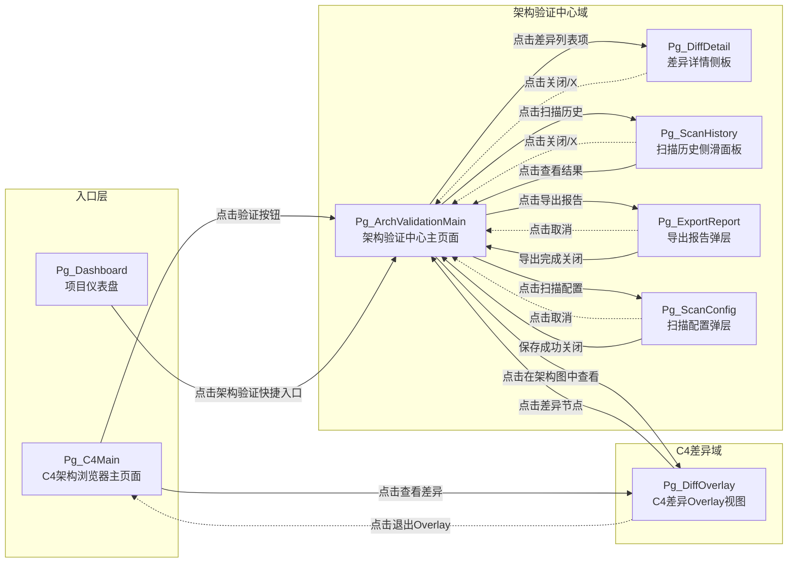
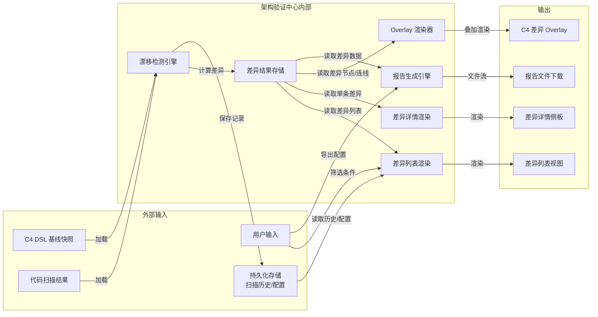
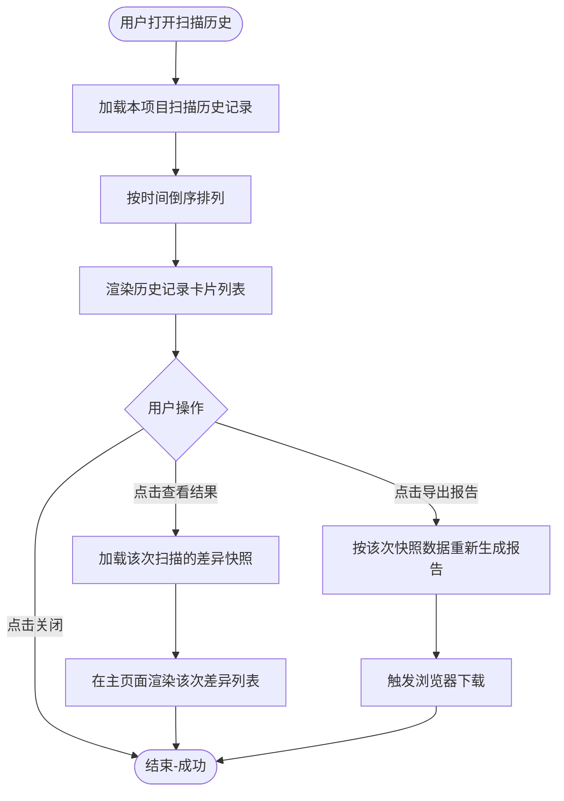
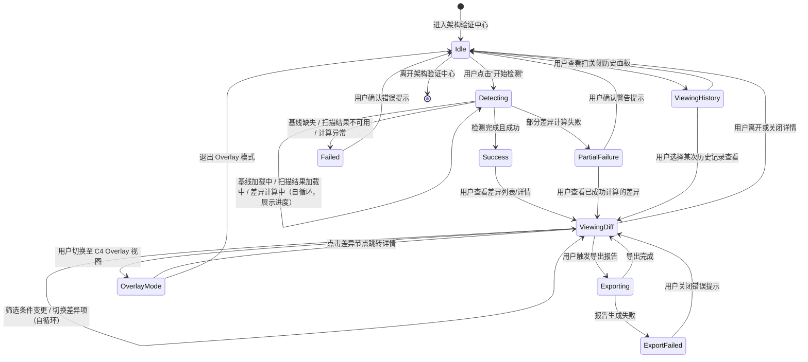
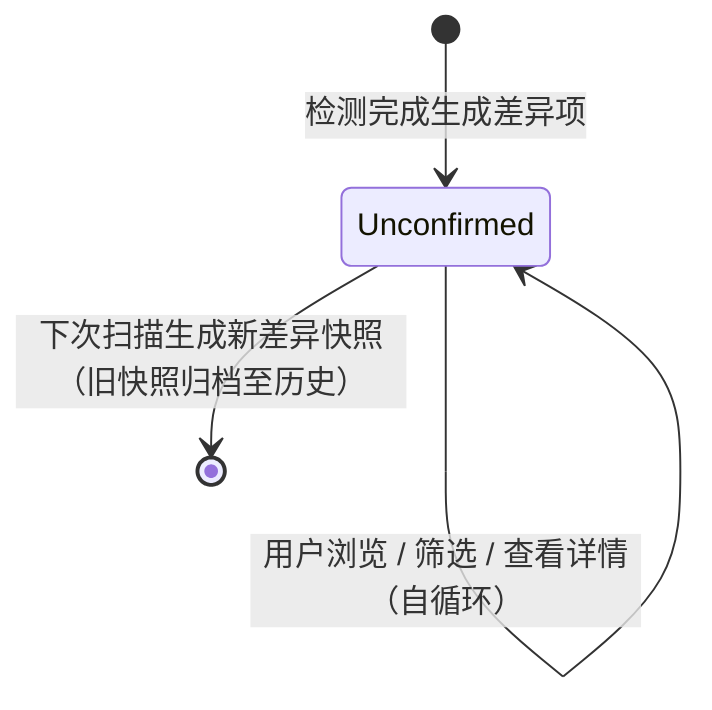
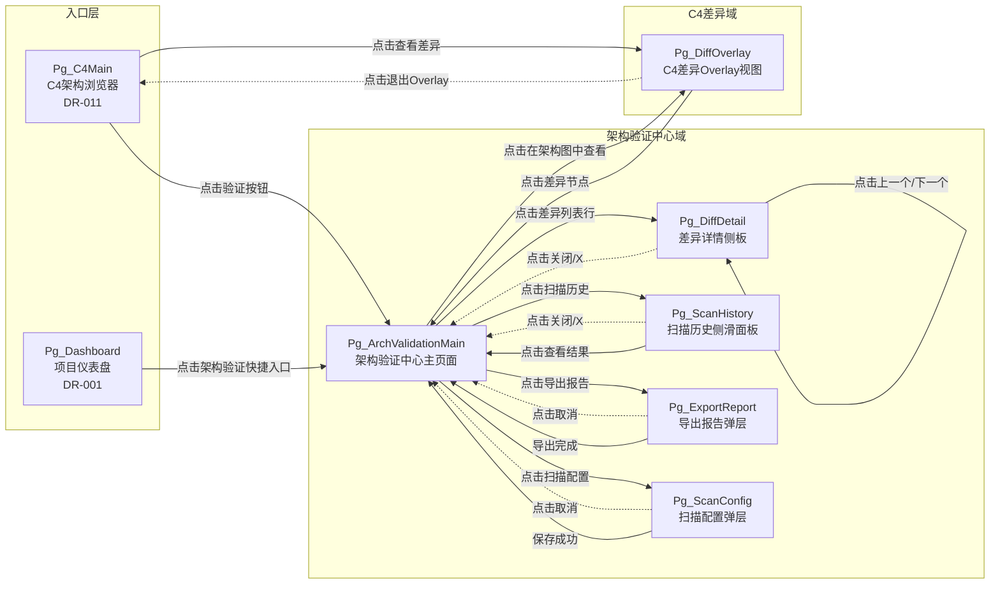

# DR-012：架构验证中心（Architecture Validation Center）—— 模块级详细需求

> **模块编号**：DR-012
> **模块名称**：架构验证中心（Architecture Validation Center）
> **优先级**：P1
> **关联需求**：REQ-P1-005（架构漂移检测）、REQ-P1-006（漂移 diff 可视化）
> **关联用户故事**：US-013（查看架构漂移检测）
> **版本**：v1.0
> **状态**：Draft

---

## 1. 需求追溯与验收标准

### 1.1 需求追溯表

| 需求编号 | 需求名称 | 需求类型 | 关联用户故事 | 本模块覆盖方式 |
|---------|---------|---------|------------|--------------|
| REQ-P1-005 | 架构漂移检测 | 功能需求 | US-013 | 核心业务流程：对比 C4 DSL 基线快照与代码扫描结果，识别新增/删除/修改的组件、接口、依赖 |
| REQ-P1-006 | 漂移 diff 可视化 | 功能需求 | US-013 | 页面交互：在 C4 浏览器中以 overlay 形式图形化展示差异，支持按层级筛选与导出报告 |

### 1.2 IN / OUT 清单

**IN（范围内）**

| # | 功能点 | 说明 |
|:-:|:-------|:-----|
| IN-1 | 手动触发漂移检测 | 用户在架构验证中心点击"开始检测"，系统执行基线对比与漂移分析 |
| IN-2 | 定时扫描配置 | 支持设置自动扫描频率（每日/每周/关闭），MVP 阶段仅本地定时触发 |
| IN-3 | 差异列表展示 | 以结构化列表展示新增/删除/修改的组件、接口、依赖项，标注差异类型与所属层级 |
| IN-4 | C4 浏览器差异 overlay | 在 C4 架构浏览器（DR-011）主画布上叠加差异高亮：新增（绿色）、删除（红色）、修改（黄色） |
| IN-5 | 层级差异筛选 | 支持按 L1/L2/L3/L4 层级筛选差异项，支持按差异类型（新增/删除/修改）筛选 |
| IN-6 | 差异项详情查看 | 点击差异项展示详情侧板，含基线版本内容、当前版本内容、差异字段高亮对比 |
| IN-7 | 扫描历史记录 | 按时间倒序展示历次扫描记录，含扫描时间、差异数量、扫描状态、报告入口 |
| IN-8 | 差异报告导出 | 导出当前差异结果为结构化报告文件（Markdown / HTML 格式） |
| IN-9 | 基线版本管理 | 展示当前比对所使用的 C4 DSL 基线快照版本信息，支持查看基线元数据 |

**OUT（范围外）**

| # | 功能点 | 说明 | 归属模块 |
|:-:|:-------|:-----|:--------:|
| OUT-1 | C4 DSL 生成与编辑 | C4 架构图的生成、DSL 编辑、层级导航由 C4 浏览器负责 | DR-011（C4 架构浏览器） |
| OUT-2 | 代码静态扫描引擎 | 代码扫描的具体实现与解析逻辑由独立扫描服务负责，本模块仅消费扫描结果 | 代码扫描服务 |
| OUT-3 | 架构漂移自动修复建议 | 系统不提供基于差异的自动修复或重构建议 | NG-007（非目标） |
| OUT-4 | 多基线版本对比 | 不支持选择多个历史基线进行三方或多方对比 | 二期规划 |
| OUT-5 | 差异项批量操作 | 不支持对差异项进行批量接受/忽略/修复标记 | 二期规划 |
| OUT-6 | 差异告警通知 | 检测到新漂移时不触发邮件/IM/推送通知 | 通知中心（二期） |
| OUT-7 | PDF / Word 格式导出 | 差异报告仅支持 Markdown / HTML 格式 | 二期规划 |

### 1.3 验收标准（AC Taxonomy）

| # | 类型 | 标准描述 | 质量分 |
|:--|:----:|:-------------|:------:|
| AC-01 | Behavioral | Given 用户在架构验证中心点击"开始检测"，When 系统完成基线对比与代码扫描结果分析，Then 在 10 秒内展示差异列表，列表包含新增/删除/修改三类差异项，准确率不低于 70% | 3 |
| AC-02 | Behavioral | Given 差异列表已展示，When 用户点击某差异项，Then 右侧滑出差异详情侧板，以双栏对比形式展示基线版本与当前版本内容，差异字段高亮标注 | 3 |
| AC-03 | Behavioral | Given 用户处于 C4 浏览器差异 overlay 模式，When 点击画布上的差异高亮节点，Then 自动跳转至架构验证中心并定位到该差异项的详情侧板 | 3 |
| AC-04 | Behavioral | Given 差异列表存在多层级差异项，When 用户在层级筛选器中取消勾选 L2，Then 差异列表与 C4 overlay 同步隐藏所有 L2 层级差异项，保留其他层级展示 | 3 |
| AC-05 | Behavioral | Given 用户完成一次漂移检测且存在差异项，When 点击"导出报告"并选择 Markdown 或 HTML 格式，Then 系统生成包含差异摘要、详细列表、层级统计的结构化报告文件并触发浏览器下载 | 3 |
| AC-06 | Non-behavioral | 漂移检测整体流程耗时 < 10s（P95），含基线加载、扫描结果获取、差异计算 | 3 |
| AC-07 | Non-behavioral | 差异列表首次渲染完成耗时 < 3s（P95），含 100 条差异项 | 3 |
| AC-08 | Non-behavioral | C4 浏览器差异 overlay 渲染延迟 < 3s（P95），overlay 节点数量不超过 200 个 | 3 |
| AC-09 | Non-behavioral | 漂移检测准确率 >= 70%（基线对比与代码扫描结果匹配的组件/接口/依赖识别正确率） | 3 |
| AC-10 | Negative | 系统明确不提供架构漂移的自动修复建议，差异项上不展示"修复"或"一键同步"类操作按钮 | 3 |
| AC-11 | Negative | 系统明确不支持在 MVP 阶段对差异项进行批量接受/忽略/标记操作，每个差异项仅支持查看详情 | 2 |
| AC-12 | Edge case | Given 代码扫描结果为空或解析失败，When 用户触发漂移检测，Then 检测流程正常终止，提示"当前代码扫描结果不可用，请检查项目代码或稍后重试"，不展示差异列表 | 3 |
| AC-13 | Edge case | Given C4 DSL 基线快照缺失（项目未生成概要设计或未保存基线），When 用户进入架构验证中心，Then 主区域展示空状态"暂无架构基线，请先生成 C4 架构图并保存基线"，提供跳转至 C4 浏览器的入口 | 3 |
| AC-14 | Edge case | Given 单次扫描差异项超过 500 条，When 检测结果返回，Then 列表正常展示前 500 条，底部提示"差异项过多，仅展示前 500 条，建议细化层级筛选或拆分模块后重新检测" | 2 |
| AC-15 | Edge case | Given 用户在检测过程中切换项目或关闭页面，When 重新进入架构验证中心，Then 展示上次完成的扫描结果（如有），中断的检测任务不保留中间状态 | 2 |
| AC-16 | Dependency | C4 DSL 基线快照必须已存在（由 DR-011 C4 架构浏览器生成并保存） | 3 |
| AC-17 | Dependency | 代码扫描服务必须可用，能够返回当前项目的结构化扫描结果（组件、接口、依赖列表） | 3 |
| AC-18 | Dependency | C4 架构浏览器（DR-011）必须可用，才能支持差异 overlay 展示与跳转联动 | 3 |

### 1.4 假设注册表

| 编号 | 假设内容 | 影响范围 | 验证方式 |
|-----|---------|---------|---------|
| ASM-1 | 单个项目的 C4 DSL 基线快照大小不超过 2MB（保证加载性能） | NFR | 性能测试验证 |
| ASM-2 | 代码扫描结果的数据格式与 C4 DSL 基线快照的实体模型可映射（组件、接口、依赖存在对应关系） | REQ-P1-005 | Gate 2 概要设计评审 |
| ASM-3 | 用户具备基本的架构图阅读能力与 C4 Model 层级概念 | 全模块 | 用户文档引导 |
| ASM-4 | 漂移检测在 MVP 阶段仅支持本地单机执行，不涉及服务端异步任务队列 | REQ-P1-005 | 产品决策确认 |
| ASM-5 | 架构验证中心的入口从 C4 架构浏览器或项目仪表盘进入，不作为一级导航项 | 入口设计 | PRD 确认 |

---

## 2. 原型与页面结构

### 2.1 页面清单

| 页面编号 | 页面名称 | 页面路径/标识 | 入口方式 | 说明 |
|---------|---------|-------------|---------|------|
| Pg_ArchValidationMain | 架构验证中心主页面 | `/project/{projectId}/arch-validation` | C4 浏览器"验证"按钮、项目仪表盘快捷入口 | 漂移检测触发、差异列表、筛选器、扫描历史入口 |
| Pg_DiffOverlay | C4 差异 Overlay 视图 | C4 浏览器内部 overlay 模式 | C4 浏览器"查看差异"按钮、架构验证中心"在架构图中查看"按钮 | 在 C4 主画布上叠加差异高亮节点与连线的可视化模式 |
| Pg_DiffDetail | 差异详情侧板 | 侧板（非独立页面） | 点击差异列表项或 C4 overlay 差异节点 | 双栏对比展示基线版本与当前版本的详细差异 |
| Pg_ScanHistory | 扫描历史侧滑面板 | 侧滑面板 | 架构验证中心主页面"扫描历史"按钮 | 按时间倒序展示历次扫描记录与快速查看入口 |
| Pg_ExportReport | 导出报告弹层 | 弹层 | 架构验证中心主页面"导出报告"按钮 | 格式选择、报告范围配置、下载触发 |
| Pg_ScanConfig | 扫描配置弹层 | 弹层 | 架构验证中心主页面"配置"按钮 | 定时扫描频率设置、基线版本查看 |

### 2.2 文字化布局结构

#### Pg_ArchValidationMain — 架构验证中心主页面

```
┌─────────────────────────────────────────────────────────────────┐
│ 顶部操作栏                                                       │
│ [返回C4浏览器]  架构验证中心  [扫描配置 ⚙️] [扫描历史 📋]          │
├─────────────────────────────────────────────────────────────────┤
│                                                                 │
│ 检测控制区                                                       │
│ ┌──────────────────────────────────────────────────────────┐   │
│ │ 当前基线：v2026-05-28 14:32（由概要设计自动生成）          │   │
│ │ 上次扫描：2026-05-30 09:15 | 差异数：12                   │   │
│ │                                                          │   │
│ │ [🔍 开始检测]  [在架构图中查看]  [导出报告]                │   │
│ └──────────────────────────────────────────────────────────┘   │
│                                                                 │
│ 筛选工具栏                                                       │
│ 层级：[☑ L1] [☑ L2] [☑ L3] [☑ L4]   类型：[☑ 新增] [☑ 删除] [☑ 修改]│
│                                                                 │
├─────────────────────────────────────────────────────────────────┤
│                                                                 │
│ 差异列表区                                                       │
│ ┌──────────────────────────────────────────────────────────┐   │
│ │ 类型    │ 层级 │ 实体名称       │ 字段变更      │ 时间     │   │
│ ├─────────┼──────┼────────────────┼───────────────┼──────────┤   │
│ │ 🟢 新增 │ L2   │ PaymentService │ —             │ 09:15    │   │
│ │ 🔴 删除 │ L3   │ UserRepo       │ —             │ 09:15    │   │
│ │ 🟡 修改 │ L2   │ OrderService   │ 依赖: +2, -1  │ 09:15    │   │
│ │ 🟢 新增 │ L4   │ validateOrder  │ —             │ 09:15    │   │
│ │ ...     │ ...  │ ...            │ ...           │ ...      │   │
│ └──────────────────────────────────────────────────────────┘   │
│                                                                 │
│ 底部状态栏                                                       │
│ 总计：12 项差异 | 新增 5 | 删除 3 | 修改 4 | 检测耗时：8.2s       │
│                                                                 │
└─────────────────────────────────────────────────────────────────┘
```

**布局说明**：
- 顶部操作栏固定，左侧返回按钮跳转回 C4 浏览器，右侧为配置与历史入口
- 检测控制区展示当前基线版本元信息与上次扫描摘要，主操作按钮行居中排列
- 筛选工具栏固定于列表上方，层级筛选与类型筛选横向排列，支持多选
- 差异列表区占据主区域，表头固定，列表支持纵向滚动，每行展示差异核心信息
- 点击列表行右侧滑出 Pg_DiffDetail 侧板（宽度 480px）
- 底部状态栏固定，汇总当前筛选条件下的差异统计

#### Pg_DiffOverlay — C4 差异 Overlay 视图（位于 C4 浏览器内）

```
┌─────────────────────────────────────────────────────────────────┐
│ 面包屑导航栏：项目名称 > L2-Container > [差异Overlay模式 🔍]      │
├──────────┬──────────────────────────────────────────────────────┤
│          │                                                      │
│ 层级切换 │         主画布区域（C4架构图 + 差异Overlay）          │
│ 工具栏   │                                                      │
│          │    ┌──────────┐         ┌──────────────┐            │
│  [L1]    │    │ 系统A    │ ──────> │ 系统B(外部)  │            │
│  [L2]    │    │(🟡修改)  │         │              │            │
│  [L3]    │    └───┬──────┘         └──────────────┘            │
│  [L4]    │        │                                             │
│          │    ┌───┴──────┐                                      │
│          │    │WebApp    │                                      │
│          │    │(🟢新增)  │                                      │
│          │    └──────────┘                                      │
│          │                                                      │
│  ────────┤    图例：🟢 新增  🔴 删除  🟡 修改                    │
│  差异图例 │                                                      │
│  ────────┤                                                      │
│  差异统计 │    差异节点支持 hover 展示简要变更摘要               │
│  新增:5  │    点击差异节点 → 跳转架构验证中心详情侧板           │
│  删除:3  │                                                      │
│  修改:4  │                                                      │
│          │                                                      │
└──────────┴──────────────────────────────────────────────────────┘
```

**布局说明**：
- 基于 C4 浏览器主页面布局，左侧工具面板新增差异图例与差异统计区域
- 主画布中的架构图保持原有布局，差异节点通过边框色/背景色/角标标识
- 新增节点以绿色边框+绿色角标"+"标识；删除节点以红色边框+红色角标"−"标识；修改节点以黄色边框+黄色角标"~"标识
- 差异连线（新增依赖、删除依赖）以对应颜色虚线标识
- 顶部面包屑右侧标注当前处于"差异 Overlay 模式"
- 右侧保留节点详情侧板能力，点击差异节点时侧板展示差异详情而非普通节点元数据

#### Pg_DiffDetail — 差异详情侧板

```
┌─────────────────────────────────┐
│ 差异详情                   [X]  │
├─────────────────────────────────┤
│                                 │
│ 差异元信息                       │
│ ─────────────────────────────── │
│ 类型：🟡 修改                    │
│ 层级：L2 — Container             │
│ 实体：OrderService               │
│ 检测时间：2026-05-30 09:15:32    │
│                                 │
│ 双栏对比                         │
│ ─────────────────────────────── │
│ ┌──────────────┬──────────────┐ │
│ │  基线版本    │  当前版本    │ │
│ │  (v2026-05-28)│ (代码扫描)  │ │
│ ├──────────────┼──────────────┤ │
│ │ 名称: Order  │ 名称: Order  │ │
│ │ Service      │ Service      │ │
│ │              │              │ │
│ │ 技术栈:      │ 技术栈:      │ │
│ │ Node.js      │ Node.js      │ │
│ │              │              │ │
│ │ 依赖:        │ 依赖:        │ │
│ │ - UserServ   │ - UserServ   │ │
│ │ - ProductSv  │ - ProductSv  │ │
│ │              │ [+PaymentSv] │◄├─ 新增行绿色高亮
│ │              │ [-Inventory] │◄├─ 删除行红色高亮
│ │              │              │ │
│ └──────────────┴──────────────┘ │
│                                 │
│ 字段变更摘要                     │
│ ─────────────────────────────── │
│ • 依赖项：+1（PaymentService），−1（InventoryService）│
│ • 接口数：无变化                  │
│                                 │
│ [上一个差异]  [下一个差异]        │
│                                 │
└─────────────────────────────────┘
```

**布局说明**：
- 侧板宽度 480px，从右侧滑出
- 顶部为元信息区，展示差异类型、层级、实体名称、检测时间
- 中部为双栏对比区，左栏展示基线版本内容，右栏展示当前扫描版本内容，差异行以色块高亮
- 底部为字段变更摘要与前后导航按钮
- 支持键盘快捷键（↑/↓）切换差异项

#### Pg_ScanHistory — 扫描历史侧滑面板

```
┌──────────────────────────┐
│ 扫描历史            [X]  │
├──────────────────────────┤
│                          │
│ [2026-05-30 09:15]       │
│ 状态：✅ 完成 | 差异：12  │
│ [查看结果] [导出报告]     │
│ ──────────────────────── │
│                          │
│ [2026-05-28 18:42]       │
│ 状态：✅ 完成 | 差异：8   │
│ [查看结果] [导出报告]     │
│ ──────────────────────── │
│                          │
│ [2026-05-25 10:00]       │
│ 状态：⚠️ 部分失败 | 差异：─│
│ [查看错误]               │
│ ──────────────────────── │
│                          │
└──────────────────────────┘
```

**布局说明**：
- 侧滑面板宽度 360px，从右侧滑出
- 按时间倒序排列扫描记录卡片
- 每条记录含时间戳、状态徽章、差异数量、操作按钮
- 状态分为：完成 / 进行中 / 部分失败 / 失败

#### Pg_ExportReport — 导出报告弹层

```
┌─────────────────────────────┐
│ 导出差异报告             [X] │
├─────────────────────────────┤
│                             │
│ 格式选择：                   │
│ ○ Markdown  ● HTML          │
│                             │
│ 报告范围：                   │
│ ○ 当前筛选结果              │
│ ● 全部差异项                │
│                             │
│ 包含内容：                   │
│ ☑ 差异摘要统计               │
│ ☑ 详细差异列表               │
│ ☑ 层级分布图表               │
│ ☐ 基线版本信息               │
│                             │
│ [取消]    [确认导出]         │
│                             │
└─────────────────────────────┘
```

#### Pg_ScanConfig — 扫描配置弹层

```
┌─────────────────────────────┐
│ 扫描配置                 [X] │
├─────────────────────────────┤
│                             │
│ 定时扫描频率：               │
│ ○ 关闭   ○ 每日   ● 每周   │
│                             │
│ 当前基线版本：               │
│ v2026-05-28 14:32           │
│ 来源：概要设计自动生成       │
│ [查看基线详情]               │
│                             │
│ [取消]    [保存配置]         │
│                             │
└─────────────────────────────┘
```

### 2.3 关键交互流程

**流程 A：手动触发漂移检测 → 查看差异列表 → 查看详情**
1. 用户进入架构验证中心主页面
2. 系统展示当前基线版本信息与上次扫描摘要
3. 用户点击"开始检测"按钮
4. 系统执行基线对比与代码扫描结果分析
5. 检测完成，差异列表区展示新增/删除/修改的差异项
6. 用户点击某差异项（如 OrderService 修改项）
7. 右侧滑出差异详情侧板，展示双栏对比内容
8. 用户在侧板点击"下一个差异"继续浏览

**流程 B：在 C4 浏览器中查看差异 Overlay**
1. 用户在 C4 架构浏览器 L2 Container 图浏览
2. 用户点击"查看差异"按钮（仅在存在已完成扫描时可用）
3. C4 主画布切换至差异 Overlay 模式
4. 架构图上叠加差异高亮：OrderService 边框变黄（修改）、PaymentService 边框变绿（新增）
5. 用户 hover 修改节点，浮层展示简要变更摘要"依赖：+1, −1"
6. 用户点击差异节点，跳转至架构验证中心并自动展开该差异项的详情侧板

**流程 C：导出差异报告**
1. 用户在架构验证中心完成检测且差异列表非空
2. 用户点击"导出报告"按钮
3. 弹出导出报告弹层
4. 用户选择 HTML 格式、全部差异项范围、勾选包含内容
5. 点击"确认导出"
6. 系统生成报告文件并触发浏览器下载

**流程 D：查看扫描历史**
1. 用户在架构验证中心点击"扫描历史"按钮
2. 右侧滑出扫描历史面板
3. 用户浏览历次扫描记录
4. 用户点击某次历史记录的"查看结果"
5. 架构验证中心主区域切换展示该次扫描的差异列表

### 2.4 页面跳转图



---

## 3. 输入输出字段

### 3.1 用户输入字段

| 字段名 | 所属页面 | 输入方式 | 数据类型 | 约束条件 | 必填 |
|-------|---------|---------|---------|---------|------|
| level_filter | Pg_ArchValidationMain | 多选框组 | 数组 | L1 / L2 / L3 / L4，可多选，默认全选 | 否 |
| type_filter | Pg_ArchValidationMain | 多选框组 | 数组 | added / removed / modified，可多选，默认全选 | 否 |
| export_format | Pg_ExportReport | 单选 | 枚举 | markdown / html | 是 |
| export_scope | Pg_ExportReport | 单选 | 枚举 | filtered / all；默认 all | 是 |
| export_include_summary | Pg_ExportReport | 复选框 | 布尔 | 默认 true | 否 |
| export_include_list | Pg_ExportReport | 复选框 | 布尔 | 默认 true | 否 |
| export_include_chart | Pg_ExportReport | 复选框 | 布尔 | 默认 true | 否 |
| export_include_baseline | Pg_ExportReport | 复选框 | 布尔 | 默认 false | 否 |
| scan_frequency | Pg_ScanConfig | 单选 | 枚举 | off / daily / weekly；默认 off | 是 |

### 3.2 系统输入字段

| 字段名 | 来源 | 数据类型 | 说明 |
|-------|------|---------|------|
| project_id | 全局上下文 | 字符串 | 当前激活的项目标识 |
| baseline_snapshot | 基线存储 | 对象 | C4 DSL 基线快照内容，含 L1/L2/L3/L4 四级架构数据 |
| baseline_version | 基线存储 | 字符串 | 基线版本标识（时间戳或语义化版本） |
| baseline_source | 基线存储 | 字符串 | 基线来源描述（如"概要设计自动生成"） |
| scan_result | 代码扫描服务 | 对象 | 当前代码扫描结果，含组件列表、接口列表、依赖列表 |
| scan_timestamp | 代码扫描服务 | 时间 | 代码扫描结果生成时间 |
| last_scan_record | 持久化存储 | 对象 | 上次扫描记录：时间、差异数量、状态 |
| scan_history | 持久化存储 | 数组 | 本项目历次扫描记录列表 |
| c4_renderer_state | C4 浏览器 | 对象 | C4 浏览器当前渲染状态：当前层级、节点位置、缩放比例 |

### 3.3 页面回显字段

| 字段名 | 所属页面 | 数据类型 | 说明 |
|-------|---------|---------|------|
| baseline_info | Pg_ArchValidationMain | 对象 | 当前基线版本、来源、生成时间 |
| last_scan_info | Pg_ArchValidationMain | 对象 | 上次扫描时间、差异总数、扫描状态 |
| diff_list | Pg_ArchValidationMain | 数组 | 差异项列表，每项含 diff_id / type / level / entity_name / change_summary / timestamp |
| diff_stats | Pg_ArchValidationMain | 对象 | 差异统计：total / added / removed / modified |
| scan_duration | Pg_ArchValidationMain | 浮点数 | 最近一次检测耗时（秒） |
| baseline_content | Pg_DiffDetail | 对象 | 差异项在基线版本中的完整内容 |
| current_content | Pg_DiffDetail | 对象 | 差异项在当前扫描版本中的完整内容 |
| diff_highlights | Pg_DiffDetail | 数组 | 差异字段高亮标记列表：字段路径 / 基线值 / 当前值 / 差异类型 |
| overlay_nodes | Pg_DiffOverlay | 数组 | 差异 overlay 节点数据：node_id / diff_type / position / brief_summary |
| overlay_edges | Pg_DiffOverlay | 数组 | 差异 overlay 连线数据：source / target / diff_type |
| history_entries | Pg_ScanHistory | 数组 | 扫描历史记录列表：timestamp / status / diff_count / report_url |

### 3.4 接口响应字段

| 字段名 | 来源操作 | 数据类型 | 说明 |
|-------|---------|---------|------|
| diff_result | 漂移检测请求 | 对象 | 检测完整结果：diff_list / diff_stats / accuracy_estimate / baseline_version / scan_timestamp |
| detection_status | 漂移检测请求 | 枚举 | completed / partial_failure / failed |
| detection_error | 漂移检测请求 | 字符串 | 检测失败时的错误描述 |
| report_file_url | 导出报告请求 | 字符串 | 生成的报告文件临时下载地址 |
| report_generation_status | 导出报告请求 | 枚举 | success / failed |
| config_save_status | 扫描配置保存 | 枚举 | success / failed |

### 3.5 数据流转图



---

## 4. 业务逻辑与状态机

### 4.1 核心业务流程

#### 流程 1：漂移检测流程（基线对比与差异计算）

```mermaid
flowchart TD
    Start([用户触发检测]) --> LoadBaseline[加载 C4 DSL 基线快照]
    LoadBaseline --> CheckBaseline{基线是否存在}
    CheckBaseline -->|不存在| EmptyBaseline[提示"暂无架构基线"]
    EmptyBaseline --> EndFail([结束-失败])
    CheckBaseline -->|存在| LoadScan[加载代码扫描结果]
    LoadScan --> CheckScan{扫描结果是否可用}
    CheckScan -->|不可用| ScanFail[提示"代码扫描结果不可用"]
    ScanFail --> EndFail
    CheckScan -->|可用| ParseBaseline[解析基线架构实体]
    ParseBaseline --> ParseScan[解析扫描结果实体]
    ParseScan --> MatchEntity[实体对齐与匹配]
    MatchEntity --> DiffCalc[计算差异：新增 / 删除 / 修改]
    DiffCalc --> AccuracyCalc[计算检测准确率估算值]
    AccuracyCalc --> FilterLevel{按当前层级筛选}
    FilterLevel --> FilterType{按当前类型筛选}
    FilterType --> StoreResult[保存检测结果至差异存储]
    StoreResult --> SaveHistory[写入扫描历史记录]
    SaveHistory --> RenderList[渲染差异列表与统计]
    RenderList --> EndSuccess([结束-成功])
```

#### 流程 2：差异可视化与 Overlay 展示流程

```mermaid
flowchart TD
    Start([用户请求查看 Overlay]) --> CheckDiff{是否存在已完成扫描}
    CheckDiff -->|不存在| NoDiff[提示"暂无扫描结果，请先执行检测"]
    NoDiff --> EndFail([结束-失败])
    CheckDiff -->|存在| LoadC4State[加载 C4 浏览器当前渲染状态]
    LoadC4State --> MapDiffToNodes[将差异项映射至 C4 节点坐标]
    MapDiffToNodes --> RenderOverlay[渲染差异节点高亮与角标]
    RenderOverlay --> RenderEdges[渲染差异连线：新增/删除依赖]
    RenderEdges --> ShowLegend[展示差异图例与统计面板]
    ShowLegend --> UserInteract{用户交互}
    UserInteract -->|点击差异节点| OpenDetail[跳转至架构验证中心并展开详情侧板]
    UserInteract -->|切换层级| ReMap[重新映射差异项至新层级节点]
    ReMap --> RenderOverlay
    UserInteract -->|退出 Overlay| EndSuccess([结束-成功])
    OpenDetail --> EndSuccess
```

#### 流程 3：差异报告导出流程

```mermaid
flowchart TD
    Start([用户触发导出]) --> CheckDiff{差异列表是否非空}
    CheckDiff -->|为空| EmptyDiff[提示"当前无差异项可导出"]
    EmptyDiff --> EndFail([结束-失败])
    CheckDiff -->|非空| CollectData[收集差异数据与导出配置]
    CollectData --> GenSummary[生成差异摘要统计]
    GenSummary --> GenList[生成详细差异列表]
    GenList --> GenChart[生成分层分布图表数据]
    GenChart --> Assemble[按所选格式组装报告]
    Assemble --> GenerateFile[生成报告文件]
    GenerateFile --> TriggerDownload[触发浏览器下载]
    TriggerDownload --> EndSuccess([结束-成功])
```

#### 流程 4：扫描历史查看流程



### 4.2 业务规则映射

| 规则编号 | 规则名称 | 规则内容 | 适用场景 | 触发条件 |
|---------|---------|---------|---------|---------|
| BR-016 | 基线必须先行 | 架构漂移检测依赖于已存在的 C4 DSL 基线快照，无基线时禁止触发检测 | 漂移检测 | 每次检测前校验基线存在性 |
| BR-017 | 差异类型三色标注 | 新增差异使用绿色标识，删除差异使用红色标识，修改差异使用黄色标识，颜色定义全模块统一 | 差异列表、Overlay 展示、报告导出 | 差异计算完成后 |
| BR-018 | 准确率门控展示 | 当检测准确率估算值低于 70% 时，在差异列表顶部展示黄色警告条"检测准确率较低，建议人工复核" | 漂移检测 | 准确率计算完成后 |
| BR-019 | Overlay 与列表双向联动 | C4 浏览器中的差异节点点击跳转至架构验证中心对应差异项；架构验证中心点击"在架构图中查看"切换至 C4 Overlay 模式 | 跨模块联动 | 用户点击差异节点或查看按钮 |
| BR-020 | 扫描结果不自动覆盖 | 新扫描结果保存为新的差异快照，不覆盖历史扫描结果，用户可在扫描历史中查看任意历史结果 | 扫描历史 | 每次检测完成后 |
| BR-021 | 差异项上限截断 | 单次扫描差异项超过 500 条时，仅展示前 500 条并提示用户，避免前端渲染性能问题 | 差异列表渲染 | 差异列表生成时 |

### 4.3 状态机

#### 检测会话状态机



#### 差异项状态机



> 注：MVP 阶段差异项仅支持查看，不支持确认/忽略/修复状态流转。二期规划可扩展为 Confirmed / Ignored / Fixed 等状态。

### 4.4 异常处理

| 异常场景 | 触发条件 | 系统响应 | 用户可见反馈 | 恢复路径 |
|---------|---------|---------|------------|---------|
| EX-1 C4 DSL 基线缺失 | 检测前校验未找到已保存的基线快照 | 终止检测流程 | 主区域展示空状态"暂无架构基线，请先生成 C4 架构图并保存基线"，提供跳转 C4 浏览器入口 | 用户前往 C4 浏览器生成并保存基线后返回 |
| EX-2 代码扫描结果不可用 | 扫描服务返回空结果或解析失败 | 终止检测流程 | 提示"当前代码扫描结果不可用，请检查项目代码或稍后重试" | 用户检查本地代码后重新触发检测 |
| EX-3 检测超时（>10s） | 基线加载、扫描结果获取或差异计算超时 | 终止检测任务 | 提示"检测超时，请检查基线文件大小或稍后重试"，展示已加载进度 | 用户重新触发检测 |
| EX-4 部分差异计算失败 | 某些实体匹配或字段对比过程中发生异常 | 继续完成其余差异计算 | 差异列表顶部展示黄色警告条"部分差异项计算失败，结果可能不完整"，失败项不展示 | 用户重新触发检测或查看扫描历史 |
| EX-5 差异项数量超限（>500） | 单次检测差异项超过 500 条 | 截断展示前 500 条 | 列表底部提示"差异项过多，仅展示前 500 条，建议细化层级筛选或拆分模块后重新检测" | 用户通过筛选缩小范围，或调整模块粒度后重新检测 |
| EX-6 Overlay 节点坐标映射失败 | C4 浏览器中某些差异项对应的基线节点坐标不存在 | 跳过该节点的 Overlay 渲染 | 该差异项仅在列表中展示，Overlay 中无对应高亮；日志记录映射失败原因 | 用户切换至可映射的层级重新查看 Overlay |
| EX-7 报告导出失败 | 文件生成过程中发生异常或内存不足 | 终止导出 | 弹层内展示红色错误文案"报告生成失败：{具体原因}" | 用户调整导出范围（如选择"当前筛选结果"而非"全部"）后重试 |
| EX-8 定时扫描触发时项目未激活 | 定时任务触发但项目处于 Archived 态或已关闭 | 跳过本次扫描 | 无用户感知（后台静默跳过），扫描历史不记录 | 用户重新激活项目后手动触发 |

---

## 5. 交互规格

### 5.1 按钮级交互状态机

#### Pg_ArchValidationMain — 架构验证中心主页面

---

**元素："开始检测"按钮（#btn-start-detection）**

| 属性 | 说明 |
|------|------|
| 触发方式 | click |
| 前置条件 | C4 DSL 基线快照已存在；当前无正在进行的检测任务 |
| 立即反馈 | 按钮置灰禁用，文案变为"检测中..."，左侧显示旋转 loading 图标；检测控制区展示进度条（基线加载 → 扫描结果加载 → 差异计算） |
| 成功结果 | 按钮恢复为"开始检测"，差异列表区渲染新增/删除/修改的差异项，底部状态栏更新统计与耗时 |
| 失败结果 | 按钮恢复可点击，根据失败原因展示对应提示（基线缺失 / 扫描结果不可用 / 超时） |
| 异常分支 | ① 检测过程中用户切换页面 → 后台继续执行，返回后展示检测结果；② 检测过程中用户点击其他操作 → 当前操作进入队列，检测完成后依次执行；③ 定时扫描正在执行时用户手动触发 → 提示"已有检测任务在执行中，请等待完成" |
| 埋点事件 | `archval_detect_start`，携带参数：`{project_id, baseline_version, trigger_mode: 'manual'|'scheduled'}`；成功后补报 `archval_detect_complete`，携带参数：`{project_id, diff_total, added_count, removed_count, modified_count, duration_ms, accuracy_estimate}` |

---

**元素：层级筛选器（#filter-level-{L1/L2/L3/L4}）**

| 属性 | 说明 |
|------|------|
| 触发方式 | click（复选框切换） |
| 前置条件 | 差异列表已加载且非空 |
| 立即反馈 | 复选框状态立即切换，差异列表区展示 loading 骨架屏，C4 Overlay 同步刷新（若处于 Overlay 模式） |
| 成功结果 | 列表仅展示符合选中层级的差异项，底部统计同步更新；全不选时展示"请至少选择一项层级"提示 |
| 失败结果 | 筛选异常时列表保持上次成功结果 |
| 异常分支 | ① 快速切换多个层级 → 防抖处理，仅最后一次有效操作触发筛选；② 筛选后列表为空 → 展示空状态"当前筛选条件下无差异项" |
| 埋点事件 | `archval_level_filter_change`，携带参数：`{project_id, selected_levels: string[], diff_count_after_filter}` |

---

**元素：类型筛选器（#filter-type-{added/removed/modified}）**

| 属性 | 说明 |
|------|------|
| 触发方式 | click（复选框切换） |
| 前置条件 | 差异列表已加载且非空 |
| 立即反馈 | 复选框状态立即切换，差异列表区展示 loading 骨架屏 |
| 成功结果 | 列表仅展示符合选中类型的差异项，底部统计同步更新 |
| 失败结果 | 筛选异常时列表保持上次成功结果 |
| 异常分支 | ① 快速切换多个类型 → 防抖处理；② 全不选时自动恢复全选状态并提示"请至少选择一项类型" |
| 埋点事件 | `archval_type_filter_change`，携带参数：`{project_id, selected_types: string[], diff_count_after_filter}` |

---

**元素："在架构图中查看"按钮（#btn-view-in-C4）**

| 属性 | 说明 |
|------|------|
| 触发方式 | click |
| 前置条件 | 当前存在已完成的扫描结果且差异列表非空 |
| 立即反馈 | 按钮置灰禁用，显示 loading spinner |
| 成功结果 | 跳转至 C4 浏览器差异 Overlay 模式，架构图叠加差异高亮渲染 |
| 失败结果 | 按钮恢复，提示"Overlay 加载失败：{原因}" |
| 异常分支 | ① C4 浏览器当前层级无差异项映射 → 提示"当前层级无差异，请切换层级后重试"；② C4 浏览器不可用 → 提示"C4 架构浏览器加载失败，请刷新页面" |
| 埋点事件 | `archval_view_in_c4_click`，携带参数：`{project_id, current_level, diff_count}` |

---

**元素："导出报告"按钮（#btn-export-report）**

| 属性 | 说明 |
|------|------|
| 触发方式 | click |
| 前置条件 | 当前存在已完成的扫描结果且差异列表非空 |
| 立即反馈 | 弹出 Pg_ExportReport 弹层，预填充当前筛选条件与默认导出配置 |
| 成功结果 | 用户配置后点击确认，生成报告文件并触发浏览器下载 |
| 失败结果 | 弹层加载异常 → 按钮恢复，toast 提示"操作失败" |
| 异常分支 | 无 |
| 埋点事件 | `archval_export_click`，携带参数：`{project_id, export_format, export_scope}` |

---

**元素：差异列表行（#diff-row-{diffId}）**

| 属性 | 说明 |
|------|------|
| 触发方式 | click |
| 前置条件 | 差异列表已加载，对应差异项存在 |
| 立即反馈 | 行背景高亮（选中态），右侧滑出 Pg_DiffDetail 侧板 |
| 成功结果 | 侧板加载该差异项的基线版本与当前版本双栏对比内容 |
| 失败结果 | 详情加载失败 → 侧板内展示"加载失败，请重试" |
| 异常分支 | ① 侧板已打开时点击另一行 → 侧板内容切换为新差异项，无关闭再打开动画；② 连续快速点击多行 → 防抖处理，仅展示最后一次点击的差异详情 |
| 埋点事件 | `archval_diff_row_click`，携带参数：`{project_id, diff_id, diff_type, diff_level, entity_name}` |

---

**元素："扫描历史"按钮（#btn-scan-history）**

| 属性 | 说明 |
|------|------|
| 触发方式 | click |
| 前置条件 | 无 |
| 立即反馈 | 按钮缩放动效，右侧滑出 Pg_ScanHistory 侧滑面板 |
| 成功结果 | 面板加载本项目历次扫描记录列表 |
| 失败结果 | 面板加载失败 → 按钮恢复，提示"扫描历史加载失败" |
| 异常分支 | 无历史记录时面板展示空状态"暂无扫描历史" |
| 埋点事件 | `archval_history_open`，携带参数：`{project_id, history_count}` |

---

**元素："扫描配置"按钮（#btn-scan-config）**

| 属性 | 说明 |
|------|------|
| 触发方式 | click |
| 前置条件 | 无 |
| 立即反馈 | 弹出 Pg_ScanConfig 弹层，预填充当前配置 |
| 成功结果 | 用户修改后点击保存，配置更新成功，弹层关闭 |
| 失败结果 | 配置保存失败 → 弹层内展示错误提示 |
| 异常分支 | 无 |
| 埋点事件 | `archval_config_open`，携带参数：`{project_id, current_frequency}` |

---

#### Pg_DiffDetail — 差异详情侧板

---

**元素："上一个差异"按钮（#btn-prev-diff）**

| 属性 | 说明 |
|------|------|
| 触发方式 | click / 键盘 ↑ |
| 前置条件 | 当前差异项在列表中不是第一条 |
| 立即反馈 | 按钮置灰（若已是第一条），侧板内容区域展示 skeleton loading |
| 成功结果 | 侧板内容切换为上一差异项的双栏对比 |
| 失败结果 | 无 |
| 异常分支 | 当前筛选条件变更导致上一项不可见 → 自动跳过不可见项，定位至可见的前一项 |
| 埋点事件 | `archval_diff_nav_prev`，携带参数：`{project_id, from_diff_id, to_diff_id}` |

---

**元素："下一个差异"按钮（#btn-next-diff）**

| 属性 | 说明 |
|------|------|
| 触发方式 | click / 键盘 ↓ |
| 前置条件 | 当前差异项在列表中不是最后一条 |
| 立即反馈 | 按钮置灰（若已是最后一条），侧板内容区域展示 skeleton loading |
| 成功结果 | 侧板内容切换为下一差异项的双栏对比 |
| 失败结果 | 无 |
| 异常分支 | 当前筛选条件变更导致下一项不可见 → 自动跳过不可见项 |
| 埋点事件 | `archval_diff_nav_next`，携带参数：`{project_id, from_diff_id, to_diff_id}` |

---

#### Pg_DiffOverlay — C4 差异 Overlay 视图

---

**元素：差异节点（C4 架构图上叠加的差异标识节点）**

| 属性 | 说明 |
|------|------|
| 触发方式 | click / hover |
| 前置条件 | 节点已成功映射差异数据并渲染 overlay |
| 立即反馈 | hover：节点边框加粗，浮层展示简要变更摘要（如"依赖：+1, −1"）；click：节点高亮脉冲动效 |
| 成功结果（hover） | 浮层 200ms 延迟出现后展示摘要，鼠标移出后浮层消失 |
| 成功结果（click） | 跳转至 Pg_ArchValidationMain，该差异项行高亮选中，Pg_DiffDetail 侧板自动展开 |
| 失败结果 | 节点数据异常 → 渲染为灰色问号占位态，hover 提示"差异数据不完整" |
| 异常分支 | ① 快速 hover 多个节点 → tooltip 防抖跟随最后 hover 的节点；② 点击时架构验证中心加载失败 → 提示"详情加载失败，请重试" |
| 埋点事件 | `archval_overlay_node_click`，携带参数：`{project_id, diff_id, node_id, diff_type, level}` |

---

#### Pg_ExportReport — 导出报告弹层

---

**元素："确认导出"按钮（#btn-confirm-export）**

| 属性 | 说明 |
|------|------|
| 触发方式 | click |
| 前置条件 | 差异列表非空，格式已选择 |
| 立即反馈 | 按钮置灰禁用，文案变为"生成中..."，展示进度条 |
| 成功结果 | 报告文件生成完毕，触发浏览器下载，弹层自动关闭 |
| 失败结果 | 生成失败 → 按钮恢复，弹层内展示错误文案"报告生成失败：{原因}" |
| 异常分支 | ① 生成过程中用户点击取消 → 终止生成任务；② 内存不足 → 提示"导出范围过大，请选择"当前筛选结果"后重试" |
| 埋点事件 | `archval_export_confirm`，携带参数：`{project_id, format, scope, include_summary, include_list, include_chart, include_baseline}`；成功后补报 `archval_export_success`，携带参数：`{project_id, file_size_bytes}` |

---

#### Pg_ScanConfig — 扫描配置弹层

---

**元素："保存配置"按钮（#btn-save-config）**

| 属性 | 说明 |
|------|------|
| 触发方式 | click |
| 前置条件 | 扫描频率已选择 |
| 立即反馈 | 按钮置灰禁用，文案变为"保存中..." |
| 成功结果 | 配置保存成功，弹层关闭，架构验证中心顶部展示短暂成功 toast"配置已保存" |
| 失败结果 | 保存失败 → 按钮恢复，弹层内展示错误提示 |
| 异常分支 | 无 |
| 埋点事件 | `archval_config_save`，携带参数：`{project_id, frequency}` |

---

### 5.2 页面间跳转关系图



---

## 附录：术语表

| 术语 | 说明 |
|-----|------|
| 架构漂移（Architecture Drift） | 系统设计文档（基线）与实际代码实现之间产生的结构差异，包括组件增减、接口变更、依赖关系变化 |
| C4 DSL 基线快照 | 在特定时间点保存的 C4 架构模型数据，作为后续漂移检测的对比基准 |
| 差异项（Diff Item） | 单次漂移检测中识别出的一条具体差异，包含差异类型、层级、实体名称、变更内容 |
| Overlay | 在 C4 架构浏览器主画布之上叠加的差异可视化层，通过颜色与角标标识差异节点 |
| 代码扫描结果 | 对项目源代码进行结构化分析后得到的组件、接口、依赖列表数据 |
| 检测准确率 | 漂移检测算法正确识别真实差异的比例，本模块要求 >= 70% |
| 新增（Added） | 实际代码中存在但基线中不存在的组件/接口/依赖 |
| 删除（Removed） | 基线中存在但实际代码中不存在的组件/接口/依赖 |
| 修改（Modified） | 基线与实际代码中均存在但属性或关系发生变化的组件/接口/依赖 |

---

## 附录：变更记录

| 版本 | 日期 | 修改人 | 修改内容 |
|:----:|:----:|:-------|:---------|
| v1.0 | 2026-06-01 | AI PM | 初始版本，包含 5 个标准章节，覆盖漂移检测、差异可视化、C4 Overlay、扫描历史、报告导出完整交互规格 |
