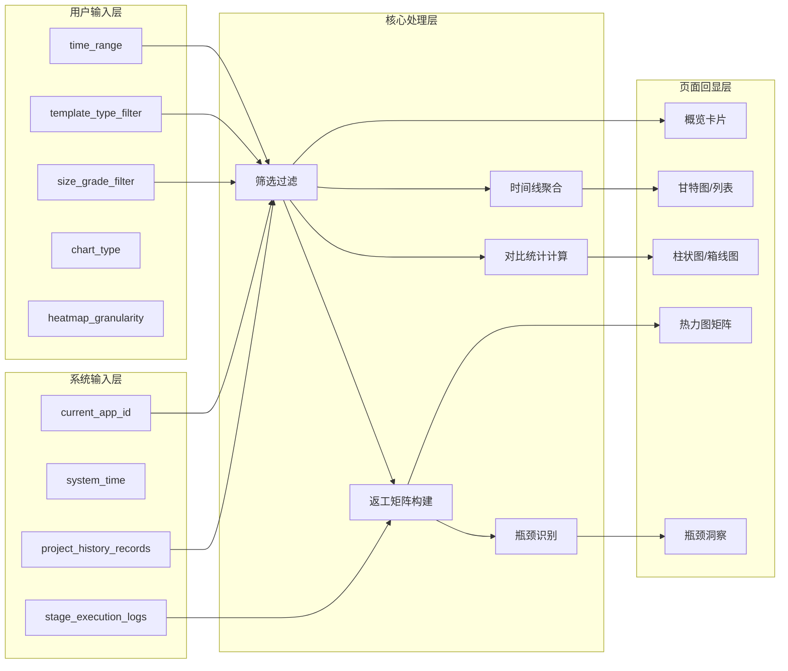
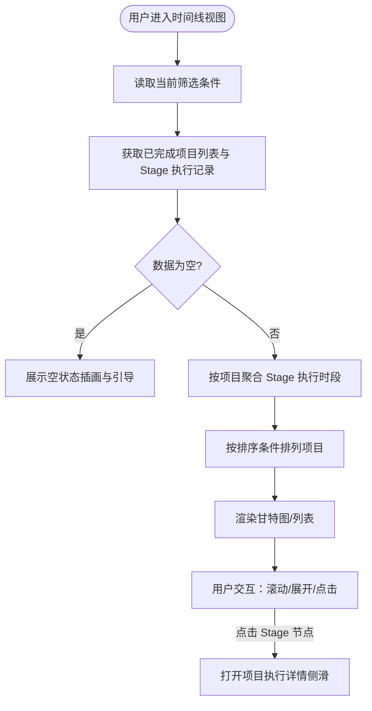
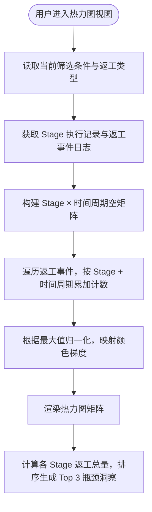
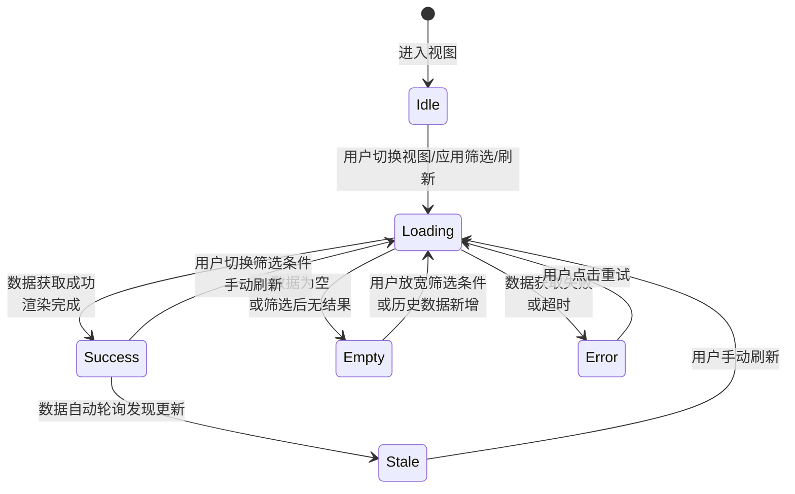
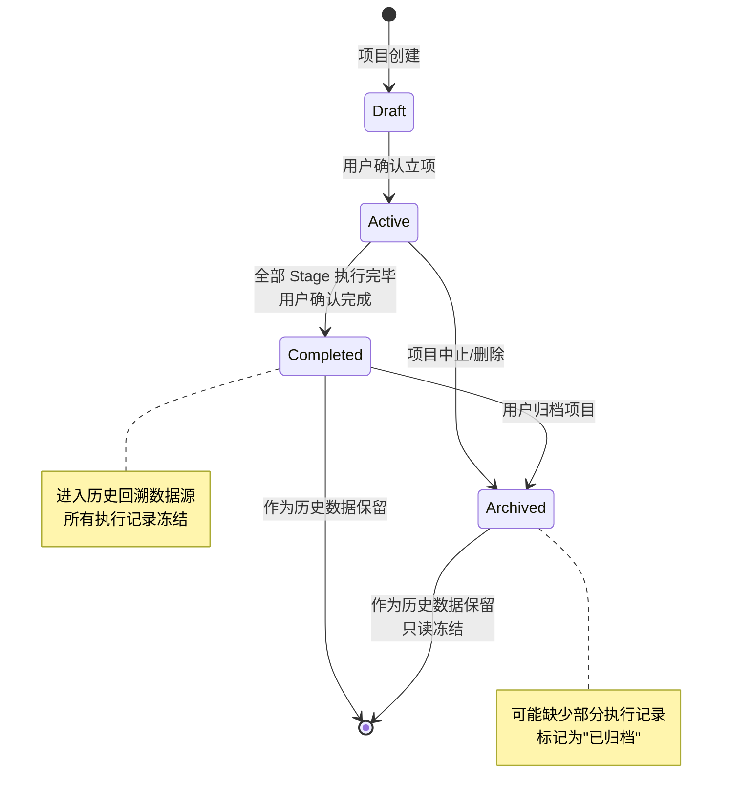
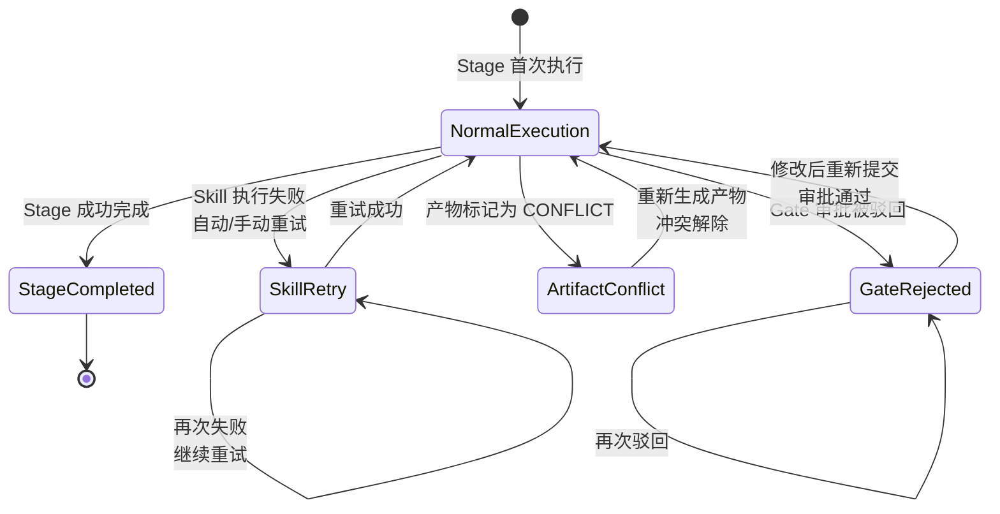

# DR-013：历史回溯（History & Analytics）模块详细需求

> **模块编号**：DR-013  
> **模块名称**：历史回溯（History & Analytics）  
> **关联需求**：REQ-P1-001、REQ-P1-002、REQ-P1-003  
> **关联用户故事**：US-006（查看历史项目统计）  
> **版本**：v1.0  
> **状态**：Draft

---

## 1. 需求追溯与验收标准

### 1.1 需求追溯表

| 上游需求 ID | 需求简述 | 本模块功能点 | 覆盖优先级 |
|:-----------:|----------|--------------|:----------:|
| REQ-P1-001 | 历史项目时间线 | 已完成项目的阶段执行时间线展示（甘特图/列表）、Stage 起止时间与耗时、状态展示 | Must |
| REQ-P1-002 | 阶段耗时对比 | 同类型项目横向阶段耗时对比、柱状图/箱线图可视化、按模板类型与项目规模筛选 | Must |
| REQ-P1-003 | 返工热力图 | 各阶段重试/驳回频率可视化、Stage × 时间矩阵热力图、流程瓶颈识别 | Must |

### 1.2 功能范围 IN/OUT 清单

**IN（范围内）**

| # | 功能点 | 说明 |
|:-:|:-------|:-----|
| IN-1 | 历史项目时间线视图 | 以甘特图或列表形式展示已完成项目的各 Stage 执行时间线，含开始/结束时间、耗时、状态 |
| IN-2 | 阶段耗时对比视图 | 同类型项目间各 Stage 耗时的横向对比，支持柱状图与箱线图两种可视化形式 |
| IN-3 | 返工热力图视图 | 以 Stage × 时间周期矩阵展示各阶段重试/驳回频率，颜色梯度表示返工密度 |
| IN-4 | 筛选与对比维度控制 | 按模板类型（Trivial/Light/Standard/Deep）、项目规模等级（S/M/L/XL）、时间范围筛选 |
| IN-5 | 单项目详情穿透 | 从时间线或热力图中点击单个项目，穿透查看该项目的完整阶段执行明细与产物历史 |
| IN-6 | 数据导出 | 支持将当前视图的统计摘要导出为 Markdown 报告或结构化数据文件 |
| IN-7 | 空状态与引导 | 无历史数据时展示空状态插画与引导文案 |

**OUT（范围外）**

| # | 功能点 | 说明 | 归属模块 |
|:-:|:-------|:-----|:--------:|
| OUT-1 | 实时项目监控 | 进行中项目的实时进度追踪、Token 消耗监控 | DR-014（监控看板） |
| OUT-2 | 项目创建与编辑 | 项目的 CRUD 操作 | DR-001（项目工作台） |
| OUT-3 | 产物版本管理 | 产物文件的 diff、冲突检测、Git 快照管理 | DR-005（产物浏览器） |
| OUT-4 | 阶段执行与编排 | Stage 的具体执行、Skill 调度 | DR-003（阶段详情面板）、DR-007（Flow 编排引擎） |
| OUT-5 | 预测性分析 | 基于历史数据预测新项目工期或风险 | 二期规划 |
| OUT-6 | 多 Workspace 数据聚合 | 跨 Workspace 的历史数据对比 | 二期规划 |

### 1.3 验收标准（AC Taxonomy）

| # | 类型 | 验收标准描述 | 质量分 |
|:--|:----:|:-------------|:------:|
| AC-01 | Behavioral | Given 用户进入历史回溯页面 When 切换至"项目时间线"标签 Then 系统展示当前 Application 下所有已完成（Archived 或标记为完成）项目的阶段执行时间线，每个 Stage 显示开始/结束时间和耗时 | 3 |
| AC-02 | Behavioral | Given 用户在阶段耗时对比视图 When 选择模板类型为"Standard"且时间范围为"最近 3 个月" Then 系统仅展示符合条件的项目，并以柱状图形式按 Stage 聚合展示平均耗时与标准差 | 3 |
| AC-03 | Behavioral | Given 用户在返工热力图视图 When 选择时间粒度为"周" Then 系统以 Stage × 周矩阵展示每个单元格的返工（重试+驳回）次数，颜色从浅黄到深红梯度表示频率高低 | 3 |
| AC-04 | Behavioral | Given 用户在时间线视图点击某个项目的 Stage 节点 When 节点可点击 Then 侧滑面板展开，展示该 Stage 的详细执行记录：Skill 调用序列、产物版本、审批历史 | 3 |
| AC-05 | Behavioral | Given 用户设置对比维度（模板类型+规模等级+时间范围）When 点击"生成对比" Then 系统在 3 秒内渲染对比图表，并在无足够样本时提示"样本不足，建议放宽筛选条件" | 3 |
| AC-06 | Non-behavioral | 时间线视图首次加载完成时间 < 2s（P95，单个 Application 下 50 个已完成项目） | 3 |
| AC-07 | Non-behavioral | 阶段耗时对比图表渲染完成时间 < 3s（P95，对比样本不超过 20 个项目） | 3 |
| AC-08 | Non-behavioral | 返工热力图渲染完成时间 < 3s（P95，时间跨度不超过 1 年） | 3 |
| AC-09 | Negative | 系统明确不支持对进行中（Active）项目的时间线编辑或手动调整 Stage 起止时间 | 3 |
| AC-10 | Negative | 系统明确不支持跨 Application 的历史数据对比，筛选范围仅限当前 Application | 3 |
| AC-11 | Edge case | Given 某项目的 Stage 执行记录存在缺失（如旧版本未记录开始时间）When 展示时间线 Then 缺失段以"数据缺失"占位条展示，不影响其他 Stage 的渲染，并在 hover 时提示"该阶段数据来自旧版本，部分字段未记录" | 3 |
| AC-12 | Edge case | Given 对比筛选结果仅 1 个项目或 0 个项目 When 用户请求对比 Then 柱状图/箱线图区域展示"样本不足"空状态，并提供"清除筛选条件"快捷按钮 | 2 |
| AC-13 | Edge case | Given 用户在热力图选择的时间跨度内某 Stage 无返工记录 When 渲染矩阵 Then 对应单元格展示最低色阶（接近透明或浅灰），tooltip 提示"该周期内无返工记录" | 2 |
| AC-14 | Dependency | 项目执行历史数据服务必须可用，能够返回各 Stage 的起止时间、执行状态、Skill 调用序列、审批记录 | 3 |
| AC-15 | Dependency | 模板定义服务必须可用，以便在筛选器中正确展示模板类型选项 | 2 |

### 1.4 假设注册表

| # | 假设描述 | 影响范围 | 验证方式 |
|:-:|:---------|:---------|:---------|
| ASM-01 | 单个 Application 下已完成项目数量不超过 200 个 | 时间线加载性能、筛选器响应速度 | 上线后埋点统计 |
| ASM-02 | 历史数据在项目完成后即冻结，用户不可修改历史 Stage 的执行记录 | 时间线数据一致性保障 | PRD 确认 |
| ASM-03 | 返工的定义为：同一 Stage 内发生 Skill 重试执行、Gate 审批被驳回后重新提交、或产物被标记为 CONFLICT 后重新生成 | 返工热力图统计口径 | PRD 确认 |
| ASM-04 | MVP 阶段历史回溯仅展示当前 Application 数据，不支持跨 Application 聚合 | 筛选器与数据边界设计 | PRD 确认 |
| ASM-05 | 用户主要关注最近 6 个月至 1 年的历史数据，更早期的数据访问频率低 | 默认时间范围、数据分页策略 | 用户访谈/上线后埋点 |

---

## 2. 原型与页面结构

### 2.1 页面清单

| 页面名称 | URL/入口 | 职责 |
|:---------|:---------|:-----|
| 历史回溯总览页 | `/app/{appId}/history` | 提供三个子视图的标签导航、全局筛选控制栏、数据概览卡片 |
| 项目时间线视图 | `/app/{appId}/history/timeline` | 甘特图/列表展示已完成项目的 Stage 执行时间线 |
| 阶段耗时对比视图 | `/app/{appId}/history/comparison` | 同类型项目 Stage 耗时横向对比，柱状图/箱线图 |
| 返工热力图视图 | `/app/{appId}/history/heatmap` | Stage × 时间矩阵，颜色表示返工频率 |
| 项目执行详情侧滑 | 时间线/热力图 → 点击项目/Stage | 展示单个项目的完整阶段执行明细、产物历史、审批记录 |
| 对比维度设置弹窗 | 对比视图 → 点击"筛选" | 模板类型、规模等级、时间范围的多维度筛选器 |
| 导出确认弹窗 | 任意视图 → 点击"导出" | 选择导出格式（Markdown 报告/JSON 数据）、确认导出 |

### 2.2 页面布局结构

#### 页面 A：历史回溯总览页（Pg_HistoryOverview）

**顶部全局栏**
- 左侧：面包屑导航（Application 名称 > 历史回溯）
- 中间：页面标题"历史回溯"
- 右侧："导出报告"按钮、"帮助"图标按钮

**数据概览卡片栏**
- 横向排列 3-4 张概览卡片：
  - 卡片 1：已完成项目总数（大数字）+ 较上月变化趋势
  - 卡片 2：平均项目完成周期（大数字 + 单位"天"）
  - 卡片 3：返工率最高 Stage（Stage 名称 + 返工次数/率）
  - 卡片 4：最近完成项目（项目名称 + 完成时间）

**子视图标签导航**
- 标签项：项目时间线 / 阶段耗时对比 / 返工热力图
- 当前选中标签下划线高亮
- 标签右侧展示当前视图的数据刷新时间戳

**全局筛选控制栏（位于标签导航下方，三个视图共享）**
- 左侧：时间范围选择器（快捷选项：最近 1 个月 / 3 个月 / 6 个月 / 1 年 / 全部；支持自定义起止日期）
- 中间：模板类型多选下拉框（Trivial / Light / Standard / Deep），默认全选
- 右侧：规模等级多选下拉框（S / M / L / XL），默认全选；"重置筛选"链接

**视图内容区**
- 根据当前选中标签展示对应视图内容（详见页面 B/C/D）

---

#### 页面 B：项目时间线视图（Pg_Timeline）

**视图控制栏**
- 左侧：视图模式切换（甘特图 / 列表），默认甘特图
- 右侧：排序下拉框（按完成时间 / 按项目周期 / 按名称），展开/折叠全部按钮

**甘特图模式**
- 左侧固定列：项目名称（可横向滚动）、模板类型徽章、规模等级徽章
- 右侧时间轴区域：
  - 顶部：时间刻度（根据时间范围自动选择日/周/月粒度）
  - 主体：每行代表一个项目，横向条形代表各 Stage 的执行时段
  - Stage 条形颜色按状态区分：正常完成（蓝）、超时完成（橙）、被驳回后完成（红）
  - 条形内部或 hover tooltip 展示：Stage 名称、起止时间、耗时、执行次数
  - 项目行可点击展开/折叠，展开后展示该项目的全部 Stage 明细行

**列表模式**
- 表头：项目名称、模板、规模、阶段数、总耗时、完成时间、操作
- 每行 expandable，展开后展示该项目各 Stage 的迷你时间条与关键指标

**空状态**
- 无已完成项目时展示："暂无已完成项目"插画 + "完成一个项目后，此处将展示其执行时间线"文案

---

#### 页面 C：阶段耗时对比视图（Pg_Comparison）

**视图控制栏**
- 左侧：图表类型切换（柱状图 / 箱线图），默认柱状图
- 右侧：对比维度摘要（如"Standard 模板 · M/L 规模 · 近 6 个月"），点击展开对比维度设置弹窗

**柱状图模式**
- X 轴：SDLC Stage 名称（需求探索 / 概要需求 / 详细需求 / 概要设计 / ...）
- Y 轴：平均耗时（小时/天，根据数据量级自动切换单位）
- 每个 Stage 一组柱子：
  - 若筛选出多个模板类型，以分组柱子展示各模板类型的平均耗时
  - 若仅单一模板类型，柱子展示平均耗时，误差线表示标准差
- 柱子 hover tooltip：平均耗时、样本数、最小/最大值

**箱线图模式**
- X 轴：SDLC Stage 名称
- Y 轴：耗时（小时/天）
- 每个 Stage 一个箱线：展示中位数、四分位距、异常值点
- 箱线 hover tooltip：中位数、Q1、Q3、样本数、异常值数量

**数据表格区（图表下方可折叠）**
- 以表格形式展示图表背后的原始统计数据：Stage 名称、样本数、平均耗时、中位数、标准差、最小/最大值

**空状态**
- 筛选后样本不足（< 2 个项目）时：图表区展示"样本不足"占位，提供"放宽筛选条件"快捷按钮

---

#### 页面 D：返工热力图视图（Pg_Heatmap）

**视图控制栏**
- 左侧：时间粒度切换（日 / 周 / 月），默认"周"
- 右侧：返工类型多选（Skill 重试 / Gate 驳回 / 产物冲突），默认全选

**热力图主体**
- Y 轴：SDLC Stage 名称列表
- X 轴：时间周期（根据时间粒度与范围生成的连续时间轴）
- 矩阵单元格：
  - 颜色深度与返工次数正相关（浅色 = 0 次，深色 = 高频返工）
  - 单元格 hover tooltip：Stage 名称、时间周期、返工次数、具体返工类型分布
- 图例：位于图表右下方，展示颜色梯度与对应返工次数区间

**瓶颈洞察区（热力图下方）**
- 自动识别并列出 Top 3 返工瓶颈 Stage：
  - Stage 名称、返工总次数、占比、建议提示（如"该阶段 Gate 驳回率较高，建议加强前置自检"）

**空状态**
- 无返工记录时："恭喜！当前筛选范围内未发现返工记录"+ 鼓励插画

---

#### 页面 E：项目执行详情侧滑（Pg_ProjectHistoryDrawer）

**面板头部**
- 项目名称、完成状态徽章、模板类型、规模等级
- 关闭按钮

**标签页导航**
- 阶段时间线 / 产物历史 / 审批记录 / Skill 调用日志

**阶段时间线标签**
- 垂直时间线展示该项目各 Stage：
  - 每个 Stage 节点：名称、起止时间、耗时、状态图标
  - 节点可展开，展开后展示该 Stage 内的 Skill 执行序列（Skill 名称、执行时间、结果状态）
  - 被驳回或重试的 Stage 节点以特殊颜色/图标标记

**产物历史标签**
- 按 Stage 分组展示产物文件列表
- 每个产物：文件名、类型、版本数、最后修改时间
- 点击产物可查看版本历史（只读）

**审批记录标签**
- 时间倒序展示 Gate 审批记录：Gate 名称、审批时间、结果（通过/驳回）、审批人（用户/系统）、备注

**Skill 调用日志标签**
- 展示该项目全部 Skill 调用记录：Skill 名称、触发时间、执行时长、产出物摘要、状态（成功/失败/重试）

---

#### 页面 F：对比维度设置弹窗（Pg_ComparisonFilterModal）

**弹窗头部**
- 标题："对比维度设置"
- 关闭按钮

**筛选表单**
- 模板类型：四级复选框组，默认全选
- 规模等级：S/M/L/XL 复选框组，默认全选
- 时间范围：与全局筛选控制栏联动，展示当前值，可独立修改
- 最少样本数：滑块（1-10），默认 2（低于此值不渲染对比图表）

**弹窗底部**
- "取消"按钮和"应用筛选"主按钮

---

#### 页面 G：导出确认弹窗（Pg_ExportModal）

**弹窗头部**
- 标题："导出历史分析报告"

**导出选项**
- 格式选择：Markdown 报告（适合阅读）/ JSON 数据（适合二次处理）
- 内容范围：当前视图 / 全部三个视图

**弹窗底部**
- "取消"按钮和"确认导出"主按钮

### 2.3 关键交互流程描述

**流程 1：查看项目时间线并穿透详情**
1. 用户从顶部导航或工作台进入历史回溯总览页，默认展示"项目时间线"标签
2. 系统加载当前 Application 下已完成项目的 Stage 执行时间线
3. 用户在甘特图模式下横向滚动时间轴，纵向滚动项目列表
4. 用户点击某个项目的 Stage 条形或列表行的展开按钮
5. 该行展开，展示该项目各 Stage 的明细执行时段
6. 用户点击某个 Stage 节点，右侧滑出项目执行详情侧滑面板
7. 侧滑面板默认展示"阶段时间线"标签，用户可切换查看产物历史、审批记录、Skill 调用日志

**流程 2：执行阶段耗时对比**
1. 用户切换至"阶段耗时对比"标签
2. 系统根据全局筛选条件加载对比数据，默认以柱状图展示
3. 用户点击图表类型切换按钮，在柱状图与箱线图间切换
4. 用户点击"筛选"按钮，打开对比维度设置弹窗
5. 用户调整模板类型或规模等级，点击"应用筛选"
6. 弹窗关闭，图表重新渲染；若样本不足，展示空状态提示
7. 用户 hover 柱子或箱线，查看详细统计数据 tooltip

**流程 3：分析返工热力图**
1. 用户切换至"返工热力图"标签
2. 系统加载 Stage × 时间周期矩阵，以颜色梯度展示返工频率
3. 用户切换时间粒度（日/周/月），矩阵重新聚合渲染
4. 用户取消勾选某类返工类型（如仅看 Gate 驳回），矩阵实时过滤
5. 用户 hover 某个高亮色单元格，查看该 Stage 在该周期的返工详情
6. 用户阅读下方瓶颈洞察区的 Top 3 瓶颈 Stage 与建议
7. 用户点击某个瓶颈 Stage 的名称，自动跳转至时间线视图并定位到该 Stage

**流程 4：导出历史报告**
1. 用户在任意视图点击"导出报告"按钮
2. 弹出导出确认弹窗，用户选择格式和内容范围
3. 点击"确认导出"后，系统生成文件并提供下载
4. 导出完成后 toast 提示"报告已生成"

### 2.4 页面跳转图

```mermaid
flowchart LR
    subgraph History["历史回溯域"]
        Pg_HistoryOverview["历史回溯总览页<br>/app/{appId}/history"]
        Pg_Timeline["项目时间线视图<br>/history/timeline"]
        Pg_Comparison["阶段耗时对比视图<br>/history/comparison"]
        Pg_Heatmap["返工热力图视图<br>/history/heatmap"]
        Pg_ProjectHistoryDrawer["项目执行详情侧滑"]
        Pg_ComparisonFilterModal["对比维度设置弹窗"]
        Pg_ExportModal["导出确认弹窗"]
    end

    Pg_HistoryOverview -->|默认标签| Pg_Timeline
    Pg_HistoryOverview -->|切换标签| Pg_Comparison
    Pg_HistoryOverview -->|切换标签| Pg_Heatmap

    Pg_Timeline -->|点击项目/Stage| Pg_ProjectHistoryDrawer
    Pg_Timeline -->|点击"导出"| Pg_ExportModal

    Pg_Comparison -->|点击"筛选"| Pg_ComparisonFilterModal
    Pg_ComparisonFilterModal -.->|取消| Pg_Comparison
    Pg_ComparisonFilterModal -->|应用筛选| Pg_Comparison
    Pg_Comparison -->|点击"导出"| Pg_ExportModal

    Pg_Heatmap -->|点击瓶颈Stage跳转| Pg_Timeline
    Pg_Heatmap -->|点击项目| Pg_ProjectHistoryDrawer
    Pg_Heatmap -->|点击"导出"| Pg_ExportModal

    Pg_ProjectHistoryDrawer -.->|点击关闭| Pg_HistoryOverview

    Pg_ExportModal -.->|取消| Pg_HistoryOverview
    Pg_ExportModal -->|确认导出| Pg_HistoryOverview
```

---

## 3. 输入输出字段

### 3.1 用户输入字段表

| 字段名 | 所属页面/步骤 | 类型 | 必填 | 校验规则 | 示例值 |
|:-------|:-------------|:----:|:----:|:---------|:-------|
| time_range_preset | 全局筛选 | 单选 | 否 | 枚举：1m / 3m / 6m / 1y / all；默认 6m | "6m" |
| time_range_custom_start | 全局筛选 | 日期 | 否 | 不得晚于结束日期；与快捷选项互斥 | "2025-06-01" |
| time_range_custom_end | 全局筛选 | 日期 | 否 | 不得早于开始日期 | "2025-12-01" |
| template_type_filter | 全局筛选 | 多选 | 否 | 枚举：Trivial / Light / Standard / Deep；默认全选 | ["Standard", "Deep"] |
| size_grade_filter | 全局筛选 | 多选 | 否 | 枚举：S / M / L / XL；默认全选 | ["M", "L"] |
| view_mode_timeline | 时间线视图 | 单选 | 否 | 枚举：gantt / list；默认 gantt | "gantt" |
| sort_by | 时间线视图 | 单选 | 否 | 枚举：completed_at / duration / name；默认 completed_at desc | "completed_at" |
| chart_type | 对比视图 | 单选 | 否 | 枚举：bar / boxplot；默认 bar | "bar" |
| comparison_min_samples | 对比维度设置 | 整数 | 否 | 范围 1-10；默认 2 | 2 |
| heatmap_time_granularity | 热力图视图 | 单选 | 否 | 枚举：day / week / month；默认 week | "week" |
| heatmap_rework_types | 热力图视图 | 多选 | 否 | 枚举：skill_retry / gate_reject / artifact_conflict；默认全选 | ["skill_retry", "gate_reject"] |
| export_format | 导出弹窗 | 单选 | 是 | 枚举：markdown / json | "markdown" |
| export_scope | 导出弹窗 | 单选 | 是 | 枚举：current_view / all_views；默认 current_view | "current_view" |

### 3.2 系统输入字段表

| 字段名 | 来源 | 类型 | 说明 |
|:-------|:-----|:----:|:-----|
| workspace_id | 全局状态 | 文本 | 当前激活的 Workspace 标识，决定数据隔离边界 |
| current_app_id | 全局状态 | 文本 | 当前选中的 Application 标识，历史数据过滤边界 |
| user_session | 全局状态 | 对象 | 当前用户会话标识（MVP 为单机本地会话） |
| system_time | 系统时钟 | 时间 | 用于计算相对时间、时间范围默认值 |
| project_history_records | 历史数据服务 | 数组 | 已完成项目的 Stage 执行历史记录 |
| stage_execution_logs | 历史数据服务 | 数组 | 各 Stage 的 Skill 调用、审批、产物变更记录 |
| template_definitions | 模板服务 | 数组 | 模板类型定义，驱动筛选器选项 |

### 3.3 页面回显字段表

| 字段名 | 所属页面 | 类型 | 说明 |
|:-------|:---------|:----:|:-----|
| completed_project_count | 概览卡片 | 整数 | 当前筛选条件下的已完成项目总数 |
| avg_project_duration_days | 概览卡片 | 浮点数 | 平均项目完成周期，保留 1 位小数 |
| top_rework_stage_name | 概览卡片 | 文本 | 返工率最高的 Stage 名称 |
| top_rework_stage_count | 概览卡片 | 整数 | 该 Stage 的返工总次数 |
| last_completed_project_name | 概览卡片 | 文本 | 最近完成的项目名称 |
| last_completed_at | 概览卡片 | 时间 | 最近完成时间戳 |
| project_timeline_rows | 时间线视图 | 数组 | 项目时间线行数据，每项含 project_id / name / template / size / stages[] |
| stage_gantt_bar | 时间线视图 | 对象 | 单个 Stage 的甘特条数据：stage_name / start_at / end_at / duration_hours / status / retry_count |
| comparison_chart_data | 对比视图 | 数组 | 对比图表数据集，每项含 stage_name / template_type / avg_duration / std_dev / min / max / median / sample_count |
| heatmap_matrix | 热力图视图 | 二维数组 | Stage × 时间周期矩阵，单元格含 rework_count / rework_type_breakdown |
| bottleneck_insights | 热力图视图 | 数组 | Top 3 瓶颈 Stage：stage_name / total_rework / percentage / suggestion |
| project_history_detail | 详情侧滑 | 对象 | 单个项目的完整历史明细：project_meta / stages[] / artifacts[] / approvals[] / skill_logs[] |
| export_file_url | 导出弹窗 | 文本 | 生成的导出文件临时下载链接 |

### 3.4 接口响应字段表（页面消费视角）

> 注：以下为页面消费的数据视角，非 API 端点规格。

| 字段名 | 消费页面 | 类型 | 说明 |
|:-------|:---------|:----:|:-----|
| history_summary | 概览页 | 对象 | 已完成项目数、平均周期、最近完成项目、Top 返工 Stage |
| timeline_projects | 时间线视图 | 数组 | 项目时间线数据集，含项目元数据与 Stage 执行时段 |
| comparison_statistics | 对比视图 | 数组 | 按 Stage 聚合的对比统计数据，驱动柱状图/箱线图 |
| heatmap_data | 热力图视图 | 对象 | 矩阵维度定义（stages × time_periods）与单元格数值 |
| project_detail_history | 详情侧滑 | 对象 | 单个项目的全维度历史数据 |
| export_result | 导出弹窗 | 对象 | 文件名、格式、大小、下载链接、过期时间 |

### 3.5 关键数据流转图



---

## 4. 业务逻辑与状态机

### 4.1 核心业务流程

#### 流程 1：加载项目时间线



#### 流程 2：生成阶段耗时对比

```mermaid
flowchart TD
    START([用户进入对比视图]) --> FILTER[读取当前筛选条件]
    FILTER --> FETCH[获取符合条件的已完成项目 Stage 耗时数据]
    FETCH --> GROUP[按 Stage + 模板类型分组聚合]
    GROUP --> CALC[计算每组：平均值/中位数/标准差/极值/样本数]
    CALC --> CHECK{样本数 >= 最少样本数阈值?}
    CHECK -->|否| SHOW_INSUFFICIENT[展示"样本不足"空状态]
    CHECK -->|是| RENDER[渲染柱状图或箱线图]
    RENDER --> TABLE[生成统计数据表格]
```

#### 流程 3：构建返工热力图



#### 流程 4：导出历史报告

```mermaid
flowchart TD
    START([用户点击导出]) --> MODAL[打开导出确认弹窗]
    MODAL --> SELECT[用户选择格式与范围]
    SELECT --> GENERATE[系统组装当前视图的统计数据与摘要]
    GENERATE --> FORMAT{格式类型}
    FORMAT -->|Markdown| MD[生成 Markdown 格式报告：含标题、筛选条件、图表占位描述、数据表格]
    FORMAT -->|JSON| JSON[生成 JSON 格式结构化数据]
    MD --> DOWNLOAD[提供文件下载]
    JSON --> DOWNLOAD
    DOWNLOAD --> TOAST[展示"报告已生成"toast 提示]
```

### 4.2 业务规则映射

| 规则 ID | 规则描述 | 在本模块中的映射位置 | 违反表现 |
|:--------|:---------|:---------------------|:---------|
| BR-020 | 历史数据在项目完成后冻结，不可变更 | 时间线视图：所有 Stage 起止时间、耗时均为只读展示，界面不提供任何编辑入口；详情侧滑：产物历史、审批记录均为只读 | 用户无法修改任何历史执行记录 |
| BR-021 | 返工统计口径：同一 Stage 内的 Skill 重试、Gate 驳回、产物 CONFLICT 均计入返工 | 返工热力图：单元格计数包含三类事件的总和；用户可通过返工类型筛选器单独查看某一类 | 返工次数统计遗漏某类事件 |
| BR-022 | 对比分析仅基于已完成项目的归档数据 | 对比视图：筛选条件自动排除进行中（Active）和草稿（Draft）项目；统计口径仅使用已完成 Stage 的实际耗时 | 对比结果混入未完成项目的不完整数据 |
| BR-023 | 跨项目对比需保证 Stage 定义同源（基于同一模板体系） | 对比视图：按模板类型分组展示，不同模板类型的 Stage 集合差异在 X 轴上以实际存在的 Stage 呈现 | 不同模板类型的 Stage 被错误合并对比 |
| BR-024 | 时间线数据缺失时友好降级展示 | 时间线视图：旧版本项目缺少某 Stage 开始时间时，该 Stage 条形展示"数据缺失"占位，其他 Stage 正常渲染 | 因单条数据缺失导致整条时间线无法展示 |

### 4.3 状态机

#### 视图数据加载状态机



#### 项目执行记录状态机（历史视角）



#### 返工事件生命周期状态机



### 4.4 异常处理策略

| 异常场景 | 触发时机 | 用户感知 | 系统行为 | 恢复策略 |
|:---------|:---------|:---------|:---------|:---------|
| 历史数据加载失败 | 进入任意历史视图时 | 全局错误占位页："历史数据加载失败"+"刷新"按钮；保留顶部导航与筛选器骨架 | 缓存上一次成功数据（如有），标记为 Stale | 用户点击"刷新"重新加载 |
| 时间线数据量过大 | 已完成项目超过 200 个 | 列表底部展示"已加载前 200 个项目，请使用筛选器缩小范围"提示 | 自动截断并展示提示，不阻塞渲染 | 用户通过时间范围或模板类型筛选缩小范围 |
| 某项目 Stage 数据缺失 | 渲染甘特图时 | 该项目对应 Stage 条形以灰色占位条展示，hover 提示"数据缺失" | 跳过该 Stage 的精确计算，不影响其他 Stage | 无（历史数据不可补全） |
| 对比样本不足 | 应用筛选后 | 图表区展示"样本不足"空状态插画，提供"清除筛选条件"和"放宽时间范围"快捷按钮 | 不渲染图表，仅展示统计占位 | 用户调整筛选条件 |
| 热力图时间跨度过大 | 选择"全部"时间范围且日粒度 | 界面提示"时间跨度过大，已自动切换为周粒度" | 前端自动降级时间粒度以保证渲染性能 | 用户可手动选择更大粒度 |
| 导出文件生成失败 | 点击确认导出后 | Toast 提示"报告生成失败，请重试"，弹窗保持打开 | 记录错误日志，清理临时文件 | 用户重新点击"确认导出" |
| 详情侧滑数据加载超时 | 点击项目/Stage 后 | 侧滑面板内展示骨架屏，5s 后转为"加载超时，点击重试" | 后台取消请求，等待用户重试 | 用户点击重试按钮 |

---

## 5. 交互规格

### 5.1 按钮级交互状态机

#### 页面：历史回溯总览页（Pg_HistoryOverview）

##### 元素：子视图标签导航（#tab-timeline / #tab-comparison / #tab-heatmap）

| 属性 | 说明 |
|:-----|:-----|
| 触发方式 | click |
| 前置条件 | 历史回溯总览页已加载完成 |
| 立即反馈 | 被点击标签下划线高亮（主色调），内容区以淡入淡出动画切换；未选中标签恢复默认态 |
| 成功结果 | 展示对应子视图内容；首次进入某视图时异步加载数据，内容区展示骨架屏 |
| 失败结果 | 视图数据加载失败 → 内容区展示错误占位"加载失败"+"重试"按钮，标签保持选中态 |
| 异常分支 | ① 快速切换标签 → 取消未完成请求，仅渲染最后点击标签的数据；② 当前标签再次点击 → 无响应 |
| 埋点事件 | `history_tab_switch`，携带参数：`{app_id: string, tab: 'timeline' | 'comparison' | 'heatmap', previous_tab: string}` |

##### 元素：全局筛选-时间范围快捷选项（#btn-time-preset-{value}）

| 属性 | 说明 |
|:-----|:-----|
| 触发方式 | click |
| 前置条件 | 视图已加载 |
| 立即反馈 | 被点击选项高亮，自定义日期输入框自动填充对应起止日期；内容区进入 loading 态（骨架屏） |
| 成功结果 | 筛选后的数据重新渲染当前视图 |
| 失败结果 | 数据加载失败 → 内容区展示错误占位，保留筛选条件不变 |
| 异常分支 | 选择的时间范围内无历史数据 → 当前视图展示对应空状态 |
| 埋点事件 | `history_time_filter_change`，携带参数：`{app_id: string, preset: string, custom: boolean, tab: string}` |

##### 元素：全局筛选-模板类型下拉框（#select-template-types）

| 属性 | 说明 |
|:-----|:-----|
| 触发方式 | click（展开）+ click（勾选/取消勾选） |
| 前置条件 | 模板定义数据已加载 |
| 立即反馈 | 下拉面板展开，展示四级模板复选框；勾选/取消时实时更新已选项标签（标签可点击移除） |
| 成功结果 | 关闭下拉面板后（点击外部或"应用"），内容区按新筛选条件重新加载；全不选时视为全选 |
| 失败结果 | 模板定义加载失败 → 下拉框禁用，hover 提示"筛选器加载失败" |
| 异常分支 | ① 点击外部区域 → 下拉面板收起，已修改但未应用的选项保留至下次展开；② 仅勾选 1 项时标签展示该模板名称，多项时展示"已选 N 项" |
| 埋点事件 | `history_template_filter_change`，携带参数：`{app_id: string, selected: string[], tab: string}` |

##### 元素：导出报告按钮（#btn-export-report）

| 属性 | 说明 |
|:-----|:-----|
| 触发方式 | click |
| 前置条件 | 当前视图已加载成功且非空状态 |
| 立即反馈 | 按钮进入 loading 态（短暂），弹出导出确认弹窗（Pg_ExportModal） |
| 成功结果 | 弹窗正常加载，展示格式选项与内容范围选项 |
| 失败结果 | 弹窗加载异常 → 按钮恢复，toast 提示"操作失败，请重试" |
| 异常分支 | 当前视图为空状态 → 按钮禁用，hover 提示"无数据可导出" |
| 埋点事件 | `history_export_click`，携带参数：`{app_id: string, tab: string, has_data: boolean}` |

---

#### 页面：项目时间线视图（Pg_Timeline）

##### 元素：视图模式切换按钮组（#btn-view-gantt / #btn-view-list）

| 属性 | 说明 |
|:-----|:-----|
| 触发方式 | click |
| 前置条件 | 时间线数据已加载成功 |
| 立即反馈 | 被点击按钮高亮（主色调背景），另一个按钮置灰；内容区以淡入淡出动画切换布局 |
| 成功结果 | 数据以新视图模式展示，用户偏好保存至本地存储 |
| 失败结果 | 无（纯前端状态切换） |
| 异常分支 | 数据加载中切换 → 切换立即生效，数据加载完成后按新模式渲染 |
| 埋点事件 | `timeline_view_mode_switch`，携带参数：`{app_id: string, view_mode: 'gantt' | 'list'}` |

##### 元素：项目行展开/折叠按钮（#btn-expand-{projectId}）

| 属性 | 说明 |
|:-----|:-----|
| 触发方式 | click |
| 前置条件 | 对应项目存在 Stage 明细数据 |
| 立即反馈 | 按钮旋转 90° 动画（展开）或恢复（折叠）；项目下方以滑入动画展开 Stage 明细行 |
| 成功结果 | 展开后展示该项目各 Stage 的迷你时间条与关键指标；折叠后收起明细 |
| 失败结果 | Stage 明细加载失败 → 展开区域展示"加载失败"+"重试"按钮 |
| 异常分支 | 快速连续点击 → 防抖处理，仅响应最后一次状态 |
| 埋点事件 | `timeline_project_expand`，携带参数：`{app_id: string, project_id: string, expanded: boolean}` |

##### 元素：甘特图 Stage 条形（#bar-stage-{projectId}-{stageName}）

| 属性 | 说明 |
|:-----|:-----|
| 触发方式 | click / hover |
| 前置条件 | 对应 Stage 数据完整 |
| 立即反馈 | hover 时条形轻微高亮，展示浮动 tooltip；click 时条形边框加粗高亮 |
| 成功结果 | hover tooltip 展示 Stage 名称、起止时间、耗时、状态、重试次数；click 时若该 Stage 有详细执行记录，打开项目执行详情侧滑面板并定位至该 Stage |
| 失败结果 | 无 |
| 异常分支 | 数据缺失的 Stage（灰色占位条）→ hover 提示"数据缺失"，click 无响应 |
| 埋点事件 | `timeline_stage_bar_click`，携带参数：`{app_id: string, project_id: string, stage_name: string, status: string}` |

---

#### 页面：阶段耗时对比视图（Pg_Comparison）

##### 元素：图表类型切换按钮组（#btn-chart-bar / #btn-chart-boxplot）

| 属性 | 说明 |
|:-----|:-----|
| 触发方式 | click |
| 前置条件 | 对比数据已加载且样本充足 |
| 立即反馈 | 被点击按钮高亮，另一个置灰；图表区以淡入淡出动画切换图表类型 |
| 成功结果 | 同一数据集以新图表类型重新渲染，tooltip 格式自适应 |
| 失败结果 | 无 |
| 异常分支 | 箱线图模式下样本数 = 1 → 自动降级为单点展示，并提示"样本数不足，建议放宽筛选" |
| 埋点事件 | `comparison_chart_type_switch`，携带参数：`{app_id: string, chart_type: 'bar' | 'boxplot'}` |

##### 元素：筛选设置按钮（#btn-comparison-filter）

| 属性 | 说明 |
|:-----|:-----|
| 触发方式 | click |
| 前置条件 | 对比视图已加载 |
| 立即反馈 | 按钮点击动效，打开对比维度设置弹窗（Pg_ComparisonFilterModal） |
| 成功结果 | 弹窗加载当前筛选条件，用户可独立调整对比维度 |
| 失败结果 | 弹窗加载异常 → 按钮恢复，toast 提示"操作失败" |
| 异常分支 | 弹窗打开后按 ESC 或点击遮罩 → 弹窗关闭，筛选条件保持原状 |
| 埋点事件 | `comparison_filter_open`，携带参数：`{app_id: string, current_filters: object}` |

---

#### 页面：对比维度设置弹窗（Pg_ComparisonFilterModal）

##### 元素：应用筛选按钮（#btn-apply-filter）

| 属性 | 说明 |
|:-----|:-----|
| 触发方式 | click |
| 前置条件 | 弹窗内筛选表单合法（时间范围起止不矛盾） |
| 立即反馈 | 按钮置灰禁用，展示 loading spinner，文案"应用中..."；弹窗关闭 |
| 成功结果 | 对比视图按新筛选条件重新加载数据并渲染图表；若样本不足展示空状态 |
| 失败结果 | 数据加载失败 → 对比视图展示错误占位，toast 提示"筛选应用失败" |
| 异常分支 | 网络中断 → 弹窗保持打开，展示"网络异常"提示，按钮恢复可点击 |
| 埋点事件 | `comparison_filter_apply`，携带参数：`{app_id: string, filters: object, sample_count: number}` |

---

#### 页面：返工热力图视图（Pg_Heatmap）

##### 元素：时间粒度切换按钮组（#btn-gran-day / #btn-gran-week / #btn-gran-month）

| 属性 | 说明 |
|:-----|:-----|
| 触发方式 | click |
| 前置条件 | 热力图数据已加载 |
| 立即反馈 | 被点击按钮高亮，其他置灰；矩阵区以骨架屏过渡后重新渲染 |
| 成功结果 | 矩阵按新粒度重新聚合，颜色梯度自适应调整 |
| 失败结果 | 聚合计算失败 → 矩阵区展示错误占位 |
| 异常分支 | 选择日粒度且时间跨度 > 1 年 → 前端自动拦截，toast 提示"时间跨度过大，已自动切换为周粒度"，并选中周粒度按钮 |
| 埋点事件 | `heatmap_granularity_switch`，携带参数：`{app_id: string, granularity: 'day' | 'week' | 'month', auto_adjusted: boolean}` |

##### 元素：返工类型筛选复选框组（#chk-rework-skill / #chk-rework-gate / #chk-rework-产物）

| 属性 | 说明 |
|:-----|:-----|
| 触发方式 | click（勾选/取消勾选） |
| 前置条件 | 热力图数据已加载 |
| 立即反馈 | 勾选状态实时切换，矩阵单元格数值实时重新计算，颜色深度同步更新 |
| 成功结果 | 矩阵仅展示选中返工类型的聚合结果；全不选时视为全选 |
| 失败结果 | 无 |
| 异常分支 | 取消全部勾选 → 自动恢复全选，toast 提示"至少选择一种返工类型" |
| 埋点事件 | `heatmap_rework_type_change`，携带参数：`{app_id: string, selected_types: string[]}` |

##### 元素：瓶颈 Stage 跳转链接（#link-bottleneck-{stageName}）

| 属性 | 说明 |
|:-----|:-----|
| 触发方式 | click |
| 前置条件 | 瓶颈洞察区已加载且该 Stage 存在 |
| 立即反馈 | 链接文字高亮，页面切换至"项目时间线"标签 |
| 成功结果 | 时间线视图加载后，自动滚动至包含该 Stage 的项目行并高亮对应条形 |
| 失败结果 | 目标 Stage 在项目时间线中无数据 → 时间线正常加载，toast 提示"该 Stage 在时间线中无展示数据" |
| 异常分支 | 时间线数据加载中 → 展示 loading 态，加载完成后执行滚动定位 |
| 埋点事件 | `heatmap_bottleneck_click`，携带参数：`{app_id: string, stage_name: string, rank: number}` |

---

#### 页面：项目执行详情侧滑（Pg_ProjectHistoryDrawer）

##### 元素：标签页切换（#tab-stage-timeline / #tab-产物-history / #tab-approvals / #tab-skill-logs）

| 属性 | 说明 |
|:-----|:-----|
| 触发方式 | click |
| 前置条件 | 侧滑面板已打开 |
| 立即反馈 | 被点击标签下划线高亮，内容区以淡入动画切换 |
| 成功结果 | 展示对应标签内容；首次切换时异步加载数据，展示骨架屏 |
| 失败结果 | 数据加载失败 → 内容区展示错误占位"加载失败"+"重试"按钮 |
| 异常分支 | 快速切换标签 → 取消未完成请求，仅展示最后点击标签的数据 |
| 埋点事件 | `history_detail_tab_switch`，携带参数：`{app_id: string, project_id: string, tab: string}` |

##### 元素：产物历史-查看版本按钮（#btn-view-versions-{artifactId}）

| 属性 | 说明 |
|:-----|:-----|
| 触发方式 | click |
| 前置条件 | 产物存在多个版本 |
| 立即反馈 | 按钮 loading 态，展开该产物下方的版本历史列表（只读） |
| 成功结果 | 展示该产物的版本历史：版本号、修改时间、修改类型（创建/更新/冲突修复） |
| 失败结果 | 版本历史加载失败 → 按钮恢复，展示"加载失败"+"重试" |
| 异常分支 | 产物仅 1 个版本 → 按钮禁用，hover 提示"仅一个版本" |
| 埋点事件 | `artifact_version_history_view`，携带参数：`{app_id: string, project_id: string, artifact_id: string, version_count: number}` |

---

#### 页面：导出确认弹窗（Pg_ExportModal）

##### 元素：确认导出按钮（#btn-confirm-export）

| 属性 | 说明 |
|:-----|:-----|
| 触发方式 | click |
| 前置条件 | 已选择导出格式和内容范围 |
| 立即反馈 | 按钮置灰禁用，展示 loading spinner，文案"生成中..." |
| 成功结果 | 文件生成完成，触发浏览器下载，弹窗关闭，toast 提示"报告已生成" |
| 失败结果 | 生成失败 → 按钮恢复可点击，弹窗内展示错误提示"生成失败：{原因}" |
| 异常分支 | ① 网络中断 → 提示"网络异常，请检查连接后重试"；② 文件过大 → 提示"数据量过大，建议缩小筛选范围后导出" |
| 埋点事件 | `history_export_confirm`，携带参数：`{app_id: string, format: string, scope: string, tab: string, file_size_bytes: number}` |

### 5.2 页面间跳转关系图

```mermaid
flowchart LR
    subgraph 历史回溯域
        Pg_HistoryOverview["历史回溯总览页"]
        Pg_Timeline["项目时间线视图"]
        Pg_Comparison["阶段耗时对比视图"]
        Pg_Heatmap["返工热力图视图"]
        Pg_ProjectHistoryDrawer["项目执行详情侧滑"]
        Pg_ComparisonFilterModal["对比维度设置弹窗"]
        Pg_ExportModal["导出确认弹窗"]
    end

    Pg_HistoryOverview -->|默认标签| Pg_Timeline
    Pg_HistoryOverview -->|切换标签| Pg_Comparison
    Pg_HistoryOverview -->|切换标签| Pg_Heatmap

    Pg_Timeline -->|点击 Stage 条形| Pg_ProjectHistoryDrawer
    Pg_Timeline -->|点击"导出"| Pg_ExportModal
    Pg_Timeline -.->|切换视图模式| Pg_Timeline

    Pg_Comparison -->|点击"筛选"| Pg_ComparisonFilterModal
    Pg_ComparisonFilterModal -.->|取消| Pg_Comparison
    Pg_ComparisonFilterModal -->|应用筛选| Pg_Comparison
    Pg_Comparison -->|点击"导出"| Pg_ExportModal
    Pg_Comparison -.->|切换图表类型| Pg_Comparison

    Pg_Heatmap -->|点击瓶颈 Stage| Pg_Timeline
    Pg_Heatmap -->|点击项目| Pg_ProjectHistoryDrawer
    Pg_Heatmap -->|点击"导出"| Pg_ExportModal
    Pg_Heatmap -.->|切换粒度| Pg_Heatmap
    Pg_Heatmap -.->|切换返工类型| Pg_Heatmap

    Pg_ProjectHistoryDrawer -.->|点击关闭| Pg_HistoryOverview
    Pg_ProjectHistoryDrawer -.->|切换标签| Pg_ProjectHistoryDrawer

    Pg_ExportModal -.->|取消| Pg_HistoryOverview
    Pg_ExportModal -->|确认导出| Pg_HistoryOverview
```
