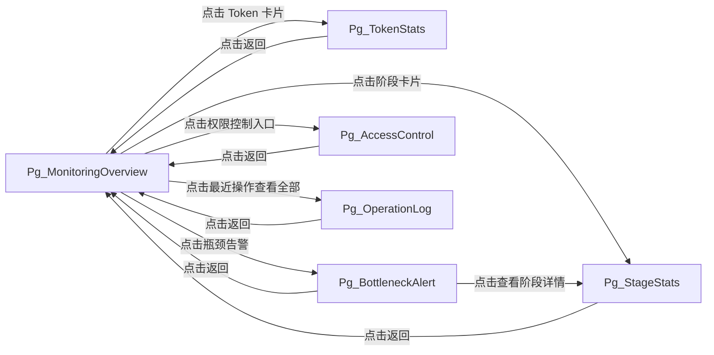
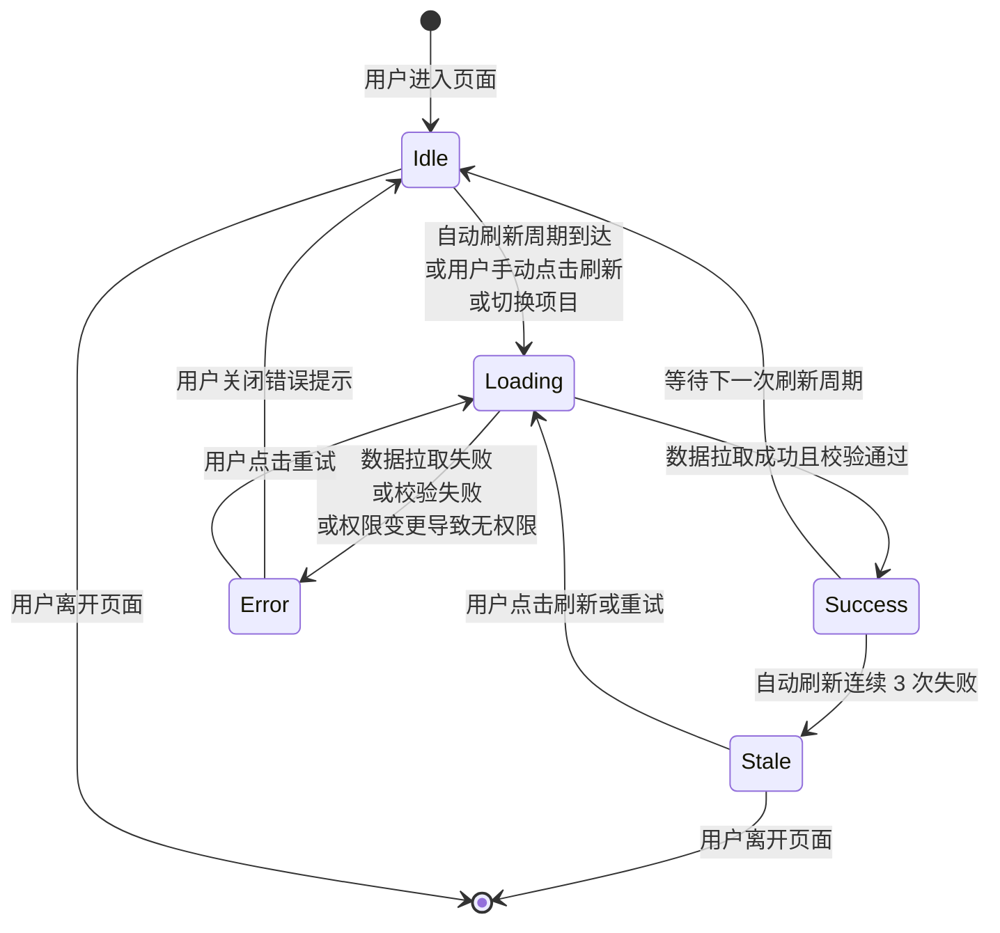
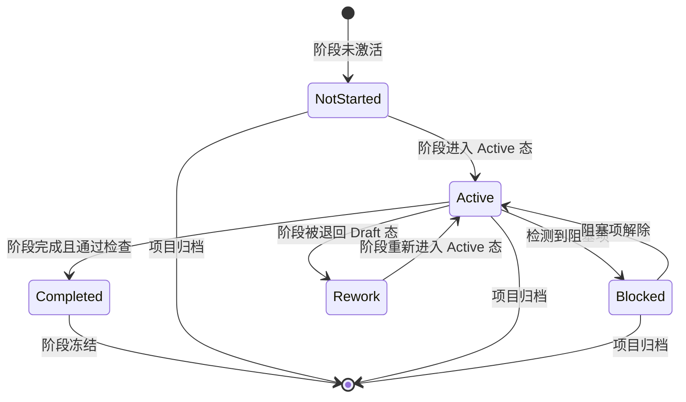
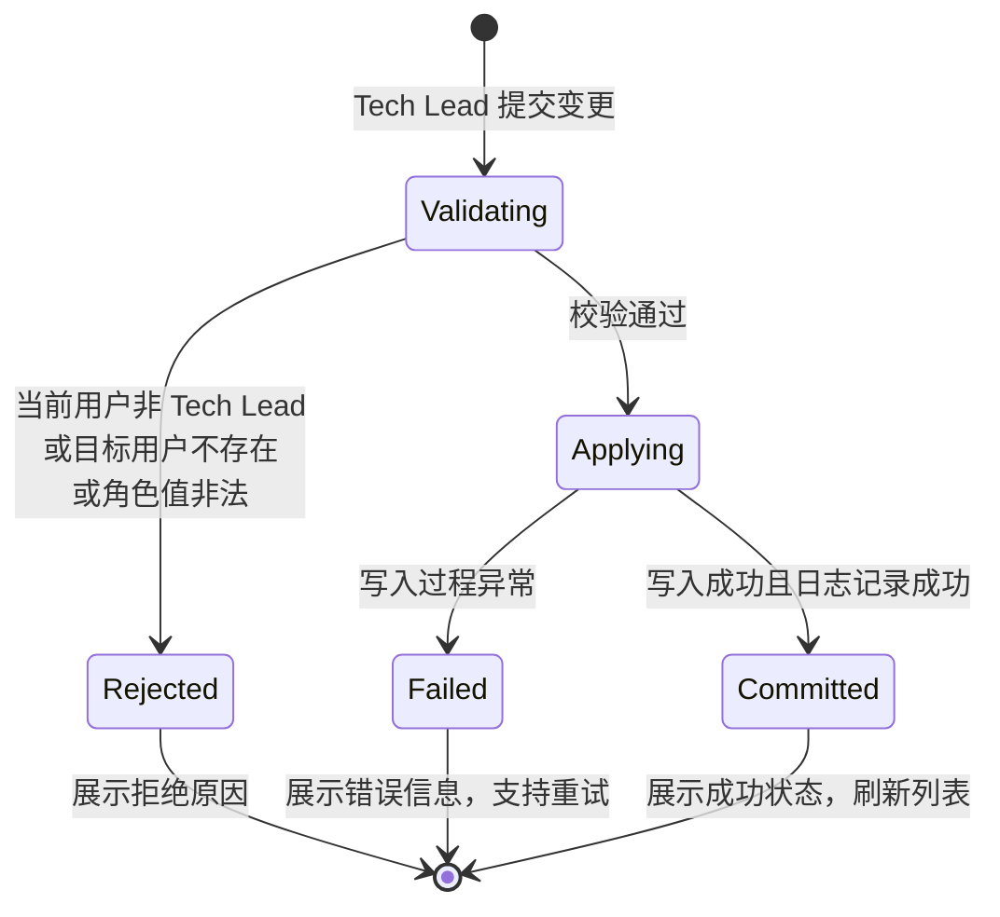
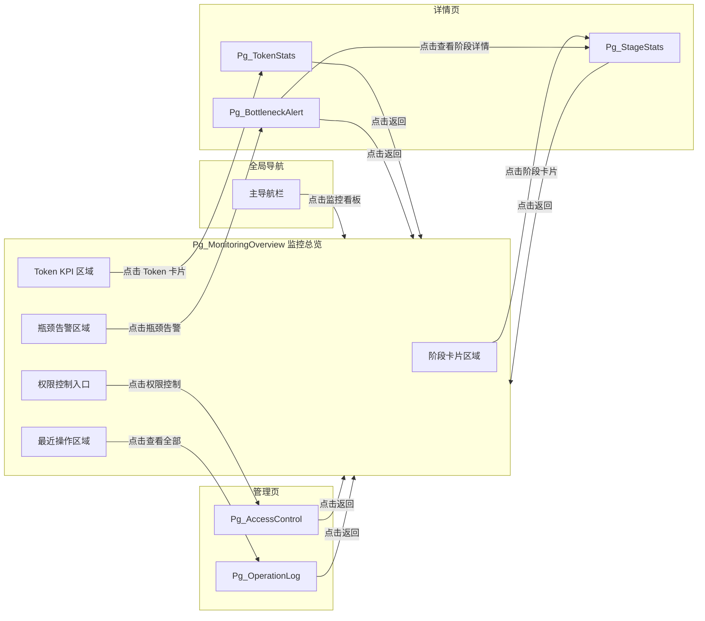

# DR-014 监控看板（Monitoring Dashboard）模块需求规格

> **模块编号**：DR-014  
> **模块名称**：监控看板（Monitoring Dashboard）  
> **优先级**：P1  
> **关联需求**：REQ-P1-007（监控看板）、REQ-P1-008（多用户支持）  
> **版本**：v1.0  
> **状态**：Draft

---

## 1. 需求追溯与验收标准

### 1.1 需求追溯表

| 需求编号 | 需求名称 | 需求描述 | 本章节点 |
|---------|---------|---------|---------|
| REQ-P1-007 | 监控看板 | 项目级/阶段级进度可视化 | §2.1 Pg_MonitoringOverview、§3.1、§4.1 |
| REQ-P1-007 | 监控看板 | 阶段耗时统计（平均/最长/最短） | §2.1 Pg_StageStats、§3.1 |
| REQ-P1-007 | 监控看板 | Token 消耗统计（按项目/阶段/Skill 聚合） | §2.1 Pg_TokenStats、§3.1 |
| REQ-P1-007 | 监控看板 | 瓶颈识别（耗时最长阶段、返工最多阶段） | §2.1 Pg_BottleneckAlert、§4.1 |
| REQ-P1-008 | 多用户支持 | 项目级权限控制 | §2.1 Pg_AccessControl、§4.2 |
| REQ-P1-008 | 多用户支持 | Tech Lead 审批权限 | §2.1 Pg_AccessControl、§5.2 |
| REQ-P1-008 | 多用户支持 | 开发者执行权限 | §2.1 Pg_AccessControl、§5.2 |
| REQ-P1-008 | 多用户支持 | 操作日志记录用户关键操作 | §2.1 Pg_OperationLog、§3.1、§4.2 |

### 1.2 IN / OUT 清单

**IN-Scope（范围内）**

- 项目级进度仪表盘（总体完成率、当前所处阶段、阶段间流转状态）
- 阶段级进度细览（各 SDLC 阶段的子任务完成数/总数、阻塞状态标记）
- 阶段耗时统计卡片（平均耗时、历史最长耗时、历史最短耗时、当前阶段已用耗时）
- Token 消耗统计（项目累计、按阶段拆分、按 Skill 拆分、日/周/月趋势折线）
- 瓶颈识别与告警（自动标记耗时超过阈值阶段、返工次数超过阈值阶段、未通过门控阶段）
- 权限控制视图（项目成员列表、角色分配、权限矩阵展示）
- 操作日志列表（用户关键操作的时间、操作人、操作类型、操作对象、结果状态）
- 看板数据自动刷新机制（用户可配置刷新周期）
- 看板导出（PDF/图片格式的一键快照）

**OUT-Scope（范围外）**

- 告警通知推送（邮件/短信/Webhook 触达）
- 成本核算与计费系统对接
- 多项目对比分析（Cross-project analytics）
- 实时监控大屏（TV 模式 /  kiosk 模式）
- 用户行为热力图分析
- 外部 CI/CD 流水线数据接入
- 操作日志的物理删除与篡改

### 1.3 AC Taxonomy（验收标准分类）

#### AC-F（功能性验收标准）

| 编号 | 验收标准 | 关联需求 |
|-----|---------|---------|
| AC-F-001 | Given the user navigates to the Monitoring Dashboard, When the page initially loads, Then the system shall display the current project's overall progress percentage consistent with the SSOT progress recorded in `progress.md` | REQ-P1-007 |
| AC-F-002 | Given the Monitoring Dashboard is loaded, When the stage-level progress cards are rendered, Then all 12 SDLC stages shall display the subtask completion count and total count in the format "completed / total" | REQ-P1-007 |
| AC-F-003 | Given the user is viewing the stage duration statistics, When the statistics cards are rendered, Then each card shall display the historical average, maximum, and minimum duration for the stage, and the current stage's elapsed time shall be clearly indicated | REQ-P1-007 |
| AC-F-004 | Given the user is on the Token consumption statistics view, When the dimension toggle is activated, Then the system shall support switching among project-total, stage-breakdown, and Skill-breakdown aggregation dimensions | REQ-P1-007 |
| AC-F-005 | Given a stage's duration exceeds 150% of the project's historical average duration for that stage, When the bottleneck identification module executes, Then the system shall automatically mark that stage as a "time bottleneck" | REQ-P1-007 |
| AC-F-006 | Given a stage has been reworked 2 or more times, When the bottleneck identification module executes, Then the system shall automatically mark that stage as a "rework bottleneck" | REQ-P1-007 |
| AC-F-007 | Given the current user has the Tech Lead role and is on the Access Control page, When assigning a role to a project member, Then the system shall allow selecting either "Tech Lead" or "Developer" role | REQ-P1-008 |
| AC-F-008 | Given the user navigates to the Operation Log page, When the page loads, Then the system shall display the latest 50 critical operations by default and shall support filtering by operator, action type, and time range | REQ-P1-008 |

#### AC-U（易用性验收标准）

| 编号 | 验收标准 | 关联需求 |
|-----|---------|---------|
| AC-U-001 | Given the user navigates to the Monitoring Dashboard, When the dashboard loads for the first time, Then the duration from empty state to first-screen render completion shall not exceed 2 seconds | REQ-P1-007 |
| AC-U-002 | Given statistical charts are displayed on the dashboard, When the underlying data is updated, Then all charts shall complete re-rendering within 5 seconds | REQ-P1-007 |
| AC-U-003 | Given the user is viewing the dashboard on a display, When the resolution is 1366×768 or higher, Then no horizontal scrollbar shall appear; and When the resolution is 1920×1080, Then the entire dashboard shall be displayed within a single screen | REQ-P1-007 |
| AC-U-004 | Given a bottleneck indicator is present on the dashboard, When the indicator is rendered, Then it shall simultaneously provide color, icon, and text tooltip cues, enabling independent identification by color-blind users | REQ-P1-007 |

#### AC-P（性能验收标准）

| 编号 | 验收标准 | 关联需求 |
|-----|---------|---------|
| AC-P-001 | Given the system is running in a local SQLite environment with no more than 100,000 records, When the user navigates to the dashboard page, Then the time from route entry to first-screen interactive state shall not exceed 2000ms | REQ-P1-007 |
| AC-P-002 | Given the auto-refresh feature is enabled, When the user configures the refresh interval to the minimum value of 10 seconds, Then the refresh process shall not block the user's current operations | REQ-P1-007 |
| AC-P-003 | Given the operation log query is executed, When there are more than 1000 matching records, Then the frontend shall paginate the results with no more than 1000 records per query, and When the user navigates to another page, Then the response shall complete within 500ms | REQ-P1-008 |

#### AC-S（安全性验收标准）

| 编号 | 验收标准 | 关联需求 |
|-----|---------|---------|
| AC-S-001 | Given a user does not have access permission to the project, When the user attempts to access the project's Monitoring Dashboard via a direct URL, Then the system shall deny access | REQ-P1-008 |
| AC-S-002 | Given the current user has the Developer role, When the user attempts to access the Access Control view, Then the system shall deny access and display an insufficient permission message | REQ-P1-008 |
| AC-S-003 | Given the current user does not have the Tech Lead role, When the operation log containing sensitive fields such as Token consumption details is displayed, Then the system shall desensitize those sensitive fields | REQ-P1-008 |
| AC-S-004 | Given a permission change operation is performed, When the operation completes successfully, Then the system shall record an operation log entry containing both the previous role and the new role | REQ-P1-008 |

#### AC-C（兼容性验收标准）

| 编号 | 验收标准 | 关联需求 |
|-----|---------|---------|
| AC-C-001 | Given the user accesses the dashboard using Chrome 120+, Firefox 121+, or Edge 120+, When the dashboard loads, Then the layout and functionality shall be consistent across all supported browsers | REQ-P1-007 |
| AC-C-002 | Given the user exports a dashboard snapshot as PDF, When the exported file is opened in Adobe Acrobat Reader or mainstream browser built-in PDF readers, Then the content shall render correctly | REQ-P1-007 |

#### AC-N（否定性验收标准）

| 编号 | 验收标准 | 关联需求 |
|-----|---------|---------|
| AC-N-001 | Given any user submits a request to physically delete or modify an operation log entry, When the system receives the request, Then the system shall reject the request and shall not perform any physical deletion or modification of operation log records | REQ-P1-008 |

#### AC-D（依赖性验收标准）

| 编号 | 验收标准 | 关联需求 |
|-----|---------|---------|
| AC-D-001 | Given the progress-tracker module maintains an Active change for the current project, When the Monitoring Dashboard queries the project progress data, Then the dashboard shall display data sourced from that Active change's `progress.md`; and given no Active change exists for the project, When the dashboard loads, Then the system shall display an empty state indicating no active change is available | REQ-P1-007 |

### 1.4 假设注册表

| 编号 | 假设内容 | 影响范围 | 验证方式 | 风险等级 |
|-----|---------|---------|---------|---------|
| ASM-001 | 每个项目在同一时间仅有一个处于 "Active" 状态的变更（SSOT 原则） | 进度计算逻辑 | 检查 `progress.md` 规范 | 高 |
| ASM-002 | Token 消耗数据由各 Skill 在执行阶段主动上报并聚合 | Token 统计准确性 | 检查 `executing-plans` Skill 规范 | 高 |
| ASM-003 | 阶段耗时以 "阶段首次进入 Active 态" 到 "阶段被标记完成" 之间的时间差计算 | 耗时统计口径 | 与 `progress-tracker` 对齐 | 中 |
| ASM-004 | 返工定义为：阶段在标记完成后重新退回 Draft 态并再次进入 Active 态 | 返工计数口径 | 与 `progress-tracker` 对齐 | 中 |
| ASM-005 | 本地单机场景下并发用户数不超过 5 人 | 权限控制与性能设计 | 产品定位文档确认 | 低 |
| ASM-006 | 操作日志中的 "关键操作" 范围已在 `openspec/config.yaml` 中预定义 | 日志记录完整性 | 检查配置模板 | 中 |

version: v1.0
---

## 2. 原型与页面结构

### 2.1 页面清单

| 页面编号 | 页面名称 | 页面职责 | 入口条件 |
|---------|---------|---------|---------|
| Pg_MonitoringOverview | 监控总览页 | 展示项目级进度、阶段卡片、瓶颈告警总览 | 用户拥有该项目查看权限 |
| Pg_StageStats | 阶段耗时详情页 | 展示单个阶段的耗时统计明细、历史趋势 | 从 Pg_MonitoringOverview 点击阶段卡片进入 |
| Pg_TokenStats | Token 消耗详情页 | 展示 Token 消耗的多维度聚合与趋势 | 从 Pg_MonitoringOverview 点击 Token 卡片进入 |
| Pg_BottleneckAlert | 瓶颈告警详情页 | 展示所有瓶颈项的详细数据与根因建议 | 从 Pg_MonitoringOverview 点击瓶颈告警进入 |
| Pg_AccessControl | 权限控制页 | 展示项目成员、角色分配、权限矩阵 | 用户为 Tech Lead 角色 |
| Pg_OperationLog | 操作日志页 | 展示关键操作日志列表与筛选 | 用户拥有该项目查看权限 |

### 2.2 文字化布局结构

#### Pg_MonitoringOverview（监控总览页）

布局采用上下分区：

- **顶部导航栏**：项目选择器（下拉框，当前项目高亮）、当前用户角色标签（Tech Lead / 开发者）、刷新按钮、导出按钮、设置按钮（刷新周期配置）。
- **第一行（KPI 横幅）**：横向排列 4 张 KPI 卡片——
  - 卡片 A「总体进度」：环形进度图 + 百分比大字 + "当前处于 {阶段名}" 文字；
  - 卡片 B「阶段耗时」：折线微型图 + "平均 {X}h / 最长 {Y}h" 文字；
  - 卡片 C「Token 消耗」：柱状微型图 + "累计 {N} tokens" 文字；
  - 卡片 D「瓶颈告警」：数字徽章（红底白字）+ "X 项待关注" 文字，无瓶颈时徽章隐藏。
- **第二行（主内容区，左右分栏）**：
  - 左侧「阶段进度矩阵」（占宽 60%）：12 个 SDLC 阶段以 4 列 × 3 行网格排列，每格为阶段卡片，含阶段名、子任务完成数/总数、状态色条（绿=完成、蓝=进行中、灰=未开始、红=阻塞）。点击卡片可下钻至 Pg_StageStats。
  - 右侧「瓶颈与日志快照」（占宽 40%）：
    - 上半为「瓶颈列表」：最多展示前 3 条瓶颈，含阶段名、瓶颈类型图标、简述，底部有"查看全部"入口；
    - 下半为「最近操作」：最多展示前 5 条操作日志摘要，含操作人、操作类型、时间相对描述（如"3 分钟前"），底部有"查看全部"入口。
- **底部状态栏**：数据最后更新时间戳、自动刷新状态指示器（旋转图标 / 静态图标）。

#### Pg_StageStats（阶段耗时详情页）

- **页面标题区**：面包屑（监控看板 > 阶段耗时 > {阶段名}）、返回按钮。
- **关键指标区**：横向 3 张卡片——"历史平均耗时"、"历史最长耗时"、"历史最短耗时"。
- **趋势图区**：折线图，横轴为时间（最近 10 次该阶段执行记录），纵轴为耗时（小时），悬停数据点展示具体耗时与执行日期。
- **当前执行区**：若该阶段当前处于 Active 态，展示"当前已用耗时"实时计时器（HH:MM:SS 格式）及预估剩余时间（基于历史平均）。
- **关联任务列表**：该阶段下的子任务清单（任务名、状态、负责人、计划/实际耗时）。

#### Pg_TokenStats（Token 消耗详情页）

- **页面标题区**：面包屑（监控看板 > Token 消耗）、返回按钮。
- **维度切换标签**："按项目总计" / "按阶段拆分" / "按 Skill 拆分"。
- **趋势图区**：
  - "按项目总计"维度：单条折线，横轴为日/周/月，纵轴为 Token 数；
  - "按阶段拆分"维度：堆叠面积图，横轴为时间，纵轴为 Token 数，各阶段以不同颜色区分；
  - "按 Skill 拆分"维度：水平条形图，各 Skill 按 Token 消耗量降序排列。
- **数据表格区**：当前选中维度下的明细数据表（维度键、Token 输入数、Token 输出数、Token 总计、占比），支持按 Token 总计排序。

#### Pg_BottleneckAlert（瓶颈告警详情页）

- **页面标题区**：面包屑（监控看板 > 瓶颈告警）、返回按钮。
- **筛选器**：瓶颈类型多选（耗时瓶颈 / 返工瓶颈 / 门控未通过）、严重程度单选（全部 / 高 / 中 / 低）。
- **瓶颈列表**：每条瓶颈项包含——
  - 左侧色条（高=红、中=橙、低=黄）；
  - 阶段名与瓶颈类型图标；
  - 具体数值（如"耗时 48h，超出平均 200%"或"返工 3 次"）；
  - 根因建议文本（如"该阶段任务拆分粒度过大，建议复核 tasks.md"）；
  - 操作按钮「查看阶段详情」（跳转 Pg_StageStats）。

#### Pg_AccessControl（权限控制页）

- **页面标题区**：面包屑（监控看板 > 权限控制）。
- **当前成员列表**：表格列——用户名、当前角色、加入时间、操作（更改角色 / 移除）。
- **添加成员区**：输入框（用户名/邮箱）+ 角色选择器 + "添加"按钮。
- **权限矩阵速查**：只读表格，行对应角色（Tech Lead / 开发者），列对应操作（查看看板 / 导出数据 / 修改权限 / 删除日志 / 审批门控），单元格为 ✓ / ✗。

#### Pg_OperationLog（操作日志页）

- **页面标题区**：面包屑（监控看板 > 操作日志）、返回按钮。
- **筛选栏**：操作人下拉、操作类型多选（权限变更 / 阶段推进 / 数据导出 / 配置修改）、时间范围选择器（最近 24h / 7d / 30d / 自定义）。
- **日志列表**：表格列——时间、操作人、操作类型、操作对象、结果状态、详情展开按钮。
- **分页器**：每页 50 条，展示总条数与当前页码。

### 2.3 关键交互流程

**流程 A：用户查看项目监控总览**

1. 用户从主导航点击「监控看板」入口；
2. 系统校验用户对该项目的查看权限，无权限时展示拒绝页面；
3. 系统加载 Pg_MonitoringOverview，默认展示当前活跃变更的数据；
4. 首屏渲染完成后，系统启动自动刷新定时器（默认 30 秒）；
5. 用户可通过项目选择器切换查看其他有权限的项目。

**流程 B：用户下钻查看阶段耗时详情**

1. 用户在 Pg_MonitoringOverview 的阶段进度矩阵中点击某一阶段卡片；
2. 系统路由跳转至 Pg_StageStats，URL 携带阶段标识参数；
3. 系统加载该阶段的历史耗时统计与当前执行状态；
4. 用户可悬停趋势图查看单次执行明细；
5. 用户点击返回按钮回到 Pg_MonitoringOverview，页面状态保持（滚动位置、项目选择）。

**流程 C：Tech Lead 分配角色权限**

1. Tech Lead 在 Pg_MonitoringOverview 点击「权限控制」入口（开发者角色无此入口）；
2. 系统加载 Pg_AccessControl，展示当前成员列表；
3. Tech Lead 在添加成员区输入用户名并选择角色，点击「添加」；
4. 系统校验目标用户是否已存在于项目中，若已存在则提示并拒绝；
5. 系统校验通过后更新成员角色，同时记录操作日志；
6. 成员列表自动刷新，展示新成员。

**流程 D：用户导出看板快照**

1. 用户在 Pg_MonitoringOverview 点击「导出」按钮；
2. 系统弹出导出选项浮层（格式：PDF / PNG / 导出范围：当前页 / 全部页）；
3. 用户选择后点击「确认导出」；
4. 系统生成对应格式的快照文件，触发浏览器下载；
5. 系统记录「数据导出」类型操作日志。

### 2.4 页面跳转图

---

## 3. 输入输出字段

### 3.1 字段总表

#### 用户输入字段

| 字段名 | 数据类型 | 必填 | 输入方式 | 校验规则 | 所属页面 |
|-------|---------|-----|---------|---------|---------|
| project_selector | 枚举 | 是 | 下拉选择 | 选项范围为用户有权限的项目列表 | Pg_MonitoringOverview |
| refresh_interval | 整数 | 否 | 下拉选择 | 可选值：10 / 30 / 60 / 300（秒），默认 30 | Pg_MonitoringOverview |
| stage_filter | 枚举 | 否 | 卡片点击 | 值为 12 个 SDLC 阶段标识之一 | Pg_MonitoringOverview |
| token_dimension | 枚举 | 否 | 标签切换 | 可选值：project / stage / skill，默认 project | Pg_TokenStats |
| bottleneck_type_filter | 数组 | 否 | 多选框 | 可选值：time_bottleneck / rework_bottleneck / gate_failed | Pg_BottleneckAlert |
| severity_filter | 枚举 | 否 | 单选 | 可选值：all / high / medium / low，默认 all | Pg_BottleneckAlert |
| log_operator_filter | 枚举 | 否 | 下拉选择 | 选项范围为该项目成员用户名 | Pg_OperationLog |
| log_action_type_filter | 数组 | 否 | 多选框 | 可选值：permission_change / stage_advance / data_export / config_change | Pg_OperationLog |
| log_time_range | 对象 | 否 | 时间选择器 | 起始时间 ≤ 结束时间，最大跨度 90 天 | Pg_OperationLog |
| new_member_username | 字符串 | 是 | 文本输入 | 长度 1-64，匹配系统已有用户名录 | Pg_AccessControl |
| new_member_role | 枚举 | 是 | 单选 | 可选值：tech_lead / developer | Pg_AccessControl |
| export_format | 枚举 | 是 | 单选 | 可选值：pdf / png | Pg_MonitoringOverview |
| export_scope | 枚举 | 是 | 单选 | 可选值：current_page / all_pages | Pg_MonitoringOverview |

#### 系统输入字段

| 字段名 | 数据类型 | 来源 | 说明 |
|-------|---------|-----|-----|
| current_user_id | 字符串 | 会话上下文 | 当前登录用户唯一标识 |
| current_user_role | 枚举 | 权限系统 | 当前用户在该项目中的角色：tech_lead / developer |
| current_project_id | 字符串 | 路由参数或会话 | 当前查看的项目唯一标识 |
| current_change_id | 字符串 | 项目 SSOT | 当前项目中处于 Active 状态的变更标识 |
| system_timestamp | 时间戳 | 系统时钟 | 用于计算"当前已用耗时"及相对时间描述 |
| last_data_update_time | 时间戳 | 数据层 | 看板数据最后一次成功拉取的时间 |

#### 页面回显字段

| 字段名 | 数据类型 | 展示位置 | 说明 |
|-------|---------|---------|-----|
| overall_progress_percent | 整数（0-100） | Pg_MonitoringOverview KPI 卡片 A | 项目总体完成百分比 |
| current_stage_name | 字符串 | Pg_MonitoringOverview KPI 卡片 A | 当前所处 SDLC 阶段名称 |
| stage_completion_ratio | 字符串 | Pg_MonitoringOverview 阶段卡片 | 格式 "已完成数 / 总数" |
| stage_status_indicator | 枚举 | Pg_MonitoringOverview 阶段卡片色条 | completed / active / not_started / blocked |
| avg_stage_duration_hours | 浮点数 | Pg_MonitoringOverview KPI 卡片 B / Pg_StageStats | 历史平均耗时（小时） |
| max_stage_duration_hours | 浮点数 | Pg_StageStats 指标卡片 | 历史最长耗时（小时） |
| min_stage_duration_hours | 浮点数 | Pg_StageStats 指标卡片 | 历史最短耗时（小时） |
| current_stage_elapsed_time | 字符串 | Pg_StageStats 当前执行区 | 格式 HH:MM:SS，实时递增 |
| total_token_count | 整数 | Pg_MonitoringOverview KPI 卡片 C | 项目累计 Token 消耗总数 |
| token_trend_data | 数组 | Pg_TokenStats 趋势图 | 时间序列数据点集合 |
| bottleneck_count | 整数 | Pg_MonitoringOverview KPI 卡片 D | 当前瓶颈项总数 |
| bottleneck_severity | 枚举 | Pg_BottleneckAlert 色条 | high / medium / low |
| bottleneck_description | 字符串 | Pg_BottleneckAlert 列表项 | 瓶颈具体描述文本 |
| bottleneck_suggestion | 字符串 | Pg_BottleneckAlert 列表项 | 根因建议文本 |
| member_list | 数组 | Pg_AccessControl 成员表格 | 项目成员对象列表 |
| permission_matrix | 二维表 | Pg_AccessControl 权限速查 | 角色 × 操作的权限映射 |
| operation_log_list | 数组 | Pg_OperationLog 日志表格 | 操作日志对象列表 |
| log_total_count | 整数 | Pg_OperationLog 分页器 | 符合筛选条件的日志总条数 |
| last_update_timestamp | 字符串 | Pg_MonitoringOverview 底部状态栏 | 格式化为相对时间或绝对时间 |
| auto_refresh_status | 布尔 | Pg_MonitoringOverview 底部状态栏 | true=自动刷新启用中 |

#### 接口响应字段（数据层 → 展示层）

| 字段名 | 数据类型 | 说明 |
|-------|---------|-----|
| progress_summary | 对象 | 包含 overall_progress_percent、current_stage_name、stage_breakdown（数组） |
| stage_duration_stats | 对象 | 包含 stage_id、avg_duration、max_duration、min_duration、execution_history（数组） |
| token_consumption_stats | 对象 | 包含 dimension（当前维度）、total_input_tokens、total_output_tokens、total_tokens、breakdown（数组） |
| bottleneck_analysis_result | 数组 | 瓶颈对象数组，每项包含 stage_id、bottleneck_type、severity、actual_value、threshold_value、description、suggestion |
| project_members | 数组 | 成员对象数组，每项包含 user_id、username、role、joined_at |
| operation_logs | 对象 | 包含 logs（数组）、total_count、page、page_size |
| export_result | 对象 | 包含 file_url（临时下载链接）、file_name、expires_at |

### 3.2 数据流转图

```mermaid
flowchart TD
    subgraph UserInput["用户输入层"]
        UI1[project_selector]
        UI2[refresh_interval]
        UI3[token_dimension]
        UI4[bottleneck_filters]
        UI5[log_filters]
        UI6[new_member_username + role]
        UI7[export_format + scope]
    end

    subgraph SystemInput["系统输入层"]
        SI1[current_user_id]
        SI2[current_user_role]
        SI3[current_project_id]
        SI4[current_change_id]
        SI5[system_timestamp]
    end

    subgraph DataLayer["数据层"]
        D1[progress.md SSOT]
        D2[阶段执行历史记录]
        D3[Token 消耗上报记录]
        D4[瓶颈规则引擎结果]
        D5[项目成员角色表]
        D6[操作日志表]
    end

    subgraph DisplayLayer["展示层"]
        P1[Pg_MonitoringOverview]
        P2[Pg_StageStats]
        P3[Pg_TokenStats]
        P4[Pg_BottleneckAlert]
        P5[Pg_AccessControl]
        P6[Pg_OperationLog]
    end

    UI1 -->|筛选项目| D1
    UI1 -->|筛选项目| D2
    UI1 -->|筛选项目| D3
    UI1 -->|筛选项目| D4
    UI2 -->|控制刷新频率| P1
    UI3 -->|切换聚合维度| D3
    UI4 -->|筛选瓶颈| D4
    UI5 -->|筛选日志| D6
    UI6 -->|写入| D5
    UI6 -->|记录| D6
    UI7 -->|触发导出| P1

    SI1 -->|身份校验| D5
    SI2 -->|权限校验| D5
    SI3 -->|数据范围限定| D1
    SI3 -->|数据范围限定| D2
    SI3 -->|数据范围限定| D3
    SI3 -->|数据范围限定| D4
    SI3 -->|数据范围限定| D5
    SI3 -->|数据范围限定| D6
    SI4 -->|变更范围限定| D1
    SI4 -->|变更范围限定| D2
    SI5 -->|计算耗时| D2

    D1 -->|progress_summary| P1
    D2 -->|stage_duration_stats| P1
    D2 -->|stage_duration_stats| P2
    D3 -->|token_consumption_stats| P1
    D3 -->|token_consumption_stats| P3
    D4 -->|bottleneck_analysis_result| P1
    D4 -->|bottleneck_analysis_result| P4
    D5 -->|project_members| P1
    D5 -->|project_members + permission_matrix| P5
    D6 -->|operation_logs| P1
    D6 -->|operation_logs| P6
```

---

## 4. 业务逻辑与状态机

### 4.1 核心业务流程

#### 流程 4.1.1 进度数据聚合与展示

1. **触发条件**：用户进入 Pg_MonitoringOverview 或自动刷新周期到达；
2. **权限校验**：系统校验当前用户是否对 current_project_id 拥有查看权限，无权限则终止并展示拒绝页面；
3. **变更定位**：系统读取 current_project_id 下状态为 Active 的变更标识（current_change_id）；
4. **进度聚合**：系统从该变更的 `progress.md` 中读取各阶段完成标记与子任务 checkbox 状态，计算总体完成百分比（已完成子任务数 / 子任务总数 × 100，向上取整）；
5. **阶段状态判定**：对每个 SDLC 阶段，依据 `progress.md` 中的状态标记判定为 completed / active / not_started / blocked（存在未解决的阻塞项时标记 blocked）；
6. **数据组装**：将聚合结果组装为 progress_summary 对象，包含 overall_progress_percent、current_stage_name、stage_breakdown 数组；
7. **前端渲染**：展示层接收数据并渲染 KPI 卡片与阶段进度矩阵。

#### 流程 4.1.2 阶段耗时统计计算

1. **触发条件**：用户进入 Pg_StageStats 或 Pg_MonitoringOverview 需要展示耗时 KPI；
2. **历史记录提取**：系统提取当前项目下该阶段所有已完成执行记录（阶段从 Active 态进入 completed 态的时间点数据）；
3. **指标计算**：
   - 平均耗时 = 所有历史记录耗时总和 / 记录数；
   - 最长耗时 = 历史记录耗时最大值；
   - 最短耗时 = 历史记录耗时最小值；
4. **当前执行计时**：若该阶段当前处于 Active 态，系统以 system_timestamp 减去该阶段进入 Active 态的时间戳，实时计算已用耗时；
5. **数据返回**：将 avg_duration、max_duration、min_duration、current_elapsed（如有）及 execution_history（最近 10 条）返回展示层。

#### 流程 4.1.3 瓶颈识别与判定

1. **触发条件**：用户进入 Pg_MonitoringOverview 或手动刷新瓶颈分析；
2. **耗时瓶颈判定**：系统遍历所有处于 Active 或 completed 阶段的耗时数据，计算各阶段当前已用耗时（或最近完成耗时）与该项目该阶段历史平均耗时的比值，比值 ≥ 150% 时标记为 time_bottleneck，severity 按比值区间划分（≥ 200% 为 high，150%-200% 为 medium）；
3. **返工瓶颈判定**：系统统计各阶段的返工次数（completed 后退回 Draft 再进入 Active 视为一次返工），返工次数 ≥ 2 时标记为 rework_bottleneck，severity 按返工次数划分（≥ 3 为 high，2 为 medium）；
4. **门控未通过判定**：系统检查 `progress.md` 中各人工闸门（Gate 1 / 2.5 / 2 / 3）的签字状态，存在未签字但阶段尝试推进的情况标记为 gate_failed，severity 恒为 high；
5. **去重与排序**：同一阶段存在多种瓶颈类型时分别展示；列表按 severity 降序、再按判定时间降序排列；
6. **根因建议生成**：系统基于瓶颈类型匹配预设建议模板（如 time_bottleneck → "该阶段任务拆分粒度过大，建议复核 tasks.md"；rework_bottleneck → "该阶段需求或设计存在模糊点，建议回顾对应 spec"；gate_failed → "人工闸门未签字，禁止推进，请联系 Tech Lead 完成评审"）；
7. **数据返回**：返回 bottleneck_analysis_result 数组。

#### 流程 4.1.4 权限变更与日志记录

1. **触发条件**：Tech Lead 在 Pg_AccessControl 提交成员角色变更；
2. **权限预校验**：系统校验当前用户角色是否为 tech_lead，非 Tech Lead 直接拒绝；
3. **存在性校验**：系统校验目标用户是否已存在于该项目成员列表中，若不存在（添加场景）则继续，若已存在（变更场景）则继续；
4. **角色变更执行**：系统更新该项目成员的角色字段；
5. **操作日志记录**：系统在操作日志表中写入一条记录，包含：时间戳、操作人 user_id、操作类型 permission_change、操作对象（目标用户 user_id）、变更前角色、变更后角色、结果状态 success；
6. **列表刷新**：Pg_AccessControl 成员列表自动刷新以反映最新状态。

#### 流程 4.1.5 操作日志查询与筛选

1. **触发条件**：用户进入 Pg_OperationLog 或修改筛选条件；
2. **默认加载**：系统默认加载当前项目最近 50 条关键操作日志，按时间降序排列；
3. **筛选执行**：用户指定筛选条件后，系统按操作人、操作类型、时间范围进行交集过滤；
4. **分页返回**：系统按 page / page_size 参数返回对应页数据，同时返回 total_count；
5. **脱敏处理**：若当前用户角色为 developer，系统对涉及敏感 Token 消耗明细的日志记录进行脱敏（以 "***" 替换具体数值）。

### 4.2 业务规则映射

| 规则编号 | 规则名称 | 规则内容 | 关联流程 |
|---------|---------|---------|---------|
| BR-001 | 进度计算唯一信源 | 所有进度百分比必须以 `progress.md` 为唯一数据源，禁止从其他渠道估算或缓存替代 | 4.1.1 |
| BR-002 | 阶段完成定义 | 阶段标记为 completed 当且仅当该阶段下所有子任务 checkbox 已勾选且通过 self-check | 4.1.1 |
| BR-003 | 阻塞状态传染 | 任一上游阶段处于 blocked 状态时，下游阶段自动标记为 blocked，不可进入 Active 态 | 4.1.1 |
| BR-004 | 耗时瓶颈阈值 | 耗时瓶颈判定阈值为该项目该阶段历史平均耗时的 150%，且至少需要 3 条历史记录方可参与计算 | 4.1.3 |
| BR-005 | 返工计数冻结 | 阶段返工次数在阶段最终完成并进入下一阶段后冻结，不再随后续退回而累加 | 4.1.3 |
| BR-006 | 权限最小化 | 开发者角色默认仅拥有查看权限，所有修改类操作（权限变更、配置修改、门控签字）默认拒绝 | 4.1.4 |
| BR-007 | 操作日志不可变 | 操作日志一旦写入即不可修改、不可删除，仅支持查询与导出 | 4.1.5 |
| BR-008 | 日志记录范围 | 仅记录 `openspec/config.yaml` 中定义的 "关键操作" 类型，常规查看/浏览操作不记录 | 4.1.5 |
| BR-009 | 数据时效性 | 看板展示的数据与底层数据源的同步延迟不得超过 5 秒（自动刷新场景） | 全局 |
| BR-010 | 导出权限隔离 | 开发者可导出当前可见范围的数据快照；Tech Lead 可导出包含敏感字段的完整快照 | 流程 D |

### 4.3 状态机

#### 4.3.1 看板数据刷新状态机

#### 4.3.2 阶段卡片状态机（展示状态）

#### 4.3.3 权限变更事务状态机

### 4.4 异常处理

| 异常编号 | 异常场景 | 触发条件 | 系统响应 | 用户反馈 | 恢复方式 |
|---------|---------|---------|---------|---------|---------|
| EX-001 | 项目无 Active 变更 | current_project_id 下无 Active 状态变更 | 终止数据聚合，返回空状态 | 页面展示 "当前项目无进行中的变更，请在 progress-tracker 中创建或激活变更" | 用户在 progress-tracker 中激活变更后手动刷新 |
| EX-002 | 阶段历史记录不足 | 某阶段 completed 记录数 < 3 | 跳过该阶段的耗时瓶颈判定，平均耗时仍可计算（如有 ≥1 条记录） | 该阶段耗时 KPI 卡片展示 "数据不足" 提示，瓶颈列表展示 "至少需要 3 次执行记录方可判定瓶颈" | 等待该阶段积累更多执行记录 |
| EX-003 | 权限变更目标用户不存在 | new_member_username 不在系统用户名录中 | 事务终止，不回写任何数据 | 输入框下方展示红色提示 "用户不存在，请先邀请用户加入系统" | 用户修正用户名后重新提交 |
| EX-004 | 自动刷新连续失败 | 连续 3 次自动刷新请求失败（网络/数据源异常） | 自动刷新定时器暂停，数据标记为 Stale | 底部状态栏展示 "数据已过期，点击刷新重试" 警告色提示 | 用户手动点击刷新按钮，成功后恢复自动刷新 |
| EX-005 | 导出生成超时 | 导出快照生成时间超过 30 秒 | 终止生成任务，释放资源 | 展示 "导出超时，请缩小导出范围后重试" | 用户选择更小范围（如 current_page）后重试 |
| EX-006 | 操作日志查询超量 | 筛选条件命中记录数 > 10,000 | 查询自动截断至最近 10,000 条，total_count 展示 "10,000+" | 页面展示 "数据量过大，请缩小时间范围" 提示 | 用户缩小时间范围或增加筛选条件 |

---

## 5. 交互规格

### 5.1 按钮级交互状态机

#### 交互 IS-001：阶段卡片点击

| 维度 | 规格 |
|-----|-----|
| 触发方式 | 鼠标左键单击（Click） |
| 前置条件 | 当前用户拥有该项目查看权限；阶段卡片已渲染完成 |
| 立即反馈 | 卡片背景色在 100ms 内过渡为高亮色（hover 态加深），鼠标指针变为手型（pointer） |
| 成功结果 | 路由跳转至 Pg_StageStats，URL 携带 stage_id 参数；页面加载阶段耗时详情数据 |
| 失败结果 | 若阶段数据在点击瞬间处于 Loading 态，点击无效，无跳转 |
| 异常分支 | 若用户会话过期导致权限校验失败，跳转至登录页，当前路由入栈待返回 |
| 埋点事件 | `monitoring_stage_card_click`，属性：project_id、stage_id、current_stage_status |

#### 交互 IS-002：刷新按钮点击

| 维度 | 规格 |
|-----|-----|
| 触发方式 | 鼠标左键单击（Click） |
| 前置条件 | 看板数据不处于 Loading 态 |
| 立即反馈 | 刷新图标在 200ms 内顺时针旋转 360°，按钮置灰不可重复点击 |
| 成功结果 | 旋转动画停止，图标恢复初始态，按钮恢复可点击；看板所有数据模块重新渲染；底部时间戳更新为当前时间 |
| 失败结果 | 旋转动画停止，按钮恢复；页面顶部展示全局错误提示条（Error Toast），内容见 EX-004 |
| 异常分支 | 若刷新过程中用户切换项目，当前刷新请求取消，新项目的刷新请求发起 |
| 埋点事件 | `monitoring_manual_refresh`，属性：project_id、refresh_interval_setting、success（布尔） |

#### 交互 IS-003：导出按钮点击 → 确认导出

| 维度 | 规格 |
|-----|-----|
| 触发方式 | 鼠标左键单击（Click）触发导出按钮 → 浮层内再次单击确认按钮 |
| 前置条件 | 当前页面数据至少已加载完成一次；用户角色为 tech_lead 或 developer（developer 不可导出含敏感字段的完整数据） |
| 立即反馈 | 点击导出按钮后，屏幕中央弹出导出选项浮层（遮罩层透明度 50%，浮层从底部滑入 200ms）；选择格式和范围后点击确认，浮层关闭，底部出现进度条 "生成中..." |
| 成功结果 | 进度条走完，浏览器自动触发下载，下载完成后进度条消失；系统记录 data_export 操作日志 |
| 失败结果 | 进度条走到 50% 后回退并展示 "导出失败"，提供「重试」和「取消」按钮 |
| 异常分支 | 若导出过程中用户关闭浏览器标签页，后台任务继续运行 5 分钟后自动取消 |
| 埋点事件 | `monitoring_export_click`（打开浮层）、`monitoring_export_confirm`（确认导出，含 format、scope、success 属性） |

#### 交互 IS-004：添加成员提交

| 维度 | 规格 |
|-----|-----|
| 触发方式 | 鼠标左键单击（Click）"添加"按钮，或输入框内按 Enter 键 |
| 前置条件 | 当前用户角色为 tech_lead；new_member_username 已填写且通过前端格式校验；new_member_role 已选择 |
| 立即反馈 | 按钮文字变为 "添加中..." 并置灰，输入框和选择器置灰；500ms 内无响应则展示加载骨架屏于成员列表区 |
| 成功结果 | 成员列表顶部插入新成员行，带有淡入动画（opacity 0→1，300ms）；输入框和选择器清空并恢复可编辑；页面顶部展示成功 Toast "成员添加成功" |
| 失败结果 | 按钮和输入区恢复可编辑；输入框下方或页面顶部展示失败原因（用户不存在 / 用户已在项目中 / 系统错误） |
| 异常分支 | 若添加过程中当前用户被其他 Tech Lead 降级为 developer，后端权限校验失败，返回权限不足错误，页面自动跳转回 Pg_MonitoringOverview |
| 埋点事件 | `monitoring_member_add`，属性：project_id、target_user_id、assigned_role、success（布尔） |

#### 交互 IS-005：角色变更下拉选择

| 维度 | 规格 |
|-----|-----|
| 触发方式 | 鼠标左键单击成员列表中「更改角色」下拉，选择新角色后自动提交（无需二次确认） |
| 前置条件 | 当前用户角色为 tech_lead；目标成员不是当前操作者自身（禁止自降权限导致无管理员） |
| 立即反馈 | 下拉框展开（200ms），选择后下拉框收起，该成员行短暂展示加载态（文字变灰） |
| 成功结果 | 成员行恢复正常，角色字段更新为新角色；系统静默记录 permission_change 操作日志；页面不弹 Toast，以成员行右侧短暂展示 ✓ 图标 2 秒作为反馈 |
| 失败结果 | 成员行恢复原角色展示，下拉框恢复为原值；页面顶部展示错误 Toast |
| 异常分支 | 若变更是将唯一 Tech Lead 降级为 developer，系统拒绝并提示 "项目中至少需要保留一位 Tech Lead" |
| 埋点事件 | `monitoring_role_change`，属性：project_id、target_user_id、old_role、new_role、success（布尔） |

#### 交互 IS-006：日志筛选器变更

| 维度 | 规格 |
|-----|-----|
| 触发方式 | 操作人下拉变更 / 操作类型多选框勾选/取消 / 时间范围选择器确认 |
| 前置条件 | Pg_OperationLog 已加载初始日志数据 |
| 立即反馈 | 筛选条件变更后，日志表格区域在 300ms 内淡出（opacity→0.3），同时展示小型加载指示器 |
| 成功结果 | 表格区域淡入（opacity→1，300ms），展示符合新筛选条件的日志数据；分页器重置为第 1 页；若结果为空，展示空状态插图与提示文字 |
| 失败结果 | 表格区域恢复显示原数据，顶部展示错误提示 "筛选失败，请重试" |
| 异常分支 | 若筛选条件组合导致查询时间超过 5 秒，系统自动取消查询并提示 "筛选条件范围过大，请缩小时间范围" |
| 埋点事件 | `monitoring_log_filter`，属性：project_id、filter_type（operator/action_type/time_range）、result_count |

#### 交互 IS-007：自动刷新开关切换

| 维度 | 规格 |
|-----|-----|
| 触发方式 | 点击设置按钮 → 刷新周期下拉选择 / 点击底部状态栏的刷新状态图标切换启停 |
| 前置条件 | 看板处于正常数据展示状态 |
| 立即反馈 | 下拉选择新周期后，底部状态栏刷新间隔文字即时更新；若选择 "关闭"，自动刷新图标变为灰色并停止旋转 |
| 成功结果 | 系统按新周期重新编排定时器；用户选择关闭后，看板不再自动刷新，直至用户手动刷新或重新开启 |
| 失败结果 | 无失败场景 |
| 异常分支 | 若用户在自动刷新 Loading 态时切换为关闭，当前进行中的刷新请求完成后再停止定时器，避免数据中断 |
| 埋点事件 | `monitoring_auto_refresh_toggle`，属性：project_id、new_interval（秒，0 表示关闭） |

### 5.2 页面间跳转关系图

### 5.3 全局交互约束

| 约束编号 | 约束内容 | 适用页面 |
|---------|---------|---------|
| GC-001 | 所有涉及数据写入的操作（权限变更、角色修改）必须携带当前用户身份令牌，后端二次校验角色权限，禁止纯前端校验作为唯一屏障 | Pg_AccessControl |
| GC-002 | 页面跳转时，若目标页面需要加载大量数据，必须展示骨架屏（Skeleton Screen），禁止空白页面或纯转圈加载超过 1 秒 | 全部详情页 |
| GC-003 | 所有破坏性操作（移除成员）必须触发二次确认对话框，对话框内明确展示操作后果 | Pg_AccessControl |
| GC-004 | 看板中的数字类指标在更新时必须带有计数动画（从旧值过渡到新值，持续 300ms），避免突兀跳变 | Pg_MonitoringOverview |
| GC-005 | 移动端（< 1024px 宽）下，左右分栏布局自动折叠为上下堆叠，阶段进度矩阵从 4 列变为 2 列 | 全部页面 |

---

## 附录 A：术语表

| 术语 | 定义 |
|-----|-----|
| SSOT | Single Source of Truth，单一可信进度源，即 `progress.md` |
| Active 态 | 变更或阶段处于执行中、受进度追踪与门控约束的状态 |
| Draft 态 | 变更或阶段处于探索性、可随意修改、不触发严格门控的状态 |
| 返工 | 阶段在标记完成后重新退回 Draft 态并再次进入 Active 态的过程 |
| Tech Lead | 项目级审批角色，拥有权限控制、门控签字等管理权限 |
| 开发者 | 项目级执行角色，拥有查看、执行任务等操作权限 |
| 瓶颈 | 阻碍项目正常推进的阶段或任务，分为耗时瓶颈、返工瓶颈、门控未通过三类 |
| 关键操作 | 由 `openspec/config.yaml` 预定义的、需要记录操作日志的用户行为集合 |

## 附录 B：修订记录

| 版本 | 日期 | 修订人 | 修订内容 |
|-----|-----|-------|---------|
| v1.0 | 2026-06-01 | AI Product Manager | 初始版本，涵盖监控看板完整模块需求 |
