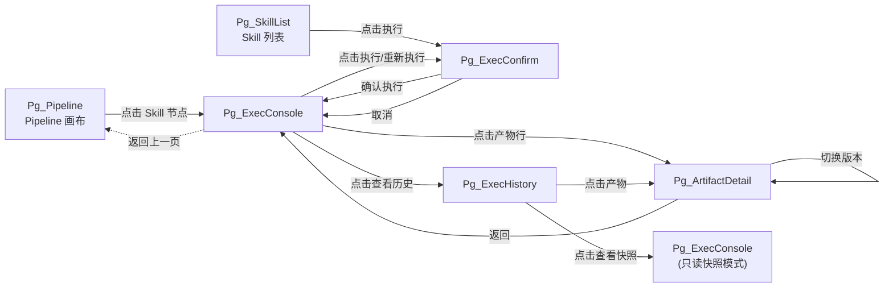
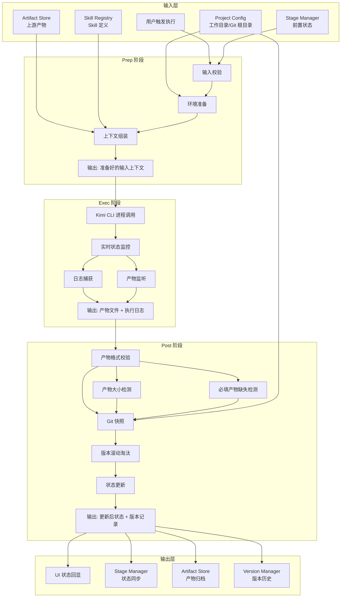
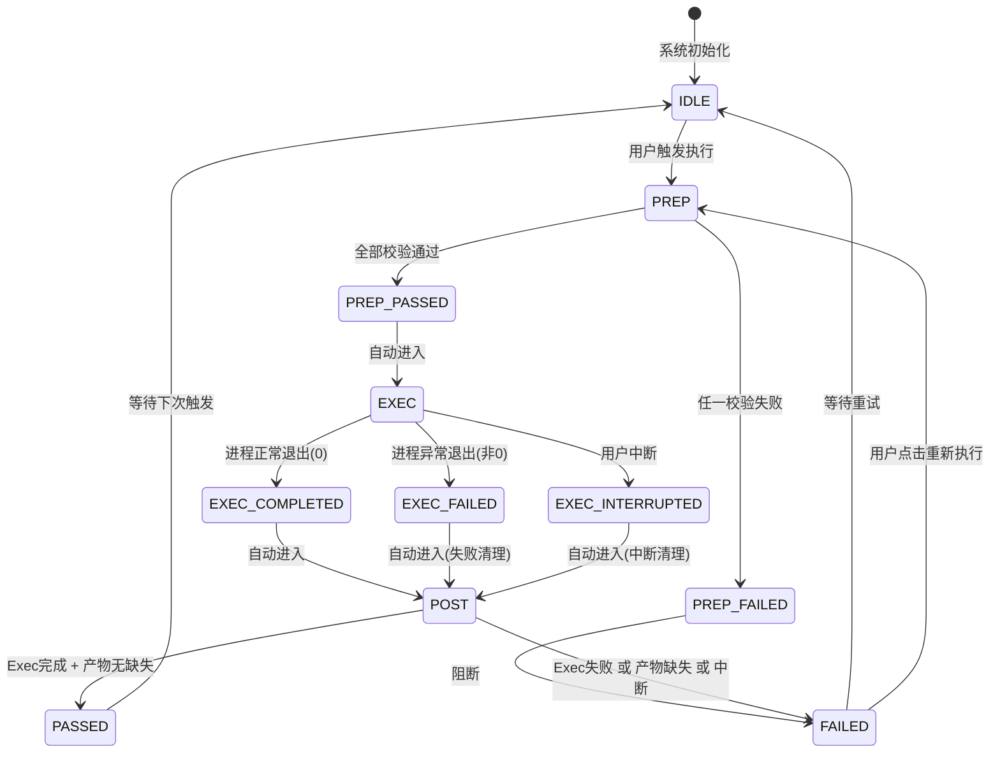
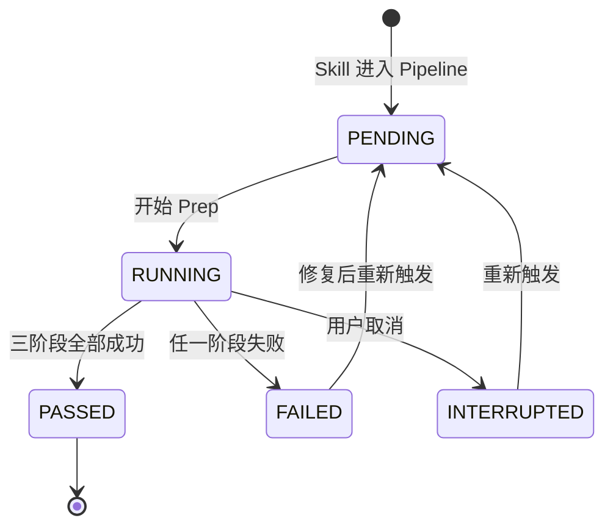
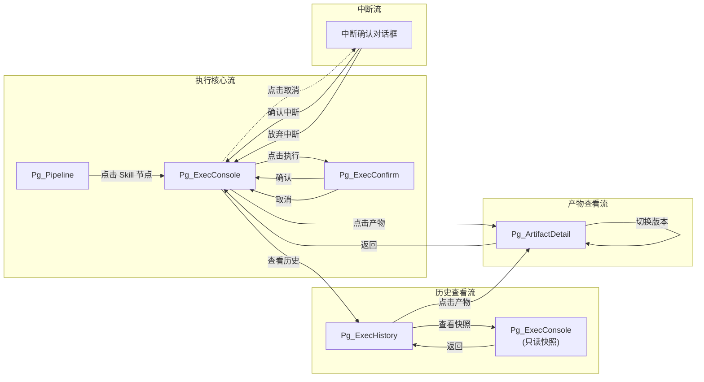

# DR-016 PocketFlow 执行引擎（PocketFlow Execution Engine）

> **模块编号**：DR-016  
> **所属变更**：SDLC Visualizer（Arsitect 可视化驾驶舱）  
> **关联需求**：PocketFlow prep-exec-post 三阶段生命周期  
> **关联用户故事**：US-002（Skill 执行）  
> **需求基线版本**：PRD-000 v1.0  
> **状态**：Draft → Active（待 Gate 2.5 冻结）

---

## 1. 需求追溯与验收标准

### 1.1 需求追溯表

| 上游需求 ID | 需求描述 | 本模块覆盖范围 | 覆盖章节 |
|:-----------:|----------|----------------|----------|
| BR-016 | 所有 Skill 执行必须遵循 PocketFlow 三阶段 | 完整实现 Prep-Exec-Post 生命周期编排 | 4.1, 4.4 |
| BR-007 | 产物文件自动纳入 Git 快照；单文件 > 10MB 除外 | Git 快照触发逻辑、大文件过滤规则 | 4.1.3, 4.4 |
| BR-026 | 产物版本历史保留最近 10 个版本 | 版本滚动淘汰策略 | 4.1.3, 4.4 |
| FR-016-1 | Prep 阶段输入校验与环境准备 | 前置 Stage 检查、环境可用性检查、上下文组装 | 4.1.1 |
| FR-016-2 | Exec 阶段 Skill 执行与实时监控 | 进程调用、状态监控、日志捕获、产物监听 | 4.1.2 |
| FR-016-3 | Post 阶段产物校验与状态更新 | 格式校验、完整性检查、状态流转、版本记录 | 4.1.3 |
| NFR-016-1 | Prep 阶段响应时间 < 1s | 性能验收指标 | 1.2 |
| NFR-016-2 | Post 阶段响应时间 < 2s | 性能验收指标 | 1.2 |
| NFR-016-3 | 产物校验耗时 < 500ms | 性能验收指标 | 1.2 |
| US-002 | Skill 执行 — 作为用户，我希望一键触发 Skill 执行并查看实时进度 | 执行触发入口、实时状态回显、日志展示 | 2, 3, 5 |

### 1.2 IN / OUT 清单

**IN（范围内）**
- PocketFlow 三阶段（Prep / Exec / Post）的标准化执行编排
- 前置 Stage 完成状态与产物存在性校验
- Kimi CLI 进程调用、生命周期管理与 stdout/stderr 实时捕获
- 产物文件格式合法性校验（Markdown / YAML / JSON）
- 产物大小检测与超限警告（> 10MB）
- 必填产物缺失检测
- Git 快照自动触发（含提交信息自动生成）
- 产物版本历史管理（保留最近 10 个版本）
- Skill 执行状态机维护与可视化回显
- 执行日志的实时流式展示与历史检索

**OUT（范围外）**
- Kimi CLI 本身的安装与配置（属于环境准备，由用户或系统初始化完成）
- Skill 内容的解析与业务逻辑（由 Kimi CLI 及 SKILL.md 自身定义）
- 非 Markdown / YAML / JSON 格式产物的深度内容校验
- Git 仓库的初始化与远程仓库管理
- 产物内容的语义正确性判定（仅做格式与完整性校验）
- 跨 Skill 的并行执行调度（由外部调度器负责）
- 产物的人工审批流程（由 Review 模块负责）

### 1.3 验收标准（AC Taxonomy）

| # | 类型 | 标准描述 | 质量分 |
|:-:|:----:|----------|:------:|
| AC-1 | Behavioral | Given 用户在前置 Stage 已通过的前提下点击执行按钮 When PocketFlow 启动 Then 系统应先进入 Prep 阶段，完成输入校验、环境检查、上下文组装，耗时 < 1s | 3 |
| AC-2 | Behavioral | Given Prep 阶段全部校验通过 When 进入 Exec 阶段 Then 系统应调用 Kimi CLI 执行对应 SKILL.md，并实时回显进程状态与日志流 | 3 |
| AC-3 | Behavioral | Given Exec 阶段执行完成（无论成功或失败）When 进入 Post 阶段 Then 系统应执行产物校验、Git 快照、状态更新，耗时 < 2s | 3 |
| AC-4 | Non-behavioral | Prep 阶段平均响应时间 < 1s（P95） | 3 |
| AC-5 | Non-behavioral | Post 阶段平均响应时间 < 2s（P95） | 3 |
| AC-6 | Non-behavioral | 产物格式校验平均耗时 < 500ms（P95） | 3 |
| AC-7 | Negative | 系统明确不支持在 PocketFlow 执行过程中手动中断并恢复执行进度（中断视为失败，需重新触发） | 2 |
| AC-8 | Negative | 系统明确不支持 Exec 阶段同时执行多个 Skill（单次仅允许单个 Skill 的 PocketFlow 生命周期） | 2 |
| AC-9 | Edge case | 当产物文件大小 > 10MB 时，Git 快照应跳过该文件，但应在执行报告中标记警告，不影响其他产物快照与状态流转 | 3 |
| AC-10 | Edge case | 当产物校验发现必填产物缺失时，Post 阶段应将 Skill 状态标记为 FAILED，阻断状态流转至 PASSED，并生成缺失产物清单 | 3 |
| AC-11 | Edge case | 当 Kimi CLI 进程异常退出（非 0 退出码）时，系统应将 Exec 阶段标记为 FAILED，捕获最终 stderr 内容，并正常进入 Post 阶段执行失败后的清理与状态更新 | 3 |
| AC-12 | Dependency | Stage 状态管理服务必须可用（由 Stage Manager 模块提供） | 3 |
| AC-13 | Dependency | Git 仓库必须已初始化且工作目录干净（由 Git 快照模块提供环境检测） | 3 |

### 1.4 假设注册表

| # | 假设内容 | 影响范围 | 若假设不成立 |
|:-:|:---------|:---------|:-------------|
| A-1 | Kimi CLI 已正确安装且在系统 PATH 中可用 | Prep 环境检查、Exec 进程调用 | Prep 阶段环境检查失败，执行被阻断 |
| A-2 | 工作目录（项目根目录）已初始化为 Git 仓库 | Post Git 快照 | Git 快照步骤跳过，状态标记为 WARNING 但允许继续 |
| A-3 | 上游产物在 Exec 阶段启动前已持久化到文件系统 | Prep 上下文组装 | 上下文组装不完整，Prep 校验失败 |
| A-4 | 产物生成目录在 Skill 执行期间可被文件系统监听 | Exec 产物监控 | 产物监控失效，Post 阶段依赖最终目录扫描 |
| A-5 | 用户具备触发 Skill 执行的权限（已登录且拥有项目写权限） | 执行入口可用性 | 执行按钮禁用或隐藏 |

---

## 2. 原型与页面结构

### 2.1 页面清单

| # | 页面名称 | 页面 ID | 入口条件 | 说明 |
|:-:|:---------|:--------|:---------|:-----|
| 1 | Skill 执行控制台 | Pg_ExecConsole | 从 Pipeline 画布或 Skill 列表点击进入 | 核心页面，展示三阶段执行状态、实时日志、产物预览 |
| 2 | 执行历史记录 | Pg_ExecHistory | 从侧边栏导航或执行控制台跳转 | 展示当前 Skill 的历史执行记录与版本对比入口 |
| 3 | 产物详情页 | Pg_ArtifactDetail | 从执行控制台产物列表点击展开 | 展示单个产物的完整内容、格式校验结果、Git 版本信息 |
| 4 | 执行确认弹窗 | Pg_ExecConfirm | 点击执行按钮后自动弹出 | 二次确认执行参数、展示前置 Stage 检查摘要 |

### 2.2 文字化布局结构

#### 页面 1：Skill 执行控制台（Pg_ExecConsole）

**整体布局**：左右分栏，左 320px 固定（阶段与摘要），右自适应（日志与产物）。

**左栏 — 执行概览区**
- 顶部：Skill 名称（大标题 H2）+ 当前状态标签（彩色 Badge：PREP / EXEC / POST / PASSED / FAILED）
- 中部：PocketFlow 三阶段可视化进度条（垂直时间轴）
  - Prep：图标 + 阶段名 + 耗时（ms）+ 状态图标（✓ / ✗ / ⟳）
  - Exec：同上，附加"查看实时日志"展开按钮
  - Post：同上，附加产物数量统计
- 底部：操作按钮区
  - 【执行/重新执行】主按钮（状态为 IDLE / FAILED 时可用）
  - 【查看历史】次按钮 → 跳转 Pg_ExecHistory
  - 【取消】危险按钮（仅在 EXEC 阶段显示，点击后确认中断）

**右栏 — 详情展示区（Tab 切换）**
- Tab A：实时日志流
  - 只读文本区域，自动滚动到底部
  - 支持暂停/恢复自动滚动
  - 支持按关键字过滤（输入框）
  - 日志级别颜色区分（INFO / WARN / ERROR）
- Tab B：产物列表
  - 表格：产物文件名 | 类型 | 大小 | 格式校验 | Git 快照状态
  - 每行可点击展开 → 跳转 Pg_ArtifactDetail
  - 产物缺失时该行标红并显示警告图标
- Tab C：上下文摘要
  - 只读展示 Prep 阶段组装的上游产物清单、用户批注、参考资料路径

#### 页面 2：执行历史记录（Pg_ExecHistory）

**整体布局**：全宽表格页。

- 顶部：页面标题"执行历史" + 返回执行控制台链接
- 中部：数据表格
  - 列：执行时间 | 触发用户 | 阶段结果（Prep/Exec/Post 各自状态） | 最终状态 | 产物数 | 耗时 | 操作
  - 操作列：【查看】→ 回显该次执行快照；【对比】→ 选择两次记录进行产物差异对比（范围外，预留入口）
- 底部：分页器（每页 10 条）

#### 页面 3：产物详情页（Pg_ArtifactDetail）

**整体布局**：上下结构，上为摘要，下为内容。

- 顶部摘要栏：
  - 文件名、文件类型、文件大小、格式校验结果（通过/失败/警告）
  - Git 快照状态（已提交 / 跳过 >10MB / 未提交）
  - 版本历史下拉选择（最近 10 个版本）
- 中部内容区：
  - Markdown / YAML / JSON 语法高亮展示
  - 只读模式，支持复制到剪贴板
- 底部操作栏：
  - 【在文件夹中打开】（本地文件系统打开）
  - 【返回】→ 返回 Pg_ExecConsole

#### 页面 4：执行确认弹窗（Pg_ExecConfirm）

**整体布局**：居中模态弹窗，宽 480px。

- 标题："确认执行 {Skill 名称}"
- 内容区：
  - 前置 Stage 检查摘要列表（✓ Stage A 已通过 / ✗ Stage B 未通过 → 阻断）
  - 环境检查摘要（✓ Kimi CLI 可用 / ✗ 不可用 → 阻断）
  - 待执行 Skill 的输入上下文摘要（产物数、批注条数）
- 底部按钮区：
  - 【确认执行】主按钮（前置检查全部通过时可用）
  - 【取消】次按钮（关闭弹窗）

### 2.3 关键交互流程

**流程 1：首次触发 Skill 执行**
1. 用户在 Pipeline 画布点击目标 Skill 节点 → 展开右侧抽屉或跳转 Pg_ExecConsole
2. 点击【执行】按钮 → 弹出 Pg_ExecConfirm
3. 系统后台执行 Prep 阶段校验 → 弹窗内实时更新检查项状态
4. 全部通过 → 【确认执行】按钮从禁用变为可用
5. 用户点击【确认执行】→ 弹窗关闭，Pg_ExecConsole 自动切换至 EXEC Tab，开始实时日志流
6. Exec 阶段结束 → 自动切换至 POST Tab，展示产物校验进度
7. Post 完成 → 状态标签更新为 PASSED 或 FAILED，产物列表刷新

**流程 2：重新执行（失败后重试）**
1. 当前状态为 FAILED → 【重新执行】按钮可用
2. 点击【重新执行】→ 直接触发（无需二次确认，但保留 3 秒倒计时取消窗口）
3. 三阶段重新执行，历史记录保留上次失败记录

**流程 3：查看历史产物**
1. 在 Pg_ExecConsole 点击【查看历史】→ 跳转 Pg_ExecHistory
2. 点击某次执行记录的【查看】→ 回显该次执行的快照状态（只读，不可重新执行）
3. 点击某行产物 → 跳转 Pg_ArtifactDetail

### 2.4 页面跳转图

---

## 3. 输入输出字段

### 3.1 用户输入字段

| # | 字段名 | 字段类型 | 是否必填 | 输入方式 | 校验规则 | 来源页面 |
|:-:|:-------|:--------:|:--------:|:---------|:---------|:---------|
| 1 | 执行确认 | Boolean | 是 | 弹窗内点击【确认执行】按钮 | 前置检查全部通过后方可激活按钮 | Pg_ExecConfirm |
| 2 | 取消执行 | Boolean | 否 | 点击【取消】按钮或弹窗遮罩层 | 无 | Pg_ExecConfirm |
| 3 | 中断执行 | Boolean | 否 | EXEC 阶段点击【取消】按钮 | 二次确认弹窗"确定要中断当前执行吗？" | Pg_ExecConsole |
| 4 | 日志过滤关键字 | String | 否 | 输入框，实时过滤 | 最大长度 100，支持正则语法 | Pg_ExecConsole |
| 5 | 历史版本选择 | String | 否 | 下拉选择框 | 仅展示最近 10 个版本 | Pg_ArtifactDetail |
| 6 | 自动滚动开关 | Boolean | 否 | Toggle 开关 | 默认开启 | Pg_ExecConsole |

### 3.2 系统输入字段

| # | 字段名 | 字段类型 | 说明 | 来源模块 |
|:-:|:-------|:--------:|:-----|:---------|
| 1 | skill_id | String | 待执行 Skill 的唯一标识 | Skill Registry |
| 2 | skill_name | String | Skill 显示名称 | Skill Registry |
| 3 | stage_status_map | Map | 前置各 Stage 的完成状态（stage_id → status） | Stage Manager |
| 4 | upstream_artifacts | List | 上游产物文件路径与元数据列表 | 产物 Store |
| 5 | user_annotations | List | 用户在该 Skill 上的批注内容 | Annotation Service |
| 6 | reference_materials | List | Skill 定义的参考资料路径列表 | Skill Registry |
| 7 | work_dir | String | 当前项目工作目录绝对路径 | Project Config |
| 8 | kimi_cli_path | String | Kimi CLI 可执行文件路径（或命令名） | System Config |
| 9 | git_repo_root | String | Git 仓库根目录路径 | Project Config |

### 3.3 页面回显字段

| # | 字段名 | 字段类型 | 回显位置 | 说明 |
|:-:|:-------|:--------:|:---------|:-----|
| 1 | pocketflow_status | Enum | Pg_ExecConsole 状态标签 | 当前 PocketFlow 整体状态：IDLE / PREP / EXEC / POST / PASSED / FAILED |
| 2 | prep_duration_ms | Integer | Pg_ExecConsole 时间轴 | Prep 阶段实际耗时（毫秒）|
| 3 | exec_duration_ms | Integer | Pg_ExecConsole 时间轴 | Exec 阶段实际耗时（毫秒）|
| 4 | post_duration_ms | Integer | Pg_ExecConsole 时间轴 | Post 阶段实际耗时（毫秒）|
| 5 | process_status | Enum | Pg_ExecConsole EXEC Tab | Kimi CLI 进程状态：starting / running / completed / failed / interrupted |
| 6 | log_stream | String (Stream) | Pg_ExecConsole 日志区 | stdout/stderr 合并实时流 |
| 7 | artifact_list | List | Pg_ExecConsole 产物 Tab | 本次执行生成的产物清单及校验结果 |
| 8 | git_snapshot_status | Enum | Pg_ExecConsole 产物 Tab / Pg_ArtifactDetail | 单产物或整体的 Git 快照状态：committed / skipped_size / skipped_no_repo / failed |
| 9 | version_history | List | Pg_ArtifactDetail 下拉框 | 该产物最近 10 个版本的 commit_hash + timestamp |
| 10 | failure_reason | String | Pg_ExecConsole 底部警告区 | 失败原因摘要（Prep/Exec/Post 各自的错误描述）|
| 11 | missing_artifacts | List | Pg_ExecConsole 产物 Tab | 缺失的必填产物名称列表 |
| 12 | exec_history | List | Pg_ExecHistory 表格 | 历史执行记录分页数据 |

### 3.4 接口响应字段（系统内部服务间）

| # | 字段名 | 字段类型 | 说明 | 消费者 |
|:-:|:-------|:--------:|:-----|:-------|
| 1 | execution_id | String | 本次 PocketFlow 执行的唯一标识 | UI 层、Stage Manager、日志服务 |
| 2 | phase_result | Object | 三阶段各自的执行结果（status / duration_ms / error_msg / output_artifacts）| Stage Manager、Progress Tracker |
| 3 | artifact_validation_report | Object | 产物校验报告（valid_count / invalid_count / missing_count / warnings）| UI 层、产物 Store |
| 4 | git_commit_hash | String | Post 阶段生成的 Git 快照 commit hash | Version Manager、UI 层 |
| 5 | final_status | Enum | 本次执行最终状态：PASSED / FAILED | Stage Manager、Progress Tracker |

### 3.5 数据流转图

---

## 4. 业务逻辑与状态机

### 4.1 核心业务流程

#### 4.1.1 Prep 阶段 — 准备

**流程目标**：确保执行环境就绪，组装完整输入上下文。

1. **输入校验**
   - 读取目标 Skill 的依赖 Stage 清单
   - 逐一查询 Stage Manager 获取各前置 Stage 的当前状态
   - 判定规则：所有前置 Stage 状态必须为 `PASSED` 或等效完成状态
   - 任一前置 Stage 未完成 → 生成阻断性错误，记录缺失 Stage 列表，Prep 失败

2. **产物存在性校验**
   - 根据 Skill 定义的产物需求清单，检查上游产物文件是否存在于 产物 Store
   - 判定规则：所有标记为 `required` 的上游产物必须存在且非空
   - 必填产物缺失 → 生成阻断性错误，记录缺失产物路径，Prep 失败

3. **环境准备**
   - 检查 Kimi CLI 可用性：尝试执行 `kimi --version` 等价调用，验证进程可启动且返回版本信息
   - 检查工作目录：验证工作目录存在、可写、且为 Git 仓库（存在 `.git` 目录）
   - 任一检查失败 → 生成阻断性错误，Prep 失败

4. **上下文组装**
   - 收集上游产物内容：按 Skill 定义的输入映射，读取产物文件内容
   - 收集用户批注：读取当前 Skill 关联的所有用户批注条目
   - 收集参考资料：按 Skill 定义的 `references` 清单，读取参考文件路径
   - 组装为结构化输入上下文对象（供 Kimi CLI 消费）

5. **阶段输出**
   - 输出：准备好的输入上下文对象
   - 状态流转：IDLE → PREP → PREP_PASSED（或 PREP_FAILED）

#### 4.1.2 Exec 阶段 — 执行

**流程目标**：调用 Kimi CLI 执行 SKILL.md，实时监控进程与产物。

1. **进程启动**
   - 使用 Prep 阶段组装的输入上下文，构造 Kimi CLI 调用参数
   - 启动 Kimi CLI 子进程，指定工作目录、SKILL.md 路径、输入上下文
   - 初始状态标记为 `starting`

2. **状态监控**
   - 进程启动后状态标记为 `running`
   - 周期轮询进程存活状态（或依赖进程退出事件）
   - 进程正常退出且退出码为 0 → 状态标记为 `completed`
   - 进程异常退出（非 0 退出码 / 信号终止 / 未捕获异常）→ 状态标记为 `failed`
   - 用户主动中断 → 状态标记为 `interrupted`

3. **日志捕获**
   - 建立 stdout 管道实时读取流
   - 建立 stderr 管道实时读取流
   - 合并为统一日志流，按行输出到日志存储，并实时推送到 UI 层
   - 日志级别识别：以 `[WARN]` / `[ERROR]` 等前缀或关键字做初步分级

4. **产物监听**
   - 在 Skill 定义的产物输出目录上建立文件系统监听（或基于进程退出后的目录扫描）
   - 新文件创建/修改时，记录产物路径、大小、最后修改时间
   - 进程结束后，执行最终目录扫描，补齐监听期间可能遗漏的产物

5. **阶段输出**
   - 输出：产物文件清单（路径 + 元数据）+ 完整执行日志
   - 状态流转：PREP_PASSED → EXEC → EXEC_COMPLETED / EXEC_FAILED / EXEC_INTERRUPTED

#### 4.1.3 Post 阶段 — 后处理

**流程目标**：校验产物、生成 Git 快照、更新状态、管理版本。

1. **产物校验**
   - **格式合法性**：对 Markdown / YAML / JSON 产物，执行对应格式解析校验；解析失败标记为 invalid
   - **大小检测**：遍历产物清单，计算各文件大小；> 10MB 的标记为 `oversized_warning`
   - **必填产物缺失检测**：对照 Skill 定义的 `output_artifacts.required` 清单，检查产物是否存在；缺失的标记为 `missing`
   - 存在任何 `missing` → Post 阶段最终状态为 FAILED
   - 存在 `invalid` 或 `oversized_warning` → 记录警告，不影响状态流转（除非规则另有规定）
   - 产物校验整体耗时目标 < 500ms

2. **Git 快照**
   - 对本次执行生成的产物文件，逐一执行 `git add`
   - 跳过标记为 `oversized_warning`（> 10MB）的文件
   - 若工作目录非 Git 仓库，跳过 Git 快照，记录 `skipped_no_repo`
   - 生成提交信息，包含：Skill 名称、Stage 标识、执行时间戳、execution_id
   - 执行 `git commit`，获取 commit hash
   - 提交失败（如索引锁定、磁盘满）→ 记录 `failed`，不影响状态流转（视为警告）

3. **版本滚动淘汰**
   - 查询该 Skill 产物历史版本记录
   - 若版本数 > 10，删除最早版本的 Git 引用或记录（软删除，保留 Git 对象）
   - 更新版本索引表

4. **状态更新**
   - 若 Exec 阶段为 `completed` 且产物校验无 `missing` → 最终状态更新为 `PASSED`
   - 若 Exec 阶段为 `failed` / `interrupted` 或产物校验存在 `missing` → 最终状态更新为 `FAILED`
   - 将最终状态同步至 Stage Manager，标记对应 Stage 为 `PASSED` 或 `FAILED`
   - 生成执行报告，包含三阶段耗时、产物清单、校验结果、Git commit hash

5. **阶段输出**
   - 输出：更新后的 Stage 状态 + 执行报告 + 版本记录
   - 状态流转：EXEC_COMPLETED → POST → PASSED；EXEC_FAILED → POST → FAILED

### 4.2 业务规则映射

| 规则 ID | 规则描述 | 适用阶段 | 触发条件 | 执行动作 |
|:-------:|:---------|:---------|:---------|:---------|
| BR-016 | 所有 Skill 执行必须遵循 PocketFlow 三阶段 | 全局 | 任何 Skill 执行触发 | 强制按 Prep → Exec → Post 顺序执行，不可跳过 |
| BR-007-1 | 产物文件自动纳入 Git 快照 | Post | 产物校验通过后 | 对所有有效产物执行 `git add` + `git commit` |
| BR-007-2 | 单文件 > 10MB 不纳入 Git 快照 | Post | 产物大小检测时 | 跳过该文件的 Git add，标记 `skipped_size` |
| BR-026 | 产物版本历史保留最近 10 个版本 | Post | Git 快照成功后 | 若版本记录数 > 10，淘汰最早版本索引 |
| BR-016-E1 | Prep 失败阻断执行 | Prep | 任一校验失败 | 不进入 Exec，直接标记 FAILED |
| BR-016-E2 | Exec 失败仍进入 Post | Exec | 进程异常退出 | 正常进入 Post 执行失败清理与状态更新 |
| BR-016-P1 | 产物缺失导致 Post 失败 | Post | 必填产物缺失 | 最终状态强制为 FAILED |
| BR-016-P2 | Git 快照失败不阻断状态 | Post | Git 提交异常 | 记录警告，不影响 PASSED/FAILED 判定 |

### 4.3 状态机

#### PocketFlow 阶段状态机

#### Skill 执行状态聚合（面向 Stage Manager）

### 4.4 异常处理

| 异常场景 | 发生阶段 | 检测方式 | 处理策略 | 用户感知 |
|:---------|:---------|:---------|:---------|:---------|
| 前置 Stage 未完成 | Prep | Stage Manager 状态查询 | 阻断执行，Prep 失败，返回缺失 Stage 清单 | Pg_ExecConfirm 中对应检查项标红，【确认执行】按钮禁用 |
| 上游产物缺失 | Prep | 文件系统存在性检查 | 阻断执行，Prep 失败，返回缺失产物路径 | Pg_ExecConfirm 上下文摘要区显示警告，提示缺失产物 |
| Kimi CLI 不可用 | Prep | 进程探测失败 | 阻断执行，Prep 失败 | Pg_ExecConfirm 环境检查项标红，显示"Kimi CLI 未找到，请检查安装" |
| 工作目录不可写 | Prep | 目录权限探测 | 阻断执行，Prep 失败 | Pg_ExecConfirm 环境检查项标红 |
| 进程启动超时 | Exec | 启动后 5s 内无响应 | 标记 FAILED，终止进程 | 日志区显示"进程启动超时"，状态标签变红 |
| 进程运行中崩溃 | Exec | 进程异常退出码 | 标记 FAILED，捕获最终 stderr | 日志区显示最后错误输出，状态标签变红 |
| 文件系统监听失败 | Exec | 监听 API 抛异常 | 降级为进程退出后目录扫描，记录警告 | 无直接感知，日志中记录警告 |
| 产物格式非法 | Post | 解析器抛出语法错误 | 标记该产物 invalid，记录警告 | Pg_ExecConsole 产物列表中该行标黄，显示"格式异常" |
| 产物大小超限 | Post | 文件大小 > 10MB | 标记 oversized_warning，跳过 Git 快照 | Pg_ExecConsole 产物列表中该行标黄，显示"文件过大，未纳入版本" |
| 必填产物缺失 | Post | 产物清单与定义比对 | 标记 FAILED，生成缺失清单 | Pg_ExecConsole 产物列表缺失行标红，底部显示"执行失败：产物不完整" |
| Git 索引锁定 | Post | git add/commit 抛异常 | 标记 git_snapshot_status = failed，记录警告 | 无直接感知，执行报告中显示 Git 快照失败 |
| Git 仓库未初始化 | Post | 目录下无 .git | 标记 skipped_no_repo，继续后续流程 | 无直接感知，执行报告中显示"未检测到 Git 仓库" |
| 版本淘汰时索引损坏 | Post | 版本记录查询异常 | 记录警告，不影响本次状态流转 | 无直接感知 |

---

## 5. 交互规格

### 5.1 页面：Skill 执行控制台（Pg_ExecConsole）

#### 元素 1：执行按钮（#btn-execute）

| 属性 | 说明 |
|------|------|
| 触发方式 | click |
| 前置条件 | 当前状态为 IDLE 或 FAILED；用户具备执行权限；目标 Skill 已绑定 SKILL.md |
| 立即反馈 | 按钮置灰禁用，显示 loading spinner；弹出 Pg_ExecConfirm |
| 成功结果 | 弹窗展示 Prep 检查通过摘要，【确认执行】按钮可用 |
| 失败结果 | 弹窗内对应检查项标红，【确认执行】保持禁用，显示具体失败原因 |
| 异常分支 | 弹窗渲染失败 → 显示 toast "加载失败，请刷新重试"；网络异常 → toast "网络异常，请检查连接" |
| 埋点事件 | `pocketflow_execute_click`，携带参数：`{skill_id, from_status, timestamp}` |

#### 元素 2：重新执行按钮（#btn-retry）

| 属性 | 说明 |
|------|------|
| 触发方式 | click |
| 前置条件 | 当前状态为 FAILED；用户具备执行权限 |
| 立即反馈 | 按钮置灰禁用；底部出现 3 秒倒计时横幅"即将重新执行，3..."，含【取消】链接 |
| 成功结果 | 倒计时结束，直接进入 PREP 阶段，页面自动滚动到时间轴顶部 |
| 失败结果 | 倒计时期间用户点击取消 → 按钮恢复可用，横幅消失 |
| 异常分支 | 倒计时期间系统异常 → 横幅消失，按钮恢复，toast "操作失败，请重试" |
| 埋点事件 | `pocketflow_retry_click`，携带参数：`{skill_id, previous_execution_id, timestamp}` |

#### 元素 3：取消/中断按钮（#btn-cancel）

| 属性 | 说明 |
|------|------|
| 触发方式 | click |
| 前置条件 | 当前处于 EXEC 阶段（process_status = running） |
| 立即反馈 | 按钮置灰禁用；弹出二次确认对话框"确定要中断当前执行吗？已生成的产物将被保留。" |
| 成功结果 | 用户点击确认 → 发送中断信号，进程终止，状态变为 EXEC_INTERRUPTED，自动进入 Post 清理 |
| 失败结果 | 用户点击取消 → 对话框关闭，按钮恢复可用，执行继续 |
| 异常分支 | 中断信号发送失败 → 对话框关闭，toast "中断失败，进程可能已结束"，按钮隐藏 |
| 埋点事件 | `pocketflow_cancel_click`，携带参数：`{skill_id, execution_id, exec_duration_ms_so_far, timestamp}` |

#### 元素 4：日志过滤输入框（#input-log-filter）

| 属性 | 说明 |
|------|------|
| 触发方式 | input（实时） / 回车确认 |
| 前置条件 | 日志区有内容；当前在 EXEC 或 POST 或已完成状态 |
| 立即反馈 | 输入时日志区实时高亮匹配行，非匹配行置灰（但不隐藏） |
| 成功结果 | 匹配到内容 → 自动滚动到第一个匹配行；无匹配 → 显示"无匹配日志"占位文案 |
| 失败结果 | 无（输入类控件无失败态） |
| 异常分支 | 正则语法非法 → 忽略过滤，输入框边框变红，提示"过滤语法错误" |
| 埋点事件 | `pocketflow_log_filter`，携带参数：`{skill_id, execution_id, keyword_length, timestamp}` |

#### 元素 5：自动滚动 Toggle（#toggle-auto-scroll）

| 属性 | 说明 |
|------|------|
| 触发方式 | click |
| 前置条件 | 无 |
| 立即反馈 | Toggle 滑块切换，文案在"自动滚动：开/关"间变化 |
| 成功结果 | 开启时，新日志到达自动滚动到底部；关闭时，保持当前滚动位置 |
| 失败结果 | 无 |
| 异常分支 | 无 |
| 埋点事件 | `pocketflow_autoscroll_toggle`，携带参数：`{skill_id, new_state, timestamp}` |

#### 元素 6：产物行点击（#产物-row-{name}）

| 属性 | 说明 |
|------|------|
| 触发方式 | click |
| 前置条件 | 产物列表已加载；该行产物存在 |
| 立即反馈 | 行背景高亮，右侧展开内联预览（前 20 行）或跳转 Pg_ArtifactDetail |
| 成功结果 | 展示产物预览浮层 / 跳转产物详情页 |
| 失败结果 | 产物文件被删除 → toast "产物文件已不存在，请重新执行" |
| 异常分支 | 文件读取权限不足 → toast "无法读取产物内容" |
| 埋点事件 | `pocketflow_artifact_view`，携带参数：`{skill_id, execution_id, artifact_name, artifact_type, timestamp}` |

#### 元素 7：查看历史按钮（#btn-view-history）

| 属性 | 说明 |
|------|------|
| 触发方式 | click |
| 前置条件 | 无 |
| 立即反馈 | 按钮置灰禁用（加载中） |
| 成功结果 | 跳转至 Pg_ExecHistory，展示当前 Skill 的执行历史 |
| 失败结果 | 历史记录加载失败 → 按钮恢复，toast "加载历史记录失败" |
| 异常分支 | 无网络 → toast "网络异常，请检查连接" |
| 埋点事件 | `pocketflow_history_click`，携带参数：`{skill_id, timestamp}` |

### 5.2 页面：执行确认弹窗（Pg_ExecConfirm）

#### 元素 1：确认执行按钮（#btn-confirm-execute）

| 属性 | 说明 |
|------|------|
| 触发方式 | click |
| 前置条件 | Prep 阶段所有检查项已通过（全部 ✓） |
| 立即反馈 | 弹窗关闭，Pg_ExecConsole 时间轴 Prep 项标记完成，自动切换到 EXEC Tab，日志区出现"进程启动中..." |
| 成功结果 | 进入 EXEC 阶段，开始实时日志流 |
| 失败结果 | 进程启动失败 → 状态直接变为 FAILED，日志区显示错误 |
| 异常分支 | 弹窗关闭后页面失去响应 → 显示全局 loading 遮罩，3s 后提示"页面响应异常，请刷新" |
| 埋点事件 | `pocketflow_confirm_execute`，携带参数：`{skill_id, prep_duration_ms, timestamp}` |

#### 元素 2：取消按钮（#btn-dismiss-confirm）

| 属性 | 说明 |
|------|------|
| 触发方式 | click |
| 前置条件 | 无 |
| 立即反馈 | 弹窗关闭，Pg_ExecConsole 中【执行】按钮恢复可用 |
| 成功结果 | 弹窗关闭，无状态变更 |
| 失败结果 | 无 |
| 异常分支 | 无 |
| 埋点事件 | `pocketflow_dismiss_confirm`，携带参数：`{skill_id, timestamp}` |

### 5.3 页面：产物详情页（Pg_ArtifactDetail）

#### 元素 1：版本选择下拉框（#select-version）

| 属性 | 说明 |
|------|------|
| 触发方式 | change |
| 前置条件 | 产物存在版本历史（至少 1 个版本） |
| 立即反馈 | 内容区显示 loading spinner |
| 成功结果 | 加载选中版本内容，语法高亮渲染 |
| 失败结果 | 版本内容读取失败 → 显示"版本内容不可用"占位页 |
| 异常分支 | 选中版本文件已被清理 → toast "该版本文件已清理，请选择其他版本" |
| 埋点事件 | `pocketflow_artifact_version_switch`，携带参数：`{skill_id, artifact_name, version_index, timestamp}` |

#### 元素 2：在文件夹中打开按钮（#btn-open-folder）

| 属性 | 说明 |
|------|------|
| 触发方式 | click |
| 前置条件 | 产物文件存在于本地文件系统 |
| 立即反馈 | 按钮短暂置灰 |
| 成功结果 | 调用系统默认文件管理器打开产物所在目录并选中该文件 |
| 失败结果 | 文件已被删除 → toast "文件已不存在" |
| 异常分支 | 系统调用失败 → toast "无法打开文件夹" |
| 埋点事件 | `pocketflow_open_folder`，携带参数：`{skill_id, artifact_name, timestamp}` |

### 5.4 页面间跳转关系图

---

## 附录：变更日志

| 版本 | 日期 | 作者 | 变更内容 |
|:----:|:----:|:----:|:---------|
| 0.1 | 2026-06-01 | AI PM | 初稿，基于 PRD-000 v1.0 生成 DR-016 模块级详细需求 |
