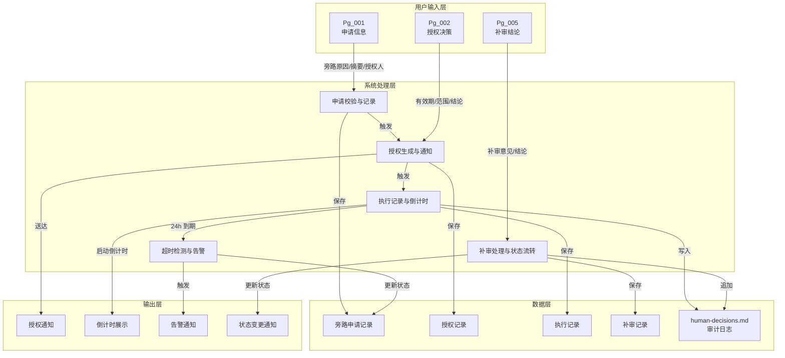
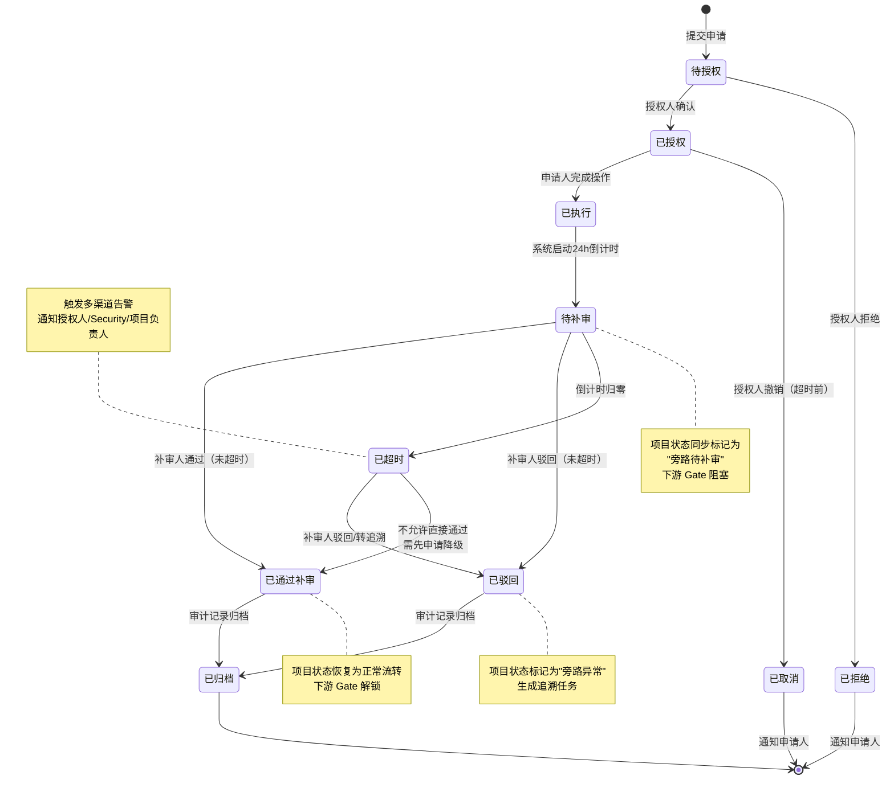

# DR-017 HITL 旁路审批服务 — 模块级详细需求文档

> **模块编号**：DR-017  
> **模块名称**：HITL 旁路审批服务（HITL Bypass Approval Service）  
> **关联需求**：紧急授权、24h 补审、超时告警  
> **关联用户故事**：US-003（Gate 审批中的旁路场景）  
> **关联业务规则**：BR-014  
> **文档状态**：Active  
> **版本**：1.0  
> **日期**：2026-06-01

---

## 1. 需求追溯与验收标准

### 1.1 需求追溯表

| 需求 ID | 来源 | 需求描述 | 优先级 | 验收标准关联 |
|---------|------|---------|--------|-------------|
| BR-014-1 | PRD 业务规则 | 紧急情况下支持旁路审批 | P0 | AC-F-001 |
| BR-014-2 | PRD 业务规则 | 需 Tech Lead 或 Security Officer 提前授权 | P0 | AC-F-002, AC-F-003 |
| BR-014-3 | PRD 业务规则 | 执行过程全量记录（日志、产物、决策） | P0 | AC-F-004, AC-D-001 |
| BR-014-4 | PRD 业务规则 | 事后 24h 内必须补审批 | P0 | AC-F-005, AC-V-001 |
| BR-014-5 | PRD 业务规则 | 超过 24h 未补审批自动触发告警 | P0 | AC-F-006, AC-N-001 |
| BR-014-6 | PRD 业务规则 | 项目状态标记为"旁路待补审"，阻塞下游 Gate 解锁 | P0 | AC-F-007, AC-F-008 |
| US-003-1 | 用户故事 | 作为 Tech Lead，我希望在紧急情况下授权旁路审批，以便生产修复不被流程阻塞 | P0 | AC-F-002 |
| US-003-2 | 用户故事 | 作为安全负责人，我希望事后补审旁路执行记录，以便确保操作合规 | P0 | AC-F-005, AC-F-009 |
| US-003-3 | 用户故事 | 作为项目成员，我希望在旁路未补审时收到阻塞提示，以便了解流程状态 | P1 | AC-F-007, AC-F-010 |
| NFR-RESPONSE | PRD NFR | 授权响应 < 1s | P1 | AC-N-002 |
| NFR-ALERT | PRD NFR | 告警触发 < 5min（超时后） | P1 | AC-N-001 |

### 1.2 IN / OUT 清单

**范围内（IN Scope）**

- 旁路审批的完整生命周期管理：申请 → 授权 → 执行 → 补审 → 结案
- 授权码与授权链接两种授权方式的生成与校验
- 授权有效期管理（单次有效、时段有效）
- 授权范围控制（特定 Stage / 特定项目 / 全局）
- 旁路执行过程的全量记录与展示
- 24 小时补审倒计时与超时告警
- 补审通知的多渠道触达（邮件、站内信、桌面通知）
- 补审结论处理（通过/驳回）及后续状态流转
- 项目"旁路待补审"状态标记及下游 Gate 阻塞
- 全链路审计记录写入 human-decisions.md

**范围外（OUT Scope）**

- 与外部邮件服务商的集成实现（仅定义通知触发点，不定义SMTP配置）
- 与 PagerDuty / Slack 等第三方告警平台的深度集成
- 授权人的身份认证体系（依赖系统既有登录体系）
- 旁路执行期间的业务操作本身（仅记录操作元数据，不执行操作）
- 区块链式不可篡改存储
- 多级联审与会签机制
- 旁路审批的批量处理

### 1.3 验收标准（AC Taxonomy）

#### Functional（功能型）

| AC ID | 验收标准 | 测试方法 | 优先级 |
|-------|---------|---------|--------|
| AC-F-001 | Given the project is in a Gate-blocked state, When the user chooses to initiate a bypass, Then the system shall display the bypass application entry | 手工点击验证 | P0 |
| AC-F-002 | Given a bypass application has been submitted, When the system processes the submission, Then the authorizer (Tech Lead or Security Officer) shall receive the authorization request notification within 1 second | 计时验证 | P0 |
| AC-F-003 | Given an authorizer receives an authorization request, When the authorizer completes authorization via authorization code or authorization link, Then the applicant shall receive an execution permit notification upon successful authorization | 端到端验证 | P0 |
| AC-F-004 | Given the bypass is being executed, When the system records the execution, Then the audit log shall include the applicant, authorizer, authorization time, execution summary, and associated Gate ID | 审计日志核对 | P0 |
| AC-F-005 | Given the authorization is completed, When the system initiates the 24-hour review countdown, Then the reviewer's workspace shall display a "Pending Review" task card | 状态查看 | P0 |
| AC-F-006 | Given the 24-hour countdown reaches zero without a review conclusion, When the timeout condition is triggered, Then the system shall send timeout alerts within 5 minutes via in-app message, email, and desktop notification | 等待验证 | P0 |
| AC-F-007 | Given a project has unreviewed bypass records, When the system evaluates the project status, Then the project shall be automatically marked as "Bypass Pending Review", the downstream Gate unlock button shall be disabled, and a tooltip message shall be displayed | 状态流转验证 | P0 |
| AC-F-008 | Given the review is approved, When the system updates the project status, Then the project shall return to normal flow status and the downstream Gate shall be unlockable | 状态流转验证 | P0 |
| AC-F-009 | Given the review is rejected, When the system processes the rejection, Then the project shall be marked as "Bypass Exception", an escalation task shall be generated, and the project owner shall be notified | 状态流转验证 | P0 |
| AC-F-010 | Given the reviewer accesses the review interface, When the system loads the bypass execution record, Then the interface shall display the complete timeline, decision content, artifact list, and applicant remarks | 内容完整性检查 | P1 |

#### Data（数据型）

| AC ID | 验收标准 | 测试方法 | 优先级 |
|-------|---------|---------|--------|
| AC-D-001 | Given a bypass approval audit record is created, When the system persists the record, Then it shall contain unique ID, applicant, application time, authorizer, authorization time, authorization method, authorization scope, execution summary, review status, review time, review conclusion, and rejection reason (if applicable) | 字段核对 | P0 |
| AC-D-002 | Given the review countdown is active, When the page is refreshed, Then the countdown shall be displayed with second-level precision and the countdown state shall not be lost | 刷新验证 | P1 |

#### Validation（校验型）

| AC ID | 验收标准 | 测试方法 | 优先级 |
|-------|---------|---------|--------|
| AC-V-001 | Given a bypass record has exceeded 24 hours without review, When the reviewer attempts to submit a conclusion, Then the "Approve" option shall be disabled and only "Reject" or "Escalate" shall be allowed | 边界验证 | P0 |
| AC-V-002 | Given a user does not have the Tech Lead or Security Officer role, When the user accesses the authorization interface, Then the "Authorize" button shall not be visible | 权限验证 | P0 |
| AC-V-003 | Given an expired authorization code or link is used, When the user attempts to authorize with it, Then the system shall reject the request and display "Authorization has expired" | 过期验证 | P1 |
| AC-V-004 | Given the authorization scope does not match the application scope, When the authorizer confirms the authorization, Then the system shall block the action and display a scope conflict message | 范围验证 | P1 |

#### Error / Edge Case（异常与边界型）

| AC ID | 验收标准 | 测试方法 | 优先级 |
|-------|---------|---------|--------|
| AC-E-001 | Given a network interruption causes the authorization request to fail, When the failure occurs, Then the system shall preserve the application draft and prompt the user to retry | 断网模拟 | P1 |
| AC-E-002 | Given a bypass record is accidentally deleted during review, When the reviewer attempts to access the record, Then the system shall display "Record does not exist" and guide the user to contact the administrator | 数据缺失模拟 | P2 |
| AC-E-003 | Given multiple unreviewed bypass records exist for the same project, When the system displays the records, Then they shall be sorted in reverse chronological order and all unreviewed records shall block downstream Gates | 并发边界验证 | P1 |
| AC-E-004 | Given the authorizer revokes the authorization during the countdown period, When the revocation is processed, Then the system shall terminate the bypass flow, notify the applicant, and rollback the execution content to pending approval status | 撤销流程验证 | P2 |

#### Cross-cutting / Non-functional（跨切与非功能型）

| AC ID | 验收标准 | 测试方法 | 优先级 |
|-------|---------|---------|--------|
| AC-N-001 | Given the 24-hour timeout has occurred, When the alert is triggered, Then it shall be delivered to all configured notification channels within 5 minutes | 计时验证 | P0 |
| AC-N-002 | Given the user clicks "Apply for Bypass", When the authorization notification is delivered, Then the end-to-end latency shall be less than 1 second | 性能计时 | P1 |
| AC-N-003 | Given a bypass approval audit record exists, When a non-administrator user attempts to delete or modify it, Then the system shall prevent the operation and the record shall be retained permanently | 权限验证 | P0 |
| AC-N-004 | Given the reviewer accesses the review interface, When the bypass execution record is loaded, Then the interface shall complete loading and rendering within 3 seconds | 性能计时 | P1 |

#### Negative（否定型）

| AC ID | 验收标准 | 测试方法 | 优先级 |
|-------|---------|---------|--------|
| AC-NG-001 | Given a user does not hold the Tech Lead or Security Officer role, When the user attempts to authorize a bypass request, Then the system shall not permit the authorization action | 权限验证 | P0 |
| AC-NG-002 | Given a bypass record has been archived, When any user attempts to submit a supplemental review, Then the system shall not allow the review and shall indicate that the record is read-only | 状态验证 | P1 |

### 1.4 假设注册表

| 假设 ID | 假设内容 | 影响范围 | 风险等级 | 验证方式 |
|---------|---------|---------|---------|---------|
| ASM-001 | 系统中已存在"Tech Lead"和"Security Officer"角色定义 | 授权校验 | 高 | 核对 RBAC 配置 |
| ASM-002 | 用户工作台已具备"待办任务卡片"UI 组件 | 补审任务展示 | 中 | 查看 UI 组件库 |
| ASM-003 | 系统已具备站内信、邮件、桌面通知三种通知通道 | 告警触达 | 高 | 核对通知服务模块 |
| ASM-004 | human-decisions.md 审计日志文件具备可追加写入的接口 | 审计记录 | 高 | 核对文档服务模块 |
| ASM-005 | 项目状态机已支持"旁路待补审"和"旁路异常"两种扩展状态 | 状态标记 | 中 | 核对状态机定义 |
| ASM-006 | 授权码生成算法可保证唯一性与不可预测性 | 授权安全 | 高 | 安全评审 |


version: v1.0
---

## 2. 原型与页面结构

### 2.1 页面清单

| 页面编号 | 页面名称 | 入口 | 说明 |
|---------|---------|------|------|
| Pg_001 | 旁路申请页 | Gate 阻塞状态下的"紧急旁路"按钮 | 申请人填写旁路申请 |
| Pg_002 | 授权审批页 | 授权人工作台通知 / 授权链接 | 授权人审批旁路申请 |
| Pg_003 | 授权结果页 | 授权完成后跳转 | 展示授权结果与执行须知 |
| Pg_004 | 补审工作台 | 工作台"待补审"任务卡片 / 超时告警链接 | 补审人查看记录并下结论 |
| Pg_005 | 补审详情页 | 补审工作台点击记录 | 展示单条旁路全量记录 |
| Pg_006 | 旁路记录列表 | 项目侧边栏"审计日志" → "旁路记录" | 项目维度查看所有旁路历史 |
| Pg_007 | 告警通知页 | 超时告警通知点击 | 展示超时旁路记录与紧急处理入口 |

### 2.2 文字化布局结构

#### Pg_001 旁路申请页

```
┌──────────────────────────────────────────────────────┐
│  面包屑：项目首页 > Stage-3 > Gate 审批 > 旁路申请     │
├──────────────────────────────────────────────────────┤
│                                                      │
│  [警示横幅]  您正在申请旁路审批，该操作将被全程审计     │
│                                                      │
│  ─────────────────────────────────────────────────  │
│  申请信息                                            │
│  ┌────────────────────────────────────────────────┐ │
│  │ 关联 Gate：Gate-3（概要设计确认）               │ │
│  │ 关联项目：SDLC Visualizer                      │ │
│  │ 申请人：  [当前用户，只读]                      │ │
│  │ 申请时间：[系统时间，只读]                      │ │
│  └────────────────────────────────────────────────┘ │
│                                                      │
│  旁路原因（必填）                                     │
│  ┌────────────────────────────────────────────────┐ │
│  │ ○ 生产环境紧急修复                               │ │
│  │ ○ 安全漏洞热修复                                 │ │
│  │ ○ 关键业务阻塞                                   │ │
│  │ ○ 其他 [文本输入框]                              │ │
│  └────────────────────────────────────────────────┘ │
│                                                      │
│  执行内容摘要（必填，≤500 字）                        │
│  ┌────────────────────────────────────────────────┐ │
│  │ [多行文本输入框]                                 │ │
│  │ 提示：请描述您计划执行的操作内容                  │ │
│  └────────────────────────────────────────────────┘ │
│                                                      │
│  期望授权人（单选）                                   │
│  ┌────────────────────────────────────────────────┐ │
│  │ ○ Tech Lead：张三                               │ │
│  │ ○ Security Officer：李四                        │ │
│  └────────────────────────────────────────────────┘ │
│                                                      │
│  授权方式偏好                                         │
│  ┌────────────────────────────────────────────────┐ │
│  │ ○ 授权码（实时生成，需授权人手动输入）            │ │
│  │ ○ 授权链接（发送至授权人，点击即授权）            │ │
│  └────────────────────────────────────────────────┘ │
│                                                      │
│  授权范围（系统根据申请自动推断，可调整）              │
│  ┌────────────────────────────────────────────────┐ │
│  │ 当前 Stage：Stage-3                             │ │
│  │ [ ] 扩展至全项目                                │ │
│  └────────────────────────────────────────────────┘ │
│                                                      │
│         [ 取消 ]        [ 提交申请 ]                  │
│                                                      │
└──────────────────────────────────────────────────────┘
```

#### Pg_002 授权审批页

```
┌──────────────────────────────────────────────────────┐
│  面包屑：工作台 > 待审批 > 旁路授权                    │
├──────────────────────────────────────────────────────┤
│                                                      │
│  [警示横幅]  旁路授权请求 — 请审慎评估                 │
│                                                      │
│  ─────────────────────────────────────────────────  │
│  申请信息                                            │
│  ┌────────────────────────────────────────────────┐ │
│  │ 申请人：   王五                                 │ │
│  │ 申请时间： 2026-06-01 14:32:00                  │ │
│  │ 旁路原因： 生产环境紧急修复                      │ │
│  │ 执行摘要： [摘要内容，最多展示 3 行，可展开]     │ │
│  │ 涉及项目： SDLC Visualizer                      │ │
│  │ 涉及 Stage：Stage-3（概要设计确认）              │ │
│  └────────────────────────────────────────────────┘ │
│                                                      │
│  授权操作                                            │
│  ┌────────────────────────────────────────────────┐ │
│  │                                                 │ │
│  │  授权有效期                                      │ │
│  │  ○ 单次有效（本次旁路操作后失效）                │ │
│  │  ○ 时段有效 [时间选择器] 至 [时间选择器]         │ │
│  │                                                 │ │
│  │  授权范围确认                                    │ │
│  │  [ ] 仅当前 Stage（Stage-3）                    │ │
│  │  [ ] 扩展至全项目                               │ │
│  │                                                 │ │
│  │  授权备注（可选）                                │ │
│  │  [多行文本输入框]                               │ │
│  │                                                 │ │
│  └────────────────────────────────────────────────┘ │
│                                                      │
│         [ 拒绝并说明原因 ]        [ 确认授权 ]        │
│                                                      │
└──────────────────────────────────────────────────────┘
```

#### Pg_003 授权结果页

```
┌──────────────────────────────────────────────────────┐
│  旁路审批结果                                        │
├──────────────────────────────────────────────────────┤
│                                                      │
│         [✓] 授权成功                                 │
│                                                      │
│  授权码：  X7K9-M2P4-QR12                            │
│  有效期：  2026-06-01 14:35:00 — 2026-06-01 15:35:00 │
│  授权范围：Stage-3（概要设计确认）                    │
│                                                      │
│  [复制授权码]  [发送给申请人]                         │
│                                                      │
│  ─────────────────────────────────────────────────  │
│  申请人将在收到授权后执行操作。                       │
│  您需在 24 小时内（2026-06-02 14:35:00 前）完成补审。 │
│                                                      │
│              [ 返回工作台 ]                           │
│                                                      │
└──────────────────────────────────────────────────────┘
```

#### Pg_004 补审工作台

```
┌──────────────────────────────────────────────────────┐
│  面包屑：工作台 > 待补审                              │
├──────────────────────────────────────────────────────┤
│                                                      │
│  [标签页]  待补审（3） | 已补审 | 已超时              │
│                                                      │
│  ┌────────────────────────────────────────────────┐ │
│  │ [紧急] 项目：SDLC Visualizer                    │ │
│  │        旁路时间：2026-06-01 14:35               │ │
│  │        剩余时间：18:42:15 [倒计时动态刷新]       │ │
│  │        申请人：王五                             │ │
│  │        [ 查看详情并补审 ]                       │ │
│  └────────────────────────────────────────────────┘ │
│  ┌────────────────────────────────────────────────┐ │
│  │ [紧急] 项目：Another Project                    │ │
│  │        旁路时间：2026-06-01 10:20               │ │
│  │        剩余时间：02:15:33                        │ │
│  │        申请人：赵六                             │ │
│  │        [ 查看详情并补审 ]                       │ │
│  └────────────────────────────────────────────────┘ │
│                                                      │
└──────────────────────────────────────────────────────┘
```

#### Pg_005 补审详情页

```
┌──────────────────────────────────────────────────────┐
│  面包屑：工作台 > 待补审 > 补审详情                    │
├──────────────────────────────────────────────────────┤
│                                                      │
│  [状态标签] 旁路待补审 | 剩余 18:42:15               │
│                                                      │
│  ─────────────────────────────────────────────────  │
│  旁路执行时间线                                      │
│  ┌────────────────────────────────────────────────┐ │
│  │ ● 2026-06-01 14:32  王五 提交旁路申请          │ │
│  │ ● 2026-06-01 14:35  张三 确认授权              │ │
│  │   └─ 授权方式：授权码 | 有效期：单次            │ │
│  │ ● 2026-06-01 14:36  王五 开始执行旁路操作      │ │
│  │ ● 2026-06-01 14:45  王五 标记执行完成          │ │
│  │   └─ 产物：设计文档 v1.2、接口契约草案          │ │
│  └────────────────────────────────────────────────┘ │
│                                                      │
│  执行内容摘要                                        │
│  ┌────────────────────────────────────────────────┐ │
│  │ 紧急修复生产环境 Gate 审批阻塞问题，完成概要设计 │ │
│  │ 文档更新并输出接口契约初稿。                     │ │
│  └────────────────────────────────────────────────┘ │
│                                                      │
│  产物清单                                            │
│  ┌────────────────────────────────────────────────┐ │
│  │ 1. 00-design-overview.md（已归档）              │ │
│  │ 2. openapi.yaml（草案）                         │ │
│  └────────────────────────────────────────────────┘ │
│                                                      │
│  ─────────────────────────────────────────────────  │
│  补审结论                                            │
│  ┌────────────────────────────────────────────────┐ │
│  │ 补审意见（必填，≤1000 字）                      │ │
│  │ [多行文本输入框]                                │ │
│  │                                                 │ │
│  │ [ 驳回并标记异常 ]    [ 通过，正常流转 ]         │ │
│  └────────────────────────────────────────────────┘ │
│                                                      │
└──────────────────────────────────────────────────────┘
```

#### Pg_006 旁路记录列表

```
┌──────────────────────────────────────────────────────┐
│  面包屑：项目 > SDLC Visualizer > 审计日志 > 旁路记录  │
├──────────────────────────────────────────────────────┤
│                                                      │
│  [筛选栏] 状态：[全部 ▼] | 时间范围：[近 30 天 ▼]     │
│                                                      │
│  ┌────────────────────────────────────────────────┐ │
│  │ 申请时间      申请人  授权人  状态        操作  │ │
│  │ 2026-06-01    王五    张三   已通过补审   [查看]│ │
│  │ 2026-05-28    赵六    李四   已驳回       [查看]│ │
│  │ 2026-05-20    孙七    张三   已超时       [查看]│ │
│  └────────────────────────────────────────────────┘ │
│                                                      │
│  [分页：1 / 3]                                       │
│                                                      │
└──────────────────────────────────────────────────────┘
```

#### Pg_007 告警通知页

```
┌──────────────────────────────────────────────────────┐
│  旁路审批超时告警                                     │
├──────────────────────────────────────────────────────┤
│                                                      │
│  [⚠ 警告] 以下旁路审批已超过 24 小时未补审            │
│                                                      │
│  ┌────────────────────────────────────────────────┐ │
│  │ 项目：SDLC Visualizer                           │ │
│  │ 旁路时间：2026-06-01 14:35                      │ │
│  │ 超时时长：2 小时 15 分钟                        │ │
│  │ 申请人：王五                                    │ │
│  │ 当前状态：下游 Gate 已阻塞                      │ │
│  │                                                 │ │
│  │ [ 立即补审 ]  [ 转交追溯处理 ]                  │ │
│  └────────────────────────────────────────────────┘ │
│                                                      │
│  该告警同时发送至：张三（Tech Lead）、李四（Security）  │
│                                                      │
└──────────────────────────────────────────────────────┘
```

### 2.3 关键交互流程

**流程 A：标准旁路申请 → 授权 → 执行 → 补审（通过）**

1. 用户在 Gate 阻塞页面点击"紧急旁路"按钮
2. 系统跳转至 Pg_001，用户填写旁路原因、执行摘要、选择授权人
3. 用户点击"提交申请"，系统校验必填项并生成申请记录
4. 系统向授权人发送授权请求通知（站内信 + 邮件）
5. 授权人点击通知进入 Pg_002，查看申请详情
6. 授权人选择授权有效期与范围，点击"确认授权"
7. 系统生成授权码/授权链接，跳转 Pg_003 展示授权结果
8. 系统通知申请人"授权已通过"
9. 申请人执行旁路操作（业务操作本身不在本模块范围内）
10. 系统记录执行过程元数据，启动 24h 补审倒计时
11. 补审人在工作台 Pg_004 看到"待补审"任务卡片
12. 补审人点击卡片进入 Pg_005，查看完整执行记录
13. 补审人填写意见，点击"通过，正常流转"
14. 系统更新项目状态为正常流转态，解锁下游 Gate，记录审计日志

**流程 B：标准旁路申请 → 授权 → 执行 → 补审（驳回）**

步骤 1-12 同流程 A。

13. 补审人填写驳回原因，点击"驳回并标记异常"
14. 系统更新项目状态为"旁路异常"，阻塞下游 Gate
15. 系统生成追溯任务，通知项目负责人
16. 记录审计日志

**流程 C：超时告警 → 紧急处理**

1. 24h 倒计时归零，系统在 5min 内触发超时告警
2. 告警通过站内信 + 邮件 + 桌面通知送达授权人、Security Officer、项目负责人
3. 收件人点击告警通知进入 Pg_007
4. 收件人点击"立即补审"跳转 Pg_005 进行补审
5. 或点击"转交追溯处理"，系统生成追溯任务并升级告警

**流程 D：授权拒绝**

1-5 同流程 A。

6. 授权人点击"拒绝并说明原因"
7. 系统弹出拒绝原因输入框，授权人填写后提交
8. 系统通知申请人"授权已被拒绝"并附带原因
9. 旁路申请记录状态更新为"已拒绝"，不启动补审倒计时

### 2.4 页面跳转图

```mermaid
flowchart LR
    GateBlocked["Gate 阻塞页<br>（入口）"] -->|点击"紧急旁路"| Pg_001
    Pg_001["Pg_001 旁路申请页"] -->|提交申请| Pg_002_N["通知送达授权人"]
    Pg_002_N -->|点击通知| Pg_002["Pg_002 授权审批页"]
    Pg_002 -->|确认授权| Pg_003["Pg_003 授权结果页"]
    Pg_002 -->|拒绝授权| Pg_002_R["拒绝结果通知申请人"]
    Pg_003 -->|授权码/链接通知| Pg_001_A["申请人收到授权"]
    Pg_001_A -->|执行完成| Pg_004["Pg_004 补审工作台"]
    Pg_004 -->|点击待补审卡片| Pg_005["Pg_005 补审详情页"]
    Pg_005 -->|点击通过| Pg_005_P["项目恢复流转"]
    Pg_005 -->|点击驳回| Pg_005_R["项目标记异常"]
    Pg_005_P --> Pg_006["Pg_006 旁路记录列表"]
    Pg_005_R --> Pg_006
    Pg_004 -->|倒计时归零| Pg_007_N["超时告警通知"]
    Pg_007_N -->|点击告警| Pg_007["Pg_007 告警通知页"]
    Pg_007 -->|立即补审| Pg_005
    Pg_007 -->|转交追溯| Pg_007_E["生成追溯任务"]
    Pg_006 -->|查看单条记录| Pg_005_V["Pg_005 只读视图"]

    style GateBlocked fill:#f9f,stroke:#333,stroke-width:2px
    style Pg_005_P fill:#9f9,stroke:#333,stroke-width:1px
    style Pg_005_R fill:#f99,stroke:#333,stroke-width:1px
    style Pg_007_E fill:#f99,stroke:#333,stroke-width:1px
```

---

## 3. 输入输出字段

### 3.1 用户输入字段

| 字段名 | 页面 | 输入方式 | 必填 | 格式约束 | 业务规则 |
|--------|------|---------|------|---------|---------|
| 旁路原因 | Pg_001 | 单选 + 文本 | 是 | 单选选项或文本 ≤200 字 | 必须选择预设选项或填写"其他"说明 |
| 执行内容摘要 | Pg_001 | 多行文本 | 是 | ≤500 字 | 需描述计划执行的操作范围 |
| 期望授权人 | Pg_001 | 单选 | 是 | Tech Lead / Security Officer | 仅展示当前项目有权限的角色持有者 |
| 授权方式偏好 | Pg_001 | 单选 | 是 | 授权码 / 授权链接 | 影响授权人的操作方式 |
| 授权范围扩展 | Pg_001 | 复选 | 否 | 扩展至全项目 | 默认仅当前 Stage |
| 授权有效期 | Pg_002 | 单选 + 时间选择 | 是 | 单次 / 时段 | 时段授权需设置起止时间 |
| 授权范围确认 | Pg_002 | 复选 | 是 | 当前 Stage / 全项目 | 必须与申请范围兼容 |
| 授权备注 | Pg_002 | 多行文本 | 否 | ≤500 字 | 授权人补充说明 |
| 拒绝原因 | Pg_002 | 多行文本 | 是（拒绝时） | ≤500 字 | 拒绝时必须填写原因 |
| 补审意见 | Pg_005 | 多行文本 | 是 | ≤1000 字 | 通过或驳回均需填写意见 |
| 补审结论 | Pg_005 | 按钮组 | 是 | 通过 / 驳回 | 超时后仅允许驳回 |

### 3.2 系统输入字段

| 字段名 | 来源 | 说明 | 约束 |
|--------|------|------|------|
| 申请单唯一标识 | 系统生成 | 旁路申请的唯一标识 | 全局唯一，不可变 |
| 关联 Gate 编号 | 当前页面上下文 | 触发旁路时所在的 Gate | 来自项目状态机 |
| 关联项目 ID | 当前页面上下文 | 所属项目 | 来自项目上下文 |
| 申请人 ID | 当前登录用户 | 提交旁路申请的用户 | 来自会话 |
| 申请时间 | 系统时间 | 提交申请时的系统时间 | ISO 8601 格式，精确到秒 |
| 授权码 | 系统生成 | 授权人确认后生成 | 8-12 位字母数字组合，含分隔符 |
| 授权链接令牌 | 系统生成 | 授权链接中的校验令牌 | 一次性有效，含过期时间戳 |
| 授权时间 | 系统时间 | 授权人确认授权的时间 | ISO 8601 格式，精确到秒 |
| 倒计时开始时间 | 授权时间 | 24h 补审倒计时的起始点 | 与授权时间一致 |
| 倒计时截止时间 | 计算值 | 授权时间 + 24h | 精确到秒 |
| 告警触发时间 | 计算值 | 截止时间 + 5min 缓冲 | 精确到分钟 |

### 3.3 页面回显字段

| 字段名 | 页面 | 说明 |
|--------|------|------|
| 申请状态 | Pg_001, Pg_002, Pg_005 | 待提交 / 待授权 / 已授权 / 已执行 / 待补审 / 已补审 / 已驳回 / 已超时 / 已拒绝 |
| 倒计时剩余 | Pg_004, Pg_005 | 动态刷新，格式：HH:MM:SS |
| 授权结果 | Pg_003 | 成功 / 失败 |
| 旁路时间线 | Pg_005, Pg_006 | 按时间倒序排列的关键节点 |
| 产物清单 | Pg_005 | 旁路执行期间产出的文档/代码清单 |
| 告警状态 | Pg_007 | 已触发 / 处理中 / 已关闭 |

### 3.4 接口响应字段（仅描述语义，不含技术规格）

| 字段名 | 场景 | 说明 |
|--------|------|------|
| 申请提交结果 | 提交旁路申请 | 成功：返回申请单标识；失败：返回校验错误信息列表 |
| 授权通知结果 | 发送授权请求 | 成功：通知已入队；失败：返回错误码，保留申请草稿 |
| 授权校验结果 | 授权人确认授权 | 成功：返回授权码/链接；失败：返回拒绝原因或系统错误 |
| 执行记录结果 | 记录旁路执行 | 成功：记录已保存；失败：返回重试提示 |
| 补审提交结果 | 提交补审结论 | 成功：返回状态变更确认；失败：返回权限/状态错误 |
| 倒计时查询结果 | 查询补审倒计时 | 返回剩余秒数、是否已超时 |
| 告警触发结果 | 超时告警触发 | 返回通知渠道投递状态 |
| 记录列表结果 | 查询旁路历史 | 返回分页列表，含状态、时间、人员摘要 |

### 3.5 数据流转图



---

## 4. 业务逻辑与状态机

### 4.1 核心业务流程

**流程名称**：旁路审批全生命周期

**参与者**：申请人、授权人（Tech Lead / Security Officer）、补审人（通常为授权人本人）、系统

**流程步骤**：

1. **申请阶段**
   - 前置条件：项目处于 Gate 阻塞状态，当前用户有旁路申请权限
   - 申请人进入旁路申请页，填写原因、执行摘要、选择授权人
   - 系统校验：必填项完整性、授权人角色合法性
   - 系统生成申请记录，状态 = "待授权"
   - 系统向授权人发送授权请求通知

2. **授权阶段**
   - 前置条件：申请状态 = "待授权"
   - 授权人收到通知，进入授权审批页
   - 授权人查看申请详情，选择有效期与范围
   - 授权决策分支：
     - **确认授权**：系统生成授权码/链接，状态 = "已授权"，通知申请人
     - **拒绝授权**：系统记录拒绝原因，状态 = "已拒绝"，通知申请人，流程结束

3. **执行阶段**
   - 前置条件：申请状态 = "已授权"
   - 申请人收到授权通过通知，使用授权码/链接执行旁路操作
   - 系统记录执行开始时间、执行内容摘要
   - 申请人完成操作后标记执行完成
   - 系统状态 = "已执行"，启动 24h 补审倒计时，生成补审任务

4. **补审阶段**
   - 前置条件：申请状态 = "已执行" 或 "已超时"
   - 补审人在工作台看到待补审任务
   - 补审人查看完整执行记录与时间线
   - 补审决策分支（未超时时）：
     - **通过**：状态 = "已通过补审"，项目恢复流转，解锁下游 Gate
     - **驳回**：状态 = "已驳回"，项目标记异常，生成追溯任务
   - 补审决策分支（已超时）：
     - 仅允许"驳回"或"转追溯"，不允许直接通过

5. **结案阶段**
   - 前置条件：状态为"已通过补审" / "已驳回" / "已拒绝"
   - 系统生成最终审计记录
   - 全量记录追加至 human-decisions.md
   - 相关通知标记为已处理
   - 任务卡片从工作台移除或归档

### 4.2 业务规则映射

| 业务规则 ID | 规则描述 | 触发时机 | 约束对象 |
|------------|---------|---------|---------|
| BR-014-1 | 紧急情况下支持旁路审批 | Gate 阻塞时 | 项目流程 |
| BR-014-2 | 需 Tech Lead 或 Security Officer 提前授权 | 申请提交后 | 授权人 |
| BR-014-3 | 执行过程全量记录 | 执行期间 | 系统记录 |
| BR-014-4 | 事后 24h 内必须补审批 | 授权完成后 | 补审人 |
| BR-014-5 | 超过 24h 未补审批自动触发告警 | 倒计时归零后 | 系统 |
| BR-014-6 | 项目状态标记为"旁路待补审"，阻塞下游 Gate 解锁 | 执行完成后 | 项目状态机 |
| BR-017-1 | 授权码/链接一次性有效，使用后立即失效 | 授权确认时 | 授权凭证 |
| BR-017-2 | 授权范围不得超过申请范围，允许缩小 | 授权确认时 | 授权范围 |
| BR-017-3 | 同一 Gate 同一时间仅允许一条活跃旁路申请 | 申请提交时 | 申请记录 |
| BR-017-4 | 已超时旁路记录不可直接通过补审，需先降级或追溯 | 补审提交时 | 补审结论 |
| BR-017-5 | 补审驳回必须填写不少于 20 字的驳回原因 | 补审提交时 | 补审意见 |
| BR-017-6 | 旁路审批审计记录永久保留，仅管理员可标记归档 | 全流程 | 审计记录 |

### 4.3 状态机 — 旁路审批生命周期



### 4.4 异常处理

| 异常场景 | 触发条件 | 系统行为 | 用户反馈 |
|---------|---------|---------|---------|
| 重复申请 | 同一 Gate 已存在"待授权"或"已授权"状态的申请 | 拦截提交，展示已有申请摘要 | "当前 Gate 已存在进行中的旁路申请，请等待授权或撤销后重试" |
| 授权人不可用 | 选定的授权人账号已停用或不在项目中 | 提交前校验失败 | "选定的授权人当前不可用，请选择其他授权人" |
| 授权码过期 | 申请人使用已超过有效期的授权码 | 拒绝执行，提示重新申请 | "授权码已过期，请重新申请旁路审批" |
| 授权范围冲突 | 授权人确认的范围小于申请人请求的范围 | 提交前校验失败 | "授权范围与申请范围存在冲突，请确认后重新授权" |
| 网络中断（申请提交） | 提交时网络异常 | 保留草稿至本地存储，提示重试 | "网络异常，申请已保存为草稿，请恢复网络后重试" |
| 补审记录丢失 | 补审人查看时记录不存在（极端情况） | 展示错误页，引导联系管理员 | "旁路记录不存在或已被删除，请联系系统管理员" |
| 并发补审 | 多人同时尝试对同一记录补审 | 乐观锁控制，后提交者失败 | "该记录已被他人处理，请刷新工作台查看最新状态" |
| 倒计时服务异常 | 倒计时计算服务不可用 | 使用客户端倒计时作为降级，服务端恢复后校准 | 无感知（后台校准） |
| 通知服务失败 | 授权/告警通知发送失败 | 入失败队列，按指数退避重试，最多 3 次 | 无直接反馈（后台重试），3 次失败后标记人工介入 |

---

## 5. 交互规格

### 5.1 按钮级交互状态机

#### 按钮：紧急旁路（Gate 阻塞页）

| 维度 | 规格 |
|------|------|
| **触发方式** | 鼠标点击 |
| **前置条件** | 当前项目处于 Gate 阻塞状态；当前用户具有旁路申请权限；当前 Gate 不存在进行中的旁路申请 |
| **立即反馈** | 按钮进入 loading 态（0.3s），随后跳转 Pg_001 |
| **成功结果** | 页面跳转至 Pg_001，表单预填充关联 Gate 与项目信息 |
| **失败结果** | 按钮恢复可点击态，弹出 Toast 提示失败原因 |
| **异常分支** | 权限不足：按钮置灰，hover 展示"您无旁路申请权限"；进行中申请：按钮置灰，hover 展示"当前 Gate 已有进行中申请" |
| **埋点事件** | `bypass_apply_click`, `bypass_apply_blocked` |

#### 按钮：提交申请（Pg_001）

| 维度 | 规格 |
|------|------|
| **触发方式** | 鼠标点击 |
| **前置条件** | 旁路原因已选择/填写；执行摘要非空且 ≤500 字；授权人已选择；授权方式已选择 |
| **立即反馈** | 按钮进入 loading 态，展示"提交中..."，禁用表单输入 |
| **成功结果** | 跳转申请提交成功页（2s 后自动关闭），返回 Gate 阻塞页并展示"旁路申请已提交，等待授权" |
| **失败结果** | 按钮恢复，展示校验错误清单（字段级红字提示），顶部 Toast 提示"请完善表单信息后重试" |
| **异常分支** | 重复申请拦截：弹窗确认"是否撤销原有申请并重新提交？"；网络异常：保留草稿，提示重试 |
| **埋点事件** | `bypass_submit_click`, `bypass_submit_success`, `bypass_submit_fail` |

#### 按钮：确认授权（Pg_002）

| 维度 | 规格 |
|------|------|
| **触发方式** | 鼠标点击 |
| **前置条件** | 授权有效期已选择；授权范围已确认；若拒绝则原因已填写 |
| **立即反馈** | 按钮进入 loading 态，禁用页面操作 |
| **成功结果** | 跳转 Pg_003，展示授权码/链接；系统发送通知给申请人 |
| **失败结果** | 按钮恢复，展示错误提示（如范围冲突、会话过期） |
| **异常分支** | 授权人已非角色持有者：提示"您的授权权限已变更，请联系管理员"；申请已撤销：提示"该申请已被申请人撤销" |
| **埋点事件** | `bypass_auth_click`, `bypass_auth_success`, `bypass_auth_fail` |

#### 按钮：通过，正常流转（Pg_005）

| 维度 | 规格 |
|------|------|
| **触发方式** | 鼠标点击 |
| **前置条件** | 补审意见已填写且 ≥20 字；当前记录未超时；当前用户为原授权人或具备补审权限 |
| **立即反馈** | 二次确认弹窗："确认通过补审？该项目将恢复正常流转。" → 用户点击"确认"后按钮 loading |
| **成功结果** | 弹窗关闭，跳转 Pg_004 并刷新列表，项目状态恢复，下游 Gate 解锁，Toast"补审已通过" |
| **失败结果** | 弹窗关闭，按钮恢复，展示错误提示 |
| **异常分支** | 记录已超时：按钮置灰，Tooltip"已超时，请使用驳回或联系管理员"；并发处理：提示"该记录状态已变更，请刷新" |
| **埋点事件** | `bypass_review_pass_click`, `bypass_review_pass_confirm`, `bypass_review_pass_success` |

#### 按钮：驳回并标记异常（Pg_005）

| 维度 | 规格 |
|------|------|
| **触发方式** | 鼠标点击 |
| **前置条件** | 补审意见已填写且 ≥20 字；当前用户具备补审权限 |
| **立即反馈** | 二次确认弹窗："确认驳回？该项目将标记为异常并生成追溯任务。" → 用户点击"确认"后按钮 loading |
| **成功结果** | 弹窗关闭，跳转 Pg_004 并刷新列表，项目状态变更为"旁路异常"，生成追溯任务，Toast"已驳回并标记异常" |
| **失败结果** | 弹窗关闭，按钮恢复，展示错误提示 |
| **异常分支** | 无特殊异常分支 |
| **埋点事件** | `bypass_review_reject_click`, `bypass_review_reject_confirm`, `bypass_review_reject_success` |

#### 按钮：复制授权码（Pg_003）

| 维度 | 规格 |
|------|------|
| **触发方式** | 鼠标点击 |
| **前置条件** | 授权码已生成且有效 |
| **立即反馈** | 按钮文案变为"已复制"（2s 后恢复），授权码写入剪贴板 |
| **成功结果** | Toast"授权码已复制到剪贴板" |
| **失败结果** | 剪贴板写入失败时，弹窗展示授权码并提示"请手动复制" |
| **异常分支** | 授权码已过期：按钮置灰，Tooltip"授权码已过期" |
| **埋点事件** | `bypass_authcode_copy` |

### 5.2 页面间跳转关系图

```mermaid
flowchart LR
    subgraph Entry["入口"]
        E1["Gate 阻塞页"]
    end

    subgraph ApplyPhase["申请阶段"]
        A1["Pg_001 旁路申请页"]
    end

    subgraph AuthPhase["授权阶段"]
        T1["授权通知"]
        A2["Pg_002 授权审批页"]
        A3["Pg_003 授权结果页"]
        T2["授权通过通知"]
    end

    subgraph ExecPhase["执行&补审阶段"]
        A4["Pg_004 补审工作台"]
        A5["Pg_005 补审详情页"]
    end

    subgraph AlertPhase["告警阶段"]
        T3["超时告警通知"]
        A6["Pg_007 告警通知页"]
    end

    subgraph ArchivePhase["归档查询"]
        A7["Pg_006 旁路记录列表"]
    end

    E1 -->|点击"紧急旁路"| A1
    A1 -->|提交申请| T1
    T1 -->|点击通知| A2
    A2 -->|确认授权| A3
    A2 -->|拒绝授权| E1
    A3 -->|发送给申请人| T2
    T2 -->|申请人执行完成| A4
    A4 -->|点击待补审卡片| A5
    A5 -->|通过| A4
    A5 -->|驳回| A4
    A4 -->|倒计时归零| T3
    T3 -->|点击告警| A6
    A6 -->|立即补审| A5
    A6 -->|转交追溯| A4
    A4 -->|点击"历史记录"| A7
    A7 -->|查看详情| A5
    A5 -.->|浏览器返回| A4
    A3 -.->|浏览器返回| A2
    A2 -.->|浏览器返回| A4
```

### 5.3 全局交互规则

| 规则编号 | 规则描述 | 适用页面 |
|---------|---------|---------|
| GI-001 | 所有含倒计时页面（Pg_004, Pg_005），倒计时每 1 秒刷新一次；页面从后台切回前台时立即同步最新倒计时 | Pg_004, Pg_005 |
| GI-002 | 旁路申请提交后、授权确认前，申请人可在 Gate 阻塞页点击"撤销申请"，撤销后记录状态变为"已取消" | Gate 阻塞页 |
| GI-003 | 补审工作台（Pg_004）默认按剩余时间升序排列，已超时记录置顶并标红 | Pg_004 |
| GI-004 | 所有旁路相关通知（授权请求、授权结果、补审提醒、超时告警）均通过站内信 + 邮件双通道发送，桌面通知仅用于超时告警 | 全局 |
| GI-005 | 用户在任何页面点击旁路相关通知，均直接跳转至对应处理页面；若记录状态已变更，展示最新状态提示 | 全局 |
| GI-006 | Pg_005 补审详情页中的时间线支持展开/折叠节点详情，产物清单支持点击预览（若产物为文档） | Pg_005 |
| GI-007 | 旁路记录列表（Pg_006）支持按状态、时间范围、项目筛选，支持导出 CSV（仅管理员可见导出按钮） | Pg_006 |

---

## 附录 A：术语表

| 术语 | 定义 |
|------|------|
| HITL | Human-In-The-Loop，人机协同 |
| Gate | 人工闸门，SDLC 流程中的关键审批节点 |
| 旁路（Bypass） | 在紧急情况下跳过标准 Gate 审批流程的临时授权机制 |
| 补审 | 旁路执行完成后，授权人对执行内容进行事后审查 |
| 授权码 | 由系统生成的临时凭证，用于校验旁路操作权限 |
| 授权链接 | 包含一次性令牌的 URL，点击即完成授权确认 |
| 追溯任务 | 旁路被驳回或超时后，系统自动生成的专项处理任务 |

## 附录 B：变更记录

| 版本 | 日期 | 作者 | 变更内容 |
|------|------|------|---------|
| 1.0 | 2026-06-01 | AI 产品经理 | 初始版本，覆盖旁路审批全生命周期需求 |
