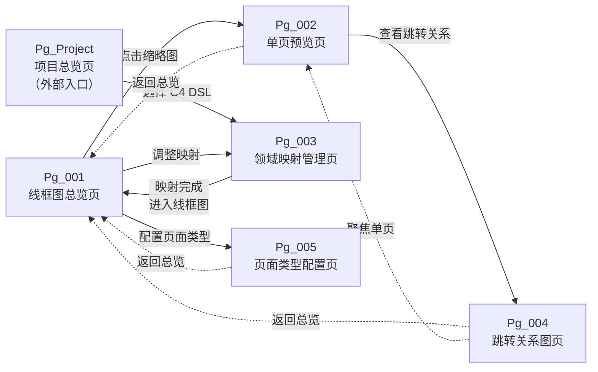
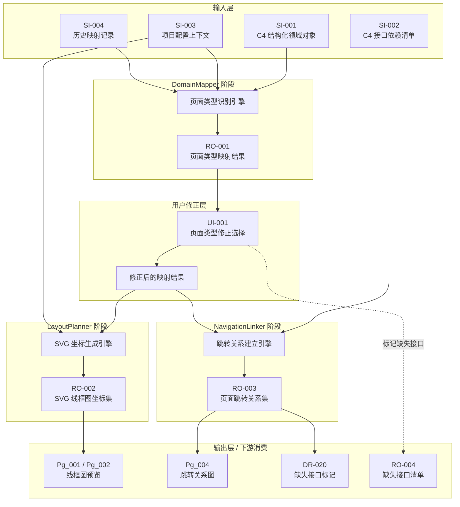
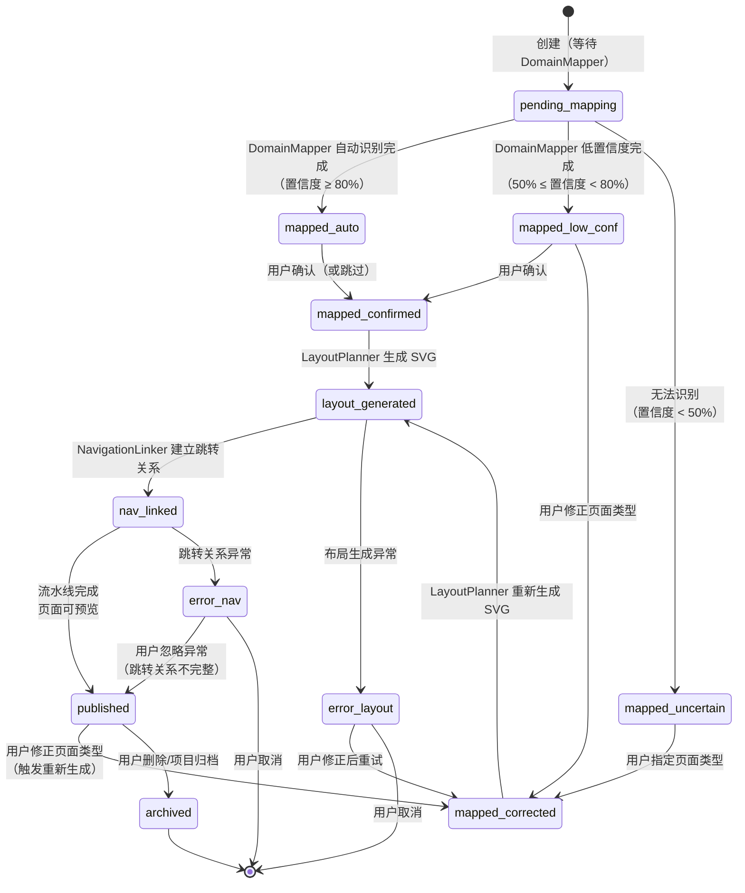
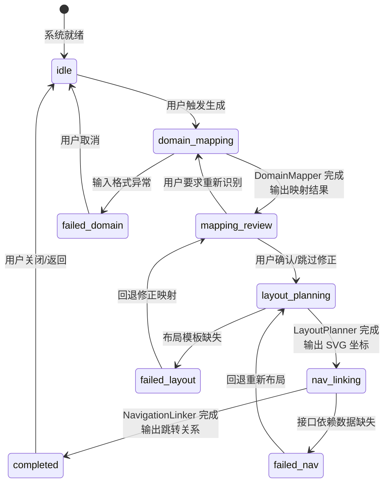
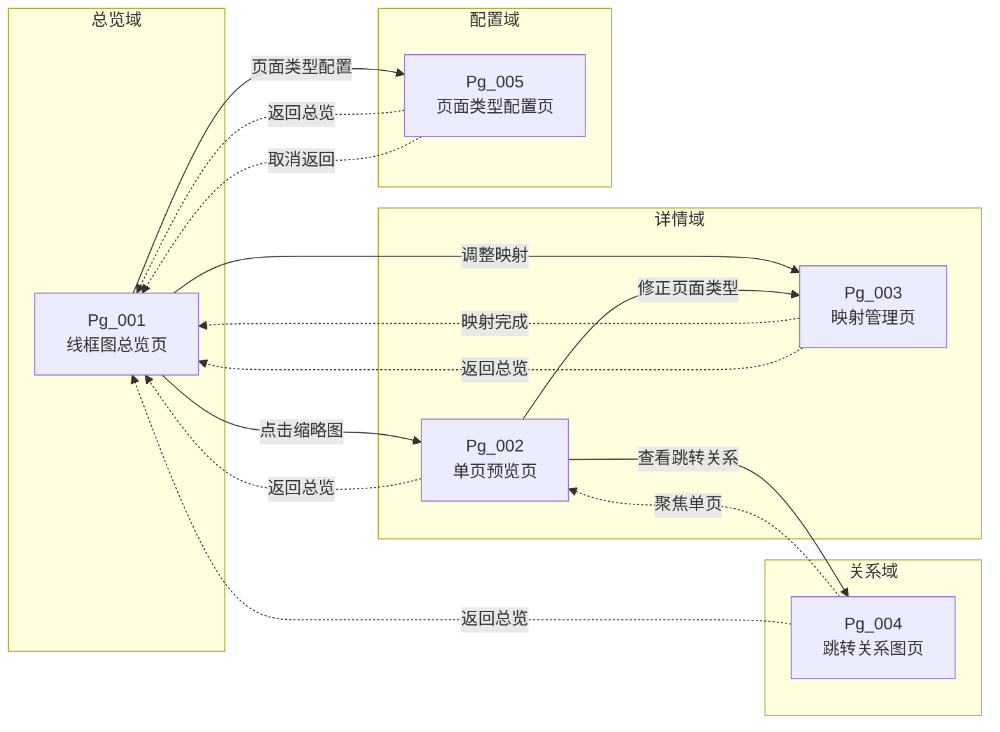

# DR-019 WireframeEngine — 模块级详细需求文档

> **模块编号**：DR-019
> **模块名称**：WireframeEngine
> **优先级**：P0
> **关联需求**：REQ-P0-030（DomainMapper 领域映射）、REQ-P0-031（LayoutPlanner 布局规划）、REQ-P0-032（原型-架构双向绑定）
> **关联用户故事**：US-016（查看 Wireframe 线框图）
> **编写日期**：2026-06-01
> **版本**：v1.0
> **状态**：Draft

---

## 1. 需求追溯与验收标准

### 1.1 需求追溯表

| 模块编号 | 关联需求 | 关联用户故事 | 关联 PRD 章节 |
|:--------:|:---------|:-------------|:--------------|
| DR-019 | REQ-P0-030 | US-016 | PRD §4.3（WireframeEngine 三 Agent 架构） |
| DR-019 | REQ-P0-031 | US-016 | PRD §4.3（页面类型与布局规划） |
| DR-019 | REQ-P0-032 | US-016 | PRD §4.3（原型-架构双向绑定） |

### 1.2 IN / OUT 清单

| 范围 | 说明 |
|:-----|:-----|
| **IN（模块内）** | DomainMapper：读取 C4 DSL 并识别领域实体对应的页面类型（7 种） |
| **IN（模块内）** | LayoutPlanner：为已识别的页面类型生成 SVG 线框图坐标与元素占位 |
| **IN（模块内）** | NavigationLinker：根据 C4 接口依赖关系建立页面间跳转链接 |
| **IN（模块内）** | 线框图预览与交互：支持缩放、平移、点击查看详情 |
| **IN（模块内）** | 映射修正：用户手动调整页面类型识别结果 |
| **OUT（模块外）** | C4 DSL 的解析与语义分析（由 C4 Model Parser 模块负责） |
| **OUT（模块外）** | SVG 渲染引擎的底层绘制实现（由渲染基础设施层负责） |
| **OUT（模块外）** | 接口契约的正向/逆向工程（由 DR-020 InterfaceSync 负责） |
| **OUT（模块外）** | 领域模型的版本管理与持久化（由 DomainModel Store 负责） |
| **OUT（模块外）** | 第三方设计工具（Figma / Sketch 等）的导入导出 |

### 1.3 验收标准（AC Taxonomy）

| # | 类型 | 标准描述 | 质量分 |
|:---:|------|----------|:------:|
| **AC-1** | **Behavioral** | Given 用户上传已解析的 C4 DSL 文件，When DomainMapper 执行领域映射，Then 系统输出每个领域实体对应的页面类型（列表/详情/仪表盘/表单/弹窗/搜索/向导之一），且输出包含置信度评分 | 3 |
| **AC-2** | **Behavioral** | Given DomainMapper 已完成领域映射，When LayoutPlanner 接收页面类型与领域属性，Then 系统生成对应页面类型的 SVG 线框图，包含标题区、内容区、操作区的标准占位布局 | 3 |
| **AC-3** | **Behavioral** | Given LayoutPlanner 已生成线框图，When NavigationLinker 分析 C4 接口依赖关系，Then 系统输出页面间跳转关系图，每个跳转标注关联的 C4 接口标识 | 3 |
| **AC-4** | **Non-behavioral** | Given 标准 C4 DSL 输入（< 500 个领域实体），When 三阶段流水线完整执行，Then 端到端生成耗时 < 5 秒 | 3 |
| **AC-5** | **Non-behavioral** | Given 标准测试数据集（含 50 个领域实体，覆盖 7 种页面类型），When DomainMapper 执行识别，Then 页面类型识别准确率 >= 80% | 3 |
| **AC-6** | **Non-behavioral** | Given 已生成的 SVG 线框图，When 在不同分辨率（1920×1080 / 1366×768 / 375×667）下预览，Then 线框图渲染无错位、无截断、无元素重叠 | 3 |
| **AC-7** | **Negative** | 系统明确不支持直接从线框图生成可运行的前端源代码（代码生成属于 DR-021 职责范围，不在本模块内） | 3 |
| **AC-8** | **Negative** | 系统明确不支持对非 C4 DSL 格式（如 PlantUML、ArchiMate）的领域模型进行自动映射 | 2 |
| **AC-9** | **Edge case** | Given C4 DSL 中存在未定义领域实体（如全新业务对象，无历史映射记录），When DomainMapper 执行识别，Then 系统将该实体标记为"待确认"类型，置信度置为 0%，并允许用户手动指定页面类型 | 3 |
| **AC-10** | **Edge case** | Given 用户手动修正页面类型后，When 重新触发 LayoutPlanner，Then 系统基于新类型重新生成线框图，原线框图的坐标与元素占位按新类型布局模式重建 | 3 |
| **AC-11** | **Edge case** | Given 两个页面之间存在多条 C4 接口依赖（如 A→B 同时存在查询和提交两种接口），When NavigationLinker 建立跳转关系，Then 系统在跳转边上标注接口数量，并提供展开查看详情的交互入口 | 2 |
| **AC-12** | **Dependency** | C4 DSL 解析结果必须符合 DR-018 C4ModelParser 输出的标准化领域对象结构（含 entity_type、attributes、relationships 字段） | 3 |
| **AC-13** | **Dependency** | 页面跳转关系数据格式必须与 DR-020 InterfaceSync 模块的输入契约兼容，支持一键回写缺失接口 | 3 |

### 1.4 假设注册表

| 假设 ID | 假设内容 | 影响范围 | 失效风险 |
|:-------:|---------|----------|----------|
| ASM-019-01 | C4 DSL 已通过上游 DR-018 完成语法解析与语义校验，输入为结构化领域对象而非原始文本 | DomainMapper 输入假设 | 若输入为未解析的原始 DSL，DomainMapper 无法直接消费，需降级调用 DR-018 接口 |
| ASM-019-02 | 用户具备基础的 C4 模型与领域驱动设计知识，能够理解"领域实体 → 页面类型"的映射逻辑 | 映射修正功能的可用性假设 | 若用户无相关背景知识，手动修正功能的使用门槛过高，需配套引导教程 |
| ASM-019-03 | 7 种页面类型（列表/详情/仪表盘/表单/弹窗/搜索/向导）可覆盖 MVP 阶段 90% 以上的独立开发者原型场景 | LayoutPlanner 布局模式假设 | 若出现高频但未覆盖的页面类型（如地图、日历、甘特图），需扩展页面类型枚举 |
| ASM-019-04 | 线框图生成以"快速示意"为目标，不追求像素级精确还原，允许 ±5% 的元素位置偏差 | SVG 渲染质量假设 | 若用户要求设计稿级精度，本模块的定位需重新评估 |


status: Draft
---

## 2. 原型与页面结构

### 2.1 页面清单

| 页面编号 | 页面名称 | 页面路径（示意） | 职责描述 | 所属 Agent |
|:--------:|:---------|:-----------------|:---------|:-----------|
| Pg_001 | 线框图总览页 | /wireframe/overview | 展示所有已生成线框图的缩略图网格，支持按领域实体筛选与搜索 | LayoutPlanner |
| Pg_002 | 单页线框图预览页 | /wireframe/preview/:pageId | 单页 SVG 线框图的交互式预览，支持缩放、平移、查看元素属性 | LayoutPlanner |
| Pg_003 | 领域映射管理页 | /wireframe/mapping | 展示 DomainMapper 的识别结果列表，支持逐条修正页面类型 | DomainMapper |
| Pg_004 | 页面跳转关系图页 | /wireframe/navigation | 以网络图形式展示页面间跳转关系，支持点击跳转边查看关联接口 | NavigationLinker |
| Pg_005 | 页面类型配置页 | /wireframe/config/types | 管理 7 种页面类型的布局参数（区域比例、最小尺寸、默认元素） | LayoutPlanner |

### 2.2 文字化布局结构

#### 页面 Pg_001：线框图总览页

```
┌─────────────────────────────────────────────────────────────┐
│  [顶部全局导航栏]                                              │
│  面包屑：项目 > SDLC Visualizer > WireframeEngine            │
├─────────────────────────────────────────────────────────────┤
│  [操作区]                                                    │
│  [重新生成线框图]按钮  │  [导出 SVG 包]按钮  │ 搜索框        │
├─────────────────────────────────────────────────────────────┤
│  [筛选栏]                                                    │
│  页面类型下拉：全部 / 列表 / 详情 / 仪表盘 / 表单 / 弹窗 / 搜索 / 向导  │
│  置信度滑块：0% - 100%                                       │
│  仅显示待确认：[开关]                                         │
├─────────────────────────────────────────────────────────────┤
│  [主内容区：缩略图网格]                                       │
│  ┌────────────┐ ┌────────────┐ ┌────────────┐              │
│  │ 页面名称    │ │ 页面名称    │ │ 页面名称    │              │
│  │ [SVG缩略图] │ │ [SVG缩略图] │ │ [SVG缩略图] │              │
│  │ 类型: 列表  │ │ 类型: 详情  │ │ 类型: 表单  │              │
│  │ 置信: 92%  │ │ 置信: 85%  │ │ 置信: 待确认│              │
│  └────────────┘ └────────────┘ └────────────┘              │
│                      ...（分页或虚拟滚动）                     │
├─────────────────────────────────────────────────────────────┤
│  [底部状态栏] 共 N 个页面 │ 生成时间：YYYY-MM-DD HH:mm:ss   │
└─────────────────────────────────────────────────────────────┘
```

#### 页面 Pg_002：单页线框图预览页

```
┌─────────────────────────────────────────────────────────────┐
│  [顶部工具栏]                                                │
│  [返回总览] │ 页面名称: XXXXX │ [放大] [缩小] [适应屏幕] [1:1] │
├─────────────────────────────────────────────────────────────┤
│  [左侧信息面板]            │  [右侧主预览区]                  │
│  ─────────────────         │                                 │
│  页面类型：列表             │    ┌─────────────────────┐      │
│  置信度：92%               │    │  [标题栏]            │      │
│  关联领域实体：User        │    │  [搜索/筛选栏]       │      │
│  ─────────────────         │    │  [数据表格占位]      │      │
│  关联 C4 接口（3）：       │    │  [分页控件]          │      │
│  • GET /api/users          │    │  [操作按钮区]        │      │
│  • POST /api/users         │    └─────────────────────┘      │
│  • DELETE /api/users/:id   │         （SVG 画布）              │
│  ─────────────────         │                                 │
│  [查看跳转关系]按钮         │                                 │
│  [修正页面类型]按钮         │                                 │
└─────────────────────────────────────────────────────────────┘
```

#### 页面 Pg_003：领域映射管理页

```
┌─────────────────────────────────────────────────────────────┐
│  [操作栏]                                                    │
│  [批量确认]按钮 │ [批量重试]按钮 │ 筛选：仅显示置信度<80% [开关]  │
├─────────────────────────────────────────────────────────────┤
│  [映射结果表格]                                              │
│  ┌──────────────┬────────────┬──────────┬──────────────────┐ │
│  │ 领域实体名称  │ 识别页面类型 │ 置信度   │ 操作             │ │
│  ├──────────────┼────────────┼──────────┼──────────────────┤ │
│  │ User         │ 列表       │ 92%      │ [修正] [详情]    │ │
│  │ UserProfile  │ 详情       │ 85%      │ [修正] [详情]    │ │
│  │ OrderStats   │ 仪表盘     │ 78%      │ [修正] [详情]    │ │
│  │ NewFeature   │ 待确认     │ --       │ [指定类型] [详情]│ │
│  └──────────────┴────────────┴──────────┴──────────────────┘ │
└─────────────────────────────────────────────────────────────┘
```

#### 页面 Pg_004：页面跳转关系图页

```
┌─────────────────────────────────────────────────────────────┐
│  [顶部工具栏]                                                │
│  [返回总览] │ 布局模式：[力导向图 / 层次布局 / 环形布局]      │
├─────────────────────────────────────────────────────────────┤
│  [主内容区：网络关系图]                                       │
│                                                             │
│           ┌─────────┐                                       │
│           │ 用户列表 │────┐                                  │
│           └─────────┘    │(查询/创建)                         │
│                   ▲      ▼                                  │
│              (返回)  ┌─────────┐                             │
│                      │ 用户详情 │────┐                        │
│                      └─────────┘    │(编辑)                    │
│                              ▲      ▼                        │
│                         (保存/取消) ┌─────────┐               │
│                                     │ 编辑表单 │               │
│                                     └─────────┘               │
│                                                             │
├─────────────────────────────────────────────────────────────┤
│  [底部图例] 实线=强关联 │ 虚线=弱关联 │ 颜色=页面类型            │
└─────────────────────────────────────────────────────────────┘
```

#### 页面 Pg_005：页面类型配置页

```
┌─────────────────────────────────────────────────────────────┐
│  [操作栏] [恢复默认值]按钮 │ [保存配置]按钮                    │
├─────────────────────────────────────────────────────────────┤
│  [左侧页面类型列表]          │ [右侧配置面板]                   │
│  ─────────────────           │  当前：列表（List）              │
│  ○ 列表（List）              │  ─────────────────               │
│  ○ 详情（Detail）            │  区域比例：                      │
│  ○ 仪表盘（Dashboard）       │  标题区：10%                     │
│  ○ 表单（Form）              │  内容区：75%                     │
│  ○ 弹窗（Modal）             │  操作区：15%                     │
│  ○ 搜索（Search）            │  ─────────────────               │
│  ○ 向导（Wizard）            │  默认元素：                      │
│                              │  [+] 数据表格                    │
│                              │  [+] 分页器                      │
│                              │  [+] 批量操作栏                  │
│                              │  ─────────────────               │
│                              │  最小画布尺寸：320 × 480         │
└─────────────────────────────────────────────────────────────┘
```

### 2.3 关键交互流程

**流程 F-001：完整线框图生成（三阶段流水线）**

1. 用户在项目视图中选择已解析的 C4 DSL 文件
2. 系统触发 **DomainMapper**：逐领域实体识别页面类型，输出映射结果（含置信度）
3. 用户可选择进入 Pg_003 修正映射结果，或直接继续
4. 系统触发 **LayoutPlanner**：基于确认的页面类型，逐页生成 SVG 线框图坐标
5. 系统触发 **NavigationLinker**：分析 C4 接口依赖，建立页面间跳转关系
6. 用户进入 Pg_001 查看总览，点击任意缩略图进入 Pg_002 单页预览

**流程 F-002：手动修正映射结果**

1. 用户在 Pg_003 中发现某领域实体（如 NewFeature）被标记为"待确认"
2. 用户点击该行的"指定类型"按钮，弹出选择器
3. 用户在 7 种页面类型中手动选择一种（如"表单"）
4. 系统更新该实体的映射记录，置信度标记为"人工指定"
5. 系统提示用户是否需要基于新类型重新生成线框图

**流程 F-003：查看页面跳转关系**

1. 用户在 Pg_002 单页预览中点击"查看跳转关系"按钮
2. 系统自动跳转至 Pg_004，并以当前页面为中心节点渲染关系图
3. 用户点击某条跳转边，右侧弹出面板展示关联的 C4 接口列表
4. 用户可标记某接口为"缺失接口"，数据传递至 DR-020 处理

### 2.4 Mermaid 页面跳转图



---

## 3. 输入输出字段

### 3.1 字段总表

#### 用户输入字段

| 字段 ID | 字段名称 | 字段类型 | 是否必填 | 约束条件 | 所属页面 |
|:-------:|:---------|:---------|:--------:|:---------|:---------|
| UI-001 | 页面类型修正选择 | 枚举 | 条件必填 | 7 种之一；仅当置信度 < 阈值或用户主动修正时触发 | Pg_003 |
| UI-002 | 置信度筛选阈值 | 整数 | 否 | 范围 0–100，默认 0 | Pg_001 |
| UI-003 | 仅显示待确认 | 布尔 | 否 | 默认 false | Pg_001 / Pg_003 |
| UI-004 | 页面类型筛选 | 枚举 | 否 | 全部 / 列表 / 详情 / 仪表盘 / 表单 / 弹窗 / 搜索 / 向导 | Pg_001 |
| UI-005 | 布局模式选择 | 枚举 | 否 | 力导向图 / 层次布局 / 环形布局 | Pg_004 |
| UI-006 | 页面类型配置参数 | 复合对象 | 否 | 区域比例之和 = 100%，最小尺寸 ≥ 200×300 | Pg_005 |
| UI-007 | 缺失接口标记 | 布尔 | 否 | 仅针对 NavigationLinker 识别出的未匹配接口 | Pg_004 |
| UI-008 | 搜索关键词 | 字符串 | 否 | 长度 ≤ 50，支持模糊匹配领域实体名称 | Pg_001 |

#### 系统输入字段

| 字段 ID | 字段名称 | 来源模块 | 说明 |
|:-------:|:---------|:---------|:-----|
| SI-001 | C4 结构化领域对象 | DR-018 C4ModelParser | 含 entity_id、entity_name、entity_type、attributes[]、relationships[] |
| SI-002 | C4 接口依赖清单 | DR-018 C4ModelParser | 含 interface_id、source_entity、target_entity、method_type、endpoint_path |
| SI-003 | 项目配置上下文 | 全局配置 | 当前项目的画布默认尺寸、主题配色方案 |
| SI-004 | 历史映射记录 | 本地存储 | 该用户/项目下过往的 DomainMapper 修正记录，用于辅助识别 |

#### 页面回显字段

| 字段 ID | 字段名称 | 字段类型 | 说明 | 所属页面 |
|:-------:|:---------|:---------|:-----|:---------|
| RE-001 | 页面缩略图列表 | 复合数组 | 每项含 page_id、entity_name、page_type、confidence、thumbnail_svg、生成时间戳 | Pg_001 |
| RE-002 | 单页 SVG 线框图 | SVG 文档 | 包含所有布局元素（标题区、内容区、操作区占位）的矢量图形 | Pg_002 |
| RE-003 | 映射结果列表 | 复合数组 | 每项含 entity_id、entity_name、inferred_type、confidence、status（自动/人工/待确认） | Pg_003 |
| RE-004 | 页面跳转关系图数据 | 复合对象 | 含 nodes[]（页面节点）、edges[]（跳转边，含接口列表）、layout_config | Pg_004 |
| RE-005 | 页面类型配置当前值 | 复合对象 | 当前选中的页面类型的完整配置参数 | Pg_005 |
| RE-006 | 关联 C4 接口列表 | 复合数组 | 当前页面关联的所有接口，含接口标识、方法类型、路径 | Pg_002 |
| RE-007 | 页面统计信息 | 复合对象 | 总页数、各类型页数分布、平均置信度、待确认数量 | Pg_001 |

#### 接口响应字段（模块间数据传递）

| 字段 ID | 字段名称 | 目标模块 | 说明 |
|:-------:|:---------|:---------|:-----|
| RO-001 | 页面类型映射结果 | LayoutPlanner | 含 entity_id → page_type 的映射字典，以及人工修正标记 |
| RO-002 | SVG 线框图坐标集 | 渲染层 | 含每个页面元素的 x、y、width、height、element_type、label |
| RO-003 | 页面跳转关系集 | DR-020 InterfaceSync | 含 source_page、target_page、interface_refs[]、relation_strength |
| RO-004 | 缺失接口标记清单 | DR-020 InterfaceSync | 用户标记为"缺失"的接口列表，用于触发 C4 DSL 回写 |

### 3.2 数据流转图



---

## 4. 业务逻辑与状态机

### 4.1 核心业务流程

#### 流程 B-001：DomainMapper 领域映射

**目标**：将 C4 DSL 中的领域实体映射为 7 种页面类型之一。

**触发条件**：用户选择 C4 DSL 文件并发起"生成线框图"指令。

**步骤**：

1. **输入校验**：检查 C4 结构化领域对象是否包含必需的 entity_type 与 attributes 字段；若缺失，流程终止并返回错误。
2. **规则匹配**：基于领域实体的 entity_type（如 AggregateRoot、Entity、ValueObject）与 attributes 特征（如是否含 status 字段、是否含 created_at 字段）匹配预设规则库。
3. **模式识别**：针对属性组合进行模式评分——例如，含大量查询字段 + 分页属性 → 列表；含嵌套对象 + 详情展示属性 → 详情；含仪表盘特有指标字段 → 仪表盘。
4. **置信度计算**：综合规则匹配度与历史修正记录，输出 0%–100% 的置信度评分。
5. **阈值判定**：置信度 ≥ 80% 标记为"自动识别"；< 80% 且 ≥ 50% 标记为"低置信度"；< 50% 标记为"待确认"。
6. **结果输出**：生成映射结果表，等待用户确认或修正。

#### 流程 B-002：LayoutPlanner 布局规划

**目标**：为已确认的页面类型生成标准 SVG 线框图坐标。

**触发条件**：DomainMapper 映射完成且用户确认（或跳过修正）。

**步骤**：

1. **类型读取**：逐条读取映射结果中的 page_type。
2. **布局模板匹配**：根据 page_type 选择对应的布局模板（含标题区/内容区/操作区的默认比例与元素清单）。
3. **坐标计算**：在标准化画布（默认 800×600）内，按模板比例计算各区域的 x、y、width、height。
4. **元素占位生成**：在内容区内按页面类型生成标准占位元素（如列表页生成"表头 + 数据行×5 + 分页器"占位）。
5. **自适应调整**：若领域实体属性数量超出模板默认容量，扩展内容区高度并重新分布元素间距。
6. **SVG 输出**：输出完整的 SVG 坐标集，包含所有矩形、文本、线条的坐标与样式占位。

#### 流程 B-003：NavigationLinker 跳转关系建立

**目标**：基于 C4 接口依赖建立页面间跳转关系。

**触发条件**：LayoutPlanner 完成线框图生成后自动触发。

**步骤**：

1. **接口读取**：读取 C4 接口依赖清单，按 source_entity 与 target_entity 分组。
2. **页面匹配**：将 source_entity 与 target_entity 映射到已生成的页面列表（通过 entity_id 关联）。
3. **关系建立**：为每对接口源-目标建立有向跳转边，边上标注接口 method_type 与 endpoint_path。
4. **关系强度判定**：单接口 → 弱关联（虚线）；多接口或含写操作 → 强关联（实线）。
5. **孤立页面检测**：识别无入边也无出边的页面，标记为"孤立页面"并提示用户检查。
6. **结果输出**：生成页面跳转关系集，支持在 Pg_004 中渲染网络图。

### 4.2 业务规则映射

| 规则编号 | 规则名称 | 规则描述 | 适用阶段 |
|:--------:|:---------|:---------|:---------|
| BR-019-01 | 聚合根默认列表页 | 若领域实体的 entity_type 为 AggregateRoot 且 attributes 中含可排序/可筛选字段（如 name、status、created_at），则默认识别为"列表"类型 | DomainMapper |
| BR-019-02 | 单值对象默认详情页 | 若领域实体的 entity_type 为 Entity（非聚合根）且 attributes 以展示型字段为主（如 description、detail、metadata），则默认识别为"详情"类型 | DomainMapper |
| BR-019-03 | 含统计指标默认仪表盘 | 若 attributes 中包含数值聚合字段（如 count、total、avg、percentage、chart_data），则默认识别为"仪表盘"类型 | DomainMapper |
| BR-019-04 | 含提交操作默认表单 | 若领域实体关联的 C4 接口中包含 POST/PUT/PATCH 写操作且 attributes 以输入型字段为主，则默认识别为"表单"类型 | DomainMapper |
| BR-019-05 | 向导页触发条件 | 若一个业务流程涉及 3 个及以上有顺序依赖的领域实体（如注册流程：账户 → 个人信息 → 确认），则整体识别为"向导"类型 | DomainMapper |
| BR-019-06 | 弹窗页触发条件 | 若领域实体在 C4 模型中被标记为 Secondary / Supporting 且仅含少量操作按钮（≤3 个）和简述文本，则识别为"弹窗"类型 | DomainMapper |
| BR-019-07 | 搜索页触发条件 | 若领域实体 attributes 以查询条件字段为主（如 keyword、filter、range、category）且关联的 C4 接口以 GET 查询为主，则识别为"搜索"类型 | DomainMapper |
| BR-019-08 | 布局区域比例约束 | 任意页面类型的标题区 + 内容区 + 操作区比例之和必须等于 100%，单个区域占比不得低于 5% | LayoutPlanner |
| BR-019-09 | 最小画布尺寸约束 | 生成的 SVG 画布宽 ≥ 320px，高 ≥ 480px；若内容超出，按等比例缩放而非裁剪 | LayoutPlanner |
| BR-019-10 | 人工修正优先原则 | 用户手动修正的页面类型在后续所有阶段（LayoutPlanner、NavigationLinker）中优先于自动识别结果 | 全局 |
| BR-019-11 | 孤立页面告警 | 若某页面在 NavigationLinker 输出中既无入边也无出边，系统必须在前端展示警告提示，建议用户检查领域模型完整性 | NavigationLinker |
| BR-019-12 | 双向绑定一致性 | 当用户在 Pg_002 中标记某接口为"缺失接口"时，该标记必须同步反映到 C4 DSL 的待办清单（通过 DR-020），且线框图中的关联边样式变为虚线 + 警告色 | NavigationLinker |

### 4.3 状态机

#### 4.3.1 单页线框图生命周期状态机



#### 4.3.2 三阶段流水线执行状态机



### 4.4 异常处理

| 异常编号 | 异常场景 | 触发阶段 | 系统行为 | 用户感知 |
|:--------:|:---------|:---------|:---------|:---------|
| EX-019-01 | C4 结构化对象缺失必需字段（如 entity_type） | DomainMapper | 流水线终止，返回错误码与缺失字段名 | 页面提示"输入数据格式异常：缺少 entity_type 字段，请检查 C4 DSL 解析结果" |
| EX-019-02 | 所有领域实体的识别置信度均 < 50% | DomainMapper | 流水线暂停，全部标记为"待确认" | 页面提示"自动识别置信度不足，请逐条确认页面类型"，并自动跳转到 Pg_003 |
| EX-019-03 | 页面类型配置文件中某类型的布局模板缺失 | LayoutPlanner | 该类型页面使用默认通用模板（标题 10% / 内容 80% / 操作 10%），记录警告日志 | 该类型页面线框图使用通用布局，页面角落显示"⚠ 使用默认模板"提示 |
| EX-019-04 | 领域实体属性数量超出模板最大容量（> 100 个属性） | LayoutPlanner | 内容区高度自动扩展，超出画布部分启用内部滚动示意，不截断元素 | 线框图内容区显示"…等 N 个属性"示意文本 |
| EX-019-05 | C4 接口依赖清单中引用了不存在的领域实体 | NavigationLinker | 跳过该接口的跳转关系建立，将该接口归入"未匹配接口"清单 | Pg_004 侧边栏显示"未匹配接口"区域，用户可手动关联或标记为缺失 |
| EX-019-06 | NavigationLinker 检测到循环跳转（A→B→C→A） | NavigationLinker | 保留循环关系并在跳转边上标注循环标记（箭头旁显示"↺"） | 关系图中循环路径使用特殊颜色高亮，hover 时提示"检测到循环跳转" |
| EX-019-07 | 用户在网络中断时提交页面类型修正 | 用户修正层 | 本地暂存修正操作，网络恢复后自动重试；若 3 次重试失败，提示用户手动保存 | 按钮显示"网络异常，已本地暂存"，网络恢复后自动同步 |
| EX-019-08 | 页面类型配置参数校验失败（区域比例之和不等于 100%） | Pg_005 | 阻止保存，高亮错误字段 | 输入框下方显示红色提示"区域比例之和必须等于 100%，当前为 X%" |

---

## 5. 交互规格

### 5.1 页面：Pg_001 线框图总览页

#### 元素：重新生成线框图按钮（#btn-regenerate）

| 属性 | 说明 |
|:-----|:-----|
| **触发方式** | click |
| **前置条件** | 当前项目已关联 C4 DSL 文件，且当前无正在执行的生成任务 |
| **立即反馈** | 按钮置灰禁用，显示 loading spinner + 文案"生成中…" |
| **成功结果** | 三阶段流水线完成后，缩略图网格刷新为最新线框图，底部状态栏更新时间戳 |
| **失败结果** | 按钮恢复可点击，页面顶部显示红色 toast"生成失败：{错误详情}"，提供"查看详情"链接 |
| **异常分支** | 网络中断 → 显示"网络异常，已中断生成"+"重试"按钮；生成超时（> 30s）→ 提示"生成耗时过长，请检查输入数据规模或稍后重试" |
| **埋点事件** | `wireframe_regenerate_click`，携带参数：{project_id, c4_dsl_version, timestamp} |

#### 元素：导出 SVG 包按钮（#btn-export-svg）

| 属性 | 说明 |
|:-----|:-----|
| **触发方式** | click |
| **前置条件** | 当前项目至少存在 1 个已生成的线框图 |
| **立即反馈** | 按钮置灰禁用，显示"打包中…" |
| **成功结果** | 浏览器触发下载，文件名为 `{project_name}_wireframes_YYYYMMDD.zip`，内含所有 SVG 文件 + 跳转关系 JSON |
| **失败结果** | 按钮恢复可点击，提示"导出失败：无可用线框图"或"浏览器下载被阻止，请检查弹窗权限" |
| **异常分支** | 无异常分支（纯本地导出，不依赖网络） |
| **埋点事件** | `wireframe_export_svg`，携带参数：{project_id, page_count, timestamp} |

#### 元素：缩略图卡片（.thumbnail-card）

| 属性 | 说明 |
|:-----|:-----|
| **触发方式** | click（进入预览）、hover（显示操作浮层） |
| **前置条件** | 该卡片对应的线框图已生成完成 |
| **立即反馈** | hover 时卡片阴影加深，右上角浮出"预览""修正类型"两个快捷按钮 |
| **成功结果** | click → 跳转至 Pg_002 单页预览页；点击"修正类型"→ 弹出快速修正弹窗 |
| **失败结果** | 无 |
| **异常分支** | 卡片对应的 SVG 尚未生成（状态为 pending）→ 显示灰色占位图，hover 提示"生成中，请稍候"，click 无效 |
| **埋点事件** | `wireframe_thumbnail_click`，携带参数：{page_id, page_type, source: 'overview_grid'} |

#### 元素：置信度筛选滑块（#slider-confidence）

| 属性 | 说明 |
|:-----|:-----|
| **触发方式** | drag / change（释放滑块时触发筛选） |
| **前置条件** | 当前存在 ≥1 个线框图 |
| **立即反馈** | 滑块拖动过程中实时显示当前阈值数值；释放后网格立即过滤，仅显示置信度 ≥ 阈值的卡片 |
| **成功结果** | 网格刷新，显示符合条件的线框图，底部状态栏更新"显示 N / M 个" |
| **失败结果** | 无符合条件的线框图 → 网格区域显示空状态插画"没有符合条件的线框图"+"重置筛选"按钮 |
| **异常分支** | 无 |
| **埋点事件** | `wireframe_filter_confidence`，携带参数：{threshold, result_count, timestamp} |

---

### 5.2 页面：Pg_002 单页线框图预览页

#### 元素：SVG 画布交互区（#svg-canvas）

| 属性 | 说明 |
|:-----|:-----|
| **触发方式** | click（选择元素）、wheel（缩放）、drag（平移）、dblclick（聚焦元素） |
| **前置条件** | SVG 线框图已成功加载 |
| **立即反馈** | wheel → 画布按鼠标位置为中心缩放，右上角显示当前缩放比例（如"125%"）；drag → 画布跟随光标平移，光标变为 grab/grabbing；click 元素 → 元素边框高亮（蓝色），左侧信息面板更新为该元素属性 |
| **成功结果** | 用户可自由浏览线框图全部内容；点击元素后可在左侧查看其布局属性（x, y, w, h, element_type） |
| **失败结果** | SVG 加载失败 → 画布区域显示"线框图加载失败"+"重新加载"按钮 |
| **异常分支** | 缩放到 < 25% 或 > 400% 时停止缩放并反弹至边界值；平移至画布边缘时停止平移 |
| **埋点事件** | `wireframe_canvas_interact`，携带参数：{page_id, action_type: 'zoom'/'pan'/'select', zoom_level, timestamp} |

#### 元素：查看跳转关系按钮（#btn-view-nav）

| 属性 | 说明 |
|:-----|:-----|
| **触发方式** | click |
| **前置条件** | NavigationLinker 已完成，且当前页面至少存在 1 条跳转关系 |
| **立即反馈** | 按钮置灰，显示"加载中…" |
| **成功结果** | 跳转至 Pg_004，并以当前页面为中心节点自动聚焦 |
| **失败结果** | 当前页面无跳转关系 → 按钮本身置灰不可点击，hover 提示"该页面暂无跳转关系" |
| **异常分支** | NavigationLinker 未完成或失败 → 提示"跳转关系数据尚未就绪，请等待生成完成" |
| **埋点事件** | `wireframe_view_navigation`，携带参数：{page_id, has_relations: true/false, timestamp} |

#### 元素：修正页面类型按钮（#btn-correct-type）

| 属性 | 说明 |
|:-----|:-----|
| **触发方式** | click |
| **前置条件** | 当前线框图状态为 published |
| **立即反馈** | 弹出修正弹窗，内含 7 种页面类型的单选列表，当前类型默认选中 |
| **成功结果** | 用户选择新类型并确认后，弹窗关闭，页面显示"正在重新生成…"，完成后线框图刷新为新布局；Pg_001 中对应缩略图同步更新 |
| **失败结果** | 用户点击取消 → 弹窗关闭，无变更 |
| **异常分支** | 重新生成过程中网络中断 → 弹窗保持打开，显示"保存失败，请检查网络"+"重试"按钮 |
| **埋点事件** | `wireframe_type_correct`，携带参数：{page_id, old_type, new_type, timestamp} |

---

### 5.3 页面：Pg_003 领域映射管理页

#### 元素：指定类型按钮（#btn-assign-type）

| 属性 | 说明 |
|:-----|:-----|
| **触发方式** | click |
| **前置条件** | 当前行状态为"待确认"或用户主动点击已有类型的"修正" |
| **立即反馈** | 行内展开下拉选择器（7 种页面类型），无需弹窗 |
| **成功结果** | 用户选择类型后，该行即时更新：inferred_type 更新为新类型，confidence 显示"人工指定"，状态变为"已修正" |
| **失败结果** | 用户未选择直接点击外部 → 选择器收起，无变更 |
| **异常分支** | 用户批量修正时某行保存失败 → 仅该行显示红色错误图标，其他行正常保存；提供"重试"按钮 |
| **埋点事件** | `mapping_type_assign`，携带参数：{entity_id, assigned_type, is_manual: true, timestamp} |

#### 元素：批量确认按钮（#btn-batch-confirm）

| 属性 | 说明 |
|:-----|:-----|
| **触发方式** | click |
| **前置条件** | 当前表格中至少存在 1 行处于"自动识别"或"低置信度"状态，且用户已勾选 ≥1 行 |
| **立即反馈** | 按钮置灰，显示"确认中…"；已勾选行显示进度指示 |
| **成功结果** | 勾选行的状态全部更新为"已确认"，Pg_001 中对应缩略图标记更新 |
| **失败结果** | 未勾选任何行 → 点击无效，按钮 shake 动画提示 |
| **异常分支** | 部分行确认失败 → 成功行标记为"已确认"，失败行保持原状态并显示错误提示；顶部汇总提示"N 条确认成功，M 条失败" |
| **埋点事件** | `mapping_batch_confirm`，携带参数：{entity_ids[], confirmed_count, timestamp} |

---

### 5.4 页面：Pg_004 页面跳转关系图页

#### 元素：布局模式切换器（#layout-mode-toggle）

| 属性 | 说明 |
|:-----|:-----|
| **触发方式** | click（选项卡切换） |
| **前置条件** | 页面跳转关系图数据已加载，节点数量 ≥ 2 |
| **立即反馈** | 点击后立即显示 loading 遮罩，关系图按新布局模式重新计算坐标并过渡动画（500ms） |
| **成功结果** | 关系图以新布局渲染，节点位置平滑过渡；当前布局模式选项卡高亮 |
| **失败结果** | 仅 1 个节点时，所有布局模式选项置灰，hover 提示"仅 1 个页面，无需切换布局" |
| **异常分支** | 布局计算超时（> 3s）→ 显示"布局计算中…"，超时后降级为简单网格布局 |
| **埋点事件** | `nav_layout_change`，携带参数：{old_mode, new_mode, node_count, timestamp} |

#### 元素：跳转边（.nav-edge）

| 属性 | 说明 |
|:-----|:-----|
| **触发方式** | click / hover |
| **前置条件** | 边对应的接口数据已加载 |
| **立即反馈** | hover → 边加粗高亮，显示 tooltip"N 个关联接口"；click → 右侧滑出详情面板，列出所有关联接口 |
| **成功结果** | 详情面板展示接口列表，每项显示 method_type、endpoint_path、描述；用户可点击"标记为缺失" |
| **失败结果** | 无 |
| **异常分支** | 接口数据加载失败 → 边仍显示，click 后详情面板显示"接口数据加载失败"+"重试" |
| **埋点事件** | `nav_edge_click`，携带参数：{source_page, target_page, interface_count, timestamp} |

#### 元素：标记缺失接口按钮（#btn-mark-missing，位于边详情面板内）

| 属性 | 说明 |
|:-----|:-----|
| **触发方式** | click |
| **前置条件** | 用户在边详情面板中选择了至少 1 个接口 |
| **立即反馈** | 按钮置灰，显示"标记中…" |
| **成功结果** | 接口状态更新为"缺失"，边的样式变为虚线 + 橙黄色；Pg_002 中对应关联 C4 接口列表同步更新标记；数据传递至 DR-020 |
| **失败结果** | 未选择接口时按钮置灰不可点击 |
| **异常分支** | 网络中断 → 提示"标记失败，请检查网络"+"重试"；权限不足 → 提示"无权限标记接口，请联系项目管理员" |
| **埋点事件** | `interface_mark_missing`，携带参数：{interface_id, page_id, timestamp} |

---

### 5.5 页面：Pg_005 页面类型配置页

#### 元素：保存配置按钮（#btn-save-config）

| 属性 | 说明 |
|:-----|:-----|
| **触发方式** | click |
| **前置条件** | 当前配置参数通过校验（区域比例之和 = 100%，最小尺寸 ≥ 200×300） |
| **立即反馈** | 按钮置灰，显示"保存中…" |
| **成功结果** | 配置保存成功，页面顶部显示绿色 toast"配置已保存"；若存在已生成的线框图，提示"是否基于新配置重新生成所有线框图？"（确认则触发重新生成） |
| **失败结果** | 校验未通过 → 按钮 shake 动画，未通过项高亮红色，不触发保存 |
| **异常分支** | 保存成功但重新生成失败 → 配置仍已保存，单独提示"配置已保存，但线框图重新生成失败，请稍后手动触发" |
| **埋点事件** | `type_config_save`，携带参数：{page_type, config_hash, trigger_regenerate: true/false, timestamp} |

#### 元素：恢复默认值按钮（#btn-reset-default）

| 属性 | 说明 |
|:-----|:-----|
| **触发方式** | click |
| **前置条件** | 当前配置相对于默认值存在至少 1 项差异 |
| **立即反馈** | 弹出二次确认弹窗"确定恢复为默认配置？当前自定义配置将丢失。" |
| **成功结果** | 用户确认后，配置面板所有字段重置为系统默认值，未保存（需点击保存才持久化） |
| **失败结果** | 用户取消 → 弹窗关闭，配置不变 |
| **异常分支** | 无 |
| **埋点事件** | `type_config_reset`，携带参数：{page_type, timestamp} |

---

### 5.6 页面间跳转关系图



---

> **文档结束标记**
>
> 本文档由 `detailed-requirements` Skill 依据 PRD 概要需求生成，覆盖 DR-019 WireframeEngine 模块的完整模块级规格。
>
> 下游消费方：
> - `detailed-design`：模块级技术设计输入
> - `task-breakdown`：任务拆解输入
> - `interface-first-dev`：接口契约前置参考
>
> 待 Gate 2.5 人工逐页确认后冻结交互规格。
