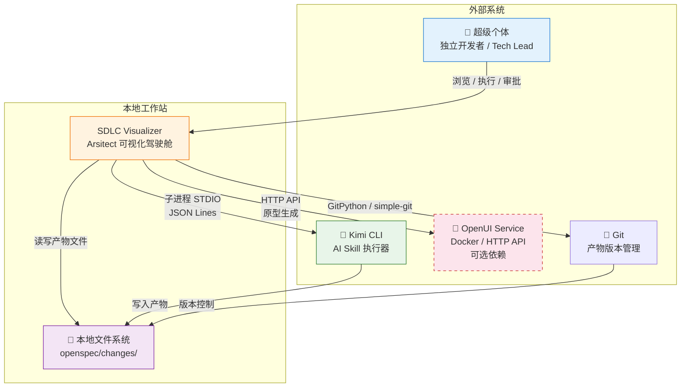
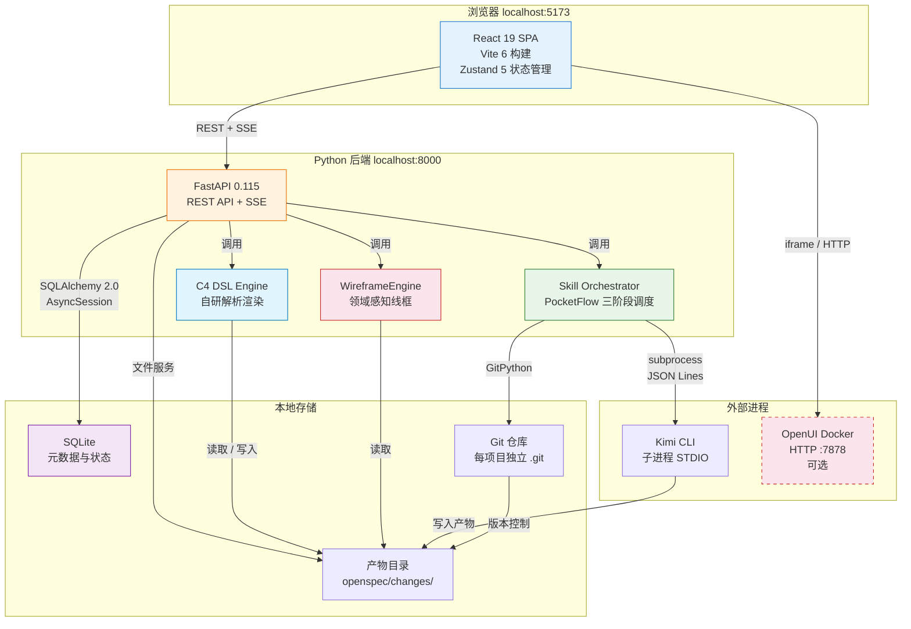
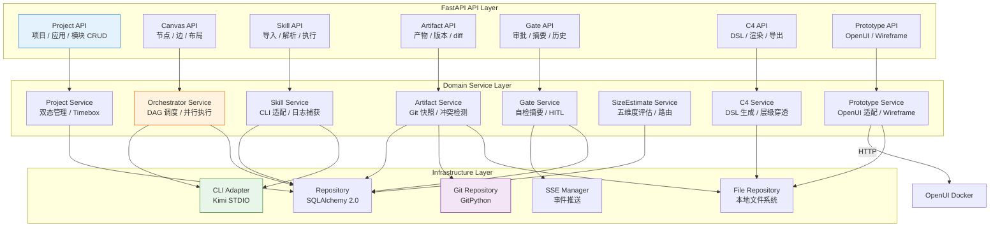
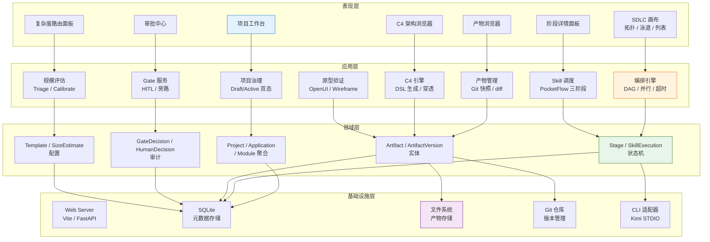
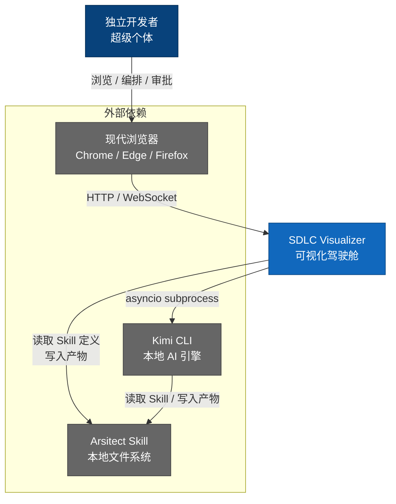
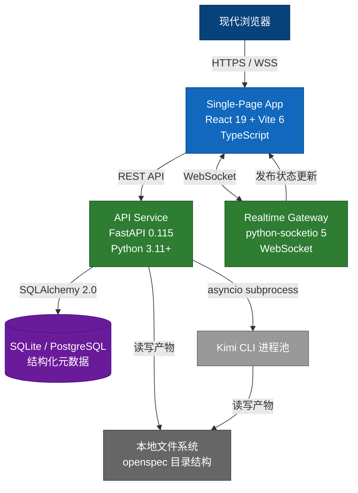
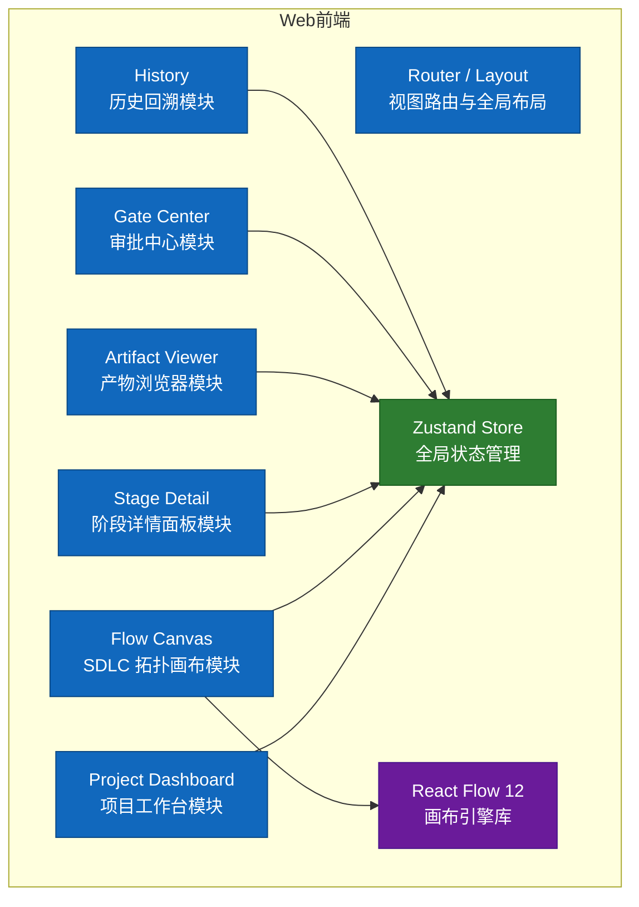
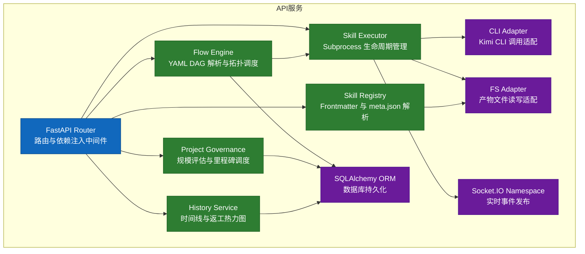
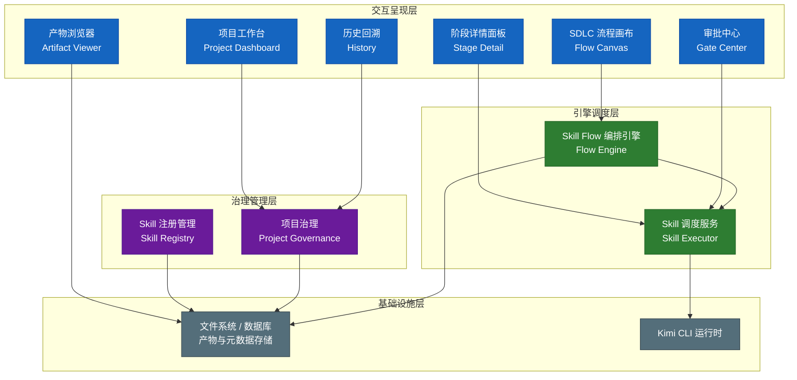

# 架构核心

> 版本：HLD-001 v1.0
> 状态：Draft
> 变更：sdlc-visualizer

---

## 1. 系统架构

### 1.1 C4 Model — Context 图



### 1.2 C4 Model — Container 图



### 1.3 C4 Model — Component 图（后端核心）



### 1.4 业务功能架构图



---

## 2. 技术栈

### 2.1 选型清单

| 类别 | 选型 | 版本约束 | 选型理由 | 竞品溯源 |
|------|------|----------|----------|----------|
| 前端框架 | React | ^19.0 | Concurrent features、React Flow 原生绑定、团队熟悉 | Dify/CrewAI 生态均用 React (T1) |
| 构建工具 | Vite | ^6.0 | 冷启动快、HMR 极致、无 SSR 负担 | 本地工具首选 (T1) |
| 状态管理 | Zustand | ^5.0 | 无样板代码、持久化中间件、React 19 兼容 | Dify 用 Redux，但单机工具 Redux 过度工程 (T2) |
| 画布引擎 | React Flow | ^12.0 | 竞品验证的拓扑图标准、布局引擎、子流程 | n8n/Coze 均使用 (T1) |
| 后端框架 | FastAPI | ^0.115 | Python async 原生、自动 OpenAPI、Pydantic 2 集成 | DevAll 采用 (T1) |
| ORM | SQLAlchemy | ^2.0 | 声明式模型、AsyncSession、类型安全 | 与 FastAPI 无缝衔接 (T2) |
| 数据库 | SQLite | 3.39+ | 零运维、嵌入式、MVP 数据量极小 | CrewAI/LangGraph 轻量场景 (T1) |
| 前端 Git | simple-git | ^3.0 | Promise API、轻量、Node.js 原生 | 前端展示层 diff 操作 (T3) |
| 后端 Git | GitPython | ^3.1 | 完整 Git 操作、Python 生态成熟 | ChatDev 采用 (T1) |
| CLI 集成 | subprocess + asyncio | 标准库 | 最直接可靠、JSON Lines 解析 | ChatDev/OpenHands 类似 (T1) |
| SSE 推送 | FastAPI SSE | 原生 | 单向流式推送、自动重连、HTTP 兼容 | Dify 用 WebSocket，但 SSE 更适合单向日志 (T2) |
| Markdown 渲染 | react-markdown + remark | ^9.0 | 生态成熟、Mermaid 插件支持 | 标准方案 (T3) |
| C4 渲染 | Mermaid.js + 自研 DSL 解析 | ^10.0 | 浏览器原生渲染、无需后端服务 | 自研决策 (问题 2-A) |
| OpenUI 集成 | HTTP Client (fetch/axios) | — | Docker HTTP API 调用 | 外部依赖 (T1) |

### 2.2 选型矩阵（关键争议项）

#### 矩阵 A：前端框架 — React 19 vs Next.js 14

| 维度 | React 19 + Vite 6 | Next.js 14 | 决策 |
|------|-------------------|-----------|------|
| 启动速度 | 极快（< 300ms） | 中等（需 SSR 编译） | React 19 ✅ |
| 本地工具适配 | 完美（纯 SPA） | SSR 对本地单机无意义 | React 19 ✅ |
| 生态兼容 | React Flow 原生 | 需适配 | React 19 ✅ |
| 路由复杂度 | 简单（react-router） | 文件系统路由 | React 19 ✅ |
| 团队熟悉度 | 高 | 中 | React 19 ✅ |

#### 矩阵 B：数据库 — SQLite vs PostgreSQL

| 维度 | SQLite (MVP) | PostgreSQL 16 | 决策 |
|------|-------------|---------------|------|
| 运维成本 | 零（嵌入式） | 需独立进程 | SQLite ✅ (MVP) |
| 并发写入 | 有限（WAL 模式） | 优秀 | SQLite 可接受（单用户） |
| 迁移路径 | SQLAlchemy 透明迁移 | 最终目标 | MVP 选 SQLite，P1 迁移 |
| 数据量 | < 100MB（10 Project） | 过度设计 | SQLite ✅ |

#### 矩阵 C：实时同步 — SSE vs WebSocket

| 维度 | SSE | WebSocket | 决策 |
|------|-----|-----------|------|
| 方向性 | 单向（服务端→客户端） | 双向 | SSE ✅（Skill 状态/日志单向推送） |
| 实现复杂度 | 低（HTTP 基础设施） | 中（连接管理） | SSE ✅ |
| 自动重连 | 原生支持 | 需自行实现 | SSE ✅ |
| 防火墙兼容 | 高（80/443） | 可能受阻 | SSE ✅ |
| 适用场景 | 日志流、状态推送 | 协同编辑、实时游戏 | SSE ✅ |

### 2.3 关键架构决策（ADR）

#### ADR-001：前端采用纯 SPA 而非 Electron

- **Context**：本地工具常见形态有浏览器 SPA 和 Electron 桌面应用两种
- **Factors**：文件系统访问需求、开发成本、分发成本、内存占用
- **Decision**：采用浏览器访问的纯 SPA（Vite dev server + FastAPI），文件操作走后端 API
- **Consequences**：
  - ✅ 开发成本低（无需 Electron 主进程/渲染进程架构）
  - ✅ 分发简单（npm run dev + uvicorn）
  - ✅ 内存占用低
  - ❌ 文件拖拽体验略逊于原生（需后端 UploadFile 中转）
  - ❌ 离线能力受限（但本地后端已在线，实际不影响）

#### ADR-002：C4 架构浏览器自研渲染，不依赖 C4 InterFlow CLI

- **Context**：C4 架构图渲染方案可选自研或融合 C4 InterFlow
- **Factors**：PRD Non-goals 将 CI 流水线和架构查询引擎延后；MVP 周期仅 10 周；团队技术栈为 Python/Node 而非 .NET
- **Decision**：自研 DSL 解析 + Mermaid.js 浏览器渲染
- **Consequences**：
  - ✅ 无外部 .NET CLI 依赖，部署零负担
  - ✅ 与 React 技术栈一致，Mermaid 原生支持
  - ✅ 满足 MVP L1/L2/L3/L4 生成与穿透需求
  - ❌ 无法自动反向生成 C4（从代码扫描生成架构图）→ P1 后评估
  - ❌ 无 JSONPath-like 架构查询 → P1 后评估

#### ADR-003：OpenUI 为可选 Docker 依赖，WireframeEngine 兜底

- **Context**：原型验证需要高保真渲染，但 Docker 增加部署复杂度
- **Factors**：用户决策（问题 3-B）；PRD 风险 R-008 明确 Docker 复杂度；WireframeEngine 可生成 SVG 线框图
- **Decision**：OpenUI 有则调用，无则自动降级为 WireframeEngine 静态预览
- **Consequences**：
  - ✅ 核心链路不依赖 Docker
  - ✅ 用户可渐进式体验（先 Wireframe，再装 OpenUI）
  - ❌ 两套原型渲染代码需维护
  - ❌ OpenUI 不可用时交互体验降级

#### ADR-004：Skill 执行器层仅 Kimi CLI，预留 MCP 适配接口

- **Context**：MVP 仅支持 Kimi CLI，但未来需扩展 Claude/Cursor
- **Factors**：用户决策（问题 1-A）；PRD NG-004 明确多平台 P2 实现；OpenHands 彻底排除
- **Decision**：执行器层设计抽象基类 `CLIAdapter`，当前仅实现 `KimiCLIAdapter`，预留 `MCPAdapter` 接口
- **Consequences**：
  - ✅ MVP 聚焦核心体验，不分散资源
  - ✅ P2 扩展时无需重构调度层
  - ❌ 抽象接口设计需考虑未来未知 CLI 协议

#### ADR-005：单进程 FastAPI + SQLite，预留 PostgreSQL 迁移路径

- **Context**：本地单机部署，无并发用户
- **Factors**：10 Project 上限；超级个体单用户场景；SQLAlchemy 2.0 支持多后端
- **Decision**：uvicorn --workers 1 单进程运行；SQLAlchemy URL 通过配置切换 SQLite/PostgreSQL
- **Consequences**：
  - ✅ 零运维，即开即用
  - ✅ P1 迁移只需改连接串和初始化脚本
  - ❌ 无法利用多核 CPU（对本地工具影响极小）
  - ❌ 长耗时请求阻塞事件循环（需后台任务队列缓解）

---

## 3. 项目结构

### 3.1 目录树

```
sdlc-visualizer/
├── frontend/                          # React 19 SPA
│   ├── src/
│   │   ├── components/                # 共享 UI 组件
│   │   ├── pages/                     # 页面级组件
│   │   │   ├── Dashboard/
│   │   │   ├── Canvas/
│   │   │   ├── ArtifactViewer/
│   │   │   ├── GateCenter/
│   │   │   ├── C4Navigator/
│   │   │   └── PrototypeViewer/
│   │   ├── stores/                    # Zustand 状态管理
│   │   ├── hooks/                     # 自定义 React Hooks
│   │   ├── services/                  # API 客户端
│   │   └── utils/                     # 工具函数
│   ├── public/
│   ├── index.html
│   ├── vite.config.ts
│   └── package.json
│
├── backend/                           # FastAPI 0.115
│   ├── app/
│   │   ├── api/                       # REST API 路由
│   │   │   ├── v1/
│   │   │   │   ├── projects.py
│   │   │   │   ├── canvas.py
│   │   │   │   ├── skills.py
│   │   │   │   ├── artifacts.py
│   │   │   │   ├── gates.py
│   │   │   │   ├── c4.py
│   │   │   │   └── prototypes.py
│   │   │   └── deps.py              # 依赖注入
│   │   ├── services/                  # 领域服务层
│   │   │   ├── project_service.py
│   │   │   ├── orchestrator_service.py
│   │   │   ├── skill_service.py
│   │   │   ├── artifact_service.py
│   │   │   ├── gate_service.py
│   │   │   ├── size_estimate_service.py
│   │   │   ├── c4_service.py
│   │   │   └── prototype_service.py
│   │   ├── models/                    # SQLAlchemy 2.0 模型
│   │   ├── schemas/                   # Pydantic 2 DTO
│   │   ├── core/                      # 配置 / 事件 / 异常
│   │   └── infrastructure/            # 基础设施适配器
│   │       ├── database.py
│   │       ├── file_repository.py
│   │       ├── git_repository.py
│   │       └── cli_adapter.py
│   ├── migrations/                    # Alembic 迁移脚本（P1）
│   ├── tests/
│   ├── main.py
│   ├── pyproject.toml
│   └── requirements.txt
│
├── docs/                              # 项目文档
├── ops/                               # 运维模板
│   └── rollback-plan.md
├── scripts/                           # 启动 / 安装脚本
│   ├── start.sh
│   └── start.ps1
└── openspec/                          # Arsitect 规范兼容
    └── changes/
```

### 3.2 目录职责说明表

| 目录 | 对应架构层 | 允许内容 | 禁止内容 |
|------|-----------|----------|----------|
| `frontend/src/pages/` | 表现层 | 页面组件、路由配置 | 业务逻辑、状态管理定义 |
| `frontend/src/stores/` | 表现层 | Zustand store、持久化中间件 | 后端 API 调用实现 |
| `frontend/src/services/` | 表现层 | Axios/fetch 封装、API 类型 | 数据库操作、文件系统访问 |
| `backend/app/api/` | 接口层 | FastAPI 路由、依赖注入 | 业务规则、领域计算 |
| `backend/app/services/` | 应用层 | 领域服务、用例编排、事务边界 | SQL 语句、HTTP 响应构造 |
| `backend/app/models/` | 领域层 | SQLAlchemy 模型、关系定义 | 业务逻辑、外部调用 |
| `backend/app/schemas/` | 领域层 | Pydantic DTO、校验规则 | 数据库会话、ORM 查询 |
| `backend/app/infrastructure/` | 基础设施层 | DB/文件/Git/CLI 适配器 | 业务规则 |
| `backend/tests/` | 测试层 | 单元测试、集成测试 | 生产代码 |

> **架构分层 ↔ 目录层级一一对应**，违反此映射视为 WARNING。

---

### 需求可追溯性

| 需求编号 | 需求描述 | 本文件对应章节 | 验证方式 |
|---------|----------|-------------|---------|
| REQ-P0-003 | SDLC 拓扑图动态渲染 | §1.4 业务功能架构图 | 架构评审 + C4 图审查 |
| REQ-P0-006 | Skill 执行触发（Kimi CLI） | §1.2 Container 图 | 架构评审 |
| REQ-P0-019 | C4 L1/L2/L3/L4 自动生成 | §2.3 ADR-002 | 架构评审 |
| REQ-P0-028 | OpenUI 原型生成 | §2.3 ADR-003 | 架构评审 |
| NG-004 | 不做多 AI 平台适配 | §2.3 ADR-004 | 架构评审 |
| ASM-001 | Kimi CLI 已安装 | §1.1 Context 图 | 架构评审 |
| 竞品分析 | 技术选型论证 | §2.1 选型清单 | ADR 溯源检查 |

---

## 附录：历史补充内容（来自 docs/ 目录）

> 以下内容来自 docs/ 目录下的历史版本，包含主文档中未覆盖的视角或早期草稿。

### 1.1 技术架构图（C4-Model：Context→Container→Component）

#### C4 Context（系统上下文）



#### C4 Container（容器视图）



#### C4 Component（组件视图）

**Web 前端组件**



**API 服务组件**



### 1.2 业务功能架构图（模块划分图）



| 类别 | 选型 | 版本约束 | 选型理由 | 竞品溯源 |
|------|------|----------|----------|----------|
| 前端框架 | React | ^19.0.0 | 并发渲染、Server Components 基础、生态最广 | Vue 3 / Svelte |
| 构建工具 | Vite | ^6.0.0 | 极速 HMR、原生 ESM、插件生态成熟 | Webpack / Rsbuild |
| 画布引擎 | React Flow | ^12.0.0 | React 原生声明式节点、自动布局插件丰富、社区活跃 | AntV X6 / @xyflow/svelte |
| 状态管理 | Zustand | ^5.0.0 | 极简 API、无 Provider 嵌套、TypeScript 推导友好 | Redux Toolkit / Jotai |
| 后端框架 | FastAPI | ^0.115.0 | 原生异步、自动 OpenAPI 文档、Pydantic 深度集成 | Django-Ninja / Flask |
| ORM | SQLAlchemy | ^2.0.0 | 2.0 统一 Core/ORM 语法、异步 Session 原生支持 | TortoiseORM / Prisma |
| 数据校验 | Pydantic | ^2.0.0 | FastAPI 原生集成、严格类型、高性能校验 | Marshmallow / Cerberus |
| 实时通信 | python-socketio | ^5.0.0 | 与 FastAPI 无缝集成、支持异步命名空间、自动降级长轮询 | FastAPI-Websocket-Router / raw websockets |
| 数据库 MVP | SQLite | 3.39+ | Python 标准库内置、零配置、文件级便携 | DuckDB / JSON 文件 |
| 数据库 P1+ | PostgreSQL | 15+ | JSONB 半结构化支持、窗口函数、成熟运维生态 | MySQL 8 / MariaDB |
| 运行时 | Python | 3.11+ | asyncio 改进、TaskGroup、ExceptionGroup、性能提升 | Python 3.10 / Node.js |
| AI 调用 | asyncio subprocess | 标准库 | 无需额外依赖、进程隔离、stdout/stderr 流式捕获 | HTTP Client / gRPC |

### 2.2 选型矩阵

**前端状态管理：Zustand vs Redux Toolkit vs Jotai**

| 维度 | Zustand | Redux Toolkit | Jotai |
|------|---------|---------------|-------|
| 学习曲线 | 低 | 中 | 低 |
| React 绑定 | Hooks | Hooks + Provider | Hooks |
| 模板代码 | 极少 | 中等（Slice） | 极少 |
| DevTools | 支持 | 极强 | 支持 |
| 选型结论 | **推荐** | 过度设计 | 生态较小 |

**画布引擎：React Flow 12 vs AntV X6 vs 自研 Canvas**

| 维度 | React Flow 12 | AntV X6 | 自研 Canvas |
|------|---------------|---------|-------------|
| React 原生支持 | 优（声明式） | 中（命令式） | 需大量封装 |
| 自动布局 | 插件丰富 | 内置强 | 无 |
| 社区 / 生态 | 活跃 | 活跃（蚂蚁集团） | 无 |
| 定制成本 | 中 | 高 | 极高 |
| 选型结论 | **推荐** | 技术栈偏阿里系 | 不采纳 |

**数据库：SQLite vs PostgreSQL vs DuckDB**

| 维度 | SQLite | PostgreSQL | DuckDB |
|------|--------|------------|--------|
| 部署成本 | 零 | 需服务 | 零 |
| 并发写入 | 一般 | 强 | 一般 |
| JSON 半结构化 | 弱 | JSONB 强 | 中 |
| 关系完整性 | 完整 | 极强 | 弱 |
| 选型结论 | **MVP 采纳** | **P1+ 迁移** | 分析型场景不符 |

#### ADR-001：前端框架与构建工具选型

- **Context**：需要为独立开发者构建高性能本地 Web 应用，要求极速开发体验与现代渲染能力，同时保持长期可维护性。
- **Factors**：HMR 速度、TypeScript 一体支持、并发渲染能力、长期维护性、包体积、开发者心智负担。
- **Decision**：采用 React 19 + Vite 6 作为前端技术基座。
- **Consequences**：
  - 正面：Vite 冷启动秒级、React 19 并发特性为后续复杂画布交互预留空间、TypeScript 生态完整、独立开发者社区资料丰富。
  - 负面：React 19 部分生态库处于兼容过渡期，MVP 阶段需锁定已知兼容版本；Vite 对老旧 CommonJS 库偶有兼容问题，需准备预构建白名单。

#### ADR-002：画布组件选型（React Flow 12 vs AntV X6 vs 自研）

- **Context**：核心交互为 SDLC 拓扑画布，节点类型复杂（Stage / Skill / Gate）、连线关系多、需动态布局与自动排序。
- **Factors**：React 声明式编程模型契合度、节点自定义能力、自动布局算法丰富度、>200 节点性能表现、开源许可协议。
- **Decision**：采用 React Flow 12（@xyflow/react）。
- **Consequences**：
  - 正面：与 React 组件模型零摩擦、官方提供自动布局插件（@xyflow/elk）、MIT 协议无商业限制、文档与社区成熟。
  - 负面：极大规模节点（>1000）需手动实现虚拟化；AntV X6 在集团内已有沉淀但技术栈与 React 绑定度低。

#### ADR-003：数据库选型（SQLite MVP → PostgreSQL P1）

- **Context**：MVP 阶段定位为本地单机可执行文件，P1+ 阶段可能扩展至多工作区协作或团队版，需保证升级路径平滑。
- **Factors**：部署复杂度、运维成本、并发写入需求、JSON 产物元数据查询能力、关系完整性、迁移成本。
- **Decision**：MVP 采用 SQLite 单文件存储；P1+ 迁移至 PostgreSQL；通过 SQLAlchemy 2.0 统一抽象层屏蔽方言差异，迁移脚本独立维护于 `infra/scripts/`。
- **Consequences**：
  - 正面：MVP 零配置开箱即用，符合超级个体"下载即运行"体验；SQLAlchemy 2.0 异步 Session 使迁移成本最小化。
  - 负面：MVP 阶段 JSON 查询与全文检索能力弱于 PostgreSQL JSONB；迁移阶段需执行数据导出/导入脚本并校验完整性。

```
sdls-visualizer/
├── apps/
│   ├── web/                          # React 19 + Vite 6 前端应用
│   │   ├── src/
│   │   │   ├── views/                # 页面级组件（交互呈现层）
│   │   │   ├── features/             # 模块级业务组件（按 10 个模块拆分）
│   │   │   ├── stores/               # Zustand 全局状态与切片
│   │   │   ├── lib/                  # 画布引擎适配与通用工具
│   │   │   └── protocol/             # 共享类型与 API 客户端
│   │   └── public/
│   └── api/                          # FastAPI 0.115 后端服务
│       ├── src/
│       │   ├── routers/              # REST 路由与 WebSocket 命名空间
│       │   ├── services/             # 领域服务（引擎调度层 + 治理管理层）
│       │   ├── domain/               # 领域模型与实体定义
│       │   ├── adapters/             # 外部适配（CLI / 文件系统 / 数据库）
│       │   ├── infrastructure/       # 配置、日志、ORM Session 工厂
│       │   └── protocol/             # 共享类型与契约定义
│       └── tests/
├── packages/
│   └── protocol/                     # 前后端共享类型（TypeScript Interface + Python TypedDict 双写）
├── openspec/                         # Arsitect 产物存储目录（与框架规范兼容）
│   └── changes/
├── skills/                           # 本地 Skill 仓库挂载点
│   └── .agents/
├── infra/
│   └── scripts/                      # 本地初始化、数据迁移与清理脚本
└── docs/
    └── hld/                          # 概要设计归档
```

| 目录 | 对应架构分层 | 职责说明 |
|------|-------------|----------|
| `apps/web/src/views/` | 交互呈现层 | 页面级壳组件，负责路由级布局与模块组装 |
| `apps/web/src/features/` | 交互呈现层 | 按 10 个 P0/P1 模块拆分的业务组件集合 |
| `apps/web/src/stores/` | 交互呈现层 | Zustand 全局状态，按领域实体切片管理 |
| `apps/web/src/lib/` | 交互呈现层 | React Flow 适配、画布工具函数、通用前端基础设施 |
| `apps/web/src/protocol/` | 共享契约层 | 前端消费的后端类型定义与 API 客户端封装 |
| `apps/api/src/routers/` | 接口层 | FastAPI Router 与 Socket.IO 命名空间注册，负责鉴权与入参校验 |
| `apps/api/src/services/` | 引擎调度层 / 治理管理层 | Flow Engine、Skill Executor、Project Governance、Skill Registry、History Service 的领域逻辑 |
| `apps/api/src/domain/` | 领域层 | 纯数据结构与领域规则，无框架依赖 |
| `apps/api/src/adapters/` | 基础设施适配层 | CLI Adapter、FS Adapter、ORM Repository 实现 |
| `apps/api/src/infrastructure/` | 基础设施层 | 数据库连接池、配置加载、日志格式化、中间件 |
| `apps/api/src/protocol/` | 共享契约层 | Python 侧类型定义，与 `packages/protocol` 保持语义一致 |
| `packages/protocol/` | 共享契约层 | 前后端同源类型，作为变更同步的单一可信源 |
| `openspec/` | 存储层 | 按 Arsitect 规范存储 Markdown / YAML / JSON 产物文件 |
| `skills/` | 存储层 | 本地 `.agents/skills/` 挂载，Skill Registry 运行时读取 |

## 4. 需求可追溯性

| 需求编号 | 需求描述 | 本文件对应章节 | 验证方式 |
|----------|----------|----------------|----------|
| REQ-P0-001 | 创建项目时选择开发流程模板 | 1.2 业务功能架构图、3.1 目录树 | 架构评审 |
| REQ-P0-002 | 项目列表支持搜索、排序和状态筛选 | 1.2 业务功能架构图、3.2 目录职责 | 架构评审 |
| REQ-P0-003 | SDLC 拓扑图动态渲染 | 1.2 业务功能架构图、ADR-002、3.2 目录职责 | 架构评审 |
| REQ-P0-012 | 用户手动注册/导入 Skill 路径 | 1.2 业务功能架构图、3.2 目录职责 | 架构评审 |
| REQ-P0-014 | 项目 Draft/Active 双态管理 | 1.1 C4 Component 图、1.2 业务功能架构图 | 架构评审 |
| REQ-P0-016 | 项目规模评估向导 | 1.2 业务功能架构图、3.2 目录职责 | 架构评审 |
| REQ-P1-001 | 已完成项目时间线与阶段耗时统计 | 1.2 业务功能架构图、3.2 目录职责 | 架构评审 |
