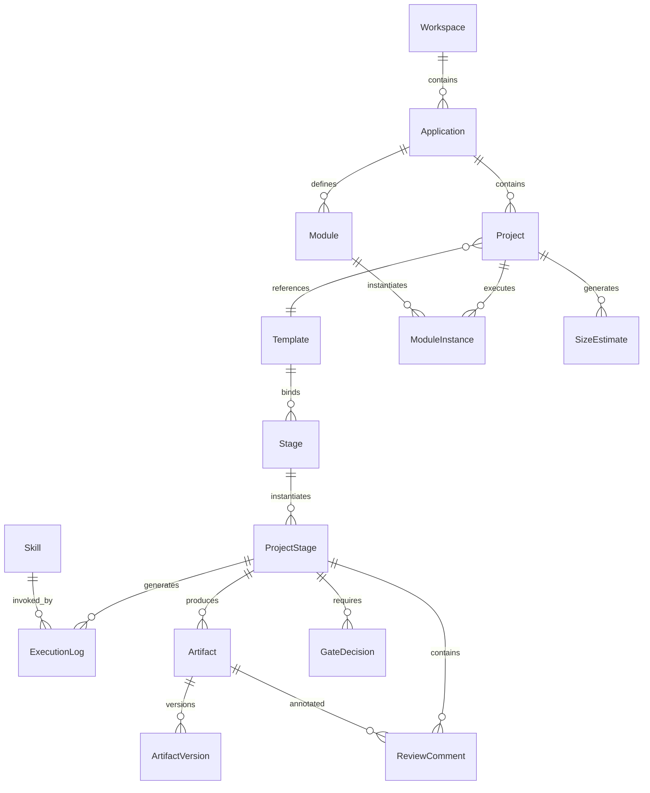
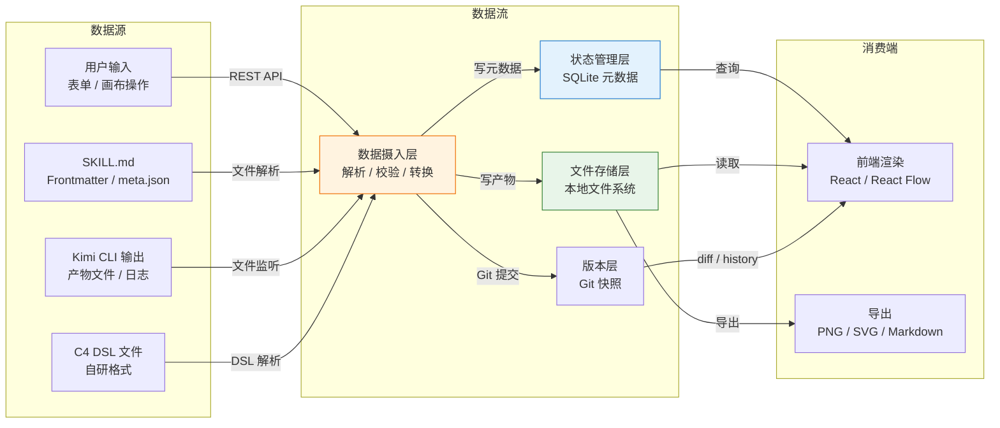
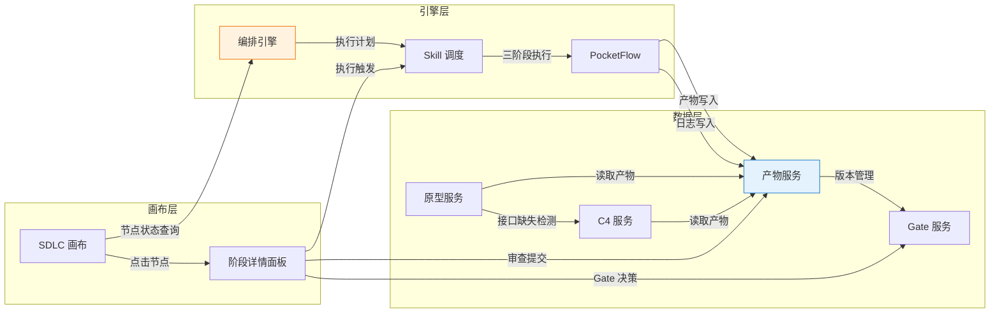
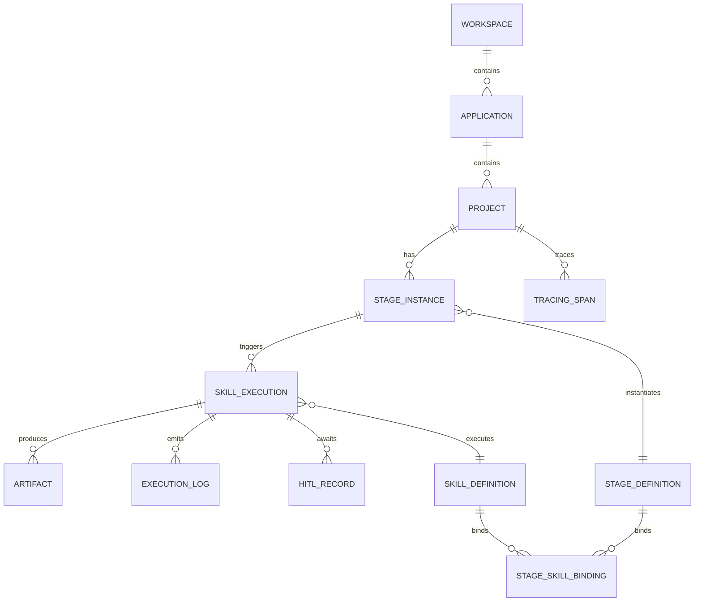

# 数据流与模块交互

> 版本：HLD-002 v1.0
> 状态：Draft
> 变更：sdlc-visualizer

---

## 1. 数据架构

### 1.1 逻辑 ER 图

### 1.2 主数据流向

### 1.3 存储策略

| 数据类型 | 存储介质 | 策略 | 理由 |
|----------|----------|------|------|
| 元数据（项目/阶段/执行记录/Gate） | SQLite | 单文件嵌入式，应用层 10 Project 上限 | 零运维、事务安全、SQLAlchemy 透明迁移 |
| 产物文件（Markdown/YAML/JSON） | 本地文件系统 | 按 `openspec/changes/{project}/` 目录结构 | 与 Arsitect 规范兼容、用户可直接用 IDE 编辑 |
| 产物版本 | Git 仓库 | 每项目独立 `.git`，自动 commit | 天然 diff/回滚、开发者熟悉 |
| 执行日志（stdout/stderr） | SQLite + 文件 | 元数据存摘要，大日志存文件 | 避免 SQLite 膨胀、保留完整现场 |
| C4 DSL | 本地文件系统 | `c4-{level}.dsl.yml` 文件 | 用户可手动编辑、Git 追踪 |
| 线框图 / 原型 | 本地文件系统 | SVG / HTML 文件 | 渲染产物、可导出 |
| 配置（模板/全局参数） | SQLite + YAML | 结构化数据存 SQLite，复杂配置存 YAML | 兼顾查询效率与可读性 |

**分库分表策略**：MVP 阶段无分库分表。SQLite 单文件通过 WAL 模式提升并发读能力。P1 迁移 PostgreSQL 后按 Workspace 分 schema（若多租户）。

### 1.4 核心表清单（无字段类型）

| 表名 | 职责 | 关联表 | 数据量级（MVP） |
|------|------|--------|----------------|
| `workspaces` | 团队资源边界 | — | 1 条（单机默认） |
| `applications` | 长期应用定义 | workspaces | < 10 条 |
| `projects` | 项目主数据，含状态/复杂度路径 | applications, templates | < 10 条 |
| `modules` | 应用内功能子域 | applications | < 50 条 |
| `module_instances` | 项目内模块执行实例 | projects, modules | < 50 条 |
| `stages` | SDLC 标准阶段定义（主数据） | — | 12 条 |
| `project_stages` | 项目与阶段的运行时实例 | projects, stages | < 120 条 |
| `skills` | Skill 元数据（Frontmatter 解析结果） | — | < 50 条 |
| `skill_executions` | Skill 执行记录（含日志摘要） | project_stages, skills | < 500 条 |
| `artifacts` | 产物元数据（路径/哈希/格式） | project_stages | < 2000 条 |
| `artifact_versions` | 产物 Git 版本历史 | artifacts | < 5000 条 |
| `gate_decisions` | Gate 审批决策记录 | project_stages | < 100 条 |
| `review_comments` | 产物行内批注 | artifacts, project_stages | < 2000 条 |
| `size_estimates` | 项目规模评估记录 | projects | < 20 条 |
| `templates` | 复杂度路径模板 | stages | 4 条（系统预制） |
| `execution_logs` | 执行日志（摘要级） | skill_executions | < 500 条 |

> **边界检查**：以上清单仅定义表职责与关联关系，不含字段类型、索引、约束。详细 DDL 在 detailed-design 阶段输出。

---

## 2. 接口契约

### 2.1 通信模式

| 通信场景 | 模式 | 协议 | 理由 |
|----------|------|------|------|
| 前端 ↔ 后端 | 请求-响应 | RESTful HTTP + JSON | 标准、调试简单、FastAPI 原生支持 |
| 后端 → 前端推送 | 服务端推送 | Server-Sent Events (SSE) | 单向流（Skill 状态/日志）、自动重连、HTTP 兼容 |
| 后端 ↔ Kimi CLI | 子进程管道 | STDIO + JSON Lines | CLI 无网络服务，唯一可行方案 |
| 后端 ↔ OpenUI | 请求-响应 | HTTP + JSON | OpenUI Docker 暴露 REST API |
| 后端 ↔ SQLite | 同步/异步 | SQLAlchemy AsyncSession | ORM 抽象，未来可切换 PostgreSQL |
| 后端 ↔ 文件系统 | 直接 IO | 本地文件 API | 本地单机，无需网络文件服务 |
| 后端 ↔ Git | 库调用 | GitPython / simple-git | 避免 shell 注入、类型安全 |

**版本策略**：API 通过 URL 路径版本化（`/api/v1/...`）。v1 为 MVP 版本。P1 引入破坏性变更时升级 v2，v1 保留至少 3 个月兼容期。

### 2.2 数据契约原则

| 原则 | 说明 |
|------|------|
| **Pydantic 统一定义** | 所有 API 出入参、数据库 DTO 共用 Pydantic Schema，避免前端/后端/DB 三层模型不一致 |
| **内容寻址** | 产物文件以内容哈希（SHA-256）为唯一标识，同名文件内容变更即新版本 |
| **事件溯源（轻量）** | ProjectStage / SkillExecution 状态变更记录事件序列，支持时间线回溯（非完整 CQRS） |
| **文件系统优先** | 产物内容以文件系统为唯一真相源，SQLite 仅存储元数据（路径、哈希、状态） |
| **Git 快照自动** | 产物保存时自动触发 Git 提交，提交信息包含时间戳和操作类型 |

### 2.3 前后端接口分组

| 接口组 | 职责 | 关键资源 |
|--------|------|----------|
| Project API | Workspace/Application/Project/Module CRUD | `/projects`, `/applications`, `/modules` |
| Canvas API | 节点/边/布局的读写 | `/canvas/nodes`, `/canvas/edges`, `/canvas/layout` |
| Skill API | Skill 导入、解析、执行触发 | `/skills`, `/skills/{id}/execute`, `/skills/import` |
| Artifact API | 产物浏览、编辑、版本、diff | `/artifacts`, `/artifacts/{id}/versions`, `/artifacts/{id}/diff` |
| Gate API | Gate 审批、摘要、历史 | `/gates`, `/gates/{id}/decide`, `/gates/summary` |
| C4 API | DSL 生成、编辑、渲染、导出 | `/c4/dsl`, `/c4/render`, `/c4/export` |
| Prototype API | OpenUI 调用、Wireframe 生成 | `/prototypes/openui`, `/prototypes/wireframe` |
| SizeEstimate API | 规模评估、复杂度路由 | `/size-estimates`, `/complexity-routes` |

> **边界检查**：以上仅定义接口分组与资源路径，不含请求/响应 Schema、Header、字段校验规则。详细 OpenAPI 契约在 `interface-first-dev` 阶段输出。

---

## 3. 模块职责

### 3.1 各模块输入/输出/核心职责/对外依赖

| 模块 | 输入 | 输出 | 核心职责 | 对外依赖 |
|------|------|------|----------|----------|
| **项目工作台** (DR-001) | 用户表单、Application 配置 | 项目记录、健康度指标 | Workspace/Application/Project/Module CRUD；Draft/Active 双态管理；健康度计算 | SQLite、文件系统 |
| **SDLC 画布** (DR-002) | ProjectStage 状态、Skill 依赖关系 | React Flow 节点/边数据、布局坐标 | 拓扑图/泳道/列表三种视图渲染；节点状态着色；缩放/拖拽/筛选 | React Flow 12、SQLite |
| **阶段详情面板** (DR-003) | SkillExecution 日志、Artifact 列表、ReviewComment | 面板渲染数据、审查提交 | Stage 内 Skill 指令快照、PocketFlow 三阶段状态、产物/日志/门禁展示；审查 Tab | SQLite、文件系统 |
| **审批中心** (DR-004) | Gate 待审队列、Artifact 预览、AI 摘要 | GateDecision 记录、下游解锁信号 | AI 自检摘要生成、快速确认/驳回/重试、旁路审批、历史追溯 | SQLite、Kimi CLI（摘要生成） |
| **产物浏览器** (DR-005) | Artifact 文件路径、Git 历史 | 渲染内容、diff 结果、版本列表 | 目录树、多模态渲染（Markdown/Mermaid/YAML/JSON）、平台内编辑、冲突检测、Git 快照 | 文件系统、Git、SQLite |
| **Skill 注册** (DR-006) | 本地 Skill 目录路径 | Skill 元数据、DAG 边建议 | Frontmatter 解析、meta.json 校验、DAG 自动解析、手动调整、画布节点库更新 | 文件系统、SQLite |
| **Skill Flow 编排** (DR-007) | Template 定义、Stage 依赖图 | 执行计划（拓扑排序结果） | YAML 驱动 DAG 构建、并行调度、条件评估、超时监控、错误处理（rollback/retry/skip） | SQLite |
| **Skill 调度** (DR-008) | 执行计划、输入产物、上下文参数 | SkillExecution 记录、产物文件、日志 | Kimi CLI 子进程管理、PocketFlow 三阶段生命周期、输入注入、输出捕获、日志收集 | Kimi CLI、文件系统、SQLite |
| **模板引擎** (DR-009) | 系统预制 Template、用户偏离指令 | 项目初始化配置、阶段-Skill 绑定 | Trivial/Light/Standard/Deep 四级模板管理、弱关联、偏离记录 | SQLite |
| **复杂度路由** (DR-010) | 需求产物（文件数/实体数/跨服务标记） | 复杂度等级、推荐路径、Timebox 初稿 | 五维度规则引擎、Triage/Calibrate 两次评估、路径可视化差异 | 文件系统、SQLite |
| **C4 架构浏览器** (DR-011) | 概要设计文档、用户手动 DSL | C4 DSL 文件、Mermaid 渲染图、PNG/SVG 导出 | 自动解析生成 L1/L2/L3/L4 DSL、层级穿透下钻、手动覆盖、反向代码定位 | 文件系统、Mermaid.js |
| **架构验证中心** (DR-012) | 历史架构基线、代码扫描结果 | 漂移检测报告、diff 可视化 | 设计架构 vs 实际架构对比（P1） | 文件系统、SQLite（P1） |
| **历史回溯** (DR-013) | ProjectStage 执行历史 | 时间线、阶段耗时对比、返工热力图 | 已完成项目统计、可视化报表（P1） | SQLite |
| **监控看板** (DR-014) | ExecutionLog、Token 消耗、阶段耗时 | 进度追踪、瓶颈识别、统计图表 | 平台级指标汇总（P1） | SQLite |
| **Application 与模块治理** (DR-015) | Application 配置、Module 里程碑 | ModuleInstance 记录、里程碑状态 | 四层模型治理、模块级里程碑独立推进 | SQLite |
| **PocketFlow 执行引擎** (DR-016) | Skill 定义、输入上下文、共享状态 | 执行结果、产物、状态变更 | prep → exec → post 三阶段标准化执行、异常降级 | Kimi CLI、文件系统 |
| **HITL 旁路审批** (DR-017) | 紧急授权请求、执行记录 | BYPASSED 状态、24h 补审告警 | 紧急授权、事后补审、超时告警、审计记录 | SQLite、SSE |
| **OpenUI 原型服务** (DR-018) | C4 Container 图、接口契约 | OpenUI 提示词、HTML 原型 | 提示词生成、HTTP 调用、内嵌预览（可选降级 Wireframe） | OpenUI Docker（可选） |
| **WireframeEngine** (DR-019) | C4 DSL、领域模型 | SVG 线框图、页面映射关系 | DomainMapper → LayoutPlanner → NavigationLinker 三 Agent 流水线 | 文件系统 |
| **原型-架构双向绑定** (DR-020) | 原型页面、C4 DSL | 接口缺失报告、C4 DSL 更新 | 接口覆盖度检查、一键回写、架构变更标记 | 文件系统、SQLite |
| **需求草图服务** (DR-021) | 用户故事、验收标准 | 低保真草图（文本框+箭头） | PageSpec 规则解析、字段覆盖率校验 | 文件系统 |

### 3.2 跨模块数据交互矩阵

---

### 需求可追溯性

| 需求编号 | 需求描述 | 本文件对应章节 | 验证方式 |
|---------|----------|-------------|---------|
| REQ-P0-001 | 项目 CRUD，Draft/Active 状态 | §1.4 核心表清单 + §3.1 项目工作台 | 模块职责评审 |
| REQ-P0-003 | SDLC 拓扑图 | §1.2 主数据流向 + §3.1 SDLC 画布 | 架构评审 |
| REQ-P0-006 | Skill 执行触发 | §2.1 通信模式 + §3.1 Skill 调度 | 架构评审 |
| REQ-P0-007 | 实时状态同步 | §2.1 SSE 推送 | 架构评审 |
| REQ-P0-010 | 产物渲染 | §1.3 存储策略 + §3.1 产物浏览器 | 架构评审 |
| REQ-P0-011 | 产物编辑 | §2.2 文件系统优先 + §3.1 产物浏览器 | 架构评审 |
| REQ-P0-012 | 产物 Git 快照 | §1.3 存储策略 + §3.1 产物浏览器 | 架构评审 |
| REQ-P0-014 | DAG 自动解析 | §3.1 Skill 注册 | 模块覆盖度检查 |
| REQ-P0-016 | 规模评估 | §3.1 复杂度路由 | 模块覆盖度检查 |
| REQ-P0-019 | C4 L1/L2/L3/L4 自动生成 | §3.1 C4 架构浏览器 | 模块覆盖度检查 |
| REQ-P0-028 | OpenUI 原型生成 | §2.1 通信模式 + §3.1 OpenUI 原型服务 | 架构评审 |
| REQ-P0-032 | 原型-架构双向绑定 | §3.2 跨模块数据交互矩阵 | 架构评审 |
| BR-001~BR-028 | 业务规则 | §3.1 各模块职责 | 覆盖度校验 |

---

## 附录：历史补充内容（来自 docs/ 目录）

> 以下内容来自 docs/ 目录下的历史版本，包含主文档中未覆盖的视角或早期草稿。

**Skill 注册与发现流**

文件系统（`.agents/skills/`） → Skill Registry（Frontmatter / meta.json 解析） → 数据库（`skill_definition` / `stage_skill_binding`） → WebSocket 广播 → Flow Canvas（节点库更新与拓扑重绘）

**SDLC 执行流**

前端（Gate 确认或手动触发） → Flow Engine（YAML DAG 解析与拓扑排序） → Skill Executor（Kimi CLI Adapter） → 本地 Kimi CLI 进程 → 文件系统（`openspec/` 产物写入） + 数据库（`skill_execution` / `execution_log`） → WebSocket 推送状态与日志 → Stage Detail / Flow Canvas 实时更新

**产物浏览流**

Artifact Viewer（目录树请求） → API（FS Adapter） → 文件系统（`openspec/`） → 多模态渲染器（Markdown / Mermaid / Swagger / YAML / JSON） → 前端预览面板

**审批门控流**

StageInstance 达到 Gate → Flow Engine 暂停调度并冻结下游 → HITLRecord 写入等待状态 → WebSocket 推送 Gate Waiting → Gate Center 展示 AI 自检摘要 → 用户确认 / 驳回 / 重试 → HITLRecord 状态更新 → Flow Engine 恢复执行或触发回退路径

### 1.3 存储策略（SQLite / 文件系统分离）

- **数据库（SQLite MVP / PostgreSQL P1+）**：承载结构化元数据与运行时状态，包括 Workspace、Application、Project、StageInstance、SkillExecution、ExecutionLog、HITLRecord、StageDefinition、StageSkillBinding、SkillDefinition、TracingSpan 等实体。数据库负责事务一致性、并发控制与查询聚合。
- **文件系统（`openspec/` 目录结构）**：承载产物实体本身，包括 Markdown PRD 与设计方案、Mermaid 图表、YAML OpenAPI 契约、JSON 配置、Swagger UI 静态文件等。文件系统按 `openspec/changes/{变更名}/` 分层组织，与 Arsitect 规范保持路径级兼容。数据库中的 `artifact` 表仅保存文件元数据索引（相对路径、校验和、关联的执行记录），不存储文件内容。

### 1.4 核心表清单

| 表名 | 职责 |
|------|------|
| workspace | 工作空间根实体，隔离多租户上下文与全局配置 |
| application | 应用实体，聚合多个业务相关项目 |
| project | 项目实体，承载 SDLC 全生命周期实例与范围锚定 |
| stage_definition | 阶段定义基线，描述标准 Stage 属性与门控规则模板 |
| skill_definition | Skill 定义实体，存储 Frontmatter 与 meta.json 解析结果 |
| stage_skill_binding | 阶段与 Skill 的多对多绑定关系，含执行顺序、条件分支与 DAG 边 |
| stage_instance | 项目内阶段运行实例，记录 Draft / Active 双态、起止时间与当前状态 |
| skill_execution | 单次 Skill 执行记录，含三级伪状态、退出码与产物关联 |
| artifact | 产物元数据索引，指向文件系统实际路径与版本快照 |
| execution_log | 执行过程日志，按时间序列追加，支持 stdout / stderr / 结构化事件 |
| hitl_record | 人工介入审批记录，对应 Gate 1 / 2.5 / 2 / 3 的确认 / 驳回 / 重试 |
| tracing_span | 分布式追踪风格的全链路性能与调用跨度，用于历史回溯与返工分析 |

### 2.1 通信模式（REST + WebSocket）

**REST**：用于配置型、请求-响应型操作，强调幂等与缓存友好。

- 典型场景：Project CRUD、Skill Registry 查询与导入、History 聚合计算、Artifact 目录树获取、Governance 规模评估触发。
- 路径规范：`/api/v1/{domain}/{resource}`，例如 `/api/v1/projects/{id}`、`/api/v1/skills/registry`。
- 数据格式：JSON，通过 Pydantic 模型统一校验。

**WebSocket**：用于实时推送型场景，强调低延迟与流式体验。

- 典型场景：Skill 执行状态流式更新、ExecutionLog 实时追加推送、Gate Waiting 通知、Flow Engine 拓扑节点高亮与进度染色。
- 命名空间规范：`/ws/v1`，按业务域划分子命名空间（如 `/ws/v1/execution`、`/ws/v1/gate`）。
- 事件名规范：采用 `domain.entity.action` 语义，例如 `skill.execution.update`、`execution.log.append`、`gate.waiting.notify`。

### 2.2 数据契约与版本策略

- **REST API 版本**：通过 URL 路径段显式声明（`/api/v1/...`）。主版本号变更时保留旧版路由至少一个 Release Cycle，通过 FastAPI 子应用挂载实现多版本共存。
- **WebSocket 事件契约**：通过共享 Protocol 包中的 TypeScript Interface 与 Python TypedDict 双写锁定。事件名本身隐式承载语义版本，不随意变更；字段扩展遵循"新增可选字段"原则，禁止删除或重命名已有字段。
- **数据库 Schema 版本**：P1+ 阶段通过 Alembic 迁移脚本管理；MVP 阶段通过 `infra/scripts/` 中的基础设施脚本执行全量重建或快照恢复。
- **产物文件版本**：产物文件本身无内嵌版本字段，通过 Git 仓库历史或文件系统快照实现追溯；`artifact` 表记录 `snapshot_id` 或 `commit_hash` 作为外部引用键，支持 diff 与回滚。

| 模块 | 核心职责 | 主要输入 | 主要输出 | 对外依赖 |
|------|----------|----------|----------|----------|
| 项目工作台 Project Dashboard | 项目 CRUD、健康度仪表盘、规模评估 Triage / Calibrate、Timebox 里程碑总览 | Project 元数据、Governance 计算结果、StageInstance 聚合状态 | 项目卡片列表、健康度评分、规模评估报告、里程碑时间线 | Project Governance（规模评估接口）、后端 Project API |
| SDLC 流程画布 Flow Canvas | 拓扑图 / 泳道 / 列表三视图切换，React Flow 渲染 Stage 节点与 Skill 子节点，动态布局与缩放 | StageDefinition、StageSkillBinding、StageInstance 状态流、SkillExecution 实时状态 | 可视化拓扑图、节点选中事件、视图模式状态、画布缩放级别 | React Flow 12 引擎、Flow Engine（拓扑与状态数据）、WebSocket 实时通道 |
| 阶段详情面板 Stage Detail | 右侧面板展示当前 Stage 的 Skill 快照、输入输出产物、执行日志、质量门禁结果 | StageInstance 详情、SkillExecution 列表、Artifact 索引、ExecutionLog 流、Gate 状态 | 详情面板渲染、日志流展示、产物快捷跳转指令、门禁状态标签 | Skill Executor（执行状态查询）、Artifact Viewer（产物跳转）、后端 Detail API |
| 产物浏览器 Artifact Viewer | openspec 目录树浏览、Markdown / Mermaid / Swagger / YAML / JSON 多模态渲染、版本历史、diff 对比、行内批注 | 文件系统产物路径、Artifact 元数据、Git 历史或快照 ID、用户批注数据 | 目录树结构、渲染后预览面板、diff 高亮块、批注列表 | FS Adapter（文件读取）、后端 Artifact API、前端渲染器组件库 |
| 审批中心 Gate Center | Gate Waiting 队列聚合展示、AI 自检摘要渲染、人工确认 / 驳回 / 重试操作入口 | HITLRecord 等待中列表、AI 自检摘要文本、StageInstance 上下文、用户操作指令 | 审批操作指令（确认 / 驳回 / 重试）、Gate 状态更新、审计日志记录 | Flow Engine（Gate 状态机驱动）、WebSocket 通知通道、后端 HITL API |
| Skill Flow 编排引擎 Flow Engine | YAML DAG 解析、拓扑排序、并行调度、条件分支路由、错误处理与重试策略 | StageSkillBinding DAG 定义、SkillExecution 状态变更事件、Gate 审批结果、项目配置参数 | 调度计划、节点激活 / 暂停 / 跳过指令、执行序列、错误回退路径 | Skill Executor（下游触发）、数据库（状态持久化）、WebSocket（状态广播） |
| Skill 调度服务 Skill Executor | Kimi CLI Adapter 封装、subprocess 生命周期管理、标准输入注入、标准输出 / 错误捕获、日志收集、三级伪状态映射 | Flow Engine 调度指令、SkillDefinition 执行参数、openspec 目录上下文、环境变量 | 进程 PID、退出码、stdout / stderr 流、产物文件路径、ExecutionLog 追加记录 | 本地 Kimi CLI 可执行文件、文件系统、CLI Adapter、WebSocket（实时日志推送） |
| 历史回溯 History | 已完成项目时间线渲染、阶段耗时对比分析、返工热力图生成 | Project 历史记录、StageInstance 起止时间、SkillExecution 结果、返工标记、TracingSpan 数据 | 时间线视图、耗时对比柱状图 / 桑基图、返工热力图、导出报表 | 后端 History Service、图表渲染库、前端时间轴组件 |
| Skill 注册管理 Skill Registry | 手动导入 Skill 包、SKILL.md Frontmatter 解析、meta.json 校验、画布节点库同步更新 | 本地 `.agents/skills/` 目录文件、用户上传的 Skill 压缩包、Arsitect 规范模板 | 校验通过的 SkillDefinition、StageSkillBinding 增量更新、画布节点类型注册表 | 文件系统、后端 Registry API、数据库、校验规则引擎 |
| 项目治理 Project Governance | 规模评估算法计算、里程碑 Timebox 调度、范围锚定检测、Stale 项目检测、影响分析 | Project 规模参数、StageInstance 进度、Artifact 变更范围、历史基线数据、TracingSpan | 规模得分（乐观 / 预期 / 保守三档）、里程碑甘特图计划、Stale 告警通知、影响分析报告 | 数据库、后端 Governance API、算法模型、调度触发器 |

## 4. 需求可追溯性

| 需求编号 | 需求描述 | 本文件对应章节 | 验证方式 |
|----------|----------|----------------|----------|
| REQ-P0-003 | SDLC 拓扑图动态渲染 | 1.1 逻辑 ER 图（SkillDefinition / StageSkillBinding）、3. 模块职责 | 架构走查 |
| REQ-P0-004 | 节点状态实时同步 | 2.1 通信模式（WebSocket）、3. 模块职责（Flow Canvas / Flow Engine） | 架构走查 |
| REQ-P0-005 | 点击节点打开阶段详情面板 | 3. 模块职责（Stage Detail） | 架构走查 |
| REQ-P0-006 | 触发 Kimi CLI 执行 Skill | 1.2 主数据流向（SDLC 执行流）、3. 模块职责（Skill Executor） | 架构走查 |
| REQ-P0-007 | Gate 节点 AI 辅助自检摘要 | 1.2 主数据流向（审批门控流）、3. 模块职责（Gate Center） | 架构走查 |
| REQ-P0-010 | 产物浏览器多模态渲染 | 1.3 存储策略、3. 模块职责（Artifact Viewer） | 架构走查 |
| REQ-P0-011 | 产物目录树浏览和下载 | 1.3 存储策略、3. 模块职责（Artifact Viewer） | 架构走查 |
| REQ-P0-013 | Skill Frontmatter 和 meta.json 解析与校验 | 1.2 主数据流向（Skill 注册流）、3. 模块职责（Skill Registry） | 架构走查 |
| REQ-P0-015 | 实时通知 | 2.1 通信模式（WebSocket）、1.2 主数据流向 | 架构走查 |
| REQ-P0-017 | 里程碑 Timebox 与范围锚定 | 1.2 主数据流向（Stale 传播）、3. 模块职责（Project Governance） | 架构走查 |
