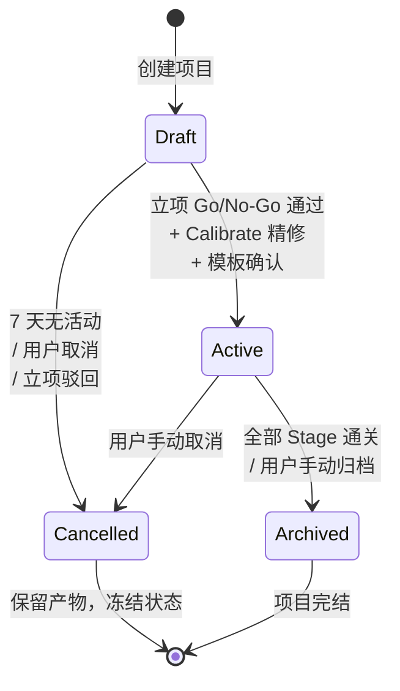
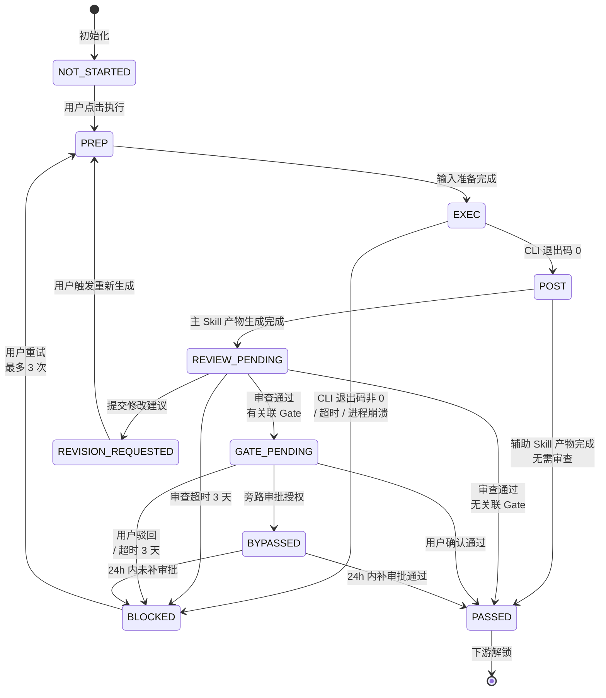
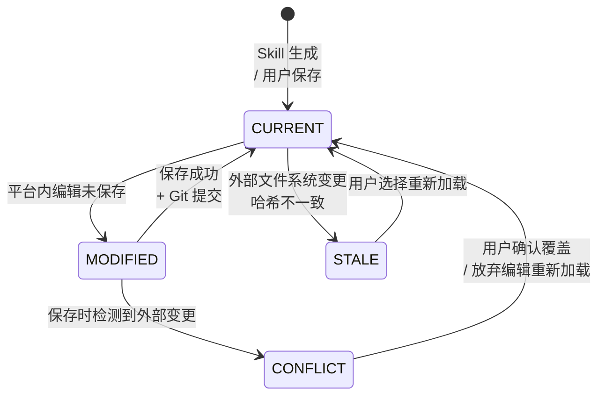
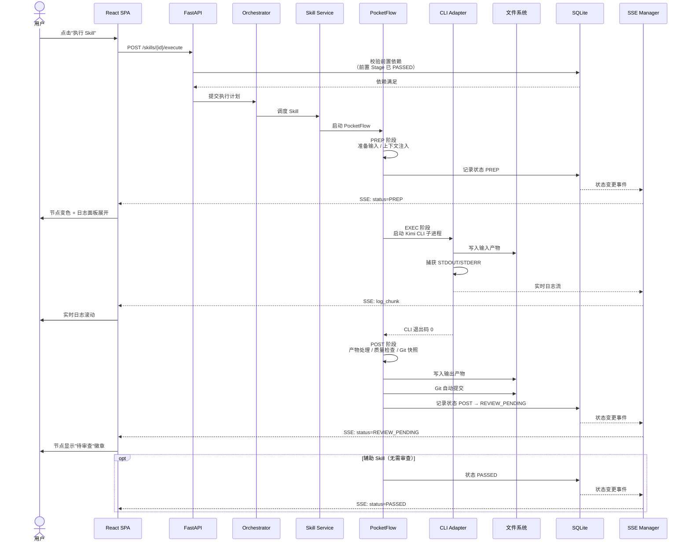
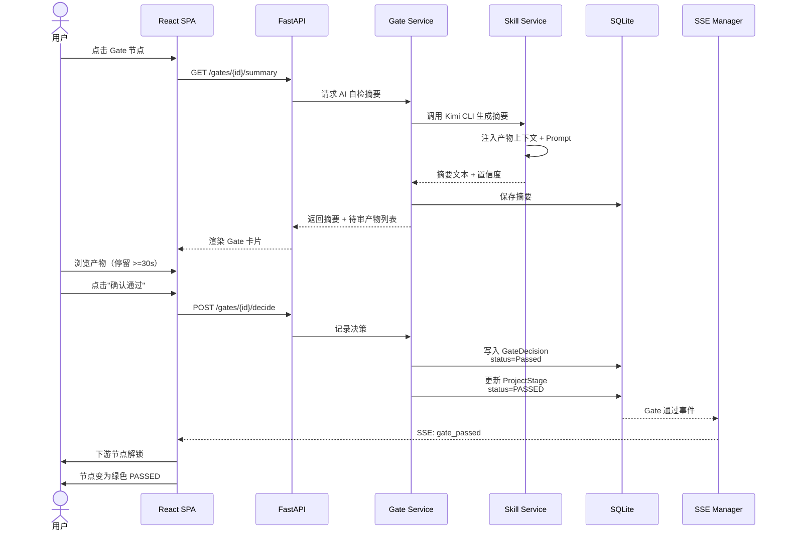
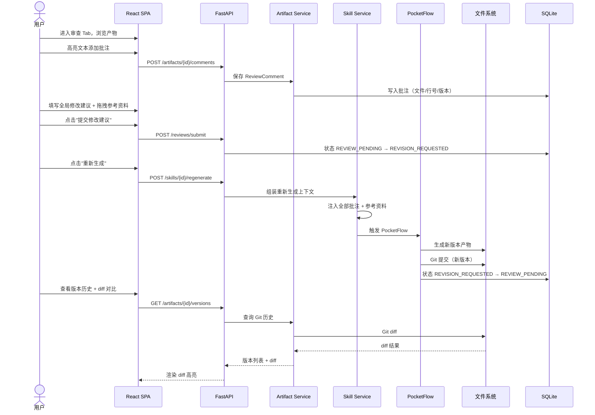
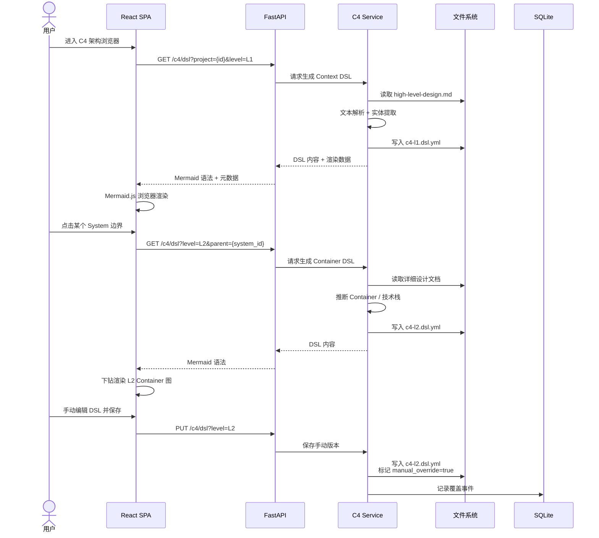
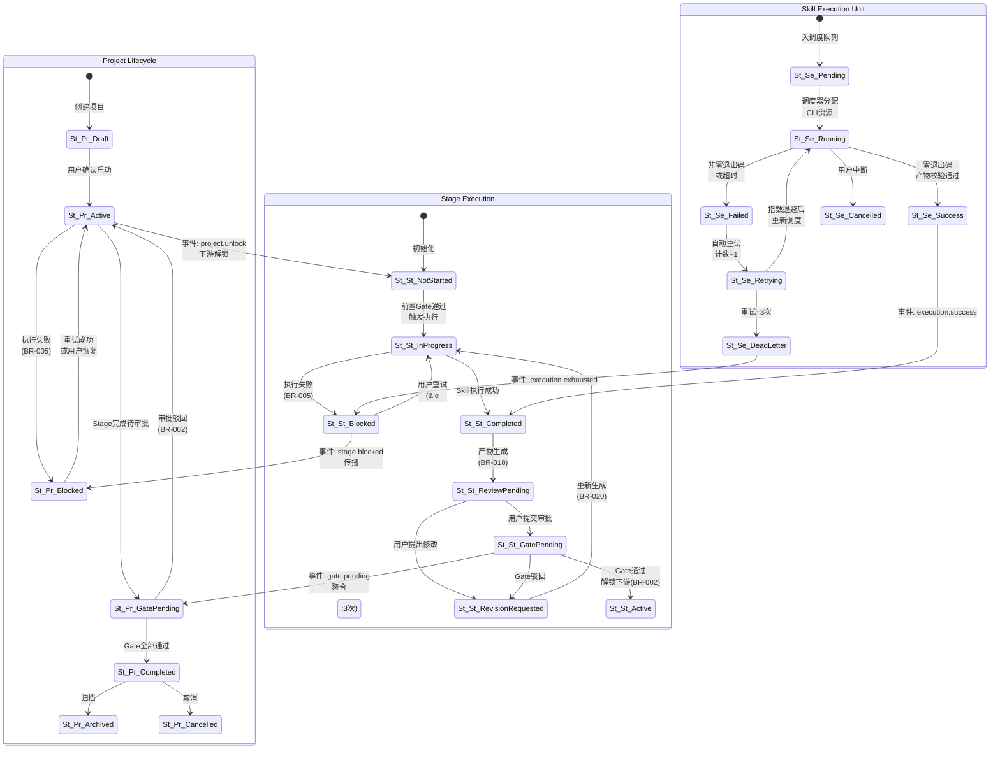
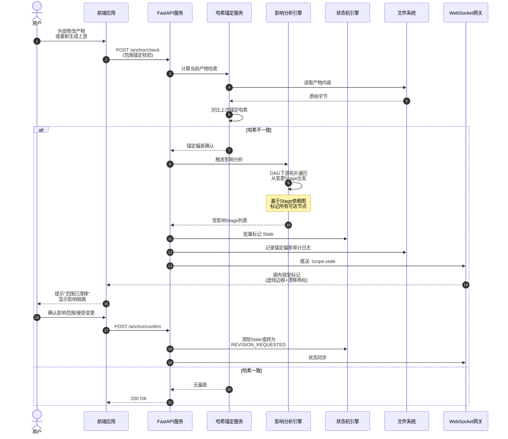

# 运行时行为

> 版本：HLD-003 v1.0
> 状态：Draft
> 变更：sdlc-visualizer

---

## 1. 全局状态机

### 1.1 项目级状态机（Project）



**跨模块影响**：
- **项目工作台**：驱动 Dashboard 健康度卡片（活跃/归档/取消项目数）
- **SDLC 画布**：Draft 态仅渲染分析型 Skill 节点；Active 态渲染完整 Stage 节点
- **模板引擎**：Draft 态允许自由切换模板；Active 态冻结模板选择但允许路径偏离
- **复杂度路由**：Draft → Active 转换时触发 Calibrate 精修评估

### 1.2 Skill 级状态机（含 PocketFlow 三阶段）



**跨模块影响**：
- **Skill 调度服务**：管理 PREP → EXEC → POST 三阶段生命周期
- **阶段详情面板**：展示当前 PocketFlow 阶段状态、实时日志
- **审批中心**：接收 GATE_PENDING 状态，生成 AI 自检摘要
- **产物浏览器**：REVIEW_PENDING 时解锁审查 Tab；REVISION_REQUESTED 时解锁重新生成按钮
- **SDLC 画布**：节点颜色/徽章随状态变更实时更新

### 1.3 产物状态机（Artifact）



**跨模块影响**：
- **产物浏览器**：MODIFIED 时显示"未保存"指示器；STALE 时显示"外部已变更"警告
- **阶段详情面板**：CONFLICT 时阻塞审查提交，优先解决冲突
- **文件系统事件监听**：驱动 CURRENT → STALE 的自动检测

---

## 2. 关键流程时序图

### 2.1 Skill 执行主链路



### 2.2 Gate 审批链路



### 2.3 产物审查与重新生成链路



### 2.4 C4 DSL 生成与穿透链路



---

## 3. 异常处理全局

### 3.1 错误分类

| 类别 | 定义 | 典型场景 | 影响范围 |
|------|------|----------|----------|
| **业务错误** | 违反业务规则的状态变更 | 前置依赖未满足执行 Skill、未浏览产物提交审查 | 单个 Stage |
| **系统错误** | 平台内部异常 | 数据库连接失败、Git 仓库损坏、文件权限不足 | 单个请求或模块 |
| **网络错误** | 外部依赖不可达 | Kimi CLI 未安装、OpenUI Docker 未启动、SSE 断开 | 单个功能或全链路 |
| **AI 错误** | CLI 执行或 LLM 输出异常 | CLI 退出码非 0、输出解析失败、生成产物为空 | 单个 Skill 执行 |

### 3.2 处理策略

| 策略 | 适用错误类别 | 实现方式 | 涉及模块 |
|------|-------------|----------|----------|
| **降级** | 网络错误（OpenUI 不可用） | OpenUI 不可用时自动降级 WireframeEngine | 原型服务 |
| **重试** | AI 错误、网络错误（瞬态） | 自动重试 1 次（BR-005）；用户手动重试最多 3 次 | Skill 调度 |
| **熔断** | Kimi CLI 连续失败 | 连续 3 次失败后标记 CLI 不可用，提示用户检查安装 | Skill 调度 |
| **人工介入** | 业务错误、系统错误（Git 损坏） | 标记 BLOCKED，保留完整日志和上下文，通知用户 | 编排引擎、产物服务 |
| **静默恢复** | SSE 连接断开 | 前端自动重连 SSE，重连后全量同步状态 | 实时同步 |

### 3.3 重试策略

| 场景 | 重试次数 | 退避策略 | 死信处理 |
|------|----------|----------|----------|
| Kimi CLI 执行失败 | 自动 1 次 + 手动 3 次 | 立即重试（本地进程无网络延迟） | 标记 BLOCKED，写入 human-decisions.md |
| 数据库写入冲突 | 3 次 | 线性退避 100ms/200ms/400ms | 返回 500，提示刷新重试 |
| SSE 推送失败 | 无限 | 指数退避 1s/2s/4s... 最大 30s | 前端轮询兜底 |
| Git 提交失败 | 3 次 | 立即重试 | 标记产物未快照，提示手动提交 |

### 3.4 与回滚方案的衔接

| 错误类别 | 是否触发回滚 | 回滚范围 | 回滚步骤（概要） |
|----------|-------------|----------|-----------------|
| AI 错误（Skill 执行失败） | 否 | — | 标记 BLOCKED，用户重试或手动修复后重新执行 |
| 业务错误（产物被误删） | 是 | 单个产物 | 从 Git 快照恢复最近版本 → 验证内容 → 更新状态 |
| 系统错误（数据库损坏） | 是 | 全库 | 停止服务 → 从备份文件恢复 SQLite → 验证完整性 → 重启 |
| PocketFlow POST 阶段失败 | 否 | — | 保留 EXEC 产物，用户查看 post 失败详情后重试 |
| 旁路审批 24h 未补审 | 是 | Gate 决策 | 撤销 BYPASSED → 恢复 GATE_PENDING → 下游重新锁定 |

> **与 05-ops-governance.md 的联动**：以上回滚步骤的详细操作清单和验证检查点见 `05-ops-governance.md` §2。

---

## 4. 算法选型（AI 项目）

### 4.1 模型基座选择

| 功能 | 基座 | 调用方式 | 选型理由 |
|------|------|----------|----------|
| Skill 核心执行 | Kimi（通过 CLI） | 子进程 STDIO | PRD 约束：MVP 仅 Kimi CLI |
| Gate 自检摘要 | Kimi（通过 CLI） | 子进程 STDIO，注入产物上下文 | 利用 LLM 总结能力生成风险点和待补充项 |
| C4 DSL 自动生成 | Kimi（通过 CLI）+ 自研规则 | 混合：规则提取实体 → LLM 推断技术栈 → 规则组装 DSL | 结构化输出要求高，纯 LLM 幻觉风险大，规则+LLM 混合更可控 |
| 需求草图生成 | Kimi（通过 CLI） | 子进程 STDIO，注入用户故事 | 自然语言理解 + 结构化草图生成 |
| 规模评估 | **自研规则引擎** | 纯本地计算，不调用 LLM | BR-011 强制要求：复杂度路由基于规则引擎，不调用 LLM 深度分析 |
| DAG 自动解析 | **自研文本解析** | 正则 + YAML Frontmatter 解析 | SKILL.md 格式固定，无需 LLM |

### 4.2 关键自研算法

#### 算法 A：复杂度路由规则引擎

- **输入**：需求产物文件集合（Markdown/YAML）
- **处理**：关键词模式匹配（模块数/接口数/页面数/技术复杂度/风险等级）
- **输出**：五维度得分 + 复杂度等级（XS/S/M/L/XL）+ 推荐路径（Trivial/Light/Standard/Deep）
- **耦合方式**：独立服务，无状态计算，结果被 ProjectService 消费用于模板初始化

#### 算法 B：C4 DSL 混合生成

- **输入**：概要设计文档（high-level-design.md）
- **处理**：
  1. 规则层：正则提取模块名、技术栈关键词、接口路径
  2. LLM 层：调用 Kimi CLI 推断 Container 间依赖关系和技术边界
  3. 规则层：将提取结果组装为标准 C4 DSL YAML 格式
- **输出**：c4-l1.dsl.yml / c4-l2.dsl.yml / c4-l3.dsl.yml / c4-l4.dsl.yml
- **耦合方式**：C4Service 内部子模块，LLM 调用通过 CLI Adapter 统一接入

#### 算法 C：DAG 拓扑排序与并行调度

- **输入**：Stage 节点集合 + 依赖边集合 + 模板绑定规则
- **处理**：Kahn 算法拓扑排序；同一 Stage 内无依赖 Skill 并行；跨 Module 完全并行（BR-018）
- **输出**：执行计划（有序 Stage 列表 + 每个 Stage 内 Skill 执行顺序）
- **耦合方式**：Orchestrator Service 核心算法，被 Skill Execution 触发

### 4.3 与其他模块的耦合方式

| 算法 | 上游依赖 | 下游消费 | 耦合强度 |
|------|----------|----------|----------|
| 复杂度路由 | 需求产物（文件系统） | 模板引擎、项目工作台 | 松散（无状态计算） |
| C4 DSL 生成 | 概要设计文档、Kimi CLI | C4 架构浏览器、WireframeEngine | 中等（依赖 LLM 输出稳定性） |
| DAG 拓扑排序 | Skill 注册数据（SQLite） | Skill 调度服务 | 紧密（执行计划直接影响调度） |

---

### 需求可追溯性

| 需求编号 | 需求描述 | 本文件对应章节 | 验证方式 |
|---------|----------|-------------|---------|
| REQ-P0-006 | Skill 执行触发 | §2.1 Skill 执行主链路 | 时序图评审 |
| REQ-P0-007 | 实时状态同步 | §2.1 SSE 推送 | 时序图评审 |
| REQ-P0-008 | Gate 自检摘要 | §2.2 Gate 审批链路 | 时序图评审 |
| REQ-P0-009 | Gate 快速确认 | §2.2 Gate 审批链路 | 时序图评审 |
| REQ-P0-034 | 产物行内批注 | §2.3 审查与重新生成链路 | 时序图评审 |
| REQ-P0-038 | 基于反馈重新生成 | §2.3 审查与重新生成链路 | 时序图评审 |
| REQ-P0-019 | C4 L1/L2/L3/L4 自动生成 | §2.4 C4 DSL 生成链路 | 时序图评审 |
| REQ-P0-040 | 需求草图生成 | §4.1 模型基座选择 | 算法评审 |
| BR-005 | 重试最多 3 次 | §3.3 重试策略 | 规则评审 |
| BR-009 | Gate 低置信度拦截 | §2.2 Gate 审批链路 | 时序图评审 |
| BR-011 | 复杂度路由不调用 LLM | §4.1 规模评估 | 算法评审 |
| BR-016 | PocketFlow 三阶段 | §1.2 Skill 级状态机 | 状态机评审 |
| BR-023 | 主 Skill 必须审查 | §1.2 Skill 级状态机 | 状态机评审 |
| BR-024 | 浏览 >=30 秒 | §2.2 Gate 审批链路 | 时序图评审 |
| R-002 | Kimi CLI 假死感 | §2.1 实时日志流 | 时序图评审 |
| R-003 | SKILL.md 解析准确率 | §4.1 DAG 自动解析 | 算法评审 |

---

## 附录：历史补充内容（来自 docs/ 目录）

> 以下内容来自 docs/ 目录下的历史版本，包含主文档中未覆盖的视角或早期草稿。

### 1.1 跨模块核心实体状态流转

系统运行时被三类核心实体的状态机共同约束：**Project**（项目生命周期）、**Stage**（阶段执行流）、**SkillExecution**（单次 Skill 调用实例）。三层状态机通过事件总线联动，任何一层的状态跃迁均可能触发下游层的连锁反应。



### 1.2 状态流转与 Gate 联动规则

Gate 作为人工审批的刚性节点，嵌入在 Stage 与 Project 的两级状态机中，联动规则如下：

| 联动规则 | 触发条件 | 状态影响 | 业务规则依据 |
|---------|---------|---------|-------------|
| **Gate 阻塞下游** | Stage 处于 `GATE_PENDING` 或 `REVISION_REQUESTED` | 下游 Stage 强制保持 `NOT_STARTED`，调度器拒绝执行请求 | BR-002 |
| **Project 级聚合** | 任意 Stage 进入 `GATE_PENDING` | Project 同步进入 `GATE_PENDING`，全局画布锁定编辑 | 状态一致性 |
| **重试熔断** | SkillExecution 连续 3 次失败 | Stage 进入 `BLOCKED`，Project 进入 `BLOCKED`，等待人工恢复 | BR-005 |
| **Review 强制停留** | 产物进入 `REVIEW_PENDING` | 前端强制记录用户浏览时长，不足 30 秒禁止提交审批 | BR-019 |
| **重新生成继承** | Stage 从 `REVISION_REQUESTED` 回到 `IN_PROGRESS` | 调度器自动挂载前序版本的全部人工批注与参考资料 | BR-020 |
| **AI 发布拦截** | Skill 类型为 `release-management` 或 `finish` | 执行请求强制路由至 `GATE_PENDING`，禁止自动推进至 `Completed` | BR-010 |

### 2.1 Skill 执行完整链路

该链路覆盖从前端用户操作到产物落盘、状态同步的全流程，是系统的核心执行路径。

```mermaid
sequenceDiagram
    autonumber
    actor U as 用户
    participant FE as 前端应用
    participant BE as FastAPI服务
    participant SM as 状态机引擎
    participant CLI as CLI适配器
    participant KC as Kimi CLI
    participant FS as 文件系统
    participant WS as WebSocket网关

    U->>FE: 点击执行节点
    FE->>BE: POST /execute<br>(SkillID + StageID)
    BE->>SM: 前置校验: Gate/状态/BR-002/BR-015
    alt 校验通过
        SM-->>BE: 状态合法
        BE->>SM: 推进 Stage &rarr; IN_PROGRESS
        BE->>CLI: 异步调度执行<br>(非阻塞subprocess)
        CLI->>CLI: 白名单命令校验<br>禁止任意Shell
        CLI->>KC: asyncio subprocess<br>启动Kimi CLI
        KC->>FS: 写入产物至<br>openspec/changes/{change}/
        FS-->>KC: IO完成
        KC-->>CLI: 进程退出码 + stdout

        alt 执行成功
            CLI-->>BE: 执行完成事件
            BE->>FS: 监听产物变更<br>获取元数据
            FS-->>BE: 产物清单 + 哈希
            BE->>SM: 推进 Stage &rarr; COMPLETED<br>&rarr; REVIEW_PENDING
            SM-->>BE: 状态已持久化
            BE->>WS: 广播: stage.completed
            WS-->>FE: WebSocket推送<br>(&lt;5s)
            FE-->>U: 画布节点变绿<br>产物预览就绪
        else 执行失败
            CLI-->>BE: 异常事件<br>(exit code &ne; 0)
            BE->>SM: 重试计数+1
            alt 计数 &le; 3
                BE->>CLI: 指数退避后<br>重新调度
            else 计数 &gt; 3
                BE->>SM: 标记 DeadLetter<br>Stage &rarr; BLOCKED
                SM->>SM: 级联 Project &rarr; BLOCKED
                BE->>WS: 推送异常通知<br>(&lt;1s)
                WS-->>FE: 状态同步
                FE-->>U: 提示人工介入<br>显示失败日志
            end
        end
    else 校验失败
        SM-->>BE: 状态冲突<br>下游被Gate锁定
        BE-->>FE: 422 Unprocessable
        FE-->>U: 提示Gate阻塞<br>显示依赖路径
    end
```

产物生成后进入人工审查闭环，AI 仅作为辅助摘要生成器，最终决策权始终在用户。

```mermaid
sequenceDiagram
    autonumber
    actor U as 用户
    participant FE as 前端应用
    participant BE as FastAPI服务
    participant AI as AI摘要引擎
    participant SM as 状态机引擎
    participant FS as 文件系统
    participant WS as WebSocket网关

    FS->>BE: 事件: artifact.created<br>(BR-018触发)
    BE->>AI: 请求产物摘要<br>(关键风险+待补充项)

    alt 摘要生成成功
        AI-->>BE: 结构化摘要对象
    else 摘要失败
        BE->>BE: 降级策略<br>返回原文预览标记
    end

    BE->>SM: 推进 Stage &rarr; REVIEW_PENDING
    BE->>WS: 推送: gate.review_pending<br>(&lt;1s)
    WS-->>FE: WebSocket通知
    FE-->>U: 渲染产物 + AI摘要面板

    U->>FE: 浏览产物(计时开始)
    Note over FE: 前端强制计时<br>BR-019: &ge;30s

    U->>FE: 提交审批意见
    FE->>BE: POST /gate/review<br>(approve / reject / comment)
    BE->>BE: 校验浏览时长<br>校验批注完整性

    alt Gate通过
        BE->>SM: Stage &rarr; ACTIVE<br>解锁下游Stage
        SM->>SM: 检查Project是否<br>全部Stage完成
        BE->>WS: 广播: gate.approved<br>+ downstream.unlocked
        WS-->>FE: 画布更新
        FE-->>U: 下游节点高亮可执行
    else Gate驳回/修改建议
        BE->>SM: Stage &rarr; REVISION_REQUESTED
        BE->>FS: 持久化批注<br>关联前序版本(BR-020)
        BE->>WS: 推送: gate.revision
        WS-->>FE: 标记节点为待修订
        FE-->>U: 显示批注清单<br>支持一键重试
    end
```

### 2.3 范围锚定与 Stale 传播链路

当外部系统（如用户手动修改 openspec 目录中的文件）或上游重新生成导致产物漂移时，系统通过哈希锚定检测并向下游传播 Stale 标记。



运行时错误按来源与影响范围分为四类，对应不同的处理 Owner 与 SLA：

| 错误类别 | 典型场景 | 影响范围 | 首要处理 Owner |
|---------|---------|---------|--------------|
| **业务错误** | Gate 未通过、状态非法转换、重试次数超限、浏览时长不足提交审批 | 单 Stage / 单 Project | 前端表单校验 + 状态机引擎 |
| **系统错误** | SQLite WAL 损坏、文件系统 IO 失败、进程崩溃、内存溢出 | 全局服务可用性 | 后端服务 + 监控告警 |
| **网络错误** | WebSocket 连接断开、CLI 子进程管道破裂、长轮询超时 | 实时状态同步 | 传输层自动重连 |
| **AI 错误** | Kimi CLI 非零退出、产物解析失败、模型输出格式异常、幻觉导致非法状态 | 单次 SkillExecution | CLI 适配器 + 死信队列 |

| 策略 | 适用错误类别 | 机制说明 | 架构约束 |
|-----|------------|---------|---------|
| **降级** | AI 错误、网络错误 | AI 摘要失败时降级为原文预览；WebSocket 断开时降级为 HTTP 轮询；产物渲染失败时降级为源码模式 | 降级路径必须在 500ms 内完成，不阻塞用户操作 |
| **重试** | AI 错误、网络错误、部分系统错误（IO 瞬时失败） | SkillExecution 失败自动重试；WebSocket 断线自动重连；DB 写冲突 WAL 重试 | 重试必须幂等，禁止产生副作用（如重复写产物） |
| **熔断** | AI 错误（连续失败） | 同一 Skill 连续 3 次失败进入熔断态，30 分钟内拒绝自动调度，转人工队列 | 熔断状态持久化至 DB，服务重启不丢失 |
| **人工介入** | 业务错误、系统错误（持久化失败）、AI 错误（熔断后） | 通过 WebSocket 推送 + 本地系统通知（P1+）触达用户；提供一键诊断入口 | 禁止 AI 自动绕过 Gate 或自动重试已熔断任务 |

SkillExecution 层采用**指数退避 + 最大次数 + 死信队列**的三级策略：

1. **退避间隔**：第 N 次重试等待 `min(2^(N-1), 16)` 秒（即 1s, 2s, 4s, 8s, 16s 封顶）。
2. **最大次数**：3 次（含首次执行共 4 次尝试），与 BR-005 对齐。
3. **死信队列（DLQ）**：第 3 次重试失败后，执行上下文（命令、环境变量、产物路径、错误日志）写入 DLQ，Stage 状态推进为 `BLOCKED`，Project 状态级联为 `BLOCKED`。
4. **DLQ 消费**：用户手动触发"重试"时，优先从 DLQ 恢复上下文，而非重新构造请求，确保环境一致性。

| 错误触发条件 | 错误类别 | 回滚动作 | 回滚范围 | 衔接文档 |
|------------|---------|---------|---------|---------|
| 产物生成过程中 CLI 崩溃 | AI / 系统 | 清理不完整产物文件，Stage 回退至 `NOT_STARTED` | 单 Stage 产物目录 | `05-ops-governance.md` &sect;2.2 |
| 非法状态转换导致 DB 数据不一致 | 业务 / 系统 | 触发 SQLite 事务回滚，恢复上次提交的快照 | 单条状态记录 | `05-ops-governance.md` &sect;2.2 |
| Gate 驳回后重新生成覆盖旧产物 | 业务 | 保留前序版本至 `archive/` 子目录，支持版本对比 | 单产物文件 | `05-ops-governance.md` &sect;2.3 |
| 范围锚定检测到上游漂移 | 业务 | 下游 Stage 批量回退至 `REVISION_REQUESTED`，解锁上游重新执行 | 下游依赖链 | `05-ops-governance.md` &sect;2.4 |
| 连续 3 次重试失败的死信任务 | AI | 不做自动回滚，冻结 Project 状态等待人工裁决 | 全局 Project | `05-ops-governance.md` &sect;2.1 |

## 4. 算法选型（AI 项目必选）

### 4.1 Gate 自检摘要生成策略

在产物进入 `REVIEW_PENDING` 后，AI 摘要引擎对产物内容进行**分层结构化提取**，生成 Gate 自检摘要：

- **文档结构解析层**：识别 Markdown 标题层级、Mermaid 图表块、YAML Frontmatter，建立内容索引。
- **关键段落提取层**：基于规则模式（如"风险"、"待确认"、"TODO"、"FIXME"）定位高信息密度段落。
- **风险模式匹配层**：将提取的段落与预定义风险模式库（范围蔓延、接口缺失、NFR 未覆盖、安全硬编码）进行相似度匹配。
- **摘要生成层**：输出结构化摘要（关键发现 / 风险提示 / 待补充项 / 建议行动），供用户在 30 秒浏览窗口内快速定位重点。

> 架构约束：摘要生成采用异步流水线，不阻塞状态机推进；生成失败时自动降级为原文预览。

### 4.2 规模评估 Triage 算法

在 `project-size-estimate` Skill 被调用时，系统对项目规模进行**五维度加权评分**：

| 维度 | 权重 | 输入信号 | 输出档位 |
|-----|------|---------|---------|
| 模块数 | 25% | 功能架构图中叶子节点数量 | 1-5 分 |
| 接口数 | 20% | OpenAPI paths 数量 | 1-5 分 |
| 页面数 | 20% | 前端路由与组件节点数 | 1-5 分 |
| 复杂度 | 20% | 嵌套条件深度、状态机分叉数 | 1-5 分 |
| 风险 | 15% | 新技术栈占比、外部依赖数 | 1-5 分 |

加权总分映射至三档输出：**乐观**（总工期按 0.8 系数）、**预期**（1.0 系数）、**保守**（1.5 系数）。算法仅作为辅助决策输入，最终评估需人工确认。

### 4.3 Stale 影响分析引擎

当范围锚定检测到上游产物哈希变化时，引擎执行**DAG 下游依赖拓扑遍历**：

1. 以变更 Stage 为起点，读取全局 Stage 依赖图（有向无环图）。
2. 采用 BFS 遍历所有可达节点，跳过已处于 `ARCHIVED` 或 `CANCELLED` 的分支。
3. 对遍历到的每个下游 Stage 标记 `Stale` 状态，并记录最短依赖路径长度。
4. 若遍历中发现环（理论上不应存在，作为防御性校验），立即中断并上报治理告警。

> 架构约束：依赖图常驻内存缓存，拓扑遍历时间复杂度 O(V+E)，在 50 个 Stage 规模下耗时 < 10ms。

## 5. 需求可追溯性

| 需求编号 | 需求描述 | 本文件对应章节 | 验证方式 |
|---------|---------|-------------|---------|
| REQ-P0-004 | 节点状态实时同步 | 1.1, 1.2, 2.1 | 评审 / 测试 |
| REQ-P0-007 | Gate AI 自检摘要 | 2.2, 4.1 | 评审 |
| REQ-P0-008 | Gate 确认/驳回/重试 | 1.2, 2.2 | 评审 / 测试 |
| REQ-P0-009 | Gate 历史追溯 | 2.2 | 评审 |
| REQ-P0-014 | Draft/Active 双态管理 | 1.1 | 评审 |
| REQ-P0-017 | 里程碑 Timebox 与范围锚定 | 2.3, 4.3 | 评审 / 测试 |
| REQ-P0-018 | Stage 与 Skill 绑定配置 | 1.2, 2.1 | 评审 |
| REQ-P0-019 | Stage 合并与拆分 | 1.1, 1.2 | 评审 |
| BR-002 | Gate 审批通过前下游不可执行 | 1.2, 2.1, 2.2 | 测试 |
| BR-005 | 节点执行失败最多重试 3 次 | 1.1, 2.1, 3.3 | 测试 |
| BR-010 | AI 禁止自动执行发布相关 Skill | 1.2 | 测试 |
| BR-015 | 每个 Stage 有且仅有 1 个主 Skill | 1.2, 2.1 | 测试 |
| BR-018 | Stage 产物生成后必须进入 REVIEW_PENDING | 2.1, 2.2 | 测试 |
| BR-019 | 人工浏览 &ge;30s 才可提交审批 | 2.2 | 测试 |
| BR-020 | 重新生成携带前序批注和参考资料 | 1.2, 2.2 | 测试 |
