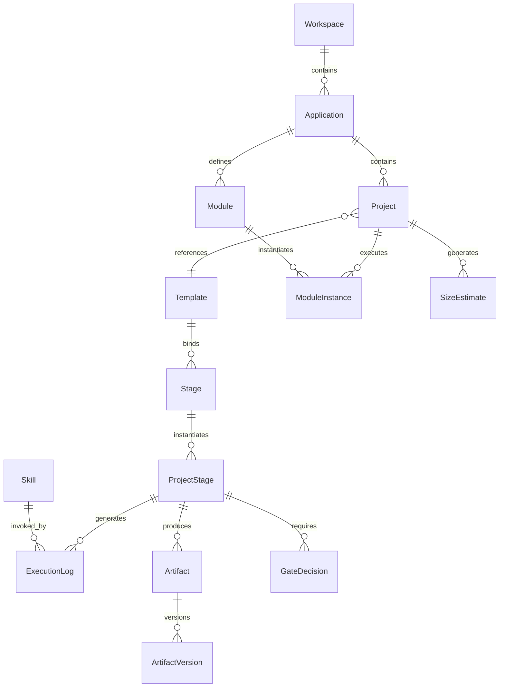
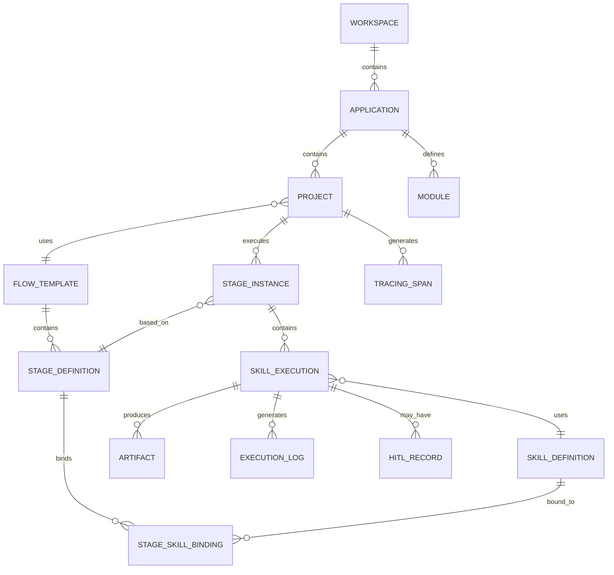
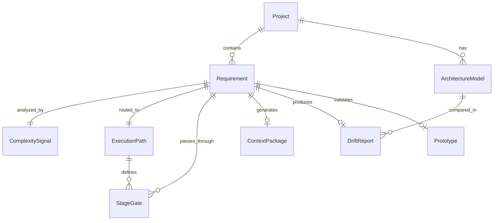

# 00 - 需求总览

> 版本：PRD-000 v2.0-patch2
> 状态：**Frozen** (Gate 1 已通过)
> 作者：AI Product Manager
> 评审人：用户
> 日期：2026-06-01
> 冻结时间：2026-06-01T11:37:00+08:00
>
> **修改记录**：
> | 版本 | 日期 | 修改人 | 修改内容 |
> |------|------|--------|----------|
> | v2.0 | 2026-06-01 | AI Agent | 基于 brainstorming v2.0 重构：模板弱关联策略、产物 Git 快照、C4 DSL 混合生成模式、用户故事合并；移除 OpenHands Docker 外部依赖；更新核心实体关系与里程碑 |
| v2.0-patch1 | 2026-06-01 | AI Agent | 恢复审查功能（US-009 P0 + REVIEW_PENDING 状态机 + 6 个 P0 需求）；恢复 C4 L3/L4 自动生成与反向代码定位为 P0；补回 Stage 内 Skill 角色规则（BR-020~022）；MVP 时间调整为 W1-W10 |
| v2.0-patch2 | 2026-06-01 | AI Agent | 扩展 Wireframe 页面类型至 7 种（列表/详情/仪表盘/表单/弹窗/搜索/向导）；新增 US-017 + REQ-P0-040（需求草图生成）；更新 RTM |
> | v1.4 | 2026-05-31 | AI PM | 扩展 MVP 范围：引入 GTPlanner V2 架构升级交互层，新增复杂度路由面板（US-011）、C4 架构穿透浏览（US-012）、架构漂移检测展示（US-013） |
> | v1.0 | 2026-05-31 | AI PM | 初始版本，包含 6 个用户故事、15 个 P0 需求、3 个 P1 需求 |

### 冻结标准（Freeze Criteria）

| 检查项 | 通过标准 | 责任人 |
|--------|----------|--------|
| 需求完整性 | 所有 P0 需求配备 GWT 验收标准，RTM 无悬空需求 | PM |
| 数据一致性 | 全文 Skill 数量/用户容量/性能指标等口径统一，无跨文件矛盾 | PM |
| 技术可行性 | Tech Lead 确认所有 P0 需求在 MVP 资源内可交付，无技术约束越界 | TL |
| 业务规则闭环 | 全局业务规则通过冲突仲裁检查，无逻辑死锁 | TL |
| 评审签字 | 产品负责人、技术负责人两方书面确认 | 两方 |

**冻结后修改流程**：
1. 升级版本号（v2.0 -> v2.1）
2. 在修改记录中标注影响范围（哪些下游文档需同步更新）
3. 重新执行 Freeze Criteria 评审

---

## 2. 执行摘要（Executive Summary）

| 项目 | 内容 |
|------|------|
| **产品名称** | SDLC Visualizer（Arsitect 可视化驾驶舱） |
| **问题** | 超级个体使用 AI 辅助开发时，AI Skill 执行过程黑盒化：产物散落文件系统、阶段进度不可见、关键 Gate 容易遗漏，导致项目失控与重复劳动。 |
| **解决方案** | 本地单机可视化驾驶舱 + Skill Flow 编排引擎 + GTPlanner V2 内置：动态导入 Skill 生成拓扑画布，基于五维度规模评估自动路由 Trivial/Light/Standard/Deep 四级执行路径，一键触发 Kimi CLI 执行（统一采用 PocketFlow prep-exec-post 三阶段生命周期），实时同步状态与产物，Gate 节点 AI 辅助自检确认，产物自动 Git 快照支持 diff/回滚。 |
| **关键指标** | 单项目端到端周期可视化覆盖率 100%（MVP）；Gate 自检确认耗时 < 30 秒（MVP）；产物 Git 快照覆盖率 100%（MVP） |
| **目标用户** | 超级个体（独立开发者、全栈自由职业者）、小型团队 Tech Lead |
| **资源需求** | MVP 8-10 周 / 2-3 人团队（1 前端 + 1 后端 + 0.5 设计） |
| **关键风险** | ① GTPlanner V2 内置实现（C4 DSL 解析 + 复杂度路由 + 漂移检测）工作量超预期，挤压核心可视化功能；缓解：C4 首期覆盖 L1/L2/L3/L4 四级（L3/L4 基于概要设计文档推断），复杂度路由基于规则引擎，漂移检测 P1 后实现。② Kimi CLI 进程级执行难以提供实时中间状态，画布"假死"感；缓解：预期进度条 + 产物增量监听 + 实时日志面板。 |

---

## 3. 背景与问题

### 3.1 业务痛点（量化）

当前超级个体使用 AI（如 Kimi CLI、Claude Code）辅助软件开发时，面临系统性"过程黑盒"问题：

- **工具碎片化**：平均在 IDE、命令行、文档编辑器、文件管理器之间切换 **7+ 次/小时**，上下文切换成本占工作时间的 15-20%。
- **进度不可见**：AI 执行一个 Skill（如 `prd-generation`）可能耗时 10-30 分钟，期间开发者无法感知执行进度、中间产物生成情况、是否卡在某一子步骤。
- **产物管理混乱**：AI 生成的设计文档、接口契约、测试报告散落在 `openspec/changes/` 目录下，缺乏统一浏览、版本追溯和 diff 对比能力。
- **Gate 遗漏风险**：Arsitect 规范要求四道人工闸门（Gate-1/2.5/2/3），但在命令行模式下，开发者容易在 AI 的连续输出中忽略关键的"请确认是否进入下一阶段"节点，导致无规格编码或未经审批直接上线。
- **规模适配缺失**：不同规模项目（简单脚本 vs 微服务架构）缺乏差异化的执行策略，开发者不知道"这个项目的 SDLC 该走到哪一步"。
- **历史无沉淀**：已完成项目的阶段耗时、返工原因、常见失败模式没有结构化记录，无法指导后续项目优化。

### 3.2 竞品格局

| 竞品名称 | 核心优势 | 本系统差异化策略 | 功能覆盖对比 |
|----------|----------|------------------|--------------|
| **Dify** | 低代码 AI 应用构建平台，可视化 Prompt 编排，支持多模型 | Dify 聚焦"AI 应用构建"，无 SDLC 语义；本系统聚焦"AI 辅助软件开发全生命周期管理"，以 Skill 为原子节点 | 落后（AI 编排深度）/ 领先（SDLC 语义覆盖） |
| **CrewAI + CrewAI Studio** | 角色化多 Agent 编排，`flow.plot()` 可视化，企业自动化 | CrewAI 面向通用自动化任务，无软件交付阶段概念；本系统内置 Draft/Active 双态、四道 Gate、HITL Waiting 等软件工程纪律 | 落后（软件工程纪律）/ 领先（通用 Agent 灵活性） |
| **LangGraph + LangGraph Studio** | 图状态机编排，Time-travel 调试，生产级可观测性 | LangGraph Studio 是调试/检查工具，非项目管理平台；本系统面向"项目交付管理"，提供里程碑、Gate 审批、产物浏览器 | 落后（项目治理）/ 领先（底层编排灵活性） |
| **Jira / Linear** | 成熟的任务跟踪、看板、报表、权限体系 | Jira 管理"人完成的任务"，本系统管理"AI 执行的 Skill"；提供 AI 产物实时渲染、自动状态同步、质量门禁结果展示 | 落后（AI 执行可视化）/ 领先（通用项目管理） |
| **ChatDev** | 端到端 AI 软件开发（Waterfall 模型），多 Agent 角色协作 | ChatDev 是全自动闭环，无人工干预节点；本系统强调"AI 执行 + 人工把关"的协作模式，每个关键阶段必须人工确认 | 落后（人机协作）/ 领先（全自动闭环） |

### 3.3 替代方案与决策

| 方案 | 描述 | 放弃原因 | 保留价值 |
|------|------|----------|----------|
| A. 现有工具整合路线 | 在 Jira/Notion 中通过插件/脚本整合 Arsitect 产物，手动同步进度 | Jira 无 AI Skill 语义，无法解析 SKILL.md Frontmatter 和产物结构；Notion 数据库无法表达 DAG 依赖关系 | 作为 Plan B：若用户已有 Jira 体系，未来可提供只读同步插件 |
| B. Dify / CrewAI 平台扩展路线 | 在 Dify/CrewAI 上扩展 SDLC 模块，利用其可视化编排能力 | 平台无软件交付阶段概念，Draft/Active 双态、Gate 审批、产物基线化等核心机制需从零构建，适配成本 > 8 周 | 学习其 AI 编排引擎设计和可视化交互模式 |
| C. 现状维持 | 继续用命令行 + 文件管理器手动管理 Arsitect 项目 | 过程黑盒、产物散落、Gate 遗漏问题持续存在；随着 Skill 数量增加，手动管理成本指数上升 | 验证痛点真实性的对照组；证明市场存在刚性需求 |
| **D. 独立平台（选定方案）** | 项目级可视化驾驶舱 + 内置 Skill Flow 编排引擎 + GTPlanner V2 内置 + 单人 Gate 自检 + 产物 Git 快照 | — | 唯一同时解决"可视化 + 编排 + 审批 + 产物管理 + 规模适配"的方案，且与 Arsitect 生态深度兼容 |

### 3.4 机会窗口

- **技术窗口**：2026 年 AI Agent 编排框架（LangGraph、CrewAI、MCP）趋于成熟，但均面向通用自动化，软件工程全生命周期管理仍是蓝海。MCP 标准化使 Skill 工具调用可移植，降低了多平台适配的长期成本。
- **市场窗口**：超级个体（独立开发者、全栈自由职业者）群体在 2025-2026 年快速增长，对"一人即团队"的效率工具有强烈付费意愿。
- **生态窗口**：Arsitect 项目已建立 41 个 Skill 的规范体系，但缺乏可视化消费层。本系统可作为 Arsitect 生态的"官方驾驶舱"，形成标准 Skill + 标准可视化工具的协同效应。

### 3.5 假设登记册（Assumption Register）

| 假设编号 | 假设描述 | 置信度 | 推翻条件 | 责任人 | 验证方式 |
|----------|----------|--------|----------|--------|----------|
| ASM-001 | 目标用户本地已安装 Kimi CLI 且可正常执行 | 高 | CLI 未安装或版本不兼容 | Tech Lead | W1 安装测试 + 正向渲染验证 |
| ASM-002 | Skill 产物（Markdown/YAML）体积可控，单文件 < 10MB | 中 | 产物体积过大导致渲染卡顿 | PM | 产物分页加载 + 大文件警告 |
| ASM-003 | 本地 Git 快照对用户无感知，不增加认知负担 | 中 | 用户反馈 Git 操作复杂或磁盘占用过高 | Tech Lead | MVP 用户反馈调研 |
| ASM-004 | C4 DSL 自动生成准确率 >= 70%（基于概要设计文档） | 中 | 误判率连续 2 周 > 30% | PM | US-012 上线后统计生成准确率 |
| ASM-005 | SKILL.md 中的上下游 Skill 引用可被自动解析，准确率 >= 80% | 中 | 解析准确率连续低于 80% | Architect | W2 全量 Skill 解析测试 |
| ASM-006 | 管理员预制模板（Trivial/Light/Standard/Deep）覆盖 90% 以上项目场景 | 中 | 用户频繁自定义或绕过模板 | PM | MVP 用户反馈调研 |
| ASM-007 | 用户接受"文件系统优先"的冲突策略，不因外部覆盖丢失平台编辑而投诉 | 中 | 超过 30% 用户反馈丢失编辑内容 | PM | MVP 用户反馈调研 |
| ASM-008 | PocketFlow 三阶段生命周期（prep-exec-post）对 Skill 执行效率无显著负面影响 | 中 | 用户反馈执行耗时增加 > 20% | Tech Lead | W3 性能基准测试 |
| ASM-009 | 五维度规模评估的 Triage 初估准确率 >= 60%（ Calibrate 精修后 >= 80%） | 中 | Triage 误判率连续 > 40% | PM | 统计 20 个项目评估偏差 |

### 3.6 项目规模评估体系（Skill-SizeEstimate）

#### 3.6.1 五维度评分模型

项目规模评估基于五维度加权评分，在 **Draft → Active** 转换中分两次执行：

| 维度 | 关键词/模式 | 推断规则 | 权重 |
|------|------------|----------|------|
| **模块数** | 用户系统、订单、支付、权限、内容管理 | 1 业务域 ≈ 1 模块；"等"上浮 20% | **30%** |
| **接口数** | 对接、调用、API、同步、回调、推送 | 2 模块交互 ≈ 3-5 接口；开放平台 ×2 | **20%** |
| **页面数** | 后台、管理端、H5、小程序、大屏 | 每模块 1-3 页；报表/大屏 +2 | **15%** |
| **技术复杂度** | 微服务、高并发、AI、分布式 | 1 无 / 2 低 / 3 中 / 4 高 / 5 极高 | **20%** |
| **风险等级** | 支付、资金、隐私、医疗、监管 | 1 无 / 2 低 / 3 中 / 4 高 / 5 极高 | **15%** |

**计算公式**：
```
规模得分 = (模块数 × 30%)
         + (接口数 × 0.8 × 20%)
         + (页面数 × 0.4 × 15%)
         + (技术复杂度系数 × 20%)
         + (风险等级系数 × 15%)
```

输出三档：乐观（下限）、预期（中值）、保守（上限）。定级规则：以保守得分定档。

#### 3.6.2 规模分级与复杂度路由

| 规模 | 保守得分 | 典型描述 | 复杂度路径 | 执行路径差异 |
|------|----------|----------|-----------|-------------|
| **XS** | ≤ 10 | 改按钮、改校验、调超时 | **Trivial** | hotfix → 直接生成 Context Package，跳过 C4 建模、原型验证 |
| **S** | 11~22 | 内部小工具、数据导入、单模块后台 | **Light** | 轻量架构草图（C4 Container 一层）→ 直接生成，跳过深度技术调研 |
| **M** | 23~40 | 订单模块、权限 CMS、3 个业务域 | **Standard** | 完整流水线：需求探索 → 概要设计 → 接口契约 → 编码 → 测试 |
| **L** | 41~70 | 核心链路重构、AI 平台多子系统 | **Deep** | 完整流水线 + C4 架构穿透 + 架构漂移检测 |
| **XL** | > 70 | 新一代核心系统、中台改造 | **Deep** | 拆为多个 M 级子项目，各自走完整流水线 |

#### 3.6.3 两次评估机制（Triage → Calibrate）

- **Triage（初估）**：Draft 项目创建后，输入业务目标即自动执行。纯关键词模式匹配，精度低，用于判断 Draft 是否值得继续。
- **Calibrate（精修）**：Draft 阶段预立项分析 Skill 完成后、进入 Active 契约签订前执行。用实际产出（模块清单、接口数、页面数）替换初估推断值，精度高，驱动流程模板选择和时间盒设定。

#### 3.6.4 复杂度路由矩阵（Coco 式）

| 复杂度 | 触发信号 | 平台执行路径 | 跳过的阶段 |
|--------|----------|-------------|-----------|
| **Trivial** | 单文件修改、bug fix、字段调整 | hotfix → 直接生成产物 → 可选快速 Gate | 跳过需求探索、C4 建模、原型验证 |
| **Light** | 1-3 文件、单页面、单接口 | 轻量设计 → C4 Container 一层 → 直接生成 | 跳过深度技术调研、兼容性验证 |
| **Standard** | 新模块、多接口、有状态机 | 完整流水线（9 Stage） | 无跳过 |
| **Deep** | 新领域、核心系统重构、跨服务架构 | 完整流水线 + 架构漂移检测 + 反向验证 | 增加反向验证阶段 |

---

## 4. 目标与成功指标（SMART）

### 4.1 北极星指标

| 指标 | 当前基线 | MVP 目标 | 测量方法 | 数据来源 | 验证方式 |
|------|----------|----------|----------|----------|----------|
| 单项目端到端可视化覆盖率 | 0%（命令行无可视化） | 100%（Draft -> Archive 所有阶段可见） | 统计项目生命周期中已可视化阶段数 / 总阶段数 | 平台数据库 `project_stages` 表 | 在 3 个真实项目中全链路验证 |
| Gate 自检确认耗时 | N/A（无统一 Gate 机制） | < 30 秒/次 | 从 Gate 进入 Waiting 态到用户提交结论的耗时 | 数据库 `gate_decisions` 表的 `pending_at` 与 `decided_at` | 模拟 20 次 Gate 审批，统计平均耗时 |
| Skill 执行状态同步延迟 | N/A | < 5 秒（轮询模式） | 从 CLI 产物生成到画布节点状态变更的端到端延迟 | 平台日志 `execution_logs` | 连续执行 50 次 Skill，测量状态推送延迟 |
| 产物渲染正确率 | 0%（需手动打开文件） | 100%（Markdown + Mermaid + YAML 正确渲染） | 测试产物渲染成功的比例 | 平台 `artifacts` 表 + 前端渲染日志 | 测试 20 份真实 AI 产物 |
| 产物 Git 快照覆盖率 | 0% | 100% | 所有产物文件是否纳入 Git 快照管理 | 数据库 `artifact_versions` 表 | 检查 10 个项目产物快照完整性 |
| 规模评估准确率 | N/A | >= 80% | 五维度评估输出等级与实际项目规模的一致性 | `size_estimate` 表 | 统计 20 个项目评估偏差 |
| 模板偏离率 | N/A | < 30% | 实际执行路径与初始推荐路径不一致的 Stage 数 / 总 Stage 数 | `project_stages` 表的 `template_matched` 字段 | 连续统计 4 周 |

### 4.2 OKR

**Objective**：让超级个体的 AI 辅助开发过程完全可见、可控、可沉淀
- **KR1**：MVP 阶段支持至少 10 个 Skill 的动态导入与拓扑渲染（P0）
- **KR2**：Gate 自检确认平均耗时 < 30 秒，用户满意度 >= 4/5（P0）
- **KR3**：单项目全生命周期产物可在平台内 100% 浏览，无需离开平台打开文件管理器（P0）
- **KR4**：支持已完成项目的阶段耗时对比与返工热力图（P1）
- **KR5**：产物 Git 快照支持 diff 对比与一键回滚（P0）
- **KR6**：规模评估五维度机制覆盖 100% 新建项目，评估准确率 >= 80%（P0）

### 4.3 非目标（Non-goals）

| 编号 | 非目标 | 原因 |
|------|--------|------|
| NG-001 | 本期不解决多 Workspace 并发性能，只保证单 Workspace/单机可用 | MVP 面向超级个体，单机场景已覆盖 90% 使用场景；并发优化预计增加 3 周工作量，在 P1 评估 |
| NG-002 | 本期不做移动端适配 | 目标用户为桌面端重度使用者，核心交互（拓扑画布、产物浏览器）在移动端体验极差；移动端需求在 P2 评估 |
| NG-003 | 本期不做通用项目管理（任务分配、工时统计、甘特图） | 与 Jira/Linear 直接竞争无差异化优势；平台聚焦"AI Skill 执行可视化"这一独特场景 |
| NG-004 | 本期不引入多 AI 平台适配（Claude/Cursor/MCP） | MVP 聚焦 Kimi CLI 单一平台验证核心体验；Adapter 接口已预留，多平台实现在 P2 引入 |
| NG-005 | 本期不做产物自动同步到远程 Git 仓库的双向同步 | MVP 为本地单机，产物存储于本地文件系统；Git 快照仅用于本地版本管理，远程同步在 P1 作为可选插件引入 |
| NG-006 | 本期不做 C4 架构图的 PlantUML 格式输出 | MVP 优先支持 Mermaid/SVG 渲染；PlantUML 格式在 P1 评估 |
| NG-007 | 本期不做架构漂移检测的自动修复建议 | 漂移检测首期仅展示 diff 和告警，不提供自动修复；自动修复在 P1 后评估 |
| NG-008 | 本期不做 CI/CD 架构文档即代码流水线 | GitHub Actions 自动渲染架构图属于 DevOps 集成，本期聚焦核心可视化与编排；CI 集成在 P2 评估 |
| NG-010 | 本期不做 C4 InterFlow 架构查询引擎（JSONPath-like 影响分析） | 架构查询属于高级架构治理功能，本期仅支持基础 C4 DSL 生成与渲染；查询引擎在 P1 后评估 |

---

## 5. 用户画像与场景

### 5.1 Persona 卡片

| 角色 | 职责 | 核心痛点 | 使用频率 | 技术熟练度 |
|------|------|----------|----------|-----------|
| **独立开发者（超级个体）** | 全栈开发、产品迭代、自我项目管理 | AI 执行过程黑盒，产物散落，Gate 容易遗漏 | 每日 | 高 |
| **Tech Lead（小团队）** | 技术选型、架构决策、代码审查 | 无法实时看到团队成员的 AI 产物状态，审批与执行脱节 | 每周 3-4 次 | 高 |
| **自由职业项目经理** | 客户沟通、进度汇报、交付管理 | 客户要求看开发进度，但传统截图/文字报告效率低 | 每周 2-3 次 | 中 |

### 5.2 Jobs to Be Done（JTBD）

| 优先级 | Job Statement |
|--------|---------------|
| 1 | When 我开始一个新的软件项目时，I want to 在一个平台内看到从需求到上线的完整阶段地图，so I can 确保每一步都按规范执行，不遗漏关键节点。 |
| 2 | When AI 正在执行一个 Skill（如生成设计文档）时，I want to 实时看到执行进度和已生成的产物，so I can 判断是否需要干预或提前准备下游工作。 |
| 3 | When 项目到达一个关键 Gate（如架构评审）时，I want to AI 帮我自动总结风险点和待补充项，so I can 在 30 秒内做出是否继续的决策。 |
| 4 | When 项目完成后，I want to 查看历史项目的阶段耗时和返工原因，so I can 优化下一个项目的执行策略。 |
| 5 | When 我发现项目规模与初始预期不符时，I want to 灵活调整执行路径而不被固定模板束缚，so I can 避免小题大做或遗漏关键步骤。 |

---

## 6. 非功能需求（NFR）

### 6.1 性能（含测试场景）

| 指标 | 目标值 | 测试场景 | 行业对标档位 |
|------|--------|----------|-------------|
| 首屏加载时间 | < 2s（P95） | 首页冷启动，缓存未命中，SQLite 本地查询 | 中 |
| 拓扑图交互帧率 | >= 60fps | 典型节点数（20-30 个）拓扑图拖拽、缩放、筛选 | 高 |
| 产物渲染时间 | < 500ms | Markdown 文档（< 5000 字）首次渲染 | 高 |
| Skill 状态同步延迟 | < 5s（轮询模式） | 从 CLI 产物生成到画布节点变色 | 中 |
| Gate 审批通知推送 | < 1s | WebSocket 本地推送 | 高 |
| 数据库查询响应 | < 200ms（P95） | 单项目全阶段数据加载 | 高 |
| Git 快照创建耗时 | < 1s | 产物文件写回时自动提交 | 高 |

### 6.2 安全

- **数据存储**：所有产物和项目数据存储于用户本地文件系统，不上传至任何云端服务。
- **密钥管理**：平台本身不存储 LLM API Key，Kimi CLI 的认证由 CLI 自身管理。
- **执行沙箱**：Kimi CLI Adapter 仅允许执行白名单内的命令，禁止任意 Shell 执行。
- **产物隔离**：不同项目的工作目录物理隔离，防止并行 Skill 间文件污染。
- **Git 快照安全**：Git 快照仓库位于项目本地目录内（`.git/`），不暴露至外部网络。

### 6.3 兼容性与可维护性

- **浏览器支持**：Chrome / Edge / Firefox / Safari 最新 2 个主版本。
- **无障碍**：MVP 不满足 WCAG 2.1 AA 标准，仅支持桌面端；P1 目标支持键盘导航和高对比度模式。
- **产物格式兼容**：支持 Markdown、YAML、JSON、Mermaid、OpenAPI/Swagger 的渲染与预览。
- **Skill 规范兼容**：兼容 Arsitect SKILL.md + meta.json 规范，支持 Frontmatter 动态解析。

### 6.4 行业对标档位

本系统 NFR 整体处于**中高档位**：性能指标对标 Linear（轻量快速），安全性对标本地优先工具（Obsidian、Cursor），兼容性对标现代 Web 应用基线。

---

## 7. 数据需求

### 7.1 指标体系

| 指标名称        | 定义                                      | 数据来源                                            | 计算逻辑                                 | 更新频率  |
| ----------- | --------------------------------------- | ----------------------------------------------- | ------------------------------------ | ----- |
| 单项目端到端周期    | Draft -> Archive 全部节点通关的耗时              | `progress.md` 的 `start_time` 与 `complete_time`  | `complete_time - start_time`         | 实时    |
| Gate 自检确认耗时 | Gate 进入 Waiting 态到用户提交结论的耗时             | `gate_decisions` 表的 `pending_at` 与 `decided_at` | `decided_at - pending_at`            | 实时    |
| Skill 执行成功率 | 执行成功次数 / 总执行次数                          | `executions` 表的 `status`                        | `count(status='Success') / count(*)` | 实时    |
| 阶段平均耗时      | 同一阶段在历史项目中的平均执行时间                       | `executions` 表的 `start_time` 与 `end_time`       | `avg(end_time - start_time)`         | 每小时聚合 |
| 返工率         | 因 Gate Reject 或失败重试导致的阶段重跑次数 / 总阶段执行次数  | `executions` 表的 `retry_count`                   | `sum(retry_count) / count(*)`        | 每小时聚合 |
| 活跃项目数       | 当前处于非 Archived 状态的项目数量                  | `projects` 表的 `status`                          | `count(status != 'Archived')`        | 实时    |
| 产物 Git 快照数  | 单个项目产物文件的历史版本总数                         | `artifact_versions` 表                           | `count(*)`                           | 实时    |
| 模板偏离率       | 实际执行路径与初始模板推荐路径不一致的 Stage 数 / 总 Stage 数 | `project_stages` 表的 `template_matched` 字段       | `count(matched='false') / count(*)`  | 实时    |

### 7.2 埋点需求

| 事件                | 触发时机          | 属性                                                   | 用途                 |
| ----------------- | ------------- | ---------------------------------------------------- | ------------------ |
| project_create    | 用户创建项目        | project_id, template_type, created_at                | 统计项目创建频率与模板偏好      |
| skill_execute     | 用户点击"执行"按钮    | skill_id, project_id, node_id, trigger_type          | 统计 Skill 执行频率与触发方式 |
| gate_decision     | 用户提交 Gate 决策  | gate_id, project_id, decision, duration_ms           | 统计 Gate 通过率和平均耗时   |
| artifact_view     | 用户打开产物文件      | artifact_id, project_id, format, load_time_ms        | 统计产物浏览偏好和加载性能      |
| artifact_edit     | 用户在平台内编辑产物并保存 | artifact_id, project_id, edit_type                   | 统计产物编辑频率           |
| template_override | 用户偏离模板推荐路径    | project_id, stage_id, original_template, actual_path | 统计模板适用性和偏离原因       |
| c4_generate       | 平台自动生成 C4 DSL | project_id, accuracy_score, manual_override          | 统计 C4 自动生成准确率      |

### 7.3 数据权限

- **本地隔离**：所有数据（SQLite、产物文件、Git 快照）存储于用户本地文件系统，无云端同步。
- **项目级隔离**：不同项目的数据物理隔离，跨项目数据访问需显式导入/引用。
- **角色可见范围（P1）**：MVP 阶段仅超级个体，拥有全部权限。P1 引入多用户后，按角色分配项目级读写权限。

---

## 8. 核心实体关系（ER 图）

### 8.1 实体定义

| 实体 | 定义 | 主数据/事务数据 | 关键属性 | 驱动指标 |
|------|------|----------------|----------|----------|
| **Workspace** | 团队/部门的研发资源边界，含多个应用 | 主数据 | id, name, member_list, permission_baseline | — |
| **Application** | 长期存在的产品或系统，有独立用户群体和技术栈 | 主数据 | id, name, tech_stack, module_list, history_inheritance | 应用级研发管理费 |
| **Project** | 应用的一次迭代/变更，有明确交付目标和截止日期（1~8 周） | 主数据 | id, application_id, name, status(Draft/Active/Archived/Cancelled), complexity_path, created_at | 活跃项目数、端到端周期 |
| **Module** | 应用内的功能子域，可独立设计、独立交付 | 主数据 | id, application_id, name, independent_milestone, scope_anchor | 模块级交付成功率 |
| **Template** | 管理员预制的复杂度路径模板（Trivial/Light/Standard/Deep） | 主数据 | id, name, complexity_level, stage_bindings(JSON), skipped_stages(JSON), is_system | 模板使用频率、模板偏离率 |
| **Stage** | SDLC 标准阶段（需求探索/概要需求/详细需求...） | 主数据 | id, name, sequence, gate_id | 阶段平均耗时 |
| **Skill** | AI 能力单元，由 SKILL.md + meta.json 定义 | 主数据 | id, name, directory_path, frontmatter_parsed, upstream_skills, downstream_skills, execution_pattern | Skill 执行成功率 |
| **ProjectStage** | 项目与阶段的实例化关系（运行时状态） | 事务数据 | id, project_id, stage_id, status, start_time, end_time, retry_count, template_matched | 返工率、阶段耗时 |
| **ModuleInstance** | 项目内模块的实例化执行记录 | 事务数据 | id, project_id, module_id, status, milestone_deadline | 模块级里程碑达成率 |
| **Artifact** | Skill 执行生成的产物文件 | 事务数据 | id, project_stage_id, file_path, file_hash, format, size_bytes | 产物渲染正确率 |
| **ArtifactVersion** | 产物文件的 Git 快照版本 | 事务数据 | id, artifact_id, commit_hash, commit_message, created_at, diff_stats | 产物 Git 快照数 |
| **GateDecision** | Gate 节点的审批决策记录 | 事务数据 | id, project_stage_id, gate_id, decision(Passed/Blocked), summary_text, duration_ms, created_at | Gate 自检确认耗时 |
| **ExecutionLog** | Skill 执行的日志记录 | 事务数据 | id, project_stage_id, skill_id, status, stdout_snapshot, error_message, start_time, end_time | Skill 执行成功率 |
| **SizeEstimate** | 项目规模评估记录（Triage/Calibrate） | 事务数据 | id, project_id, estimate_type, dimension_details(JSON), optimistic_score, expected_score, conservative_score, level, confidence | 规模评估准确率 |

### 8.2 ER 图



### 8.3 数据血缘说明

- **Workspace / Application / Project / Module** 四层模型构成平台的核心数据骨架。Project 必须绑定 Application，Module 有独立里程碑状态。
- **Project.status** 驱动 Dashboard 的"活跃项目数"卡片。
- **ProjectStage.start_time / end_time** 驱动"阶段平均耗时"和"单项目端到端周期"。
- **ModuleInstance.milestone_deadline** 驱动模块级里程碑达成率和独立交付统计。
- **GateDecision.duration_ms** 直接驱动"Gate 自检确认耗时"指标。
- **Artifact.file_hash** 用于检测外部文件系统变更，触发双向同步冲突提示。
- **ArtifactVersion.diff_stats** 驱动产物 diff 对比功能的数据来源。
- **SizeEstimate.conservative_score** 和 **level** 驱动复杂度路径推荐和模板匹配。

---

## 9. 里程碑与发布标准

### 9.1 里程碑

| 阶段 | 时间 | 交付物 | 成功标准 |
|------|------|--------|----------|
| **Phase 1（MVP）** | W1-W10 | 项目工作台、SDLC 画布（拓扑/泳道/列表）、阶段详情面板（含审查 Tab）、产物浏览器（含行内批注/diff/版本回滚）、审批中心、Skill 调度（Kimi CLI，PocketFlow 三阶段）、Gate 服务（含旁路审批）、产物服务（含 Git 快照）、模板引擎（Trivial/Light/Standard/Deep 四级）、五维度规模评估（Triage/Calibrate）、C4 L1/L2/L3/L4 自动生成与层级穿透、反向代码定位、**OpenUI 原型验证**、**WireframeEngine 领域感知线框图**（7 种页面类型）、**PageSpec 需求草图生成**、**产物审查与重新生成** | 3 个真实项目全链路验证通过；Gate 平均耗时 < 30s；产物 100% 可渲染；规模评估准确率 >= 80%；原型验证覆盖 >= 80% 页面；审查流程覆盖率 100% |
| **Phase 2（P1）** | W11-W18 | 多用户支持（Tech Lead/开发者角色）、历史回溯（时间线/对比/热力图）、架构漂移检测展示、监控看板、PostgreSQL 迁移、模块级里程碑独立推进、远程 Git 同步插件、C4 InterFlow 架构查询引擎 | 支持 3-5 人小团队协作；漂移检测准确率 >= 70%；模块可独立设计交付 |
| **Phase 3（P2）** | W19-W26 | 多 AI 平台适配（Claude/Cursor/MCP）、CI/CD 架构文档即代码、移动端只读适配、Skill 市场/模板订阅 | 平台可插拔 AI 平台 >= 2 个；原型验证与架构双向绑定 |

### 9.2 可执行 Release Criteria（MVP）

| 检查项 | 验收方法 | 通过标准 | 责任人 |
|--------|----------|----------|--------|
| 核心链路闭环 | 端到端测试 | 从项目创建 -> 需求探索 -> Gate-1 -> 概要设计 -> Gate-2 -> 编码 -> 测试 -> Gate-3 -> 发布 -> 归档，全程可在平台内完成 | QA |
| P0 需求覆盖率 | RTM 审查 | 所有 P0 需求对应用户故事均配备 GWT 验收标准，无 BLOCKER 级悬空需求 | PM |
| Gate 体验 | 用户测试 | 20 次模拟 Gate 审批，平均耗时 < 30 秒，用户满意度 >= 4/5 | Designer |
| 性能基线 | 自动化测试 | 首屏 < 2s、拓扑 60fps、产物渲染 < 500ms、状态同步 < 5s | Tech Lead |
| 产物快照 | 功能测试 | 所有产物文件自动生成 Git 快照，支持 diff 对比和一键回滚 | Tech Lead |
| 数据一致性 | 文档审查 | 全文 Skill 数量/用户容量/性能指标等口径统一，无跨文件矛盾 | PM |

---

## 10. 假设、风险与决策日志

### 10.1 风险表

| 风险 ID | 描述 | 级别 | 缓解措施 | 触发条件 |
|---------|------|------|----------|----------|
| R-001 | GTPlanner V2 内置实现（C4 DSL 解析 L1/L2/L3/L4 + 复杂度路由 + 漂移检测）工作量超预期，挤压 MVP 核心可视化功能 | 高 | C4 渲染覆盖 L1/L2/L3/L4 四级，L3/L4 基于概要设计文档推断（非代码级静态分析）；复杂度路由基于规则引擎；漂移检测 P1 后实现；预留 Structurizr 降级方案 | C4 自动生成开发周期超过 4 周 |
| R-010 | 审查流程（REVIEW_PENDING + 批注 + 重新生成）增加用户操作负担，降低执行效率 | 中 | 审查面板极简设计；允许一键"无批注通过"；批量重新生成减少重复操作 | 用户反馈审查流程繁琐占比 > 20% |
| R-011 | C4 L3/L4 自动生成准确率不足（基于概要设计文档推断 Component/Code 级元素） | 中 | 允许用户手动覆盖 L3/L4 DSL；自动生成准确率低于 60% 时降级为仅 L1/L2 | L3/L4 误判率连续 > 40% |
| R-002 | Kimi CLI 进程级执行难以提供实时中间状态，画布"假死"感 | 高 | 设计三级伪状态；预期进度条；产物增量监听；实时日志面板 | 用户反馈"长时间无反馈"占比 > 20% |
| R-003 | SKILL.md 自动解析上下游 Skill 引用准确率不足，导致 DAG 构建错误 | 中 | 前置校验 + 容错渲染；提供可视化 DAG 编辑器供用户手动修正 | 解析准确率连续低于 80% |
| R-004 | SQLite 在频繁写入执行日志和状态快照时可能成为瓶颈 | 中 | 日志批量写入、状态变更 debounce、预留 PostgreSQL 迁移路径 | 查询响应 > 1s |
| R-005 | 超级个体对"四道 Gate"产生流程负担，反而降低效率 | 中 | Gate UI 极简设计；允许关闭非关键 Gate（风险自负） | 用户反馈流程繁琐占比 > 15% |
| R-006 | 产物文件与数据库状态不一致（外部修改导致） | 低 | 文件哈希校验 + 手动刷新按钮 + 文件系统事件监听 | 检测到哈希不一致次数 > 10 次/天 |
| R-007 | Git 快照对二进制大文件不友好，磁盘占用过高 | 低 | 单文件 > 10MB 时不纳入 Git 快照，仅保留当前版本 | 用户反馈磁盘占用问题 |
| R-008 | OpenUI 服务部署增加本地环境复杂度（需 Docker） | 中 | 提供一键启动脚本；若 Docker 不可用则降级为 Wireframe 静态预览 | MVP 用户反馈部署问题 |
| R-009 | WireframeEngine 领域映射准确率不足，导致线框图与 C4 模型不一致 | 中 | 允许用户手动修正映射关系；支持 7 种页面类型（列表/详情/仪表盘/表单/弹窗/搜索/向导）；映射误判率 > 30% 时降级为基础布局 | 映射误判率连续 > 30% |

### 10.2 关键决策日志

| 决策点 | 选择 | 理由 | 决策人 | 推翻条件 |
|--------|------|------|--------|----------|
| 产品定位 | 独立产品对外发布，当前针对超级个体 | 填补 AI 辅助开发的过程可视化空白 | 用户确认 | 超级个体付费意愿持续低于预期 |
| GTPlanner V2 实现方式 | 内置实现，不依赖外部 Docker | 降低部署门槛，提升启动速度 | 用户确认 | 内置工作量超过 4 周 |
| 模板与项目关系 | 弱关联，模板仅作初始化推荐 | 兼顾标准化与灵活性 | 用户确认 | 模板偏离率连续 > 50% |
| 产物版本管理 | 本地 Git 快照 | 开发者熟悉 Git，天然支持 diff/回滚 | 用户确认 | 用户对 Git 认知负担反馈 > 30% |
| C4 DSL 来源 | 平台自动生成 + 用户手动覆盖 | 降低用户编写 DSL 的负担，保留人工修正空间 | 用户确认 | 自动生成准确率连续 < 50% |
| 用户故事增量 | 合并到现有 US（US-001/US-004） | 避免过度拆分，保持故事地图简洁 | 用户确认 | 合并后 US 粒度过大，验收困难 |
| 部署形态 | 本地单机 | 超级个体优先本地零运维 | 用户确认 | P3 后评估服务器部署 |

---

## 11. 运营与合规

### 11.1 运营计划

- **用户获取**：MVP 阶段以 Arsitect 生态内部推广为主，通过 GitHub Release 和文档引流。
- **用户支持**：提供安装引导文档 + 常见问题 FAQ（内置在平台 Help 面板）。
- **反馈闭环**：平台内嵌"反馈"按钮，收集用户痛点直接流入下一变更的 brainstorming。

### 11.2 合规声明

- **隐私**：所有数据本地存储，无云端上传，符合 GDPR 数据最小化原则（本地场景下无跨境传输风险）。
- **审计**：Gate 决策、产物修改、模板变更等关键操作记录至 `human-decisions.md`，支持事后审计。
- **无障碍**：MVP 不满足 WCAG 2.1 AA，P1 目标支持键盘导航和高对比度模式。

---

## 12. 技术约束（PRD 层）

- **执行引擎绑定**：MVP 仅支持 Kimi CLI 本地调用，Adapter 接口预留未来扩展。
- **Skill 规范假设**：平台假设所有导入的 Skill 符合 Arsitect SKILL.md + meta.json 规范，不兼容非标准 Skill。
- **部署模式**：MVP 为本地单机部署，前端静态 + Python 后端双进程，用户启动后通过浏览器访问。
- **产物目录规范**：产物存储兼容 `openspec/changes/{change}/` 目录结构，便于未来与 Arsitect 仓库互通。
- **Git 依赖**：产物 Git 快照功能依赖用户本地已安装 Git（超级个体场景下通常为默认预装）。

---

## 附录：历史补充内容（来自 docs/ 目录）

> 以下内容来自 docs/ 目录下的历史版本，包含主文档中未覆盖的视角或早期草稿。

> 版本：PRD-000 v1.4-draft
> 状态：Draft
> 作者：AI Product Manager
> 评审人：待指定
> 日期：2026-05-31

### 修改记录

| 版本 | 日期 | 修改人 | 修改内容 |
|------|------|--------|----------|
| v1.3 | 2026-06-01 | AI Agent | 扩展 MVP 范围：引入 GTPlanner V2 架构升级交互层，新增复杂度路由面板（US-011）、C4 架构穿透浏览（US-012）、架构漂移检测展示（US-013），补充假设登记册，升级模块映射至 DR-012 |
| v1.2 | 2026-05-31 | AI PM | 补充 SDLC 阶段（Stage）定义模型：标准 9 阶段、Stage-Skill 绑定（1-n 个，含主/辅助角色）、Stage 合并能力（如概要需求+详细需求+概要设计+详细设计合并） |
| v1.1 | 2026-05-31 | AI PM | 补充规模评估（US-007/REQ-P0-016）和里程碑 Timebox（US-008/REQ-P0-017）两个高优先级需求 |
| v1.0 | 2026-05-31 | AI PM | 初始版本，包含 6 个用户故事、15 个 P0 需求、3 个 P1 需求 |

**冻结后修改流程**：
1. 升级版本号（v1.0 -> v1.1）
2. 在修改记录中标注影响范围（哪些下游文档需同步更新）
3. 重新执行 Freeze Criteria 评审

| 项目 | 内容 |
|------|------|
| **产品名称** | SDLC Visualizer（Arsitect 可视化驾驶舱） |
| **问题** | 超级个体使用 AI 辅助开发时，AI Skill 执行过程黑盒化：产物散落文件系统、阶段进度不可见、关键 Gate 容易遗漏，导致项目失控与重复劳动。 |
| **解决方案** | 本地单机可视化驾驶舱 + Skill Flow 编排引擎：动态导入 Skill 生成拓扑画布，一键触发 Kimi CLI 执行，实时同步状态与产物，Gate 节点 AI 辅助自检确认。 |
| **关键指标** | 单项目端到端周期可视化覆盖率 100%（MVP）；Gate 自检确认耗时 < 30 秒（MVP） |
| **目标用户** | 超级个体（独立开发者、全栈自由职业者）、小型团队 Tech Lead |
| **资源需求** | MVP 6-8 周 / 2-3 人团队（1 前端 + 1 后端 + 0.5 设计） |
| **关键风险** | ① Kimi CLI 进程级执行难以提供实时中间状态，可能导致画布"假死"感；缓解：预期进度条 + 产物增量监听 + 实时日志面板。② C4 InterFlow 社区活跃度低，若停止维护则 AaC 底座失效；缓解：DSL 为标准 YAML 可被其他工具解析，同时评估 Structurizr 备选。③ 复杂度信号误判导致路由错误；缓解：保守阈值 + 人工覆盖机制，MVP 期间默认 Standard 路径积累数据后逐步放开自动路由。 |

- **工具碎片化**：平均在 IDE、命令行、文档编辑器、文件管理器之间切换 **7+ 次/小时**，上下文切换成本占工作时间的 15-20%。
- **进度不可见**：AI 执行一个 Skill（如 `prd-generation`）可能耗时 10-30 分钟，期间开发者无法感知执行进度、中间产物生成情况、是否卡在某一子步骤。
- **产物管理混乱**：AI 生成的设计文档、接口契约、测试报告散落在 `openspec/changes/` 目录下，缺乏统一浏览和版本追溯能力。
- **Gate 遗漏风险**：Arsitect 规范要求四道人工闸门（Gate-1/2.5/2/3），但在命令行模式下，开发者容易在 AI 的连续输出中忽略关键的"请确认是否进入下一阶段"节点，导致无规格编码或未经审批直接上线。
- **历史无沉淀**：已完成项目的阶段耗时、返工原因、常见失败模式没有结构化记录，无法指导后续项目优化。

| 方案 | 描述 | 放弃原因 | 保留价值 |
|------|------|----------|----------|
| A. 现有工具整合路线 | 在 Jira/Notion 中通过插件/脚本整合 Arsitect 产物，手动同步进度 | Jira 无 AI Skill 语义，无法解析 SKILL.md Frontmatter 和产物结构；Notion 数据库无法表达 DAG 依赖关系 | 作为 Plan B：若用户已有 Jira 体系，未来可提供只读同步插件 |
| B. Dify / CrewAI 平台扩展路线 | 在 Dify/CrewAI 上扩展 SDLC 模块，利用其可视化编排能力 | 平台无软件交付阶段概念，Draft/Active 双态、Gate 审批、产物基线化等核心机制需从零构建，适配成本 > 8 周 | 学习其 AI 编排引擎设计和可视化交互模式 |
| C. 现状维持 | 继续用命令行 + 文件管理器手动管理 Arsitect 项目 | 过程黑盒、产物散落、Gate 遗漏问题持续存在；随着 Skill 数量增加，手动管理成本指数上升 | 验证痛点真实性的对照组；证明市场存在刚性需求 |
| **D. 独立平台（选定方案）** | 项目级可视化驾驶舱 + 内置 Skill Flow 编排引擎 + 单人 Gate 自检 | — | 唯一同时解决"可视化 + 编排 + 审批 + 产物管理"的方案，且与 Arsitect 生态深度兼容 |

> 以下假设基于 GTPlanner V2 架构升级方案，在 MVP 期间持续验证。任何假设被推翻时，需触发范围重评估和路由策略调整。

| 假设编号 | 假设描述 | 置信度 | 推翻条件 | 责任人 | 验证方式 |
|----------|----------|--------|----------|--------|----------|
| ASM-001 | C4 InterFlow CLI 可在 Linux/macOS/Windows 稳定运行 | 80% | CLI 在目标 OS 崩溃或输出不兼容 | Tech Lead | W1 安装测试 + 正向渲染验证 |
| ASM-002 | OpenHands Docker 镜像 <= 5GB，启动时间 <= 60s | 75% | 镜像超过 10GB 或启动超过 120s | DevOps | W4 环境基准测试 |
| ASM-003 | 需求复杂度可通过文件数 + 实体数 + 跨服务标记自动判定 | 70% | 误判率连续 2 周 > 30% | PM | US-011 上线后统计路由准确率 |
| ASM-004 | 用户接受外部 Docker 服务作为可选依赖 | 85% | 超过 50% 用户反馈部署太重 | PM | MVP 用户反馈调研 |
| ASM-005 | 现有 41 个 Skill 无需修改即可在新架构下运行 | 90% | 任何 Skill 因新编排层出现行为异常 | Architect | W2 回归测试全量 Skill |

| 指标 | 当前基线 | MVP 目标 | 测量方法 | 数据来源 | 验证方式 |
|------|----------|----------|----------|----------|----------|
| 单项目端到端可视化覆盖率 | 0%（命令行无可视化） | 100%（Draft -> Archive 所有阶段可见） | 统计项目生命周期中已可视化阶段数 / 总阶段数 | 平台数据库 `project_stages` 表 | 在 3 个真实项目中全链路验证 |
| Gate 自检确认耗时 | N/A（无统一 Gate 机制） | < 30 秒/次 | 从 Gate 进入 Waiting 态到用户提交结论的耗时 | 数据库 `gate_decisions` 表的 `pending_at` 与 `decided_at` | 模拟 20 次 Gate 审批，统计平均耗时 |
| Skill 执行状态同步延迟 | N/A | < 5 秒（轮询模式） | 从 CLI 产物生成到画布节点状态变更的端到端延迟 | 平台日志 `execution_logs` | 连续执行 50 次 Skill，测量状态推送延迟 |
| 产物渲染正确率 | 0%（需手动打开文件） | 100%（Markdown + Mermaid + YAML 正确渲染） | 测试产物渲染成功的比例 | 平台 `artifacts` 表 + 前端渲染日志 | 测试 20 份真实 AI 产物 |

**Objective**：让超级个体的 AI 辅助开发过程完全可见、可控、可沉淀
- **KR1**：MVP 阶段支持至少 10 个 Skill 的动态导入与拓扑渲染（P0）
- **KR2**：Gate 自检确认平均耗时 < 30 秒，用户满意度 >= 4/5（P0）
- **KR3**：单项目全生命周期产物可在平台内 100% 浏览，无需离开平台打开文件管理器（P0）
- **KR4**：支持已完成项目的阶段耗时对比与返工热力图（P1）

- **NG-001**：本期不解决多 Workspace 并发性能，只保证单 Workspace/单机可用。原因：MVP 面向超级个体，单机场景已覆盖 90% 使用场景；并发优化预计增加 3 周工作量，在 P1 评估。
- **NG-002**：本期不做移动端适配。原因：目标用户为桌面端重度使用者，核心交互（拓扑画布、产物浏览器）在移动端体验极差；移动端需求在 P2 评估。
- **NG-003**：本期不做通用项目管理（任务分配、工时统计、甘特图）。原因：与 Jira/Linear 直接竞争无差异化优势；平台聚焦"AI Skill 执行可视化"这一独特场景。
- **NG-004**：本期不引入多 AI 平台适配（Claude/Cursor/MCP）。原因：MVP 聚焦 Kimi CLI 单一平台验证核心体验；多平台 Adapter 在 P2 引入。
- **NG-005**：本期不做产物自动同步到远程 Git 仓库的双向同步。原因：MVP 为本地单机，产物存储于本地文件系统；Git 同步在 P1 作为可选插件引入。

| 优先级 | Job Statement |
|--------|---------------|
| 1 | When 我开始一个新的软件项目时，I want to 在一个平台内看到从需求到上线的完整阶段地图，so I can 确保每一步都按规范执行，不遗漏关键节点。 |
| 2 | When AI 正在执行一个 Skill（如生成设计文档）时，I want to 实时看到执行进度和已生成的产物，so I can 判断是否需要干预或提前准备下游工作。 |
| 3 | When 项目到达一个关键 Gate（如架构评审）时，I want to AI 帮我自动总结风险点和待补充项，so I can 在 30 秒内做出是否继续的决策。 |
| 4 | When 项目完成后，I want to 查看历史项目的阶段耗时和返工原因，so I can 优化下一个项目的执行策略。 |

| 指标 | 目标值 | 测试场景 | 行业对标档位 |
|------|--------|----------|-------------|
| 首屏加载时间 | < 2s（P95） | 首页冷启动，缓存未命中，SQLite 本地查询 | 中 |
| 拓扑图交互帧率 | >= 60fps | 典型节点数（20-30 个）拓扑图拖拽、缩放、筛选 | 高 |
| 产物渲染时间 | < 500ms | Markdown 文档（< 5000 字）首次渲染 | 高 |
| Skill 状态同步延迟 | < 5s（轮询模式） | 从 CLI 产物生成到画布节点变色 | 中 |
| Gate 审批通知推送 | < 1s | WebSocket 本地推送 | 高 |
| 数据库查询响应 | < 200ms（P95） | 单项目全阶段数据加载 | 高 |

- **数据存储**：所有产物和项目数据存储于用户本地文件系统，不上传至任何云端服务。
- **密钥管理**：平台本身不存储 LLM API Key，Kimi CLI 的认证由 CLI 自身管理。
- **执行沙箱**：Kimi CLI Adapter 仅允许执行白名单内的命令，禁止任意 Shell 执行。
- **产物隔离**：不同项目的工作目录物理隔离，防止并行 Skill 间文件污染。

- **浏览器支持**：Chrome / Edge / Firefox / Safari 最新 2 个主版本。
- **无障碍**：MVP 不满足 WCAG 2.1 AA 标准，仅支持桌面端；P1 目标支持键盘导航和高对比度模式。
- **产物格式兼容**：支持 Markdown、YAML、JSON、Mermaid、OpenAPI/Swagger 的渲染与预览。

| 指标名称 | 定义 | 数据来源 | 计算逻辑 | 更新频率 |
|----------|------|----------|----------|----------|
| 单项目端到端周期 | Draft -> Archive 全部节点通关的耗时 | `progress.md` 的 `start_time` 与 `complete_time` | `complete_time - start_time` | 实时 |
| Gate 自检确认耗时 | Gate 进入 Waiting 态到用户提交结论的耗时 | `gate_decisions` 表的 `pending_at` 与 `decided_at` | `decided_at - pending_at` | 实时 |
| Skill 执行成功率 | 执行成功次数 / 总执行次数 | `executions` 表的 `status` | `count(status='Success') / count(*)` | 实时 |
| 阶段平均耗时 | 同一阶段在历史项目中的平均执行时间 | `executions` 表的 `start_time` 与 `end_time` | `avg(end_time - start_time)` | 每小时聚合 |
| 返工率 | 因 Gate Reject 或失败重试导致的阶段重跑次数 / 总阶段执行次数 | `executions` 表的 `retry_count` | `sum(retry_count) / count(*)` | 每小时聚合 |
| 活跃项目数 | 当前处于非 Archived 状态的项目数量 | `projects` 表的 `status` | `count(status != 'Archived')` | 实时 |

| 事件 | 触发时机 | 属性 | 用途 |
|------|----------|------|------|
| project_create | 用户创建项目 | project_id, template_type, created_at | 统计项目创建频率与模板偏好 |
| skill_execute | 用户点击"执行"按钮 | skill_id, project_id, node_id, trigger_type | 统计 Skill 执行频率与触发方式 |
| gate_decide | 用户提交 Gate 结论 | gate_id, decision, duration, project_id | 统计 Gate 审批响应时间与通过率 |
| artifact_view | 用户打开产物预览 | artifact_id, artifact_type, project_id | 统计产物浏览热度 |
| canvas_interact | 用户拖拽/缩放/点击节点 | interaction_type, node_id, project_id | 优化画布交互体验 |

- 本地单机部署，默认无多用户隔离；所有数据对当前操作系统用户可见。
- P1 引入多用户时，按项目维度隔离：用户只能查看自己创建或显式共享的项目。
- 产物文件权限跟随操作系统文件权限，平台不额外加密。

### 7.4 核心实体关系



| 实体 | 定义 | 主数据/事务数据 | 关键属性 |
|------|------|----------------|----------|
| Workspace | 组织隔离边界 | 主数据 | id, name, created_at |
| Application | 产品/系统定义 | 主数据 | id, workspace_id, name, tech_stack |
| Project | 一次迭代/变更 | 主数据 | id, application_id, status, draft_active_state |
| Module | 功能子域定义 | 主数据 | id, application_id, name, priority |
| ModuleInstance | 项目内的模块执行实例 | 事务数据 | id, project_id, module_id, status |
| StageDefinition | SDLC 阶段定义（标准模板） | 主数据 | id, template_id, name, stage_key, display_order, merge_group_id, is_gate_required |
| StageSkillBinding | 阶段与 Skill 绑定关系 | 主数据 | id, stage_definition_id, skill_definition_id, role(primary/auxiliary), execution_order |
| StageInstance | 项目内的阶段执行实例 | 事务数据 | id, project_id, stage_definition_id, status, start_time, end_time, merged_from_stage_ids |
| SkillExecution | Skill 执行记录 | 事务数据 | id, stage_instance_id, skill_id, status, start_time, end_time, role |
| SkillDefinition | Skill 元数据 | 主数据 | id, name, version, pattern, platforms, suggested_stages |
| Artifact | 产物文件 | 事务数据 | id, skill_execution_id, path, type, size, hash |
| ExecutionLog | 执行日志 | 事务数据 | id, skill_execution_id, level, message, timestamp |
| HITLRecord | 人工审批记录 | 事务数据 | id, skill_execution_id, gate_id, decision, decided_at |

> 数据血缘说明：`SkillExecution.start_time` 与 `end_time` 驱动 Dashboard 阶段耗时计算；`HITLRecord.decided_at` 驱动 Gate 审批响应时间统计；`Artifact.hash` 用于检测产物文件外部修改。

## 8. 依赖、假设与风险

### 8.1 外部依赖

- **Kimi CLI**：MVP 必须本地预装 Kimi CLI，且支持 `kimi skill run {name} --input {dir}` 命令格式。
- **Arsitect Skill 规范**：Skill 遵循 SKILL.md（YAML Frontmatter）+ meta.json 规范。
- **浏览器环境**：用户本地需安装 Chrome/Edge/Firefox/Safari 之一。
- **操作系统**：MVP 支持 Windows 10+ / macOS 12+ / Ubuntu 20.04+。

### 8.2 假设与决策日志

| 假设 ID | 假设内容 | 置信度 | 若推翻的 Plan B | 关联决策 |
|---------|----------|--------|-----------------|----------|
| A-001 | 目标用户本地已安装 Kimi CLI 且可正常执行 | 高 | 平台提供安装引导 + 版本检测 + 降级为手动模式 | 产品定位：绑定 Kimi CLI |
| A-002 | Skill 产物（Markdown/YAML）单文件 < 10MB | 中 | 产物分页加载 + 大文件警告 + 可选外部编辑器打开 | Artifact Viewer 设计 |
| A-003 | 用户愿意手动注册/导入 Skill 路径 | 高 | 增加"最近使用"快捷导入 + 目录批量扫描向导 | Skill Registry 设计 |
| A-004 | 本地 CLI 调用可通过 stdout/stderr + 产物目录轮询获取足够实时状态 | 中 | 引入文件系统事件监听（chokidar/watchdog）或 CLI 进度输出协议 | Skill Executor 架构 |
| A-005 | SQLite 在单用户场景下可支撑 10 活跃项目 + 历史数据查询 | 高 | P1 提前迁移至 PostgreSQL | Data Layer 选型 |
| A-006 | 超级个体的 Gate 审批可在 30 秒内完成 | 中 | 提供"快速通过"和"深度检查"两种模式 | Gate Center UX |

### 8.3 风险与缓解措施

| 风险 ID | 描述 | 级别 | 缓解措施 | 触发条件 |
|---------|------|------|----------|----------|
| R-001 | Kimi CLI 进程级执行模型难以提供实时中间状态，导致画布"假死"感 | 高 | 设计"已触发/运行中/产物生成中"三级伪状态；CLI 执行前显示预期耗时；产物目录实时监听增量更新；提供实时日志面板 | 用户反馈"执行时看不到进度" |
| R-002 | SQLite 频繁写入成为性能瓶颈 | 中 | 日志批量写入；状态变更 debounce；预留 PostgreSQL 迁移路径 | 查询响应 > 1s 或 UI 卡顿 |
| R-003 | Skill YAML 格式不统一导致节点无法渲染 | 中 | 前置校验 + 容错渲染（缺失字段显示默认值 + 警告提示） | 用户导入非标准 Skill |
| R-004 | 超级个体对"四道 Gate"产生流程负担 | 中 | Gate UI 极简设计（一键确认+风险提示折叠）；允许设置中关闭非关键 Gate（需显式声明风险自负） | 用户反馈"审批太繁琐" |
| R-005 | Jira/Dify 等竞品推出原生 AI SDLC 可视化功能 | 中 | 聚焦"Arsitect 生态深度兼容 + 本地私有化"差异化；快速迭代保持先发优势 | 竞品发布类似功能 |
| R-006 | 产物文件与数据库状态不一致 | 低 | 产物文件哈希校验 + 手动刷新按钮 + 文件系统事件监听 | 用户外部修改产物文件 |

| 阶段 | 交付物 | 优先级 | 时间预期 |
|------|--------|--------|----------|
| **Phase 1（MVP）** | 本地单机可视化驾驶舱：项目工作台 + SDLC 拓扑画布 + 阶段详情面板 + 产物浏览器 + Gate 自检确认 + Kimi CLI 单一平台适配 | P0 | 6-8 周 |
| **Phase 2（P1）** | 应用级视图 + HITL 完整实现 + 历史回溯对比 + RBAC 基础 + PostgreSQL 迁移 | P0 | +2-3 周 |
| **Phase 3（P2）** | Agent 化协调 + Checkpointer 状态持久化 + 高级可观察性（Metrics/Logs/看板）+ 多 AI 平台适配（MCP） | P1 | +4 周 |
| **Phase 4（P3）** | 企业级多人协作 + 团队审查流 + MCP Server 标准化 + 分布式执行 | P2 | +4 周 |

### 9.2 发布检查清单（MVP Release Criteria）

| 检查项 | 验收方法 | 通过标准 | 责任人 |
|--------|----------|----------|--------|
| 端到端闭环 | 在 3 个真实项目中完成 Draft -> Archive 全流程 | 至少 1 个项目全阶段可视化无缺失 | PM |
| Gate 自检审计 | 模拟 20 次 Gate 审批（含 Pass/Reject） | 100% 记录写入数据库，平均耗时 < 30s | TL |
| Skill 执行成功率 | 连续执行 30 次标准 Skill | 成功率 >= 80%，平均状态同步延迟 < 5s | Dev |
| 产物渲染正确性 | 测试 15 份真实 AI 产物（Markdown + Mermaid + YAML） | 100% 正确渲染 | QA |
| 动态 Skill 导入 | 导入 10 个不同 Skill | 画布正确生成节点，Frontmatter 解析无报错 | Dev |
| 数据备份 | 执行数据库备份与恢复演练 | 备份恢复时间 < 10 分钟，数据完整性 100% | Dev |

## 10. 技术约束（PRD 层）

1. **执行引擎绑定**：MVP 必须封装 Kimi CLI 命令，依赖本地预装 Kimi 客户端。
2. **Skill 规范假设**：Skill 遵循 SKILL.md（YAML Frontmatter）+ meta.json 规范，或适配成本 < 2 周。
3. **产物目录约定**：通过本地文件系统管理产物，兼容 `openspec/changes/{变更名}/` 目录结构。
4. **部署模式**：MVP 为单实例本地部署，不依赖外部 SaaS。
5. **前端渲染能力约束**：需支持 Markdown + Mermaid 图表 + YAML/JSON 结构化预览 + OpenAPI 交互式文档渲染。
6. **实时推送能力约束**：需支持服务端到客户端实时推送 Skill 状态变更和 Gate 等待通知。

> 具体技术栈（前端框架、后端语言、数据库版本）在 `high-level-design` 和 `detailed-design` 阶段定义。

- **MVP 内测**：招募 5 名超级个体种子用户（独立开发者），提供 1 对 1 上手培训，收集使用痛点。
- **反馈闭环**：每 2 周迭代一次，优先处理影响核心闭环的阻塞性问题。
- **社区建设**：在 Arsitect 项目文档中增加"可视化驾驶舱"推荐入口，引导现有用户试用。

- **数据隐私**：产物数据存储于用户本地，不上传至第三方云。
- **审计要求**：Gate 审批记录保留不少于 2 年，符合个人项目管理审计需求。
- **安全合规**：Skill 导入时扫描恶意路径，执行引擎禁止任意 Shell（白名单机制）。

### 11.3 无障碍与兼容性

- **MVP 声明**：本期不满足 WCAG 2.1 AA 标准，仅支持桌面端现代浏览器。
- **P1 目标**：支持键盘导航、高对比度模式基础适配。

---

## 附录：adaptive-architecture-engine 补充内容

> 以下内容来自 adaptive-architecture-engine 变更目录的历史版本。

# PRD-000 概要需求 - arsitect 自适应架构引擎升级

| 属性 | 值 |
|------|-----|
| 变更名 | adaptive-architecture-engine |
| 版本 | PRD-000 v1.0-draft |
| 状态 | 待用户确认基线后冻结 |
| 上游输入 | docs/GTPlanner.txt、brainstorming 全套产出物 |
| 下游衔接 | detailed-requirements、high-level-design |

## 执行摘要（Executive Summary）

| 项目 | 内容 |
|------|------|
| 产品名称 | arsitect 自适应架构引擎升级 |
| 问题 | 当前固定五阶段流水线对所有需求执行相同仪式，导致单文件修改耗时数小时；架构文档与代码实现脱节，架构漂移无法感知；缺乏无人值守的自动施工与安全验证能力。 |
| 解决方案 | 引入复杂度自适应路由（Trivial/Light/Standard/Deep），以 C4 InterFlow DSL 作为架构唯一真相源，融合 OpenHands 沙箱执行与架构漂移检测，构建"Architecture-First, Code-Second, Drift-Proof"的立体交付平台。 |
| 关键指标 | 单文件修改交付周期从小时级降至分钟级；架构漂移检测覆盖率 100%（Standard/Deep 路径）；代码实现与架构设计一致性可量化验证。 |
| 目标用户 | AI 编程助手用户（开发者、Tech Lead）、项目经理（PM）、架构师 |
| 资源需求 | 6 周 / 核心团队 3-5 人 |
| 关键风险 | C4 InterFlow 社区活跃度不足；多执行器状态一致性复杂；复杂度信号早期误判。 |

## 1. 项目背景与量化痛点

### 1.1 业务背景

arsitect 是一个面向 AI 编程助手的技能框架与工程纪律规范集，通过 41 个标准化 Skill 驱动 AI 完成从需求分析到线上监控的完整 SDLC。当前平台采用固定五阶段流水线（Domain -> Sketch -> Tech -> Validate -> Design），对所有变更执行相同的仪式和文档产出要求。

### 1.2 量化痛点

| 痛点 | 当前状态 | 目标状态 | 测量方法 |
|------|---------|---------|---------|
| 单文件修改流程过重 | 需走完整 5 阶段，耗时 2-4 小时 | 分钟级直达编码 | progress.md 的 start_time 与 complete_time 字段 |
| 架构与代码脱节 | 架构文档静态，无法感知实现偏差 | 每次提交自动对比设计与实际架构 | CI 流水线中 arsitect verify 的执行结果 |
| 缺乏安全自动执行 | 所有代码生成在本地执行，无隔离验证 | Deep 路径支持沙箱验证后再合并 | OpenHands 执行成功率 + 漂移检测通过率 |
| 门控与流程僵化 | 无论复杂度均需全部 Gate 签字 | 低复杂度路径跳过非必要门控 | 各路径平均 Gate 数量 |

### 1.3 机会窗口

- AI 编程助手市场快速扩张，平台效率成为竞争壁垒。
- Architecture as Code（AaC）理念成熟，C4 InterFlow 等工具提供标准化底座。
- OpenHands 在 SWE-bench 达到 77% 解决率，证明 L5 自动执行已具备工程化条件。

## 2. 目标与成功指标

### 2.1 北极星指标

| 指标名称        | 当前基线   | MVP 目标值                | 测量方法              | 数据来源                          | 验证方式                            |
| ----------- | ------ | ---------------------- | ----------------- | ----------------------------- | ------------------------------- |
| 单文件修改交付周期   | 2-4 小时 | <= 15 分钟               | 从用户提交需求到代码生成完成的耗时 | progress.md 时间戳字段             | 连续 10 次 Trivial 路径耗时统计          |
| 架构漂移检测覆盖率   | 0%     | 100%（Standard/Deep 路径） | 执行架构漂移检测的变更占比     | CI 流水线日志                      | 统计 30 天内 Standard/Deep 变更的检测执行率 |
| 代码-架构一致性通过率 | 无数据    | >= 85%                 | 漂移检测通过的变更占比       | arsitect verify 报告            | 人工抽查 + 自动化统计                    |
| 复杂度路由误判率    | 无数据    | <= 15%                 | 人工判定为误判的自动路由占比    | ComplexityRouter 日志 + PM 评审记录 | 每周评审 20 个自动路由样本                 |

### 2.2 全局 NFR

| 维度 | 要求 | 档位 | 测试场景 |
|------|------|------|---------|
| 性能 | ComplexityRouter 信号分析响应 < 500ms（P95） | 高 | 100 个并发需求同时提交路由分析 |
| 并发 | 支持 10 个项目同时处于激活状态 | 中 | 10 个项目并行执行不同路径的 SDLC 流程 |
| 安全 | OpenHands 沙箱与本地文件系统完全隔离；沙箱代码需经 PR 审查后方可合并 | 高 | 渗透测试：尝试从沙箱逃逸或越权访问本地文件 |
| 兼容 | 现有 41 个 Skill 在新架构下零修改运行 | 高 | 全量 Skill 回归测试 |
| 可维护 | 架构 DSL 变更可版本化回滚；复杂度阈值支持热更新 | 中 | 模拟 DSL 回滚和阈值调整，验证系统行为 |
| 可用性 | 外部服务（C4 InterFlow/OpenHands/OpenUI）不可用时，系统自动降级到本地模式 | 高 | 关闭外部服务 Docker 容器，验证降级链路 |

## 3. 用户画像（Persona）

### 3.1 Persona A：快速修复开发者（Alex）

- **角色**：后端开发工程师
- **目标**：快速修复生产 bug，不想走完整文档流程
- **痛点**：当前即使改一个字段校验规则，也要写 PRD、画架构图、过 Gate
- **使用场景**：收到告警 -> 定位问题 -> 提交修复需求 -> 期望 15 分钟内生成代码

### 3.2 Persona B：架构负责人（Ben）

- **角色**：Tech Lead / 架构师
- **目标**：确保团队代码实现不偏离架构设计
- **痛点**：设计阶段画了架构图，编码阶段没人再看，上线后才发现漏了接口
- **使用场景**：评审架构设计 -> 审批 Gate 2 -> 查看漂移报告 -> 确认偏差是否接受

### 3.3 Persona C：项目管理者（Cindy）

- **角色**：PM
- **目标**：根据需求复杂度合理分配资源和时间
- **痛点**：所有需求都按最长流程估算，简单需求被过度预估，复杂需求被低估
- **使用场景**：创建变更 -> 查看复杂度路由推荐 -> 人工确认或调整路径 -> 跟踪进度

## 4. 竞品格局与替代方案论证

### 4.1 竞争集合

| 竞品/参照方案 | 定位 | 与 arsitect 的关系 |
|--------------|------|-------------------|
| C4 InterFlow | Architecture as Code 工具 | 被集成为架构底座，非直接竞品 |
| Coco Workflow | Claude Code 插件式工作流 | 理念借鉴对象，平台绑定是其劣势 |
| OpenHands | 通用 AI 代码代理 | 被集成为沙箱执行器，非直接竞品 |
| Structurizr | C4 建模与渲染平台 | C4 InterFlow 的备选替代方案 |
| Dify / LangChain | AI 应用开发平台 | 间接竞品，但缺乏 SDLC 工程纪律 |

### 4.2 替代方案论证

| 方案 | 描述 | 放弃原因 | 保留价值 |
|------|------|---------|---------|
| 现状维持 | 保持固定五阶段流水线 | 无法根治效率与一致性痛点 | 作为降级回退方案 |
| 部分采纳 | 只引入 C4 InterFlow，其他不变 | 复杂度路由和自动执行缺失 | 作为技术预演方案 |
| Jira + PlantUML 插件路线 | 在现有项目管理工具中嵌入架构图 | 无法提供 AI 驱动的自适应编排和自动执行 | 作为功能对标参考 |
| 自研 AaC DSL | 完全自研架构描述语言 | 无生态，无法做反向工程和架构漂移检测 | 作为 C4 InterFlow 停滞后的 Plan B |

**决策依据**：全面融合方案（自研编排内核 + 外部服务化调用）是唯一同时覆盖"效率提升"、"架构一致性"、"安全自动执行"三个核心痛点的路径。

## 5. 数据需求

### 5.1 指标体系

| 指标名称 | 定义 | 数据来源 | 计算逻辑 | 更新频率 |
|---------|------|---------|---------|---------|
| 路由准确率 | 自动路由结果与人工判定一致的占比 | ComplexityRouter 日志 + PM 评审记录 | 一致数 / 总样本数 | 每周 |
| 架构漂移率 | 检测到漂移的变更占总变更的比例 | DriftCollector 报告 | 漂移变更数 / 总变更数 | 每次变更 |
| 沙箱执行成功率 | OpenHands 成功完成任务的占比 | OpenHandsExecutor 日志 | 成功数 / 总任务数 | 每次执行 |
| 平均交付周期（按路径） | 各复杂度路径从需求到代码的平均耗时 | progress.md 时间戳 | sum(complete_time - start_time) / count | 每周 |
| Gate 跳过率 | 未经过人工签字就进入下一阶段的占比 | StageGateController 审计日志 | 跳过数 / 总门控数 | 实时 |

### 5.2 埋点需求

| 事件名 | 触发时机 | 属性字段 | 用途 |
|--------|---------|---------|------|
| requirement_submitted | 用户提交新需求/变更 | requirement_id, estimated_files, description_length | 路由信号分析输入 |
| complexity_routed | ComplexityRouter 输出路径 | requirement_id, complexity_level, signals, confidence | 评估路由准确性 |
| gate_signed | 人工在 Gate 签字 | gate_name, signer_role, requirement_id | 门控合规审计 |
| gate_skipped | 系统检测到 Gate 被跳过 | gate_name, requirement_id, reason | 异常告警 |
| architecture_rendered | C4 架构图渲染完成 | requirement_id, format, duration_ms | 性能监控 |
| drift_detected | 架构漂移检测发现偏差 | requirement_id, deviation_count, severity | 质量监控 |
| sandbox_executed | OpenHands 沙箱执行完成 | requirement_id, success, duration_sec | 执行器健康度 |

### 5.3 数据权限

| 数据类型 | 可见范围 | 隔离策略 |
|---------|---------|---------|
| 项目架构 DSL | 项目成员（PM/Tech Lead/Architect） | 按项目 ID 隔离 |
| 漂移检测报告 | Tech Lead + Architect | 按项目 ID 隔离 |
| 路由决策日志 | PM + Tech Lead | 按项目 ID 隔离 |
| 沙箱执行日志 | DevOps + Architect | 按项目 ID 隔离，敏感代码片段脱敏 |
| 进度追踪数据 | 项目全体成员 | 按项目 ID 隔离 |

## 6. 核心实体关系

### 6.1 实体定义

| 实体 | 定义 | 主数据/事务数据 | 关键属性 |
|------|------|----------------|---------|
| Project | arsitect 管理的软件项目 | 主数据 | project_id, name, aac_file_path, active_requirements_count |
| Requirement | 一次变更需求或功能提案 | 事务数据 | requirement_id, project_id, complexity_level, status, submitter |
| ArchitectureModel | 项目的架构设计模型 | 主数据 | model_id, project_id, dsl_content, version, is_baseline |
| ComplexitySignal | 用于判定需求复杂度的信号集 | 事务数据 | signal_id, requirement_id, file_count, new_entities, cross_service |
| ExecutionPath | 需求执行的 SDLC 路径定义 | 主数据 | path_id, complexity_level, skipped_stages, required_gates |
| StageGate | 阶段门控实例 | 事务数据 | gate_id, requirement_id, gate_name, status, signer, signed_at |
| ContextPackage | 发送给代码执行器的上下文包 | 事务数据 | package_id, requirement_id, content_hash, target_executor |
| DriftReport | 架构漂移检测报告 | 事务数据 | report_id, requirement_id, deviation_items, severity, is_accepted |
| Prototype | 前端原型验证产物 | 事务数据 | prototype_id, requirement_id, html_content, coverage_rate |

### 6.2 实体关系图



### 6.3 数据血缘

| Dashboard 指标 | 计算依赖 | 来源实体/字段 |
|---------------|---------|-------------|
| 平均交付周期 | sum(complete_time - start_time) | Requirement.start_time, Requirement.complete_time |
| 路由准确率 | 一致数 / 总样本数 | ComplexitySignal.routed_level vs PM 评审记录 |
| 架构漂移率 | 漂移变更数 / 总变更数 | DriftReport.severity >= "minor" |
| Gate 合规率 | 已签字 Gate 数 / 总 Gate 数 | StageGate.status == "APPROVED" |

## 7. 假设、风险与决策日志

### 7.1 假设表

| 假设 ID | 假设内容 | 置信度 | 若推翻的 Plan B | 关联决策 |
|---------|----------|--------|----------------|---------|
| A-001 | C4 InterFlow CLI 可在 Linux/macOS/Windows 稳定运行 | M | 切换 Structurizr 作为 AaC 底座 | 采用 C4 InterFlow 作为架构模型层 |
| A-002 | OpenHands Docker 镜像 <= 5GB，启动时间 <= 60s | M | 延长沙箱预热时间或改用 Claude Code 本地执行 | 引入 OpenHands 作为沙箱执行器 |
| A-003 | 需求复杂度可通过文件数 + 实体数 + 跨服务标记自动判定 | M | 人工判定为主，自动路由为辅 | 实现 Coco 式复杂度路由 |
| A-004 | 用户接受外部 Docker 服务作为可选依赖 | H | 提供纯本地模式（功能降级） | 外部服务化调用策略 |
| A-005 | 现有 41 个 Skill 无需修改即可在新架构下运行 | H | 按兼容性清单逐 Skill 适配 | 保持 Skill 接口层不变 |

### 7.2 风险表

| 风险 ID | 描述 | 级别 | 缓解措施 | 触发条件 |
|---------|------|------|----------|---------|
| R-001 | C4 InterFlow 社区停滞，无法获得新特性或 Bug 修复 | 中 | DSL 采用标准 YAML，保留自主解析能力；评估 Structurizr 备选 | CLI 连续 2 个季度无更新且关键 Bug 未修复 |
| R-002 | OpenHands 沙箱执行频繁失败或超时 | 中 | 降级到 Claude Code 本地执行；限制 OpenHands 任务复杂度 | 连续 2 次任务执行失败或平均耗时 > 30 分钟 |
| R-003 | 复杂度路由误判导致简单需求走重流程或复杂需求被轻视 | 高 | MVP 期间默认 Standard 路径；人工覆盖机制；积累数据后校准阈值 | 误判率连续 2 周 > 30% |
| R-004 | 多执行器状态不一致导致代码丢失或冲突 | 高 | 统一 Git commit 为状态边界；OpenHands 结果通过 PR 合并 | 发现代码覆盖或冲突事件 |
| R-005 | 外部 Docker 服务部署复杂，用户接受度低 | 低 | 提供 docker-compose 一键启动；纯本地降级模式 | 超过 50% 用户反馈部署太重 |

## 8. 里程碑与发布标准

### 8.1 里程碑

| 阶段 | 目标 | 时间 | 关键交付物 |
|------|------|------|-----------|
| Phase 1（MVP） | C4 InterFlow 底座 + 复杂度路由 + 基本漂移检测 | W1-W3 | arsitect.aac.yml Schema、ComplexityRouter、正向渲染 + 反向扫描 MVP |
| Phase 2 | OpenHands 沙箱集成 + 原型双向绑定 + CI 流水线 | W4-W6 | OpenHandsExecutor、PrototypeVerifier、GitHub Actions 工作流 |
| Phase 3 | 全量推广 + 数据驱动优化 | W7-W8 | 路由阈值校准、全量 Skill 回归测试、用户手册 |

### 8.2 Release Criteria（可执行发布标准）

| 检查项 | 验收方法 | 通过标准 | 责任人 |
|--------|---------|---------|--------|
| C4 InterFlow CLI 渲染测试 | 执行 c4-interflow draw-diagrams | 成功生成 SVG/PNG，无报错 | Tech Lead |
| 复杂度路由单元测试 | 运行 test_complexity_router.py | 覆盖率 >= 70%，全部通过 | Developer |
| 架构漂移检测准确性 | 人工评审 20 个样本 | 准确率 >= 85% | Architect |
| OpenHands 沙箱执行成功率 | 连续执行 10 个标准任务 | 成功率 >= 80% | DevOps |
| 现有 41 个 Skill 回归测试 | 全量 Skill 触发测试 | 零异常，零行为变更 | QA |
| Gate 跳过拦截测试 | 模拟未签字直接进入详细设计 | 系统阻断并告警 | QA |
| 降级链路测试 | 关闭外部 Docker 服务 | 系统正常降级到本地模式 | DevOps |

## 9. 运营与合规

### 9.1 运营计划

- **上线前**：向核心用户（5-10 个项目）发送 Beta 邀请，收集复杂度路由误判案例。
- **上线后**：每周生成《路由质量报告》和《漂移检测周报》，输出到 docs/ai-output/operations/。
- **持续优化**：每月根据路由日志校准信号权重和阈值。

### 9.2 合规声明

- **许可证合规**：C4 InterFlow（MIT）、OpenHands（MIT）、AI Wireframe Generator（MIT）均需保留版权声明。Coco Workflow / GTPlanner 为零代码借鉴，无需协议声明。
- **数据隐私**：沙箱执行过程中可能接触用户代码，OpenHands 容器在任务完成后自动销毁，不持久化用户数据。
- **安全审计**：所有 Gate 签字记录、路由决策、漂移报告均写入 stage_history/ 审计目录，保留 180 天。

### 9.3 无障碍与兼容性

- CLI 工具支持 Linux/macOS/Windows（WSL）三平台。
- Docker 服务为可选依赖，纯本地模式功能降级但核心流程可用。

| 约束项 | 说明 |
|--------|------|
| 执行引擎绑定 | 必须保持对 Kimi、Claude、Cursor、Codex、Gemini、Windsurf 的多平台兼容，不得绑定单一 AI 平台 |
| Skill 规范假设 | 现有 41 个 Skill 的触发条件、行为规范、产出物格式不得变更 |
| 部署模式 | 外部服务（C4 InterFlow/OpenHands/OpenUI）采用 Docker 进程隔离，arsitect 核心通过 CLI/HTTP 调用，禁止源码级嵌入 |
| 状态边界 | 多执行器（Claude Code / Aider / OpenHands）的状态同步以 Git commit 为唯一边界 |
| 架构模型格式 | 采用 YAML 格式的 C4 InterFlow DSL，arsitect 扩展字段统一放在 `arsitect:` 命名空间下 |
| 降级策略 | 任何外部服务不可用时，系统必须能降级到现有本地模式，不得阻断核心流程 |
