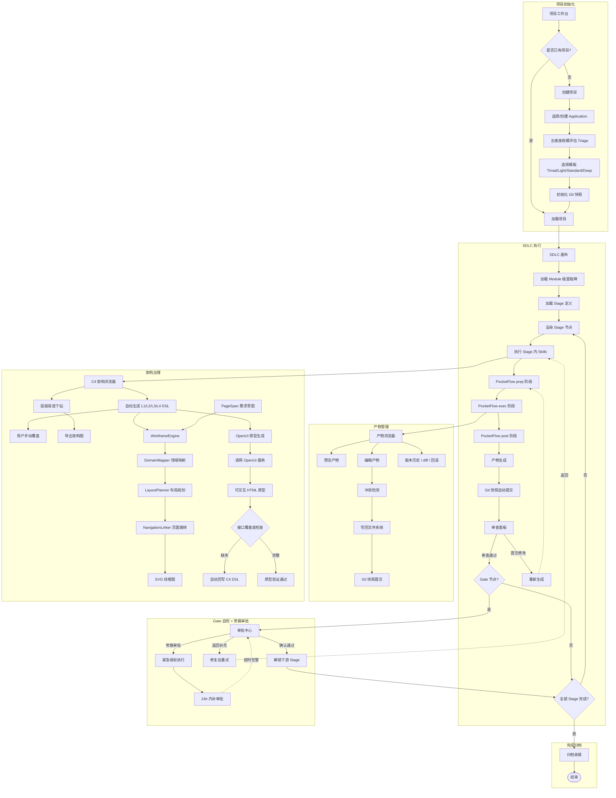
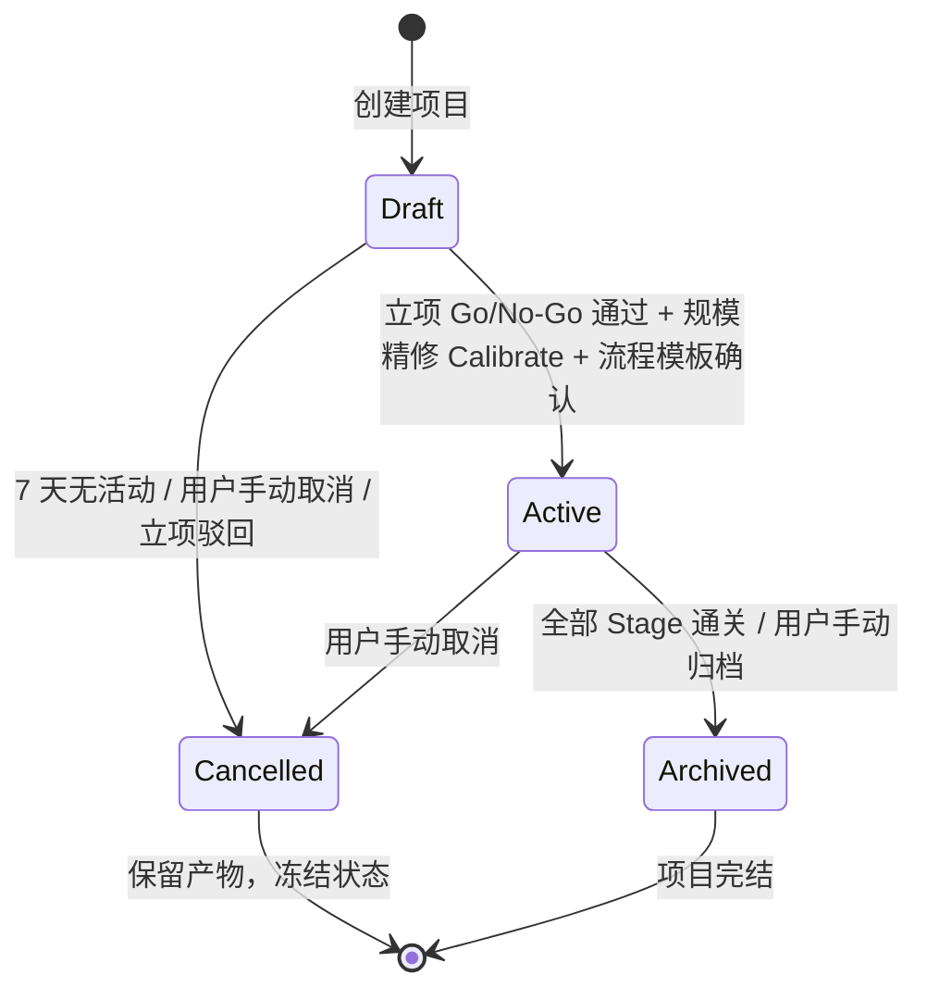
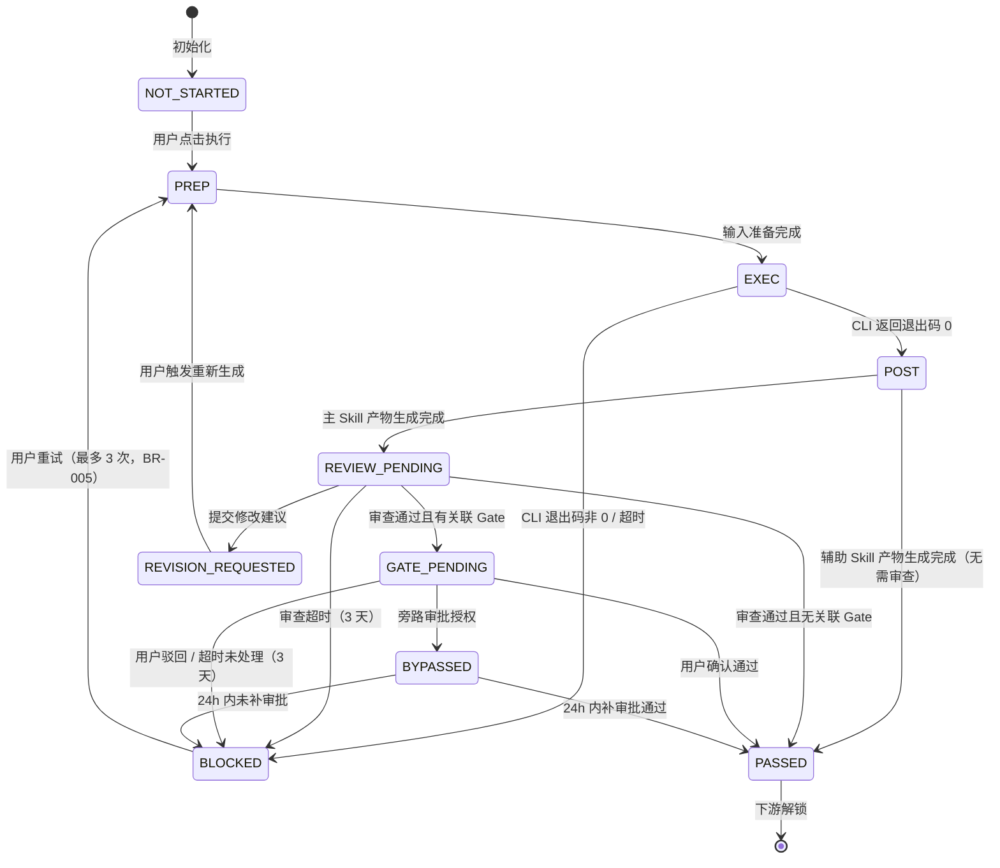
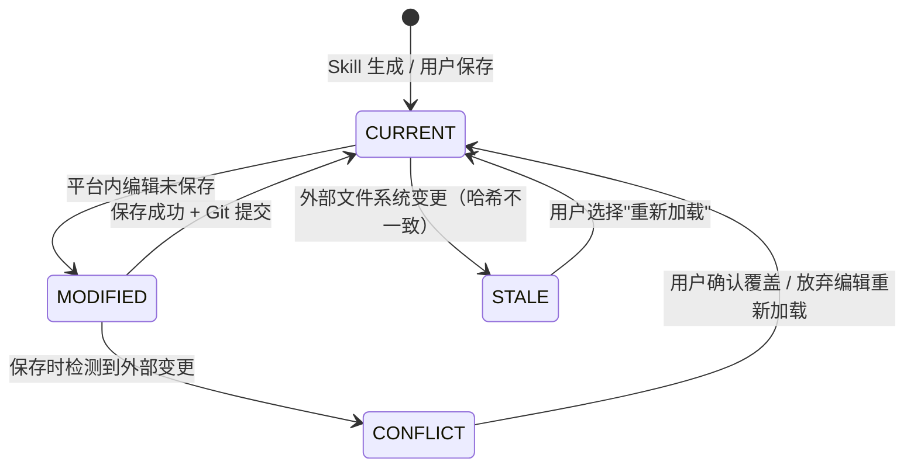
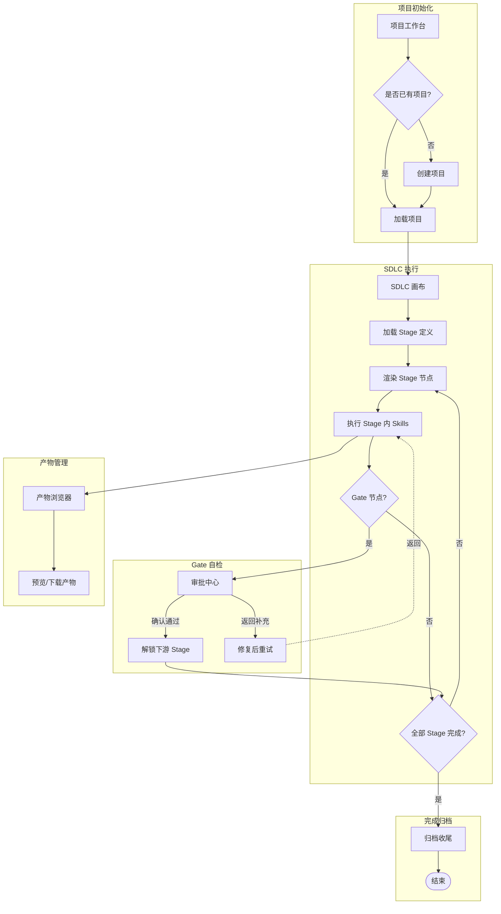
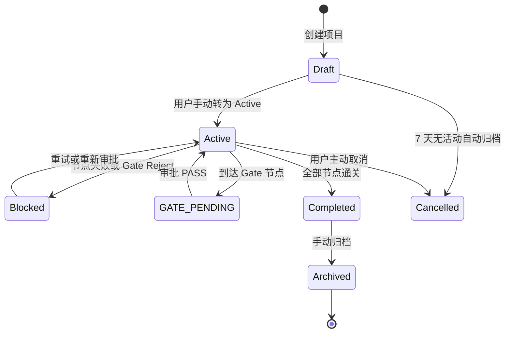
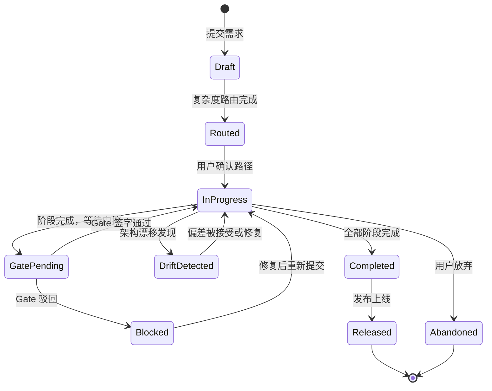
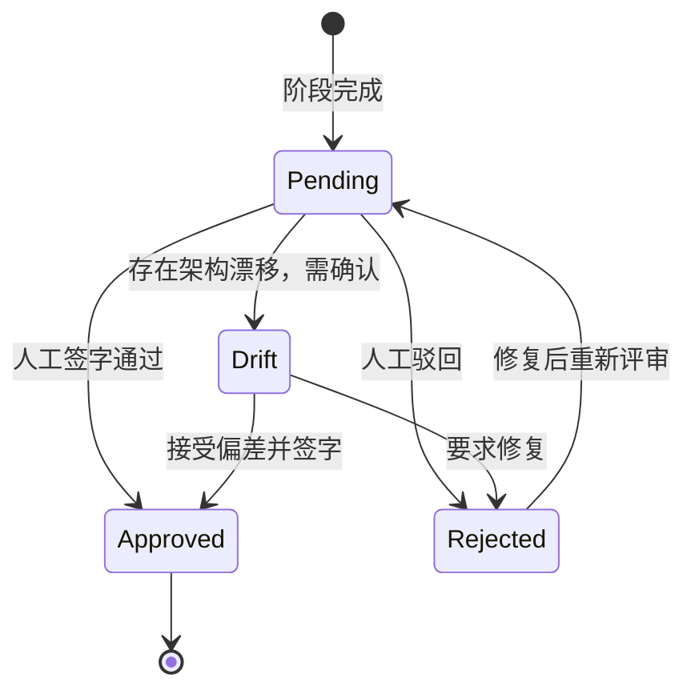
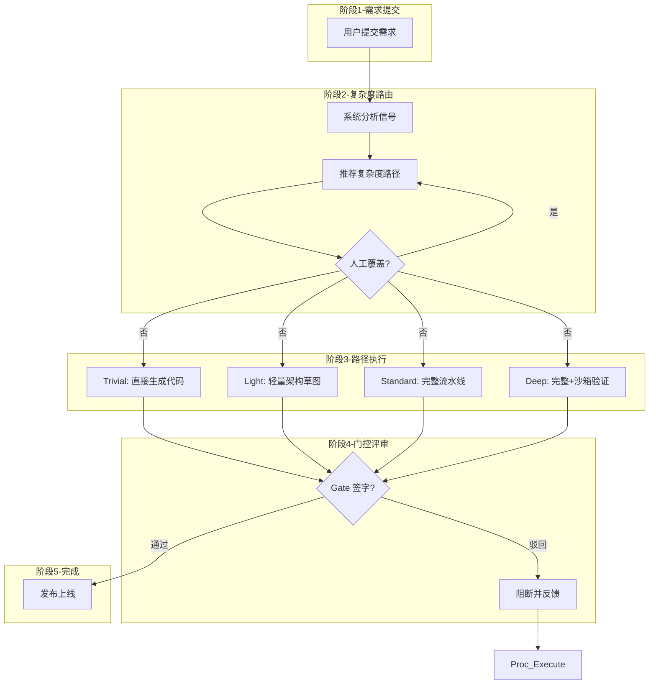
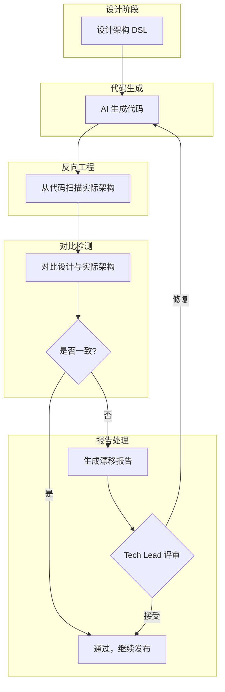

# 02 - 功能需求

> 版本：PRD-000 v2.0-patch2
> 状态：**Frozen** (Gate 1 已通过)
> 日期：2026-06-01
> 冻结时间：2026-06-01T11:37:00+08:00
>
> **修改记录**：v2.0 基于 brainstorming v2.0 重构：更新用户旅程（增加模板选择、产物编辑、Git 快照）；移除 OpenHands；增加 C4 自动生成路径；更新状态机（模板切换转移）。v2.0-patch1：状态机增加 REVIEW_PENDING/REVISION_REQUESTED + 审查面板节点；功能架构图增加审查回环；用户旅程增加审查阶段与替代路径；模块功能点树状图增加审查功能点与 C4 L3/L4/反向代码定位。
v2.0-patch2：用户旅程 Align 阶段增加"需求草图确认"子路径；功能架构图 OpenUI/WIreframe 模块增加 PageSpec 需求草图节点。

## 1. 系统功能架构图



**模块职责说明**：
- **项目工作台**：Workspace/Application/Project/Module 四层 CRUD、健康度卡片、团队效率统计、风险预警、Application 选择向导、模板选择向导。
- **SDLC 画布**：拓扑图/泳道/列表三种视图，按 Stage 分组渲染节点和状态，支持缩放/拖拽/筛选；支持 Module 级里程碑独立展示。
- **阶段详情面板**：右侧滑出抽屉，展示 Stage 内 Skill 指令快照、PocketFlow 三阶段状态（prep/exec/post）、输入/输出产物、执行日志、质量门禁结果；含"审查"Tab 支持产物行内批注、全局修改建议、参考资料注入、重新生成触发、版本历史与 diff 对比。
- **审批中心（Gate Center）**：待确认队列、AI 自检摘要、快速确认/驳回/重试、旁路审批（紧急授权 + 24h 补审）、历史决策追溯。
- **产物浏览器**：目录树 + 多模态渲染（Markdown/Mermaid/Swagger/YAML/JSON）+ 平台内编辑 + Git 快照版本管理。
- **Skill Flow 编排引擎**：YAML 解析、DAG 构建、拓扑排序、并行调度（模块内无依赖 Skill 并行）、条件评估、超时监控、错误处理。
- **Skill 调度服务**：Kimi CLI Adapter、PocketFlow 三阶段生命周期（prep-exec-post）、输入注入、输出捕获、日志收集、重试机制；多平台 Adapter 接口预留。
- **历史回溯**：已完成项目时间线、阶段耗时统计、项目间对比、返工热力图、模块级里程碑达成率。
- **Skill 注册管理**：手动导入 Skill 路径、Frontmatter 解析校验、DAG 自动解析 + 手动调整、画布节点库更新。
- **模板引擎**：管理员预制模板（Trivial/Light/Standard/Deep 四级）、模板与项目弱关联、阶段-Skill 绑定推荐及跳过阶段定义、模板偏离记录。
- **复杂度路由面板**：五维度规模评估（模块数/接口数/页面数/技术复杂度/风险等级）、Triage/Calibrate 两次评估、四级路径可视化对比、人工覆盖与决策日志。
- **C4 架构浏览器**：平台自动生成 L1/L2/L3/L4 DSL（基于概要设计文档）、用户手动覆盖、层级穿透下钻与面包屑导航、反向代码定位（Component/Code → 本地文件）、导出 PNG/SVG。
- **OpenUI 原型验证**：根据 C4 Container 图和接口契约生成 OpenUI 提示词，调用 OpenUI 服务（Docker HTTP API）获取可交互 HTML 原型，平台内嵌套预览。
- **WireframeEngine**：领域感知线框生成。Agent 1 DomainMapper 读取 C4 DSL 映射领域实体到页面；Agent 2 LayoutPlanner 基于页面类型选择布局模式生成 SVG 坐标；Agent 3 NavigationLinker 根据 C4 接口依赖建立页面跳转关系。
- **原型-架构双向绑定**：原型中发现接口缺失时，支持一键回写 C4 DSL（arsitect.aac.yml）并标记架构变更待 Gate 评审。
- **架构验证中心（P1）**：架构漂移检测报告展示、设计 vs 实际架构 diff 可视化。
- **模块治理（P1）**：Module 级里程碑独立推进、范围锚定与变更影响分析、跨模块契约依赖管理。

---

## 2. 模块-功能点树状图

| 模块 | 功能点 | 优先级 | 关联用户故事 | 所属旅程阶段 |
|------|--------|--------|-------------|-------------|
| 项目工作台 | 创建项目 | P0 | US-001 | 认知 |
| 项目工作台 | 选择/创建 Application | P0 | US-001 | 认知 |
| 项目工作台 | 模板选择（Trivial/Light/Standard/Deep 预览与选择） | P0 | US-001, US-011 | 准备 |
| 项目工作台 | 项目列表搜索排序 | P0 | US-001 | 认知 |
| 项目工作台 | 健康度卡片展示 | P0 | US-001 | 验证 |
| 项目工作台 | 风险预警展示 | P0 | US-001 | 验证 |
| 项目工作台 | 规模评估向导（五维度 Triage/Calibrate） | P0 | US-007 | 准备 |
| 项目工作台 | Timebox 配置与到期预警 | P0 | US-008 | 准备 |
| 项目工作台 | 模板偏离记录展示 | P0 | US-011 | 验证 |
| 项目工作台 | Application 级研发管理费统计 | P1 | — | 验证 |
| SDLC 画布 | 拓扑图动态渲染（Stage 为容器节点，Skill 为子节点） | P0 | US-002 | 执行 |
| SDLC 画布 | 泳道视图切换 | P0 | US-002 | 执行 |
| SDLC 画布 | 列表视图切换 | P1 | US-002 | 执行 |
| SDLC 画布 | Stage 节点状态着色 | P0 | US-002 | 执行 |
| SDLC 画布 | 拖拽/缩放/筛选 | P0 | US-002 | 执行 |
| 阶段详情面板 | Stage 内 Skill 列表展示 | P0 | US-002 | 执行 |
| 阶段详情面板 | 主 Skill 指令快照与产物置顶展示 | P0 | US-002 | 执行 |
| 阶段详情面板 | 辅助 Skill 产物展示 | P0 | US-002 | 执行 |
| 阶段详情面板 | 输入/输出产物展示 | P0 | US-002 | 执行 |
| 阶段详情面板 | 执行日志展示（按 Skill 分组） | P0 | US-002 | 执行 |
| 阶段详情面板 | 质量门禁结果展示 | P0 | US-002 | 验证 |
| 阶段详情面板 | PocketFlow 三阶段状态展示（prep/exec/post） | P0 | US-002 | 执行 |
| 阶段详情面板 | 审查 Tab 切换与产物浏览 | P0 | US-009 | 执行 |
| 阶段详情面板 | 产物行内批注（高亮+评论气泡） | P0 | US-009 | 执行 |
| 阶段详情面板 | 全局修改建议输入（P0阻塞/P1建议/P2优化） | P0 | US-009 | 执行 |
| 阶段详情面板 | 参考资料拖拽/粘贴区 | P0 | US-009 | 执行 |
| 阶段详情面板 | 审查提交与重新生成触发 | P0 | US-009 | 执行 |
| 阶段详情面板 | 版本历史查看与 diff 对比 | P0 | US-009 | 执行 |
| 阶段详情面板 | 版本回滚到任意历史版本 | P0 | US-009, US-010 | 执行 |
| 审批中心 | AI 自检摘要生成 | P0 | US-003 | 验证 |
| 审批中心 | 快速确认/驳回/重试 | P0 | US-003 | 验证 |
| 审批中心 | 旁路审批（紧急授权 + 24h 补审） | P1 | US-003 | 验证 |
| 审批中心 | 历史决策追溯 | P0 | US-003 | 验证 |
| 产物浏览器 | 目录树浏览 | P0 | US-004 | 执行 |
| 产物浏览器 | Markdown/Mermaid/Swagger/YAML/JSON 渲染 | P0 | US-004 | 执行 |
| 产物浏览器 | 产物下载 | P0 | US-004 | 执行 |
| 产物浏览器 | **平台内编辑与冲突检测** | P0 | US-004 | 执行 |
| 产物浏览器 | **Git 快照版本历史 / diff / 回滚** | P0 | US-004, US-010 | 执行 |
| Skill 注册 | 手动导入 Skill 路径 | P0 | US-005 | 准备 |
| Skill 注册 | Frontmatter 解析校验 | P0 | US-005 | 准备 |
| Skill 注册 | DAG 自动解析（上下游引用提取） | P0 | US-005 | 准备 |
| Skill 注册 | DAG 手动调整（可视化连线编辑） | P0 | US-005 | 准备 |
| Skill 注册 | 画布节点库更新 | P0 | US-005 | 准备 |
| 历史回溯 | 已完成项目时间线 | P1 | US-006 | 完成 |
| 历史回溯 | 阶段耗时统计 | P1 | US-006 | 完成 |
| 历史回溯 | 项目间对比 | P1 | US-006 | 完成 |
| 历史回溯 | 返工热力图 | P1 | US-006 | 完成 |
| 模板引擎 | 管理员预制模板管理 | P0 | US-001 | 准备 |
| 模板引擎 | 阶段-Skill 绑定推荐 | P0 | US-001 | 准备 |
| 模板引擎 | 模板匹配与初始化 | P0 | US-001 | 准备 |
| 模板引擎 | 模板偏离决策日志 | P0 | US-011 | 验证 |
| 复杂度路由面板 | 复杂度信号采集（文件数/实体数/跨服务标记） | P0 | US-007 | 准备 |
| 复杂度路由面板 | 等级判定与模板推荐 | P0 | US-007 | 准备 |
| 复杂度路由面板 | 三级路径可视化与差异对比 | P0 | US-011 | 准备 |
| 复杂度路由面板 | 路径推荐人工覆盖 | P0 | US-011 | 准备 |
| C4 架构浏览器 | **自动生成 L1 Context DSL** | P0 | US-012 | 执行 |
| C4 架构浏览器 | **自动生成 L2 Container DSL** | P0 | US-012 | 执行 |
| C4 架构浏览器 | DSL 手动编辑与保存 | P0 | US-012 | 执行 |
| C4 架构浏览器 | 层级穿透下钻与面包屑导航 | P0 | US-012 | 执行 |
| C4 架构浏览器 | **自动生成 L3 Component DSL** | P0 | US-012 | 执行 |
| C4 架构浏览器 | **自动生成 L4 Code DSL** | P0 | US-012 | 执行 |
| C4 架构浏览器 | 架构图导出 PNG/SVG | P1 | US-012 | 执行 |
| C4 架构浏览器 | 反向代码定位（Component/Code → 本地文件） | P0 | US-012 | 执行 |
| OpenUI 原型 | OpenUI 提示词生成与服务调用 | P0 | — | 执行 |
| OpenUI 原型 | 平台内嵌套原型预览 | P0 | — | 执行 |
| 需求草图 | PageSpec 规则解析（用户故事 → 页面字段/按钮/跳转） | P0 | US-017 | 执行 |
| 需求草图 | 低保真草图生成（文本框+箭头，字段覆盖率 >=90%） | P0 | US-017 | 执行 |
| 需求草图 | 草图缺失字段检测与提示 | P0 | US-017 | 执行 |
| WireframeEngine | DomainMapper 领域实体到页面映射 | P0 | — | 执行 |
| WireframeEngine | LayoutPlanner 布局规划与 SVG 渲染 | P0 | — | 执行 |
| WireframeEngine | NavigationLinker 页面跳转与接口绑定 | P0 | — | 执行 |
| 原型-架构绑定 | 接口缺失检测与 C4 DSL 自动回写 | P0 | — | 验证 |
| 架构验证中心 | 架构漂移检测报告展示 | P1 | US-013 | 验证 |
| 架构验证中心 | 设计 vs 实际架构 diff 可视化 | P1 | US-013 | 验证 |

---

## 3. 端到端用户旅程

### 3.1 主旅程（Happy Path）

**旅程名称**：超级个体首次使用平台完成一个软件项目
**目标用户**：独立开发者（超级个体）
**总预期时长**：因项目规模而异，MVP 聚焦流程闭环验证

| 阶段      | 用户场景                 | 用户完整操作                                                                          | 系统响应                                                      | 情绪/痛点           | 出口条件                   |
| ------- | -------------------- | ------------------------------------------------------------------------------- | --------------------------------------------------------- | --------------- | ---------------------- |
| 认知      | 开发者收到新需求，决定用 AI 辅助开发 | 打开平台首页 -> 浏览项目列表 -> 点击"新建项目"                                                    | 展示引导页、高亮 CTA、提供模板选择面板                                     | 担心平台学习成本高       | 进入项目创建表单               |
| 准备      | 开发者配置新项目             | 填写项目名称 -> 选择模板（Simple/Standard/Complex）-> 确认创建                                  | 实时校验输入、展示模板阶段-Skill 绑定预览、初始化产物 Git 仓库                     | 对路径选择犹豫         | 项目创建成功，进入 Draft 态      |
| 评估      | 开发者评估项目规模            | 查看规模评估向导 -> 确认或调整参数 -> 完成 Draft 分析 -> 进入复杂度路由面板 -> 确认或覆盖路径选择                    | 自动计算复杂度等级、生成 Timebox 初稿、推荐模板、可视化路径差异                      | 担心规模误判导致工期失控    | 规模与路径均确认，进入 Active 态   |
| 执行-需求探索 | 开发者开始需求探索            | 点击"需求探索"Stage -> 查看主 Skill 快照 -> 点击执行 -> 等待 AI 生成产物                             | 触发 Kimi CLI、展示实时日志、产物生成后更新节点状态、自动 Git 提交                  | 等待焦虑、担心 AI 产物质量 | 需求探索 Stage 状态变为 PASSED |
| 执行-需求对齐 | 开发者推进到需求对齐阶段         | 点击"需求对齐"Stage -> 执行主 Skill -> 产物生成后自动进入审查状态 -> 进入审查 Tab 浏览产物 -> 添加批注（可选）-> 提交审查 -> **查看需求草图确认页面逻辑（可选）** | 同上 + 基于用户故事自动生成需求草图 + 草图字段覆盖率校验 + 审查状态管理              | 对设计文档完整性担忧      | 审查提交，进入 Gate-2         |
| 审查      | 开发者审查 AI 生成的产物       | 点击 Stage 节点 -> 进入审查 Tab -> 浏览产物 -> 添加行内批注/全局建议 -> 拖拽参考资料（可选）-> 提交审查或通过          | 记录批注、状态变为 REVIEW_PENDING -> 审查通过后进入 GATE_PENDING 或 PASSED | 担心遗漏设计缺陷        | 审查通过                   |
| 验证-Gate | 开发者到达关键审批节点          | 查看 AI 自检摘要 -> 浏览产物 -> 点击"确认通过"                                                  | 记录决策、解锁下游节点、发送通知                                          | 担心遗漏风险点         | Gate 决策提交，下游解锁         |
| 执行-编码   | 开发者进入编码实现            | 点击编码 Stage -> 执行 -> 查看生成的代码和测试                                                  | 触发 CLI、展示产物、自动 Git 提交                                     | 对代码质量担忧         | 编码 Stage PASSED        |
| 验证-测试   | 开发者验证测试结果            | 点击测试 Stage -> 执行 -> 查看测试报告                                                      | 展示覆盖率、失败用例高亮                                              | 覆盖率不足焦虑         | 测试 Stage PASSED        |
| 完成      | 项目全部节点通关             | 查看项目完成提示 -> 浏览产物浏览器 -> 归档项目                                                     | 展示项目统计、提供归档按钮                                             | 成就感、希望沉淀经验      | 项目状态变为 Archived        |

### 3.2 关键替代路径

| 分支触发条件 | 与原路径的差异 | 用户额外操作 | 系统处理策略 |
|-------------|---------------|-------------|-------------|
| Gate 审批驳回 | 不进入下游，返回当前阶段修复 | 查看驳回理由 -> 补充修改建议 -> 点击"重新生成" -> 新版本 diff 对比 -> 重新提交 | 保留历史决策记录，驳回理由自动关联产物批注，支持对比查看 |
| 审查后重新生成 | 基于人工批注和参考资料修改产物 | 查看批注列表 -> 确认建议 -> 点击"重新生成" -> AI 基于反馈生成新版本 -> 对比 diff | 系统保留前序版本全部批注作为上下文，参考资料自动注入 Skill 输入 |
| 模板切换 | 已执行阶段不变，未执行阶段按新模板重新渲染 | 进入复杂度路由面板 -> 选择新模板 -> 确认切换 | 已执行 Stage 保持不变，未执行 Stage 按新模板更新，记录偏离日志 |
| 产物编辑后保存 | 平台内编辑产物并写回文件系统 | 进入编辑器 -> 修改内容 -> 点击保存 -> 处理冲突提示（若有） | 检测外部变更，无冲突则写回并 Git 提交，有冲突则弹窗确认 |
| 产物版本回滚 | 恢复到旧版本 | 打开版本历史 -> 选择旧版本 -> 点击"回滚" | 恢复内容，创建标记为"回滚"的新提交 |
| Skill 执行失败 | 节点状态变为 BLOCKED，不阻塞其他并行节点 | 查看错误日志 -> 判断是环境问题还是 Skill 问题 -> 重试或跳过 | 自动重试 1 次，仍失败则标记 BLOCKED |
| 用户选择自定义路径 | 偏离模板推荐 | 在复杂度路由面板手动选择路径 -> 确认偏离 | 记录偏离原因，画布按选择渲染，持续展示规模不匹配警告（若有） |
| 产物被外部修改 | 数据库状态与文件系统不一致 | 收到警告通知 -> 选择"重新加载"或"忽略" | 检测哈希变化，提示用户刷新 |
| C4 DSL 手动覆盖 | 用户修正自动生成的架构图 | 进入 C4 浏览器 -> 编辑 DSL -> 保存 | 标记为"手动覆盖"，后续不再自动覆盖该 DSL |

### 3.3 异常退出路径

| 异常场景 | 用户行为 | 系统挽留/处理策略 | 数据状态 |
|----------|----------|------------------|----------|
| 用户在 Draft 阶段放弃 | 7 天无活动 | 发送提醒通知 -> 自动归档为 Cancelled，保留产物 | 项目状态：Cancelled |
| 审查后长期不处理 | Stage 处于 REVIEW_PENDING 超过 3 天 | 发送提醒通知 -> Timebox 到期标记为裁剪候选 | Stage 状态：REVIEW_PENDING -> BLOCKED（可恢复） |
| Gate 长期未处理 | Stage 处于 GATE_PENDING 超过 3 天 | 发送提醒通知 -> Timebox 到期标记为裁剪候选 | Stage 状态：GATE_PENDING -> BLOCKED（可恢复） |
| 执行进程崩溃 | 无操作（系统检测到） | 自动重试 1 次 -> 仍失败则标记 BLOCKED，通知用户 | 节点状态：BLOCKED |
| 系统宕机恢复 | 重启后重新打开平台 | 扫描 Execution 表，将无心跳的 IN_PROGRESS 节点回退至 BLOCKED | 孤儿进程自动清理 |
| 用户误删核心产物 | 外部删除文件 | 检测到哈希校验失败 -> 提示用户 -> 从 Git 快照恢复（若有） | 节点状态：BLOCKED（若无法恢复） |
| 网络中断（Gate 提交时） | 点击提交后无响应 | 保留审批表单数据，提示"网络异常，请重试"，状态不变 | 节点状态：GATE_PENDING |
| 模板切换时冲突 | 已执行阶段与新模板不兼容 | 提示"已执行阶段不受影响"，仅更新未执行阶段 | 已执行 Stage 保持原状态 |

---

## 4. 角色职责描述

> PRD 只描述角色职责，不写具体 ACL 矩阵。ACL 放到安全设计文档。

| 角色 | 职责描述 | 可执行的操作 | 不可执行的操作 |
|------|----------|-------------|---------------|
| **超级个体（独立开发者）** | 全栈开发、自我项目管理、自我审批 | 创建项目、选择模板、执行 Skill、浏览产物、编辑产物、审批 Gate、重试失败节点、导入 Skill、切换模板路径、回滚产物版本 | 无（单人场景下拥有全部权限） |
| **Tech Lead（小团队）** | 技术决策、Gate 审批、代码审查 | 审批 Gate、查看产物、输入审批结论、查看团队项目进度 | 创建他人项目、删除他人项目（除非有明确授权） |
| **开发者（团队成员）** | 执行 Skill、提交代码、修复缺陷 | 执行节点、查看输入产物、重试失败节点 | 审批 Gate、创建项目（若未授权） |
| **平台管理员（未来角色）** | 系统配置、成员管理、模板管理 | 管理 Skill 模板、配置全局参数、查看系统日志 | 直接修改用户项目产物 |

> MVP 阶段仅支持"超级个体"单一角色。P1 引入多用户时扩展为上述多角色体系。

---

## 5. 全局业务规则

全局业务规则见 `01-requirements-list.md` 第 6 节与 6.2 节（含冲突仲裁）。本章仅引用与状态机相关的规则编号。

| 规则编号 | 规则描述 | 适用模块 | 触发条件 |
|----------|----------|----------|----------|
| BR-001 | 只有处于 Draft 或 Active 状态的项目才可执行 Skill | 项目治理 | 用户点击"执行" |
| BR-002 | Gate 审批通过前，下游节点不可执行 | SDLC 画布 | 节点依赖关系校验 |
| BR-003 | Draft 态项目仅允许执行预立项分析型 Skill | 项目治理 | 用户选择 Skill 类型 |
| BR-005 | 节点执行失败后，用户可手动重试，最多重试 3 次 | Skill 调度 | 用户点击"重试" |
| BR-006 | 产物平台内保存前，必须检测外部文件系统哈希变化 | 产物服务 | 用户点击"保存" |
| BR-007 | 产物文件自动纳入 Git 快照管理；单文件 > 10MB 时除外 | 产物服务 | 文件保存 |
| BR-009 | Gate 摘要置信度为"低"时，禁止一键通过 | Gate 审批 | AI 摘要生成完成 |
| BR-010 | AI 禁止自动执行发布相关 Skill | 安全规则 | 系统调度器 |
| BR-013 | 项目取消（Cancelled）后，保留产物和决策记录，仅冻结状态变更 | 项目治理 | 取消操作 |
| BR-023 | 主 Skill 产物生成后必须进入 REVIEW_PENDING 状态，禁止自动流转到 GATE_PENDING 或 PASSED | 审查规则 | 产物生成完成 |

---

## 6. 状态机

### 6.1 项目级状态机（Project）



**状态说明**：
- **Draft**：预立项态，仅允许执行分析型 Skill（brainstorming、competitive-analysis、requirement-analysis）。可自由切换模板。Token 消耗计入 Application 级研发管理费。
- **Active**：正式执行态，允许执行全部 Skill。模板选择冻结，但允许偏离推荐路径。开始计入项目预算。
- **Archived**：已完成归档，只读状态，可查看历史统计。
- **Cancelled**：已取消，保留产物和决策记录，禁止任何状态变更。

**异常转移**：
- Draft -> Cancelled：7 天无活动自动触发（BR-013），系统提前 24h 发送提醒通知。
- Draft -> Active：必须为刚性事务，需同时满足「立项 Gate 通过」「Calibrate 精修完成」「流程模板已选」「全部 Active 正式责任人确认」。

### 6.2 Skill 级状态机（含 PocketFlow 三阶段）



**状态说明**：
- **NOT_STARTED**：前置依赖未完成或尚未执行，不可触发。
- **PREP**：PocketFlow prep 阶段，准备输入上下文、注入参数、加载前置产物。
- **EXEC**：PocketFlow exec 阶段，调用 Kimi CLI 执行 Skill。
- **POST**：PocketFlow post 阶段，产物处理、质量检查、自动 Git 快照。
- **REVIEW_PENDING**：主 Skill 产物已生成，等待人工审查。此状态下节点显示"待审查"徽章。用户可添加批注、提交修改建议、或直接通过进入 Gate/PASSED。人工必须至少浏览 1 份产物并停留 >=30 秒（BR-024）才可提交审查或 Gate 审批。辅助 Skill 产物不触发此状态。
- **REVISION_REQUESTED**：人工已提交修改建议，等待重新生成。此状态下"重新生成"按钮高亮。
- **PASSED**：Skill 执行成功，产物已生成，质量门禁通过，审查通过，Gate 已通过（若有关联）。
- **BLOCKED**：执行失败、质量门禁未通过、审查超时、Gate 被 Reject、超时未处理、进程崩溃、post 阶段异常。
- **GATE_PENDING**：执行到人工闸门，暂停等待审批。
- **BYPASSED**：旁路审批状态，已授权紧急执行，需在 24h 内补审批。

**异常转移**：
- EXEC -> BLOCKED：进程崩溃或 CLI 异常退出。系统自动重试 1 次（若配置），仍失败则标记 BLOCKED。
- POST -> BLOCKED：产物校验失败（如 schema 不匹配、空产物）。用户可查看 post 阶段失败详情。
- REVIEW_PENDING -> BLOCKED：超过 3 天未审查（BR-024）。系统发送提醒通知，超时后自动标记 BLOCKED（可恢复）。
- REVIEW_PENDING -> REVISION_REQUESTED：用户提交修改建议，系统记录批注并等待重新生成。
- REVISION_REQUESTED -> PREP：用户触发"重新生成"，系统携带前序批注和参考资料作为上下文注入。
- GATE_PENDING -> BLOCKED：超过 3 天未处理（BR-005）。系统发送提醒通知，超时后自动标记 BLOCKED（可恢复）。
- GATE_PENDING -> BYPASSED：TL 或 SO 授权旁路审批（BR-014），执行过程全量记录。
- BYPASSED -> BLOCKED：超过 24h 未补审批，自动触发告警并标记 BLOCKED。
- BLOCKED -> PREP：用户重试，重试次数 <= 3。超过 3 次后必须人工介入排查。

### 6.3 产物状态机（Artifact）



**状态说明**：
- **CURRENT**：产物文件与数据库记录一致，且为最新版本。
- **MODIFIED**：用户在平台内编辑了产物，尚未保存。
- **STALE**：外部编辑器修改了产物文件，平台检测到哈希不一致。
- **CONFLICT**：用户保存时，平台内编辑内容与外部变更发生冲突。

**异常转移**：
- CURRENT -> STALE：外部文件系统事件监听（watchdog）检测到文件变更，自动标记 STALE 并通知前端。
- MODIFIED -> CONFLICT：保存时检测到外部哈希变化（BR-006）。禁止静默覆盖，必须用户确认。

---

## 7. 详细需求清单：模块映射目录

| 编号 | 模块名称 | 对应目录 | 状态 | 关联需求 |
|------|----------|----------|------|----------|
| DR-001 | 项目工作台 | `detailed-requirements/feature-01-project-dashboard/` | 待编写 | REQ-P0-001~002, REQ-P0-022~023 |
| DR-002 | SDLC 画布 | `detailed-requirements/feature-02-flow-canvas/` | 待编写 | REQ-P0-003~005 |
| DR-003 | 阶段详情面板 | `detailed-requirements/feature-03-stage-detail/` | 待编写 | REQ-P0-025, REQ-P0-034~038, 阶段内展示需求 |
| DR-004 | 审批中心 | `detailed-requirements/feature-04-gate-center/` | 待编写 | REQ-P0-008~009, REQ-P0-026 |
| DR-005 | 产物浏览器 | `detailed-requirements/feature-05-artifact-viewer/` | 待编写 | REQ-P0-010~012, REQ-P0-024 |
| DR-006 | Skill 注册与 DAG 管理 | `detailed-requirements/feature-06-skill-registry/` | 待编写 | REQ-P0-013~015 |
| DR-007 | Skill Flow 编排引擎 | `detailed-requirements/feature-07-flow-engine/` | 待编写 | 编排引擎核心逻辑 |
| DR-008 | Skill 调度服务 | `detailed-requirements/feature-08-skill-executor/` | 待编写 | REQ-P0-006~007 |
| DR-009 | 模板引擎 | `detailed-requirements/feature-09-template-engine/` | 待编写 | REQ-P0-002, REQ-P0-018, REQ-P0-027 |
| DR-010 | 复杂度路由面板 | `detailed-requirements/feature-10-complexity-router/` | 待编写 | REQ-P0-016, REQ-P0-018 |
| DR-011 | C4 架构浏览器 | `detailed-requirements/feature-11-c4-navigator/` | 待编写 | REQ-P0-019~021, REQ-P0-033 |
| DR-012 | 架构验证中心 | `detailed-requirements/feature-12-arch-validation/` | 待编写 | REQ-P1-005~006 |
| DR-013 | 历史回溯 | `detailed-requirements/feature-13-history/` | 待编写 | REQ-P1-001~003 |
| DR-014 | 监控看板 | `detailed-requirements/feature-14-monitoring/` | 待编写 | REQ-P1-007~008 |
| DR-015 | Application 与模块治理 | `detailed-requirements/feature-15-app-module/` | 待编写 | Application CRUD、Module 级里程碑 |
| DR-016 | PocketFlow 执行引擎 | `detailed-requirements/feature-16-pocketflow/` | 待编写 | prep-exec-post 三阶段生命周期 |
| DR-017 | HITL 旁路审批服务 | `detailed-requirements/feature-17-bypass/` | 待编写 | 紧急授权、24h 补审、超时告警 |
| DR-018 | OpenUI 原型服务 | `detailed-requirements/feature-18-openui/` | 待编写 | REQ-P0-028~029 |
| DR-019 | WireframeEngine | `detailed-requirements/feature-19-wireframe/` | 待编写 | REQ-P0-030~032 |
| DR-020 | 原型-架构双向绑定 | `detailed-requirements/feature-20-proto-arch/` | 待编写 | 接口缺失检测、C4 DSL 回写 |
| DR-021 | 需求草图服务 | `detailed-requirements/feature-21-pagespec/` | 待编写 | REQ-P0-040，PageSpec 规则解析与草图生成 |

---

## 附录：历史补充内容（来自 docs/ 目录）

> 以下内容来自 docs/ 目录下的历史版本，包含主文档中未覆盖的视角或早期草稿。

> 版本：PRD-000 v1.4-draft
> 状态：Draft
> 日期：2026-05-31
>
> **修改记录**：v1.3 补充复杂度路由面板（DR-011）、C4 架构浏览器（DR-012）及架构验证中心模块功能点、用户旅程。v1.2 补充 Stage 审查与版本管理相关用户旅程和异常路径。v1.1 补充项目规模评估和里程碑 Timebox 相关模块功能点（DR-010）、用户旅程、替代路径。



**模块职责说明**：
- **项目工作台**：项目 CRUD、健康度卡片、团队效率统计、风险预警。
- **SDLC 画布**：拓扑图/泳道/列表三种视图，按 Stage（SDLC 阶段）分组渲染节点和状态，支持缩放/拖拽/筛选。Stage 内展示绑定的 Skills（主 Skill + 辅助 Skills）。
- **阶段详情面板**：右侧滑出抽屉，展示 Stage 内 Skill 指令快照、输入/输出产物、执行日志、质量门禁结果。主 Skill 产物置顶展示。
- **审批中心（Gate Center）**：待确认队列、AI 自检摘要、快速确认/驳回/重试、历史决策追溯。
- **产物浏览器**：目录树 + 多模态渲染（Markdown/Mermaid/Swagger/YAML/JSON）。
- **Skill Flow 编排引擎**：YAML 解析、DAG 构建、拓扑排序、并行调度、条件评估、超时监控、错误处理。
- **Skill 调度服务**：Kimi CLI Adapter、输入注入、输出捕获、日志收集、重试机制。
- **历史回溯**：已完成项目时间线、阶段耗时统计、项目间对比、返工热力图。
- **Skill 注册管理**：手动导入 Skill 路径、Frontmatter 解析校验、Stage 归属识别、画布节点库更新。
- **项目治理**：规模评估计算引擎（Triage/Calibrate）、里程碑 Timebox 调度、范围锚定校验、基线化与 Stale 检测。
- **复杂度路由面板**：复杂度信号采集与等级判定、四级执行路径可视化对比、路径推荐人工覆盖与决策日志。
- **C4 架构浏览器**：C4 四级模型渲染（Context/Container/Component/Code）、层级穿透下钻与面包屑导航、反向代码定位。
- **架构验证中心**：架构漂移检测报告展示、设计架构与实际架构 diff 可视化。

| 模块 | 功能点 | 优先级 | 关联用户故事 | 所属旅程阶段 |
|------|--------|--------|-------------|-------------|
| 项目工作台 | 创建项目 | P0 | US-001 | 认知 |
| 项目工作台 | 复杂度路由路径预设（基于 US-007 规模等级自动推荐 Trivial/Light/Standard/Deep） | P0 | US-001, US-011 | 准备 |
| 项目工作台 | Stage-Skill 绑定配置（主/辅助角色分配） | P0 | US-001 | 准备 |
| 项目工作台 | Stage 合并与拆分（复杂度路由预设合并策略，支持手动微调） | P0 | US-011 | 准备 |
| 项目工作台 | 项目列表搜索排序 | P0 | US-001 | 认知 |
| 项目工作台 | 健康度卡片展示 | P0 | US-001 | 验证 |
| 项目工作台 | 风险预警展示 | P0 | US-001 | 验证 |
| 项目工作台 | 规模评估向导（Triage/Calibrate） | P0 | US-007 | 准备 |
| 项目工作台 | Timebox 配置与到期预警 | P0 | US-008 | 准备 |
| 项目工作台 | 范围锚定与模块锁定 | P0 | US-008 | 执行 |
| 项目工作台 | 影响分析引擎（Stale 传播计算） | P0 | US-008 | 执行 |
| SDLC 画布 | 拓扑图动态渲染（Stage 为容器节点，Skill 为子节点） | P0 | US-002 | 执行 |
| SDLC 画布 | 泳道视图切换（按 Stage 分组，Stage 内按 Skill execution_order 排列） | P0 | US-002 | 执行 |
| SDLC 画布 | 列表视图切换 | P1 | US-002 | 执行 |
| SDLC 画布 | Stage 节点状态着色（聚合 Stage 内所有 Skills 状态） | P0 | US-002 | 执行 |
| SDLC 画布 | 拖拽/缩放/筛选（支持按 Stage 筛选） | P0 | US-002 | 执行 |
| 阶段详情面板 | Stage 内 Skill 列表展示（区分主/辅助角色） | P0 | US-002 | 执行 |
| 阶段详情面板 | 主 Skill 指令快照与产物置顶展示 | P0 | US-002 | 执行 |
| 阶段详情面板 | 辅助 Skill 产物展示（进度报告、质量检查报告） | P0 | US-002 | 执行 |
| 阶段详情面板 | 输入产物展示 | P0 | US-002 | 执行 |
| 阶段详情面板 | 输出产物展示 | P0 | US-002 | 执行 |
| 阶段详情面板 | 执行日志展示（按 Skill 分组） | P0 | US-002 | 执行 |
| 阶段详情面板 | 质量门禁结果展示 | P0 | US-002 | 验证 |
| 审批中心 | AI 自检摘要生成 | P0 | US-003 | 验证 |
| 审批中心 | 快速确认/驳回/重试 | P0 | US-003 | 验证 |
| 审批中心 | 历史决策追溯 | P0 | US-003 | 验证 |
| 产物浏览器 | 目录树浏览 | P0 | US-004 | 执行 |
| 产物浏览器 | Markdown 渲染 | P0 | US-004 | 执行 |
| 产物浏览器 | Mermaid 图表渲染 | P0 | US-004 | 执行 |
| 产物浏览器 | Swagger/OpenAPI 预览 | P0 | US-004 | 执行 |
| 产物浏览器 | YAML/JSON 结构化预览 | P0 | US-004 | 执行 |
| 产物浏览器 | 产物下载 | P0 | US-004 | 执行 |
| Skill 注册 | 手动导入 Skill 路径 | P0 | US-005 | 准备 |
| Skill 注册 | Frontmatter 解析校验 | P0 | US-005 | 准备 |
| Skill 注册 | Skill 建议 Stage 归属识别 | P0 | US-005 | 准备 |
| Skill 注册 | 画布节点库更新（按 Stage 分组） | P0 | US-005 | 准备 |
| 历史回溯 | 已完成项目时间线 | P1 | US-006 | 完成 |
| 历史回溯 | 阶段耗时统计 | P1 | US-006 | 完成 |
| 历史回溯 | 项目间对比 | P1 | US-006 | 完成 |
| 历史回溯 | 返工热力图 | P1 | US-006 | 完成 |
| 项目治理 | 规模评估计算引擎 | P0 | US-007 | 准备 |
| 项目治理 | 里程碑 Timebox 调度 | P0 | US-008 | 准备 |
| 项目治理 | 范围锚定校验 | P0 | US-008 | 执行 |
| 项目治理 | 基线化与 Stale 检测 | P0 | US-008 | 执行 |
| 复杂度路由面板 | 复杂度信号采集与等级判定 | P0 | US-011 | 准备 |
| 复杂度路由面板 | 四级路径可视化与差异对比 | P0 | US-011 | 准备 |
| 复杂度路由面板 | 路径推荐人工覆盖与决策日志 | P0 | US-011 | 准备 |
| C4 架构浏览器 | C4 四级模型渲染（Context/Container/Component/Code） | P0 | US-012 | 执行 |
| C4 架构浏览器 | 层级穿透下钻与面包屑导航 | P0 | US-012 | 执行 |
| C4 架构浏览器 | 反向代码定位（Component -> 本地文件） | P0 | US-012 | 执行 |
| 架构验证中心 | 架构漂移检测报告展示 | P1 | US-013 | 验证 |
| 架构验证中心 | 设计 vs 实际架构 diff 可视化 | P1 | US-013 | 验证 |

| 阶段      | 用户场景                 | 用户完整操作                                                                    | 系统响应                           | 情绪/痛点           | 出口条件                  |
| ------- | -------------------- | ------------------------------------------------------------------------- | ------------------------------ | --------------- | --------------------- |
| 认知      | 开发者收到新需求，决定用 AI 辅助开发 | 打开平台首页 -> 浏览项目列表 -> 点击"新建项目"                                              | 展示引导页、高亮 CTA、提供项目类型标记（后续复杂度路由自动推荐路径） | 担心平台学习成本高       | 进入项目创建表单              |
| 准备      | 开发者配置新项目             | 填写项目名称 -> 确认创建                                            | 实时校验输入、展示复杂度路由预设说明（基于后续规模评估自动推荐路径） | 对路径选择犹豫         | 项目创建成功，进入 Draft 态     |
| 评估      | 开发者评估项目规模并确认执行路径 | 查看 Triage 初估报告 -> 确认或调整五维度参数 -> 完成 Draft 分析 -> 查看 Calibrate 精修 -> 确认规模等级 -> 进入复杂度路由面板 -> 查看推荐路径（Trivial/Light/Standard/Deep）-> 确认或覆盖路径选择 | 自动计算三档得分和规模等级、生成 Timebox 初稿、综合技术信号推荐复杂度路径、可视化路径差异 | 担心规模误判导致工期失控或对路径深度犹豫 | 规模与路径均确认，进入 Active 态 |
| 执行-需求探索 | 开发者开始需求探索            | 点击"需求探索"Stage -> 查看绑定的主 Skill（brainstorming）快照 -> 点击执行 -> 等待 AI 生成产物。辅助 Skill（如 progress-tracker）自动运行更新进度 | 触发 Kimi CLI、展示实时日志、Stage 内 Skills 按 execution_order 串行/并行执行、产物生成后更新节点状态 | 等待焦虑、担心 AI 产物质量 | 需求探索 Stage 状态变为 PASSED |
| 执行-设计   | 开发者继续推进到设计阶段         | 点击"概要设计"Stage -> 执行主 Skill（high-level-design）-> 辅助 Skill（self-check）自动运行检查产物质量 -> 查看生成的架构文档和自我检查报告 | 同上                             | 对设计文档完整性担忧      | 设计 Stage PASSED，Gate-2 触发 |
| 验证-Gate | 开发者到达关键审批节点          | 查看 AI 自检摘要 -> 浏览产物 -> 点击"确认通过"                                            | 记录决策、解锁下游节点、发送通知               | 担心遗漏风险点         | Gate 决策提交，下游解锁        |
| 监控      | 开发者监控里程碑进度           | 查看项目工作台 Timebox 倒计时 -> 收到到期预警 -> 决定推进或裁剪                                  | 定时预警、到期标记裁剪候选、影响分析展示           | 担心工期失控          | 里程碑按计划推进或已调整          |
| 执行-编码   | 开发者进入编码实现            | 点击编码节点 -> 执行 -> 查看生成的代码和测试                                                | 同上                             | 对代码质量担忧         | 编码节点 PASSED           |
| 验证-测试   | 开发者验证测试结果            | 点击测试节点 -> 执行 -> 查看测试报告                                                    | 展示覆盖率、失败用例高亮                   | 覆盖率不足焦虑         | 测试节点 PASSED           |
| 完成      | 项目全部节点通关             | 查看项目完成提示 -> 浏览产物浏览器 -> 归档项目                                               | 展示项目统计、提供归档按钮                  | 成就感、希望沉淀经验      | 项目状态变为 Archived       |

| 分支触发条件     | 与原路径的差异                  | 用户额外操作                                | 系统处理策略                  |
| ---------- | ------------------------ | ------------------------------------- | ----------------------- |
| Gate 审批驳回  | 不进入下游，返回当前阶段修复           | 查看驳回理由（自动转为产物批注）-> 补充修改建议 -> 点击"重新生成" -> 新版本 diff 对比 -> 重新提交 | 保留历史决策记录，驳回理由自动关联产物批注，支持对比查看         |
| 审查后重新生成  | 基于人工批注和参考资料修改产物          | 查看批注列表 -> 确认建议 -> 点击"重新生成" -> AI 基于反馈生成新版本 -> 对比 diff | 系统保留前序版本全部批注作为上下文，参考资料自动注入 Skill 输入 |
| 版本回滚      | 新版本不如旧版本                   | 打开版本历史 -> 选择旧版本 -> 点击"回滚到此版本"              | 系统标记当前版本为 abandoned，恢复旧版本为 active |
| Skill 执行失败 | 节点状态变为 BLOCKED，不阻塞其他并行节点 | 查看错误日志 -> 判断是环境问题还是 Skill 问题 -> 重试或跳过 | 自动重试 1 次，仍失败则标记 BLOCKED |
| 用户选择自定义模板  | 缺少部分标准阶段节点               | 手动添加/删除节点 -> 配置节点依赖关系                 | 提供可视化 DAG 编辑器（P1）       |
| 产物被外部修改    | 数据库状态与文件系统不一致            | 收到警告通知 -> 选择"重新加载"或"忽略"               | 检测哈希变化，提示用户刷新           |
| 新增模块触发范围锚定 | 超出原规模评估范围                  | 查看影响分析 -> 确认重估或维持原计划                    | 重新计算规模等级，推荐 Timebox 调整方案    |
| Timebox 到期     | 里程碑未按时完成                    | 查看裁剪建议 -> 选择裁剪非核心需求或延长时间盒              | 标记裁剪候选，记录调整决策日志            |

| 异常场景 | 用户行为 | 系统挽留/处理策略 | 数据状态 |
|----------|----------|------------------|----------|
| 用户在 Draft 阶段放弃 | 7 天无活动 | 发送提醒邮件/通知 -> 自动归档为 Cancelled，保留产物 | 项目状态：Cancelled |
| 审查后长期不处理 | Stage 处于 REVIEW_PENDING 超过 3 天 | 发送提醒通知 -> Timebox 到期标记为裁剪候选 | Stage 状态：REVIEW_PENDING → BLOCKED（可恢复） |
| 执行进程崩溃 | 无操作（系统检测到） | 自动重试 1 次 -> 仍失败则标记 BLOCKED，通知用户 | 节点状态：BLOCKED |
| 系统宕机恢复 | 重启后重新打开平台 | 扫描 Execution 表，将无心跳的 IN_PROGRESS 节点回退至 BLOCKED | 孤儿进程自动清理 |
| 用户误删核心产物 | 外部删除文件 | 检测到哈希校验失败 -> 提示用户 -> 从快照恢复（若有） | 节点状态：BLOCKED（若无法恢复） |
| 网络中断（Gate 提交时） | 点击提交后无响应 | 保留审批表单数据，提示"网络异常，请重试"，状态不变 | 节点状态：GATE_PENDING |

| 角色 | 职责描述 | 可执行的操作 | 不可执行的操作 |
|------|----------|-------------|---------------|
| **超级个体（独立开发者）** | 全栈开发、自我项目管理、自我审批 | 创建项目、执行 Skill、浏览产物、审批 Gate、重试失败节点、导入 Skill | 无（单人场景下拥有全部权限） |
| **Tech Lead（小团队）** | 技术决策、Gate 审批、代码审查 | 审批 Gate、查看产物、输入审批结论、查看团队项目进度 | 创建他人项目、删除他人项目（除非有明确授权） |
| **开发者（团队成员）** | 执行 Skill、提交代码、修复缺陷 | 执行节点、查看输入产物、重试失败节点 | 审批 Gate、创建项目（若未授权） |
| **平台管理员（未来角色）** | 系统配置、成员管理、模板管理 | 管理 Skill 模板、配置全局参数、查看系统日志 | 直接修改用户项目产物 |

全局业务规则见 `01-requirements-list.md` 第 5 节与 5.1 节（含冲突仲裁）。本章仅引用与状态机相关的规则编号。

| 规则编号 | 规则描述 | 适用模块 | 触发条件 |
|----------|----------|----------|----------|
| BR-001 | 只有处于 Draft 或 Active 状态的项目才可执行 Skill | 项目治理 | 用户点击"执行" |
| BR-002 | Gate 审批通过前，下游节点不可执行 | SDLC 画布 | 节点依赖关系校验 |
| BR-003 | Draft 态项目仅允许执行预立项分析型 Skill | 项目治理 | 用户选择 Skill 类型 |
| BR-005 | 节点执行失败后，用户可手动重试，最多重试 3 次 | Skill 调度 | 用户点击"重试" |
| BR-009 | Gate 摘要置信度为"低"时，禁止一键通过 | Gate 审批 | AI 摘要生成完成 |
| BR-010 | AI 禁止自动执行发布相关 Skill | 安全规则 | 系统调度器 |

## 6. 状态机定义（业务视角）

### 6.1 变更（Change/Project）状态机



### 6.2 Stage 状态机（含审查迭代）

| 当前状态 | 允许转移 | 触发事件 |
|----------|----------|----------|
| NOT_STARTED | IN_PROGRESS | 前置依赖全部满足 + 用户触发执行 |
| IN_PROGRESS | COMPLETED / BLOCKED | 执行成功 / 执行失败 |
| COMPLETED | REVIEW_PENDING | 产物生成完成，自动进入待审查 |
| REVIEW_PENDING | REVISION_REQUESTED | 人工提交修改建议 |
| REVIEW_PENDING | GATE_PENDING | 人工确认满意，提交 Gate 审批 |
| REVISION_REQUESTED | IN_PROGRESS | 用户触发"重新生成" |
| GATE_PENDING | COMPLETED | 审批 PASS |
| GATE_PENDING | REVISION_REQUESTED | 审批 REJECT |
| BLOCKED | IN_PROGRESS | 用户手动重试（最多 3 次） |
| BLOCKED | REVISION_REQUESTED | 用户选择基于反馈修改 |

> **说明**：
> - `REVIEW_PENDING`（紫色）：产物已生成，等待人工审查。此状态下节点显示"待审查"徽章。
> - `REVISION_REQUESTED`（蓝色闪烁）：人工已提交修改建议，等待重新生成。此状态下"重新生成"按钮高亮。
> - 辅助 Skill 的产物不触发 REVIEW_PENDING，主 Skill 产物必须进入 REVIEW_PENDING。

### 6.3 异常状态转移

| 异常场景 | 当前状态 | 恢复后状态 | 触发条件 | 系统处理 |
|----------|----------|------------|----------|----------|
| 执行进程崩溃 | IN_PROGRESS | BLOCKED | Kimi CLI 进程异常退出（exit code 非 0） | 自动重试 1 次，仍失败则标记 BLOCKED，通知用户 |
| 网络中断导致审批提交失败 | GATE_PENDING | GATE_PENDING | 审批提交超时 | 保留审批表单数据，提示用户重新提交，状态不变 |
| 产物文件损坏 | COMPLETED | BLOCKED | 产物 MD5 校验失败 | 标记 BLOCKED，解锁重试，保留历史版本供对比 |
| 系统宕机恢复 | IN_PROGRESS | BLOCKED | 服务重启后检测到孤儿进程 | 扫描 Execution 表，将无心跳的 IN_PROGRESS 节点回退至 BLOCKED |
| 用户误删核心产物 | COMPLETED | BLOCKED | 产物文件被删除且回收站过期 | 从快照恢复，若恢复失败则标记 BLOCKED |

> 状态机只描述业务状态流转，不写技术实现（如具体的状态码、数据库字段、回调逻辑）。

## 7. 详细 PRD 清单（目录映射）

> 模块命名必须与下方目录名保持一致（kebab-case），直接影响 detailed-requirements Skill 的拆分。

| 编号 | 模块名称 | 对应目录 | 状态 |
|------|----------|----------|------|
| DR-001 | 项目工作台 | `feature-01-project-dashboard/` | 待编写 |
| DR-002 | SDLC 流程画布 | `feature-02-flow-canvas/` | 待编写 |
| DR-003 | 阶段详情面板 | `feature-03-stage-detail/` | 待编写 |
| DR-004 | 产物浏览器 | `feature-04-artifact-viewer/` | 待编写 |
| DR-005 | 审批中心 | `feature-05-gate-center/` | 待编写 |
| DR-006 | Skill Flow 编排引擎 | `feature-06-flow-engine/` | 待编写 |
| DR-007 | Skill 调度服务 | `feature-07-skill-executor/` | 待编写 |
| DR-008 | 历史回溯 | `feature-08-history/` | 待编写 |
| DR-009 | Skill 注册管理 | `feature-09-skill-registry/` | 待编写 |
| DR-010 | 项目治理（规模评估 / Timebox / 范围锚定 / 影响分析） | `feature-10-project-governance/` | 待编写 |
| DR-011 | 复杂度路由面板（信号采集 / 路径可视化 / 人工覆盖） | `feature-11-complexity-router/` | 待编写 |
| DR-012 | C4 架构浏览器（四级渲染 / 穿透导航 / 反向定位） | `feature-12-c4-navigator/` | 待编写 |

> **冻结声明**：本文档中定义的模块清单、Out-of-Scope、Non-goals、全局 NFR、核心实体主键在后续详细 PRD 中不可推翻。如需修改，必须升级本文档版本号并重新评审所有关联详细 PRD。

---

## 附录：adaptive-architecture-engine 补充内容

> 以下内容来自 adaptive-architecture-engine 变更目录的历史版本。

# PRD-000 功能需求 - arsitect 自适应架构引擎升级

| 属性 | 值 |
|------|-----|
| 变更名 | adaptive-architecture-engine |
| 版本 | PRD-000 v1.0-draft |
| 状态 | 待用户确认基线后冻结 |
| 上游输入 | 00-requirements-overview.md、01-requirements-list.md |

## 1. 功能结构

### 1.1 模块-功能点树状图

```text
arsitect 自适应架构引擎
|
+-- complexity-router（复杂度路由）
|   +-- 信号采集（文件数、实体数、跨服务标记）
|   +-- 复杂度判定（Trivial / Light / Standard / Deep）
|   +-- 路径推荐（执行路径映射）
|   +-- 人工覆盖（路径调整与原因记录）
|
+-- stage-gate-controller（门控控制器）
|   +-- Gate 状态管理（待评审 / 已签字 / 阻断 / 漂移）
|   +-- 进度上限拦截（无规格编码检测）
|   +-- 审计日志（签字人、时间、意见）
|
+-- architect-node（编排节点引擎）
|   +-- 节点生命周期（prep -> exec -> post）
|   +-- 状态驱动流转（proceed / feedback / block / drift）
|   +-- 异常降级（fallback 处理）
|
+-- c4-model-manager（C4 架构模型管理）
|   +-- DSL 编辑（arsitect.aac.yml 读写）
|   +-- 正向渲染（DSL -> 架构图）
|   +-- 反向扫描（代码 -> 实际架构）
|   +-- 架构查询（JSONPath 影响分析）
|
+-- contract-designer（接口契约设计）
|   +-- API 契约生成（基于架构模型）
|   +-- DB Schema 映射（实体到存储）
|   +-- 契约一致性校验
|
+-- code-gen-dispatcher（代码执行分发器）
|   +-- ClaudeExecutor（本地开发）
|   +-- AiderExecutor（批量重构）
|   +-- OpenHandsExecutor（沙箱执行）
|   +-- 执行器健康监控
|
+-- drift-collector（架构漂移收集）
|   +-- 设计架构加载（arsitect.aac.yml）
|   +-- 实际架构加载（反向扫描结果）
|   +-- 差异对比引擎
|   +-- 漂移报告生成
|
+-- prototype-verifier（原型验证器）
|   +-- OpenUI 调用（高保真原型生成）
|   +-- 接口覆盖度检查
|   +-- DSL 自动回写（原型发现 -> 架构更新）
|
+-- ci-cd-pipeline（CI/CD 流水线）
    +-- 提交触发（代码 / DSL 变更）
    +-- 自动渲染（架构图更新）
    +-- 漂移检测门禁
    +-- 结果发布（GitHub Pages）
```

### 1.2 用户故事地图

| 旅程阶段 | 涉及模块 | 用户故事 |
|---------|---------|---------|
| 需求提交 | complexity-router | US-001, US-002, US-003 |
| 路径判定 | complexity-router, stage-gate-controller | US-001, US-002 |
| 架构建模 | c4-model-manager, contract-designer | US-002 |
| 代码生成 | code-gen-dispatcher | US-001, US-002 |
| 验证与漂移检测 | drift-collector, prototype-verifier | US-002 |
| 门控评审 | stage-gate-controller | US-002, US-003 |
| 进度追踪 | stage-gate-controller | US-003 |

## 2. 端到端用户旅程

### 2.1 旅程一：快速修复（Trivial 路径）

**目标用户**：Alex（后端开发者）
**目标**：15 分钟内完成单文件 bug fix 的代码生成

#### 阶段 1：需求提交

- **用户场景**：Alex 在生产环境发现字段校验规则错误，需要紧急修复
- **用户动作**：Alex 在 arsitect 平台提交需求，描述问题并上传相关文件
- **系统响应**：系统接收需求，解析文件数和变更范围
- **情绪/痛点**：担心流程太重，错过修复窗口
- **出口条件**：需求成功提交，系统返回需求 ID

#### 阶段 2：路径判定

- **用户场景**：系统正在分析需求复杂度
- **用户动作**：Alex 查看路由推荐结果
- **系统响应**：系统推荐 Trivial 路径，显示将跳过的阶段
- **情绪/痛点**：担心系统误判，实际修改比预期复杂
- **出口条件**：Alex 确认路径，或 PM 覆盖为其他路径

#### 阶段 3：代码生成

- **用户场景**：Trivial 路径直接生成 Context Package
- **用户动作**：Alex 确认执行，等待代码生成
- **系统响应**：系统调用 AI Code 平台生成修复代码
- **情绪/痛点**：担心生成代码不符合项目规范
- **出口条件**：代码生成完成，显示 diff 预览

#### 阶段 4：审查与合并

- **用户场景**：Alex 审查生成的代码
- **用户动作**：Alex 确认无误后提交代码审查
- **系统响应**：系统触发代码审查流程，更新进度状态
- **情绪/痛点**：担心遗漏边界情况
- **出口条件**：代码审查通过，合并到主分支

**Happy Path**：提交需求 -> Trivial 路径推荐 -> 直接生成代码 -> 审查通过 -> 合并
**Negative Path**：提交需求 -> 系统误判为 Trivial -> PM 覆盖为 Standard -> 走完整流程
**异常退出**：Alex 在代码生成阶段放弃 -> 系统保存草稿，记录放弃原因

### 2.2 旅程二：新模块开发（Deep 路径）

**目标用户**：Ben（Tech Lead）
**目标**：确保跨服务新模块的架构设计与代码实现一致

#### 阶段 1：需求提交与路径判定

- **用户场景**：Ben 启动一个新微服务项目，涉及多个 bounded context
- **用户动作**：Ben 提交详细需求文档，描述服务边界和接口
- **系统响应**：系统分析后推荐 Deep 路径，显示完整流程预览
- **情绪/痛点**：担心 Deep 路径流程过长，影响交付时间
- **出口条件**：Ben 确认 Deep 路径

#### 阶段 2：架构建模

- **用户场景**：系统基于需求生成 C4 架构模型
- **用户动作**：Ben 审查生成的 arsitect.aac.yml，调整服务边界
- **系统响应**：系统渲染 C4 架构图，支持层级穿透查看
- **情绪/痛点**：担心架构图与实际设计意图不符
- **出口条件**：Ben 确认架构模型，通过 Gate 2

#### 阶段 3：接口契约与原型

- **用户场景**：基于架构模型生成接口契约和原型
- **用户动作**：Ben 审查 API 契约，PM 审查原型页面
- **系统响应**：系统生成 OpenAPI 文档和 OpenUI 原型
- **情绪/痛点**：担心接口遗漏或原型与架构不一致
- **出口条件**：原型验证通过，接口覆盖度 >= 90%

#### 阶段 4：沙箱执行与漂移检测

- **用户场景**：代码在沙箱中生成并验证
- **用户动作**：Ben 查看 OpenHands 执行进度和架构漂移报告
- **系统响应**：系统显示沙箱执行日志、测试报告、漂移对比结果
- **情绪/痛点**：担心沙箱环境不稳定或漂移误报
- **出口条件**：漂移检测通过，或 Ben 在 Gate 评审中接受偏差

#### 阶段 5：门控评审与发布

- **用户场景**：所有阶段完成，进入最终评审
- **用户动作**：Ben 和 PM 在各 Gate 签字确认
- **系统响应**：系统更新进度状态，生成发布清单
- **情绪/痛点**：担心遗漏关键检查项
- **出口条件**：Gate 3 签字完成，进入发布阶段

**Happy Path**：提交需求 -> Deep 路径 -> 架构建模 -> 接口契约 -> 沙箱执行 -> 漂移通过 -> 门控签字 -> 发布
**关键替代路径**：漂移检测发现偏差 -> Ben 选择修复代码 -> 重新执行沙箱 -> 再次检测
**异常退出**：沙箱连续失败 -> 系统自动降级到本地执行 -> Ben 本地完成代码生成

## 3. 角色职责描述

| 角色 | 职责 | 权限范围 | 禁止行为 |
|------|------|---------|---------|
| 开发者（Developer） | 提交需求、执行代码生成、审查生成的代码 | 提交 Trivial/Light 路径需求；查看自己提交的需求进度 | 审批 Gate；修改架构 DSL；跳过门控 |
| PM（产品经理） | 管理需求范围、确认复杂度路径、跟踪项目进度 | 覆盖自动路由推荐；查看全部需求进度；审批 Gate 1/2.5 | 直接修改代码；审批 Gate 2/3（架构/发布相关） |
| Tech Lead | 审批架构设计、审查漂移报告、批准代码合并 | 审批 Gate 2（架构决策）；审批 Gate 3（发布）；接受/拒绝漂移偏差 | 创建项目（由 Architect 负责）；跳过门控 |
| 架构师（Architect） | 维护架构模型、定义设计约束、评审漂移报告 | 修改 arsitect.aac.yml；定义 design_constraints；配置漂移检测规则 | 审批业务需求 Gate；直接执行代码生成 |
| DevOps | 维护外部服务、监控服务健康度、处理降级事件 | 启动/停止 Docker 服务；查看服务监控；调整降级策略 | 修改业务规则；审批门控 |
| QA | 执行回归测试、验证降级链路、审核漂移检测准确性 | 执行全量 Skill 回归测试；提交测试报告 | 修改架构模型；直接合并代码 |

## 4. 状态机（业务视角）

### 4.1 需求生命周期状态机



**状态说明**：
- **Draft**：需求刚提交，等待复杂度路由分析
- **Routed**：复杂度路径已确定，等待用户确认
- **InProgress**：需求正在执行中，可能处于任何 SDLC 阶段
- **GatePending**：当前阶段完成，等待人工门控评审
- **Blocked**：门控被驳回，需要修复后重新提交
- **DriftDetected**：架构漂移检测发现偏差，需要处理
- **Completed**：所有阶段执行完成
- **Released**：已发布上线
- **Abandoned**：用户主动放弃

**正常流转**：Draft -> Routed -> InProgress -> GatePending -> InProgress -> ... -> Completed -> Released
**异常状态转移**：
- InProgress -> DriftDetected：架构漂移检测触发
- GatePending -> Blocked：门控评审不通过
- InProgress -> Abandoned：用户主动放弃

### 4.2 Gate 状态机



全局业务规则详见 `01-requirements-list.md` 第 5 节。本章仅引用与状态机相关的规则编号：

- BR-001（Gate 不可跳过）：任何状态流转必须经过对应的 Gate 签字
- BR-006 至 BR-010（门控规则）：各 Gate 的位置和签字要求
- BR-011（复杂度路由默认推荐）：Routed 状态的默认流转依据
- BR-012（保守阈值策略）：Draft -> Routed 的判定策略
- BR-013（漂移检测灵敏度）：InProgress -> DriftDetected 的触发灵敏度

## 6. 端到端流程图

### 6.1 复杂度路由与路径执行流程



### 6.2 架构漂移检测流程



## 7. 详细需求清单：模块映射

| 编号 | 模块名称 | 对应目录 | 状态 |
|------|---------|---------|------|
| DR-001 | complexity-router | `detailed-requirements/feature-01-complexity-router/` | NOT_STARTED |
| DR-002 | stage-gate-controller | `detailed-requirements/feature-02-stage-gate-controller/` | NOT_STARTED |
| DR-003 | architect-node | `detailed-requirements/feature-03-architect-node/` | NOT_STARTED |
| DR-004 | c4-model-manager | `detailed-requirements/feature-04-c4-model-manager/` | NOT_STARTED |
| DR-005 | contract-designer | `detailed-requirements/feature-05-contract-designer/` | NOT_STARTED |
| DR-006 | code-gen-dispatcher | `detailed-requirements/feature-06-code-gen-dispatcher/` | NOT_STARTED |
| DR-007 | drift-collector | `detailed-requirements/feature-07-drift-collector/` | NOT_STARTED |
| DR-008 | prototype-verifier | `detailed-requirements/feature-08-prototype-verifier/` | NOT_STARTED |
| DR-009 | ci-cd-pipeline | `detailed-requirements/feature-09-ci-cd-pipeline/` | NOT_STARTED |

## 8. 变更日志

| 版本 | 日期 | 变更内容 | 变更人 |
|------|------|---------|--------|
| v1.0-draft | 2026-06-01 | 初始版本，基于 brainstorming 产出物和 GTPlanner.txt 生成 | AI Agent |
