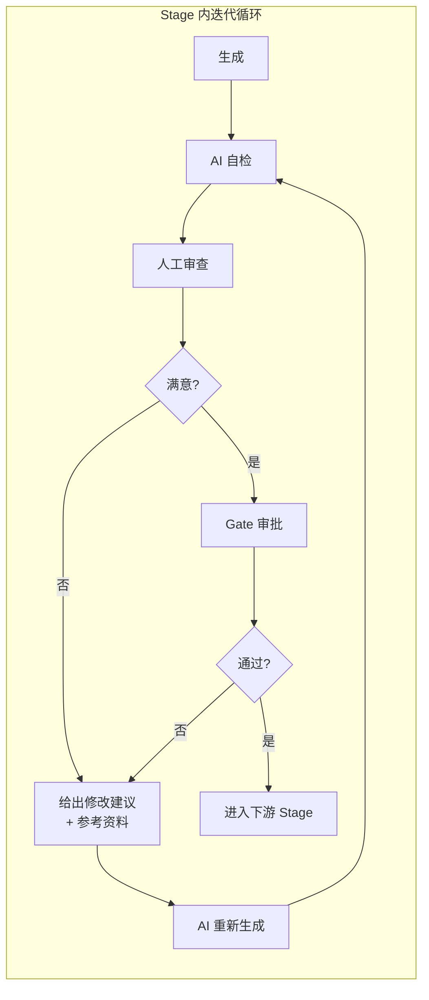
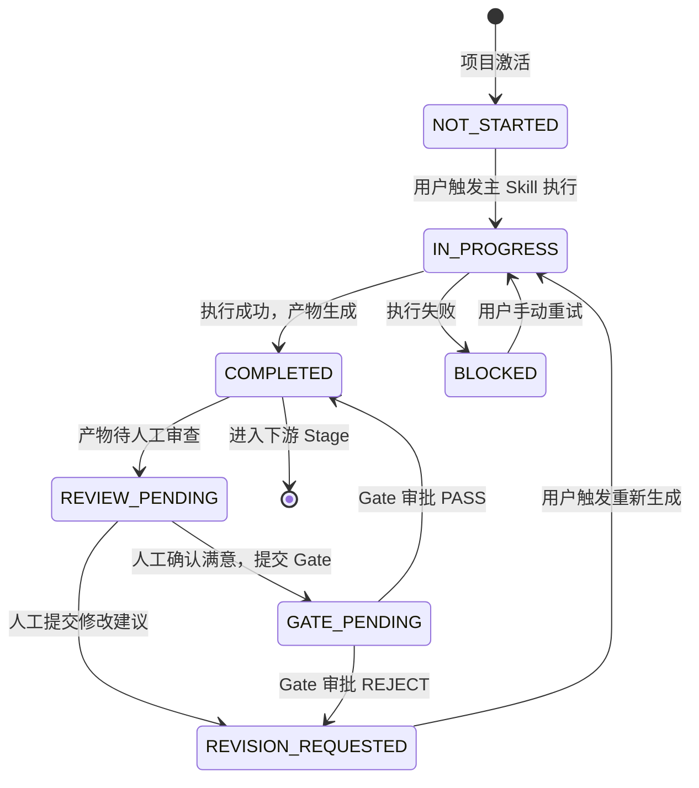
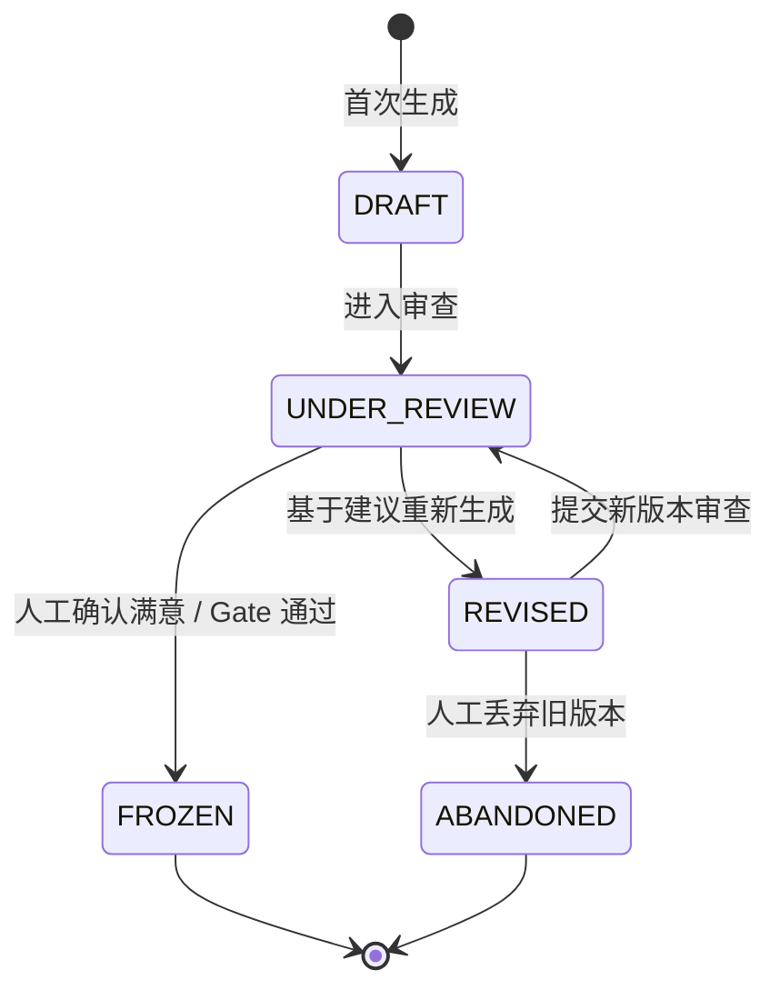

# SDLC Visualizer — 完整操作路径（Master Flow）

> 版本：v1.0
> 状态：Draft
> 说明：本文档定义用户从新建项目到归档的完整迭代式操作路径。每个阶段遵循"生成 → 检查 → 审查 → 修改 → 再检查 → Gate"的循环，直到满足质量要求后进入下一阶段。

---

## 1. 核心工作流模式

每个 SDLC Stage 的标准生命周期：

**关键原则**：
- **生成不等于结束**：Skill 首次执行产出仅为初稿，必须经过人工审查和迭代打磨
- **审查即入口**：每个 Stage 的产物预览界面必须提供批注、评论、修改建议输入能力
- **参考资料驱动修改**：人工提供的参考资料（竞品链接、设计规范、代码规范、示例文档）必须作为重新生成的上下文输入
- **版本可追溯**：每次重新生成产生新版本，支持版本对比和回滚

---

## 2. 端到端完整流程

### Stage 0：新建项目

| 步骤 | 用户操作 | 系统响应 | 人工介入 |
|------|----------|----------|----------|
| 0.1 | 点击"新建项目" | 弹出创建向导 | — |
| 0.2 | 填写项目名称、描述 | 实时校验 | — |
| 0.3 | 选择流程模板 | 展示标准 9 Stage / 快速通道 / 自定义 | 选择模板 |
| 0.4 | （可选）规模评估 | Triage 初估 → Calibrate 精修 | 确认/调整等级 |
| 0.5 | 确认创建 | 项目进入 Draft 态，初始化 Stage 定义 | — |

---

### Stage 1：需求探索（Brainstorming）

**绑定 Skills**：
- 主 Skill：`brainstorming`（生成需求探索文档）
- 辅助 Skills：`progress-tracker`（更新进度）、`competitive-analysis`（竞品分析，可选）

| 轮次 | 步骤 | 用户操作 | 系统响应 | 人工介入 |
|------|------|----------|----------|----------|
| 1.1 | 生成 | 点击"需求探索"Stage → 执行主 Skill | 触发 Kimi CLI，生成 `brainstorming.md` | 输入初始需求描述 |
| 1.2 | AI 自检 | 自动执行 `self-check` | 检查产物完整性、一致性 | — |
| 1.3 | 人工审查 | 打开产物预览，阅读 `brainstorming.md` | 系统展示 Markdown 渲染 + Mermaid 图表 | 阅读产物 |
| 1.4 | 给出建议 | 在产物上添加批注 / 在审查面板输入修改建议 / 粘贴参考资料（竞品链接、用户画像文档） | 系统保存批注和建议，关联到当前版本 | **人工给出修改建议和参考资料** |
| 1.5 | （循环） | 点击"重新生成"，系统携带修改建议和参考资料作为输入 | AI 基于反馈重新生成 `brainstorming.md` v2 | — |
| 1.6 | 再检查 | 阅读新版本，对比变更 | 系统展示 diff（高亮增删改） | 判断是否满意 |
| 1.N | Gate-1 前哨 | 满意后提交审查结论"需求探索充分" | Stage 状态变为 REVIEW_PASSED，解锁概要需求 Stage | 确认进入下一阶段 |

**审查入口**：
- Artifact Viewer 中 `brainstorming.md` 的行内批注（高亮文本 → 添加评论）
- Stage Detail 面板"审查"Tab：全局修改建议输入框 + 参考资料拖拽区
- 版本对比器：v1 vs v2 的 diff 视图

---

### Stage 2：概要需求（PRD Generation）

**绑定 Skills**：
- 主 Skill：`prd-generation`（生成 PRD-000 五文件）
- 辅助 Skills：`project-size-estimate`（规模评估）、`self-check`（自检）、`doc-quality-gate`（文档质量门禁）

| 轮次 | 步骤 | 用户操作 | 系统响应 | 人工介入 |
|------|------|----------|----------|----------|
| 2.1 | 生成 | 点击"概要需求"Stage → 执行主 Skill | 生成 `00-requirements-overview.md` 等五文件 | 可预先在审查面板粘贴参考 PRD 模板 |
| 2.2 | AI 自检 | 自动执行 `self-check` + `doc-quality-gate` | 产出自检报告：0 Error / 3 Warning / 4 Tip | — |
| 2.3 | 人工审查 | 逐页浏览五份文档 | 系统展示文档渲染 + 自检报告摘要 | 阅读产物 |
| 2.4 | 给出建议 | 对具体文档添加批注（如"02-functional-requirements.md §3.2 缺少异常路径"）| 批注关联到具体文件和行号 | **人工给出修改建议和参考资料** |
| 2.5 | （循环） | 点击"重新生成"，携带批注和参考资料 | AI 基于反馈修改 PRD，生成新版本 | — |
| 2.6 | 再检查 | 对比新旧版本 diff，确认问题已修复 | diff 高亮修复位置 | 判断是否满意 |
| 2.7 | Gate-1 | 满意后进入 Gate-1 审批 | AI 生成 Gate-1 自检摘要 | 审批决策：通过 / 驳回 |
| 2.8 | 若驳回 | 填写驳回理由 + 参考资料 | Stage 状态变为 BLOCKED，保留批注 | **给出修改建议和参考资料** |
| 2.9 | 再修改 | 点击"重新生成" | AI 基于 Gate 驳回理由重新生成 | — |
| 2.10 | 再审 | 确认修复后重新提交 Gate-1 | 系统展示与上次驳回版本的对比 | 再次审批 |
| 2.11 | Gate-1 通过 | 点击"确认通过" | PRD-000 冻结为 v1.0，解锁详细需求 Stage | **人工签字确认** |

**审查入口**：
- Artifact Viewer 支持多文档 Tab 切换（五文件并排或标签页）
- 行内批注支持跨文档引用（如批注"此需求与 01-requirements-list.md BR-003 冲突"）
- 审查面板展示自检报告（Error/Warning/Tip 清单），点击可定位到具体文档位置

---

### Stage 3：详细需求（Detailed Requirements）

**绑定 Skills**：
- 主 Skill：`detailed-requirements`（按模块拆解）
- 辅助 Skills：`self-check`（自检）、`doc-quality-gate`（文档质量门禁）、`mermaid-diagrams`（图表修复）

| 轮次 | 步骤 | 用户操作 | 系统响应 | 人工介入 |
|------|------|----------|----------|----------|
| 3.1 | 生成 | 执行 `detailed-requirements`，输入 PRD-000 | 生成 feature-01 ~ feature-10 共 10 个模块的 `module-requirements.md` | 可在审查面板提供模块拆分偏好 |
| 3.2 | AI 自检 | 自动执行跨模块一致性检查 + doc-quality-gate | 产出 `_consistency-report.md` + `self-check-report.md` | — |
| 3.3 | 人工审查 | 逐模块阅读（重点检查交互规格、状态机、业务规则映射）| 系统展示模块列表，已读模块标记勾选 | 阅读产物 |
| 3.4 | 给出建议 | 对具体模块添加批注（如"feature-06 缺少超时监控的异常处理"）| 批注关联到模块和章节 | **人工给出修改建议和参考资料** |
| 3.5 | （循环） | 点击"重新生成"，可指定仅重跑某模块 | AI 基于反馈修改指定模块，其他模块不变 | — |
| 3.6 | 再检查 | 对比 diff，确认修改未引入新问题 | 一致性检查增量运行（仅检查修改的模块） | 判断是否满意 |
| 3.7 | Gate-2.5 | 满意后进入 Gate-2.5 | AI 生成 Gate-2.5 自检摘要 | 审批决策：通过 / 驳回 |
| 3.8 | 若驳回 | 填写驳回理由 | 状态变为 BLOCKED | **给出修改建议** |
| 3.9 | 再修改/再审 | 循环直到通过 | 每次重新生成都产生新版本 | — |
| 3.10 | Gate-2.5 通过 | 签字确认 | 详细需求冻结，解锁概要设计 Stage | **人工签字确认** |

**审查入口**：
- 模块索引页：展示 10 个模块卡片，每个显示自检结果（Error/Warning 数）
- 点击模块进入 Artifact Viewer 行内批注
- 审查面板支持"批量建议"（适用于跨模块共性问题）

---

### Stage 4：概要设计（High-Level Design）

**绑定 Skills**：
- 主 Skill：`high-level-design`（生成 HLD 六文件）
- 辅助 Skills：`self-check`、`functional-architecture-generator`（架构图生成）

| 轮次 | 步骤 | 用户操作 | 系统响应 | 人工介入 |
|------|------|----------|----------|----------|
| 4.1 | 生成 | 执行 `high-level-design`，输入 PRD-000 + 详细需求 | 生成 `00-design-overview.md` 等六文件 + Mermaid 架构图 | 可预先提供技术栈偏好 |
| 4.2 | AI 自检 | 自动执行自检 | 检查设计文档 vs 需求的一致性 | — |
| 4.3 | 人工审查 | 重点审查技术选型、数据架构、接口概览 | 系统展示架构图 + 设计文档 | 阅读产物 |
| 4.4 | 给出建议 | 批注（如"数据库选型应补充 PostgreSQL 对比"）| 保存批注 | **给出修改建议和参考资料** |
| 4.5 | （循环） | 重新生成 | 修改设计文档 | — |
| 4.6 | 再检查 | diff 对比 | 高亮变更 | 判断 |
| 4.7 | Gate-2 | 进入 Gate-2 | AI 生成自检摘要 | 审批：通过 / 驳回 |
| 4.8 | 通过 | 签字确认 | HLD 冻结，解锁详细设计 Stage | **人工签字确认** |

---

### Stage 5：详细设计（Detailed Design）

**绑定 Skills**：
- 主 Skill：`detailed-design`（逐模块输出设计文档 + DDL + API Spec）
- 辅助 Skills：`interface-first-dev`（接口契约）、`self-check`

| 轮次 | 步骤 | 用户操作 | 系统响应 | 人工介入 |
|------|------|----------|----------|----------|
| 5.1 | 生成 | 执行 `detailed-design` | 生成各模块 `design.md` + `api-spec.md` | — |
| 5.2 | AI 自检 | 自检 + 接口校验 | 检查设计 vs HLD 的一致性 | — |
| 5.3 | 人工审查 | 审查模块设计细节 | 展示设计文档 | 阅读 |
| 5.4 | 给出建议 | 批注（如"API 缺少分页参数"）| 保存批注 | **给出修改建议和参考资料** |
| 5.5 | （循环） | 重新生成 | 修改设计 | — |
| 5.6 | 再检查 | diff 对比 | 高亮变更 | 判断 |
| 5.7 | 完成 | 满意后标记完成 | Stage 状态变为 COMPLETED，进入编码准备 | 确认完成 |

---

### Stage 6：接口契约（Interface Contract）

**绑定 Skills**：
- 主 Skill：`interface-first-dev`（生成 OpenAPI YAML）
- 辅助 Skills：`self-check`（契约一致性检查）

| 轮次 | 步骤 | 用户操作 | 系统响应 | 人工介入 |
|------|------|----------|----------|----------|
| 6.1 | 生成 | 执行 `interface-first-dev` | 生成 `openapi.yaml` | — |
| 6.2 | AI 自检 | 契约校验 | 检查接口完整性、参数一致性 | — |
| 6.3 | 人工审查 | 预览 Swagger UI / YAML | 展示交互式 API 文档 | 阅读 |
| 6.4 | 给出建议 | 批注（如"响应体缺少 error_code 字段"）| 保存批注 | **给出修改建议和参考资料** |
| 6.5 | （循环） | 重新生成 | 修改接口定义 | — |
| 6.6 | 再检查 | diff 对比 | 高亮变更 | 判断 |
| 6.7 | 完成 | 满意后标记完成 | 接口契约冻结，进入编码 Stage | 确认完成 |

---

### Stage 7：编码（Implementation）

**绑定 Skills**：
- 主 Skill：`executing-plans`（按 tasks.md 逐个执行编码任务）
- 辅助 Skills：`task-breakdown`（任务拆解）、`test-driven-development`（TDD）、`python-google-style` / `java-alibaba-style`（代码风格）

| 轮次 | 步骤 | 用户操作 | 系统响应 | 人工介入 |
|------|------|----------|----------|----------|
| 7.1 | 任务拆解 | 执行 `task-breakdown` | 生成 `tasks.md`（≤30 分钟/任务） | 可调整任务拆分 |
| 7.2 | 编码执行 | 按 Batch 逐个点击执行任务 | 触发 Kimi CLI，执行 RED-GREEN-REFACTOR | — |
| 7.3 | AI 自检 | 自动执行 `unit-test`（覆盖率检查）+ `self-check` | 产出测试报告、覆盖率数据 | — |
| 7.4 | 人工审查 | 审查代码产物 | 展示代码高亮 + 测试报告 | 阅读代码 |
| 7.5 | 给出建议 | 批注（如"缺少异常处理"、"命名不规范"）| 保存批注 | **给出修改建议和参考资料（如代码规范链接）** |
| 7.6 | （循环） | 点击"重新生成"（修复指定任务）| AI 基于批注修改代码 | — |
| 7.7 | 再检查 | diff 对比 + 重新运行测试 | 展示代码 diff + 新测试报告 | 判断是否满意 |
| 7.8 | 代码审查 | 满意后提交 `requesting-code-review` | 生成审查请求书 | 触发审查流程 |
| 7.9 | 审查反馈 | 系统或人工执行 `code-reviewer` | 产出审查报告 | **审查者给出修改建议** |
| 7.10 | 修复 | 执行 `receiving-code-review` | 生成修复计划，修改代码 | — |
| 7.11 | 复查 | 重新运行测试 + 审查 | 确认修复完成 | 判断 |
| 7.12 | 完成 | 满意后标记完成 | 代码冻结，进入测试 Stage | 确认完成 |

**审查入口**：
- 代码预览器：支持语法高亮、行号、行内批注
- 测试报告面板：展示覆盖率、失败用例，点击用例可批注
- 审查面板：展示审查报告 checklist，逐条确认修复

---

### Stage 8：测试（Testing）

**绑定 Skills**：
- 主 Skill：`integration-test`（集成测试）
- 辅助 Skills：`unit-test`（补全单元测试）、`uat-verification`（UAT 检查清单）

| 轮次 | 步骤 | 用户操作 | 系统响应 | 人工介入 |
|------|------|----------|----------|----------|
| 8.1 | 单元测试 | 执行 `unit-test-generator` 补全测试 | 生成/补全测试代码 | — |
| 8.2 | 集成测试 | 执行 `integration-test` | 生成 E2E 测试用例并执行 | — |
| 8.3 | AI 自检 | 覆盖率检查 | 产出覆盖率报告 | — |
| 8.4 | 人工审查 | 审查测试用例和报告 | 展示测试报告 | 阅读 |
| 8.5 | 给出建议 | 批注（如"缺少边界条件测试"）| 保存批注 | **给出修改建议** |
| 8.6 | （循环） | 重新生成测试 | 修改测试用例 | — |
| 8.7 | 再检查 | 重新运行测试 | 新测试报告 | 判断 |
| 8.8 | 完成 | 覆盖率 ≥70% 且全部通过 | 解锁 UAT Stage | 确认完成 |

---

### Stage 9：UAT 与 Gate-3

**绑定 Skills**：
- 主 Skill：`uat-verification`（生成 UAT 报告）
- 辅助 Skills：`self-check`（UAT 质量检查）

| 轮次 | 步骤 | 用户操作 | 系统响应 | 人工介入 |
|------|------|----------|----------|----------|
| 9.1 | UAT 准备 | 执行 `uat-verification` | 生成 `uat-report.md`（检查清单） | — |
| 9.2 | 人工 UAT | 按检查清单逐项验证 | 系统展示检查清单，逐项勾选 | **人工执行端到端验证** |
| 9.3 | 发现问题 | 在 UAT 报告上批注缺陷 | 保存缺陷批注 | **给出修改建议和参考资料** |
| 9.4 | 修复 | 点击"修复缺陷"，系统退回编码/测试 Stage | 重新执行相关任务 | — |
| 9.5 | 回归验证 | 重新执行 UAT 检查清单 | 展示新的 UAT 报告 | **人工验证** |
| 9.6 | Gate-3 | 检查清单全部通过 | 进入 Gate-3 审批 | 审批：通过 / 驳回 |
| 9.7 | Gate-3 通过 | 签字确认 | 解锁发布 Stage | **人工签字确认** |

---

### Stage 10：发布（Release）

**绑定 Skills**：
- 主 Skill：`release-management`（生成发布清单和发布说明）
- 辅助 Skills：`git-automation`（提交信息生成）

| 轮次 | 步骤 | 用户操作 | 系统响应 | 人工介入 |
|------|------|----------|----------|----------|
| 10.1 | 生成 | 执行 `release-management` | 生成 `release-notes.md` + `rollback-plan.md` | — |
| 10.2 | 人工审查 | 审查发布清单 | 展示发布文档 | 阅读 |
| 10.3 | 给出建议 | 批注（如"回滚方案缺少数据库脚本"）| 保存批注 | **给出修改建议** |
| 10.4 | （循环） | 重新生成 | 修改发布文档 | — |
| 10.5 | 再检查 | diff 对比 | 高亮变更 | 判断 |
| 10.6 | 发布确认 | 满意后人工执行发布 | 系统生成最终发布清单，**由人工点击"确认发布"** | **人工执行最终发布** |

---

### Stage 11：归档（Finish）

**绑定 Skills**：
- 主 Skill：`finish`（归档收尾）

| 轮次 | 步骤 | 用户操作 | 系统响应 | 人工介入 |
|------|------|----------|----------|----------|
| 11.1 | 生成 | 执行 `finish` | 生成分支合并、OpenSpec 归档、CHANGELOG | — |
| 11.2 | 人工审查 | 审查归档产物 | 展示归档报告 | 阅读 |
| 11.3 | 归档确认 | 人工输入"确认归档" | 项目状态变为 Archived | **人工确认归档** |

---

## 3. 人工介入点汇总

| 介入类型 | 出现位置 | 功能入口 | 输入内容 |
|----------|----------|----------|----------|
| **产物行内批注** | Artifact Viewer | 高亮文本 → 添加评论气泡 | 评论文本、批注类型（问题/建议/疑问/ praise）|
| **全局修改建议** | Stage Detail 面板"审查"Tab | 多行文本输入框 | 结构化建议（按优先级：P0阻塞/P1建议/P2优化）|
| **参考资料注入** | Stage Detail 面板"参考资料"区 | URL 输入框 / 文件拖拽 / 文本粘贴 | 竞品链接、设计规范、代码规范、示例文档、截图 |
| **Gate 审批** | Gate Center | 通过/驳回/延期按钮 + 评语输入 | 审批结论、评语/驳回理由 |
| **UAT 验证** | UAT 报告页面 | 检查清单逐项勾选 + 缺陷批注 | 验证结果、缺陷描述、截图 |
| **版本对比决策** | 版本对比器 | "采用此版本" / "继续修改" 按钮 | 版本选择 |

---

## 4. 状态机扩展

### 4.1 Stage 状态机（含迭代审查）

**新增状态说明**：
- `REVIEW_PENDING`：产物已生成，等待人工审查。此状态下 Stage 节点显示"待审查"徽章（紫色）
- `REVISION_REQUESTED`：人工已提交修改建议，等待重新生成。此状态下 Stage 节点显示"修改中"徽章（蓝色闪烁）

### 4.2 产物版本状态

---

## 5. 关键业务规则

| 规则编号 | 规则描述 | 适用场景 |
|----------|----------|----------|
| BR-018 | Stage 产物生成后必须进入 REVIEW_PENDING 状态，禁止自动流转到 GATE_PENDING 或 COMPLETED | 所有 Stage |
| BR-019 | 人工必须至少浏览 1 份产物并停留 ≥30 秒，才可提交修改建议或 Gate 审批 | 防止未经阅读的草率审批 |
| BR-020 | 重新生成时必须携带前序版本的全部人工批注和参考资料作为上下文输入 | 确保修改建议不被遗忘 |
| BR-021 | 产物版本历史保留最近 10 个版本，超过后自动归档到压缩存储 | 版本管理 |
| BR-022 | Gate 审批驳回后，系统必须保留驳回理由并自动关联到产物批注 | 确保修复时可见原始驳回原因 |
| BR-023 | 辅助 Skill 的产物（自检报告、质量门禁报告）默认不触发 REVIEW_PENDING，但可在审查面板查看 | 辅助产物 vs 主产物区分 |

---

## 6. 与现有需求的对照检查

### 6.1 已覆盖场景

| 场景 | 覆盖位置 | 状态 |
|------|----------|------|
| 新建项目 + 模板选择 | US-001, feature-01 | ✅ |
| Skill 执行 + 状态同步 | US-002, feature-02/06/07 | ✅ |
| Gate 审批（通过/驳回） | US-003, feature-05 | ✅ |
| 产物浏览（Markdown/Mermaid/YAML） | US-004, feature-04 | ✅ |
| Skill 导入 | US-005, feature-09 | ✅ |
| 历史分析 | US-006, feature-08 | ✅ |
| 规模评估 | US-007, feature-01/10 | ✅ |
| Timebox / 范围锚定 | US-008, feature-01/10 | ✅ |

### 6.2 待补充场景

| 场景 | 缺口说明 | 建议补充位置 |
|------|----------|-------------|
| **产物行内批注** | Artifact Viewer 为只读，无批注能力 | feature-04 IN-Scope + REQ-P0-020 |
| **全局修改建议输入** | Stage Detail 无审查 Tab | feature-03 IN-Scope + REQ-P0-021 |
| **参考资料注入** | 无向 AI 提供参考资料的入口 | feature-03 + feature-06 + REQ-P0-022 |
| **产物版本历史与对比** | 仅提到 P1，MVP 无版本管理 | feature-04 IN-Scope + REQ-P0-023 |
| **REVIEW_PENDING 状态** | 状态机缺少"待审查"和"修改中" | 02-functional-requirements.md + feature-02 |
| **重新生成（基于反馈）** | 重试按钮只是重新执行相同 Skill，无反馈输入 | feature-03 + feature-06 + REQ-P0-024 |
| **审查时长防草率** | 无最小阅读时间限制 | BR-019 |
| **辅助产物不触发审查** | 未区分主产物和辅助产物的审查策略 | BR-023 |
