# SDLC Visualizer Implementation Plan

> **For agentic workers:** 下一步 REQUIRED SUB-SKILL: `/skill:task-breakdown` 将此计划转换为可执行任务。
> **生成时间:** 2026-06-02T09:00:00+08:00
> **变更名:** sdlc-visualizer

## Goal

构建 Arsitect SDLC Visualizer 的完整前后端实现，覆盖从 Application 治理、项目工作台、Skill 注册与 DAG 管理、模板引擎、阶段详情、审批中心、产物浏览、执行计划编排到 Skill 调度执行的核心链路，以及复杂度评估、C4 架构、监控看板、历史回溯、旁路审批、OpenUI / Wireframe / 双向绑定 / 需求草图等增强能力。

## Architecture

采用前后端分离架构，后端按 FastAPI Router → Service → Repository 三层组织，前端按 React 函数组件 + Zustand 状态管理 + React Flow 画布组织。数据层 MVP 使用 SQLite（零配置启动），P1 迁移至 PostgreSQL。前后端通过冻结的 OpenAPI 3.1 契约（154 端点）通信，Mock 数据支持前端独立开发。

## Tech Stack

- **前端:** React 19 + Vite 6 + TypeScript 5.6 + React Router 7 + @xyflow/react 12 + Zustand 5 + React-Markdown 9 + remark-gfm 4 + Mermaid 10.9 + Axios 1.7
- **后端:** FastAPI 0.115 + SQLAlchemy 2.0 + Pydantic 2 + Uvicorn 0.32 + Alembic 1.14 + HTTPX 0.27 + python-multipart + aiofiles
- **数据库:** SQLite 3（MVP）→ PostgreSQL 15+（P1）
- **测试:** pytest 8.3 + pytest-asyncio + pytest-cov（覆盖率门控 ≥70%）
- **代码质量:** ruff 0.8 + mypy 1.13（strict 模式）
- **版本控制:** Git + Conventional Commits

---

## Phase 1: 基础设施与公共组件

### Module 0: 项目骨架与全局基础设施

#### 实现顺序

1. **后端项目骨架初始化**
   - 创建 `backend/app/core/config.py`：Pydantic-Settings 配置类，读取 `.env` 文件，定义 `DATABASE_URL`、`CORS_ORIGINS`、`SECRET_KEY`
   - 创建 `backend/app/core/exceptions.py`：按 `shared/design.md` 实现异常类层次（ArsitectException / ValidationException / UnauthorizedException / ForbiddenException / NotFoundException / ConflictException / UnprocessableException / RateLimitException / InternalException）
   - 创建 `backend/app/core/pagination.py`：实现 `PageRequestDTO` 和 `PageResponseDTO` 泛型模型，含参数校验白名单逻辑
   - 创建 `backend/app/core/logging.py`：结构化日志配置，输出 JSON 格式，含 `request_id` 字段

2. **数据库连接与迁移**
   - 创建 `backend/app/infrastructure/database/session.py`：SQLAlchemy `AsyncSession` 工厂与 `engine` 初始化
   - 创建 `backend/app/infrastructure/database/base.py`：SQLAlchemy 2.0 DeclarativeBase 基类
   - 初始化 `backend/alembic.ini` 与 `backend/migrations/env.py`：Alembic 配置，目标 SQLite
   - 执行 `alembic revision --autogenerate -m "init"` 生成初始迁移脚本

3. **FastAPI 应用入口与中间件**
   - 修改 `backend/main.py`：注册全局异常处理器（将异常类映射到 RFC 7807 Problem JSON 响应），挂载 CORS 中间件（`allow_origins=["http://localhost:5173"]`），注册 `/api/v1/health` 端点
   - 创建 `backend/app/api/v1/router.py`：API v1 总路由注册器

4. **公共 Schema 与前端基础设施**
   - 创建 `backend/app/schemas/common.py`：`PageResponse` 泛型模型、`Problem` 模型（RFC 7807）、`FileUploadResultDTO`
   - 创建 `frontend/src/services/api.ts`：Axios 实例配置，含 `X-Request-ID` Header 自动注入、401 统一处理、响应拦截器（Problem JSON 解析）
   - 创建 `frontend/src/services/health.ts`：`GET /api/v1/health` 封装，前端启动时检测后端可用性
   - 创建 `frontend/src/stores/appStore.ts`：Zustand Store，管理全局加载态、错误提示、后端健康状态

#### 关键决策

- **数据库连接池：** SQLite 使用 `check_same_thread=False` + `poolclass=StaticPool`，避免异步并发冲突；P1 迁移 PostgreSQL 时仅替换 `create_async_engine` 的 URL 与 pool 配置
- **异常响应格式：** 严格遵循 RFC 7807 `application/problem+json`，与 `shared/api-spec.md` 中 `ApiErrorResponse` 结构对齐
- **分页默认值：** `page=1`、`page_size=50`、`max_page_size=200`，超出范围时自动修正而非报错

#### 依赖关系

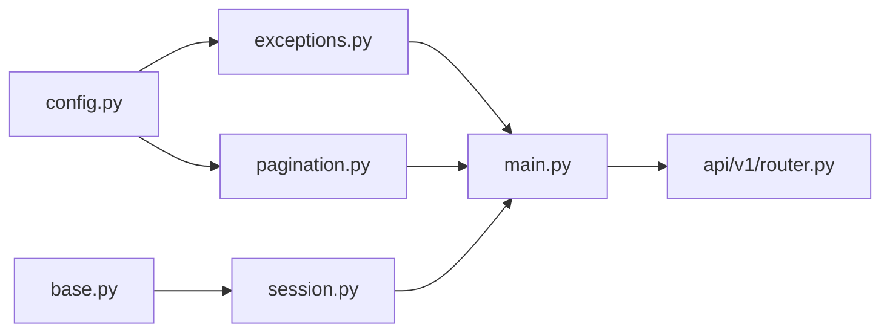

#### 验收标准

- [ ] `GET /api/v1/health` 返回 `{"status":"healthy","version":"1.0.0","database":"connected","uptime_seconds":N}`
- [ ] `POST /api/v1/files/upload`（multipart/form-data，最大 10MB）返回 `FileUploadResultDTO`
- [ ] `GET /api/v1/search?q=xxx` 返回 `PageResponse<SearchResultDTO>`，响应时间 < 500ms（SQLite LIKE 前缀匹配）
- [ ] `ruff check backend/` 零报错，`mypy backend/` strict 模式通过
- [ ] 前端 `npm run typecheck` 零报错，`npm run lint` 零报错

#### 风险与缓解

| 风险 | 影响 | 缓解 |
|------|------|------|
| SQLite 异步并发写冲突 | 高 | 使用 `aiosqlite` 驱动 + `StaticPool` + 写操作串行化队列 |
| mypy strict 模式对 SQLAlchemy 2.0 类型推断失败 | 中 | 使用 `sqlalchemy2-stubs`，模型字段显式标注 `Mapped[T]` |

---

### Module 1: DR-015 Application 与模块治理

#### 实现顺序

1. **数据模型与 Repository**
   - 创建 `backend/app/models/application.py`：SQLAlchemy `Application` 模型，字段：`application_id`（UUID v4 PK）、`application_name`、`description`、`local_path`、`workspace_id`（默认 `'default'`）、`path_accessible`、`last_active_at`、`created_at`、`updated_at`；添加 `uq_app_name_per_ws` 唯一约束
   - 创建 `backend/app/infrastructure/database/repositories/application_repo.py`：`ApplicationRepository`，实现 `create`、`list_by_workspace`、`get_by_id`、`update`、`delete`（软删除标记，MVP 物理删除）、`check_name_exists`
   - 创建 `backend/app/models/module.py`（P1 功能）：`Module` 模型，字段：`module_id`、`project_id`、`module_name`、`description`、`milestone_stage`、`scope_locked`

2. **Service 层**
   - 创建 `backend/app/services/application_service.py`：`ApplicationService`，实现 CRUD、路径存在性校验（`os.path.exists`）、路径可访问性定期检测逻辑
   - 创建 `backend/app/services/module_service.py`（P1）：`ModuleService`，实现 Module 定义、里程碑计算、范围锚定

3. **API Router**
   - 创建 `backend/app/api/v1/applications.py`：`ApplicationRouter`，端点：`POST /api/v1/applications`、`GET /api/v1/applications`、`GET /api/v1/applications/{id}`、`PUT /api/v1/applications/{id}`、`DELETE /api/v1/applications/{id}`、`GET /api/v1/applications/{id}/stats`（P1，Token 消耗聚合）
   - 创建 `backend/app/api/v1/modules.py`（P1）：`ModuleRouter`，端点：`GET/POST/PUT/DELETE /api/v1/projects/{id}/modules`

4. **前端页面**
   - 创建 `frontend/src/pages/AppDashboard/index.tsx`：Application 列表页，含卡片/列表视图切换、新建 Application 弹窗（路径选择器）、删除确认
   - 创建 `frontend/src/pages/AppDashboard/components/AppCard.tsx`：单应用卡片组件
   - 创建 `frontend/src/stores/appDashboardStore.ts`：Application 列表状态、筛选条件、加载态

#### 关键决策

- **路径校验：** 创建 Application 时同步校验 `local_path` 是否存在，不存在时标记 `path_accessible = FALSE` 并展示警告，但不阻断创建
- **删除策略：** MVP 阶段物理删除数据库记录，不级联删除本地文件系统；P1 增加软删除与回收站
- **Workspace 隔离：** MVP 单 Workspace（`workspace_id = 'default'`），所有查询默认过滤此值，P1 迁移时移除默认值约束

#### 依赖关系

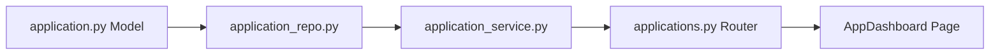

#### 验收标准

- [ ] `POST /api/v1/applications` 创建成功返回 201，重名返回 409 `DUPLICATE_NAME`
- [ ] `GET /api/v1/applications` 返回 `PageResponse<ApplicationDTO>`
- [ ] 删除 Application 后，其下项目的 `application_id` 外键因 `ON DELETE CASCADE` 自动级联删除
- [ ] 前端 Application 列表支持按名称搜索、按创建时间排序
- [ ] `pytest tests/unit/test_application_service.py` 覆盖率 ≥ 70%

#### 风险与缓解

| 风险 | 影响 | 缓解 |
|------|------|------|
| `local_path` 跨平台路径格式（Windows vs Unix） | 中 | 使用 `pathlib.Path` 统一处理，存储标准化绝对路径 |
| 大目录扫描阻塞事件循环 | 中 | 路径校验使用 `asyncio.to_thread` 委托线程池执行 |

---

### Module 2: DR-006 Skill 注册与 DAG 管理

#### 实现顺序

1. **数据模型与 Repository**
   - 创建 `backend/app/models/skill.py`：`Skill` 模型，字段：`skill_id`、`skill_name`、`version`、`pattern`、`tags`（JSON 文本）、`platforms`（JSON 文本）、`description`、`directory_path`、`parse_status`、`parse_error_reason`、`created_at`、`updated_at`；唯一约束 `(skill_name, version)`
   - 创建 `backend/app/models/skill_dag.py`：`SkillDAGNode` 和 `SkillDAGEdge` 模型，字段：`node_id`、`skill_id`、`node_type`、`position_x`、`position_y`；`edge_id`、`source_node_id`、`target_node_id`、`edge_type`
   - 创建 `backend/app/models/skill_changelog.py`：`SkillChangeLog` 模型，字段：`log_id`、`skill_id`、`change_type`、`change_detail`、`created_at`
   - 创建 `backend/app/infrastructure/database/repositories/skill_repo.py`：`SkillRepository`，实现 `create`、`list`、`get_by_id`、`delete`、`search_by_name`
   - 创建 `backend/app/infrastructure/database/repositories/dag_repo.py`：`DAGNodeRepository`、`DAGEdgeRepository`，实现节点/边 CRUD 与环检测查询

2. **Service 层**
   - 创建 `backend/app/services/skill_parser.py`：`SkillParser` 类，实现 `parse_skill_file(path)`：读取 `SKILL.md` 提取 YAML Frontmatter（`name`、`description`），读取 `meta.json` 提取 `version`、`pattern`、`tags`、`platforms`；校验 Frontmatter 必需字段缺失时标记 `parse_status = MANUAL_REQUIRED`
   - 创建 `backend/app/services/skill_import_service.py`：`SkillImportService`，实现 `scan_directory(path)`：递归扫描目录，发现 `SKILL.md` 文件后调用 `SkillParser`，处理版本冲突（同名不同版本：并存；同名同版本不同路径：标记冲突待人工确认）
   - 创建 `backend/app/services/dag_builder_service.py`：`DAGBuilderService`，实现 `build_from_skills()`：基于 Skill `description` 文本引用关系自动构建 DAG 边，使用拓扑排序检测环，环存在时标记异常边并跳过
   - 创建 `backend/app/services/dag_editor_service.py`：`DAGEditorService`，实现画布操作：节点拖拽更新坐标、增删边、撤销/重做（基于 `SkillChangeLog` 存储操作序列）

3. **API Router**
   - 创建 `backend/app/api/v1/skills.py`：`SkillRegistryRouter`，端点：`POST /api/v1/skills/import`（扫描导入）、`GET /api/v1/skills`、`GET /api/v1/skills/{id}`、`DELETE /api/v1/skills/{id}`、`GET /api/v1/skills/dag`、`POST /api/v1/skills/dag/nodes`、`POST /api/v1/skills/dag/edges`、`DELETE /api/v1/skills/dag/edges/{id}`、`GET /api/v1/skills/dag/changelog`

4. **前端页面**
   - 创建 `frontend/src/pages/SkillRegistry/index.tsx`：Skill 列表页，支持表格/卡片视图、按 pattern/tags/platforms 筛选
   - 创建 `frontend/src/pages/SkillRegistry/components/SkillDAGCanvas.tsx`：React Flow 画布组件，渲染 DAG 节点（Skill 卡片）与边，支持拖拽、连线、删除、右键菜单
   - 创建 `frontend/src/pages/SkillRegistry/components/SkillImportModal.tsx`：导入弹窗，展示扫描结果、冲突提示、确认导入列表
   - 创建 `frontend/src/stores/skillRegistryStore.ts`：Skill 列表、DAG 节点/边状态、画布视口、撤销栈

#### 关键决策

- **DAG 自动构建策略：** 基于 Skill `description` 中的自然语言引用（如"当用户提到'竞品分析'时触发"）进行模糊匹配，置信度 ≥ 0.7 的才生成边；低置信度边标记为虚线，需人工确认
- **撤销/重做深度：** 限制为 50 步，超出时丢弃最旧操作；操作日志持久化到 `skill_change_logs` 表
- **版本冲突处理：** 同名同版本不同路径视为冲突，导入时展示对比，用户选择保留哪一份或重命名

#### 依赖关系

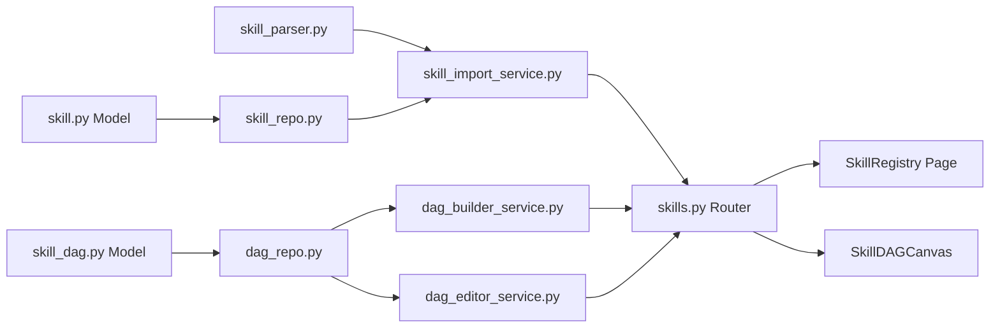

#### 验收标准

- [ ] `POST /api/v1/skills/import` 扫描 `.agents/skills/` 目录，成功解析 ≥ 90% 的 Skill 文件
- [ ] `GET /api/v1/skills/dag` 返回 DAG 节点与边数组，无环
- [ ] DAG 画布支持节点拖拽后坐标持久化，刷新页面后位置保留
- [ ] 撤销/重做栈深度 50 步，操作后 3 秒内可撤销
- [ ] 环检测在 ≥ 50 个节点时响应时间 < 200ms

#### 风险与缓解

| 风险 | 影响 | 缓解 |
|------|------|------|
| Skill description 模糊匹配准确率不足 | 高 | 引入关键词词典（竞品分析→competitive-analysis），不匹配时生成虚线边待确认 |
| React Flow 画布大数据量（>100 节点）卡顿 | 中 | 启用节点虚拟化（仅渲染视口内节点），边使用 SVG 批量渲染 |
| 文件系统权限导致扫描失败 | 低 | 捕获 `PermissionError`，记录到 `parse_error_reason`，不阻断整体导入 |

---

## Phase 2: P0 核心数据层

### Module 3: DR-009 模板引擎

#### 实现顺序

1. **数据模型与 Repository**
   - 创建 `backend/app/models/template.py`：`Template` 模型，字段：`template_id`（ENUM PK：`Trivial`/`Light`/`Standard`/`Deep`）、`template_name`、`description`、`stage_count`、`estimated_skill_count`、`applicable_complexity`、`config_json`、`created_at`、`updated_at`
   - 创建 `backend/app/models/template_stage.py`：`TemplateStage` 模型，字段：`stage_id`、`stage_name`、`order_index`、`template_id`、`primary_skill_id`、`auxiliary_skill_ids`（JSON）、`gate_id`、`skippable`、`merge_group_id`、`is_present_in`
   - 创建 `backend/app/models/project_stage.py`：`ProjectStage` 模型，字段：`project_stage_id`、`project_id`、`stage_id`、`order_index`、`status`、`primary_skill_id`、`skippable`、`is_frozen`、`merge_group_id`、`execution_status`、`created_at`、`updated_at`
   - 创建 `backend/app/models/template_deviation.py`：`TemplateDeviation` 模型，字段：`deviation_id`、`project_id`、`from_template_id`、`to_template_id`、`reason`、`impact_scope`、`created_at`；`project_id` 设置 `UNIQUE`（仅保留最新偏离记录）
   - 创建 `backend/app/infrastructure/database/repositories/template_repo.py`：`TemplateRepository`、`TemplateStageRepository`、`ProjectStageRepository`、`TemplateDeviationRepository`
   - 编写 MVP 预置数据脚本 `backend/scripts/seed_templates.py`：插入 4 条 Template 记录与对应 TemplateStage 记录

2. **Service 层**
   - 创建 `backend/app/services/template_service.py`：`TemplateService`，实现模板定义查询、按复杂度推荐默认模板、模板切换时的影响范围计算（调用 `ImpactScopeCalculator`）
   - 创建 `backend/app/services/impact_scope_calculator.py`：`ImpactScopeCalculator`，实现 `calculate_switch_impact(project_id, new_template_id)`：分析已执行 Stage（EXECUTED→标记 is_frozen）、未执行且不在新模板中的 Stage（标记 REMOVED）、新增 Stage（插入 DEFINED 状态）
   - 创建 `backend/app/services/stage_config_service.py`：`StageConfigService`，实现 Stage 序列管理、跳过标记、合并组配置

3. **API Router**
   - 创建 `backend/app/api/v1/templates.py`：`TemplateRouter`，端点：`GET /api/v1/templates`、`GET /api/v1/templates/{id}`、`GET /api/v1/projects/{id}/stages`、`PUT /api/v1/projects/{id}/stages/{stage_id}`（跳过/取消跳过）、`POST /api/v1/projects/{id}/template-deviation`（切换模板）、`GET /api/v1/projects/{id}/template-deviation`

4. **前端页面**
   - 创建 `frontend/src/pages/ProjectCreate/components/TemplateSelector.tsx`：项目创建流程中的模板选择器，展示四级模板卡片、复杂度推荐标签
   - 创建 `frontend/src/components/StageTimeline/index.tsx`：Stage 时间线组件，展示项目当前 Stage 序列、执行状态、Gate 位置、可跳过标记
   - 创建 `frontend/src/components/TemplateDeviationModal.tsx`：模板偏离确认弹窗，展示影响范围计算结果（已冻结 Stage 数、将被移除 Stage 数、新增 Stage 数）

#### 关键决策

- **模板预置数据：** MVP 阶段模板为系统预置，用户不可增删改；`config_json` 存储完整模板配置（Stage 列表、Skill 绑定、Gate 配置）
- **模板偏离唯一性：** 每项目仅保留最新一次偏离记录，旧记录被覆盖；此设计避免历史堆积，但丢失完整偏离历史（P1 如需可移除 `UNIQUE` 约束）
- **Stage 状态独立机：** `project_stages.status` 有独立状态机（DEFINED→SKIPPED/SCHEDULED→EXECUTED→FROZEN/ARCHIVED），与项目级 Stage 状态机完全解耦

#### 依赖关系

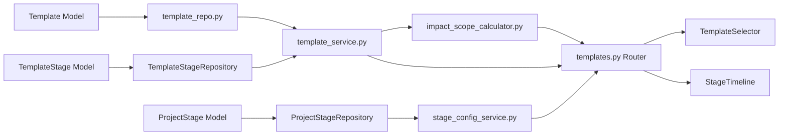

#### 验收标准

- [ ] 项目创建时自动根据所选模板生成 `project_stages` 记录，顺序与 `template_stages.order_index` 一致
- [ ] 模板切换时，已执行 Stage 标记 `is_frozen = TRUE`，不在新模板中的未执行 Stage 标记 `REMOVED`
- [ ] `GET /api/v1/templates` 返回 4 条预置模板，含完整 Stage 列表
- [ ] 前端 StageTimeline 组件正确渲染 Gate 位置、可跳过标记、合并组视觉分组
- [ ] `pytest tests/unit/test_template_service.py` 覆盖率 ≥ 70%

#### 风险与缓解

| 风险 | 影响 | 缓解 |
|------|------|------|
| 模板切换导致数据丢失（已执行 Stage 产物丢失） | 高 | 已执行 Stage 永不删除，仅标记 `is_frozen`；产物通过 `artifact_files` 外键级联保留 |
| `config_json` 结构变更导致解析失败 | 中 | 使用 Pydantic 模型校验 `config_json`，非法结构返回 422 |

---

### Module 4: DR-001 项目工作台

#### 实现顺序

1. **数据模型与 Repository**
   - 创建 `backend/app/models/project.py`：`Project` 模型，字段：`project_id`（UUID v4 PK）、`project_name`、`project_description`、`project_status`、`application_id`、`template_level`、`progress_percent`、`current_stage`、`risk_level`、`last_activity_at`、`last_activity_type`、`size_estimate_id`、`created_at`、`updated_at`；唯一约束 `(application_id, project_name, project_status)`
   - 创建 `backend/app/models/size_estimate.py`：`SizeEstimate` 模型，字段：`estimate_id`、`project_id`、`module_count`、`interface_count`、`page_count`、`tech_complexity`、`risk_level`、`optimistic_score`、`expected_score`、`conservative_score`、`complexity_level`、`created_at`
   - 创建 `backend/app/infrastructure/database/repositories/project_repo.py`：`ProjectRepository`，实现 `create`、`list_by_application`、`get_by_id`、`update`、`archive`（状态改为 `Archived`）、`activate`（`Archived`→`Active`）、`cancel`（状态改为 `Cancelled`）、`check_name_exists`
   - 创建 `backend/app/infrastructure/database/repositories/size_estimate_repo.py`：`SizeEstimateRepository`

2. **Service 层**
   - 创建 `backend/app/services/project_service.py`：`ProjectService`，实现项目 CRUD、状态流转（Draft→Active→Archived/Cancelled，双轨路径：零执行直接 Cancelled，有执行记录必须先 Archived 再 Cancelled）、进度计算（基于 `project_stages` 状态聚合）、风险等级更新
   - 创建 `backend/app/services/risk_scanner_service.py`：`RiskScannerService`，实现风险扫描：Timebox 超时检测、Stage 阻塞检测（Gate 长时间 pending）、产物异常检测（`stale_flag = TRUE`），聚合生成风险预警列表
   - 创建 `backend/app/services/timebox_service.py`：`TimeboxService`，实现 Timebox 计算与预警：基于模板 `stage_count` 和项目创建时间估算总工期，按当前进度计算偏差

3. **API Router**
   - 创建 `backend/app/api/v1/projects.py`：`ProjectRouter`，端点：`POST /api/v1/projects`、`GET /api/v1/projects`、`GET /api/v1/projects/{id}`、`PUT /api/v1/projects/{id}`、`POST /api/v1/projects/{id}/archive`、`POST /api/v1/projects/{id}/activate`、`POST /api/v1/projects/{id}/cancel`、`GET /api/v1/projects/{id}/risks`、`GET /api/v1/projects/{id}/timebox`

4. **前端页面**
   - 创建 `frontend/src/pages/ProjectDashboard/index.tsx`：项目工作台主页面，含项目卡片网格/列表视图切换、新建项目按钮、风险预警面板、进度统计
   - 创建 `frontend/src/pages/ProjectDashboard/components/ProjectCard.tsx`：项目卡片组件，展示项目名、当前阶段、进度条、风险等级标签、最后活动时间
   - 创建 `frontend/src/pages/ProjectDashboard/components/RiskAlertPanel.tsx`：风险预警面板，按严重级别分组展示风险项
   - 创建 `frontend/src/pages/ProjectDashboard/components/ProjectCreateModal.tsx`：新建项目弹窗，步骤：选择 Application → 输入项目信息 → 选择模板 → 确认创建
   - 创建 `frontend/src/stores/projectDashboardStore.ts`：项目列表状态、筛选条件（Application/状态/风险等级）、排序、分页

#### 关键决策

- **重名校验：** 同一 `application_id` 下，`project_status` 为 `Active`/`Draft`/`Cancelled` 时 `project_name` 大小写不敏感唯一；SQLite 不支持条件唯一索引，此约束在应用层实现（查询前检查）
- **状态流转双轨路径：** 零执行记录（所有 `project_stages.status = DEFINED`）的项目可直接 `Cancelled`；有执行记录的项目必须先 `Archived` 保留历史，再 `Cancelled`
- **进度计算：** `progress_percent` 不存储为数据库字段（避免频繁更新），而是在查询时基于 `project_stages` 中 `EXECUTED` 数量 / 总数动态计算；但 `projects.progress_percent` 字段保留用于缓存，由定时任务或状态变更时更新

#### 依赖关系

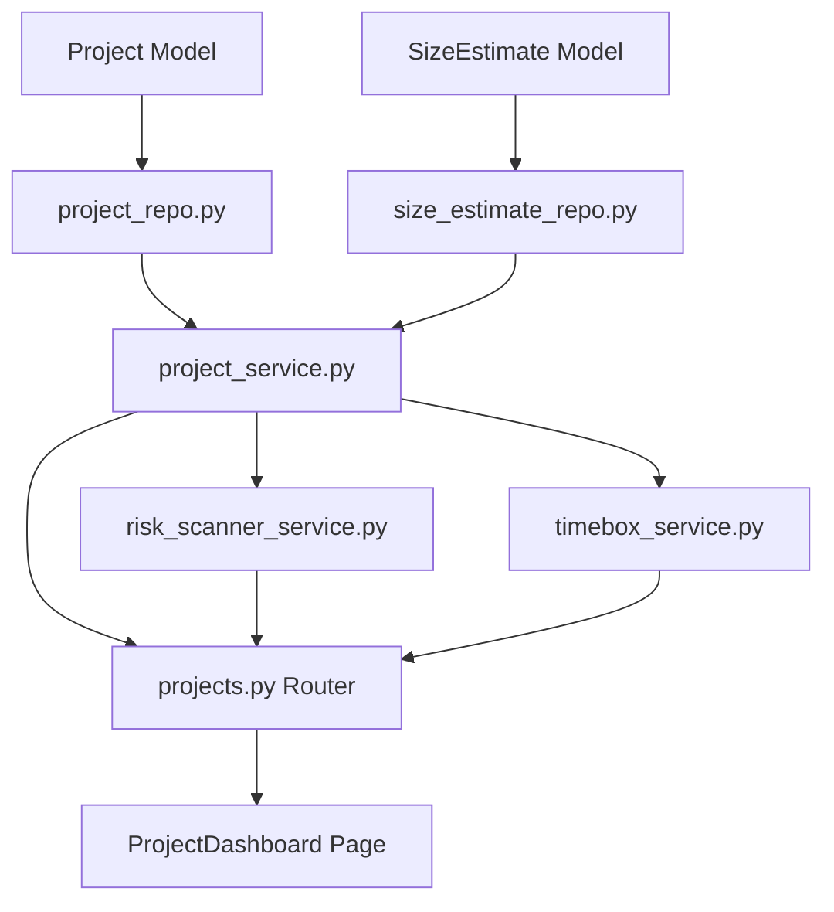

#### 验收标准

- [ ] `POST /api/v1/projects` 创建项目时同步生成 `project_stages` 实例（调用 DR-009 StageConfigService）
- [ ] 重名项目创建返回 409 `DUPLICATE_NAME`
- [ ] 有执行记录的项目直接调用 Cancel 返回 422 `PROJECT_HAS_EXECUTIONS`
- [ ] 前端项目卡片正确展示进度百分比、风险等级颜色编码（None=灰/Low=绿/Medium=黄/High=红）
- [ ] 风险扫描每 5 分钟自动执行一次（ Celery/BackgroundTask，MVP 使用 FastAPI BackgroundTask）
- [ ] `pytest tests/unit/test_project_service.py` 覆盖率 ≥ 70%

#### 风险与缓解

| 风险 | 影响 | 缓解 |
|------|------|------|
| 项目数量增长后列表查询性能下降 | 中 | 列表查询使用分页（默认 50 条），加 `idx_projects_updated` 索引；P1 增加全文检索 |
| 风险扫描频繁触发导致数据库压力 | 中 | 风险扫描使用缓存（TTL 5 分钟），同一项目不重复扫描 |
| Timebox 估算偏差过大 | 低 | Timebox 基于历史项目平均耗时校准，无历史数据时使用模板默认值 |

---

## Phase 3: P1 执行引擎

### Module 5: DR-016 PocketFlow 执行引擎

#### 实现顺序

1. **核心执行框架**
   - 创建 `backend/app/services/pocketflow/engine.py`：`PocketFlowEngine` 类，实现三阶段执行管线：`prep(skill_id, context)` → `exec(skill_input)` → `post(skill_output, context)`
   - 创建 `backend/app/services/pocketflow/prep_stage.py`：`PrepStage` 类，负责 Skill 执行前上下文组装：读取 Skill `directory_path` 下的 `SKILL.md` 与 `meta.json`，注入项目上下文（project_id、current_stage、历史产物路径列表）
   - 创建 `backend/app/services/pocketflow/exec_stage.py`：`ExecStage` 类，负责调用 Skill 实际逻辑；MVP 阶段 Skill 为本地 Markdown 文件，ExecStage 读取 `SKILL.md` 内容并传递给 AI 调用层（HTTPX 异步请求 AI API）
   - 创建 `backend/app/services/pocketflow/post_stage.py`：`PostStage` 类，负责产物收集与状态更新：将 AI 输出写入 `openspec/changes/{change}/` 对应目录，生成 `artifact_files` 记录，更新 `project_stages.execution_status`

2. **状态机与错误处理**
   - 创建 `backend/app/services/pocketflow/state_machine.py`：`SkillExecutionStateMachine`，状态：`NOT_STARTED` → `PREPARING` → `EXECUTING` → `POST_PROCESSING` → `COMPLETED` / `FAILED` / `CANCELLED`
   - 实现状态流转校验：禁止从 `COMPLETED` 直接回到 `EXECUTING`（必须通过 Retry 重新创建执行实例）

3. **日志收集器**
   - 创建 `backend/app/services/pocketflow/log_collector.py`：`LogCollector` 类，按执行实例收集三阶段日志，支持增量追加、日志级别过滤（DEBUG/INFO/WARNING/ERROR）

#### 关键决策

- **AI 调用层抽象：** MVP 阶段直接通过 HTTPX 调用 Kimi API（或用户配置的 AI 服务端点），P1 抽象为 `AIProvider` 接口，支持多厂商切换
- **产物写入策略：** Skill 输出直接写入文件系统（`openspec/changes/{change}/{stage}/`），同时生成 `artifact_files` 数据库记录建立索引；文件系统为真实数据源，数据库为索引
- **执行隔离：** 每个 Skill 执行实例在独立异步任务中运行，失败不影响其他实例；使用 `asyncio.TaskGroup` 管理并发

#### 依赖关系

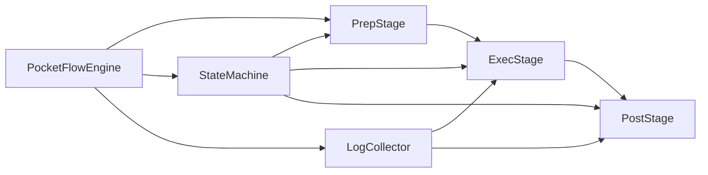

#### 验收标准

- [ ] 三阶段执行管线完整运行，`NOT_STARTED` → `COMPLETED` 耗时 < 30 秒（简单 Skill）
- [ ] 失败 Skill 状态正确流转至 `FAILED`，日志包含完整错误堆栈
- [ ] 产物文件正确写入文件系统，数据库 `artifact_files` 记录同步生成
- [ ] 状态机非法流转抛出 `UnprocessableException`（422）

#### 风险与缓解

| 风险 | 影响 | 缓解 |
|------|------|------|
| AI API 超时或不可用 | 高 | ExecStage 设置 60 秒超时，超时后状态标记 `FAILED`，支持重试 |
| 产物文件并发写入冲突 | 中 | 使用项目级异步锁（`asyncio.Lock` 存储于内存字典，key=project_id） |

---

### Module 6: DR-007 Skill Flow 编排引擎

#### 实现顺序

1. **数据模型与 Repository**
   - 创建 `backend/app/models/execution_plan.py`：`ExecutionPlan` 模型，字段：`plan_id`、`project_id`、`plan_version`、`status`、`created_at`、`updated_at`
   - 创建 `backend/app/models/plan_node.py`：`PlanNode` 模型，字段：`node_id`、`plan_id`、`stage_id`、`skill_id`、`node_status`、`group_id`、`order_index`
   - 创建 `backend/app/models/parallel_group.py`：`ParallelGroup` 模型，字段：`group_id`、`plan_id`、`group_type`、`member_node_ids`（JSON）
   - 创建 `backend/app/models/bypass_record.py`：`BypassRecord` 模型，字段：`record_id`、`plan_id`、`gate_id`、`requester`、`approver`、`reason`、`created_at`
   - 创建 `backend/app/infrastructure/database/repositories/execution_plan_repo.py`：`ExecutionPlanRepository`、`PlanNodeRepository`、`ParallelGroupRepository`、`BypassRecordRepository`

2. **Service 层**
   - 创建 `backend/app/services/execution_plan_generator.py`：`ExecutionPlanGenerator`，实现 `generate_plan(project_id)`：消费 DR-006 DAG 结构与 DR-009 模板 Stage 定义，生成执行计划节点序列；主 Skill 串行、辅助 Skill 并行，跨 Stage 按 Gate 状态调度
   - 创建 `backend/app/services/stage_orchestrator.py`：`StageOrchestrator`，实现 Stage 就绪检查（前置 Gate 已通过、依赖产物存在）、内部分组调度（同一 Stage 内主/辅 Skill 分组）、模块级并行流管理
   - 创建 `backend/app/services/module_scheduler.py`：`ModuleScheduler`，实现跨 Module 完全并行调度，同一 Module 内按依赖串并行
   - 创建 `backend/app/services/bypass_approval_service.py`：`BypassApprovalService`，实现旁路授权校验（权限检查、理由长度 5-500 字符）、审计记录写入 `bypass_records`

3. **API Router**
   - 创建 `backend/app/api/v1/execution_plans.py`：`ExecutionPlanRouter`，端点：`POST /api/v1/execution-plans`、`GET /api/v1/execution-plans/{id}`、`GET /api/v1/projects/{id}/execution-plans`、`POST /api/v1/execution-plans/{id}/activate`
   - 创建 `backend/app/api/v1/executions.py`：`ExecutionRouter`，端点：`POST /api/v1/executions/trigger`、`GET /api/v1/executions/{id}/status`、`GET /api/v1/executions/{id}/logs`、`POST /api/v1/executions/{id}/retry`、`POST /api/v1/executions/{id}/cancel`

4. **前端页面**
   - 创建 `frontend/src/pages/ExecutionPlan/index.tsx`：执行计划画布页，React Flow 渲染计划节点与执行路径，高亮当前执行节点
   - 创建 `frontend/src/pages/ExecutionPlan/components/PlanNodeCard.tsx`：计划节点卡片，展示 Skill 名称、状态、进度、操作按钮（触发/重试/取消）
   - 创建 `frontend/src/stores/executionPlanStore.ts`：执行计划状态、节点状态、画布视口、实时状态同步

#### 关键决策

- **计划版本管理：** 每次生成新计划递增 `plan_version`，旧计划保留为历史；当前生效计划由 `project.current_execution_plan_id` 指向
- **旁路审批触发条件：** Gate 阻塞超过 24 小时且项目风险等级 ≥ Medium 时，才在界面上展示旁路入口
- **执行计划可视化：** 画布节点状态颜色编码：`NOT_STARTED`=灰、`PREPARING`=蓝、`EXECUTING`=黄、`COMPLETED`=绿、`FAILED`=红

#### 依赖关系

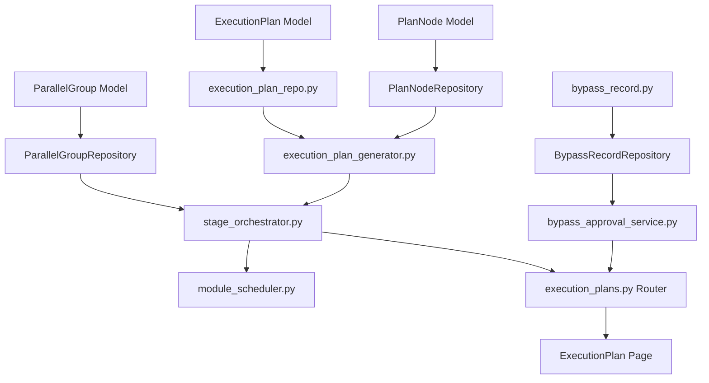

#### 验收标准

- [ ] `POST /api/v1/execution-plans` 生成计划节点序列与并行组，响应包含完整节点列表与依赖边
- [ ] 主 Skill 串行执行，辅助 Skill 并行执行，验证通过集成测试
- [ ] 旁路审批记录正确写入 `bypass_records`，含请求人、审批人、理由、时间戳
- [ ] 画布正确高亮当前执行路径，节点状态变化后 1 秒内视觉更新

#### 风险与缓解

| 风险 | 影响 | 缓解 |
|------|------|------|
| 复杂 DAG 导致计划生成耗时过长 | 中 | 计划生成使用拓扑排序（Kahn 算法），复杂度 O(V+E)，千节点级 < 100ms |
| 旁路审批滥用 | 高 | 旁路入口权限控制（仅 `tech_lead` 角色可见），所有旁路记录不可删除、永久审计 |

---

### Module 7: DR-008 Skill 调度服务

#### 实现顺序

1. **数据模型与 Repository**
   - 创建 `backend/app/models/skill_execution.py`：`SkillExecution` 模型，字段：`execution_id`、`project_id`、`plan_node_id`、`skill_id`、`status`、`start_time`、`end_time`、`retry_count`、`max_retries`、`created_at`、`updated_at`
   - 创建 `backend/app/models/execution_log.py`：`ExecutionLog` 模型，字段：`log_id`、`execution_id`、`phase`、`level`、`message`、`timestamp`
   - 创建 `backend/app/infrastructure/database/repositories/skill_execution_repo.py`：`SkillExecutionRepository`、`ExecutionLogRepository`

2. **Service 层**
   - 创建 `backend/app/services/trigger_validator.py`：`TriggerValidator`，实现触发校验：权限检查、发布类 Skill（pattern 含 `release` 或标签含 `release-management`）人工确认拦截、重复触发防护（同一 `plan_node_id` 状态为 `PREPARING`/`EXECUTING` 时拒绝新触发）
   - 创建 `backend/app/services/status_aggregator.py`：`StatusAggregator`，实现状态聚合：从 DR-016 PocketFlow 获取单个 Skill 执行状态，汇总计算 Stage 整体进度，通过 SSE 推送给前端
   - 创建 `backend/app/services/log_collector_service.py`：`LogCollectorService`（与 DR-016 LogCollector 区分，此层为调度层日志聚合），实现按 Skill 实例分组捕获日志、关键词搜索、日志级别过滤、增量推送
   - 创建 `backend/app/services/retry_manager.py`：`RetryManager`，实现重试计数、指数退避策略（首次立即、第二次 5 秒、第三次 15 秒）、上限管控（max_retries = 3）

3. **API Router**
   - 创建 `backend/app/api/v1/skill_executions.py`：`SkillExecutionRouter`，端点：`POST /api/v1/executions/trigger`、`GET /api/v1/executions/{id}/status`、`GET /api/v1/executions/{id}/logs`、`POST /api/v1/executions/{id}/retry`、`POST /api/v1/executions/{id}/cancel`、`GET /api/v1/executions/sse`（SSE 事件流，订阅执行状态变更）

4. **前端页面**
   - 创建 `frontend/src/pages/ExecutionMonitor/index.tsx`：执行监控页面，展示当前执行 Skill 列表、状态、进度条、日志实时流
   - 创建 `frontend/src/pages/ExecutionMonitor/components/ExecutionLogStream.tsx`：日志实时流组件，支持按级别过滤、关键词搜索、暂停/恢复自动滚动
   - 创建 `frontend/src/pages/ExecutionMonitor/components/RetryButton.tsx`：重试按钮组件，展示当前重试次数/最大次数、下次重试倒计时
   - 创建 `frontend/src/stores/executionMonitorStore.ts`：执行实例状态、日志缓存、SSE 连接管理

#### 关键决策

- **SSE vs 轮询：** 执行状态推送使用 SSE（`subscribeExecutionSSE`），连接断开时前端自动降级为 3 秒轮询；SSE 事件格式在编码阶段细化（WARN-IFD-005）
- **发布拦截：** 发布类 Skill（`release-management`、`finish`）触发时，状态暂停在 `PREPARING`，前端弹出人工确认弹窗，用户确认后才进入 `EXECUTING`
- **日志存储策略：** 执行日志实时写入 `execution_logs` 表，但仅保留最近 30 天日志，超期日志归档到文件系统

#### 依赖关系

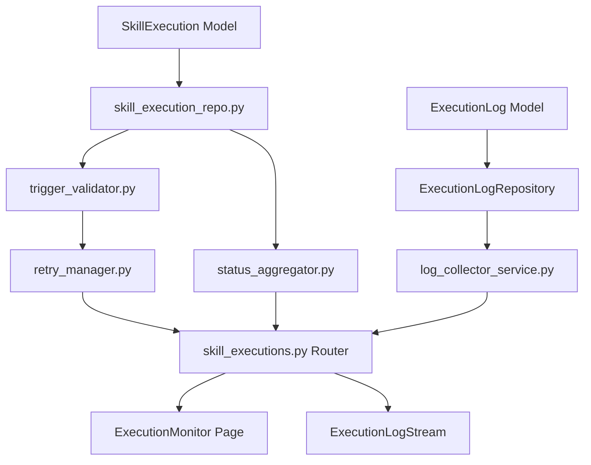

#### 验收标准

- [ ] `POST /api/v1/executions/trigger` 成功后返回 `execution_id`，重复触发返回 409 `EXECUTION_IN_PROGRESS`
- [ ] SSE 连接建立后，执行状态变更事件在 500ms 内推送到前端
- [ ] 发布类 Skill 触发时状态暂停在 `PREPARING`，人工确认后进入 `EXECUTING`
- [ ] 重试 3 次均失败后状态标记 `FAILED`，不再自动重试
- [ ] 日志搜索响应时间 < 300ms（关键词 LIKE 匹配）

#### 风险与缓解

| 风险 | 影响 | 缓解 |
|------|------|------|
| SSE 连接数过多导致服务器压力 | 中 | 单用户单项目仅维持 1 条 SSE 连接，切换项目时复用连接；后端使用 `asyncio.Queue` 管理订阅者 |
| 日志量过大导致数据库膨胀 | 中 | 执行日志保留 30 天，超期自动归档到 `logs/archive/{date}.jsonl` |

---

## Phase 4: P1 阶段与审批

### Module 8: DR-003 阶段详情面板

#### 实现顺序

1. **数据模型与 Repository**
   - 复用 `project_stages`（DR-009）、`stage_review_status`（shared）
   - 创建 `backend/app/infrastructure/database/repositories/stage_review_repo.py`：`StageReviewRepository`，实现 `get_status_by_stage`、`update_status`、`create_initial_status`
   - 创建 `backend/app/models/annotation.py`：`Annotation` 模型，字段：`annotation_id`、`project_id`、`stage_id`、`author`、`content`、`created_at`、`updated_at`
   - 创建 `backend/app/infrastructure/database/repositories/annotation_repo.py`：`AnnotationRepository`

2. **Service 层**
   - 创建 `backend/app/services/stage_detail_service.py`：`StageDetailService`，实现 Stage 详情聚合：查询 `project_stages` + `stage_review_status` + 关联产物列表 + 关联 Gate 状态 + 批注列表
   - 创建 `backend/app/services/annotation_service.py`：`AnnotationService`，实现批注 CRUD、红点提示逻辑（`REVIEW_PENDING` 且用户未浏览过时展示红点）

3. **API Router**
   - 创建 `backend/app/api/v1/stages.py`：`StageRouter`，端点：`GET /api/v1/projects/{id}/stages/{stage_id}`、`GET /api/v1/projects/{id}/stages/{stage_id}/annotations`、`POST /api/v1/projects/{id}/stages/{stage_id}/annotations`、`PUT /api/v1/projects/{id}/stages/{stage_id}/annotations/{annotation_id}`、`DELETE /api/v1/projects/{id}/stages/{stage_id}/annotations/{annotation_id}`

4. **前端页面**
   - 创建 `frontend/src/components/StageDetailPanel/index.tsx`：阶段详情抽屉面板，右侧滑出，最小 480px / 最大 900px，拖拽调整宽度，释放后持久化到 localStorage
   - 创建 `frontend/src/components/StageDetailPanel/components/SkillSnapshotTab.tsx`：Skill 指令快照 Tab，渲染 Skill 元数据、折叠面板展示指令摘要
   - 创建 `frontend/src/components/StageDetailPanel/components/PocketFlowStatusTab.tsx`：PocketFlow 三阶段 Tab，步骤条渲染、子步骤进度列表
   - 创建 `frontend/src/components/StageDetailPanel/components/ArtifactCardsTab.tsx`：产物卡片网格，点击展开预览、下载全部
   - 创建 `frontend/src/components/StageDetailPanel/components/ExecutionLogsTab.tsx`：执行日志 Tab，按 Skill 分组可折叠列表、关键词搜索、日志级别过滤
   - 创建 `frontend/src/components/StageDetailPanel/components/AnnotationTab.tsx`：审查批注 Tab，批注列表、新建/编辑/删除
   - 创建 `frontend/src/components/StageDetailPanel/components/GateLinkTab.tsx`：关联 Gate Tab，展示 Gate 状态、决策信息、跳转链接
   - 创建 `frontend/src/stores/stageDetailStore.ts`：面板状态（打开/关闭、宽度、当前 Stage）、Tab 激活状态、各 Tab 独立滚动位置、审查红点状态

#### 关键决策

- **抽屉宽度持久化：** 用户调整后的宽度存储在 `localStorage`（key: `arsitect.stageDetail.width`），下次打开时恢复
- **Tab 懒加载：** 默认激活"Skill 指令快照"Tab，其余 5 个 Tab 首次点击时才渲染内容；已渲染 Tab 切换时不销毁，保留滚动位置
- **批注红点逻辑：** `stage_review_status.current_status = REVIEW_PENDING` 且用户本次会话未打开过该 Stage 的"审查批注"Tab 时，展示红点；打开后清除

#### 依赖关系

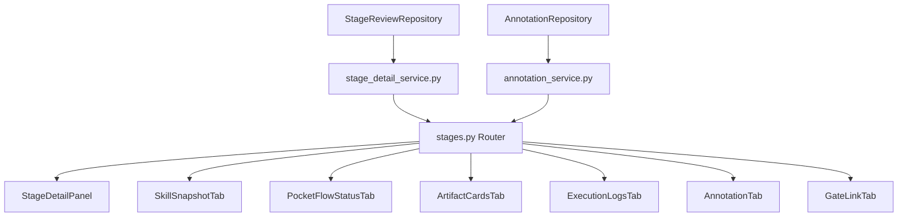

#### 验收标准

- [ ] 抽屉面板打开/关闭动画流畅（300ms CSS transition），Esc 键和遮罩点击均可关闭
- [ ] 拖拽调整宽度在 480px~900px 范围内，超出边界时弹性回弹
- [ ] 6 个 Tab 切换时各 Tab 滚动位置独立保留
- [ ] `REVIEW_PENDING` 状态下审查 Tab 展示红点，打开后红点消失
- [ ] 产物卡片点击后展开 Markdown 预览（使用 React-Markdown + remark-gfm）

#### 风险与缓解

| 风险 | 影响 | 缓解 |
|------|------|------|
| 抽屉内大量产物渲染卡顿 | 中 | 产物列表使用虚拟滚动（react-window），仅渲染视口内卡片 |
| Markdown 预览 XSS 风险 | 高 | React-Markdown 默认禁用 HTML 解析，所有链接使用 `rel="noopener noreferrer"` |

---

### Module 9: DR-004 审批中心

#### 实现顺序

1. **数据模型与 Repository**
   - 复用 `gate_decisions`、`gate_decision_history`（shared/db-schema.md）
   - 创建 `backend/app/infrastructure/database/repositories/gate_repo.py`：`GateRepository`、`GateDecisionRepository`、`GateDecisionHistoryRepository`

2. **Service 层**
   - 创建 `backend/app/services/gate_service.py`：`GateService`，实现 Gate 列表查询、详情聚合（自检摘要 + 关联产物 + 决策历史）、审批决策处理（通过/驳回/重试）
   - 实现决策后下游 Stage 解锁：`approve_gate(gate_id)` 更新 `gate_decisions.status = passed`，写入 `gate_decision_history`，调用 DR-007 `StageOrchestrator` 解锁下游 Stage
   - 实现驳回后重做流程：`reject_gate(gate_id, reason)` 更新 `gate_decisions.status = rejected`，触发 `stage_review_status.current_status = REVISION_REQUESTED`，通知 DR-003 更新红点

3. **API Router**
   - 创建 `backend/app/api/v1/gates.py`：`GateRouter`，端点：`GET /api/v1/projects/{id}/gates`、`GET /api/v1/gates/{id}`、`POST /api/v1/gates/{id}/approve`、`POST /api/v1/gates/{id}/reject`、`POST /api/v1/gates/{id}/retry`、`GET /api/v1/gates/{id}/history`

4. **前端页面**
   - 创建 `frontend/src/pages/GateCenter/index.tsx`：审批中心主页面，含 Gate 列表页（统计卡片 + Gate 卡片列表 + 筛选栏）
   - 创建 `frontend/src/pages/GateCenter/components/StatCards.tsx`：三卡片：待审 Gate 数 / 已通过数 / 已驳回数（立项 Gate 单独标记）
   - 创建 `frontend/src/pages/GateCenter/components/GateCardList.tsx`：Gate 卡片网格，含状态、置信度、阻塞下游信息
   - 创建 `frontend/src/pages/GateCenter/components/GateDetailPage.tsx`：Gate 审批详情页，含自检摘要卡片、决策操作区、关联产物表格、决策历史
   - 创建 `frontend/src/pages/GateCenter/components/SelfCheckPanel.tsx`：自检摘要卡片，展示置信度标签、产物完整性、质量门禁结果、风险点列表
   - 创建 `frontend/src/pages/GateCenter/components/DecisionPanel.tsx`：决策按钮组（通过/驳回/重试）+ 上次决策信息 + 紧急旁路入口（权限控制）
   - 创建 `frontend/src/pages/GateCenter/components/GateHistoryPage.tsx`：Gate 历史追溯页，含筛选栏 + 历史记录列表 + CSV 导出
   - 创建 `frontend/src/stores/gateCenterStore.ts`：Gate 列表状态、当前 Gate 详情、决策操作加载态、筛选条件

#### 关键决策

- **Gate 类型：** `1`（概要需求冻结）、`2`（概要设计冻结）、`2.5`（详细需求冻结）、`3`（UAT 通过）、`initiation`（立项）
- **置信度来源：** 自检摘要中的置信度由 `self-check` Skill 在阶段完成时生成，存储于 `gate_decisions.confidence`
- **决策不可逆性：** Gate 决策一旦通过，仅允许追加历史记录（`gate_decision_history`），不允许修改 `gate_decisions` 主记录；驳回后可重试，重试时生成新的决策历史记录

#### 依赖关系

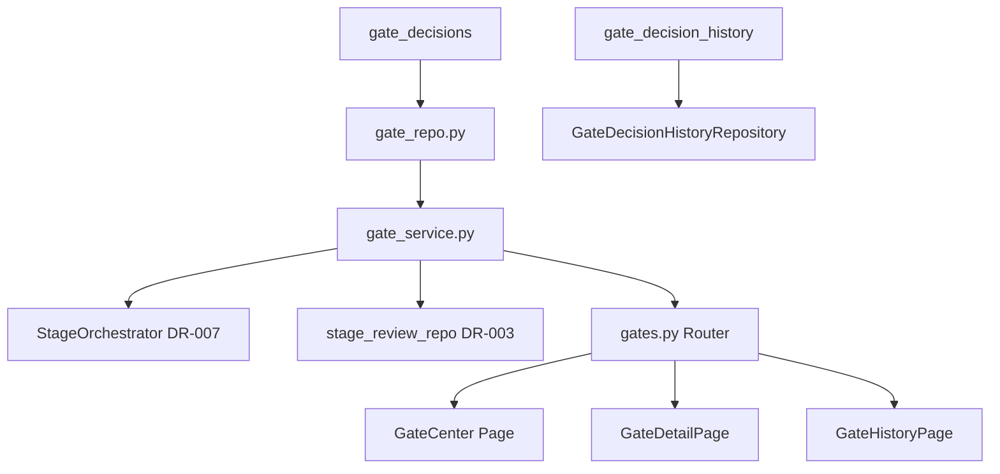

#### 验收标准

- [ ] Gate 审批通过后，下游 Stage 状态在 1 秒内更新为 `SCHEDULED`
- [ ] 驳回 Gate 时，`reason` 字段必填（5-500 字符），否则返回 400 `INVALID_PARAMETER`
- [ ] 决策历史记录按时间倒序排列，支持按项目/Gate 类型/结论/时间范围筛选
- [ ] 立项 Gate（`initiation`）在统计卡片中单独标记颜色
- [ ] 旁路入口仅 `X-User-Role: tech_lead` 时展示，否则隐藏

#### 风险与缓解

| 风险 | 影响 | 缓解 |
|------|------|------|
| 并发审批导致竞态条件 | 高 | Gate 决策使用数据库行级锁（`SELECT ... FOR UPDATE`），同一 Gate 仅允许一条决策记录 |
| 决策历史数据量增长 | 低 | `gate_decision_history` 按 `gate_id` 分区查询，索引 `idx_gdh_gate` 保证倒序查询性能 |

---

### Module 10: DR-005 产物浏览器

#### 实现顺序

1. **数据模型与 Repository**
   - 复用 `artifact_files`、`artifact_versions`（shared/db-schema.md）
   - 创建 `backend/app/infrastructure/database/repositories/artifact_repo.py`：`ArtifactRepository`、`ArtifactVersionRepository`

2. **Service 层**
   - 创建 `backend/app/services/artifact_service.py`：`ArtifactService`，实现产物文件索引 CRUD、版本管理、目录树构建（按文件路径层级聚合成树结构）、Diff 计算（基于 `content_hash`）
   - 实现版本快照：`create_snapshot(artifact_id)` 读取当前文件内容，计算 SHA-256 `content_hash`，生成 `artifact_versions` 记录，尝试 Git 快照（如项目在 Git 仓库内）
   - 实现版本回滚：`rollback(artifact_id, version_number)` 读取 `artifact_versions` 记录，恢复文件内容到指定版本

3. **API Router**
   - 创建 `backend/app/api/v1/artifacts.py`：`ArtifactRouter`，端点：`GET /api/v1/projects/{id}/artifacts/tree`、`GET /api/v1/projects/{id}/artifacts/{artifact_id}`、`GET /api/v1/projects/{id}/artifacts/{artifact_id}/content`、`GET /api/v1/projects/{id}/artifacts/{artifact_id}/versions`、`POST /api/v1/projects/{id}/artifacts/{artifact_id}/snapshot`、`POST /api/v1/projects/{id}/artifacts/{artifact_id}/rollback`

4. **前端页面**
   - 创建 `frontend/src/pages/ArtifactViewer/index.tsx`：产物浏览器主页面，左侧文件树 + 右侧内容预览区
   - 创建 `frontend/src/pages/ArtifactViewer/components/ArtifactTree.tsx`：文件树组件，支持展开/折叠、按文件名搜索、按类型过滤
   - 创建 `frontend/src/pages/ArtifactViewer/components/ArtifactPreview.tsx`：内容预览组件，支持 Markdown（React-Markdown）、YAML/JSON（语法高亮）、Mermaid（Mermaid 渲染）、纯文本
   - 创建 `frontend/src/pages/ArtifactViewer/components/VersionHistoryDrawer.tsx`：版本历史抽屉，展示版本列表、Diff 对比、回滚操作
   - 创建 `frontend/src/stores/artifactViewerStore.ts`：文件树状态、当前选中文件、预览内容、版本历史、stale 标记

#### 关键决策

- **文件树构建：** 后端按 `artifact_files.file_path` 字段聚合成树，前端接收嵌套 JSON 结构而非扁平列表，减少前端计算负担
- **版本保留策略：** 每产物最多保留 10 条版本记录，超出时最旧版本标记为归档（不物理删除），通过 `artifact_versions.operation_type = rollback` 保留回滚可达性
- **Stale 标记：** 上游基线变更后，`artifact_files.stale_flag` 标记为 `TRUE`，前端预览区展示黄色警告条

#### 依赖关系

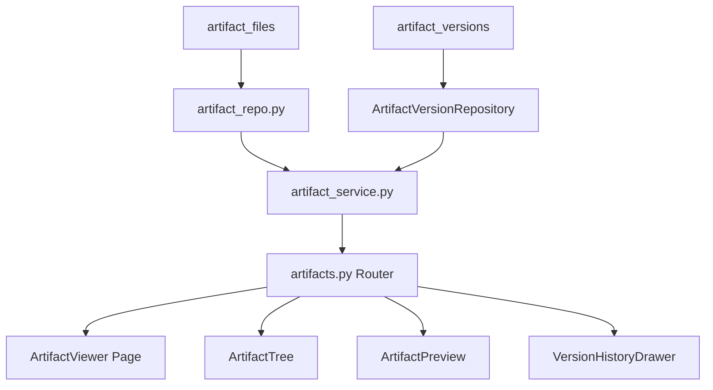

#### 验收标准

- [ ] `GET /api/v1/projects/{id}/artifacts/tree` 返回嵌套文件树 JSON，层级深度无限制
- [ ] Markdown 产物预览正确渲染 GitHub Flavored Markdown（表格、任务列表、代码块）
- [ ] Mermaid 产物预览正确渲染流程图与类图
- [ ] 版本回滚后文件内容恢复，数据库生成新的 `rollback` 类型版本记录
- [ ] `stale_flag = TRUE` 的产物在文件树中展示黄色警告图标

#### 风险与缓解

| 风险 | 影响 | 缓解 |
|------|------|------|
| 大文件（>1MB Markdown）预览卡顿 | 中 | 文件大小 > 1MB 时，预览区仅展示前 1000 行，提供"下载完整文件"按钮 |
| Git 快照失败（非 Git 仓库或无提交权限） | 低 | Git 快照为最佳努力（best-effort），失败时 `snapshot_status` 标记为 `skipped_no_repo` 或 `failed`，不影响版本记录生成 |

---

## Phase 5: P1 评估与架构

### Module 11: DR-010 复杂度路由面板

#### 实现顺序

1. **数据模型与 Repository**
   - 复用 `size_estimates`（shared/db-schema.md）
   - 创建 `backend/app/infrastructure/database/repositories/complexity_repo.py`：`ComplexityRepository`

2. **Service 层**
   - 创建 `backend/app/services/complexity_service.py`：`ComplexityService`，实现复杂度评估算法：基于 `module_count`、`interface_count`、`page_count`、`tech_complexity`、`risk_level` 五维度计算乐观/预期/保守三档得分，映射到 `complexity_level`（Trivial/Light/Standard/Deep）
   - 实现模板推荐：`recommend_template(complexity_level)` 返回对应 `template_id`

3. **API Router**
   - 创建 `backend/app/api/v1/complexity.py`：`ComplexityRouter`，端点：`POST /api/v1/projects/{id}/size-estimates`、`GET /api/v1/projects/{id}/size-estimates`、`GET /api/v1/complexity/templates/{level}`

4. **前端页面**
   - 创建 `frontend/src/pages/ProjectDashboard/components/ComplexityBadge.tsx`：复杂度标签组件，展示 Trivial/Light/Standard/Deep 四级颜色编码徽章
   - 创建 `frontend/src/pages/ProjectCreate/components/ComplexityForm.tsx`：复杂度评估表单，五维度输入滑块/选择器，实时计算三档得分
   - 创建 `frontend/src/components/ScoreRadarChart.tsx`：五维度雷达图组件（使用 ECharts 或 Chart.js）

#### 关键决策

- **评估算法：** 五维度加权求和，权重为 module_count×2 + interface_count×1.5 + page_count×1 + tech_complexity(High=3/Medium=2/Low=1)×3 + risk_level(High=3/Medium=2/Low=1)×2；得分区间映射：0-30=Trivial、31-60=Light、61-90=Standard、91+=Deep
- **评估时机：** 项目创建时引导用户完成复杂度评估，评估结果决定默认推荐模板；项目 Active 后可重新评估，但需记录偏离历史

#### 依赖关系

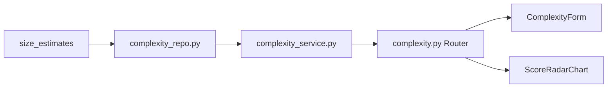

#### 验收标准

- [ ] 五维度输入后，三档得分计算响应时间 < 100ms
- [ ] 复杂度等级与模板推荐一致（Trivial→Trivial 模板）
- [ ] 雷达图正确渲染五维度数据，颜色随复杂度等级变化

#### 风险与缓解

| 风险 | 影响 | 缓解 |
|------|------|------|
| 评估算法权重不合理导致推荐偏差 | 低 | MVP 阶段权重为经验值，P1 基于历史项目数据校准；允许用户手动覆盖推荐 |

---

### Module 12: DR-011 C4 架构浏览器

#### 实现顺序

1. **数据模型与 Repository**
   - 复用 `c4_dsl_store`（shared/db-schema.md）
   - 创建 `backend/app/infrastructure/database/repositories/c4_repo.py`：`C4Repository`

2. **Service 层**
   - 创建 `backend/app/services/c4_service.py`：`C4Service`，实现 C4 DSL 存储与管理：L1（系统上下文）/ L2（容器）/ L3（组件）/ L4（代码）四级 DSL 文本的增删改查
   - 实现 AI 生成 DSL：`generate_dsl(project_id, level)` 读取项目产物（设计文档、接口契约），调用 AI API 生成 Mermaid C4 语法 DSL，存储到 `c4_dsl_store`，置信度由 AI 响应的确定性评分填充
   - 实现手动编辑 DSL：`update_dsl(store_id, dsl_text)` 校验 Mermaid 语法（使用 `mermaid.ink` API 或本地 Mermaid CLI 预渲染验证）

3. **API Router**
   - 创建 `backend/app/api/v1/c4.py`：`C4Router`，端点：`GET /api/v1/projects/{id}/c4`、`POST /api/v1/projects/{id}/c4`、`PUT /api/v1/projects/{id}/c4/{store_id}`、`POST /api/v1/projects/{id}/c4/{store_id}/generate`

4. **前端页面**
   - 创建 `frontend/src/pages/C4Navigator/index.tsx`：C4 架构导航页，四级切换标签页 + DSL 编辑器 + 实时预览
   - 创建 `frontend/src/pages/C4Navigator/components/C4LevelTabs.tsx`：四级标签页组件，L1/L2/L3/L4 切换
   - 创建 `frontend/src/pages/C4Navigator/components/DslEditor.tsx`：DSL 编辑器（使用 Monaco Editor 或 CodeMirror），支持 Mermaid 语法高亮
   - 创建 `frontend/src/pages/C4Navigator/components/C4Preview.tsx`：Mermaid 图表渲染组件，DSL 变更后 500ms 防抖重新渲染
   - 创建 `frontend/src/stores/c4NavigatorStore.ts`：当前层级、DSL 文本、生成模式（auto/manual）、置信度、渲染错误信息

#### 关键决策

- **DSL 校验：** MVP 阶段使用 Mermaid 10.9 客户端库渲染，渲染失败时捕获错误并展示在编辑器下方；P1 增加服务端 Mermaid CLI 预渲染校验
- **AI 生成置信度：** 置信度 < 0.7 的 DSL 标记为"需人工审核"，生成模式设为 `manual`，前端展示黄色警告
- **每层级记录数：** 每项目每层级最多两条记录（auto + manual），由数据库 `uq_c4ds_project_level_mode` 唯一约束保证

#### 依赖关系

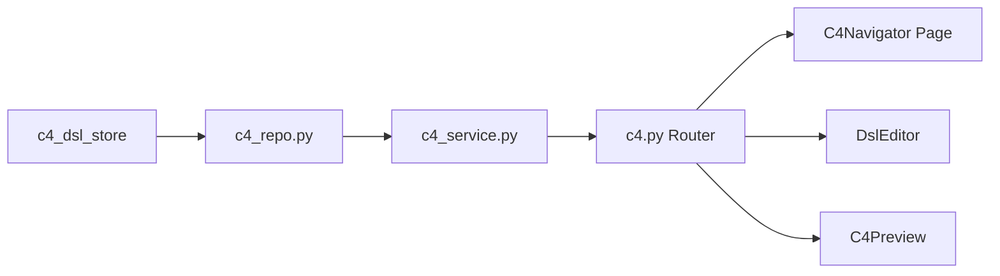

#### 验收标准

- [ ] C4 DSL 四级切换时，各层级 DSL 文本独立保留
- [ ] Mermaid 预览正确渲染 C4 语法（System Context / Container / Component / Code）
- [ ] AI 生成 DSL 后，置信度 < 0.7 时展示"需人工审核"警告
- [ ] DSL 语法错误时，预览区展示错误信息行号

#### 风险与缓解

| 风险 | 影响 | 缓解 |
|------|------|------|
| Mermaid C4 语法子集支持不完整（WARN-IFD-006） | 中 | 限定使用 Mermaid 10.9 已支持的 C4 语法子集，复杂图表拆分为多图 |
| AI 生成 DSL 质量不稳定 | 中 | 提供 Prompt 模板优化，支持用户手动编辑覆盖 AI 生成结果 |

---

## Phase 6: P2 增强功能

### Module 13: DR-014 监控看板

#### 实现顺序

1. **数据模型与 Repository**
   - 创建 `backend/app/models/operation_log.py`：`OperationLog` 模型（MVP 仅 DR-014 内部使用，P1 多用户后评估扩展），字段：`log_id`、`project_id`、`operation_type`、`operator`、`details`、`created_at`
   - 创建 `backend/app/models/project_member.py`：`ProjectMember` 模型（MVP 仅 DR-014 内部使用），字段：`member_id`、`project_id`、`user_id`、`role`、`joined_at`
   - 创建 `backend/app/infrastructure/database/repositories/monitoring_repo.py`：`MonitoringRepository`、`OperationLogRepository`

2. **Service 层**
   - 创建 `backend/app/services/monitoring_service.py`：`MonitoringService`，实现监控看板数据聚合：项目总数、活跃项目数、平均执行耗时、Stage 通过率、Gate 阻塞分布、Token 消耗趋势
   - 实现 Stage 统计：`get_stage_stats(project_id)` 按 Stage 类型聚合执行次数、平均耗时、失败率
   - 实现操作日志查询：`list_operation_logs(project_id, page, page_size)` 返回分页操作记录

3. **API Router**
   - 创建 `backend/app/api/v1/monitoring.py`：`MonitoringRouter`，端点：`GET /api/v1/monitoring/overview`、`GET /api/v1/projects/{id}/monitoring/stats`、`GET /api/v1/projects/{id}/monitoring/operation-logs`

4. **前端页面**
   - 创建 `frontend/src/pages/MonitoringDashboard/index.tsx`：监控看板主页面，含概览卡片、趋势图表、Stage 统计表格
   - 创建 `frontend/src/pages/MonitoringDashboard/components/OverviewCards.tsx`：四卡片：项目总数 / 活跃项目数 / 今日执行数 / Gate 待审数
   - 创建 `frontend/src/pages/MonitoringDashboard/components/TrendChart.tsx`：折线图展示近 7 天/30 天执行趋势与 Token 消耗趋势
   - 创建 `frontend/src/pages/MonitoringDashboard/components/StageStatsTable.tsx`：Stage 统计表格，含执行次数、平均耗时、失败率、通过率

#### 关键决策

- **数据聚合策略：** 监控数据基于 `skill_executions`、`gate_decisions`、`project_stages` 实时聚合查询，MVP 阶段不预计算；P1 引入定时任务预聚合到监控表
- **操作日志保留：** 操作日志保留 90 天，超期自动清理

#### 依赖关系

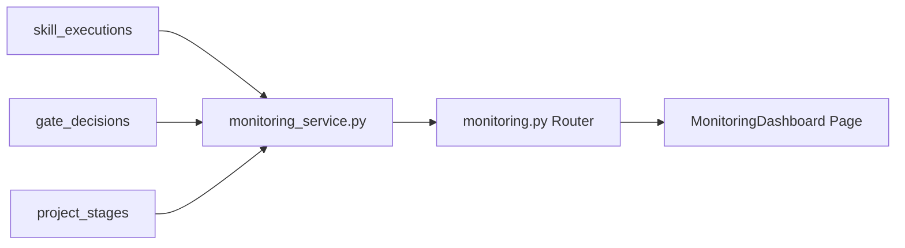

#### 验收标准

- [ ] 监控看板概览数据加载时间 < 1 秒（项目数 < 1000）
- [ ] Stage 统计表格支持按时间范围筛选（近 7 天/30 天/90 天）
- [ ] 趋势图表支持悬停查看每日详细数据

---

### Module 14: DR-013 历史回溯

#### 实现顺序

1. **数据模型与 Repository**
   - 创建 `backend/app/models/rework_event.py`：`ReworkEvent` 模型，字段：`event_id`、`project_id`、`stage_id`、`trigger_module`、`event_type`、`reason`、`created_at`；写方为 DR-003/004/008 事件触发，DR-013 作为管理方读取
   - 创建 `backend/app/infrastructure/database/repositories/history_repo.py`：`HistoryRepository`、`ReworkEventRepository`

2. **Service 层**
   - 创建 `backend/app/services/history_service.py`：`HistoryService`，实现历史摘要：`get_history_summary(app_id)` 按项目聚合完成时间、总 Stage 数、通过 Gate 数、重做次数
   - 实现时间线：`get_history_timeline(project_id)` 按时间顺序返回项目关键事件（创建、Stage 执行、Gate 决策、重做、归档）
   - 实现重做分析：`get_rework_analysis(project_id)` 统计重做事件分布、高频重做 Stage、重做原因词云

3. **API Router**
   - 创建 `backend/app/api/v1/history.py`：`HistoryRouter`，端点：`GET /api/v1/applications/{id}/history/summary`、`GET /api/v1/projects/{id}/history/timeline`、`GET /api/v1/projects/{id}/history/rework-analysis`

4. **前端页面**
   - 创建 `frontend/src/pages/HistoryViewer/index.tsx`：历史回溯主页面，含摘要面板、时间线、重做分析
   - 创建 `frontend/src/pages/HistoryViewer/components/Timeline.tsx`：垂直时间线组件，展示项目关键事件，支持展开查看详情
   - 创建 `frontend/src/pages/HistoryViewer/components/ReworkAnalysisPanel.tsx`：重做分析面板，含重做次数柱状图、原因词云

#### 关键决策

- **rework_events 写方：** 统一由 DR-003（Stage 审查状态变更）、DR-004（Gate 驳回）、DR-008（执行失败重试）事件触发写入；DR-013 仅读取，不直接写入
- **时间线数据源：** 聚合 `projects`、`project_stages`、`gate_decisions`、`skill_executions`、`rework_events` 五表数据，按时间排序

#### 依赖关系

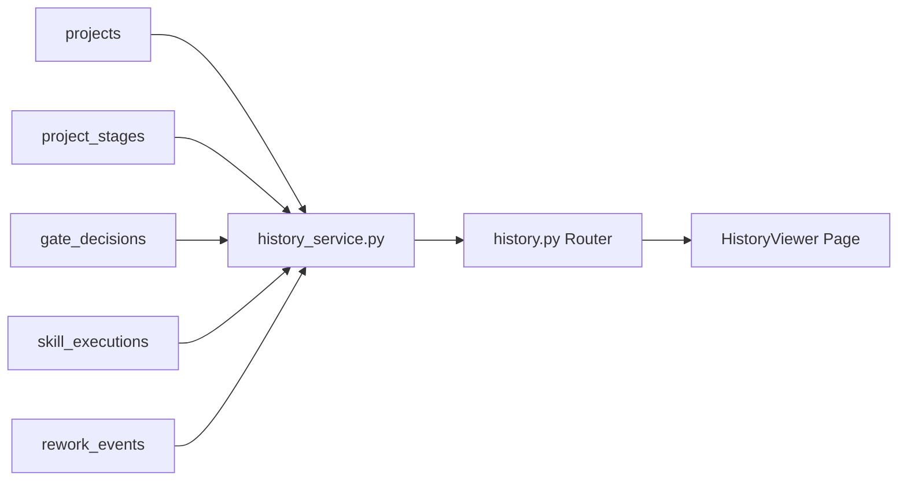

#### 验收标准

- [ ] 时间线正确展示项目从创建到归档的完整事件链
- [ ] 重做分析正确统计各 Stage 重做次数，支持按原因筛选
- [ ] 时间线支持点击事件跳转到对应项目/Stage/Gate 详情页

---

### Module 15: DR-012 架构验证中心

#### 实现顺序

1. **数据模型与 Repository**
   - 创建 `backend/app/models/arch_validation_session.py`：`ArchValidationSession` 模型（模块独占），字段：`session_id`、`project_id`、`baseline_c4_id`、`current_c4_id`、`diff_result`、`status`、`created_at`、`completed_at`
   - 创建 `backend/app/infrastructure/database/repositories/arch_validation_repo.py`：`ArchValidationRepository`

2. **Service 层**
   - 创建 `backend/app/services/arch_validation_service.py`：`ArchValidationService`，实现架构漂移检测：`trigger_detection(project_id)` 读取 `c4_dsl_store` 基线（`generation_mode = auto`）与当前 DSL，对比差异生成漂移报告
   - 实现差异分析：`analyze_diff(session_id)` 识别新增/删除/修改的容器、组件、关系，标记影响范围
   - 实现基线更新：`update_baseline(project_id)` 将当前 DSL 复制为新的 auto 基线

3. **API Router**
   - 创建 `backend/app/api/v1/arch-validation.py`：`ArchValidationRouter`，端点：`POST /api/v1/projects/{id}/arch-validation/trigger`、`GET /api/v1/projects/{id}/arch-validation/diffs`、`POST /api/v1/projects/{id}/arch-validation/baseline/update`

4. **前端页面**
   - 创建 `frontend/src/pages/ArchValidation/index.tsx`：架构验证主页面，含漂移检测触发、差异对比、基线管理
   - 创建 `frontend/src/pages/ArchValidation/components/DiffViewer.tsx`：差异对比组件，左右分栏展示基线与当前 DSL，差异行高亮
   - 创建 `frontend/src/pages/ArchValidation/components/ImpactReport.tsx`：影响报告组件，展示新增/删除/修改统计与影响模块列表

#### 关键决策

- **漂移检测算法：** MVP 阶段基于 DSL 文本行级 Diff（ Myers 算法），P1 升级为语义级 Diff（解析 Mermaid AST 后对比节点与边）
- **基线更新权限：** 仅 `tech_lead` 角色可更新基线，更新前必须确认当前无未处理的漂移

#### 依赖关系

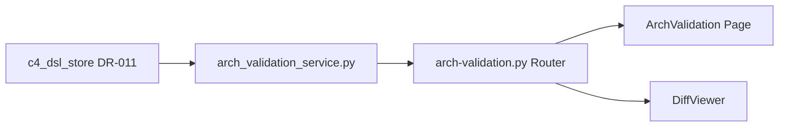

#### 验收标准

- [ ] 漂移检测触发后，差异结果在 5 秒内返回（DSL 文本 < 1000 行）
- [ ] 差异对比正确高亮新增（绿色）/ 删除（红色）/ 修改（黄色）行
- [ ] 基线更新后，后续漂移检测以新基线为准

---

### Module 16: DR-017 旁路审批

#### 实现顺序

1. **数据模型与 Repository**
   - 复用 `bypass_records`（DR-007 已定义）
   - 创建 `backend/app/infrastructure/database/repositories/bypass_repo.py`：`BypassRepository`

2. **Service 层**
   - 创建 `backend/app/services/bypass_service.py`：`BypassService`，实现旁路申请：`create_bypass_application(gate_id, reason)` 校验 Gate 阻塞时间 ≥ 24 小时、项目风险等级 ≥ Medium、申请人权限
   - 实现旁路审批：`approve_bypass(bypass_id)` 记录审批人、时间，解锁 Gate，写入审计日志
   - 实现旁路查询：`list_bypass_applications(project_id)` 返回旁路申请列表，含状态、申请理由、审批信息

3. **API Router**
   - 创建 `backend/app/api/v1/bypass.py`：`BypassRouter`，端点：`POST /api/v1/gates/{id}/bypass`、`GET /api/v1/projects/{id}/bypass-applications`、`POST /api/v1/bypass-applications/{id}/approve`

4. **前端页面**
   - 复用 DR-004 `DecisionPanel` 中的 `BypassTrigger` 组件
   - 创建 `frontend/src/pages/GateCenter/components/BypassApplicationModal.tsx`：旁路申请弹窗，展示阻塞时长、风险等级、必填理由输入框
   - 创建 `frontend/src/pages/GateCenter/components/BypassHistoryDrawer.tsx`：旁路历史抽屉，展示所有旁路申请记录

#### 关键决策

- **旁路触发条件：** Gate 阻塞 ≥ 24 小时 + 项目风险等级 ≥ Medium + 申请人角色 = `tech_lead`；任一条件不满足时，旁路入口不可点击并展示 Tooltip 说明原因
- **旁路不可撤销：** 旁路审批通过后不可撤销，永久记录于 `bypass_records` 与 `gate_decision_history`

#### 依赖关系

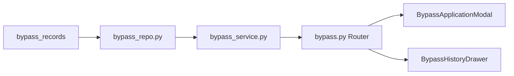

#### 验收标准

- [ ] 不满足触发条件时，旁路入口禁用并展示原因 Tooltip
- [ ] 旁路申请理由必填（5-500 字符），否则返回 400
- [ ] 旁路审批通过后，Gate 状态立即更新为 `bypassed`，下游 Stage 解锁

---

### Module 17: DR-018 OpenUI 原型服务

#### 实现顺序

1. **Service 层**
   - 创建 `backend/app/services/openui_service.py`：`OpenUIService`，实现原型生成：`generate_prototype(project_id, requirement_text)` 调用 AI API 生成 OpenUI 描述（HTML/CSS/JS 代码片段），存储到产物目录
   - 实现原型预览：`get_prototype_preview(prototype_id)` 读取生成的 HTML 文件，返回完整页面内容

2. **API Router**
   - 创建 `backend/app/api/v1/openui.py`：`OpenUIRouter`，端点：`POST /api/v1/projects/{id}/openui/generate`、`GET /api/v1/projects/{id}/openui/preview`

3. **前端页面**
   - 创建 `frontend/src/pages/PrototypeViewer/index.tsx`：原型查看器主页面，含 OpenUI 预览 iframe + 需求输入区
   - 创建 `frontend/src/pages/PrototypeViewer/components/OpenUIPreview.tsx`：OpenUI 预览组件，iframe 渲染生成的 HTML，支持设备尺寸切换（桌面/平板/手机）

#### 关键决策

- **OpenUI Docker 配置（WARN-IFD-007）：** MVP 阶段不启用 Docker 隔离，AI 生成的 HTML 直接在前端 iframe 中渲染（sandbox 属性限制脚本执行）；P1 引入 Docker 容器化预览环境
- **生成产物存储：** OpenUI 生成的 HTML/CSS/JS 文件作为产物存入 `openspec/changes/{change}/prototypes/`，同时生成 `artifact_files` 记录

#### 依赖关系

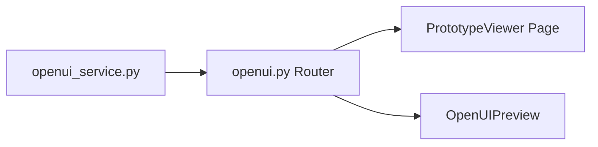

---

### Module 18: DR-019 Wireframe 线框图引擎

#### 实现顺序

1. **Service 层**
   - 创建 `backend/app/services/wireframe_service.py`：`WireframeService`，实现线框图生成：`generate_wireframe(project_id, page_spec)` 调用 AI API 生成 Wireframe DSL（基于 Mermaid 或自定义 JSON 格式），转换为 SVG 或 HTML 渲染
   - 实现线框图导出：`export_wireframe(wireframe_id, format)` 支持导出 PNG/SVG/PDF

2. **API Router**
   - 创建 `backend/app/api/v1/wireframe.py`：`WireframeRouter`，端点：`POST /api/v1/projects/{id}/wireframes`、`GET /api/v1/projects/{id}/wireframes/{wireframe_id}`、`GET /api/v1/projects/{id}/wireframes/{wireframe_id}/export`

3. **前端页面**
   - 创建 `frontend/src/pages/PrototypeViewer/components/WireframeCanvas.tsx`：线框图画布组件，基于 React Flow 或 SVG 渲染线框图元素（矩形、文本、按钮占位符）

#### 关键决策

- **线框图格式：** MVP 阶段使用自定义 JSON 格式描述线框图元素（位置、尺寸、类型、文本），前端渲染为 SVG；P1 支持导入 Figma/Sketch 格式
- **与 OpenUI 关系：** Wireframe 为低保真线框，OpenUI 为高保真原型，两者独立生成，通过 DR-020 双向绑定关联

---

### Module 19: DR-020 原型-架构双向绑定

#### 实现顺序

1. **Service 层**
   - 创建 `backend/app/services/binding_service.py`：`BindingService`，实现绑定管理：`create_binding(project_id, wireframe_element_id, c4_component_id)` 建立 Wireframe 元素与 C4 组件的映射关系
   - 实现同步更新：当 C4 组件变更时，自动更新关联 Wireframe 元素的标签或状态；当 Wireframe 元素删除时，解除绑定关系
   - 实现绑定查询：`list_bindings(project_id)` 返回所有绑定关系列表

2. **API Router**
   - 创建 `backend/app/api/v1/bindings.py`：`BindingRouter`，端点：`POST /api/v1/projects/{id}/bindings`、`GET /api/v1/projects/{id}/bindings`、`DELETE /api/v1/projects/{id}/bindings/{binding_id}`

3. **前端页面**
   - 创建 `frontend/src/pages/PrototypeViewer/components/BindingPanel.tsx`：绑定管理面板，展示 Wireframe 元素与 C4 组件的映射列表，支持增删改

#### 关键决策

- **绑定粒度：** 绑定到 C4 L3（组件级）和 Wireframe 页面级元素（按钮、表单、列表），不绑定到 L4 代码级
- **变更传播方向：** C4 → Wireframe 单向自动同步（架构变更驱动原型更新），Wireframe → C4 需人工确认（避免原型调整误改架构）

---

### Module 20: DR-021 需求草图服务

#### 实现顺序

1. **Service 层**
   - 创建 `backend/app/services/sketch_service.py`：`SketchService`，实现草图识别：`upload_sketch(project_id, image_file)` 接收用户手绘草图图片，调用 AI 视觉 API 识别 UI 元素（按钮、输入框、列表），生成结构化 PageSpec JSON
   - 实现草图管理：`list_sketches(project_id)`、`delete_sketch(sketch_id)`

2. **API Router**
   - 创建 `backend/app/api/v1/sketches.py`：`SketchRouter`，端点：`POST /api/v1/projects/{id}/sketches/upload`、`GET /api/v1/projects/{id}/sketches`、`DELETE /api/v1/projects/{id}/sketches/{sketch_id}`

3. **前端页面**
   - 创建 `frontend/src/pages/PrototypeViewer/components/SketchUploader.tsx`：草图上传组件，支持拖拽上传、图片预览、识别结果展示
   - 创建 `frontend/src/pages/PrototypeViewer/components/SketchGallery.tsx`：草图画廊组件，缩略图网格，点击查看识别结果

#### 关键决策

- **草图识别引擎：** MVP 阶段使用 AI 多模态 API（如 GPT-4V）进行草图识别，P1 可引入专用 UI 草图识别模型
- **识别结果校验：** AI 识别结果需用户确认后才转为正式 PageSpec，未确认的草图仅作为参考

---

## Phase 7: DR-002 SDLC 画布公共组件（编码阶段补充）

#### 实现顺序

1. **后端接口补充**
   - 在 `backend/app/api/v1/` 中补充 Canvas 相关端点：`GET /api/v1/projects/{id}/canvas/state`、`POST /api/v1/projects/{id}/canvas/state`（画布状态持久化：节点位置、缩放级别、视口中心）
   - 创建 `backend/app/models/canvas_state.py`：`CanvasState` 模型，字段：`state_id`、`project_id`、`node_positions`（JSON）、`viewport`（JSON）、`updated_at`

2. **前端公共组件**
   - 创建 `frontend/src/components/SDLCCanvas/index.tsx`：SDLC 画布公共组件，基于 React Flow，封装项目级 Stage 节点渲染、执行状态高亮、Gate 节点特殊样式
   - 创建 `frontend/src/components/SDLCCanvas/components/StageNode.tsx`：Stage 节点组件，展示 Stage 名称、状态图标、进度条、操作按钮
   - 创建 `frontend/src/components/SDLCCanvas/components/GateNode.tsx`：Gate 节点组件，展示 Gate 类型、状态、决策结果
   - 创建 `frontend/src/components/SDLCCanvas/components/MiniMap.tsx`：画布迷你地图组件，支持快速导航
   - 创建 `frontend/src/stores/canvasStore.ts`：画布状态（节点位置、视口、选中节点）、React Flow 实例引用

#### 关键决策

- **画布状态持久化：** 画布节点位置、缩放级别、视口中心存储在 `canvas_state` 表，按项目隔离；用户调整画布后 3 秒防抖自动保存
- **Stage 节点与执行计划节点复用：** SDLC 画布中的 Stage 节点与 ExecutionPlan 画布中的计划节点使用不同的 React Flow nodeTypes，但共享底层画布状态管理逻辑

#### 验收标准

- [ ] 画布正确渲染项目所有 Stage 节点与 Gate 节点，连线表示 Stage 顺序关系
- [ ] Stage 节点颜色随状态变化：DEFINED=灰/SCHEDULED=蓝/EXECUTED=绿/FAILED=红/SKIPPED=虚线边框
- [ ] 画布缩放、平移、节点拖拽流畅（60fps）
- [ ] 画布状态（位置、缩放、视口）刷新后恢复

---

## 任务依赖总图

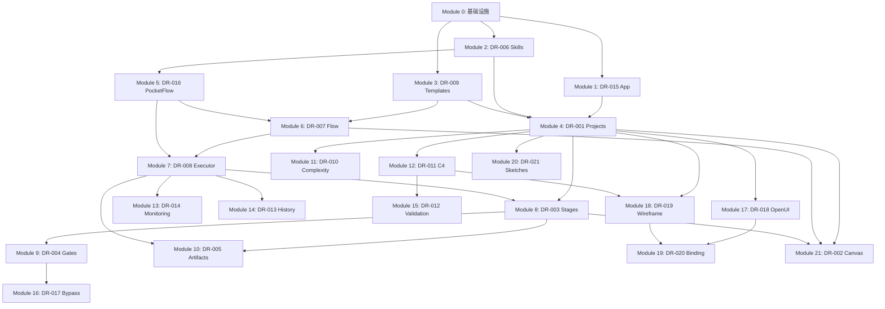

---

## Plan → Task 转换建议

- **预估任务数:** 180~220 个（建议 `sub_orchestrators` 模式，按前后端轨道分派子 Agent）
- **建议 Phase 数:** 7 个（对应本 plan 的 Phase 1~7）
- **关键路径:** Module 0 → Module 1/2/3 → Module 4 → Module 6/7 → Module 8/9/10（不可并行）
- **可并行轨道:**
  - **后端轨道:** Module 0 → Module 1/2/3/5 → Module 6/7 → Module 8/9/10 → Module 11/12 → Module 13~20
  - **前端轨道:** Module 0（公共 Schema + API 封装）→ Module 1/2/3/4 页面 → Module 8/9/10 页面 → Module 11~21 页面
  - **前后端联调:** 联调 1（T+3d）、联调 2（T+7d）、联调 3（T+12d）、联调 4（T+18d）
- **特别注意:**
  1. **DR-002 画布组件**需在编码阶段补充 module-design.md 和接口，建议放在 Phase 3 之后、联调 2 之前完成
  2. **SSE 事件格式**（WARN-IFD-005）需在 Module 7 编码前细化，建议作为 Spike 任务（≤30 分钟）先验证 SSE 与 FastAPI 的集成方案
  3. **Mock 数据占位**（parallel-dev-plan.md 风险项 3）需在 task-breakdown 前补充真实示例，建议由前端轨道在 Phase 1 完成
  4. **SQLite → PostgreSQL 迁移**不纳入 MVP 任务，作为 P1 独立变更规划
  5. **AI API 调用**在 Module 5/12/17/18/20/21 中均涉及，建议提取公共 `AIService` 在 Phase 1 预先实现
