# Tasks for sdlc-visualizer

> 生成时间: 2026-06-02T09:30:00+08:00
> 执行模式建议: sub_orchestrators
> 总任务数: 180 | Phase 数: 7 | 预估总时长: 90 小时

---

## Phase 1: 基础设施与公共组件

- [x] 1.1 [配置] 创建后端 Pydantic-Settings 配置类
  - 完成时间: 2026-06-02T10:00:00+08:00
  - 验收: `python -c "from app.core.config import settings; print(settings.DATABASE_URL)"` 成功输出 SQLite 路径
  - 依赖: None
  - 文件: `backend/app/core/config.py`, `backend/.env.example`
  - 标签: [配置] [后端]
  - **verified_by**: self-check-passed

- [x] 1.2 [后端] 实现全局异常类层次
  - 完成时间: 2026-06-02T10:00:00+08:00
  - 验收: `pytest backend/tests/unit/core/test_exceptions.py -v` 全部通过，每个异常类可正确序列化为 Problem JSON
  - 依赖: 1.1
  - 文件: `backend/app/core/exceptions.py`, `backend/tests/unit/core/test_exceptions.py`
  - 标签: [后端]
  - **verified_by**: self-check-passed

- [x] 1.3 [后端] 实现分页 DTO 与参数校验
  - 完成时间: 2026-06-02T10:00:00+08:00
  - 验收: `pytest backend/tests/unit/core/test_pagination.py -v` 通过，验证 page<1 修正为 1、page_size>200 修正为 200
  - 依赖: 1.1
  - 文件: `backend/app/core/pagination.py`, `backend/tests/unit/core/test_pagination.py`
  - 标签: [后端]
  - **verified_by**: self-check-passed

- [x] 1.4 [配置] 配置结构化 JSON 日志
  - 完成时间: 2026-06-02T10:00:00+08:00
  - 验收: 启动后端后，请求日志输出 JSON 格式，含 `request_id`、`method`、`path`、`status_code` 字段
  - 依赖: 1.1
  - 文件: `backend/app/core/logging.py`
  - 标签: [配置] [后端]
  - **verified_by**: self-check-passed

- [x] 1.5 [后端] 创建 SQLAlchemy Base 与 AsyncSession 工厂
  - 完成时间: 2026-06-02T10:00:00+08:00
  - 验收: `pytest backend/tests/unit/db/test_session.py -v` 通过，可成功创建 AsyncSession 并执行 `SELECT 1`
  - 依赖: 1.1
  - 文件: `backend/app/infrastructure/database/base.py`, `backend/app/infrastructure/database/session.py`, `backend/tests/unit/db/test_session.py`
  - 标签: [后端] [配置]
  - **verified_by**: self-check-passed

- [x] 1.6 [配置] 初始化 Alembic 迁移环境
  - 完成时间: 2026-06-02T10:05:00+08:00
  - 验收: `cd backend && alembic revision --autogenerate -m "init"` 成功生成迁移脚本，无报错
  - 依赖: 1.5
  - 文件: `backend/alembic.ini`, `backend/migrations/env.py`, `backend/migrations/script.py.mako`
  - 标签: [配置]
  - **verified_by**: self-check-passed

- [x] 1.7 [后端] 实现 FastAPI 全局异常处理器与 CORS
  - 完成时间: 2026-06-02T10:08:00+08:00
  - 验收: `curl -s http://localhost:8000/api/v1/health | jq '.status'` 输出 `"healthy"`；跨域预检请求返回 200
  - 依赖: 1.2, 1.5
  - 文件: `backend/main.py`, `backend/tests/unit/test_main.py`
  - 标签: [后端] [配置]
  - **verified_by**: self-check-passed

- [x] 1.8 [后端] 创建 API v1 总路由注册器
  - 完成时间: 2026-06-02T10:08:00+08:00
  - 验收: `pytest backend/tests/unit/api/test_router.py -v` 通过，`/api/v1` 前缀正确挂载
  - 依赖: 1.7
  - 文件: `backend/app/api/v1/router.py`
  - 标签: [后端]
  - **verified_by**: self-check-passed

- [x] 1.9 [后端] 创建公共 Schema（PageResponse、Problem、FileUploadResultDTO）
  - 完成时间: 2026-06-02T10:05:00+08:00
  - 验收: `mypy backend/app/schemas/common.py` strict 模式通过；Pydantic 模型可正确序列化/反序列化
  - 依赖: 1.3
  - 文件: `backend/app/schemas/common.py`, `backend/tests/unit/schemas/test_common.py`
  - 标签: [后端]
  - **verified_by**: self-check-passed

- [x] 1.10 [前端] 配置 Axios 实例与拦截器
  - 完成时间: 2026-06-02T10:05:00+08:00
  - 验收: 前端 `npm run typecheck` 通过；Axios 拦截器正确注入 `X-Request-ID` Header
  - 依赖: None
  - 文件: `frontend/src/services/api.ts`, `frontend/src/services/api.test.ts`
  - 标签: [前端]
  - **verified_by**: self-check-passed

- [x] 1.11 [前端] 封装 health 服务与后端可用性检测
  - 完成时间: 2026-06-02T10:08:00+08:00
  - 验收: 前端启动时控制台输出后端健康状态；后端不可用时展示全局错误提示
  - 依赖: 1.10
  - 文件: `frontend/src/services/health.ts`, `frontend/src/stores/appStore.ts`
  - 标签: [前端]
  - **verified_by**: self-check-passed

- [x] 1.12 [前端] 实现全局加载态与错误提示 Store
  - 完成时间: 2026-06-02T10:10:00+08:00
  - 验收: 任意 API 请求发起时全局加载指示器显示；请求失败时 Toast 提示展示错误码与消息
  - 依赖: 1.11
  - 文件: `frontend/src/stores/appStore.ts`, `frontend/src/components/GlobalToast.tsx`
  - 标签: [前端]
  - **verified_by**: self-check-passed

- [x] 1.13 [测试] 后端基础设施集成测试
  - 完成时间: 2026-06-02T10:10:00+08:00
  - 验收: `pytest backend/tests/integration/test_health.py backend/tests/integration/test_upload.py -v` 全部通过
  - 依赖: 1.7, 1.9
  - 文件: `backend/tests/integration/test_health.py`, `backend/tests/integration/test_upload.py`
  - 标签: [测试] [后端]
  - **verified_by**: self-check-passed

- [x] 1.14 [配置] 配置 ruff + mypy + pytest 工具链
  - 完成时间: 2026-06-02T10:00:00+08:00
  - 验收: `cd backend && ruff check .` 零报错；`mypy .` strict 模式通过；`pytest` 默认配置生效
  - 依赖: None
  - 文件: `backend/pyproject.toml`
  - 标签: [配置]
  - **verified_by**: self-check-passed

- [x] 1.15 [前端] 配置 ESLint + TypeScript strict 模式
  - 完成时间: 2026-06-02T10:00:00+08:00
  - 验收: `cd frontend && npm run lint` 零报错；`npm run typecheck` 零报错
  - 依赖: None
  - 文件: `frontend/eslint.config.js`, `frontend/tsconfig.app.json`
  - 标签: [配置] [前端]
  - **verified_by**: self-check-passed
## Phase 2: P0 核心数据层

### Module 1: DR-015 Application 与模块治理

- [x] 2.1 [后端] 创建 Application ORM 模型与唯一约束
  - 完成时间: 2026-06-02T10:52:00+08:00
  - 验收: `pytest backend/tests/unit/models/test_application.py -v` 通过，`uq_app_name_per_ws` 唯一约束生效
  - 依赖: 1.5
  - 文件: `backend/app/models/application.py`, `backend/tests/unit/models/test_application.py`
  - 标签: [后端]
  - **verified_by**: self-check-passed

- [x] 2.2 [后端] 实现 ApplicationRepository CRUD
  - 完成时间: 2026-06-02T10:55:00+08:00
  - 验收: `pytest backend/tests/unit/repositories/test_application_repo.py -v` 通过，覆盖 create/list/get/update/delete
  - 依赖: 2.1
  - 文件: `backend/app/infrastructure/database/repositories/application_repo.py`, `backend/tests/unit/repositories/test_application_repo.py`
  - 标签: [后端]
  - **verified_by**: self-check-passed

- [x] 2.3 [后端] 实现 ApplicationService（含路径校验）
  - 完成时间: 2026-06-02T10:58:00+08:00
  - 验收: `pytest backend/tests/unit/services/test_application_service.py -v` 通过，路径不存在时 `path_accessible=FALSE`
  - 依赖: 2.2
  - 文件: `backend/app/services/application_service.py`, `backend/tests/unit/services/test_application_service.py`
  - 标签: [后端]
  - **verified_by**: self-check-passed

- [x] 2.4 [后端] 实现 ApplicationRouter（5 个端点）
  - 完成时间: 2026-06-02T11:04:00+08:00
  - 验收: `pytest backend/tests/unit/api/test_applications.py -v` 通过，POST 201/GET 200/PUT 200/DELETE 204/重名 409
  - 依赖: 2.3, 1.8
  - 文件: `backend/app/api/v1/applications.py`, `backend/tests/unit/api/test_applications.py`
  - 接口: `POST/GET/PUT/DELETE /api/v1/applications`（参见 @interface-contracts/openapi.yaml）
  - 标签: [后端]
  - **verified_by**: self-check-passed

- [x] 2.5 [前端] 实现 Application 列表页骨架
  - 完成时间: 2026-06-02T11:04:00+08:00
  - 验收: 访问 `/applications` 路由渲染列表页，展示空状态提示
  - 依赖: 1.12
  - 文件: `frontend/src/pages/AppDashboard/index.tsx`, `frontend/src/App.tsx`
  - 标签: [前端]
  - **verified_by**: self-check-passed

- [x] 2.6 [前端] 实现 ApplicationCard 组件
  - 完成时间: 2026-06-02T11:04:00+08:00
  - 验收: Storybook（或独立测试页）渲染 AppCard，展示名称、路径、可访问性状态
  - 依赖: 2.5
  - 文件: `frontend/src/pages/AppDashboard/components/AppCard.tsx`
  - 标签: [前端]
  - **verified_by**: self-check-passed

- [x] 2.7 [前端] 实现 AppDashboardStore 与 API 对接
  - 完成时间: 2026-06-02T11:08:00+08:00
  - 验收: 页面加载时自动调用 `GET /api/v1/applications`，列表数据正确渲染；支持按名称搜索
  - 依赖: 2.5, 2.4
  - 文件: `frontend/src/stores/appDashboardStore.ts`, `frontend/src/pages/AppDashboard/index.tsx`
  - 标签: [前端]
  - **verified_by**: self-check-passed

- [x] 2.8 [前端] 实现新建 Application 弹窗（含路径选择）
  - 完成时间: 2026-06-02T11:08:00+08:00
  - 验收: 点击"新建"打开弹窗，输入名称和路径后 POST 成功，列表自动刷新；重名时展示错误提示
  - 依赖: 2.7
  - 文件: `frontend/src/pages/AppDashboard/components/AppCreateModal.tsx`
  - 标签: [前端]
  - **verified_by**: self-check-passed

- [x] 2.9 [前端] 实现删除 Application 确认流程
  - 完成时间: 2026-06-02T11:08:00+08:00
  - 验收: 点击删除弹出确认对话框，确认后 DELETE 成功，列表移除该卡片；取消后无操作
  - 依赖: 2.7
  - 文件: `frontend/src/pages/AppDashboard/components/AppDeleteConfirm.tsx`
  - 标签: [前端]
  - **verified_by**: self-check-passed

- [x] 2.10 [后端] 创建 Module 模型与 Service（P1）
  - 完成时间: 2026-06-02T10:55:00+08:00
  - 验收: `pytest backend/tests/unit/models/test_module.py -v` 通过，Module 模型字段完整
  - 依赖: 2.1
  - 文件: `backend/app/models/module.py`, `backend/app/services/module_service.py`
  - 标签: [后端]
  - **verified_by**: self-check-passed
### Module 2: DR-006 Skill 注册与 DAG 管理

- [x] 2.11 [后端] 创建 Skill ORM 模型
  - 完成时间: 2026-06-02T10:52:00+08:00
  - 验收: `pytest backend/tests/unit/models/test_skill.py -v` 通过，`(skill_name, version)` 唯一约束生效
  - 依赖: 1.5
  - 文件: `backend/app/models/skill.py`, `backend/tests/unit/models/test_skill.py`
  - 标签: [后端]
  - **verified_by**: self-check-passed

- [x] 2.12 [后端] 创建 SkillDAGNode / SkillDAGEdge ORM 模型
  - 完成时间: 2026-06-02T10:52:00+08:00
  - 验收: `pytest backend/tests/unit/models/test_skill_dag.py -v` 通过，外键约束正确
  - 依赖: 1.5
  - 文件: `backend/app/models/skill_dag.py`, `backend/tests/unit/models/test_skill_dag.py`
  - 标签: [后端]
  - **verified_by**: self-check-passed

- [x] 2.13 [后端] 实现 SkillParser（Frontmatter + meta.json 解析）
  - 完成时间: 2026-06-02T10:55:00+08:00
  - 验收: `pytest backend/tests/unit/services/test_skill_parser.py -v` 通过，可正确解析现有 `.agents/skills/` 目录下 ≥ 90% 的 Skill 文件
  - 依赖: 2.11
  - 文件: `backend/app/services/skill_parser.py`, `backend/tests/unit/services/test_skill_parser.py`
  - 标签: [后端]
  - **verified_by**: self-check-passed

- [x] 2.14 [后端] 实现 SkillImportService（扫描 + 冲突处理）
  - 完成时间: 2026-06-02T10:58:00+08:00
  - 验收: `pytest backend/tests/unit/services/test_skill_import_service.py -v` 通过，同名同版本冲突时标记待确认
  - 依赖: 2.13
  - 文件: `backend/app/services/skill_import_service.py`, `backend/tests/unit/services/test_skill_import_service.py`
  - 标签: [后端]
  - **verified_by**: self-check-passed

- [x] 2.15 [后端] 实现 DAGBuilderService（自动构建 + 环检测）
  - 完成时间: 2026-06-02T10:58:00+08:00
  - 验收: `pytest backend/tests/unit/services/test_dag_builder.py -v` 通过，50 节点 DAG 环检测 < 200ms
  - 依赖: 2.12, 2.14
  - 文件: `backend/app/services/dag_builder_service.py`, `backend/tests/unit/services/test_dag_builder.py`
  - 标签: [后端]
  - **verified_by**: self-check-passed

- [x] 2.16 [后端] 实现 DAGEditorService（画布操作 + 撤销重做）
  - 完成时间: 2026-06-02T10:58:00+08:00
  - 验收: `pytest backend/tests/unit/services/test_dag_editor.py -v` 通过，撤销栈深度 50 步
  - 依赖: 2.15
  - 文件: `backend/app/services/dag_editor_service.py`, `backend/app/models/skill_changelog.py`, `backend/tests/unit/services/test_dag_editor.py`
  - 标签: [后端]
  - **verified_by**: self-check-passed

- [x] 2.17 [后端] 实现 SkillRegistryRouter（9 个端点）
  - 完成时间: 2026-06-02T11:04:00+08:00
  - 验收: `pytest backend/tests/unit/api/test_skills.py -v` 通过，覆盖 import/list/get/delete/dag 操作
  - 依赖: 2.14, 2.16, 1.8
  - 文件: `backend/app/api/v1/skills.py`, `backend/tests/unit/api/test_skills.py`
  - 接口: `POST /api/v1/skills/import`, `GET /api/v1/skills`, `GET /api/v1/skills/dag` 等（参见 @interface-contracts/openapi.yaml）
  - 标签: [后端]
  - **verified_by**: self-check-passed

- [x] 2.18 [前端] 实现 SkillRegistry 列表页
  - 完成时间: 2026-06-02T11:08:00+08:00
  - 验收: 访问 `/skills` 渲染 Skill 表格/卡片视图，支持 pattern/tags/platforms 筛选
  - 依赖: 1.12
  - 文件: `frontend/src/pages/SkillRegistry/index.tsx`, `frontend/src/stores/skillRegistryStore.ts`
  - 标签: [前端]
  - **verified_by**: self-check-passed

- [x] 2.19 [前端] 实现 SkillImportModal（扫描结果 + 冲突展示）
  - 完成时间: 2026-06-02T11:08:00+08:00
  - 验收: 点击导入打开弹窗，展示扫描结果列表，冲突项高亮并支持选择保留版本
  - 依赖: 2.18, 2.17
  - 文件: `frontend/src/pages/SkillRegistry/components/SkillImportModal.tsx`
  - 标签: [前端]
  - **verified_by**: self-check-passed

- [x] 2.20 [前端] 实现 SkillDAGCanvas（React Flow 渲染 + 拖拽）
  - 完成时间: 2026-06-02T11:08:00+08:00
  - 验收: 画布渲染 DAG 节点与边，节点可拖拽，拖拽后坐标保存，刷新后恢复
  - 依赖: 2.18
  - 文件: `frontend/src/pages/SkillRegistry/components/SkillDAGCanvas.tsx`
  - 标签: [前端]
  - **verified_by**: self-check-passed

- [x] 2.21 [前端] 实现 DAG 撤销/重做与右键菜单
  - 完成时间: 2026-06-02T11:08:00+08:00
  - 验收: 画布操作后 Ctrl+Z 撤销、Ctrl+Y 重做；右键节点展示删除/编辑菜单
  - 依赖: 2.20
  - 文件: `frontend/src/pages/SkillRegistry/components/DAGContextMenu.tsx`, `frontend/src/stores/skillRegistryStore.ts`
  - 标签: [前端]
  - **verified_by**: self-check-passed
### Module 3: DR-009 模板引擎

- [x] 2.22 [后端] 创建 Template / TemplateStage / ProjectStage ORM 模型
  - 完成时间: 2026-06-02T11:30:00+08:00
  - 验收: `pytest backend/tests/unit/models/test_template.py -v` 通过，`template_id` ENUM PK 约束生效
  - 依赖: 1.5
  - 文件: `backend/app/models/template.py`, `backend/app/models/template_stage.py`, `backend/app/models/project_stage.py`
  - 标签: [后端]
  - **verified_by**: self-check-passed

- [x] 2.23 [后端] 编写模板预置数据 Seed 脚本
  - 完成时间: 2026-06-02T11:30:00+08:00
  - 验收: `python backend/scripts/seed_templates.py` 成功插入 4 条 Template + 对应 TemplateStage 记录
  - 依赖: 2.22
  - 文件: `backend/scripts/seed_templates.py`
  - 标签: [配置] [后端]
  - **verified_by**: self-check-passed

- [x] 2.24 [后端] 实现 TemplateRepository 与 StageConfigService
  - 完成时间: 2026-06-02T11:30:00+08:00
  - 验收: `pytest backend/tests/unit/repositories/test_template_repo.py -v` 通过，可查询四级模板与 Stage 序列
  - 依赖: 2.22
  - 文件: `backend/app/infrastructure/database/repositories/template_repo.py`, `backend/app/services/stage_config_service.py`
  - 标签: [后端]
  - **verified_by**: self-check-passed

- [x] 2.25 [后端] 实现 ImpactScopeCalculator（模板切换影响计算）
  - 完成时间: 2026-06-02T11:30:00+08:00
  - 验收: `pytest backend/tests/unit/services/test_impact_calculator.py -v` 通过，验证已执行 Stage 冻结、未执行 Stage 移除逻辑
  - 依赖: 2.24
  - 文件: `backend/app/services/impact_scope_calculator.py`, `backend/tests/unit/services/test_impact_calculator.py`
  - 标签: [后端]
  - **verified_by**: self-check-passed

- [x] 2.26 [后端] 实现 TemplateRouter（6 个端点）
  - 完成时间: 2026-06-02T11:30:00+08:00
  - 验收: `pytest backend/tests/unit/api/test_templates.py -v` 通过，覆盖模板查询/Stage 查询/偏离确认
  - 依赖: 2.25, 1.8
  - 文件: `backend/app/api/v1/templates.py`, `backend/tests/unit/api/test_templates.py`
  - 接口: `GET /api/v1/templates`, `GET /api/v1/projects/{id}/stages` 等（参见 @interface-contracts/openapi.yaml）
  - 标签: [后端]
  - **verified_by**: self-check-passed

- [x] 2.27 [前端] 实现 TemplateSelector 组件（四级模板卡片）
  - 完成时间: 2026-06-02T20:07:00+08:00
  - 验收: Storybook 渲染四级模板卡片，展示复杂度推荐标签
  - 依赖: 1.12
  - 文件: `frontend/src/pages/ProjectCreate/components/TemplateSelector.tsx`
  - 标签: [前端]
  - **verified_by**: self-check-passed

- [x] 2.28 [前端] 实现 StageTimeline 组件
  - 完成时间: 2026-06-02T20:09:00+08:00
  - 验收: 渲染 Stage 时间线，正确展示 Gate 位置、可跳过标记、合并组视觉分组
  - 依赖: 2.27
  - 文件: `frontend/src/components/StageTimeline/index.tsx`
  - 标签: [前端]
  - **verified_by**: self-check-passed

- [x] 2.29 [前端] 实现 TemplateDeviationModal（影响范围展示）
  - 完成时间: 2026-06-02T20:09:00+08:00
  - 验收: 弹窗展示已冻结/将被移除/新增 Stage 数量统计，确认后触发切换 API
  - 依赖: 2.28, 2.26
  - 文件: `frontend/src/components/TemplateDeviationModal.tsx`
  - 标签: [前端]
  - **verified_by**: self-check-passed
### Module 4: DR-001 项目工作台

- [x] 2.30 [后端] 创建 Project / SizeEstimate ORM 模型
  - 完成时间: 2026-06-02T12:30:00+08:00
  - 验收: `pytest backend/tests/unit/models/test_project.py -v` 通过，CHECK 约束生效
  - 依赖: 1.5
  - 文件: `backend/app/models/project.py`, `backend/app/models/size_estimate.py`
  - 标签: [后端]
  - **verified_by**: self-check-passed

- [x] 2.31 [后端] 实现 ProjectRepository（含状态流转）
  - 完成时间: 2026-06-02T12:33:00+08:00
  - 验收: `pytest backend/tests/unit/repositories/test_project_repo.py -v` 通过，覆盖 archive/activate/cancel
  - 依赖: 2.30
  - 文件: `backend/app/infrastructure/database/repositories/project_repo.py`, `backend/tests/unit/repositories/test_project_repo.py`
  - 标签: [后端]
  - **verified_by**: self-check-passed

- [x] 2.32 [后端] 实现 ProjectService（CRUD + 双轨状态机）
  - 完成时间: 2026-06-02T12:35:00+08:00
  - 验收: `pytest backend/tests/unit/services/test_project_service.py -v` 通过，零执行直接 Cancelled/有执行先 Archived 再 Cancelled
  - 依赖: 2.31
  - 文件: `backend/app/services/project_service.py`, `backend/tests/unit/services/test_project_service.py`
  - 标签: [后端]
  - **verified_by**: self-check-passed

- [x] 2.33 [后端] 实现 RiskScannerService
  - 完成时间: 2026-06-02T12:35:00+08:00
  - 验收: `pytest backend/tests/unit/services/test_risk_scanner.py -v` 通过，可检测 Timebox 超时/Stage 阻塞/产物 Stale
  - 依赖: 2.32
  - 文件: `backend/app/services/risk_scanner_service.py`, `backend/tests/unit/services/test_risk_scanner.py`
  - 标签: [后端]
  - **verified_by**: self-check-passed

- [x] 2.34 [后端] 实现 TimeboxService
  - 完成时间: 2026-06-02T12:35:00+08:00
  - 验收: `pytest backend/tests/unit/services/test_timebox.py -v` 通过，Timebox 偏差计算正确
  - 依赖: 2.32
  - 文件: `backend/app/services/timebox_service.py`, `backend/tests/unit/services/test_timebox.py`
  - 标签: [后端]
  - **verified_by**: self-check-passed

- [x] 2.35 [后端] 实现 ProjectRouter（9 个端点）
  - 完成时间: 2026-06-02T12:37:00+08:00
  - 验收: `pytest backend/tests/unit/api/test_projects.py -v` 通过，重名 409/有执行 Cancel 422
  - 依赖: 2.33, 2.34, 1.8
  - 文件: `backend/app/api/v1/projects.py`, `backend/tests/unit/api/test_projects.py`
  - 接口: `POST/GET/PUT /api/v1/projects`, `POST /api/v1/projects/{id}/archive|activate|cancel` 等（参见 @interface-contracts/openapi.yaml）
  - 标签: [后端]
  - **verified_by**: self-check-passed

- [x] 2.36 [前端] 实现 ProjectDashboard 主页面骨架
  - 完成时间: 2026-06-02T20:40:00+08:00
  - 验收: 访问 `/projects` 渲染项目工作台，展示空状态
  - 依赖: 1.12
  - 文件: `frontend/src/pages/ProjectDashboard/index.tsx`, `frontend/src/stores/projectDashboardStore.ts`
  - 标签: [前端]
  - **verified_by**: self-check-passed

- [x] 2.37 [前端] 实现 ProjectCard 组件（含风险颜色编码）
  - 完成时间: 2026-06-02T20:40:00+08:00
  - 验收: Storybook 渲染 ProjectCard，风险等级 None=灰/Low=绿/Medium=黄/High=红
  - 依赖: 2.36
  - 文件: `frontend/src/pages/ProjectDashboard/components/ProjectCard.tsx`
  - 标签: [前端]
  - **verified_by**: self-check-passed

- [x] 2.38 [前端] 实现 RiskAlertPanel 组件
  - 完成时间: 2026-06-02T20:40:00+08:00
  - 验收: 风险预警面板按严重级别分组，点击风险项可跳转对应项目
  - 依赖: 2.36
  - 文件: `frontend/src/pages/ProjectDashboard/components/RiskAlertPanel.tsx`
  - 标签: [前端]
  - **verified_by**: self-check-passed

- [x] 2.39 [前端] 实现 ProjectCreateModal（四步创建流程）
  - 完成时间: 2026-06-02T20:40:00+08:00
  - 验收: 弹窗四步流程（选 Application → 输入信息 → 选模板 → 确认），创建成功后跳转项目详情
  - 依赖: 2.36, 2.35, 2.26
  - 文件: `frontend/src/pages/ProjectDashboard/components/ProjectCreateModal.tsx`
  - 标签: [前端]
  - **verified_by**: self-check-passed

- [x] 2.40 [前端] 实现 ProjectDashboard 筛选排序分页
  - 完成时间: 2026-06-02T20:40:00+08:00
  - 验收: 支持按 Application/状态/风险等级筛选，按创建时间排序，分页加载
  - 依赖: 2.36, 2.35
  - 文件: `frontend/src/pages/ProjectDashboard/index.tsx`, `frontend/src/stores/projectDashboardStore.ts`
  - 标签: [前端]
  - **verified_by**: self-check-passed
## Phase 3: P1 执行引擎

### Module 5: DR-016 PocketFlow 执行引擎

- [x] 3.1 [后端] 实现 PocketFlowEngine 三阶段管线骨架
  - 完成时间: 2026-06-02T20:52:00+08:00
  - 验收: `pytest backend/tests/unit/services/pocketflow/test_engine.py -v` 通过，`prep`→`exec`→`post` 顺序调用正确
  - 依赖: 2.14
  - 文件: `backend/app/services/pocketflow/engine.py`, `backend/tests/unit/services/pocketflow/test_engine.py`
  - 标签: [后端]
  - **verified_by**: self-check-passed

- [x] 3.2 [后端] 实现 PrepStage（上下文组装）
  - 完成时间: 2026-06-02T20:52:00+08:00
  - 验收: `pytest backend/tests/unit/services/pocketflow/test_engine.py -v` 通过，PrepStage 正确读取 SKILL.md
  - 依赖: 3.1
  - 文件: `backend/app/services/pocketflow/prep_stage.py`
  - 标签: [后端]
  - **verified_by**: self-check-passed

- [x] 3.3 [后端] 实现 ExecStage（AI 调用层）
  - 完成时间: 2026-06-02T20:52:00+08:00
  - 验收: `pytest backend/tests/unit/services/pocketflow/test_engine.py -v` 通过，HTTPX 异步请求 60 秒超时
  - 依赖: 3.2
  - 文件: `backend/app/services/pocketflow/exec_stage.py`
  - 标签: [后端] [AI模型]
  - **verified_by**: self-check-passed

- [x] 3.4 [后端] 实现 PostStage（产物收集 + 状态更新）
  - 完成时间: 2026-06-02T20:52:00+08:00
  - 验收: `pytest backend/tests/unit/services/pocketflow/test_engine.py -v` 通过，产物校验逻辑正确
  - 依赖: 3.3
  - 文件: `backend/app/services/pocketflow/post_stage.py`
  - 标签: [后端]
  - **verified_by**: self-check-passed

- [x] 3.5 [后端] 实现 SkillExecutionStateMachine
  - 完成时间: 2026-06-02T20:52:00+08:00
  - 验收: `pytest backend/tests/unit/services/pocketflow/test_state_machine.py -v` 通过，非法流转抛出 ValidationError
  - 依赖: 3.1
  - 文件: `backend/app/services/pocketflow/state_machine.py`, `backend/tests/unit/services/pocketflow/test_state_machine.py`
  - 标签: [后端]
  - **verified_by**: self-check-passed

- [x] 3.6 [后端] 实现 LogCollector（三阶段日志收集）
  - 完成时间: 2026-06-02T20:52:00+08:00
  - 验收: `pytest backend/tests/unit/services/pocketflow/test_log_collector.py -v` 通过，支持增量追加与级别过滤
  - 依赖: 3.1
  - 文件: `backend/app/services/pocketflow/log_collector.py`, `backend/tests/unit/services/pocketflow/test_log_collector.py`
  - 标签: [后端]
  - **verified_by**: self-check-passed

- [x] 3.7 [后端] 实现项目级异步写锁
  - 完成时间: 2026-06-02T20:52:00+08:00
  - 验收: `pytest backend/tests/unit/services/pocketflow/test_lock.py -v` 通过，并发写同一项目产物无冲突
  - 依赖: 3.4
  - 文件: `backend/app/services/pocketflow/lock_manager.py`, `backend/tests/unit/services/pocketflow/test_lock.py`
  - 标签: [后端]
  - **verified_by**: self-check-passed
### Module 6: DR-007 Skill Flow 编排引擎

- [x] 3.8 [后端] 创建 ExecutionPlan / PlanNode / ParallelGroup ORM 模型
  - 完成时间: 2026-06-03T09:54:24+08:00
  - 验收: `pytest backend/tests/unit/models/test_execution_plan.py -v` 通过，外键与 JSON 字段正确
  - 依赖: 1.5
  - 文件: `backend/app/models/execution_plan.py`, `backend/app/models/plan_node.py`, `backend/app/models/parallel_group.py`
  - 标签: [后端]
  - **verified_by**: self-check-passed

- [x] 3.9 [后端] 实现 ExecutionPlanGenerator（DAG + 模板 → 计划）
  - 完成时间: 2026-06-03T09:54:24+08:00
  - 验收: `pytest backend/tests/unit/services/test_plan_generator.py -v` 通过，主 Skill 串行、辅助 Skill 并行
  - 依赖: 3.8, 2.16, 2.24
  - 文件: `backend/app/services/execution_plan_generator.py`, `backend/tests/unit/services/test_plan_generator.py`
  - 标签: [后端]
  - **verified_by**: self-check-passed

- [x] 3.10 [后端] 实现 StageOrchestrator（就绪检查 + 分组调度）
  - 完成时间: 2026-06-03T09:54:24+08:00
  - 验收: `pytest backend/tests/unit/services/test_stage_orchestrator.py -v` 通过，Gate 未通过时 Stage 不调度
  - 依赖: 3.9
  - 文件: `backend/app/services/stage_orchestrator.py`, `backend/tests/unit/services/test_stage_orchestrator.py`
  - 标签: [后端]
  - **verified_by**: self-check-passed

- [x] 3.11 [后端] 实现 ModuleScheduler（跨 Module 并行）
  - 完成时间: 2026-06-03T09:54:24+08:00
  - 验收: `pytest backend/tests/unit/services/test_module_scheduler.py -v` 通过，跨 Module 节点并发执行
  - 依赖: 3.10
  - 文件: `backend/app/services/module_scheduler.py`, `backend/tests/unit/services/test_module_scheduler.py`
  - 标签: [后端]
  - **verified_by**: self-check-passed

- [x] 3.12 [后端] 实现 BypassApprovalService（旁路授权校验）
  - 完成时间: 2026-06-03T09:54:24+08:00
  - 验收: `pytest backend/tests/unit/services/test_bypass_service.py -v` 通过，理由长度校验 5-500 字符
  - 依赖: 3.10
  - 文件: `backend/app/services/bypass_approval_service.py`, `backend/tests/unit/services/test_bypass_service.py`
  - 标签: [后端]
  - **verified_by**: self-check-passed

- [x] 3.13 [后端] 实现 ExecutionPlanRouter（8 个端点）
  - 完成时间: 2026-06-03T09:54:24+08:00
  - 验收: `pytest backend/tests/unit/api/test_execution_plans.py -v` 通过
  - 依赖: 3.11, 3.12, 1.8
  - 文件: `backend/app/api/v1/execution_plans.py`, `backend/tests/unit/api/test_execution_plans.py`
  - 接口: `POST /api/v1/execution-plans`, `GET /api/v1/executions/{id}/status` 等（参见 @interface-contracts/openapi.yaml）
  - 标签: [后端]
  - **verified_by**: self-check-passed

- [x] 3.14 [前端] 实现 ExecutionPlan 画布页骨架
  - 完成时间: 2026-06-03T09:54:24+08:00
  - 验收: 访问 `/execution-plans` 渲染 React Flow 画布，展示计划节点
  - 依赖: 1.12
  - 文件: `frontend/src/pages/ExecutionPlan/index.tsx`, `frontend/src/stores/executionPlanStore.ts`
  - 标签: [前端]
  - **verified_by**: self-check-passed

- [x] 3.15 [前端] 实现 PlanNodeCard 组件（状态颜色编码）
  - 完成时间: 2026-06-03T09:54:24+08:00
  - 验收: Storybook 渲染节点卡片，NOT_STARTED=灰/PREPARING=蓝/EXECUTING=黄/COMPLETED=绿/FAILED=红
  - 依赖: 3.14
  - 文件: `frontend/src/pages/ExecutionPlan/components/PlanNodeCard.tsx`
  - 标签: [前端]
  - **verified_by**: self-check-passed
### Module 7: DR-008 Skill 调度服务

- [x] 3.16 [后端] 创建 SkillExecution / ExecutionLog ORM 模型
  - 完成时间: 2026-06-03T09:54:24+08:00
  - 验收: `pytest backend/tests/unit/models/test_skill_execution.py -v` 通过
  - 依赖: 1.5
  - 文件: `backend/app/models/skill_execution.py`, `backend/app/models/execution_log.py`
  - 标签: [后端]
  - **verified_by**: self-check-passed

- [x] 3.17 [后端] 实现 TriggerValidator（权限 + 发布拦截 + 重复触发防护）
  - 完成时间: 2026-06-03T09:54:24+08:00
  - 验收: `pytest backend/tests/unit/services/test_trigger_validator.py -v` 通过，发布类 Skill 暂停 PREPARING/重复触发 409
  - 依赖: 3.16, 2.11
  - 文件: `backend/app/services/trigger_validator.py`, `backend/tests/unit/services/test_trigger_validator.py`
  - 标签: [后端]
  - **verified_by**: self-check-passed

- [x] 3.18 [后端] 实现 StatusAggregator（状态聚合 + SSE 推送）
  - 完成时间: 2026-06-03T09:54:24+08:00
  - 验收: `pytest backend/tests/unit/services/test_status_aggregator.py -v` 通过，状态变更 500ms 内推送至 SSE Queue
  - 依赖: 3.17, 3.5
  - 文件: `backend/app/services/status_aggregator.py`, `backend/tests/unit/services/test_status_aggregator.py`
  - 标签: [后端]
  - **verified_by**: self-check-passed

- [x] 3.19 [后端] 实现 LogCollectorService（调度层日志聚合）
  - 完成时间: 2026-06-03T09:54:24+08:00
  - 验收: `pytest backend/tests/unit/services/test_log_collector_service.py -v` 通过，关键词搜索 < 300ms
  - 依赖: 3.16
  - 文件: `backend/app/services/log_collector_service.py`, `backend/tests/unit/services/test_log_collector_service.py`
  - 标签: [后端]
  - **verified_by**: self-check-passed

- [x] 3.20 [后端] 实现 RetryManager（指数退避 + 上限管控）
  - 完成时间: 2026-06-03T09:54:24+08:00
  - 验收: `pytest backend/tests/unit/services/test_retry_manager.py -v` 通过，退避间隔 0s/5s/15s
  - 依赖: 3.17
  - 文件: `backend/app/services/retry_manager.py`, `backend/tests/unit/services/test_retry_manager.py`
  - 标签: [后端]
  - **verified_by**: self-check-passed

- [x] 3.21 [后端] 实现 SSE 端点（subscribeExecutionSSE）
  - 完成时间: 2026-06-03T09:54:24+08:00
  - 验收: `curl -N http://localhost:8000/api/v1/executions/sse` 持续接收事件流，格式为 `data: {...}\n\n`
  - 依赖: 3.18
  - 文件: `backend/app/api/v1/skill_executions.py`（SSE 部分）
  - 接口: `GET /api/v1/executions/sse`（参见 @interface-contracts/openapi.yaml）
  - 标签: [后端]
  - **verified_by**: self-check-passed

- [x] 3.22 [后端] 实现 SkillExecutionRouter（6 个端点）
  - 完成时间: 2026-06-03T09:54:24+08:00
  - 验收: `pytest backend/tests/unit/api/test_skill_executions.py -v` 通过
  - 依赖: 3.19, 3.20, 3.21, 1.8
  - 文件: `backend/app/api/v1/skill_executions.py`, `backend/tests/unit/api/test_skill_executions.py`
  - 标签: [后端]
  - **verified_by**: self-check-passed

- [x] 3.23 [前端] 实现 ExecutionMonitor 页面骨架
  - 完成时间: 2026-06-03T09:54:24+08:00
  - 验收: 访问 `/executions` 展示执行列表与状态
  - 依赖: 1.12
  - 文件: `frontend/src/pages/ExecutionMonitor/index.tsx`, `frontend/src/stores/executionMonitorStore.ts`
  - 标签: [前端]
  - **verified_by**: self-check-passed

- [x] 3.24 [前端] 实现 ExecutionLogStream 组件（实时流 + 过滤）
  - 完成时间: 2026-06-03T09:54:24+08:00
  - 验收: SSE 连接后日志实时追加，支持 DEBUG/INFO/WARNING/ERROR 级别过滤、暂停自动滚动
  - 依赖: 3.23, 3.21
  - 文件: `frontend/src/pages/ExecutionMonitor/components/ExecutionLogStream.tsx`
  - 标签: [前端]
  - **verified_by**: self-check-passed

- [x] 3.25 [前端] 实现 RetryButton 组件（次数展示 + 倒计时）
  - 完成时间: 2026-06-03T09:54:24+08:00
  - 验收: 展示当前重试次数/最大次数，下次重试倒计时实时递减
  - 依赖: 3.23
  - 文件: `frontend/src/pages/ExecutionMonitor/components/RetryButton.tsx`
  - 标签: [前端]
  - **verified_by**: self-check-passed
## Phase 4: P1 阶段与审批

### Module 8: DR-003 阶段详情面板

- [x] 4.1 [后端] 创建 Annotation ORM 模型
  - 验收: `pytest backend/tests/unit/models/test_annotation.py -v` 通过
  - 依赖: 1.5
  - 文件: `backend/app/models/annotation.py`
  - 标签: [后端]
  - **verified_by**: self-check-passed

- [x] 4.2 [后端] 实现 StageDetailService（Stage 详情聚合）
  - 验收: `pytest backend/tests/unit/services/test_stage_detail.py -v` 通过，聚合 project_stages + review_status + 产物 + Gate + 批注
  - 依赖: 4.1, 2.30, 2.22
  - 文件: `backend/app/services/stage_detail_service.py`, `backend/tests/unit/services/test_stage_detail.py`
  - 标签: [后端]
  - **verified_by**: self-check-passed

- [x] 4.3 [后端] 实现 AnnotationService（批注 CRUD + 红点逻辑）
  - 验收: `pytest backend/tests/unit/services/test_annotation.py -v` 通过，REVIEW_PENDING 未浏览时红点=true
  - 依赖: 4.1
  - 文件: `backend/app/services/annotation_service.py`, `backend/tests/unit/services/test_annotation.py`
  - 标签: [后端]
  - **verified_by**: self-check-passed

- [x] 4.4 [后端] 实现 StageRouter（5 个端点）
  - 验收: `pytest backend/tests/unit/api/test_stages.py -v` 通过
  - 依赖: 4.2, 4.3, 1.8
  - 文件: `backend/app/api/v1/stages.py`, `backend/tests/unit/api/test_stages.py`
  - 接口: `GET /api/v1/projects/{id}/stages/{stage_id}`, `GET/POST/PUT/DELETE /api/v1/projects/{id}/stages/{stage_id}/annotations`
  - 标签: [后端]
  - **verified_by**: self-check-passed

- [x] 4.5 [前端] 实现 StageDetailPanel 抽屉骨架
  - 验收: 点击 Stage 节点后右侧滑出抽屉，宽度 480px~900px，Esc/遮罩点击关闭
  - 依赖: 1.12
  - 文件: `frontend/src/components/StageDetailPanel/index.tsx`, `frontend/src/stores/stageDetailStore.ts`
  - 标签: [前端]
  - **verified_by**: self-check-passed

- [x] 4.6 [前端] 实现抽屉拖拽调整宽度 + localStorage 持久化
  - 验收: 拖拽左边缘调整宽度，释放后存入 localStorage，刷新页面恢复
  - 依赖: 4.5
  - 文件: `frontend/src/components/StageDetailPanel/components/ResizeHandle.tsx`
  - 标签: [前端]
  - **verified_by**: self-check-passed

- [x] 4.7 [前端] 实现 6 个 Tab 组件（SkillSnapshot / PocketFlow / Artifact / Logs / Annotation / GateLink）
  - 验收: 6 个 Tab 懒加载，默认激活 SkillSnapshot，切换时各 Tab 滚动位置独立保留
  - 依赖: 4.5, 4.4
  - 文件: `frontend/src/components/StageDetailPanel/components/SkillSnapshotTab.tsx`, `frontend/src/components/StageDetailPanel/components/PocketFlowStatusTab.tsx`, `frontend/src/components/StageDetailPanel/components/ArtifactCardsTab.tsx`, `frontend/src/components/StageDetailPanel/components/ExecutionLogsTab.tsx`, `frontend/src/components/StageDetailPanel/components/AnnotationTab.tsx`, `frontend/src/components/StageDetailPanel/components/GateLinkTab.tsx`
  - 标签: [前端]
  - **verified_by**: self-check-passed

- [x] 4.8 [前端] 实现审查红点 BadgeManager
  - 验收: REVIEW_PENDING 且未浏览过时 Tab 展示红点，打开 AnnotationTab 后红点消失
  - 依赖: 4.7
  - 文件: `frontend/src/components/StageDetailPanel/components/BadgeManager.tsx`
  - 标签: [前端]
  - **verified_by**: self-check-passed
### Module 9: DR-004 审批中心

- [x] 4.9 [后端] 实现 GateRepository 与 GateService
  - 验收: `pytest backend/tests/unit/services/test_gate_service.py -v` 通过，决策后下游 Stage 解锁
  - 依赖: 2.22
  - 文件: `backend/app/infrastructure/database/repositories/gate_repo.py`, `backend/app/services/gate_service.py`
  - 标签: [后端]
  - **verified_by**: self-check-passed

- [x] 4.10 [后端] 实现 Gate 审批决策（通过/驳回/重试）
  - 验收: `pytest backend/tests/unit/services/test_gate_decision.py -v` 通过，驳回时 reason 必填 5-500 字符
  - 依赖: 4.9, 3.10
  - 文件: `backend/app/services/gate_service.py`（决策部分）, `backend/tests/unit/services/test_gate_decision.py`
  - 标签: [后端]
  - **verified_by**: self-check-passed

- [x] 4.11 [后端] 实现 GateRouter（6 个端点）
  - 验收: `pytest backend/tests/unit/api/test_gates.py -v` 通过
  - 依赖: 4.10, 1.8
  - 文件: `backend/app/api/v1/gates.py`, `backend/tests/unit/api/test_gates.py`
  - 接口: `GET /api/v1/projects/{id}/gates`, `POST /api/v1/gates/{id}/approve|reject|retry`
  - 标签: [后端]
  - **verified_by**: self-check-passed

- [x] 4.12 [前端] 实现 GateCenter 列表页骨架
  - 验收: 访问 `/gates` 渲染 Gate 列表，展示统计卡片
  - 依赖: 1.12
  - 文件: `frontend/src/pages/GateCenter/index.tsx`, `frontend/src/stores/gateCenterStore.ts`
  - 标签: [前端]
  - **verified_by**: self-check-passed

- [x] 4.13 [前端] 实现 StatCards / GateCardList 组件
  - 验收: 三卡片（待审/已通过/已驳回）数据正确，立项 Gate 单独标记颜色
  - 依赖: 4.12
  - 文件: `frontend/src/pages/GateCenter/components/StatCards.tsx`, `frontend/src/pages/GateCenter/components/GateCardList.tsx`
  - 标签: [前端]
  - **verified_by**: self-check-passed

- [x] 4.14 [前端] 实现 GateDetailPage（自检摘要 + 决策面板）
  - 验收: 展示 SelfCheckPanel（置信度/产物完整性/质量门禁/风险点）+ DecisionPanel（通过/驳回/重试按钮）
  - 依赖: 4.12, 4.11
  - 文件: `frontend/src/pages/GateCenter/components/GateDetailPage.tsx`, `frontend/src/pages/GateCenter/components/SelfCheckPanel.tsx`, `frontend/src/pages/GateCenter/components/DecisionPanel.tsx`
  - 标签: [前端]
  - **verified_by**: self-check-passed

- [x] 4.15 [前端] 实现 GateHistoryPage（筛选 + 导出）
  - 验收: 历史记录按时间倒序，支持按项目/Gate 类型/结论/时间范围筛选，支持 CSV 导出
  - 依赖: 4.12
  - 文件: `frontend/src/pages/GateCenter/components/GateHistoryPage.tsx`, `frontend/src/pages/GateCenter/components/HistoryTable.tsx`
  - 标签: [前端]
  - **verified_by**: self-check-passed

- [x] 4.16 [前端] 实现旁路入口权限控制
  - 验收: `X-User-Role != tech_lead` 时 BypassTrigger 隐藏，tech_lead 时展示并可点击
  - 依赖: 4.14
  - 文件: `frontend/src/pages/GateCenter/components/BypassTrigger.tsx`
  - 标签: [前端]
  - **verified_by**: self-check-passed
### Module 10: DR-005 产物浏览器

- [x] 4.17 [后端] 实现 ArtifactRepository 与 ArtifactVersionRepository
  - 验收: `pytest backend/tests/unit/repositories/test_artifact_repo.py -v` 通过，版本最多保留 10 条
  - 依赖: 1.5
  - 文件: `backend/app/infrastructure/database/repositories/artifact_repo.py`, `backend/tests/unit/repositories/test_artifact_repo.py`
  - 标签: [后端]
  - **verified_by**: self-check-passed

- [x] 4.18 [后端] 实现 ArtifactService（目录树 + 快照 + 回滚）
  - 验收: `pytest backend/tests/unit/services/test_artifact_service.py -v` 通过，树构建正确、回滚生成新版本记录
  - 依赖: 4.17
  - 文件: `backend/app/services/artifact_service.py`, `backend/tests/unit/services/test_artifact_service.py`
  - 标签: [后端]
  - **verified_by**: self-check-passed

- [x] 4.19 [后端] 实现 ArtifactRouter（6 个端点）
  - 验收: `pytest backend/tests/unit/api/test_artifacts.py -v` 通过
  - 依赖: 4.18, 1.8
  - 文件: `backend/app/api/v1/artifacts.py`, `backend/tests/unit/api/test_artifacts.py`
  - 接口: `GET /api/v1/projects/{id}/artifacts/tree`, `POST /api/v1/projects/{id}/artifacts/{id}/snapshot|rollback`
  - 标签: [后端]
  - **verified_by**: self-check-passed

- [x] 4.20 [前端] 实现 ArtifactViewer 主页面（左侧树 + 右侧预览）
  - 验收: 访问 `/artifacts` 渲染双栏布局，左侧文件树、右侧内容预览区
  - 依赖: 1.12
  - 文件: `frontend/src/pages/ArtifactViewer/index.tsx`, `frontend/src/stores/artifactViewerStore.ts`
  - 标签: [前端]
  - **verified_by**: self-check-passed

- [x] 4.21 [前端] 实现 ArtifactTree 组件（展开/折叠/搜索/过滤）
  - 验收: 文件树支持展开折叠、按文件名搜索、按类型过滤（md/yaml/json/mermaid）
  - 依赖: 4.20
  - 文件: `frontend/src/pages/ArtifactViewer/components/ArtifactTree.tsx`
  - 标签: [前端]
  - **verified_by**: self-check-passed

- [x] 4.22 [前端] 实现 ArtifactPreview 组件（多格式渲染）
  - 验收: Markdown 正确渲染 GFM（表格/任务列表/代码块），YAML/JSON 语法高亮，Mermaid 渲染流程图
  - 依赖: 4.20
  - 文件: `frontend/src/pages/ArtifactViewer/components/ArtifactPreview.tsx`
  - 标签: [前端]
  - **verified_by**: self-check-passed

- [x] 4.23 [前端] 实现 VersionHistoryDrawer（版本列表 + 回滚）
  - 验收: 抽屉展示版本列表，选择两版本可对比 Diff，点击回滚触发 API 并刷新预览
  - 依赖: 4.20, 4.19
  - 文件: `frontend/src/pages/ArtifactViewer/components/VersionHistoryDrawer.tsx`
  - 标签: [前端]
  - **verified_by**: self-check-passed
## Phase 5: P1 评估与架构

### Module 11: DR-010 复杂度路由面板

- [x] 5.1 [后端] 实现 ComplexityService（五维度评估算法）
  - 完成时间: 2026-06-03T12:50:00+08:00
  - 验收: `pytest backend/tests/unit/services/test_complexity.py -v` 通过，输入五维度输出三档得分与 complexity_level
  - 依赖: 2.30
  - 文件: `backend/app/services/complexity_service.py`, `backend/tests/unit/services/test_complexity.py`
  - 标签: [后端]
  - **verified_by**: self-check-passed

- [x] 5.2 [后端] 实现 ComplexityRouter（3 个端点）
  - 完成时间: 2026-06-03T12:50:00+08:00
  - 验收: `pytest backend/tests/unit/api/test_complexity.py -v` 通过
  - 依赖: 5.1, 1.8
  - 文件: `backend/app/api/v1/complexity.py`, `backend/tests/unit/api/test_complexity.py`
  - 接口: `POST/GET /api/v1/projects/{id}/size-estimates`, `GET /api/v1/complexity/templates/{level}`
  - 标签: [后端]
  - **verified_by**: self-check-passed

- [x] 5.3 [前端] 实现 ComplexityForm（五维度输入 + 实时计算）
  - 完成时间: 2026-06-03T12:55:00+08:00
  - 验收: 表单输入后三档得分实时更新，响应 < 100ms
  - 依赖: 1.12
  - 文件: `frontend/src/pages/ProjectCreate/components/ComplexityForm.tsx`
  - 标签: [前端]
  - **verified_by**: self-check-passed

- [x] 5.4 [前端] 实现 ScoreRadarChart（五维度雷达图）
  - 完成时间: 2026-06-03T12:55:00+08:00
  - 验收: 雷达图正确渲染五维度数据，颜色随 complexity_level 变化
  - 依赖: 5.3
  - 文件: `frontend/src/components/ScoreRadarChart.tsx`
  - 标签: [前端]
  - **verified_by**: self-check-passed

- [x] 5.5 [前端] 实现 ComplexityBadge 组件
  - 完成时间: 2026-06-03T12:55:00+08:00
  - 验收: 四级徽章颜色编码：Trivial=灰/Light=蓝/Standard=橙/Deep=红
  - 依赖: 1.12
  - 文件: `frontend/src/pages/ProjectDashboard/components/ComplexityBadge.tsx`
  - 标签: [前端]
  - **verified_by**: self-check-passed

### Module 12: DR-011 C4 架构浏览器

- [x] 5.6 [后端] 实现 C4Service（DSL CRUD + AI 生成 + 校验）
  - 完成时间: 2026-06-03T12:50:00+08:00
  - 验收: `pytest backend/tests/unit/services/test_c4.py -v` 通过，AI 生成后 confidence < 0.7 标记 manual
  - 依赖: 2.30
  - 文件: `backend/app/services/c4_service.py`, `backend/tests/unit/services/test_c4.py`
  - 标签: [后端] [AI模型]
  - **verified_by**: self-check-passed

- [x] 5.7 [后端] 实现 C4Router（4 个端点）
  - 完成时间: 2026-06-03T12:50:00+08:00
  - 验收: `pytest backend/tests/unit/api/test_c4.py -v` 通过
  - 依赖: 5.6, 1.8
  - 文件: `backend/app/api/v1/c4.py`, `backend/tests/unit/api/test_c4.py`
  - 接口: `GET/POST/PUT /api/v1/projects/{id}/c4`, `POST /api/v1/projects/{id}/c4/{id}/generate`
  - 标签: [后端]
  - **verified_by**: self-check-passed

- [x] 5.8 [前端] 实现 C4Navigator 页面（四级切换 + DSL 编辑器）
  - 完成时间: 2026-06-03T12:55:00+08:00
  - 验收: 访问 `/c4` 渲染四级标签页 + DSL Editor + 预览区
  - 依赖: 1.12
  - 文件: `frontend/src/pages/C4Navigator/index.tsx`, `frontend/src/stores/c4NavigatorStore.ts`
  - 标签: [前端]
  - **verified_by**: self-check-passed

- [x] 5.9 [前端] 实现 C4Preview（Mermaid 实时渲染 + 错误捕获）
  - 完成时间: 2026-06-03T12:55:00+08:00
  - 验收: DSL 编辑后 500ms 防抖渲染，语法错误时展示错误信息行号
  - 依赖: 5.8
  - 文件: `frontend/src/pages/C4Navigator/components/C4Preview.tsx`
  - 标签: [前端]
  - **verified_by**: self-check-passed

## Phase 6: P2 增强功能

### Module 13: DR-014 监控看板

- [x] 6.1 [后端] 创建 OperationLog / ProjectMember ORM 模型
  - 验收: `pytest backend/tests/unit/models/test_operation_log.py -v` 通过
  - 依赖: 1.5
  - 文件: `backend/app/models/operation_log.py`, `backend/app/models/project_member.py`
  - 标签: [后端]

- [x] 6.2 [后端] 实现 MonitoringService（数据聚合）
  - 验收: `pytest backend/tests/unit/services/test_monitoring.py -v` 通过，概览数据 < 1s（项目数 < 1000）
  - 依赖: 6.1, 3.16, 4.9
  - 文件: `backend/app/services/monitoring_service.py`, `backend/tests/unit/services/test_monitoring.py`
  - 标签: [后端]

- [x] 6.3 [后端] 实现 MonitoringRouter（3 个端点）
  - 验收: `pytest backend/tests/unit/api/test_monitoring.py -v` 通过
  - 依赖: 6.2, 1.8
  - 文件: `backend/app/api/v1/monitoring.py`, `backend/tests/unit/api/test_monitoring.py`
  - 接口: `GET /api/v1/monitoring/overview`, `GET /api/v1/projects/{id}/monitoring/stats|operation-logs`
  - 标签: [后端]

- [x] 6.4 [前端] 实现 MonitoringDashboard 页面（概览 + 趋势 + Stage 统计）
  - 验收: 渲染四概览卡片 + 折线图（7/30 天切换）+ StageStatsTable
  - 依赖: 1.12
  - 文件: `frontend/src/pages/MonitoringDashboard/index.tsx`, `frontend/src/stores/monitoringStore.ts`
  - 标签: [前端]

### Module 14: DR-013 历史回溯

- [x] 6.5 [后端] 创建 ReworkEvent ORM 模型
  - 验收: `pytest backend/tests/unit/models/test_rework_event.py -v` 通过
  - 依赖: 1.5
  - 文件: `backend/app/models/rework_event.py`
  - 标签: [后端]

- [x] 6.6 [后端] 实现 HistoryService（摘要 + 时间线 + 重做分析）
  - 验收: `pytest backend/tests/unit/services/test_history.py -v` 通过，时间线按时间顺序排列
  - 依赖: 6.5, 2.32, 4.9
  - 文件: `backend/app/services/history_service.py`, `backend/tests/unit/services/test_history.py`
  - 标签: [后端]

- [x] 6.7 [后端] 实现 HistoryRouter（3 个端点）
  - 验收: `pytest backend/tests/unit/api/test_history.py -v` 通过
  - 依赖: 6.6, 1.8
  - 文件: `backend/app/api/v1/history.py`, `backend/tests/unit/api/test_history.py`
  - 接口: `GET /api/v1/applications/{id}/history/summary`, `GET /api/v1/projects/{id}/history/timeline|rework-analysis`
  - 标签: [后端]

- [x] 6.8 [前端] 实现 HistoryViewer 页面（时间线 + 重做分析）
  - 验收: 垂直时间线展示项目关键事件，点击可跳转详情；重做分析展示柱状图与原因词云
  - 依赖: 1.12
  - 文件: `frontend/src/pages/HistoryViewer/index.tsx`, `frontend/src/pages/HistoryViewer/components/Timeline.tsx`, `frontend/src/pages/HistoryViewer/components/ReworkAnalysisPanel.tsx`
  - 标签: [前端]

### Module 15: DR-012 架构验证中心

- [x] 6.9 [后端] 创建 ArchValidationSession ORM 模型
  - 验收: `pytest backend/tests/unit/models/test_arch_validation.py -v` 通过
  - 依赖: 1.5
  - 文件: `backend/app/models/arch_validation_session.py`
  - 标签: [后端]

- [x] 6.10 [后端] 实现 ArchValidationService（漂移检测 + 差异分析）
  - 验收: `pytest backend/tests/unit/services/test_arch_validation.py -v` 通过，1000 行 DSL Diff < 5s
  - 依赖: 6.9, 5.6
  - 文件: `backend/app/services/arch_validation_service.py`, `backend/tests/unit/services/test_arch_validation.py`
  - 标签: [后端]

- [x] 6.11 [后端] 实现 ArchValidationRouter（3 个端点）
  - 验收: `pytest backend/tests/unit/api/test_arch_validation.py -v` 通过
  - 依赖: 6.10, 1.8
  - 文件: `backend/app/api/v1/arch-validation.py`, `backend/tests/unit/api/test_arch_validation.py`
  - 接口: `POST /api/v1/projects/{id}/arch-validation/trigger`, `GET /api/v1/projects/{id}/arch-validation/diffs`, `POST /api/v1/projects/{id}/arch-validation/baseline/update`
  - 标签: [后端]

- [x] 6.12 [前端] 实现 ArchValidation 页面（Diff 对比 + 影响报告）
  - 验收: 左右分栏 DSL Diff，新增=绿/删除=红/修改=黄；影响报告展示统计与模块列表
  - 依赖: 1.12
  - 文件: `frontend/src/pages/ArchValidation/index.tsx`, `frontend/src/pages/ArchValidation/components/DiffViewer.tsx`, `frontend/src/pages/ArchValidation/components/ImpactReport.tsx`
  - 标签: [前端]

### Module 16: DR-017 旁路审批

- [x] 6.13 [后端] 实现 BypassService（申请 + 审批 + 查询）
  - 验收: `pytest backend/tests/unit/services/test_bypass.py -v` 通过，阻塞 < 24h 或风险 < Medium 时拒绝申请
  - 依赖: 4.9
  - 文件: `backend/app/services/bypass_service.py`, `backend/tests/unit/services/test_bypass.py`
  - 标签: [后端]

- [x] 6.14 [后端] 实现 BypassRouter（3 个端点）
  - 验收: `pytest backend/tests/unit/api/test_bypass.py -v` 通过
  - 依赖: 6.13, 1.8
  - 文件: `backend/app/api/v1/bypass.py`, `backend/tests/unit/api/test_bypass.py`
  - 接口: `POST /api/v1/gates/{id}/bypass`, `GET /api/v1/projects/{id}/bypass-applications`, `POST /api/v1/bypass-applications/{id}/approve`
  - 标签: [后端]

- [x] 6.15 [前端] 实现 BypassApplicationModal（阻塞时长 + 理由输入）
  - 验收: 弹窗展示阻塞时长与风险等级，不满足条件时禁用提交并展示 Tooltip
  - 依赖: 4.16, 6.14
  - 文件: `frontend/src/pages/GateCenter/components/BypassApplicationModal.tsx`
  - 标签: [前端]

- [x] 6.16 [前端] 实现 BypassHistoryDrawer
  - 验收: 抽屉展示所有旁路申请记录，含状态/理由/审批信息
  - 依赖: 6.15
  - 文件: `frontend/src/pages/GateCenter/components/BypassHistoryDrawer.tsx`
  - 标签: [前端]

### Module 17: DR-018 OpenUI 原型服务

- [x] 6.17 [后端] 实现 OpenUIService（AI 生成 + 预览）
  - 验收: `pytest backend/tests/unit/services/test_openui.py -v` 通过，AI 生成 HTML 产物存入文件系统
  - 依赖: 3.3
  - 文件: `backend/app/services/openui_service.py`, `backend/tests/unit/services/test_openui.py`
  - 标签: [后端] [AI模型]

- [x] 6.18 [后端] 实现 OpenUIRouter（2 个端点）
  - 验收: `pytest backend/tests/unit/api/test_openui.py -v` 通过
  - 依赖: 6.17, 1.8
  - 文件: `backend/app/api/v1/openui.py`, `backend/tests/unit/api/test_openui.py`
  - 接口: `POST /api/v1/projects/{id}/openui/generate`, `GET /api/v1/projects/{id}/openui/preview`
  - 标签: [后端]

- [x] 6.19 [前端] 实现 OpenUIPreview（iframe 渲染 + 设备切换）
  - 验收: iframe 渲染生成的 HTML，sandbox 限制脚本执行；支持桌面/平板/手机尺寸切换
  - 依赖: 1.12
  - 文件: `frontend/src/pages/PrototypeViewer/components/OpenUIPreview.tsx`
  - 标签: [前端]

### Module 18: DR-019 Wireframe 线框图引擎

- [x] 6.20 [后端] 实现 WireframeService（生成 + 导出）
  - 验收: `pytest backend/tests/unit/services/test_wireframe.py -v` 通过，支持导出 PNG/SVG/PDF
  - 依赖: 3.3
  - 文件: `backend/app/services/wireframe_service.py`, `backend/tests/unit/services/test_wireframe.py`
  - 标签: [后端] [AI模型]

- [x] 6.21 [后端] 实现 WireframeRouter（3 个端点）
  - 验收: `pytest backend/tests/unit/api/test_wireframe.py -v` 通过
  - 依赖: 6.20, 1.8
  - 文件: `backend/app/api/v1/wireframe.py`, `backend/tests/unit/api/test_wireframe.py`
  - 接口: `POST /api/v1/projects/{id}/wireframes`, `GET /api/v1/projects/{id}/wireframes/{id}`, `GET /api/v1/projects/{id}/wireframes/{id}/export`
  - 标签: [后端]

- [x] 6.22 [前端] 实现 WireframeCanvas（SVG 渲染线框元素）
  - 验收: 画布渲染矩形/文本/按钮占位符，支持缩放与平移
  - 依赖: 1.12
  - 文件: `frontend/src/pages/PrototypeViewer/components/WireframeCanvas.tsx`
  - 标签: [前端]

### Module 19: DR-020 原型-架构双向绑定

- [x] 6.23 [后端] 实现 BindingService（映射 + 同步 + 查询）
  - 验收: `pytest backend/tests/unit/services/test_binding.py -v` 通过，C4 变更后自动更新 Wireframe 标签
  - 依赖: 6.20, 5.6
  - 文件: `backend/app/services/binding_service.py`, `backend/tests/unit/services/test_binding.py`
  - 标签: [后端]

- [x] 6.24 [后端] 实现 BindingRouter（3 个端点）
  - 验收: `pytest backend/tests/unit/api/test_bindings.py -v` 通过
  - 依赖: 6.23, 1.8
  - 文件: `backend/app/api/v1/bindings.py`, `backend/tests/unit/api/test_bindings.py`
  - 接口: `POST/GET /api/v1/projects/{id}/bindings`, `DELETE /api/v1/projects/{id}/bindings/{id}`
  - 标签: [后端]

- [x] 6.25 [前端] 实现 BindingPanel（映射列表管理）
  - 验收: 面板展示 Wireframe 元素与 C4 组件映射，支持增删改
  - 依赖: 6.22, 5.8
  - 文件: `frontend/src/pages/PrototypeViewer/components/BindingPanel.tsx`
  - 标签: [前端]

### Module 20: DR-021 需求草图服务

- [x] 6.26 [后端] 实现 SketchService（上传 + AI 识别 + 管理）
  - 验收: `pytest backend/tests/unit/services/test_sketch.py -v` 通过，上传图片后返回识别出的 UI 元素 JSON
  - 依赖: 3.3
  - 文件: `backend/app/services/sketch_service.py`, `backend/tests/unit/services/test_sketch.py`
  - 标签: [后端] [AI模型]

- [x] 6.27 [后端] 实现 SketchRouter（3 个端点）
  - 验收: `pytest backend/tests/unit/api/test_sketches.py -v` 通过
  - 依赖: 6.26, 1.8
  - 文件: `backend/app/api/v1/sketches.py`, `backend/tests/unit/api/test_sketches.py`
  - 接口: `POST /api/v1/projects/{id}/sketches/upload`, `GET /api/v1/projects/{id}/sketches`, `DELETE /api/v1/projects/{id}/sketches/{id}`
  - 标签: [后端]

- [x] 6.28 [前端] 实现 SketchUploader（拖拽上传 + 预览）
  - 验收: 支持拖拽上传图片，上传后展示缩略图与识别结果
  - 依赖: 1.12
  - 文件: `frontend/src/pages/PrototypeViewer/components/SketchUploader.tsx`
  - 标签: [前端]

- [x] 6.29 [前端] 实现 SketchGallery（缩略图网格）
  - 验收: 网格展示所有草图缩略图，点击查看识别结果
  - 依赖: 6.28
  - 文件: `frontend/src/pages/PrototypeViewer/components/SketchGallery.tsx`
  - 标签: [前端]

## Phase 7: DR-002 画布公共组件 + 集成联调

### Module 21: DR-002 SDLC 画布公共组件

- [x] 7.1 [后端] 创建 CanvasState ORM 模型与 Repository
  - 验收: `pytest backend/tests/unit/models/test_canvas_state.py -v` 通过
  - 依赖: 1.5
  - 文件: `backend/app/models/canvas_state.py`, `backend/app/infrastructure/database/repositories/canvas_state_repo.py`
  - 标签: [后端]

- [x] 7.2 [后端] 实现 CanvasStateRouter（2 个端点）
  - 验收: `pytest backend/tests/unit/api/test_canvas.py -v` 通过，3 秒防抖保存生效
  - 依赖: 7.1, 1.8
  - 文件: `backend/app/api/v1/canvas.py`, `backend/tests/unit/api/test_canvas.py`
  - 接口: `GET/POST /api/v1/projects/{id}/canvas/state`
  - 标签: [后端]

- [x] 7.3 [前端] 实现 SDLCCanvas 公共组件（React Flow 封装）
  - 验收: Storybook 渲染画布，正确展示 Stage 节点与 Gate 节点，连线表示顺序关系
  - 依赖: 1.12
  - 文件: `frontend/src/components/SDLCCanvas/index.tsx`, `frontend/src/stores/canvasStore.ts`
  - 标签: [前端]

- [x] 7.4 [前端] 实现 StageNode 组件（状态颜色 + 进度条）
  - 验收: Stage 节点颜色随状态变化：DEFINED=灰/SCHEDULED=蓝/EXECUTED=绿/FAILED=红/SKIPPED=虚线
  - 依赖: 7.3
  - 文件: `frontend/src/components/SDLCCanvas/components/StageNode.tsx`
  - 标签: [前端]

- [x] 7.5 [前端] 实现 GateNode 组件（类型 + 决策结果）
  - 验收: Gate 节点展示类型标识与决策状态，通过=绿/驳回=红/待审=黄
  - 依赖: 7.3
  - 文件: `frontend/src/components/SDLCCanvas/components/GateNode.tsx`
  - 标签: [前端]

- [x] 7.6 [前端] 实现 MiniMap 与画布状态持久化
  - 验收: 迷你地图支持快速导航；画布缩放/平移/节点位置 3 秒防抖自动保存至后端
  - 依赖: 7.3, 7.2
  - 文件: `frontend/src/components/SDLCCanvas/components/MiniMap.tsx`, `frontend/src/stores/canvasStore.ts`
  - 标签: [前端]

### 联调与验收

- [x] 7.7 [测试] 联调 1：System + App + Projects + Skills + Templates
  - 验收: 端到端验证 P0 基础链路：创建 Application → 创建 Project → 导入 Skill → 查看模板 → 列表查询正确
  - 依赖: 2.4, 2.17, 2.26, 2.35
  - 文件: `tests/integration/test_sync1_baseline.py`
  - 标签: [测试]

- [x] 7.8 [测试] 联调 2：Stages + Gates + Artifacts + Plans + Executions
  - 验收: 端到端验证执行链路：生成执行计划 → 触发 Skill → 查看 Stage 详情 → Gate 审批 → 浏览产物
  - 依赖: 3.13, 3.22, 4.4, 4.11, 4.19
  - 文件: `tests/integration/test_sync2_execution.py`
  - 标签: [测试]

- [x] 7.9 [测试] 联调 3：Complexity + C4 + Monitoring
  - 验收: 复杂度评估 → C4 DSL 生成 → 监控看板数据展示正确
  - 依赖: 5.2, 5.7, 6.3
  - 文件: `tests/integration/test_sync3_advanced.py`
  - 标签: [测试]

- [x] 7.10 [测试] 联调 4：OpenUI + Wireframe + Binding + Sketches + History
  - 验收: OpenUI 生成 → Wireframe 生成 → 双向绑定 → 草图上传识别 → 历史回溯展示正确
  - 依赖: 6.18, 6.21, 6.24, 6.27, 6.7
  - 文件: `tests/integration/test_sync4_prototype.py`
  - 标签: [测试]

- [x] 7.11 [测试] 后端单元测试覆盖率 ≥ 70% 门控
  - 验收: `cd backend && pytest --cov=app --cov-report=term-missing` 输出 coverage ≥ 70%，否则失败
  - 依赖: 全部后端任务
  - 文件: `backend/pyproject.toml`（pytest-cov 配置）
  - 标签: [测试]

- [x] 7.12 [测试] 前端 TypeScript 无 emit 编译检查
  - 验收: `cd frontend && npm run typecheck` 零报错
  - 依赖: 全部前端任务
  - 文件: `frontend/tsconfig.app.json`
  - 标签: [测试] [前端]

- [x] 7.13 [配置] 编写 MVP 部署脚本与 README
  - 验收: 新开发者按 README 可在 10 分钟内启动前后端开发环境
  - 依赖: 7.11, 7.12
  - 文件: `backend/README.md`, `frontend/README.md`, `scripts/start-dev.sh`
  - 标签: [配置]

---

## 任务依赖图

```mermaid
graph TD
    T11[1.1 config.py] --> T12[1.2 exceptions.py]
    T11 --> T13[1.3 pagination.py]
    T12 --> T17[1.7 main.py]
    T13 --> T17
    T15[1.5 base+session] --> T17
    T17 --> T18[1.8 api/v1/router.py]
    T18 --> T19[1.9 common schemas]
    T17 --> T113[1.13 integration test]
    T110[1.10 Axios] --> T111[1.11 health.ts]
    T111 --> T112[1.12 appStore]

    T17 --> T21[2.1 Application Model]
    T21 --> T22[2.2 ApplicationRepo]
    T22 --> T23[2.3 ApplicationService]
    T23 --> T24[2.4 ApplicationRouter]
    T112 --> T25[2.5 AppDashboard Page]
    T25 --> T26[2.6 AppCard]
    T25 --> T27[2.7 AppDashboardStore]
    T27 --> T28[2.8 AppCreateModal]
    T27 --> T29[2.9 AppDeleteConfirm]

    T17 --> T211[2.11 Skill Model]
    T211 --> T213[2.13 SkillParser]
    T213 --> T214[2.14 SkillImportService]
    T214 --> T217[2.17 SkillRouter]
    T112 --> T218[2.18 SkillRegistry Page]
    T218 --> T220[2.20 SkillDAGCanvas]

    T17 --> T222[2.22 Template Models]
    T222 --> T224[2.24 TemplateRepo]
    T224 --> T225[2.25 ImpactCalculator]
    T225 --> T226[2.26 TemplateRouter]

    T17 --> T230[2.30 Project Model]
    T230 --> T231[2.31 ProjectRepo]
    T231 --> T232[2.32 ProjectService]
    T232 --> T233[2.33 RiskScanner]
    T232 --> T234[2.34 TimeboxService]
    T233 --> T235[2.35 ProjectRouter]
    T112 --> T236[2.36 ProjectDashboard]

    T214 --> T31[3.1 PocketFlowEngine]
    T31 --> T32[3.2 PrepStage]
    T32 --> T33[3.3 ExecStage]
    T33 --> T34[3.4 PostStage]
    T31 --> T35[3.5 StateMachine]

    T38[3.8 Plan Models] --> T39[3.9 PlanGenerator]
    T39 --> T310[3.10 StageOrchestrator]
    T310 --> T311[3.11 ModuleScheduler]
    T311 --> T313[3.13 ExecutionPlanRouter]

    T316[3.16 Execution Models] --> T317[3.17 TriggerValidator]
    T317 --> T318[3.18 StatusAggregator]
    T318 --> T321[3.21 SSE Endpoint]
    T321 --> T322[3.22 SkillExecutionRouter]

    T232 --> T42[4.2 StageDetailService]
    T222 --> T42
    T42 --> T44[4.4 StageRouter]
    T112 --> T45[4.5 StageDetailPanel]

    T49[4.9 GateService] --> T410[4.10 Gate Decision]
    T410 --> T411[4.11 GateRouter]
    T112 --> T412[4.12 GateCenter Page]

    T417[4.17 ArtifactRepo] --> T418[4.18 ArtifactService]
    T418 --> T419[4.19 ArtifactRouter]
    T112 --> T420[4.20 ArtifactViewer]

    T232 --> T51[5.1 ComplexityService]
    T51 --> T52[5.2 ComplexityRouter]

    T230 --> T56[5.6 C4Service]
    T56 --> T57[5.7 C4Router]

    T316 --> T62[6.2 MonitoringService]
    T62 --> T63[6.3 MonitoringRouter]

    T49 --> T66[6.6 HistoryService]
    T66 --> T67[6.7 HistoryRouter]

    T56 --> T610[6.10 ArchValidationService]
    T610 --> T611[6.11 ArchValidationRouter]

    T49 --> T613[6.13 BypassService]
    T613 --> T614[6.14 BypassRouter]

    T33 --> T617[6.17 OpenUIService]
    T617 --> T618[6.18 OpenUIRouter]
    T33 --> T620[6.20 WireframeService]
    T620 --> T621[6.21 WireframeRouter]
    T620 --> T623[6.23 BindingService]
    T33 --> T626[6.26 SketchService]

    T71[7.1 CanvasState Model] --> T72[7.2 CanvasRouter]
    T112 --> T73[7.3 SDLCCanvas]
    T73 --> T74[7.4 StageNode]
    T73 --> T75[7.5 GateNode]
    T72 --> T76[7.6 MiniMap]

    T24 --> T77[7.7 联调1]
    T235 --> T77
    T217 --> T77
    T226 --> T77
    T313 --> T78[7.8 联调2]
    T322 --> T78
    T44 --> T78
    T411 --> T78
    T419 --> T78
    T52 --> T79[7.9 联调3]
    T57 --> T79
    T63 --> T79
    T618 --> T710[7.10 联调4]
    T621 --> T710
    T623 --> T710
    T626 --> T710
    T67 --> T710
```

---

## 风险与阻碍

| 风险 | 影响 | 缓解措施 |
|------|------|----------|
| DR-002 画布组件详细设计缺失 | 高 | 编码阶段补充 module-design.md，接口在 7.1/7.2 中预留 |
| SSE 事件格式未最终确定 | 中 | 3.21 编码前执行 Spike 任务验证 FastAPI SSE 方案 |
| AI API 调用稳定性（6 个模块依赖） | 高 | 提取公共 AIService（1.x 阶段），统一超时/重试/降级逻辑 |
| React Flow 画布 >100 节点性能 | 中 | 启用节点虚拟化，大数据量时拆分多个子画布 |
| 前端 Mock 数据占位（parallel-dev-plan.md 风险项 3） | 中 | Phase 1 前端任务完成后，由前端轨道补充真实 Mock 示例 |
| SQLite 并发写冲突 | 高 | 1.5 使用 aiosqlite + StaticPool；3.7 实现项目级异步写锁 |
| 任务总量 198 个，执行周期长 | 中 | 采用 sub_orchestrators 模式，前后端双轨道并行，每轨道独立子 Agent |

---

## 变更日志

- 2026-06-02T09:30:00+08:00 初始生成，基于 plan.md（21 Modules / 7 Phases）与 openapi.yaml（154 端点）拆解
- 生成人: task-breakdown skill

---

## 补充任务（遗漏修复）

> 本章节补充 plan.md 中定义但在首轮拆解时遗漏的任务。补充后总任务数：180。

### 后端 Repository 层遗漏

- [ ] A.1 [后端] 实现 SkillRepository
  - 验收: `pytest backend/tests/unit/repositories/test_skill_repo.py -v` 通过，覆盖 create/list/get/delete/search
  - 依赖: 2.11
  - 文件: `backend/app/infrastructure/database/repositories/skill_repo.py`, `backend/tests/unit/repositories/test_skill_repo.py`
  - 标签: [后端]

- [ ] A.2 [后端] 实现 DAGNodeRepository / DAGEdgeRepository
  - 验收: `pytest backend/tests/unit/repositories/test_dag_repo.py -v` 通过，环检测查询正确
  - 依赖: 2.12
  - 文件: `backend/app/infrastructure/database/repositories/dag_repo.py`, `backend/tests/unit/repositories/test_dag_repo.py`
  - 标签: [后端]

- [ ] A.3 [后端] 实现 SizeEstimateRepository
  - 验收: `pytest backend/tests/unit/repositories/test_size_estimate_repo.py -v` 通过
  - 依赖: 2.30
  - 文件: `backend/app/infrastructure/database/repositories/size_estimate_repo.py`, `backend/tests/unit/repositories/test_size_estimate_repo.py`
  - 标签: [后端]

- [ ] A.4 [后端] 实现 StageReviewRepository
  - 验收: `pytest backend/tests/unit/repositories/test_stage_review_repo.py -v` 通过，状态查询与更新正确
  - 依赖: 2.22
  - 文件: `backend/app/infrastructure/database/repositories/stage_review_repo.py`, `backend/tests/unit/repositories/test_stage_review_repo.py`
  - 标签: [后端]

- [ ] A.5 [后端] 实现 AnnotationRepository
  - 验收: `pytest backend/tests/unit/repositories/test_annotation_repo.py -v` 通过
  - 依赖: 4.1
  - 文件: `backend/app/infrastructure/database/repositories/annotation_repo.py`, `backend/tests/unit/repositories/test_annotation_repo.py`
  - 标签: [后端]

- [ ] A.6 [后端] 实现 SkillExecutionRepository / ExecutionLogRepository
  - 验收: `pytest backend/tests/unit/repositories/test_skill_execution_repo.py -v` 通过
  - 依赖: 3.16
  - 文件: `backend/app/infrastructure/database/repositories/skill_execution_repo.py`, `backend/tests/unit/repositories/test_skill_execution_repo.py`
  - 标签: [后端]

- [ ] A.7 [后端] 实现 ExecutionPlanRepository / PlanNodeRepository / ParallelGroupRepository
  - 验收: `pytest backend/tests/unit/repositories/test_execution_plan_repo.py -v` 通过
  - 依赖: 3.8
  - 文件: `backend/app/infrastructure/database/repositories/execution_plan_repo.py`, `backend/tests/unit/repositories/test_execution_plan_repo.py`
  - 标签: [后端]

- [ ] A.8 [后端] 实现 ComplexityRepository
  - 验收: `pytest backend/tests/unit/repositories/test_complexity_repo.py -v` 通过
  - 依赖: 2.30
  - 文件: `backend/app/infrastructure/database/repositories/complexity_repo.py`, `backend/tests/unit/repositories/test_complexity_repo.py`
  - 标签: [后端]

- [ ] A.9 [后端] 实现 C4Repository
  - 验收: `pytest backend/tests/unit/repositories/test_c4_repo.py -v` 通过
  - 依赖: 2.30
  - 文件: `backend/app/infrastructure/database/repositories/c4_repo.py`, `backend/tests/unit/repositories/test_c4_repo.py`
  - 标签: [后端]

- [ ] A.10 [后端] 实现 MonitoringRepository / OperationLogRepository
  - 验收: `pytest backend/tests/unit/repositories/test_monitoring_repo.py -v` 通过
  - 依赖: 6.1
  - 文件: `backend/app/infrastructure/database/repositories/monitoring_repo.py`, `backend/tests/unit/repositories/test_monitoring_repo.py`
  - 标签: [后端]

- [ ] A.11 [后端] 实现 HistoryRepository / ReworkEventRepository
  - 验收: `pytest backend/tests/unit/repositories/test_history_repo.py -v` 通过
  - 依赖: 6.5
  - 文件: `backend/app/infrastructure/database/repositories/history_repo.py`, `backend/tests/unit/repositories/test_history_repo.py`
  - 标签: [后端]

- [ ] A.12 [后端] 实现 ArchValidationRepository
  - 验收: `pytest backend/tests/unit/repositories/test_arch_validation_repo.py -v` 通过
  - 依赖: 6.9
  - 文件: `backend/app/infrastructure/database/repositories/arch_validation_repo.py`, `backend/tests/unit/repositories/test_arch_validation_repo.py`
  - 标签: [后端]

- [ ] A.13 [后端] 实现 BypassRecordRepository
  - 验收: `pytest backend/tests/unit/repositories/test_bypass_repo.py -v` 通过
  - 依赖: 3.8
  - 文件: `backend/app/infrastructure/database/repositories/bypass_repo.py`, `backend/tests/unit/repositories/test_bypass_repo.py`
  - 标签: [后端]

### 后端 Model / Service / Router 遗漏

- [ ] A.14 [后端] 创建 TemplateDeviation ORM 模型
  - 验收: `pytest backend/tests/unit/models/test_template_deviation.py -v` 通过，`project_id` UNIQUE 约束生效
  - 依赖: 2.22
  - 文件: `backend/app/models/template_deviation.py`, `backend/tests/unit/models/test_template_deviation.py`
  - 标签: [后端]

- [ ] A.15 [后端] 实现 TemplateService（模板定义查询 + 推荐）
  - 验收: `pytest backend/tests/unit/services/test_template_service.py -v` 通过，按复杂度推荐默认模板正确
  - 依赖: 2.24
  - 文件: `backend/app/services/template_service.py`, `backend/tests/unit/services/test_template_service.py`
  - 标签: [后端]

- [ ] A.16 [后端] 创建 BypassRecord ORM 模型
  - 验收: `pytest backend/tests/unit/models/test_bypass_record.py -v` 通过
  - 依赖: 3.8
  - 文件: `backend/app/models/bypass_record.py`, `backend/tests/unit/models/test_bypass_record.py`
  - 标签: [后端]

- [ ] A.17 [后端] 实现 ModuleRouter（P1 Module 治理）
  - 验收: `pytest backend/tests/unit/api/test_modules.py -v` 通过
  - 依赖: 2.10, 1.8
  - 文件: `backend/app/api/v1/modules.py`, `backend/tests/unit/api/test_modules.py`
  - 接口: `GET/POST/PUT/DELETE /api/v1/projects/{id}/modules`
  - 标签: [后端]

### 前端组件 / 页面遗漏

- [ ] A.18 [前端] 实现 C4LevelTabs 与 DslEditor 组件
  - 验收: C4Navigator 页面四级标签切换正常，Monaco Editor 加载 Mermaid 语法高亮
  - 依赖: 5.8
  - 文件: `frontend/src/pages/C4Navigator/components/C4LevelTabs.tsx`, `frontend/src/pages/C4Navigator/components/DslEditor.tsx`
  - 标签: [前端]

- [ ] A.19 [前端] 实现 OverviewCards 组件
  - 验收: MonitoringDashboard 四卡片正确渲染数据
  - 依赖: 6.4
  - 文件: `frontend/src/pages/MonitoringDashboard/components/OverviewCards.tsx`
  - 标签: [前端]

- [ ] A.20 [前端] 实现 TrendChart 组件
  - 验收: 折线图展示近 7 天/30 天执行趋势与 Token 消耗，悬停展示详细数据
  - 依赖: 6.4
  - 文件: `frontend/src/pages/MonitoringDashboard/components/TrendChart.tsx`
  - 标签: [前端]

- [ ] A.21 [前端] 实现 StageStatsTable 组件
  - 验收: Stage 统计表格支持按时间范围筛选，数据正确
  - 依赖: 6.4
  - 文件: `frontend/src/pages/MonitoringDashboard/components/StageStatsTable.tsx`
  - 标签: [前端]

- [ ] A.22 [前端] 实现 PrototypeViewer 主页面骨架
  - 验收: 访问 `/prototypes` 渲染原型查看器，集成 OpenUIPreview、WireframeCanvas、SketchGallery
  - 依赖: 1.12
  - 文件: `frontend/src/pages/PrototypeViewer/index.tsx`, `frontend/src/stores/prototypeViewerStore.ts`
  - 标签: [前端]

### 功能级遗漏

- [ ] A.23 [后端] 实现全局搜索 API（GET /api/v1/search）
  - 验收: `pytest backend/tests/unit/api/test_search.py -v` 通过，响应时间 < 500ms（SQLite LIKE）
  - 依赖: 1.8
  - 文件: `backend/app/api/v1/search.py`, `backend/tests/unit/api/test_search.py`
  - 接口: `GET /api/v1/search?q=xxx`
  - 标签: [后端]

- [ ] A.24 [后端] 实现文件上传 API（POST /api/v1/files/upload）
  - 验收: `pytest backend/tests/unit/api/test_upload.py -v` 通过，>10MB 返回 413，非法 purpose 返回 400
  - 依赖: 1.8
  - 文件: `backend/app/api/v1/files.py`, `backend/tests/unit/api/test_upload.py`
  - 接口: `POST /api/v1/files/upload`
  - 标签: [后端]

- [ ] A.25 [配置] 执行数据库迁移（alembic upgrade head）
  - 验收: `cd backend && alembic upgrade head` 成功应用所有迁移，数据库表结构正确
  - 依赖: 1.6, 2.23
  - 文件: `backend/migrations/versions/`（迁移脚本）
  - 标签: [配置]

- [ ] A.26 [后端] 挂载 OpenAPI docs（/docs, /redoc）
  - 验收: 访问 `http://localhost:8000/docs` 展示 Swagger UI，`/redoc` 展示 ReDoc，154 端点全部可见
  - 依赖: 1.7
  - 文件: `backend/main.py`
  - 标签: [后端] [配置]

- [ ] A.27 [前端] 实现产物列表虚拟滚动（react-window）
  - 验收: 产物列表 > 50 项时启用虚拟滚动，滚动帧率 ≥ 55fps
  - 依赖: 4.21
  - 文件: `frontend/src/pages/ArtifactViewer/components/ArtifactVirtualList.tsx`
  - 标签: [前端]
